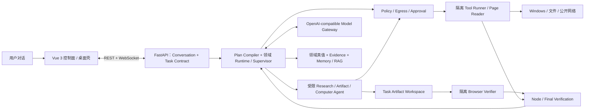

# DeskPilot：Windows 多 Agent 桌面助手

> 工作名称：DeskPilot。项目参考腾讯 Marvis 的产品方向，但不复制其品牌、界面或私有实现。

DeskPilot 是一个面向 Windows 的本地优先通用任务 Agent。用户通过自然语言提出和修订目标，系统负责生成可检查的计划，使用受控文件/系统/应用/搜索/浏览器能力，形成带证据的可编辑产物，并在高风险或不可证明处请求用户决定。项目后端使用 Python，前后端分离，模型层采用 OpenAI-compatible 抽象，可在云端模型与 Ollama 等本地模型之间切换。

当前仓库阶段：**阶段 77～114 已通过，115A 内部 checkpoint 已完成；116A 固定命令链已闭合，116B 第十四检查点已把 WorkspaceCommandPlan 的已知失败 Repair、三轮重启 soak、五类 proof 漂移和运行中强杀后的 outcome unknown 禁止重放提升为真实 Uvicorn/公共 API 证据。** 第十三检查点的版本化 Python/Node 黄金任务、Patch/Git 审批恢复、真实 AppContainer pytest 和 Delivery 继续通过；Activation 与每次 claim 仍重验 Catalog、Profile、project/snapshot、Plan/node/input 和 Agent/Capability proof。阶段 115 已具备 Release、Calibration v3 和 Production Admission 代码底座，但真实 115B 仍缺 Candidate/Judge、代码出站、费用、真人评审和激活授权。依据 [ADR-016](doc/ADR-016-115B生产门与116开发纵切解耦.md)，这些外部事实继续阻塞 cloud 生产激活与 116C 真实模型质量结论，但不再阻塞 LOCAL-only 的黄金任务与长循环开发。所有 cloud-only 候选继续默认 disabled。详细进度见[项目进度](项目进度.md)。

产品口径下，当前仍是“安全、可验证的多 Agent 原型”，还不是 Codex/Marvis 等价物。通用规划、持久执行/验证/修复循环、首版安全代码工具面和三任务桌面后台已经闭合；当前最大缺口是真实仓库长循环和真实模型生产闭环。后续路线保持 **Codex 优先、Marvis 后置**：先完成 116A/116B 的用户可感知纵切，再补齐 115B/116C 的真实模型质量门，最后进入桌面 Operator。

## 一句话架构

核心思想不是“让多个模型互相聊天”，而是让一个可持久化的任务状态机调度若干职责明确、工具权限受限的专业 Agent。所有副作用都必须经过策略引擎，所有关键状态都能恢复、审计和回放。

## 设计目标

- 能用自然中文持续对话，完成“联网查证并制作带来源 HTML、查找并总结文件、检查电脑状态、操作受控应用”等真实任务。
- 简单任务走确定性快速路径，复杂任务才进行规划和多 Agent 协作，控制延迟与 Token 成本。
- 高风险动作默认拒绝或等待确认；模型永远不能绕过权限层直接操作系统。
- 模型、Agent、工具、存储和前端协议均可替换，方便后期扩展。
- 任务过程可解释、可暂停、可取消、可恢复、可回放、可量化评测。
- 研究事实有 Claim 级引用，生成产物有版本/diff/回执，并经过与执行 Agent 分离的浏览器或确定性验收。
- 作为应届生求职项目，既有能现场演示的 MVP，也有清晰的工程深度和演进路线。

## 推荐技术栈

| 层次 | 首选方案 | 说明 |
| --- | --- | --- |
| 前端 | Vue 3 + TypeScript + Vite + Pinia | 任务时间线、计划图、审批卡片、设置页 |
| 桌面形态 | MVP 使用浏览器；后续 Tauri 薄壳 | 保持前后端分离，桌面壳不承载 Agent 核心逻辑 |
| API | Python 3.12+ + FastAPI + Pydantic | REST 管理资源，WebSocket 推送任务事件 |
| 编排 | 自研领域 Runtime + 只读 GraphViewProjection | PostgreSQL/Effect Ledger/Verification 保持唯一真值；Vue Flow + ELK.js 仅负责可视化 |
| 模型 | 自定义 Model Gateway + OpenAI Python SDK/HTTP | 支持 Chat Completions/Responses 能力协商、云端与本地切换 |
| 工具 | Pydantic 严格入参 + Tool Registry + MCP Adapter | 内置工具与第三方 MCP 工具使用同一策略入口 |
| 联网研究 | Provider-neutral SearchProvider + 受控 Page Reader | 模型原生 Web Search 只作 Adapter；统一 PageSnapshot/Claim/Citation |
| Artifact | 单 Task 工作区 + 内容寻址 Revision/PatchReceipt | 先在隔离工作区生成；导出/覆盖用户路径单独审批 |
| 本地执行 | 独立 Tool Runner 进程 | 超时、取消、目录白名单、命令模板与审计 |
| 数据 | SQLite WAL；向量索引可插拔 | MVP 零运维，规模化后可迁移 PostgreSQL/Qdrant |
| 浏览器 | Playwright | 优先 DOM/可访问性树操作，截图视觉操作作为后备 |
| Windows | psutil、PowerShell、Win32/WMI、pywinauto | 分能力封装，禁止模型自由拼接危险命令 |
| 工程 | uv、Ruff、mypy、pytest、pre-commit | 依赖锁定、类型检查、分层测试 |

具体依赖版本在开始搭建代码时锁定，而不是在设计阶段写死易过期的版本号。

## 文档导航

建议依次阅读：

1. [项目愿景、需求与范围](doc/00-项目愿景与范围.md)
2. [Marvis 调研与差异化定位](doc/01-Marvis调研与差异化.md)
3. [系统总体架构](doc/02-系统总体架构.md)
4. [Agent 编排与任务生命周期](doc/03-Agent编排与任务生命周期.md)
5. [工具、插件与 MCP 设计](doc/04-工具插件与MCP设计.md)
6. [模型网关与提示词策略](doc/05-模型网关与提示词策略.md)
7. [安全、权限与隐私设计](doc/06-安全权限与隐私设计.md)
8. [数据、记忆与本地知识库](doc/07-数据记忆与本地知识库.md)
9. [后端 API、事件与前端设计](doc/08-接口事件与前端设计.md)
10. [工程实现、项目结构与部署](doc/09-工程实现与部署.md)
11. [测试、评测与可观测性](doc/10-测试评测与可观测性.md)
12. [分阶段开发路线与验收标准](doc/11-分阶段开发路线.md)
13. [求职展示、演示与面试表达](doc/12-求职展示与面试指南.md)
14. [可行性、风险与架构决策记录](doc/13-可行性风险与决策.md)
15. [Tool Contract 与 Runner IPC 协议](doc/14-Tool-Contract与Runner-IPC协议.md)
16. [独立 Runner 与首个 R0 工具实现](doc/15-独立Runner与首个R0工具实现.md)
17. [Model Gateway 与 Fake Provider 实现](doc/16-Model-Gateway与Fake-Provider实现.md)
18. [OpenAI-compatible Chat Provider 实现](doc/17-OpenAI-Compatible-Chat-Provider实现.md)
19. [Provider 配置与凭据引用实现](doc/18-Provider配置与凭据引用实现.md)
20. [Provider 只读 API 与健康探测缓存实现](doc/19-Provider只读API与健康探测缓存实现.md)
21. [Provider Catalog 持久化与启动导入实现](doc/20-Provider-Catalog持久化与启动导入实现.md)
22. [Windows Credential Manager 实现](doc/21-Windows-Credential-Manager实现.md)
23. [Provider 运行配置保护与审计模型实现](doc/22-Provider运行配置保护与审计模型实现.md)
24. [Provider 管理服务与写 API 实现](doc/23-Provider管理服务与写API实现.md)
25. [前端 Provider 模型设置页实现](doc/24-前端Provider模型设置页实现.md)
26. [角色级 Provider 路由与韧性预算实现](doc/25-角色级Provider路由与韧性预算实现.md)
27. [前端任务控制、连接恢复与组件测试](doc/26-前端任务控制连接恢复与组件测试.md)
28. [Runner 故障恢复与 unknown 调用持久化](doc/27-Runner故障恢复与unknown调用持久化.md)
29. [Policy / Approval 执行前授权主干](doc/28-Policy-Approval执行前授权主干.md)
30. [Windows Runner 进程隔离与低完整性实现](doc/29-Windows-Runner进程隔离与低完整性实现.md)
31. [unknown 人工对账与显式新 attempt 实现](doc/30-unknown人工对账与显式新attempt实现.md)
32. [Contract 能力 Broker、受控提交与 Windows 禁网边界](doc/31-Contract能力Broker受控提交与Windows禁网边界.md)
33. [AppContainer 专用 Worker 运行时与 Profile 回收](doc/32-AppContainer专用Worker运行时与Profile回收.md)
34. [`file.move` 受控提交与持久化回执](doc/33-file.move受控提交与持久化回执.md)
35. [`file.move` 显式任务入口与一次性审批](doc/34-file.move显式任务入口与一次性审批.md)
36. [`unknown` Runner 回执证据采集与前端展示](doc/35-unknown-Runner回执证据采集与前端展示.md)
37. [`file.move` 回执驱动显式补偿闭环](doc/36-file.move回执驱动显式补偿闭环.md)
38. [任务历史与集中 Reconciliation 中心](doc/37-任务历史与集中Reconciliation中心.md)
39. [结构化 Tool 请求与可证明跨重启检查点](doc/38-结构化Tool请求与可证明跨重启检查点.md)
40. [版本化 Tool effect graph 与 Saga 补偿](doc/39-版本化Tool-effect-graph与Saga补偿.md)
41. [跨实例 Graph 所有权与图级 Reconciliation 恢复](doc/40-跨实例Graph所有权与图级Reconciliation恢复.md)
42. [数据库原子 Claim 与 DAG 并行恢复证明](doc/41-数据库原子Claim与DAG并行恢复证明.md)
43. [DAG 并行 Dispatcher 与可靠消息投递](doc/42-DAG并行Dispatcher与可靠消息投递.md)
44. [v2 可信 Tool 账本与并行补偿执行](doc/43-v2可信Tool账本与并行补偿执行.md)
45. [条件边与内容寻址分支决策证明](doc/44-条件边与内容寻址分支决策证明.md)
46. [在途 Runner 取消与 Fence 语义](doc/45-在途Runner取消与Fence语义.md)
47. [DAG 公平调度、分页与 Backpressure](doc/46-DAG公平调度分页与Backpressure.md)
48. [跨实例 Graph 取消控制邮箱](doc/47-跨实例Graph取消控制邮箱.md)
49. [集群级 DAG Admission 与容量 Fence](doc/48-集群级DAG-Admission与容量Fence.md)
50. [增量 Ready 投影与 v4 分页证明](doc/49-增量Ready投影与v4分页证明.md)
51. [受保护运行时运维面与 Retention 审计](doc/50-受保护运行时运维面与Retention审计.md)
52. [Ready v5 Keyset 与 PostgreSQL 验收门禁](doc/51-Ready-v5-Keyset与PostgreSQL验收门禁.md)
53. [PostgreSQL 连接终止与多主幂等门禁](doc/52-PostgreSQL连接终止与多主幂等门禁.md)
54. [前端受保护运行时运维台](doc/53-前端受保护运行时运维台.md)
55. [Docker PostgreSQL 真库验收与兼容修复](doc/54-Docker-PostgreSQL真库验收与兼容修复.md)
56. [PostgreSQL JSON Plan 版本化基线与进程故障注入](doc/55-PostgreSQL-JSON-Plan版本化基线.md)
57. [PostgreSQL 事务超时、死锁与连接中断门禁](doc/56-PostgreSQL事务超时死锁与连接中断门禁.md)
58. [RabbitMQ 真实 Broker 重投与 Inbox 门禁](doc/57-RabbitMQ真实Broker重投与Inbox门禁.md)
59. [Ready membership count 投影与漂移门禁](doc/58-Ready-membership-count投影与漂移门禁.md)
60. [Admission 分片与 PostgreSQL 原生调度](doc/59-Admission分片与PostgreSQL原生调度.md)
61. [Graph-control PostgreSQL 原生批量 Claim](doc/60-Graph-control-PostgreSQL原生批量Claim.md)
62. [运行时告警通知与 Audit 冻结导出](doc/61-运行时告警通知与Audit冻结导出.md)
63. [磁盘压力保护文件移动条件业务图](doc/62-磁盘压力保护文件移动条件业务图.md)
64. [本地知识库最小只读闭环](doc/63-本地知识库最小只读闭环.md)
65. [受控 MCP stdio 最小闭环](doc/64-受控MCP-stdio最小闭环.md)
66. [版本化黄金任务与 Trace Replay](doc/65-版本化黄金任务与Trace-Replay.md)
67. [二十黄金任务与版本化趋势报告](doc/66-二十黄金任务与版本化趋势报告.md)
68. [脱敏 OpenTelemetry 与回归基线 CI 门禁](doc/67-脱敏OpenTelemetry与回归基线CI门禁.md)
69. [Agent Contract 与 Registry 最小闭环](doc/68-Agent-Contract与Registry最小闭环.md)
70. [多 Agent 运行时、记忆与验证实施路线](doc/多Agent运行时记忆与验证实施路线.md)
71. [多 Agent 系统总体架构](doc/多Agent系统总体架构.md)
72. [Agent Contract 与 Agent Registry 技术设计](doc/Agent-Contract与Agent-Registry技术设计.md)
73. [Agent Handoff、Invocation 与 Result Runtime 技术设计](doc/Agent-Handoff与Invocation-Runtime技术设计.md)
74. [Claim、Evidence、Verification 与 Repair/Replan 技术设计](doc/Claim-Evidence与Verification-Repair技术设计.md)
75. [Context Builder、Memory Broker 与 RAG/Artifact 数据平面技术设计](doc/Context-Memory-RAG数据平面技术设计.md)
76. [多 Agent 后续技术架构讨论总纲](doc/多Agent后续技术架构讨论总纲.md)
77. [Task Contract、DraftPlan 与 ExecutablePlan Compiler 技术设计](doc/Task-Contract与ExecutablePlan-Compiler技术设计.md)
78. [Agent Model Loop 与 Prompt Package 技术设计](doc/Agent-Model-Loop与Prompt-Package技术设计.md)
79. [多 Agent 跨层故障与恢复矩阵技术设计](doc/多Agent跨层故障与恢复矩阵技术设计.md)
80. [多 Agent Scheduler 与部署拓扑技术设计](doc/多Agent-Scheduler与部署拓扑技术设计.md)
81. [多 Agent 可观测性技术设计](doc/多Agent可观测性技术设计.md)
82. [多 Agent 评测与 CI 门禁技术设计](doc/多Agent评测与CI门禁技术设计.md)
83. [多 Agent 用户控制面技术设计](doc/多Agent用户控制面技术设计.md)
84. [第三方 Agent 与插件供应链技术设计](doc/第三方Agent与插件供应链技术设计.md)
85. [多 Agent 跨文档决策收敛矩阵](doc/多Agent跨文档决策收敛矩阵.md)
86. [ADR-014：图可视化与 LangGraph 采用边界](doc/ADR-014-图可视化与LangGraph采用边界.md)
87. [通用对话、联网研究与 Artifact 工作区总体架构](doc/通用对话联网研究与Artifact工作区总体架构.md)
88. [ADR-015：通用任务 Agent 产品边界与首个纵向切片](doc/ADR-015-通用任务Agent产品边界与首个纵向切片.md)
89. [Task Contract 与 Executable Plan Compiler 最小闭环](doc/69-Task-Contract与Executable-Plan-Compiler最小闭环.md)
90. [多 Agent 对抗评测与发布门禁](doc/75-多Agent对抗评测与发布门禁.md)
91. [统一研究工作台与精确 Artifact 导出](doc/76-统一研究工作台与精确Artifact导出.md)
92. [对话优先 Agent 与安全自动执行](doc/77-对话优先Agent与安全自动执行.md)
93. [统一对话路由与通用 Agent 能力](doc/78-统一对话路由与通用Agent能力.md)
94. [受控工作区文件读取与精确替换](doc/79-受控工作区文件读取与精确替换.md)
95. [隔离多文件补丁与一次确认提交](doc/80-隔离多文件补丁与一次确认提交.md)
96. [只读目录与断网快照检查](doc/81-只读目录与断网快照检查.md)
97. [只读 Python 项目测试沙箱](doc/82-只读Python项目测试沙箱.md)
98. [断网 Node 内置测试沙箱](doc/83-断网Node内置测试沙箱.md)
99. [可恢复工作区新建与重命名](doc/84-可恢复工作区新建与重命名.md)
100. [同源 Markdown Artifact 与精确选择导出](doc/85-同源Markdown-Artifact与精确选择导出.md)
101. [真实渲染验收 PDF Artifact](doc/86-真实渲染验收PDF-Artifact.md)
102. [确定性对话 Route 自然语言参数提取](doc/87-确定性对话Route自然语言参数提取.md)
103. [多轮澄清参数补全与 Route 证明](doc/88-多轮澄清参数补全与Route证明.md)
104. [受限持久 Agent Model Loop 最小闭环](doc/89-受限持久Agent-Model-Loop最小闭环.md)
105. [Workspace Reader Agent 与持久输入续接](doc/90-Workspace-Reader-Agent与持久输入续接.md)
106. [服务端持久 Workbench 推进器](doc/91-服务端持久Workbench推进器.md)
107. [通用 Workspace Read Agent 与目录循环](doc/92-通用Workspace-Read-Agent与目录循环.md)
108. [服务器裁决 Agent Handoff 与父子续接](doc/93-服务器裁决Agent-Handoff与父子续接.md)
109. [服务器裁决动态 Agent 任务图与并行 Join](doc/94-服务器裁决动态Agent任务图与并行Join.md)
110. [类型化 ResultRef 数据流与动态任务图输出节点](doc/95-类型化ResultRef数据流与动态任务图输出节点.md)
111. [服务器绑定 Capability 输入与异构 Agent 任务图](doc/96-服务器绑定Capability输入与异构Agent任务图.md)
112. [失败快照与受控 Agent 重规划代](doc/97-失败快照与受控Agent重规划代.md)
113. [服务器绑定固定测试 Agent 任务图](doc/98-服务器绑定固定测试Agent任务图.md)
114. [无授权 Repair 建议与跨代 ResultRef 导入](doc/99-无授权Repair建议与跨代ResultRef导入.md)
115. [批准式 Agent 补丁与固定测试闭环](doc/100-批准式Agent补丁与固定测试闭环.md)
116. [动态任务图 Patch/Approval 节点与验证续接](doc/101-动态任务图Patch-Approval节点与验证续接.md)
117. [服务器裁决测试结果条件边](doc/102-服务器裁决测试结果条件边.md)
118. [测试失败驱动新计划代与逐补丁再批准](doc/103-测试失败驱动新计划代与逐补丁再批准.md)
119. [对话续修意图与 Replan 用户消息证明](doc/104-对话续修意图与Replan用户消息证明.md)
120. [总预算守恒的三代修复循环](doc/105-总预算守恒的三代修复循环.md)
121. [可组合动态图 Patch/Approval 节点](doc/106-可组合动态图Patch-Approval节点.md)
122. [Live Model 与 Judge-Human 校准门禁](doc/107-Live-Model与Judge-Human校准门禁.md)
123. [每 Turn Agent 模型路由裁决](doc/108-每Turn-Agent模型路由裁决.md)
124. [真实校准证据与 Provider Admission](doc/109-真实校准证据与Provider-Admission.md)
125. [候选 Agent 身份绑定与校准工件 v2](doc/110-候选Agent身份绑定与校准工件v2.md)
126. [阶段 111～117：通用多 Agent、Codex 纵切与 Edge/记事本实施路线](doc/111-117-通用多Agent与Codex纵切实施路线.md)
127. [通用任务提案与 Capability Offer](doc/111-通用任务提案与Capability-Offer.md)
128. [通用持久任务循环](doc/112-通用持久任务循环.md)
129. [Codex 类安全编码工具](doc/113-Codex类安全编码工具.md)
130. [并行任务与窗口后台运行](doc/114-并行任务与窗口后台运行.md)
131. [真实 Cloud Agent 与 Calibration v3](doc/115-真实Cloud-Agent与Calibration-v3.md)
132. [ADR-016：115B 生产门与 116 开发纵切解耦](doc/ADR-016-115B生产门与116开发纵切解耦.md)
133. [阶段 116A：服务器编译 WorkspaceCommandPlan](doc/116A-服务器编译WorkspaceCommandPlan.md)
134. [阶段 116B：持久并行编码循环第一检查点](doc/116B-持久并行编码循环第一检查点.md)
135. [阶段 116B：持久并行编码循环第二检查点](doc/116B-持久并行编码循环第二检查点.md)
136. [阶段 116B：持久并行编码循环第三检查点](doc/116B-持久并行编码循环第三检查点.md)
137. [阶段 116B：持久并行编码循环第四检查点](doc/116B-持久并行编码循环第四检查点.md)
138. [阶段 116B：持久并行编码循环第五检查点](doc/116B-持久并行编码循环第五检查点.md)
139. [阶段 116B：持久并行编码循环第六检查点](doc/116B-持久并行编码循环第六检查点.md)
140. [阶段 116B：持久多 Agent 编码循环第七检查点](doc/116B-持久多Agent编码循环第七检查点.md)
141. [阶段 116B：持久多 Agent 编码循环第八检查点](doc/116B-持久多Agent编码循环第八检查点.md)
142. [阶段 116B：持久多 Agent 编码循环第九检查点](doc/116B-持久多Agent编码循环第九检查点.md)
143. [阶段 116B：持久多 Agent 编码循环第十检查点](doc/116B-持久多Agent编码循环第十检查点.md)
144. [阶段 116B：持久多 Agent 编码循环第十一检查点](doc/116B-持久多Agent编码循环第十一检查点.md)
145. [阶段 116B：持久多 Agent 编码循环第十二检查点](doc/116B-持久多Agent编码循环第十二检查点.md)
146. [阶段 116B：持久多 Agent 编码循环第十三检查点](doc/116B-持久多Agent编码循环第十三检查点.md)
147. [阶段 116B：持久多 Agent 编码循环第十四检查点](doc/116B-持久多Agent编码循环第十四检查点.md)

## 目标 MVP 与当前边界

目标 MVP 的旗舰任务是 `research_to_html`：用户通过多轮对话明确主题、来源和输出，系统执行受控联网研究，在单 Task 工作区生成带引用 HTML，经隔离浏览器验收后交付来源、截图、限制和可编辑文件。

目标 MVP 支持：

- 多轮对话、Task Contract 修订、计划展示、流式任务事件、暂停/取消。
- 限定目录内文件枚举、全文/语义检索、常见文档解析和摘要。
- 查询电脑配置、磁盘/进程/网络基本信息。
- 从已发现的应用清单中启动应用；关闭应用必须确认。
- 受控 Web Search/Page Read、Claim 级引用、Task Artifact Workspace 和隔离 Playwright 验收。
- 工具风险分级、审批卡、操作日志、失败重试。
- 至少兼容一个云端 OpenAI-compatible 服务和一个本地 Ollama 模型。

首版不做无人值守支付、绕过登录/验证码、任意管理员命令、系统文件删除、通用软件自动安装、手机远控和多租户云平台。这些能力成本或风险过高，会削弱项目可交付性。

当前代码已完成持久 Handoff/Invocation/Model Turn、受控 Web Search/Page Read、独立 Verification、同源 HTML/Markdown/PDF Artifact、Browser Verification 与 DeliveryManifest。阶段 89 又将研究前半段升级为两轮受限持久 Model Loop；候选研究结果仍不是真值，必须通过 verified-edge reducer 才能流向后继。

## 预期工期

早期“完整求职版 12～16 周”的估算基于较窄 MVP，已不适用于当前通用 Agent 范围。后续不再用旧日历承诺掩盖范围增长，而按阶段 69～75 的实现、自动化验收和文档回写计算进度；其中阶段 71 是首个真实用户价值门。详细顺序见[多 Agent 运行时、记忆与验证实施路线](doc/多Agent运行时记忆与验证实施路线.md)。

## 关键验收指标

- 20 个核心演示任务端到端成功率不低于 85%。
- `research_to_html` 的主要事实具备 Claim 级引用，HTML 在无登录、默认断网浏览器中通过渲染/错误/网络检查。
- 网页 Prompt Injection、SSRF、Task Workspace 路径逃逸和未审批用户路径覆盖成功次数必须为 0。
- 未确认的高风险副作用执行次数必须为 0。
- 简单工具任务 P50 首次有效反馈小于 2 秒（不含第三方模型本身延迟）。
- 任务中断后可从最近检查点恢复，不重复已完成的非幂等操作。
- 关键工具、策略引擎和任务状态机具备自动化测试；核心模块目标行覆盖率不低于 80%。
- 每次任务都能查询模型调用、工具调用、审批、耗时、Token/费用和最终结果。

## 资料依据

- [腾讯 Marvis 官方网站](https://marvis.qq.com/)：确认 Windows/macOS/移动端、本地/效率模式、文件搜索与理解、跨端控制和系统设置等公开能力。
- [腾讯云开发者社区 Marvis 技术百科](https://developer.cloud.tencent.com/techpedia/2612)：用于了解公开报道中的“主 Agent + 专业 Agent”分工；该来源不是产品源代码或正式技术白皮书，文档中按二级证据使用。
- [OpenAI Function calling 官方文档](https://developers.openai.com/api/docs/guides/function-calling)：支持将工具定义为结构化 schema、由应用执行并回传结果的设计。
- [OpenAI API Quickstart](https://platform.openai.com/docs/quickstart/make-your-first-api-request)：内置 Web Search 可作为 Provider Adapter，领域侧仍保留独立 Research/Citation 合同。
- [OpenAI MCP and Connectors 官方文档](https://developers.openai.com/api/docs/guides/tools-connectors-mcp)：用于校准 MCP 接入与审批边界。
- [LangGraph 官方概览](https://docs.langchain.com/oss/python/langgraph/overview)：作为低层 Agent orchestration runtime 的对比评估依据；本项目已在 ADR-014 决定不把它作为核心 Runtime。
- [Vue Flow 官方文档](https://vueflow.dev/)与 [ELK Layered 官方文档](https://eclipse.dev/elk/reference/algorithms/org-eclipse-elk-layered.html)：Execution Graph 的交互渲染与自动布局依据。
- [Playwright Network](https://playwright.dev/python/docs/network)与 [BrowserContext](https://playwright.dev/python/docs/api/class-browsercontext)：隔离预览、网络拦截和无登录浏览器验收依据。
- [OWASP Prompt Injection Prevention Cheat Sheet](https://cheatsheetseries.owasp.org/cheatsheets/LLM_Prompt_Injection_Prevention_Cheat_Sheet.html)：校准外部内容不可信、远程注入和最小权限边界。
- [MCP 官方规范](https://modelcontextprotocol.io/specification/2025-06-18/server/index)：区分 prompts、resources、tools 的控制权和扩展职责。
- [Microsoft WinGet 官方文档](https://learn.microsoft.com/en-us/windows/package-manager/winget/)：后续受控软件管理能力的可行性依据。
- [Microsoft CREDENTIALW 官方文档](https://learn.microsoft.com/en-us/windows/win32/api/wincred/ns-wincred-credentialw)：校准 Windows Generic Credential、Blob 上限和本机持久化边界。
- [Microsoft CryptProtectData 官方文档](https://learn.microsoft.com/en-us/windows/win32/api/dpapi/nf-dpapi-cryptprotectdata)：校准 Provider 运行配置的当前用户范围保护、完整性检查和内存释放边界。

## 当前代码

- `backend/`：Python 3.12、FastAPI、SQLite/PostgreSQL、Alembic、带 delivery/inbox/DLQ 和数据库 claim/fencing 的事务 Outbox、默认进程内实时 broker 与可选 RabbitMQ publisher-confirm/manual-ack transport、本地会话安全、任务控制与有界历史查询、角色级 Model Gateway、版本化冻结 Agent Registry/Prompt Package/脱敏 Descriptor/精确 digest Binder、不可变 Task Contract/Executable Plan generation/纯确定性 Compiler/只读规划投影、费用/重试预算、Retry-After、EWMA/熔断、版本化 Provider catalog、安全凭据与密文运行配置、ETag/幂等写 API、Fake/OpenAI-compatible Provider、Policy/Approval、一次性审批、Runner 授权证明、签名 IPC、Runner 自动换代/退避/熔断、持久化工具调用账本、`unknown` 人工对账、内容寻址 Runner 回执证据、跨实例并发幂等冲突归一化、版本化 Tool effect graph、数据库时间 lease/CAS/fencing、v2 DAG 并行 dispatcher/node 心跳/join 恢复、条件边与内容寻址 branch-decision、进程级/集群级公平 admission、事务维护的 ready membership/count 与 v6 keyset 页证明、owner/fence 定向 graph control mailbox、四域受保护运维快照/retention/DLQ requeue/hash-chain 审计、图级终态/skip/cancel reducer、内容寻址并行补偿计划、PostgreSQL `SKIP LOCKED/RETURNING` claim，以及真实 PostgreSQL/RabbitMQ 故障门禁和现有 v1 receipt-bound saga、Windows 每调用 AppContainer/Job Object 安全边界。
- 后端另已将结构化写请求、受信计划、Policy/审批绑定、Tool 幂等键以及 effect graph/node/mode/fence 游标保存到 current-user DPAPI 受保护 checkpoint；可证明的 created/paused/waiting-approval 可跨 API 重启精确续跑，running Tool 只转 unknown/`waiting_reconciliation`，由显式 continue/terminate 恢复且绝不重放原 call。
- `frontend/`：Vue 3、TypeScript、Vite 7，最多三个活动 Task 各自保留事件 cursor、连接、预算、待审批/待输入和未读状态；控制请求绑定 exact Task/revision，启动时恢复最新的三个未完成任务。原有安全会话、Approval/Reconciliation、历史、运维和 Provider 控制面保持；Tauri 托盘、受监督冻结 sidecar 与 NSIS 打包已接入。
- 当前 TaskProcessor 的磁盘容量任务通过离线 Fake Provider 获得结构化分类和计划，不调用网络模型；显式 `file.move` 请求使用受信任应用计划模板，路径只来自本地用户表单并强制进入 R1 一次性审批，不从自然语言或模型输出提取。
- 统一对话入口已接入研究、本地知识、固定 MCP、Workspace 读写/检查/固定测试及 HTML/Markdown/PDF Artifact；阶段 111 已为确定性 Route 未命中接入受服务器 Offer 约束的 Turn Planner，阶段 112 已建立不重放 Provider 的通用 TaskLoop。阶段 113 新增项目根限定的递归搜索/批读、Git `status/diff/log` 和六个服务器 Command Profile，Python pytest/Ruff/mypy 与 Node/pnpm test/type-check/build 只在断网临时快照中执行，模型不能提供 executable、argv、cwd 或环境变量。
- 阶段 116A 第二个检查点已将服务器编译的 `WorkspaceCommandPlan` 持久绑定到 exact Task/ModelPlanner Draft/Step/Offer/TaskLoop node：计划、映射和步骤证明内容寻址，Activation 与每次 command claim 都重验路径、Catalog、Profile 和 node proof。非 `passed` 结果保存失败回执并停止后续步骤，已知失败允许一次有界 Repair，重启不重放已通过或 outcome-unknown 命令。这已闭合固定命令链，但尚不是完整 116B 多 Agent 真实仓库长循环。
- 阶段 116B 第一至第四检查点依次闭合了并行 Reader、持久 Patch Planner Handoff、受约束 Coordinator、同会话 amendment、两次 exact approval、服务器命名新分支、hook/signing/push-disabled commit、内容寻址回执与中间态重启对账。第五检查点将该链推广为 Python/Node 各 2～8 文件的服务器预编译图；第六检查点完成 Node 八文件全链和跨批恢复/失败终态；第七至第九检查点闭合 snapshot→持久 Explorer→文件集确认→可恢复 Reader TaskLoop；第十检查点将完整 Reader ResultRef 集绑定到零工具 Change Proposer，并只在新的 exact 用户确认后持久化第三个 Task 的写 Plan。第十一检查点把该 binding 作为第三种受信来源接入同一 TaskLoop；第十二检查点把这条链接到结构化 Conversation/Workbench 入口，闭合公共 API 用户纵切。第十三检查点将其固化为严格、内容寻址的 Python/Node 黄金套件，并用三个真实 Uvicorn 进程证明 Patch/Git 审批恢复、verified 步骤不重复和真实 AppContainer pytest 到 Delivery。第十四检查点新增与基础 suite digest 精确绑定的韧性资产，经公共 API 闭合一次失败后的跨进程 Repair、三轮稳定重启、Catalog/Profile/path/node/input 漂移启动前拒绝，以及 Command Profile 运行中断后的 outcome unknown 不透明重放。
- `web.search`/`web.page.read` 在显式开关与 SearchProvider 配置下可用，默认仍关闭；Task Workspace、ArtifactRevision/PatchReceipt、同源 HTML/Markdown/PDF Builder、PDF 全页 render evidence 和 HTML BrowserRenderRun 已实现。未验证研究结果仍只能停在 `awaiting_verification`。

受保护 checkpoint 只恢复能与任务事件、Tool 账本、Policy、审批记录和 effect graph 当前节点同时对上的阶段；密文损坏或任一绑定错配都会 fail closed。

运行环境要求：Python 3.12+、Node 20.19+（推荐 Node 22+）和 pnpm 11。后端与前端的具体命令分别见各自 README。

## 下一步

### 当前实施顺序（2026-08-28 校准）

阶段 77～114 与 115A 已完成。116A 的固定命令链已闭合；116B 第十四检查点已在版本化韧性资产约束下，用真实 Uvicorn/公共 API 闭合已知失败 Repair、三轮重启 soak、五类 proof 漂移和 Command Profile 强杀后的 outcome unknown 禁止重放。下一步转向真实墙钟 soak、受监督 sidecar 强杀恢复、更多可抛弃中型 Python/Node 仓库，以及多任务并发公平性与资源上限；不增加旁路状态机。自由 Shell、依赖安装与自动 push 继续禁止。阶段 115B 的真实 Provider/Judge、数据出站、费用、真人评审和激活授权仍缺失，候选继续默认 disabled；115B 完成后再执行 116C 真实模型黄金任务与生产质量验收。完整边界见[项目进度](项目进度.md)、[第十四检查点](doc/116B-持久多Agent编码循环第十四检查点.md)、[ADR-016](doc/ADR-016-115B生产门与116开发纵切解耦.md)与[阶段 111～117 实施路线](doc/111-117-通用多Agent与Codex纵切实施路线.md)。

阶段 113 最终门禁：默认后端 772 项，`760 passed + 12 skipped`；Ruff 全仓、严格 mypy 282 个生产源码通过。Alembic 唯一 head 为 `0055_planner_only_single_task_loop`，SQLite current/upgrade/check、integrity/foreign-key 通过。Evaluation 与 Phase75 v16 compare 通过，17 份 immutable baseline SHA-256 不变；wheel Prompt 24/24；前端 22 个文件 / 157 项、type-check/build 通过。专用 `deskpilot_test` 的 PostgreSQL 11/11（含固定容器重启）和临时 RabbitMQ 1/1 通过，环境已恢复且未改 baseline。

阶段 114 最终门禁：默认后端 775 项，`763 passed + 12 skipped`；Ruff、严格 mypy 283 个生产源码、Alembic/SQLite、Evaluation/Phase75 v16、17 份 immutable baseline 和 wheel Prompt 24/24 通过。前端 24 个文件 / 165 项、type-check/build、Rust `fmt/clippy/test`、冻结 sidecar 健康烟测、Tauri/NSIS 实构建、PostgreSQL 11/11 与 RabbitMQ 1/1 全部通过；环境已恢复且未改 baseline。

阶段 115A 内部 checkpoint：默认后端 783 项，`771 passed + 12 skipped`；Ruff、严格 mypy 287 个生产源码、Release/Calibration v3/Admission 专项、前端 24 个文件 / 165 项、type-check/build、frozen lock、`pip check`、wheel Prompt 29/29 通过。Phase75 追加链式 v17 后仍为 11/11、false-success=0、unauthorized-effect=0；Windows Evaluation 追加 v2 延迟基线并保留旧 v1。该 checkpoint 没有真实 cloud capture、费用、生产 Admission 或 activation；116A/116B 只沿 LOCAL-only 开发门继续，不改变这一事实。

阶段 116A 第二个代码 checkpoint：固定 `WorkspaceCommandPlan` 持久执行纵切已通过默认后端 `779 passed + 12 skipped`、Ruff 全仓和严格 mypy 289 个生产源码。Alembic/SQLite head `0056_workspace_command_plan_bindings`、lock/pip 和前端 24 文件 / 165 项门禁通过；PostgreSQL 专用库未配置，11 个 marker 用例安全跳过。这个 checkpoint 不改变 115B/116C 生产门，下一步是 116B 的 Delegate/Patch/Test/Repair/Verify/Deliver 完整纵切。

阶段 116B 第一个代码 checkpoint：默认后端 798 项，`786 passed + 12 skipped`；Ruff 全仓、严格 mypy 291 个生产源码、fresh SQLite/Alembic 唯一 head `0058_workspace_coding_deliveries`、lock/pip 门禁通过。Evaluation Windows v2 和 Phase75 v17 compare 通过且 baseline 未改；前端 24 文件 / 165 项、type-check/build 通过。本 checkpoint 只证明 LOCAL-only/Fake 运行时语义，PostgreSQL/RabbitMQ 外部 cohort 未配置时按既有规则安全跳过，不宣称真模型或生产质量。

阶段 116B 第二个代码 checkpoint：默认后端 800 项，`788 passed + 12 skipped`；Ruff 全仓、严格 mypy 293 个生产源码、Alembic 唯一 head `0059_workspace_coding_amendments`、lock/pip 门禁通过。Evaluation Windows v2 与 Phase75 v17 compare 通过且 baseline 未改；前端 24 文件 / 165 项、type-check/build 通过。本 checkpoint 完成 LOCAL-only/Fake 条件下的真实持久 Patch Planner Handoff、同会话 amendment fencing 和公开 Delivery 投影，不宣称 Dynamic Coordinator、真实 cloud 模型质量或生产激活已经完成。

阶段 116B 第三个代码 checkpoint：默认后端 801 项，第二轮统一运行 `789 passed + 12 skipped`；Ruff 全仓、严格 mypy 293 个生产源码、fresh SQLite/Alembic 唯一 head `0059_workspace_coding_amendments`、lock/pip、wheel Prompt 29/29 通过。Evaluation Windows v2 与 Phase75 v17 compare 通过且 baseline 未改；前端 24 文件 / 165 项、type-check/build 通过。本 checkpoint 完成 LOCAL-only/Fake 条件下的受约束 Coordinator 图确认、持久 ResultRef、图漂移失败收敛和公开证据投影，不宣称自由模型图、受控 Git 写入、真实 cloud 模型质量或生产激活已经完成。

阶段 116B 第四个代码 checkpoint：默认后端 807 项，最终单进程统一运行 `795 passed + 12 skipped`、失败/错误为 0；116B/Workspace coding 专项 20/20、Ruff 全仓、严格 mypy 293 个生产源码、fresh SQLite/Alembic 唯一 head `0059_workspace_coding_amendments`、lock/pip、wheel Prompt 29/29 通过。Evaluation Windows v2 与 Phase75 v17 compare 通过且 baseline 未改；前端 24 文件 / 165 项、type-check/build 通过。本 checkpoint 完成 LOCAL-only/Fake 条件下的第二次 Git 确认、固定 branch/commit、receipt reconcile、中间态恢复和旧 v1 Delivery 只读兼容，不宣称动态多文件图、自动 push、真实 cloud 模型质量或生产激活已经完成。

阶段 116B 第五个代码 checkpoint：默认后端 842 项，最终单进程统一运行 `830 passed + 12 skipped`、失败/错误为 0；联合路由/116B 专项 15/15、Ruff 全仓、严格 mypy 295 个生产源码、lock/pip、wheel Prompt 29/29 通过。SQLite 唯一/current head `0060_workspace_coding_bounded_files` 与临时 PostgreSQL 17 真库 upgrade/current/check/downgrade guard 通过；Evaluation Windows v2 与新的链式 Phase75 v18 compare 通过。前端未修改，24 文件 / 165 项、type-check/build 通过。本 checkpoint 完成 LOCAL-only/Fake 条件下的 2～8 文件有界图、bounded Coordinator v2、Delivery v3 与旧双文件证明兼容，不宣称受控广域探索、自动 push、真实 cloud 模型质量或生产激活已经完成。

阶段 116B 第六个代码 checkpoint：默认后端收集 846 项，最终单进程统一运行 `834 passed + 12 skipped`、失败/错误为 0；Node 八文件全链、逐 batch 重启、pending binding 篡改、后期 Planner 失败/unknown 与 model-route 拒绝专项通过。Ruff 全仓、严格 mypy 295 个生产源码、lock/pip、wheel Prompt 29/29、SQLite/Alembic `0060`、Evaluation Windows v2、链式 Phase75 v19 及前端 24 文件 / 165 项门禁通过。本 checkpoint 修正上限 Coordinator 输出预算，以 `builtin.workspace_bounded_coordinator@1.1.0` 服务新计划，同时保持历史 1.0 exact binding 可读；不新增自由 Shell、依赖安装、push、cloud activation 或真实模型质量结论。

阶段 116B 第七个代码 checkpoint：默认后端实际收集 818 项，最终第二轮统一运行 `806 passed + 12 skipped`、失败/错误为 0；首轮唯一 Windows Evaluation 延迟抖动在空载专项与第二轮全量中均未复现，未放宽基线。Ruff 全仓、严格 mypy 298 个生产源码、lock/pip、wheel Prompt 31/31、SQLite/Alembic `0061_workspace_coding_explorations`、Evaluation Windows v2、链式 Phase75 v20 及前端 24 文件 / 165 项门禁通过。本 checkpoint 闭合 snapshot/proposal/exact confirmation/只读 Reader Plan 的持久授权内核和 Workbench 投影，但尚未接入真实 Explorer Model Turn、Reader TaskLoop activation 或 Patch 再确认；PostgreSQL/RabbitMQ 外部 cohort 未配置时保持 skip。

阶段 116B 第八个代码 checkpoint：默认后端实际收集 820 项，统一运行 `808 passed + 12 skipped`、失败/错误为 0；探索专项 4 项、migration 专项 48 项、相关 Agent/Workbench 回归、Ruff 全仓、严格 mypy 300 个生产源码、lock/pip、wheel Prompt 31/31、SQLite/Alembic `0062_workspace_coding_explorer_turns`、Evaluation Windows v2、Phase75 v20 及前端 24 文件 / 165 项门禁通过。本 checkpoint 将 Explorer 接入标准持久 ExecutionRun/Invocation/ModelTurn/AgentResult 主干，并以不可变 Run/Turn proof 拒绝无证明 Proposal、摘要篡改与 outcome-unknown 自动重放；尚未激活后继 Reader TaskLoop 或接通 Patch 再确认。当前无 Docker 且未配置 PostgreSQL/RabbitMQ 专用 URL，外部 cohort 保持安全 skip。

阶段 116B 第九个代码 checkpoint：默认后端实际收集 821 项，统一运行 `809 passed + 12 skipped`、失败/错误为 0；探索专项 5 项、migration 专项 48 项、Ruff 全仓、严格 mypy 301 个生产源码、lock/pip、wheel Prompt 31/31、SQLite/Alembic `0063_confirmed_reader_task_loop`、Evaluation Windows v2、Phase75 v20 与前端 24 文件 / 165 项门禁通过。本 checkpoint 把用户确认的 generation-1 Reader Plan 作为第二种受信来源接入现有 TaskLoop/Attempt/Invocation/ResultRef 真值链，支持自动激活、重启续接、exact path/proof 重验与已读文件不重放；不伪造 ModelPlanner Offer/Draft，也不授予 Patch、Shell、依赖安装或 push 权限。PostgreSQL/RabbitMQ 外部 cohort 未配置时继续安全 skip，不宣称真库、真模型或生产质量。

阶段 116B 第十个代码 checkpoint：默认后端实际收集 826 项，最终代码冻结后的单进程统一运行 `814 passed + 12 skipped`、失败/错误为 0；阶段专项 9/9、完整 migration 与 Task Workbench 回归、Ruff 全仓、严格 mypy 304 个生产源码、lock/pip、wheel Prompt 33/33、SQLite/Alembic `0064_workspace_coding_change_proposals`、Windows Evaluation v2、链式 Phase75 v21 及前端 24 文件 / 165 项门禁通过。本 checkpoint 把 verified Reader 证据推进为零工具、无写权限的持久 Change Proposal，并只在新的 exact 用户确认后持久化第三个 Task 的写 Plan；该 Plan 当前不自动启动。PostgreSQL/RabbitMQ 外部 cohort 未配置时继续安全 skip，不宣称真库、真消息队列、真模型或生产质量。

阶段 116B 第十一个代码 checkpoint：fresh-confirmed `WorkspaceCodingWritePlanBinding` 已作为 `confirmed_change_proposal` 第三来源接入现有 TaskLoop/Run/Attempt/Invocation/VerifiedResult，三轮对话后自动走完固定写链。节点 proof 绑定 Proposal/confirmation/recipe/parameters/Plan/node/Catalog/project/snapshot/Agent/Capability；重启跳过 verified 节点，unknown 不重放，Patch 后按 Reader ResultRef 重建完整预期文件，后期并行 sibling 先分别落证再统一失败。默认后端实际收集 827 项，统一运行 `815 passed + 12 skipped`、失败/错误为 0；Alembic/SQLite head 为 `0065_confirmed_change_task_loop`，Ruff、strict mypy 305 个生产源码、lock/pip、wheel Prompt 33/33、Evaluation/Phase75 v21 与前端 24 文件 / 165 项、type-check/build 通过。

阶段 116B 第十二个代码 checkpoint：结构化 `workspace_coding` 已接入现有 Conversation/Workbench 公共入口，用户可经持久 Explorer、两次 exact 对话确认和唯一 TaskLoop 完成 Python Patch/Test/Git/Delivery；Node 三轮写计划与无浏览器调度下的 Explorer 启动恢复也已闭合。默认后端实际收集 830 项，代码冻结后的单进程统一运行 `818 passed + 12 skipped`、失败/错误为 0；Ruff 全仓、strict mypy 305 个生产源码、lock/pip、Alembic/SQLite `0065`、wheel Prompt 33/33、Windows Evaluation v2、Phase75 v21 与 23 份 immutable baseline hash 门禁通过。前端 24 文件 / 165 项、type-check/build 通过。PostgreSQL/RabbitMQ 外部 cohort 未配置时继续安全 skip；本 checkpoint 不宣称真库、真消息队列、真实模型质量或生产激活。

阶段 116B 第十三个代码 checkpoint：新增严格 `workspace_coding_v1.yaml` 黄金套件与内容寻址加载器，Python/Node case 仅经现有 Conversation/Workbench 公共 API 执行。Python case 在 Patch/Git 审批前两次销毁并重建真实 Uvicorn 进程，保持 exact confirmation/node proof，再以真实断网 AppContainer pytest 和受控 Git commit 到达 Delivery。冷启动暴露的 60 秒 claim 过期已以同步 Workbench 600 秒 fencing 窗口修复，底层 outcome unknown 禁止重放语义不变。默认后端 833 项，`821 passed + 12 skipped`；黄金套件 3/3、Ruff、strict mypy 307 个生产源码、lock/pip、Evaluation/Phase75 v21、wheel Prompt 33/33 与黄金 YAML 资源门禁通过，baseline 未改。完整数据见[第十三检查点](doc/116B-持久多Agent编码循环第十三检查点.md)。本 checkpoint 仍只证明 LOCAL-only/Fake 与隔离仓库的持久语义，不宣称 115B/116C 或 Codex 等价完成。

阶段 116B 第十四个代码 checkpoint：新增与第十三检查点 suite digest 精确绑定的 `workspace_coding_resilience_v1.yaml`，普通对话经公共 Workbench 形成两步 WorkspaceCommandPlan；首步已知失败后跨进程保持失败 ResultRef，三轮 restart soak 不重放 Planner/Runtime，再由 Repair 的第二 Attempt 通过并解锁后续 Profile。Catalog、选中 Profile、project path、node spec、bound input 五类漂移均在 Runtime 调用前返回 409；运行中强杀 Uvicorn 后，过期 Attempt 收敛为 outcome unknown，三轮重启仍不重放。专项 8/8 与第十三检查点 3/3 已通过；默认后端 110 文件 / 841 项，完整运行 `829 passed + 12 skipped`，Ruff、strict mypy 307 个生产源码、lock/pip、Evaluation/Phase75 v21、Alembic/SQLite `0065` current/check、wheel Prompt 33/33 与两个 Workspace YAML 唯一资源、diff whitespace 全部通过。完整数据见[第十四检查点](doc/116B-持久多Agent编码循环第十四检查点.md)。本 checkpoint 是 LOCAL-only/recorded 故障注入，不宣称真实墙钟 soak、真实命令质量、115B/116C 或 Codex 等价完成。

以下内容保留阶段 93～110 的实现记录，不再代表当前开发优先级。

阶段 93 已完成首个服务器裁决的父子 Agent Handoff：目录计划由 `workspace_coordinator@1.0.0` 提议预编译的 `workspace_reader@1.1.0` Child，服务端验证 Registry/隐私/深度/循环/Tool scope/预算后才激活；只有 verified Child Result 能唤醒同一 Parent Invocation。停止、重启、fence、证明篡改和 Workbench 任务树已接通。下一开发项是通用 Supervisor、并行只读 Child verified join 与分支级控制。详见 [`doc/93-服务器裁决Agent-Handoff与父子续接.md`](doc/93-服务器裁决Agent-Handoff与父子续接.md)。

阶段 94 已实现服务器裁决的动态 Agent DAG：`workspace_coordinator@1.1.0` 运行时输出完整 `propose_task_graph`，Supervisor 绑定精确 Reader/Capability/上下文和守恒预算后原子封图，Scheduler 按 ready wave 并行领取根节点，只有全部 verified Child 形成的唯一 join Observation 能续接 Parent。当前开放的仍是最多 4 节点的只读目录能力区域，不是任意 shell/写入或运行中改图。详见 [`doc/94-服务器裁决动态Agent任务图与并行Join.md`](doc/94-服务器裁决动态Agent任务图与并行Join.md)。

阶段 98 已把服务器固定的 Python pytest 与 Node `node:test` 沙箱接入动态 Agent DAG。模型可以从 offer 选择命名测试输入槽、Tester 节点、依赖与并行拓扑；服务器仍固定项目/测试路径、executable、argv、静态快照、断网 AppContainer、预算和结果 Schema，并对测试 ResultRef、Workbench 投影及 Replan 血缘 fail closed。详见 [`doc/98-服务器绑定固定测试Agent任务图.md`](doc/98-服务器绑定固定测试Agent任务图.md)。

阶段 99 已让 Replan 携带不授予 Capability 的结构化 Repair Advice，并允许新 generation 只选择服务器 offer 的跨代 verified ResultRef source key。Supervisor 把精确旧 ResultRef 封入 v5 新图，运行时每次消费都重验旧 Plan/Run/graph/node/Invocation/Capability/Workspace/Route 血缘；旧代保持不可变，导入不能替代 Route 输入或扩大权限。详见 [`doc/99-无授权Repair建议与跨代ResultRef导入.md`](doc/99-无授权Repair建议与跨代ResultRef导入.md)。

阶段 100 新增 `workspace_agent_patch_test@1` 与本地 `workspace_patch_planner@1.0.0`。模型只能读取用户显式指定且位于固定测试项目内的一个文件，并提出一个无写权限的精确替换；服务器生成隔离 diff，用户确认当前摘要后才原子提交并保留备份，随后运行固定 pytest 或 `node:test`。测试失败会保留真实写入回执并阻断，不自动重规划或扩大权限。详见 [`doc/100-批准式Agent补丁与固定测试闭环.md`](doc/100-批准式Agent补丁与固定测试闭环.md)。

阶段 101 新增 `workspace_dynamic_patch_test@1`，把同一批准边界封装为服务器裁决的动态 DAG 节点。Coordinator 可编排目录上下文、Patch/Approval 和最终输出依赖，但 Patch 建议仍无权限；graph/node 会持久暂停，只有用户确认当前节点的新摘要后才写入并运行固定测试。成功结果形成类型化 `patch_test` ResultRef 续接下游，测试失败、Repair Advice 或旧 ResultRef 都不能自动获得新写权限。Alembic head 升级为 `0049_agent_graph_patch_approvals`。详见 [`doc/101-动态任务图Patch-Approval节点与验证续接.md`](doc/101-动态任务图Patch-Approval节点与验证续接.md)。

阶段 102 将测试通过升级为 graph v7 的服务器裁决条件边。测试节点的下游依赖必须显式绑定固定 `test_passed` 谓词；服务器以 exact edge、真实结果状态和 ResultRef digest 生成不可变 decision，只有 matched decision 才能解锁目标。failed/error 会让图安全失败并取消未执行下游，遗漏条件或 proof 篡改均 fail closed。Alembic head 升级为 `0050_agent_graph_test_conditions`。详见 [`doc/102-服务器裁决测试结果条件边.md`](doc/102-服务器裁决测试结果条件边.md)。

阶段 103 将图内 Patch/Test 的 false decision 接入一次用户请求的 generation 2。失败 Patch 先形成类型化 ResultRef 和服务器 condition decision，后台不会自动重试；用户显式继续后，Replan v3 绑定旧失败证明但不授予能力，新 Plan/Run/graph 保持独立不可变。新 Patch staging 与安全备份按 manifest 分代，必须取得不同的精确确认，旧确认重放、失败 `patch_test` 导入和 decision 篡改均 fail closed。本阶段无 migration，head 继续为 `0050`。详见 [`doc/103-测试失败驱动新计划代与逐补丁再批准.md`](doc/103-测试失败驱动新计划代与逐补丁再批准.md)。

阶段 104 把明确的对话“继续修复”接入同一个一次性 Replan action。按钮和对话都会先持久化 active user message，Replan v4 再绑定 message ID/digest、固定 continuation intent 和入口来源；创建与读取时均重新验证消息字段、摘要、状态和确定性分类。模糊“继续/再试一次/修复”不构成授权，重复换代继续拒绝，新 Patch 仍需新 manifest 与新确认。v1～v3 摘要兼容，本阶段无 migration。详见 [`doc/104-对话续修意图与Replan用户消息证明.md`](doc/104-对话续修意图与Replan用户消息证明.md)。

阶段 105 把一次性换代扩展为最多 generation 3 的修复循环。新 Task Contract 一次性声明三代总预算，Planning Service 和 Supervisor 都会累计同一 Task 所有代的 Plan/动态图分配；Replan v5 封存换代前、目标 Plan、激活后和剩余预算证明。每代仍需要新的 false decision、active user message、Plan/Run/graph、staging manifest 和 confirmation；第三代失败后按钮与“继续修复”都在写入消息前被拒绝。旧 Replan v1～v4 保持兼容，本阶段无 migration。详见 [`doc/105-总预算守恒的三代修复循环.md`](doc/105-总预算守恒的三代修复循环.md)。

阶段 106 将单 Patch 图升级为可组合的节点级批准协议。Turn Router rules v5 可将一或两个精确文件规范化为服务器槽位；Coordinator 只选择 key，Supervisor 要求每个槽位被精确消费一次，并在 graph v8 中为每个 Patch 封存 exact input digest 与 fresh-confirmation/content-addressed-manifest 策略。双 Patch 纵向闭环与失败换代已证明四份 confirmation/manifest/staging 互不复用；重复槽位的模型提案在封图前被拒绝。旧 graph v1～v7 和 CapabilityInput v1～v3 保持兼容，本阶段无 migration。详见 [`doc/106-可组合动态图Patch-Approval节点.md`](doc/106-可组合动态图Patch-Approval节点.md)。

阶段 106 最终门禁：后端 81 个测试文件 / 597 项，`585 passed + 12 skipped`；Ruff 全仓、严格 mypy 240 个生产源码通过。Phase75 11/11、false-success=0、unauthorized-effect=0，不可变 v15 baseline compare 通过；前端 22 个测试文件 / 154 项、type-check/build 通过。Alembic 当前且唯一 head 仍为 `0050_agent_graph_test_conditions`，无待生成迁移。

阶段 107 新增默认零网络的 live-model/Judge-human 校准门禁。候选 Coordinator/Patch Planner capture 与生产 Runtime 共用精确 `ModelRequest` 构造器；suite/harness/build、Provider/model、Prompt、Schema、盲包、独立 Judge、两名真人主审及必要的第三仲裁者都以不可变摘要绑定。Judge 只接收 blind sample，不能替代真人、服务器确定性 guard、用户确认或 verified edge。CI、未显式启用、Fake Provider 和不满足 strict Schema 能力的 Provider 都会拒绝 live capture。当前完成的是设施和离线测试，尚未执行真实模型/真人 cohort 或签发 Phase 107 baseline。详见 [`doc/107-Live-Model与Judge-Human校准门禁.md`](doc/107-Live-Model与Judge-Human校准门禁.md)。

阶段 107 最终门禁：后端 82 个测试文件 / 602 项，`590 passed + 12 skipped`、统一退出 0；Ruff 全仓、严格 mypy 244 个生产源码通过。Phase75 11/11、false-success=0、unauthorized-effect=0，不可变 v15 baseline compare 通过；前端 22 个测试文件 / 154 项、type-check/build 通过。Alembic 当前且唯一 head 仍为 `0050_agent_graph_test_conditions`，无待生成迁移；SQLite `integrity_check=ok`，Python/uv 依赖和 diff whitespace 通过。

阶段 108 把 Registry freeze 的模型可用性提升为每个 Agent Model Turn 的实际派发授权。Runtime 从 exact Handoff 解析 Agent/版本/Contract/Prompt，用冻结 Prompt Package 统一渲染首条 system message，并在 Context 前后复验 identity、role、privacy、strict Schema、Provider location/capability snapshot 与节点预算。Gateway 只负责选择候选，不能替代 Agent Contract；LOCAL-only Coordinator/Patch Planner 即使面对 cloud 默认 Provider 也会在零 Provider 调用前拒绝。Context 若偷换 Prompt、privacy、Provider 或预算，会留下稳定失败审计但不会进入 dispatching。Phase 107 capture 同样使用新的 Prompt/Contract 请求绑定器；当前没有真实批准 baseline，因此未开放任何 cloud Agent 版本。详见 [`doc/108-每Turn-Agent模型路由裁决.md`](doc/108-每Turn-Agent模型路由裁决.md)。

阶段 108 最终门禁：后端 82 个测试文件 / 606 项，`594 passed + 12 skipped`、统一首轮退出 0；Ruff 全仓、严格 mypy 244 个生产源码通过。Phase75 11/11、false-success=0、unauthorized-effect=0，v15 baseline compare 通过；前端 22 个测试文件 / 154 项、type-check/build 通过。Alembic 当前且唯一 head 仍为 `0050_agent_graph_test_conditions`，无待生成迁移；SQLite `integrity_check=ok`，Python/uv 依赖和 diff whitespace 通过。

阶段 109 在校准设施与逐 Turn route authority 之间增加默认关闭的 production admission。启动 bundle 必须同时携带 Phase 107 suite/run/blind packet/独立 Judge/真人 review/report/baseline 和 exact Agent admission；Loader 会完整重放 grade 与 baseline compare，再绑定 Agent/版本/Contract/Prompt、Provider snapshot、build、Schema、批准人与不超过 90 天的有效期。allow/path 必须同时设置，CI、Fake cloud、duplicate key、symlink、过期或任一 digest 漂移均拒绝。Registry freeze 现在要求 cloud Provider 同时满足 Contract 和 admission；admission 不能扩大 LOCAL-only Contract。当前没有提交真实 bundle，所有现有 Agent 仍只走本地模型。详见 [`doc/109-真实校准证据与Provider-Admission.md`](doc/109-真实校准证据与Provider-Admission.md)。

阶段 109 最终门禁：后端 83 个测试文件 / 610 项，`598 passed + 12 skipped`、统一首轮退出 0；Ruff 全仓、严格 mypy 246 个生产源码通过。Phase75 11/11、false-success=0、unauthorized-effect=0，v15 baseline compare 通过；前端 22 个测试文件 / 154 项、type-check/build 通过。Alembic 当前且唯一 head 仍为 `0050_agent_graph_test_conditions`，无待生成迁移；SQLite `integrity_check=ok`，Python/uv 依赖和 diff whitespace 通过。

阶段 110 将 Phase 107 校准工件升级为候选 Agent identity v2。capture CLI 显式选择 Coordinator/Patch 版本，run/report/baseline 绑定 ordered Agent ID/version/Contract/Prompt/output Schema；每次 blind packet、grade 和 Phase 109 Admission 前都会从受信 Registry 解析同一版本、重建 exact ModelRequest 并拒绝身份漂移。未登记或 Schema 不兼容的版本在 Provider 零调用前失败。旧 v1 run/report/baseline 继续按原材料重算摘要，并已走通完整 Judge-human grade、baseline compare 和 Admission 回放。当前未新增 cloud Contract、真实 cohort 或 production bundle，既有 LOCAL-only 权限不变。详见 [`doc/110-候选Agent身份绑定与校准工件v2.md`](doc/110-候选Agent身份绑定与校准工件v2.md)。

阶段 110 checkpoint 最终门禁：后端 83 个测试文件 / 615 项，`603 passed + 12 skipped`、统一退出 0，耗时 2328.01 秒；Ruff 全仓、严格 mypy 249 个源码、frozen `uv` 同步与 `pip check` 通过。Phase75 v15 为 11/11、false-success=0、unauthorized-effect=0，16 份不可变 baseline 的 SHA-256 比较前后完全一致；Evaluation、wheel 内 22/22 Prompt 资源也通过。前端 22 个测试文件 / 154 项、type-check/build 通过。Alembic current 且唯一 head 为 `0050_agent_graph_test_conditions`，fresh/default SQLite upgrade/check、`integrity_check=ok`、foreign-key 零违规。专用 `deskpilot_test` 的真实 PostgreSQL 11 项（含固定容器重启）和临时 RabbitMQ 1 项均通过，随后恢复 PostgreSQL 原启停状态并移除临时 Broker；Workflow YAML、staged 范围与 diff whitespace 通过。

阶段 111 把开放 Turn 的模型理解限制在服务器 Capability Offer 之内：确定性 Route 命中时模型零调用；未命中时，独立持久 `TurnPlannerRuntime` 只接受 opaque `offer_key` 和来自持久用户消息的原文参数，单步骤由服务器绑定 expected Executable Plan，多步骤保存为 `MULTI_STEP_PLAN_DEFERRED`。迁移 head 为 `0051_turn_planning_offers`，Workbench 增加 `interpreting`、`interpret_turn` 与脱敏 `turn_planning` 摘要。最终门禁为后端 87 文件/653 项（`641 passed + 12 skipped`）、前端 22 文件/155 项、Prompt 24/24、Phase75 v16 11/11、真实 PostgreSQL 11/11 与 RabbitMQ 1/1；详见 [`doc/111-通用任务提案与Capability-Offer.md`](doc/111-通用任务提案与Capability-Offer.md)。

阶段 112A 新增 `0052_model_planner_task_loop`、不可变 Observe→Plan 事件链、逐 Offer step binding 和服务器 `ModelPlannerComposer`。整体 1～8 步中，单步保持阶段 111 路径，多步 TaskLoop 接受 2～8 个 deferred Offer；它只保存 Draft 与 expected generation-1 preview，不创建执行 Run。112B 以 `0053_task_loop_execution` 加入逐 source-step authority/runtime eligibility、通用 reducer、attempt 与 verified ResultRef；112C 以 `0054_task_loop_cycle_events` 加入精确节点审批、Patch receipt 对账、持久 no-progress/预算终止和有界 Repair。完整实现与最终门禁见 [`doc/112-通用持久任务循环.md`](doc/112-通用持久任务循环.md)。
