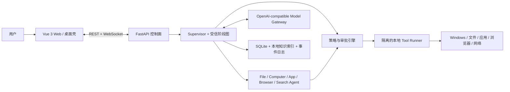

# DeskPilot：Windows 多 Agent 桌面助手

> 工作名称：DeskPilot。项目参考腾讯 Marvis 的产品方向，但不复制其品牌、界面或私有实现。

DeskPilot 是一个面向 Windows 的本地优先多 Agent 系统。用户通过自然语言提出目标，系统负责理解意图、生成可检查的计划、调用文件/系统/应用/浏览器/搜索工具，并在高风险操作前请求明确确认。项目后端使用 Python，前后端分离，模型层采用 OpenAI-compatible 抽象，可在云端模型与 Ollama 等本地模型之间切换。

当前仓库阶段：**阶段 1 已完成，阶段 2 MVP 进行中；Model Gateway、Provider 安全配置与角色级韧性路由、前端控制面、Policy/Approval、持久化调用账本、`unknown` 人工对账/显式新 attempt、Windows 每调用进程隔离、AppContainer 专用 worker runtime/强制禁网，以及 `file.move` prepare/commit/receipt、显式单文件任务/审批、unknown Runner 回执证据、receipt-driven 显式补偿、任务历史/集中 Reconciliation 中心和受保护跨重启 checkpoint 已接通。** 详细进度、验证结果和续接入口见[项目进度](项目进度.md)。

## 一句话架构

核心思想不是“让多个模型互相聊天”，而是让一个可持久化的任务状态机调度若干职责明确、工具权限受限的专业 Agent。所有副作用都必须经过策略引擎，所有关键状态都能恢复、审计和回放。

## 设计目标

- 能用一句中文完成“查找并总结文件、打开应用、检查电脑状态、浏览网页并整理信息”等任务。
- 简单任务走确定性快速路径，复杂任务才进行规划和多 Agent 协作，控制延迟与 Token 成本。
- 高风险动作默认拒绝或等待确认；模型永远不能绕过权限层直接操作系统。
- 模型、Agent、工具、存储和前端协议均可替换，方便后期扩展。
- 任务过程可解释、可暂停、可取消、可恢复、可回放、可量化评测。
- 作为应届生求职项目，既有能现场演示的 MVP，也有清晰的工程深度和演进路线。

## 推荐技术栈

| 层次 | 首选方案 | 说明 |
| --- | --- | --- |
| 前端 | Vue 3 + TypeScript + Vite + Pinia | 任务时间线、计划图、审批卡片、设置页 |
| 桌面形态 | MVP 使用浏览器；后续 Tauri 薄壳 | 保持前后端分离，桌面壳不承载 Agent 核心逻辑 |
| API | Python 3.12+ + FastAPI + Pydantic | REST 管理资源，WebSocket 推送任务事件 |
| 编排 | LangGraph + 自定义领域状态机 | 利用持久化/HITL能力，业务协议不绑定框架类型 |
| 模型 | 自定义 Model Gateway + OpenAI Python SDK/HTTP | 支持 Chat Completions/Responses 能力协商、云端与本地切换 |
| 工具 | Pydantic 严格入参 + Tool Registry + MCP Adapter | 内置工具与第三方 MCP 工具使用同一策略入口 |
| 本地执行 | 独立 Tool Runner 进程 | 超时、取消、目录白名单、命令模板与审计 |
| 数据 | SQLite WAL；向量索引可插拔 | MVP 零运维，规模化后可迁移 PostgreSQL/Qdrant |
| 浏览器 | Playwright | 优先 DOM/可访问性树操作，截图视觉操作作为后备 |
| Windows | psutil、PowerShell、Win32/WMI、pywinauto | 分能力封装，禁止模型自由拼接危险命令 |
| 工程 | uv、Ruff、mypy、pytest、pre-commit | 依赖锁定、类型检查、分层测试 |

具体依赖版本在开始搭建代码时锁定，而不是在设计阶段写死易过期的版本号。

## 文档导航

建议依次阅读：

1. [项目愿景、需求与范围](doc/00-项目愿景与范围.md)
2. [Marvis 调研与差异化定位](doc/01-Marvis调研与差异化.md)
3. [系统总体架构](doc/02-系统总体架构.md)
4. [Agent 编排与任务生命周期](doc/03-Agent编排与任务生命周期.md)
5. [工具、插件与 MCP 设计](doc/04-工具插件与MCP设计.md)
6. [模型网关与提示词策略](doc/05-模型网关与提示词策略.md)
7. [安全、权限与隐私设计](doc/06-安全权限与隐私设计.md)
8. [数据、记忆与本地知识库](doc/07-数据记忆与本地知识库.md)
9. [后端 API、事件与前端设计](doc/08-接口事件与前端设计.md)
10. [工程实现、项目结构与部署](doc/09-工程实现与部署.md)
11. [测试、评测与可观测性](doc/10-测试评测与可观测性.md)
12. [分阶段开发路线与验收标准](doc/11-分阶段开发路线.md)
13. [求职展示、演示与面试表达](doc/12-求职展示与面试指南.md)
14. [可行性、风险与架构决策记录](doc/13-可行性风险与决策.md)
15. [Tool Contract 与 Runner IPC 协议](doc/14-Tool-Contract与Runner-IPC协议.md)
16. [独立 Runner 与首个 R0 工具实现](doc/15-独立Runner与首个R0工具实现.md)
17. [Model Gateway 与 Fake Provider 实现](doc/16-Model-Gateway与Fake-Provider实现.md)
18. [OpenAI-compatible Chat Provider 实现](doc/17-OpenAI-Compatible-Chat-Provider实现.md)
19. [Provider 配置与凭据引用实现](doc/18-Provider配置与凭据引用实现.md)
20. [Provider 只读 API 与健康探测缓存实现](doc/19-Provider只读API与健康探测缓存实现.md)
21. [Provider Catalog 持久化与启动导入实现](doc/20-Provider-Catalog持久化与启动导入实现.md)
22. [Windows Credential Manager 实现](doc/21-Windows-Credential-Manager实现.md)
23. [Provider 运行配置保护与审计模型实现](doc/22-Provider运行配置保护与审计模型实现.md)
24. [Provider 管理服务与写 API 实现](doc/23-Provider管理服务与写API实现.md)
25. [前端 Provider 模型设置页实现](doc/24-前端Provider模型设置页实现.md)
26. [角色级 Provider 路由与韧性预算实现](doc/25-角色级Provider路由与韧性预算实现.md)
27. [前端任务控制、连接恢复与组件测试](doc/26-前端任务控制连接恢复与组件测试.md)
28. [Runner 故障恢复与 unknown 调用持久化](doc/27-Runner故障恢复与unknown调用持久化.md)
29. [Policy / Approval 执行前授权主干](doc/28-Policy-Approval执行前授权主干.md)
30. [Windows Runner 进程隔离与低完整性实现](doc/29-Windows-Runner进程隔离与低完整性实现.md)
31. [unknown 人工对账与显式新 attempt 实现](doc/30-unknown人工对账与显式新attempt实现.md)
32. [Contract 能力 Broker、受控提交与 Windows 禁网边界](doc/31-Contract能力Broker受控提交与Windows禁网边界.md)
33. [AppContainer 专用 Worker 运行时与 Profile 回收](doc/32-AppContainer专用Worker运行时与Profile回收.md)
34. [`file.move` 受控提交与持久化回执](doc/33-file.move受控提交与持久化回执.md)
35. [`file.move` 显式任务入口与一次性审批](doc/34-file.move显式任务入口与一次性审批.md)
36. [`unknown` Runner 回执证据采集与前端展示](doc/35-unknown-Runner回执证据采集与前端展示.md)
37. [`file.move` 回执驱动显式补偿闭环](doc/36-file.move回执驱动显式补偿闭环.md)
38. [任务历史与集中 Reconciliation 中心](doc/37-任务历史与集中Reconciliation中心.md)
39. [结构化 Tool 请求与可证明跨重启检查点](doc/38-结构化Tool请求与可证明跨重启检查点.md)

## MVP 边界

首个可演示版本支持：

- 多轮对话、计划展示、流式任务事件、暂停/取消。
- 限定目录内文件枚举、全文/语义检索、常见文档解析和摘要。
- 查询电脑配置、磁盘/进程/网络基本信息。
- 从已发现的应用清单中启动应用；关闭应用必须确认。
- Playwright 浏览、搜索、抽取带来源的网页信息。
- 工具风险分级、审批卡、操作日志、失败重试。
- 至少兼容一个云端 OpenAI-compatible 服务和一个本地 Ollama 模型。

首版不做无人值守支付、绕过登录/验证码、任意管理员命令、系统文件删除、通用软件自动安装、手机远控和多租户云平台。这些能力成本或风险过高，会削弱项目可交付性。

## 预期工期

以个人业余开发估算，完整求职版约 **12～16 周**。前 4～6 周形成可演示 MVP，随后补齐知识库、插件/MCP、安全强化、评测和作品集材料。详细里程碑见[开发路线](doc/11-分阶段开发路线.md)。

## 关键验收指标

- 20 个核心演示任务端到端成功率不低于 85%。
- 未确认的高风险副作用执行次数必须为 0。
- 简单工具任务 P50 首次有效反馈小于 2 秒（不含第三方模型本身延迟）。
- 任务中断后可从最近检查点恢复，不重复已完成的非幂等操作。
- 关键工具、策略引擎和任务状态机具备自动化测试；核心模块目标行覆盖率不低于 80%。
- 每次任务都能查询模型调用、工具调用、审批、耗时、Token/费用和最终结果。

## 资料依据

- [腾讯 Marvis 官方网站](https://marvis.qq.com/)：确认 Windows/macOS/移动端、本地/效率模式、文件搜索与理解、跨端控制和系统设置等公开能力。
- [腾讯云开发者社区 Marvis 技术百科](https://developer.cloud.tencent.com/techpedia/2612)：用于了解公开报道中的“主 Agent + 专业 Agent”分工；该来源不是产品源代码或正式技术白皮书，文档中按二级证据使用。
- [OpenAI Function calling 官方文档](https://developers.openai.com/api/docs/guides/function-calling)：支持将工具定义为结构化 schema、由应用执行并回传结果的设计。
- [OpenAI MCP and Connectors 官方文档](https://developers.openai.com/api/docs/guides/tools-connectors-mcp)：用于校准 MCP 接入与审批边界。
- [LangGraph 官方参考](https://langchain-ai.github.io/langgraph/reference/)：持久化执行、流式事件和 human-in-the-loop 的选型依据。
- [MCP 官方规范](https://modelcontextprotocol.io/specification/2025-06-18/server/index)：区分 prompts、resources、tools 的控制权和扩展职责。
- [Microsoft WinGet 官方文档](https://learn.microsoft.com/en-us/windows/package-manager/winget/)：后续受控软件管理能力的可行性依据。
- [Microsoft CREDENTIALW 官方文档](https://learn.microsoft.com/en-us/windows/win32/api/wincred/ns-wincred-credentialw)：校准 Windows Generic Credential、Blob 上限和本机持久化边界。
- [Microsoft CryptProtectData 官方文档](https://learn.microsoft.com/en-us/windows/win32/api/dpapi/nf-dpapi-cryptprotectdata)：校准 Provider 运行配置的当前用户范围保护、完整性检查和内存释放边界。

## 当前代码

- `backend/`：Python 3.12、FastAPI、SQLite、Alembic、事务 Outbox、本地会话安全、任务控制与有界历史查询、角色级 Model Gateway、费用/重试预算、Retry-After、EWMA/熔断、版本化 Provider catalog、安全凭据与密文运行配置、ETag/幂等写 API、动态 adapter registry、Fake/OpenAI-compatible Provider、Policy/Approval、一次性审批、Runner 授权证明、签名 IPC、Runner 自动换代/退避/熔断、持久化工具调用账本、`unknown` 人工对账、内容寻址 Runner 回执证据、持久化幂等回执与受限显式新 attempt、回执绑定单补偿血缘、Windows 每调用低完整性受限 worker + Job Object、句柄核验 resource broker、内容寻址 AppContainer worker bundle、专用 capability ACL 与孤儿 profile reaper，以及 `file.move` 无副作用 prepare、父 Runner 单次提交、durable receipt、崩溃恢复、跨代查询和重新审批的显式反向补偿。
- 后端另已将结构化写请求、受信计划、Policy/审批绑定和 Tool 幂等键保存到 current-user DPAPI 受保护 checkpoint；可证明的 created/paused/waiting-approval 可跨 API 重启续跑，running Tool 仍只转 unknown/Reconciliation 而不重放。
- `frontend/`：Vue 3、TypeScript、Vite 7，支持安全会话引导、任务提交、暂停/恢复/取消、`waiting_approval` 审批卡、审批失败对账、任务历史/集中 Reconciliation 列表、Runner 证据筛选与刷新、不可改写裁决、attempt/compensation 二次确认和血缘导航、断线续传提示、任务快照、计划、实时事件时间线，以及 Provider CRUD、健康检查、ETag 冲突恢复、脱敏审计和角色路由/韧性运行态展示；Vitest 组件测试已接入。
- 当前 TaskProcessor 的磁盘容量任务通过离线 Fake Provider 获得结构化分类和计划，不调用网络模型；显式 `file.move` 请求使用受信任应用计划模板，路径只来自本地用户表单并强制进入 R1 一次性审批，不从自然语言或模型输出提取。

受保护 checkpoint 只恢复能与任务事件、Tool 账本、Policy 和审批记录同时对上的固定单 Tool 阶段；密文损坏或任一绑定错配都会 fail closed。

运行环境要求：Python 3.12+、Node 20.19+（推荐 Node 22+）和 pnpm 11。后端与前端的具体命令分别见各自 README。

## 下一步

下一项建议是将当前单 Tool 固定图扩展为版本化、可查询的多步 Tool effect graph，并使用原子节点 transition 缩小崩溃 fail-closed 窗口。每次开发结束同步更新[项目进度](项目进度.md)。
