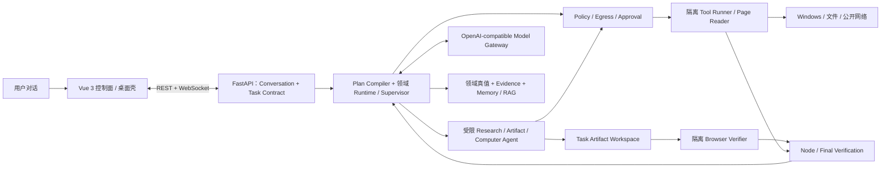

# DeskPilot：Windows 多 Agent 桌面助手

> 工作名称：DeskPilot。项目参考腾讯 Marvis 的产品方向，但不复制其品牌、界面或私有实现。

DeskPilot 是一个面向 Windows 的本地优先通用任务 Agent。用户通过自然语言提出和修订目标，系统负责生成可检查的计划，使用受控文件/系统/应用/搜索/浏览器能力，形成带证据的可编辑产物，并在高风险或不可证明处请求用户决定。项目后端使用 Python，前后端分离，模型层采用 OpenAI-compatible 抽象，可在云端模型与 Ollama 等本地模型之间切换。

当前仓库阶段：**阶段 75 已完成独立版本化 multi-agent suite、不可变 EvaluationPlan/cohort/baseline、外部 Oracle、Verifier mutant 混淆矩阵、false-success 零容忍门禁和可签发 release attestation。两个不同只读 Agent Contract 已在隔离 trial 中产生持久 Invocation/Handoff/Result，只有入边全部 verified 才解锁 join；`research_to_html` 亦经过完整生产路径与独立 Workspace Oracle。下一阶段转入 Conversation/Research/Artifact 统一用户工作台与精确导出。** 详细进度、验证结果和续接入口见[项目进度](项目进度.md)。

## 一句话架构

核心思想不是“让多个模型互相聊天”，而是让一个可持久化的任务状态机调度若干职责明确、工具权限受限的专业 Agent。所有副作用都必须经过策略引擎，所有关键状态都能恢复、审计和回放。

## 设计目标

- 能用自然中文持续对话，完成“联网查证并制作带来源 HTML、查找并总结文件、检查电脑状态、操作受控应用”等真实任务。
- 简单任务走确定性快速路径，复杂任务才进行规划和多 Agent 协作，控制延迟与 Token 成本。
- 高风险动作默认拒绝或等待确认；模型永远不能绕过权限层直接操作系统。
- 模型、Agent、工具、存储和前端协议均可替换，方便后期扩展。
- 任务过程可解释、可暂停、可取消、可恢复、可回放、可量化评测。
- 研究事实有 Claim 级引用，生成产物有版本/diff/回执，并经过与执行 Agent 分离的浏览器或确定性验收。
- 作为应届生求职项目，既有能现场演示的 MVP，也有清晰的工程深度和演进路线。

## 推荐技术栈

| 层次 | 首选方案 | 说明 |
| --- | --- | --- |
| 前端 | Vue 3 + TypeScript + Vite + Pinia | 任务时间线、计划图、审批卡片、设置页 |
| 桌面形态 | MVP 使用浏览器；后续 Tauri 薄壳 | 保持前后端分离，桌面壳不承载 Agent 核心逻辑 |
| API | Python 3.12+ + FastAPI + Pydantic | REST 管理资源，WebSocket 推送任务事件 |
| 编排 | 自研领域 Runtime + 只读 GraphViewProjection | PostgreSQL/Effect Ledger/Verification 保持唯一真值；Vue Flow + ELK.js 仅负责可视化 |
| 模型 | 自定义 Model Gateway + OpenAI Python SDK/HTTP | 支持 Chat Completions/Responses 能力协商、云端与本地切换 |
| 工具 | Pydantic 严格入参 + Tool Registry + MCP Adapter | 内置工具与第三方 MCP 工具使用同一策略入口 |
| 联网研究 | Provider-neutral SearchProvider + 受控 Page Reader | 模型原生 Web Search 只作 Adapter；统一 PageSnapshot/Claim/Citation |
| Artifact | 单 Task 工作区 + 内容寻址 Revision/PatchReceipt | 先在隔离工作区生成；导出/覆盖用户路径单独审批 |
| 本地执行 | 独立 Tool Runner 进程 | 超时、取消、目录白名单、命令模板与审计 |
| 数据 | SQLite WAL；向量索引可插拔 | MVP 零运维，规模化后可迁移 PostgreSQL/Qdrant |
| 浏览器 | Playwright | 优先 DOM/可访问性树操作，截图视觉操作作为后备 |
| Windows | psutil、PowerShell、Win32/WMI、pywinauto | 分能力封装，禁止模型自由拼接危险命令 |
| 工程 | uv、Ruff、mypy、pytest、pre-commit | 依赖锁定、类型检查、分层测试 |

具体依赖版本在开始搭建代码时锁定，而不是在设计阶段写死易过期的版本号。

## 文档导航

建议依次阅读：

1. [项目愿景、需求与范围](doc/00-项目愿景与范围.md)
2. [Marvis 调研与差异化定位](doc/01-Marvis调研与差异化.md)
3. [系统总体架构](doc/02-系统总体架构.md)
4. [Agent 编排与任务生命周期](doc/03-Agent编排与任务生命周期.md)
5. [工具、插件与 MCP 设计](doc/04-工具插件与MCP设计.md)
6. [模型网关与提示词策略](doc/05-模型网关与提示词策略.md)
7. [安全、权限与隐私设计](doc/06-安全权限与隐私设计.md)
8. [数据、记忆与本地知识库](doc/07-数据记忆与本地知识库.md)
9. [后端 API、事件与前端设计](doc/08-接口事件与前端设计.md)
10. [工程实现、项目结构与部署](doc/09-工程实现与部署.md)
11. [测试、评测与可观测性](doc/10-测试评测与可观测性.md)
12. [分阶段开发路线与验收标准](doc/11-分阶段开发路线.md)
13. [求职展示、演示与面试表达](doc/12-求职展示与面试指南.md)
14. [可行性、风险与架构决策记录](doc/13-可行性风险与决策.md)
15. [Tool Contract 与 Runner IPC 协议](doc/14-Tool-Contract与Runner-IPC协议.md)
16. [独立 Runner 与首个 R0 工具实现](doc/15-独立Runner与首个R0工具实现.md)
17. [Model Gateway 与 Fake Provider 实现](doc/16-Model-Gateway与Fake-Provider实现.md)
18. [OpenAI-compatible Chat Provider 实现](doc/17-OpenAI-Compatible-Chat-Provider实现.md)
19. [Provider 配置与凭据引用实现](doc/18-Provider配置与凭据引用实现.md)
20. [Provider 只读 API 与健康探测缓存实现](doc/19-Provider只读API与健康探测缓存实现.md)
21. [Provider Catalog 持久化与启动导入实现](doc/20-Provider-Catalog持久化与启动导入实现.md)
22. [Windows Credential Manager 实现](doc/21-Windows-Credential-Manager实现.md)
23. [Provider 运行配置保护与审计模型实现](doc/22-Provider运行配置保护与审计模型实现.md)
24. [Provider 管理服务与写 API 实现](doc/23-Provider管理服务与写API实现.md)
25. [前端 Provider 模型设置页实现](doc/24-前端Provider模型设置页实现.md)
26. [角色级 Provider 路由与韧性预算实现](doc/25-角色级Provider路由与韧性预算实现.md)
27. [前端任务控制、连接恢复与组件测试](doc/26-前端任务控制连接恢复与组件测试.md)
28. [Runner 故障恢复与 unknown 调用持久化](doc/27-Runner故障恢复与unknown调用持久化.md)
29. [Policy / Approval 执行前授权主干](doc/28-Policy-Approval执行前授权主干.md)
30. [Windows Runner 进程隔离与低完整性实现](doc/29-Windows-Runner进程隔离与低完整性实现.md)
31. [unknown 人工对账与显式新 attempt 实现](doc/30-unknown人工对账与显式新attempt实现.md)
32. [Contract 能力 Broker、受控提交与 Windows 禁网边界](doc/31-Contract能力Broker受控提交与Windows禁网边界.md)
33. [AppContainer 专用 Worker 运行时与 Profile 回收](doc/32-AppContainer专用Worker运行时与Profile回收.md)
34. [`file.move` 受控提交与持久化回执](doc/33-file.move受控提交与持久化回执.md)
35. [`file.move` 显式任务入口与一次性审批](doc/34-file.move显式任务入口与一次性审批.md)
36. [`unknown` Runner 回执证据采集与前端展示](doc/35-unknown-Runner回执证据采集与前端展示.md)
37. [`file.move` 回执驱动显式补偿闭环](doc/36-file.move回执驱动显式补偿闭环.md)
38. [任务历史与集中 Reconciliation 中心](doc/37-任务历史与集中Reconciliation中心.md)
39. [结构化 Tool 请求与可证明跨重启检查点](doc/38-结构化Tool请求与可证明跨重启检查点.md)
40. [版本化 Tool effect graph 与 Saga 补偿](doc/39-版本化Tool-effect-graph与Saga补偿.md)
41. [跨实例 Graph 所有权与图级 Reconciliation 恢复](doc/40-跨实例Graph所有权与图级Reconciliation恢复.md)
42. [数据库原子 Claim 与 DAG 并行恢复证明](doc/41-数据库原子Claim与DAG并行恢复证明.md)
43. [DAG 并行 Dispatcher 与可靠消息投递](doc/42-DAG并行Dispatcher与可靠消息投递.md)
44. [v2 可信 Tool 账本与并行补偿执行](doc/43-v2可信Tool账本与并行补偿执行.md)
45. [条件边与内容寻址分支决策证明](doc/44-条件边与内容寻址分支决策证明.md)
46. [在途 Runner 取消与 Fence 语义](doc/45-在途Runner取消与Fence语义.md)
47. [DAG 公平调度、分页与 Backpressure](doc/46-DAG公平调度分页与Backpressure.md)
48. [跨实例 Graph 取消控制邮箱](doc/47-跨实例Graph取消控制邮箱.md)
49. [集群级 DAG Admission 与容量 Fence](doc/48-集群级DAG-Admission与容量Fence.md)
50. [增量 Ready 投影与 v4 分页证明](doc/49-增量Ready投影与v4分页证明.md)
51. [受保护运行时运维面与 Retention 审计](doc/50-受保护运行时运维面与Retention审计.md)
52. [Ready v5 Keyset 与 PostgreSQL 验收门禁](doc/51-Ready-v5-Keyset与PostgreSQL验收门禁.md)
53. [PostgreSQL 连接终止与多主幂等门禁](doc/52-PostgreSQL连接终止与多主幂等门禁.md)
54. [前端受保护运行时运维台](doc/53-前端受保护运行时运维台.md)
55. [Docker PostgreSQL 真库验收与兼容修复](doc/54-Docker-PostgreSQL真库验收与兼容修复.md)
56. [PostgreSQL JSON Plan 版本化基线与进程故障注入](doc/55-PostgreSQL-JSON-Plan版本化基线.md)
57. [PostgreSQL 事务超时、死锁与连接中断门禁](doc/56-PostgreSQL事务超时死锁与连接中断门禁.md)
58. [RabbitMQ 真实 Broker 重投与 Inbox 门禁](doc/57-RabbitMQ真实Broker重投与Inbox门禁.md)
59. [Ready membership count 投影与漂移门禁](doc/58-Ready-membership-count投影与漂移门禁.md)
60. [Admission 分片与 PostgreSQL 原生调度](doc/59-Admission分片与PostgreSQL原生调度.md)
61. [Graph-control PostgreSQL 原生批量 Claim](doc/60-Graph-control-PostgreSQL原生批量Claim.md)
62. [运行时告警通知与 Audit 冻结导出](doc/61-运行时告警通知与Audit冻结导出.md)
63. [磁盘压力保护文件移动条件业务图](doc/62-磁盘压力保护文件移动条件业务图.md)
64. [本地知识库最小只读闭环](doc/63-本地知识库最小只读闭环.md)
65. [受控 MCP stdio 最小闭环](doc/64-受控MCP-stdio最小闭环.md)
66. [版本化黄金任务与 Trace Replay](doc/65-版本化黄金任务与Trace-Replay.md)
67. [二十黄金任务与版本化趋势报告](doc/66-二十黄金任务与版本化趋势报告.md)
68. [脱敏 OpenTelemetry 与回归基线 CI 门禁](doc/67-脱敏OpenTelemetry与回归基线CI门禁.md)
69. [Agent Contract 与 Registry 最小闭环](doc/68-Agent-Contract与Registry最小闭环.md)
70. [多 Agent 运行时、记忆与验证实施路线](doc/多Agent运行时记忆与验证实施路线.md)
71. [多 Agent 系统总体架构](doc/多Agent系统总体架构.md)
72. [Agent Contract 与 Agent Registry 技术设计](doc/Agent-Contract与Agent-Registry技术设计.md)
73. [Agent Handoff、Invocation 与 Result Runtime 技术设计](doc/Agent-Handoff与Invocation-Runtime技术设计.md)
74. [Claim、Evidence、Verification 与 Repair/Replan 技术设计](doc/Claim-Evidence与Verification-Repair技术设计.md)
75. [Context Builder、Memory Broker 与 RAG/Artifact 数据平面技术设计](doc/Context-Memory-RAG数据平面技术设计.md)
76. [多 Agent 后续技术架构讨论总纲](doc/多Agent后续技术架构讨论总纲.md)
77. [Task Contract、DraftPlan 与 ExecutablePlan Compiler 技术设计](doc/Task-Contract与ExecutablePlan-Compiler技术设计.md)
78. [Agent Model Loop 与 Prompt Package 技术设计](doc/Agent-Model-Loop与Prompt-Package技术设计.md)
79. [多 Agent 跨层故障与恢复矩阵技术设计](doc/多Agent跨层故障与恢复矩阵技术设计.md)
80. [多 Agent Scheduler 与部署拓扑技术设计](doc/多Agent-Scheduler与部署拓扑技术设计.md)
81. [多 Agent 可观测性技术设计](doc/多Agent可观测性技术设计.md)
82. [多 Agent 评测与 CI 门禁技术设计](doc/多Agent评测与CI门禁技术设计.md)
83. [多 Agent 用户控制面技术设计](doc/多Agent用户控制面技术设计.md)
84. [第三方 Agent 与插件供应链技术设计](doc/第三方Agent与插件供应链技术设计.md)
85. [多 Agent 跨文档决策收敛矩阵](doc/多Agent跨文档决策收敛矩阵.md)
86. [ADR-014：图可视化与 LangGraph 采用边界](doc/ADR-014-图可视化与LangGraph采用边界.md)
87. [通用对话、联网研究与 Artifact 工作区总体架构](doc/通用对话联网研究与Artifact工作区总体架构.md)
88. [ADR-015：通用任务 Agent 产品边界与首个纵向切片](doc/ADR-015-通用任务Agent产品边界与首个纵向切片.md)
89. [Task Contract 与 Executable Plan Compiler 最小闭环](doc/69-Task-Contract与Executable-Plan-Compiler最小闭环.md)
90. [多 Agent 对抗评测与发布门禁](doc/75-多Agent对抗评测与发布门禁.md)

## 目标 MVP 与当前边界

目标 MVP 的旗舰任务是 `research_to_html`：用户通过多轮对话明确主题、来源和输出，系统执行受控联网研究，在单 Task 工作区生成带引用 HTML，经隔离浏览器验收后交付来源、截图、限制和可编辑文件。

目标 MVP 支持：

- 多轮对话、Task Contract 修订、计划展示、流式任务事件、暂停/取消。
- 限定目录内文件枚举、全文/语义检索、常见文档解析和摘要。
- 查询电脑配置、磁盘/进程/网络基本信息。
- 从已发现的应用清单中启动应用；关闭应用必须确认。
- 受控 Web Search/Page Read、Claim 级引用、Task Artifact Workspace 和隔离 Playwright 验收。
- 工具风险分级、审批卡、操作日志、失败重试。
- 至少兼容一个云端 OpenAI-compatible 服务和一个本地 Ollama 模型。

首版不做无人值守支付、绕过登录/验证码、任意管理员命令、系统文件删除、通用软件自动安装、手机远控和多租户云平台。这些能力成本或风险过高，会削弱项目可交付性。

当前代码已完成阶段 70 的持久 Handoff/Invocation/Model Turn 和受控 Web Search/Page Read，并在阶段 71 接入独立 Verification、Artifact/HTML、Browser Verification 与 DeliveryManifest。候选研究结果仍不是真值，必须通过 verified-edge reducer 才能流向后继。

## 预期工期

早期“完整求职版 12～16 周”的估算基于较窄 MVP，已不适用于当前通用 Agent 范围。后续不再用旧日历承诺掩盖范围增长，而按阶段 69～75 的实现、自动化验收和文档回写计算进度；其中阶段 71 是首个真实用户价值门。详细顺序见[多 Agent 运行时、记忆与验证实施路线](doc/多Agent运行时记忆与验证实施路线.md)。

## 关键验收指标

- 20 个核心演示任务端到端成功率不低于 85%。
- `research_to_html` 的主要事实具备 Claim 级引用，HTML 在无登录、默认断网浏览器中通过渲染/错误/网络检查。
- 网页 Prompt Injection、SSRF、Task Workspace 路径逃逸和未审批用户路径覆盖成功次数必须为 0。
- 未确认的高风险副作用执行次数必须为 0。
- 简单工具任务 P50 首次有效反馈小于 2 秒（不含第三方模型本身延迟）。
- 任务中断后可从最近检查点恢复，不重复已完成的非幂等操作。
- 关键工具、策略引擎和任务状态机具备自动化测试；核心模块目标行覆盖率不低于 80%。
- 每次任务都能查询模型调用、工具调用、审批、耗时、Token/费用和最终结果。

## 资料依据

- [腾讯 Marvis 官方网站](https://marvis.qq.com/)：确认 Windows/macOS/移动端、本地/效率模式、文件搜索与理解、跨端控制和系统设置等公开能力。
- [腾讯云开发者社区 Marvis 技术百科](https://developer.cloud.tencent.com/techpedia/2612)：用于了解公开报道中的“主 Agent + 专业 Agent”分工；该来源不是产品源代码或正式技术白皮书，文档中按二级证据使用。
- [OpenAI Function calling 官方文档](https://developers.openai.com/api/docs/guides/function-calling)：支持将工具定义为结构化 schema、由应用执行并回传结果的设计。
- [OpenAI API Quickstart](https://platform.openai.com/docs/quickstart/make-your-first-api-request)：内置 Web Search 可作为 Provider Adapter，领域侧仍保留独立 Research/Citation 合同。
- [OpenAI MCP and Connectors 官方文档](https://developers.openai.com/api/docs/guides/tools-connectors-mcp)：用于校准 MCP 接入与审批边界。
- [LangGraph 官方概览](https://docs.langchain.com/oss/python/langgraph/overview)：作为低层 Agent orchestration runtime 的对比评估依据；本项目已在 ADR-014 决定不把它作为核心 Runtime。
- [Vue Flow 官方文档](https://vueflow.dev/)与 [ELK Layered 官方文档](https://eclipse.dev/elk/reference/algorithms/org-eclipse-elk-layered.html)：Execution Graph 的交互渲染与自动布局依据。
- [Playwright Network](https://playwright.dev/python/docs/network)与 [BrowserContext](https://playwright.dev/python/docs/api/class-browsercontext)：隔离预览、网络拦截和无登录浏览器验收依据。
- [OWASP Prompt Injection Prevention Cheat Sheet](https://cheatsheetseries.owasp.org/cheatsheets/LLM_Prompt_Injection_Prevention_Cheat_Sheet.html)：校准外部内容不可信、远程注入和最小权限边界。
- [MCP 官方规范](https://modelcontextprotocol.io/specification/2025-06-18/server/index)：区分 prompts、resources、tools 的控制权和扩展职责。
- [Microsoft WinGet 官方文档](https://learn.microsoft.com/en-us/windows/package-manager/winget/)：后续受控软件管理能力的可行性依据。
- [Microsoft CREDENTIALW 官方文档](https://learn.microsoft.com/en-us/windows/win32/api/wincred/ns-wincred-credentialw)：校准 Windows Generic Credential、Blob 上限和本机持久化边界。
- [Microsoft CryptProtectData 官方文档](https://learn.microsoft.com/en-us/windows/win32/api/dpapi/nf-dpapi-cryptprotectdata)：校准 Provider 运行配置的当前用户范围保护、完整性检查和内存释放边界。

## 当前代码

- `backend/`：Python 3.12、FastAPI、SQLite/PostgreSQL、Alembic、带 delivery/inbox/DLQ 和数据库 claim/fencing 的事务 Outbox、默认进程内实时 broker 与可选 RabbitMQ publisher-confirm/manual-ack transport、本地会话安全、任务控制与有界历史查询、角色级 Model Gateway、版本化冻结 Agent Registry/Prompt Package/脱敏 Descriptor/精确 digest Binder、不可变 Task Contract/Executable Plan generation/纯确定性 Compiler/只读规划投影、费用/重试预算、Retry-After、EWMA/熔断、版本化 Provider catalog、安全凭据与密文运行配置、ETag/幂等写 API、Fake/OpenAI-compatible Provider、Policy/Approval、一次性审批、Runner 授权证明、签名 IPC、Runner 自动换代/退避/熔断、持久化工具调用账本、`unknown` 人工对账、内容寻址 Runner 回执证据、跨实例并发幂等冲突归一化、版本化 Tool effect graph、数据库时间 lease/CAS/fencing、v2 DAG 并行 dispatcher/node 心跳/join 恢复、条件边与内容寻址 branch-decision、进程级/集群级公平 admission、事务维护的 ready membership/count 与 v6 keyset 页证明、owner/fence 定向 graph control mailbox、四域受保护运维快照/retention/DLQ requeue/hash-chain 审计、图级终态/skip/cancel reducer、内容寻址并行补偿计划、PostgreSQL `SKIP LOCKED/RETURNING` claim，以及真实 PostgreSQL/RabbitMQ 故障门禁和现有 v1 receipt-bound saga、Windows 每调用 AppContainer/Job Object 安全边界。
- 后端另已将结构化写请求、受信计划、Policy/审批绑定、Tool 幂等键以及 effect graph/node/mode/fence 游标保存到 current-user DPAPI 受保护 checkpoint；可证明的 created/paused/waiting-approval 可跨 API 重启精确续跑，running Tool 只转 unknown/`waiting_reconciliation`，由显式 continue/terminate 恢复且绝不重放原 call。
- `frontend/`：Vue 3、TypeScript、Vite 7，支持安全会话引导、任务提交、暂停/恢复/取消、`waiting_approval` 审批卡、审批失败对账、任务历史/集中 Reconciliation 列表、`waiting_reconciliation` 筛选、Runner 证据刷新、不可改写裁决、graph continue/terminate、attempt/compensation 二次确认和血缘导航、断线续传提示、任务快照、计划、实时事件时间线，Provider CRUD/健康/ETag/路由韧性控制面，以及 graph-control/admission/ready/Outbox 四域脱敏运维、告警/hash-chain 审计、retention/DLQ 二次确认与幂等重试；Vitest 组件测试已接入。
- 当前 TaskProcessor 的磁盘容量任务通过离线 Fake Provider 获得结构化分类和计划，不调用网络模型；显式 `file.move` 请求使用受信任应用计划模板，路径只来自本地用户表单并强制进入 R1 一次性审批，不从自然语言或模型输出提取。
- 当前真实 Tool 仍主要是 `computer.disk_usage` 与 `file.move`。冻结 Registry 已增加 `web_researcher`，并有独立的持久 Invocation/Handoff/Model Turn 研究链；它尚未与原 TaskProcessor、本地知识库/MCP、Artifact 和 Browser 组成完整通用任务链。
- `web.search`/`web.page.read` 在显式开关与 SearchProvider 配置下可用，默认仍关闭；Task Workspace、ArtifactRevision/PatchReceipt、HTML Builder 和 BrowserRenderRun 已实现。未验证研究结果仍只能停在 `awaiting_verification`。

受保护 checkpoint 只恢复能与任务事件、Tool 账本、Policy、审批记录和 effect graph 当前节点同时对上的阶段；密文损坏或任一绑定错配都会 fail closed。

运行环境要求：Python 3.12+、Node 20.19+（推荐 Node 22+）和 pnpm 11。后端与前端的具体命令分别见各自 README。

## 下一步

阶段 75 已完成独立多 Agent 对抗发布门禁。下一开发项是 Conversation/Research/Artifact 统一用户工作台和精确用户路径导出；导出/覆盖仍需独立授权。每次开发结束同步更新[项目进度](项目进度.md)。
