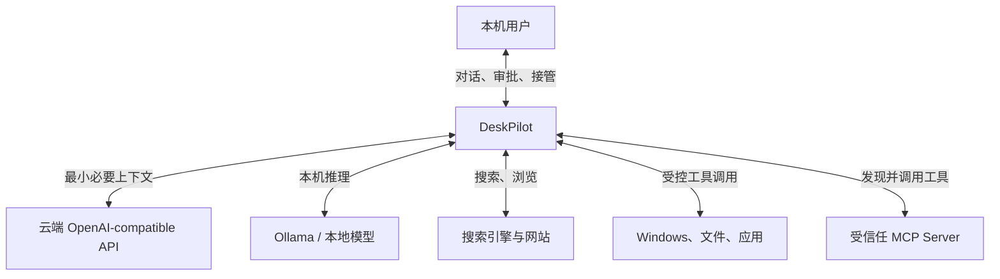
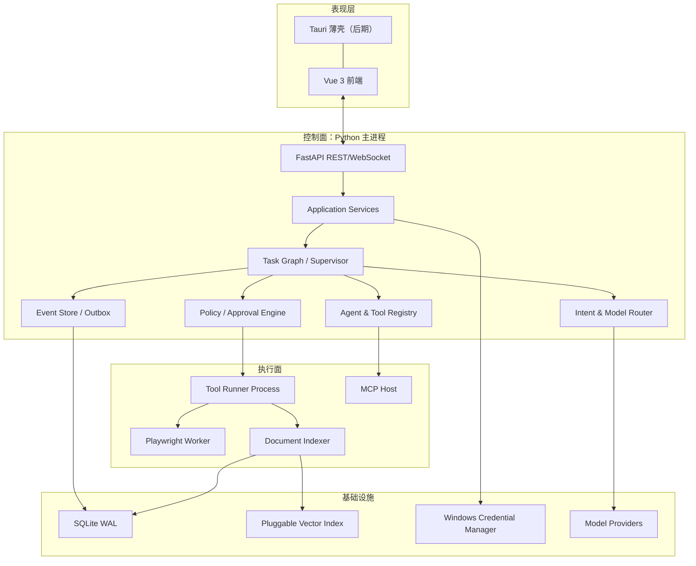
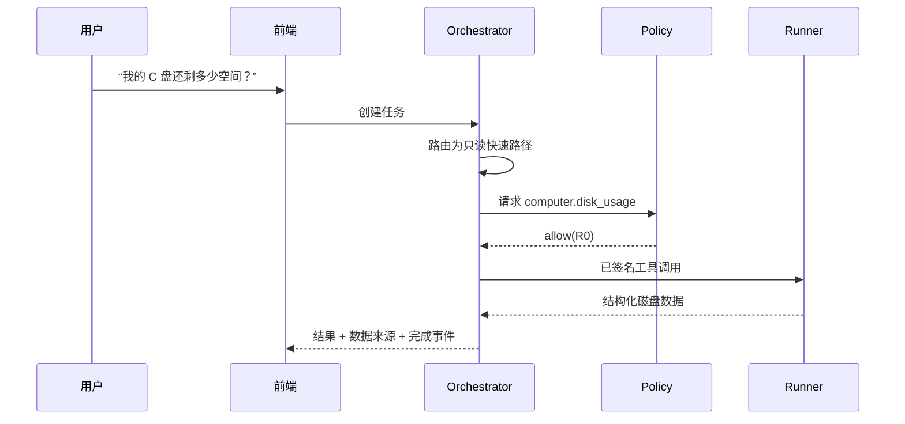
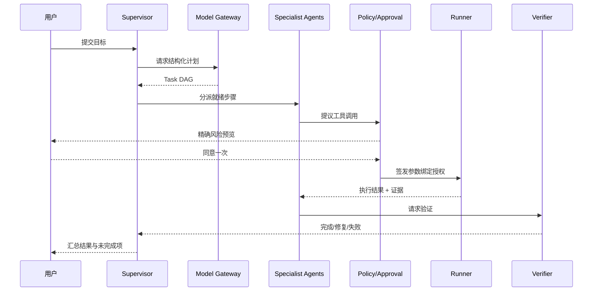

# 02. 系统总体架构

## 1. 架构原则

1. **模型只提议，策略层授权，Runner 执行。**
2. **控制面与执行面分离。** API/编排进程不直接操作系统。
3. **状态显式。** 任务计划、步骤、审批、结果、错误都使用领域对象，不藏在聊天文本里。
4. **先确定性，后智能。** 路由、权限、参数校验、重试和验证尽量由代码负责。
5. **本地优先。** 文件原文与系统动作默认不出本机，云端只收到完成任务所需的最少上下文。
6. **端口可替换。** LLM、数据库、搜索、浏览器、OS 实现通过接口适配。

## 2. 系统上下文



## 3. 容器级架构



## 4. 组件职责

| 组件 | 职责 | 不负责 |
| --- | --- | --- |
| FastAPI | 鉴权、资源 API、事件连接、输入校验 | 不直接调用 OS |
| Application Services | 用例编排、事务边界、DTO 转换 | 不包含模型提示词 |
| Supervisor/Task Graph | 任务状态、Agent 调度、步骤依赖、恢复 | 不决定最终权限 |
| Intent Router | 快速路径/复杂路径分类、所需能力识别 | 不执行动作 |
| Model Gateway | Provider 适配、能力协商、限流、重试、用量 | 不做业务授权 |
| Agent Registry | Agent Profile 发现、版本和工具白名单 | 不持有运行状态 |
| Tool Registry | 工具 schema、风险、实现、版本、健康状态 | 不信任工具自报风险 |
| Policy Engine | 决策 allow/deny/ask、审批绑定、数据边界 | 不调用模型决定权限 |
| Tool Runner | 在受限环境执行、超时/取消、采集结果 | 不接受未签名调用 |
| Verifier | 验证产物、前后状态和完成条件 | 不凭聊天文本判断成功 |
| Event Store | 追加任务事实、恢复、回放、审计 | 不保存明文密钥/思维链 |
| Indexer | 文档提取、切块、索引、增量更新 | 不默认全盘扫描 |

## 5. 分层设计

采用整洁架构/六边形思想，依赖方向从外向内：

```text
interfaces (FastAPI/WebSocket/CLI)
        ↓
application (use cases, commands, queries)
        ↓
domain (Task, Step, ToolCall, Approval, PolicyDecision)
        ↑
infrastructure (SQLite, OpenAI, Ollama, Playwright, Win32, MCP)
```

领域层只依赖 Python 标准库和少量类型协议。LangGraph 位于 application/infrastructure 交界处：它实现状态图运行，但 Task/Step/Event 的定义属于项目自身，未来可以替换编排框架。

## 6. 进程模型

### 6.1 MVP

| 进程 | 数量 | 说明 |
| --- | --- | --- |
| API + Orchestrator | 1 | 本机 `127.0.0.1` 监听，管理对话与任务 |
| Tool Runner | 1 | 通过本地 IPC 接受已授权调用 |
| Browser Worker | 0/1 | 首次浏览器任务时启动 |
| Index Worker | 0/1 | 后台增量索引，低优先级 |
| Vue Dev Server | 1 | 仅开发期；发布时为静态资源/桌面壳 |

Runner 崩溃不应带走 API；API 重启后从数据库恢复等待中或可重试步骤。MVP 不引入 Redis/Celery，避免个人项目运维过重。

### 6.2 扩展阶段

需要远程执行、多设备或高并发后，再将事件总线换成 Redis/NATS、数据库换 PostgreSQL、Runner 注册为远程 Worker。领域协议保持不变。

## 7. 核心数据流

### 7.1 只读快速任务



简单任务可以不调用规划模型；必要时仅用便宜模型把结构化结果解释成人话。

### 7.2 复杂且有副作用的任务



## 8. 同步与异步边界

- REST 创建任务后立即返回 `task_id`，不等待模型或工具完成。
- WebSocket 订阅任务事件；断线后用 `after_seq` 补拉事件。
- 数据库写入任务事件和 outbox 在同一事务中，事件推送失败可重发。
- 模型、浏览器、索引和工具执行都有独立 timeout/cancellation token。
- 大文件解析返回 artifact 引用，避免把全部内容通过 WebSocket 推送。

## 9. 部署与网络边界

- API 默认只绑定 `127.0.0.1`，使用每次启动生成的本地会话令牌防止其他网页调用。
- 前端若由桌面壳加载，使用受限 IPC 或带 Origin 校验的本地 HTTP。
- 所有外连经 Egress Policy：模型域名、搜索域名、MCP server 分别配置。
- 密钥不写入普通配置文件；发布形态使用 Windows Credential Manager。
- 日志、数据库和索引目录可在设置页查看与清理。

## 10. 为什么该架构可行

- Python 生态已有 FastAPI、Pydantic、Playwright、文档解析和 Windows 自动化库，不需要从零实现底层能力。
- [LangGraph 官方参考](https://langchain-ai.github.io/langgraph/reference/)明确提供长时有状态执行、持久化、流式和 human-in-the-loop，匹配本项目的任务图需求。
- [OpenAI Function calling 文档](https://developers.openai.com/api/docs/guides/function-calling)采用“模型产生结构化工具请求，应用执行并回传”的模式，与模型/执行隔离相符。
- [MCP 规范](https://modelcontextprotocol.io/specification/2025-06-18/server/index)为第三方 prompts/resources/tools 提供通用扩展面，但本项目在 MCP 外仍增加本地策略层。
- SQLite 和单机多进程足以支撑个人演示，避免过早引入分布式系统；接口已经为后期迁移预留。
