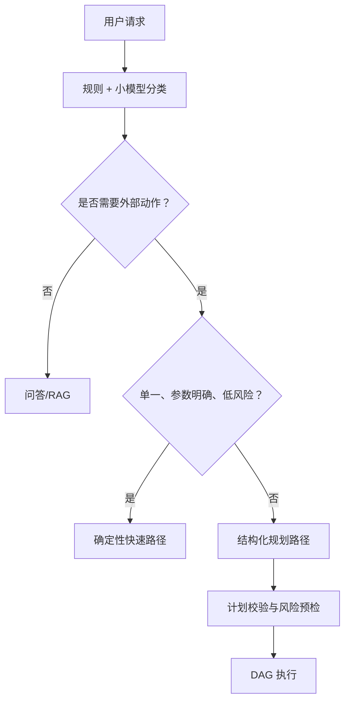
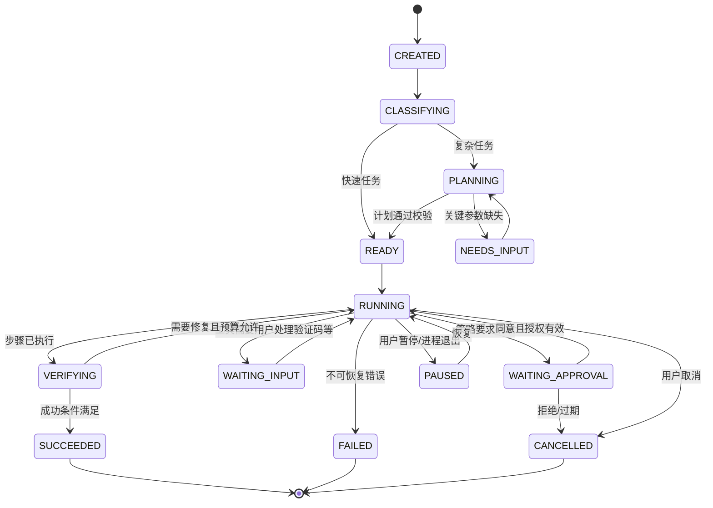

# 03. Agent 编排与任务生命周期

## 1. Agent 的工程定义

本项目中的 Agent 不是必须独占一个进程或一个模型。它是四类配置与能力的组合：

```text
Agent = Role Prompt + Allowed Tools + Input/Output Schema + Runtime Policy
```

同一个模型可以承载多个 Agent；不同 Agent 也可使用不同模型。安全边界不依赖 Agent 的“自觉”，而由 Policy Engine 和 Tool Runner 强制实现。

## 2. Agent 角色

| Agent | 核心职责 | 默认工具范围 | 明确禁止 |
| --- | --- | --- | --- |
| Supervisor | 意图确认、规划、依赖调度、结果汇总 | Agent handoff、任务/工件查询 | 直接调用 OS 副作用工具 |
| File Agent | 文件定位、解析、整理、生成 | `file.*`、`document.*`、知识检索 | 越过授权目录、永久删除 |
| Computer Agent | 设备/进程/磁盘/网络/设置 | `computer.*` | 任意管理员 shell |
| App Agent | 应用发现、启动、受控关闭、后期安装 | `app.*`、受限 UI Automation | 执行未知 exe、处理支付 |
| Browser Agent | 打开页面、导航、抽取、表单预填 | `browser.*` | 未审批提交/发布/下载执行 |
| Search Agent | 多查询生成、结果去重、来源排序 | `search.*`、只读网页抓取 | 将网页指令当系统指令 |
| Knowledge Agent | 混合检索、引用拼装、文档对比 | `knowledge.*` | 绕过文件 ACL 获取原文 |

Guard/Policy 和 Verifier 不建模为普通 Agent：关键权限决策必须确定性执行，验证优先使用工具和规则。仅在语义评价确实必要时，Verifier 才调用模型，并且无副作用权限。

## 3. 任务分类与路由



### 3.1 快速路径条件

同时满足以下条件时可跳过多 Agent 规划：

- 只需一个已知工具；
- 参数能从用户消息确定性提取或只需一次澄清；
- 风险为 R0，或 R1 且存在固定预览模板；
- 不依赖其他步骤产物；
- 有确定性的完成验证。

例如“打开记事本”“查询 D 盘空间”。这能显著减少延迟与费用，也避免为了展示多 Agent 而过度设计。

## 4. Task DAG 模型

概念结构如下，代码阶段由 Pydantic 模型实现：

```json
{
  "task_id": "tsk_...",
  "goal": "用户原始目标",
  "mode": "fast|planned",
  "status": "planning",
  "constraints": ["不得删除文件"],
  "success_criteria": ["产出带来源的 Markdown 报告"],
  "steps": [
    {
      "step_id": "s1",
      "agent": "search",
      "action": "收集岗位要求",
      "depends_on": [],
      "expected_output": "artifact/search_results",
      "risk": "R0",
      "idempotency": "safe",
      "timeout_seconds": 90,
      "max_attempts": 2,
      "verifier": "source_count>=5"
    }
  ]
}
```

规划模型只能输出受限动作意图和依赖，不能直接构造可执行 PowerShell。Plan Validator 校验：

- step/depends_on 引用有效且无环；
- Agent 存在且有请求能力；
- 风险与预估副作用匹配；
- 步骤数、并发数、重试数、Token/时间预算未超限；
- 成功条件可验证；
- 未知工具和自由文本命令被拒绝。

## 5. 状态机



任务状态与 UI 文案一一映射，禁止使用“正在思考”掩盖等待审批、工具卡住或模型重试。

### 5.1 暂停、恢复与取消语义

- `pause` 只允许 `RUNNING -> PAUSED`，处理器先在已持久化事件之间的安全点停下，再提交状态与 Outbox，避免出现“状态显示暂停但工具仍继续”的窗口。
- `resume` 只允许 `PAUSED -> RUNNING`，从保存的下一阶段检查点继续；不得重复已提交的工具事件。
- `cancel` 允许所有非终态进入 `CANCELLED`，最后事件固定为 `task.cancelled`；终态后禁止追加普通执行事件。
- 重复 pause/cancel 是幂等读取，不增加事件序号；其他非法转换返回稳定冲突错误。
- 当前 TaskProcessor 的检查点位于 API 进程内，重启后只保留 `PAUSED` 数据状态，不能假装可恢复；后续持久化任务图负责跨进程恢复。

## 6. Agent Handoff 协议

Supervisor 给 Agent 的输入只包含完成当前步骤的最小上下文：

```json
{
  "task_id": "tsk_...",
  "step_id": "s2",
  "objective": "读取检索到的 5 份 PDF 并比较技术主题",
  "constraints": ["只读", "不得上传原文到云端"],
  "inputs": [{"artifact_id": "art_...", "type": "file_refs"}],
  "allowed_tools": ["document.extract", "knowledge.search"],
  "output_schema": "DocumentComparisonV1",
  "budget": {"model_calls": 3, "tool_calls": 10, "deadline_seconds": 180}
}
```

Agent 输出必须包含：状态、结构化结果、artifact 引用、证据、下一步建议、错误分类；不得只返回“完成了”。

## 7. 并行策略

仅当步骤无依赖、工具资源不冲突且没有副作用竞态时并行。例如多个 URL 抓取可并行，两个步骤同时整理同一文件夹不可并行。

调度限制：

- 默认最多 3 个 Agent 步骤并行；
- 同一文件写锁、同一浏览器 page 锁、系统设置全局写锁；
- 模型 Provider 按 RPM/TPM 信号量限流；
- Runner 维护 CPU/内存/IO 配额，索引任务优先级低于交互任务；
- 任何需要审批的步骤在审批前不预执行副作用。

## 8. 错误、重试与补偿

| 错误类型 | 示例 | 策略 |
| --- | --- | --- |
| transient | API 429、临时网络错误 | 指数退避 + 抖动，受尝试/时间预算限制 |
| validation | 模型 JSON 不符合 schema | 将精简校验错误回传模型修复 1 次 |
| capability | 本地模型不支持工具调用 | 切换兼容模型或确定性路径，不循环重试 |
| permission | 路径越界、审批拒绝 | 立即停止相关分支，记录原因 |
| stale_state | 文件在审批后被修改 | 使授权失效，重新预览和审批 |
| tool_bug | Worker 崩溃、未知返回 | 熔断该工具并报告，不自动换危险方案 |
| user_action | 验证码、登录、UAC | 暂停并交给用户，不尝试绕过 |

非幂等工具每次调用携带 `idempotency_key`。写文件前记录原始哈希和临时副本；移动可反向移动；关闭应用通常不可补偿，只能在执行前明确说明。补偿不是“失败后让模型自由想办法”，而是工具作者登记的确定性动作。

## 9. 上下文管理

模型上下文分为：

- 固定系统政策摘要；
- 当前 Agent 角色与工具 schema；
- 当前步骤目标、约束和预算；
- 相关的短期对话摘要；
- artifact 的选定片段而非全量历史；
- 最近工具结果和结构化错误。

长期任务定期压缩上下文，但 Task/Step/Event 真值不依赖摘要。系统不保存或展示模型私有思维链，只记录可审计的计划、决定摘要、调用和证据。

## 10. 完成判定

Verifier 按以下优先级判断：

1. 工具级后置条件，例如目标文件存在且哈希符合预期。
2. 结构化业务规则，例如报告至少包含 5 个不同来源。
3. 前后状态差异，例如应用 PID 已启动或进程已退出。
4. 语义评分，仅用于摘要质量、相关性等无法完全规则化的内容。

只有所有必需成功条件满足才能标记 `SUCCEEDED`；部分完成要使用 `PARTIAL` 结果语义并列出缺失项，不能用流畅语言掩盖失败。
