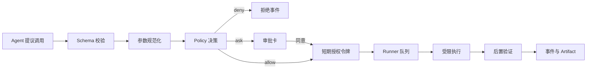

# 04. 工具、插件与 MCP 设计

## 1. 设计目标

工具层负责把“模型想做什么”转成可校验、可授权、可执行、可验证的系统能力。模型不能直接拿到 Python 函数对象、PowerShell 或操作系统句柄。

工具系统必须满足：

- 输入输出都有稳定 schema 和版本。
- 工具声明风险、副作用、幂等性、资源锁与超时。
- 内置工具、项目插件、MCP 工具使用同一策略入口。
- Runner 只执行由控制面签名、未过期且参数未变化的调用。
- 大结果保存为 artifact，只向模型返回摘要和引用。

## 2. Tool Contract

每个工具有一份可序列化定义。示例：

```yaml
name: file.move
version: 1.0.0
description: 将授权目录内的文件移动到另一个授权目录
input_schema: FileMoveInputV1
output_schema: FileMoveResultV1
risk:
  base_level: R1
  side_effects: [filesystem_write]
  reversible: true
  approval: policy
execution:
  timeout_seconds: 30
  idempotency: key_required
  resource_locks: ["file:{source}", "dir:{destination_parent}"]
security:
  capabilities: [file.read, file.write]
  network: false
  supports_dry_run: true
verification:
  type: file_exists_and_hash
```

工具自己的风险声明只是输入之一。Policy Engine 可以把风险调高，绝不能由第三方插件把风险调低。

## 3. 统一调用协议

### 3.1 ToolCallRequest

```json
{
  "call_id": "call_...",
  "task_id": "tsk_...",
  "step_id": "s3",
  "tool": "file.move@1.0.0",
  "arguments": {"source": "...", "destination": "..."},
  "actor": {"agent": "file", "profile_version": "2"},
  "idempotency_key": "...",
  "expected_resource_versions": {"source_sha256": "..."}
}
```

### 3.2 ToolResult

```json
{
  "call_id": "call_...",
  "status": "succeeded|failed|cancelled|unknown",
  "data": {},
  "artifacts": [],
  "evidence": [],
  "warnings": [],
  "error": null,
  "started_at": "...",
  "finished_at": "..."
}
```

`unknown` 用于 Runner 在执行非幂等动作时崩溃，且无法确认动作是否完成的情况。编排器此时不能自动重试，必须先调用状态检查工具或请求用户确认。

## 4. 执行流水线



参数规范化包括绝对路径解析、应用 ID 映射、URL 标准化和危险选项剥离。审批展示的是规范化后的最终参数。

## 5. MVP 内置工具目录

### 5.1 文件与文档

| 工具 | 作用 | 默认风险 | 备注 |
| --- | --- | --- | --- |
| `file.list` | 分页枚举目录 | R0 | 路径白名单、深度/数量限制 |
| `file.stat` | 元数据、哈希 | R0 | 大文件哈希可异步 |
| `file.read_text` | 读取文本片段 | R0 | 编码探测、大小限制 |
| `file.search` | 文件名/元数据/全文检索 | R0 | 返回引用，不回传全部内容 |
| `document.extract` | 提取 PDF/DOCX/XLSX/PPTX | R0 | 隔离解析器异常 |
| `file.write_new` | 新建文件 | R1 | 冲突时不覆盖 |
| `file.move` | 移动/重命名 | R1/R2 | 跨根目录或批量时升为 R2 |
| `file.send_to_trash` | 放入回收站 | R2 | 强制逐批预览 |

### 5.2 电脑与应用

| 工具 | 作用 | 默认风险 | 备注 |
| --- | --- | --- | --- |
| `computer.system_info` | OS/CPU/内存信息 | R0 | 不返回序列号等敏感标识 |
| `computer.disk_usage` | 磁盘容量 | R0 | 只读 |
| `computer.process_list` | 进程摘要 | R0 | 命令行参数默认脱敏 |
| `computer.network_diagnose` | DNS/ping/接口诊断 | R0/R1 | 仅允许预置诊断模板 |
| `app.discover` | 枚举可启动应用 | R0 | 建立稳定 app_id |
| `app.launch` | 启动已登记应用 | R1 | 参数白名单 |
| `app.close_gracefully` | 请求应用正常退出 | R2 | 展示未保存数据风险 |
| `app.terminate` | 强制终止进程 | R3 | MVP 默认禁用 |
| `app.winget_show` | 查询精确包信息 | R0 | 后期实现 |
| `app.winget_install` | 安装精确包 ID | R3 | 后期实现，始终审批 |

Microsoft 官方说明 WinGet 可发现、安装、升级、卸载和配置应用，适合作为后续软件管理的确定性入口；DeskPilot 只接受 `winget show` 确认后的精确包 ID，不接受模型生成任意下载 URL。参见 [Microsoft WinGet 文档](https://learn.microsoft.com/en-us/windows/package-manager/winget/)。

### 5.3 浏览器与搜索

| 工具 | 作用 | 默认风险 |
| --- | --- | --- |
| `search.query` | 调用配置的搜索 Provider | R0 |
| `browser.open` | 打开允许协议的 URL | R0 |
| `browser.extract` | 提取可见正文/表格/链接 | R0 |
| `browser.click` | 点击普通导航元素 | R1 |
| `browser.fill` | 在表单中预填但不提交 | R1/R2 |
| `browser.submit` | 提交、发布、发送 | R3 |
| `browser.download` | 下载到隔离区 | R2 |

浏览器工具优先使用稳定选择器、role/name 和可访问性树；像素坐标操作仅作为受限后备，并要求截图证据与更高风险级别。

## 6. 禁止通用自由 Shell

不向模型暴露 `shell(command: string)`。Computer 工具由开发者定义有限模板，例如：

```text
network.ping(host, count<=4)
process.details(pid)
service.query(service_id)
power.plan_get()
```

如果后期提供开发者模式 Shell，也必须满足：独立开关、每次审批、低权限子进程、工作目录白名单、命令/参数显示、网络默认关闭、输出限长，并明确不属于普通用户安全承诺。

## 7. 项目插件模型

DeskPilot 插件是本项目自己的扩展包，不等同于 Codex/浏览器插件。推荐结构：

```text
plugins/example_plugin/
├── deskpilot-plugin.yaml
├── python/
│   └── example_plugin/
├── agents/
│   └── analyst.yaml
├── tools/
│   └── schemas/
└── README.md
```

清单至少包含：插件 ID、语义版本、所需 DeskPilot API 版本、入口点、Agent、工具、权限、网络域名、配置 schema 和签名信息。插件安装流程为：检查清单 → 展示权限 → 建立隔离环境 → 安装依赖 → 健康检查 → 用户启用。

MVP 不实现在线插件市场，只支持本地开发插件和受信任目录，降低供应链风险。

## 8. MCP 接入

[MCP 官方规范](https://modelcontextprotocol.io/specification/2025-06-18/server/index)将扩展分为 prompts、resources 和 tools。本项目的对应关系：

| MCP 原语 | DeskPilot 处理 | 默认信任 |
| --- | --- | --- |
| prompts | 作为用户可选择的任务模板 | 不自动进入 system prompt |
| resources | 作为带来源和信任标签的上下文 | 不可信数据 |
| tools | 导入 Tool Registry 后调用 | 不可信执行能力 |

### 8.1 首期范围

- 优先支持本机 `stdio` MCP server，进程生命周期由 MCP Host 管理。
- 后续支持 Streamable HTTP；远程 server 必须显式配置域名、认证和数据出境提示。
- 工具列表缓存带 TTL，server 变化时重新审批新增权限。
- MCP server 在独立进程中运行，stdout 只承载协议，stderr 进入限长日志。

### 8.2 MCP 工具风险映射

MCP 的只读提示或工具注解不能被直接信任。导入时：

1. 根据名称、schema、注解生成建议风险。
2. 本地管理员规则设定风险下限。
3. 用户查看能力与数据域后启用。
4. 每次调用仍经过参数、资源和审批判断。
5. 未映射或动态改变的工具默认 R3/deny。

[OpenAI MCP 官方文档](https://developers.openai.com/api/docs/guides/tools-connectors-mcp)同样提供工具筛选和审批配置；DeskPilot 不依赖某个模型 Provider 的审批实现，而是在本地执行前统一复核。

## 9. Tool Search 与最小暴露

工具多时，不把所有 schema 放进每次模型请求。Registry 先按 Agent、任务能力和风险筛选，再向模型暴露最多 N 个相关工具。若 Provider 支持原生 tool search，可以使用其能力；否则用本地 BM25/标签检索。

最小暴露可以降低 Token、误选工具和提示注入攻击面。高风险工具不会因为名称相关就自动加入模型上下文，必须由计划与政策共同允许。

## 10. 工具开发验收清单

- [ ] 输入/输出 Pydantic schema 和版本存在。
- [ ] 路径、URL、进程、应用参数完成规范化。
- [ ] 风险、副作用、幂等性、超时和资源锁已声明。
- [ ] 至少有一个成功、参数错误、权限拒绝、超时测试。
- [ ] 日志无密钥、文件正文或敏感命令行。
- [ ] 结果大小有上限，大结果转 artifact。
- [ ] 写操作有 dry-run/preview 或说明为什么不能。
- [ ] 有确定性后置验证；若不可验证，明确返回不确定状态。
- [ ] 插件/Worker 崩溃不会使 API 主进程退出。
