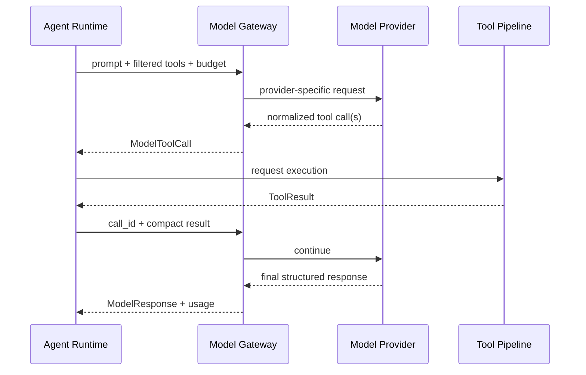

# 05. 模型网关与提示词策略

## 1. 为什么需要 Model Gateway

“OpenAI-compatible”通常表示接口形状相似，并不保证所有服务都支持相同端点、工具调用、严格 JSON、视觉、流式事件或错误码。直接在业务代码中调用某个 SDK，会把 Agent 编排绑死在供应商细节上。

Model Gateway 的目标是统一共同能力，同时保留 Provider 原生增强：

```text
业务层 -> ModelRequest/ModelResponse
             ↓
        Capability Router
         ↙           ↘
OpenAI-compatible    Native Adapters
Chat Completions     Responses / Ollama / future
```

## 2. 核心接口

该接口已在代码中用 `typing.Protocol` 实现：

```python
class ModelProvider(Protocol):
    async def capabilities(self) -> ModelCapabilities: ...
    async def complete(self, request: ModelRequest) -> ModelResponse: ...
    async def stream(self, request: ModelRequest) -> AsyncIterator[ModelEvent]: ...
    async def health(self) -> ProviderHealth: ...
```

领域层只认识规范化请求、响应和事件，不导入具体供应商类型。

当前实现包括 Provider descriptor、能力/隐私路由、结构化输出双重校验、统一 stream 事件、稳定错误、默认 Fake Provider、OpenAI-compatible Chat HTTP adapter，以及不含明文密钥的多 Provider catalog。字段与 Gateway 接线见 [Model Gateway 与 Fake Provider 实现](16-Model-Gateway与Fake-Provider实现.md)，网络 adapter 见 [OpenAI-compatible Chat Provider 实现](17-OpenAI-Compatible-Chat-Provider实现.md)，配置安全边界见 [Provider 配置与凭据引用实现](18-Provider配置与凭据引用实现.md)。

## 3. Provider 类型

| Provider | 作用 | 首期优先级 |
| --- | --- | --- |
| `OpenAICompatibleChatProvider` | 对接 `/v1/chat/completions` 共同子集；已完成 Mock Transport 验证 | P0 |
| `OpenAIResponsesProvider` | 使用 OpenAI Responses 原生工具/状态能力 | P1 |
| `OllamaProvider` | 本机模型、embedding、隐私模式 | P0 |
| `FakeModelProvider` | 测试固定输出与故障注入 | P0 |
| `LiteLLMAdapter` | 需要大量供应商时的可选适配 | P2，不作为核心依赖 |

OpenAI 官方建议新式工具工作流使用 Responses API，Function calling 文档说明工具由 JSON schema 定义、模型返回调用、应用执行并回传结果。参见 [Function calling](https://developers.openai.com/api/docs/guides/function-calling) 与 [迁移到 Responses API](https://developers.openai.com/api/docs/guides/migrate-to-responses)。DeskPilot 仍保留 Chat Completions 共同子集，因为许多兼容服务和本地端点并未完整实现 Responses。

## 4. 能力档案

连接配置不能只保存 `base_url/model/api_key`，还要记录能力：

```json
{
  "provider_id": "local-ollama",
  "model": "configured-model-name",
  "protocol": "openai_chat",
  "capabilities": {
    "streaming": true,
    "tool_calling": "native|prompted|none",
    "strict_json_schema": false,
    "parallel_tool_calls": false,
    "vision": false,
    "max_context_tokens": 32768,
    "embeddings": true
  },
  "privacy": {"location": "local", "data_retention": "none_by_app"}
}
```

能力来源按可靠度排序：用户显式配置 > Provider 元数据 > 启动探测 > 保守默认。探测只发送无敏感内容的最小测试。

## 5. 模型角色与路由

| 角色 | 需要的能力 | 推荐策略 |
| --- | --- | --- |
| intent | 低延迟、结构化分类 | 规则优先，小模型后备 |
| planner | 推理、严格结构化输出 | 质量优先云端或强本地模型 |
| tool_agent | 可靠工具调用 | 原生 function calling 优先 |
| summarizer | 长上下文、中文表达 | 成本与上下文平衡 |
| verifier | 结构化评分、低温度 | 与执行 Agent 分开配置 |
| embedding | 稳定维度、批处理 | 默认本地，索引模型不可随意更换 |

路由输入包括：任务风险、数据敏感度、必需能力、上下文大小、延迟预算、费用预算、Provider 健康和用户偏好。

### 5.1 隐私优先级

- `LOCAL_ONLY`：只能使用本地 Provider；能力不足时失败并解释，不能静默上云。
- `LOCAL_PREFERRED`：先本地；若需云端，展示将发送的数据摘要并请求同意。
- `BALANCED`：按能力/费用路由，但仍执行数据最小化。
- `QUALITY_FIRST`：允许使用配置的强模型，不改变工具审批规则。

## 6. 结构化输出策略

1. 首选 Provider 原生 strict JSON schema/function calling。
2. schema 使用 `additionalProperties: false`、枚举、长度和数值边界。
3. 返回后仍用 Pydantic 本地校验，不能因为 Provider 声称 strict 就跳过。
4. 校验失败时仅回传精简错误，最多修复一次。
5. 再失败则切换能力满足的备用模型或终止步骤，不用正则猜测危险参数。

规划、策略请求和工具参数禁止用 Markdown 文本解析。自由文本只用于用户可见说明。

## 7. 规范化工具调用循环



每轮检查模型调用数、工具调用数、总 Token、截止时间和重复调用指纹。连续两次产生相同工具+参数且无新状态时，触发循环保护。

## 8. 流式事件归一化

不同 Provider 的流式协议统一为：

- `response.started`
- `text.delta`
- `tool_call.started`
- `tool_call.arguments.delta`
- `tool_call.completed`
- `usage.updated`
- `response.completed`
- `response.failed`

模型文本流不是任务真值。前端展示时把“模型输出”“任务状态”“工具状态”分开，避免模型说“已完成”但工具仍未执行。

## 9. Prompt Package

提示词按包管理而不是散落字符串：

```text
prompts/
├── supervisor/v1/
│   ├── system.md
│   ├── plan.schema.json
│   └── metadata.yaml
├── file_agent/v1/
└── verifier/v1/
```

metadata 记录版本、适用能力、输入变量、输出 schema、允许工具、变更说明和关联评测集。线上 trace 记录 prompt 版本而非完整敏感 prompt。

### 9.1 Prompt 分层

1. 系统安全和自主边界。
2. Agent 职责、成功条件和禁止事项。
3. 当前任务/步骤的结构化上下文。
4. 工具 schema。
5. 来自网页/文档的“不可信内容”块。

不可信内容用明确边界包裹，并告知模型只把它当数据。即便模型忽略该提示，Policy Engine 仍是最后防线。

### 9.2 提示词原则

- 指令只写一次，避免冲突和 Token 浪费。
- 说明何时使用每个工具、返回字段和常见错误。
- 不要求输出隐藏思维链；要求简短决策摘要、计划和证据。
- 关键约束由代码再次验证，不依赖提示词。
- 使用代表性任务做回归，而不是凭感觉频繁改 prompt。

## 10. 上下文和成本控制

- 工具按需筛选，不发送全部 schema。
- 对话超过阈值后生成可验证摘要；任务真值仍从事件/实体加载。
- 工具结果先结构化裁剪，大正文保存为 artifact。
- 支持 Provider 级速率限制、并发信号量、重试退避与熔断。
- 每任务设置 `max_model_calls`、`max_tool_calls`、`max_input_tokens`、`max_cost` 和 deadline。
- 达到 80% 预算发出事件；耗尽预算暂停或返回部分结果，不无限续跑。

## 11. Fallback 原则

| 情况 | 允许的 fallback | 禁止行为 |
| --- | --- | --- |
| 云端超时 | 同隐私级别备用云端或本地 | 擅自换到未配置 Provider |
| 本地模型无工具调用 | 确定性快速路径或经同意换模型 | 用正则执行模糊参数 |
| 视觉能力缺失 | DOM/文本路径或提示用户 | 假装看过截图 |
| 上下文过长 | 检索/分块/摘要 | 静默丢掉成功条件 |
| 费用预算耗尽 | 暂停并给出已完成结果 | 自动增加预算 |
| LOCAL_ONLY 能力不足 | 明确失败/请求改变模式 | 静默上传文件 |

## 12. 配置与密钥

- API key 通过凭据存储引用，配置文件只保存 `credential_id`。
- 自定义 `base_url` 必须显示完整主机名和 TLS 状态；默认拒绝明文远程 HTTP。
- Provider 可配置允许的数据等级、速率、费用单价和健康检查。
- 日志不记录 Authorization header、完整请求体或文件正文。
- 删除 Provider 时可选择同时删除凭据和关联缓存。

当前代码已实现受限 environment/Windows Credential Manager reference、SecretStr 注入、云端 HTTPS 要求、loopback/locality 验证、多 Provider 静态工厂和公开 catalog 持久化。实际字段与安全边界见 [Provider 配置与凭据引用实现](18-Provider配置与凭据引用实现.md)、[Provider Catalog 持久化与启动导入实现](20-Provider-Catalog持久化与启动导入实现.md)和[Windows Credential Manager 实现](21-Windows-Credential-Manager实现.md)。
