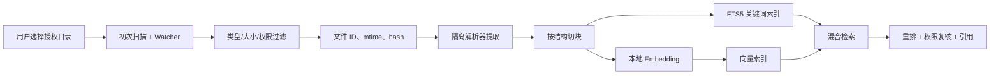

# 07. 数据、记忆与本地知识库

## 1. 数据设计原则

- 结构化事实与模型生成文本分开存储。
- 事件追加写，当前状态可重建；重要写入有事务边界。
- 文件正文默认留在本机，索引继承源文件访问范围。
- 记忆必须有来源、置信度、作用域和过期/删除机制。
- 向量库是派生索引，不是唯一真值；可以从源文件和元数据重建。

## 2. MVP 存储选型

| 数据 | MVP | 后期 |
| --- | --- | --- |
| 任务、步骤、审批、配置 | SQLite WAL | PostgreSQL |
| 事件与 outbox | SQLite 追加表 | PostgreSQL + 消息总线 |
| 文件元数据/全文 | SQLite + FTS5 | PostgreSQL/OpenSearch |
| 向量 | 可插拔本地向量索引 | Qdrant/pgvector |
| Artifact | 本地分层目录 | 对象存储 |
| 密钥 | Windows Credential Manager | 专用 Secret Manager |

MVP 优先选择零运维。向量适配器可以先使用支持 Windows 的嵌入式实现；代码开始前用实际机器做安装与并发验证，再在 ADR 中锁定。不要为了简历堆栈在首版同时引入 Redis、Kafka、Elasticsearch 和多个数据库。

## 3. 核心实体

| 实体 | 关键字段 | 说明 |
| --- | --- | --- |
| `Conversation` | id、title、created_at | 用户对话容器 |
| `Message` | id、conversation_id、role、content_ref | 大内容可转 artifact |
| `Task` | id、goal、status、mode、budget、policy_context | 任务聚合根 |
| `Step` | id、task_id、agent、deps、status、attempt | DAG 节点 |
| `TaskEvent` | task_id、seq、type、payload、created_at | 追加式事实 |
| `ToolCall` | id、step_id、tool/version、args_hash、status | 工具审计 |
| `Approval` | id、call_id、decision、scope、expires_at | 与精确调用绑定 |
| `Artifact` | id、type、path/blob_ref、sha256、metadata | 中间/最终产物 |
| `ModelCall` | provider、model、prompt_version、usage、latency | 不保存密钥和私有思维链 |
| `FileRecord` | canonical_path、file_id、mtime、hash、classification | 文件索引真值 |
| `DocumentChunk` | file_id、locator、text_ref、embedding_ref | 可引用片段 |
| `MemoryItem` | scope、kind、value、source、confidence、expires_at | 用户可管理记忆 |
| `PolicyRule` | effect、subject、action、resource、priority | 用户/系统规则 |

所有表使用应用生成的 UUID/ULID，时间统一保存 UTC，UI 转本地时区。schema 迁移使用 Alembic。

## 4. 事件模型与恢复

每个 TaskEvent 在任务内使用单调递增 `seq`：

```text
task.created
task.classified
plan.proposed
plan.validated
step.ready
step.started
tool.requested
approval.required
approval.resolved
tool.started
tool.completed
step.verified
step.completed
task.completed
```

状态表提供快速查询，事件表用于审计和恢复。更新状态、写事件、写 outbox 必须在同一数据库事务。WebSocket 推送成功后标记 outbox；前端断线可从 `after_seq` 续传。

恢复时：

1. 读取 Task 当前快照和快照后的事件。
2. 将 `running` 步骤转为 `reconciling`。
3. 查询工具调用结果或资源后置状态。
4. 确认完成则补写事件；可安全重试则入队；不确定则等待用户。

## 5. 记忆分类

| 类型 | 示例 | 写入方式 | 默认期限 |
| --- | --- | --- | --- |
| 会话记忆 | 当前讨论的目标与约束 | 自动，随对话 | 会话期 |
| 任务记忆 | 步骤结果、artifact、失败原因 | 事件自动生成 | 任务保留期 |
| 偏好记忆 | “报告默认用中文” | 用户确认或明确表达 | 可长期 |
| 权限记忆 | “禁止访问财务目录” | 显式设置；只允许自动收紧 | 长期 |
| 事实记忆 | “我的项目在 D:\work” | 提议后确认 | 可配置 |
| 技能记忆 | 成功任务模板 | 用户保存 | 长期、版本化 |

模型不能自行把猜测写成长久事实。每项记忆展示来源、创建时间、使用范围，并允许编辑/删除。记忆冲突时优先级为当前明确指令 > 当前任务约束 > 用户设置 > 长期记忆 > 模型推断。

## 6. 文件索引流水线



### 6.1 增量策略

- 首次只扫描用户授权目录，显示进度、文件数和预计空间。
- Watcher 事件做去抖；定期低频 reconciliation 处理漏事件。
- 用 file ID + mtime + size 快筛，需要时再计算哈希。
- 解析器版本、切块版本或 embedding 模型变化时，后台重建对应派生索引。
- 文件删除/移出授权范围后，立即标记不可检索并异步清理片段和向量。

### 6.2 文档解析

| 类型 | 首选解析 | 定位信息 |
| --- | --- | --- |
| PDF | PyMuPDF/pdfplumber 适配器 | 页码、文本框（可选） |
| DOCX | python-docx | 标题路径、段落序号 |
| XLSX | openpyxl 只读模式 | 工作表、单元格范围 |
| PPTX | python-pptx | 幻灯片号、形状序号 |
| 图片 | OCR 适配器 | 图片、文本框 |
| 代码/Markdown | 原生解析/Tree-sitter 可选 | 行号、符号 |

有宏、加密、损坏或超大压缩比的文件拒绝或隔离处理。解析失败是单文件错误，不能中断整个索引任务。

## 7. 切块策略

不使用一个固定字符数切所有格式：

- Markdown/Word：按标题层级和段落，过长再滑窗。
- PDF：保留页边界与标题线索，页眉页脚去重。
- Excel：表头 + 有意义的行块，避免把单元格拆散。
- PPT：以单页为基础，备注单独标识。
- 代码：按函数/类/模块，保留文件路径和行号。

每个 chunk 保存 `source_id`、`locator`、`text_hash`、`parser_version`、`chunker_version` 和数据分类。Embedding 文本可做必要清洗，但引用展示回到原始提取文本。

## 8. 混合检索

查询流程：

1. 解析时间、文件类型、目录等确定性过滤条件。
2. FTS5/BM25 召回关键词匹配。
3. 向量索引召回语义相关片段。
4. 使用 Reciprocal Rank Fusion 合并去重。
5. 可选小模型/cross-encoder 重排前 N 条。
6. 执行最终 ACL/目录/敏感度复核。
7. 返回有限片段、分数与精确 locator。

检索器永远不能只返回一段无来源文本。回答引用格式至少包含：文件名、规范化路径或用户友好路径、页码/工作表/行号、片段哈希。源文件变化后旧引用标记 stale。

## 9. RAG 与数据出境

RAG 不是把检索到的整份文件发送给模型：

- 先在本地执行过滤和检索。
- 只选择完成任务所需的少量片段。
- 根据数据分类和当前模式判断可用 Provider。
- 云端发送前在审批/任务面板显示文件数、片段数、敏感度和目标 Provider。
- 可对邮箱、手机号、身份证等字段做可配置脱敏。
- 模型响应保留引用映射，Verifier 检查关键断言是否有证据。

## 10. Artifact 设计

Artifact 是跨步骤传递大结果的句柄：

```json
{
  "artifact_id": "art_...",
  "type": "search_results|extracted_document|report|file_manifest",
  "storage": "local_file|database",
  "sha256": "...",
  "size": 12345,
  "classification": "personal",
  "created_by": {"task_id": "...", "step_id": "..."},
  "preview": "面向 UI/模型的安全摘要"
}
```

Agent 通过 artifact_id 取所需分页或片段，不把巨型结果复制进事件和上下文。Artifact 继承最敏感输入的数据等级。

## 11. 数据保留与删除

| 数据 | 默认建议 | 删除影响 |
| --- | --- | --- |
| 对话/任务 | 90 天或用户手动 | 历史 UI 与继续任务不可用 |
| 工具审计 | 180 天，参数脱敏 | 安全追溯能力下降 |
| 临时 artifact | 7 天 | 旧任务产物预览不可用 |
| 文件索引 | 跟随授权与源文件 | 可重新索引 |
| 调试日志 | 默认关闭；开启后 7 天 | 不影响任务真值 |
| 长期记忆 | 直到用户删除/过期 | 个性化下降 |

清理使用“先列清单、再确认、最后记录完成事件”的流程。删除索引不删除用户原文件；删除源文件只通过单独的文件工具完成。

## 12. 备份与迁移

- SQLite 定期使用在线备份 API，不直接复制正在写的数据库文件。
- Artifact 与数据库备份使用同一 snapshot_id，避免引用错位。
- 导出包默认不包含密钥；敏感内容可选择用户提供密码加密。
- 数据库升级使用向前迁移；破坏性迁移前自动备份并提供恢复说明。
- 向量索引不强制备份，保存 embedding 模型与索引版本即可重建。
