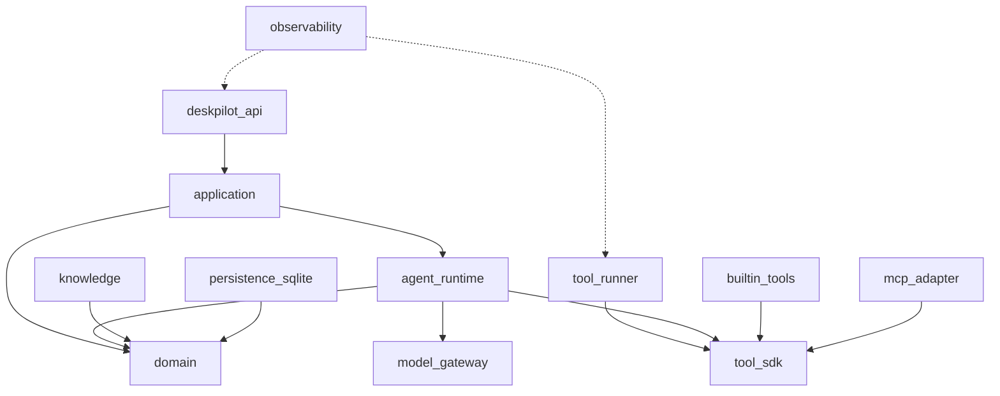

# 09. 工程实现、项目结构与部署

## 1. Monorepo 结构

代码阶段建议建立以下结构：

```text
deskpilot/
├── README.md
├── doc/
├── apps/
│   ├── backend/                  # FastAPI 组合根
│   │   ├── src/deskpilot_api/
│   │   └── tests/
│   ├── tool_runner/              # 独立执行进程
│   │   ├── src/deskpilot_runner/
│   │   └── tests/
│   └── web/                      # Vue 3 前端
│       ├── src/
│       └── tests/
├── packages/
│   ├── domain/                   # 无框架领域模型
│   ├── application/              # 用例、端口、编排
│   ├── agent_runtime/            # Agent profile、graph、prompt
│   ├── model_gateway/            # 模型适配与能力路由
│   ├── tool_sdk/                 # tool contract/registry
│   ├── builtin_tools/            # File/Computer/App/Browser/Search
│   ├── mcp_adapter/
│   ├── knowledge/
│   ├── persistence_sqlite/
│   ├── observability/
│   └── testkit/                  # fake providers、replay、fixtures
├── prompts/
├── evals/
│   ├── cases/
│   ├── fixtures/
│   └── baselines/
├── plugins/
│   └── examples/
├── scripts/
├── pyproject.toml
├── uv.lock
└── .github/workflows/
```

前期不要立即拆成可独立发布的十几个 PyPI 包。可以在同一 Python workspace 中保持逻辑边界，等接口稳定再决定发布。

## 2. 后端模块依赖



`domain` 不依赖 FastAPI、LangGraph、SQLAlchemy 或 OpenAI SDK。基础设施通过 application 定义的 port 接口注入。

## 3. 主要技术选型

| 领域 | 首选 | 选择理由 | 备选/边界 |
| --- | --- | --- | --- |
| Python 管理 | Python 3.12+、uv | 现代类型/异步、锁文件、workspace | 开始编码时验证依赖兼容 |
| API | FastAPI、Pydantic v2 | 类型契约、OpenAPI、异步生态 | 不把 ORM model 直接暴露为 API |
| ORM/迁移 | SQLAlchemy 2、Alembic | 成熟、可从 SQLite 迁移 PostgreSQL | 小项目也保持 repository 边界 |
| 编排 | LangGraph | 持久化、HITL、流式、状态图 | 领域状态不使用框架私有对象 |
| HTTP | httpx | async、超时、流式 | Provider 连接复用 |
| 浏览器 | Playwright Python | DOM/可访问性树、隔离 context | GUI 坐标自动化仅后备 |
| Windows | psutil、pywin32/WMI、pywinauto、受控 PowerShell | 覆盖系统和原生应用 | 每项能力独立探测 |
| 文档 | PyMuPDF、python-docx、openpyxl、python-pptx | 常见办公格式 | 解析器进 Worker |
| 密钥 | keyring/Windows Credential Manager | 不明文落配置 | 测试用内存实现 |
| 测试 | pytest、pytest-asyncio、Hypothesis | 异步/属性测试 | OS E2E 仅 Windows runner |
| 质量 | Ruff、mypy、pre-commit | 快速统一 | 核心包严格类型 |
| 前端 | Vue 3、TS、Vite、Pinia | 学习成本和生态平衡 | API 类型自动生成 |
| 可观测 | structlog + OpenTelemetry | 结构化日志与 trace | 本地默认文件/控制台导出 |

是否使用具体向量库在代码开工前做一个小型 spike：Windows 安装、10 万 chunk 索引、并发读写、删除和备份。未通过验收则先用 SQLite FTS5 + NumPy 小规模向量检索，保证 MVP 可运行。

## 4. 依赖与配置管理

- 根 `pyproject.toml` 管理 workspace、Ruff/mypy/pytest 公共配置。
- `uv.lock` 提交仓库，CI 使用锁定依赖。
- 前端提交 `package-lock.json` 或 `pnpm-lock.yaml`，全项目只选一个包管理器。
- 配置分为默认值、用户配置、环境覆盖、运行时参数；优先级明确。
- 普通配置可用 TOML，密钥只保存 credential reference。
- 配置模型使用 Pydantic Settings，启动时验证并输出脱敏摘要。
- 功能通过 capability/feature flag 渐进开启，危险实验功能默认关闭。

## 5. 异步与阻塞处理

FastAPI 事件循环只做网络 IO 和轻量调度：

- 模型/HTTP/Playwright 使用 async API。
- 文档解析、哈希、大目录扫描进入 Worker，不在 API event loop 执行。
- Windows 阻塞 API 通过 Runner 线程/进程池封装。
- 每个边界有 timeout，取消信号向下传播。
- 不用无限队列；交互任务、审批恢复、索引任务使用不同优先级。
- 大输出流式写 artifact，内存只保留受限片段。

## 6. Tool Runner IPC

MVP 已确定先采用控制面父进程与 Runner 子进程之间的 stdin/stdout NDJSON；后续如切换 Windows 命名管道，保持消息模型不变。协议包含：

- 控制面和 Runner 进程身份/启动 nonce。
- 单次签名授权、call_id、deadline、idempotency key。
- schema 版本协商。
- 心跳、取消、进度和最终结果。
- 请求/响应大小限制。

不能把“只监听 localhost”当作唯一鉴权。Runner 不提供面向浏览器的 CORS，也不接受任意工具名或 Python import path。

当前已经完成数据化 Tool Contract、精确版本 Registry、HMAC-SHA256 签名信封、启动 nonce、TTL、防重放、单帧大小限制、调用授权器、独立 Runner 进程和 `computer.disk_usage@1.0.0`。字段、校验顺序和错误码见 [Tool Contract 与 Runner IPC 协议](14-Tool-Contract与Runner-IPC协议.md)，进程生命周期和真实工具闭环见[独立 Runner 与首个 R0 工具实现](15-独立Runner与首个R0工具实现.md)。

## 7. 数据库与事务

- SQLite 启用 WAL、foreign keys、busy timeout。
- repository 方法定义事务边界；API handler 不手写散落 SQL。
- Task 状态、TaskEvent、Outbox 在一个事务更新。
- 长耗时工具期间不持有数据库事务或文件锁。
- Alembic 迁移需支持空库和上一发布版升级。
- 每次发布前执行备份/恢复 smoke test。

## 8. 日志与错误处理

统一错误分类：

```text
DeskPilotError
├── ValidationError
├── PermissionDenied
├── ApprovalRequired
├── CapabilityUnavailable
├── ExternalTransientError
├── ToolExecutionError
├── VerificationFailed
└── InternalError
```

领域错误映射为稳定 API code；底层堆栈只写开发日志。用户消息包含发生了什么、哪些动作未执行、是否可恢复和下一步。错误日志带 trace_id/task_id/step_id/call_id，但敏感内容先脱敏。

## 9. 开发环境

代码阶段提供一条命令启动本地开发：API、Runner、Vue，并使用 fake model 默认运行，不要求新贡献者先配置付费 API key。

开发档位：

| Profile | 模型 | 工具 | 用途 |
| --- | --- | --- | --- |
| `test` | Fake | Fake OS/网络 | 单元和契约测试 |
| `dev-safe` | Fake/本地 | 只读工具、测试目录 | 日常开发默认 |
| `dev-live` | 已配置 Provider | 真实本地工具 | 手工 E2E，显著警告 |
| `demo` | 云端+本地 | 精选工具 | 求职演示 |

测试目录用临时目录创建，不能把开发者主目录作为自动化测试目标。

## 10. 发布形态

### 10.1 MVP 开发演示

- Python venv/uv 启动 API 与 Runner。
- Vue 开发服务器或构建后静态资源。
- 用户浏览器访问本地 UI。
- 可选 Ollama；不要求 Docker。

### 10.2 求职发布版

- 前端构建为静态资源，Tauri 提供窗口、托盘和启动管理。
- Python 后端/Runner 使用独立打包或随安装器分发的受控运行时。
- 首次启动向导配置模型、授权目录、隐私模式和安全说明。
- 本地数据放在用户应用数据目录，不污染安装目录。
- 支持诊断包导出，默认脱敏。

### 10.3 不推荐 Electron + Python 双重重型打包作为首版

Tauri 仍会带来 Rust 和打包复杂度，所以放在功能 MVP 后。浏览器 UI 已能证明前后端分离与 Agent 核心；不要让桌面包装拖延闭环能力。

## 11. CI 流程

```text
lint/format -> type-check -> unit -> contract -> build frontend
     -> integration (fake) -> Windows tool smoke -> package smoke
```

- Linux runner 跑绝大多数纯 Python/前端测试。
- Windows runner 跑路径、进程、应用发现和 Runner 测试。
- 真实模型测试不阻塞普通 PR；nightly/手工使用安全测试账户。
- 依赖更新 PR 必须重跑黄金任务和安全契约。
- 构建产物生成 SBOM、依赖许可清单和校验和。

## 12. 编码约定

- 公共接口有类型、docstring 和最小示例。
- 领域模型不可使用松散 `dict[str, Any]` 代替明确 schema。
- 不在 Agent prompt 里隐藏业务规则；规则进入领域/策略代码。
- 不捕获裸 `Exception` 后返回成功；未知错误进入失败状态。
- 不记录或断言模型私有思维链。
- 新工具、新事件、新任务状态都必须更新文档和契约测试。
- 高风险实现至少双测试：正常路径和无授权拒绝路径。

## 13. 架构决策记录（ADR）

代码阶段在 `doc/adr/` 记录短 ADR：

- ADR-001：选择 LangGraph 但隔离框架类型。
- ADR-002：MVP 使用 SQLite 而非 PostgreSQL。
- ADR-003：禁止通用 shell 工具。
- ADR-004：WebSocket + event replay 而非只用 SSE。
- ADR-005：向量索引 spike 后的最终选择。
- ADR-006：浏览器优先 DOM、视觉作为后备。
- ADR-007：Tauri 延后到功能 MVP 之后。

每份 ADR 包含状态、背景、决定、后果和替代方案，能直接作为面试中的设计依据。
