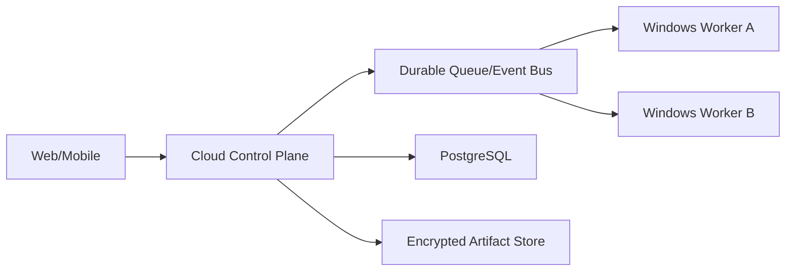

# 13. 可行性、风险与架构决策

## 1. 总体可行性结论

该项目在“Windows 单机、精选工具、用户在环、12～16 周求职版”的范围内可行。不可行的是首版同时追求全应用通用 GUI、手机远控、管理员级系统操作、完全离线同等智能和生产级多租户云平台。

可行性的关键不是模型足够聪明，而是：

- 用确定性工具覆盖精选场景。
- 用任务状态机控制模型调用和恢复。
- 用独立策略/Runner 限制错误的影响范围。
- 用云端模型完成复杂规划，本地模型承担隐私/低成本场景。
- 用黄金任务证明真实能力，并对失败边界诚实。

## 2. 子系统可行性矩阵

| 子系统 | 可行性 | 难度 | 主要依据/限制 |
| --- | --- | --- | --- |
| FastAPI + Vue 前后端分离 | 高 | 低 | 成熟生态、契约清晰 |
| OpenAI-compatible 网关 | 高 | 中 | 共同子集可做；兼容差异需能力探测 |
| 任务 DAG/恢复 | 高 | 中高 | LangGraph + 自有事件/领域状态 |
| 文件/文档只读 | 高 | 中 | 格式库成熟；复杂排版/扫描件有损 |
| Windows 信息/应用启动 | 高 | 中 | psutil/Win32/WMI；版本差异需测试 |
| 浏览器 DOM 自动化 | 高 | 中 | Playwright；登录/反爬/页面变化是限制 |
| 本地知识库 | 高 | 中 | FTS + embedding；首次索引和引用需工程化 |
| 安全审批与审计 | 高 | 中高 | 可确定性实现；不是强 OS 沙箱 |
| MCP stdio | 高 | 中 | 标准协议；第三方工具仍不可信 |
| 通用桌面 GUI 操作 | 中低 | 高 | UI 波动、坐标/视觉误差，不进 P0 |
| 软件自动安装 | 中 | 高风险 | WinGet 可行，但提权/供应链/重启复杂 |
| 完全本地高质量复杂 Agent | 取决于硬件 | 高 | 小模型工具能力和上下文有限 |
| 手机远控/多端同步 | 中 | 很高 | 网络穿透、身份、E2EE、远程桌面，不进求职 MVP |

## 3. 硬件和运行假设

### 云端模式最低建议

- Windows 10/11 x64。
- 8 GB 内存可运行基础 API、前端和只读工具；16 GB 更舒适。
- Python 3.12+、现代 Chromium/Playwright。
- 可访问至少一个 OpenAI-compatible API。

### 本地模型建议

- 16 GB 内存适合运行小型量化文本模型并完成基础路由/摘要。
- 更大模型、视觉或长上下文需要更多内存/显存，不能承诺所有电脑同等体验。
- Ollama 是可选 Provider，不应成为云端演示的强制安装项。
- 本地 embedding 可独立于生成模型运行，优先选择中文/多语种、小体积模型。

实际 README 在代码阶段用目标机器实测后填写，不照搬腾讯 Marvis 官网的硬件要求作为本项目要求。

## 4. 主要风险登记

| ID | 风险 | 概率 | 影响 | 缓解 | 触发/降级 |
| --- | --- | --- | --- | --- | --- |
| R-01 | 本地模型无法稳定工具调用 | 高 | 中 | 能力探测、规则快速路径、结构化修复一次 | 降级只读/摘要或请求云端 |
| R-02 | LangGraph API/持久化耦合 | 中 | 中 | 隔离 framework types、自有 Task/Event | 必要时自建小状态执行器 |
| R-03 | Windows 工具在不同版本失效 | 中 | 高 | capability probe、错误分类、Windows CI | 标记 unavailable，不让模型猜替代命令 |
| R-04 | GUI 自动化脆弱 | 高 | 中 | 浏览器 DOM 优先、原生工具优先 | 移出 P0，用户接管 |
| R-05 | 文档解析不完整/恶意文件 | 中 | 高 | Worker 隔离、限额、多 parser、失败单文件化 | 跳过并报告 |
| R-06 | 提示注入导致危险提议 | 高 | 高 | Policy/Runner 确定性边界、对抗测试 | 拒绝并记录安全事件 |
| R-07 | 审批过多影响体验 | 中 | 中 | R0 快速路径、批量 manifest、可逆 R1 规则 | 从 trace 调整，不降低 R2/R3 |
| R-08 | 依赖/打包在 Windows 出问题 | 中 | 高 | 阶段 0 spike、锁版本、干净机 smoke | 浏览器形态优先，延后 Tauri |
| R-09 | 向量库安装/并发问题 | 中 | 中 | adapter + spike | FTS5 + 小规模 NumPy fallback |
| R-10 | 个人开发范围失控 | 高 | 高 | P0/P1/P2、阶段门、每周闭环 | 削减视觉/远控/市场 |
| R-11 | API 费用/网络影响演示 | 中 | 中 | 预算、缓存、Fake/trace 后备 | 离线回放并明确标识 |
| R-12 | 项目被误解为简单套壳 | 中 | 高 | 展示状态机、安全、Runner、eval 数据 | README 首屏给证据 |

## 5. 关键架构决策

### D-01：Windows-first，而非一开始跨平台

- **决定**：P0 只承诺 Windows。
- **原因**：用户目标包含系统/应用控制；跨平台会把每个工具变成三套实现。
- **后果**：领域接口保持跨平台命名，Windows adapter 独立；Mac/Linux 后续增加。

### D-02：前端先浏览器，桌面壳后置

- **决定**：FastAPI + Vue 先跑通，Tauri 在发布打磨阶段评估。
- **原因**：浏览器足以验证前后端分离；打包不是核心 Agent 风险。
- **后果**：API 只绑定 localhost 并严格鉴权；桌面体验稍晚。

### D-03：LangGraph 作为运行引擎，自有领域状态为真值

- **决定**：利用其 durable execution、streaming、human-in-the-loop 能力。
- **原因**：[LangGraph 官方参考](https://langchain-ai.github.io/langgraph/reference/)与长时任务需求匹配。
- **后果**：需要 adapter 防止框架对象进入 API/domain；升级要跑恢复兼容测试。

### D-04：SQLite 起步

- **决定**：单机使用 SQLite WAL + Alembic。
- **原因**：零运维、事务和查询能力足够，适合桌面应用。
- **后果**：不适合多机高并发；Repository 预留 PostgreSQL。

### D-05：控制面和 Tool Runner 分进程

- **决定**：模型/编排不能在 API 进程直接调用 OS。
- **原因**：隔离崩溃、超时、取消和权限边界。
- **后果**：增加 IPC、进程管理和打包成本，但属于值得展示的工程复杂度。

### D-06：禁止通用 Shell 工具

- **决定**：普通 Agent 只使用参数化领域工具。
- **原因**：shell 使权限、审计、schema 和回滚几乎失效。
- **后果**：新增能力要开发工具，扩展速度略慢但更安全可测。

### D-07：OpenAI-compatible 共同子集 + 原生 adapter

- **决定**：Chat Completions 共同子集保证覆盖，Responses/Ollama 用 adapter 增强。
- **原因**：兼容端点的能力不一致；[OpenAI 官方 Function calling](https://developers.openai.com/api/docs/guides/function-calling)提供结构化工具模式，但不是所有 Provider 完整实现。
- **后果**：需要能力档案和 contract test，换来可控降级。

### D-08：事件追加写 + 当前状态表

- **决定**：事件用于恢复/审计，状态表用于查询。
- **原因**：仅保存最后状态无法解释审批、工具和崩溃；纯 event sourcing 对个人项目过重。
- **后果**：状态、事件和 outbox 需事务一致。

### D-09：MCP 是扩展协议，不是信任协议

- **决定**：MCP tools 导入 Registry 后仍执行本地风险映射和审批。
- **原因**：[MCP 规范](https://modelcontextprotocol.io/specification/2025-06-18/server/index)定义能力交换；工具由模型控制调用不意味着可跳过宿主权限。
- **后果**：第三方接入多一步配置，但安全语义统一。

## 6. 不采用方案及原因

| 方案 | 暂不采用原因 | 何时重新评估 |
| --- | --- | --- |
| 所有 Agent 独立微服务 | 单机调试/部署成本高，无吞吐收益 | 多设备/远程 Worker |
| Kafka + Redis + PostgreSQL 起步 | 过度运维，稀释核心能力 | 多用户云服务 |
| 纯 prompt 编排 | 状态、重试、权限和恢复不可控 | 不重新评估为核心方案 |
| 单一大 Agent + 所有工具 | 上下文/误调用/权限面过大 | 仅用于对照评测 |
| 完全自研 Agent framework | 进度风险高 | LangGraph 不能满足关键恢复语义时 |
| Electron 首发 | 与 Python 双重体积/打包复杂 | Tauri 不可用且确需成熟桌面生态时 |
| Selenium | Playwright 的 context/等待/现代 API 更适合 | 特定企业浏览器兼容需求 |
| 默认全盘索引 | 隐私、耗时、空间不可控 | 永不默认；仅用户明确授权 |
| 通用管理员 PowerShell | 风险不可接受、无法可靠审计 | 不进入普通模式 |

## 7. 阶段 0 必做 Spike 与 Go/No-Go

| Spike | Go 标准 | No-Go 后备 |
| --- | --- | --- |
| OpenAI-compatible 工具调用 | 结构化调用/流式/错误可归一化 | prompted JSON 仅用于无副作用任务 |
| Ollama | 中文摘要稳定、健康/取消可控 | 仅作为可选 Provider |
| LangGraph checkpoint | 重启后恢复指定节点 | 自建有限状态执行器 |
| Runner IPC | 认证、超时、取消、结果大小限制通过 | 换命名管道/loopback 方案 |
| 文档解析 | 代表 PDF/DOCX/XLSX 有 locator | 标记不支持/换 parser |
| 向量索引 | Windows 安装，增删查/备份通过 | FTS5 + NumPy |
| Playwright | 测试网页稳定提取/填表/取消 | Search + HTTP 抽取先行 |
| pywinauto | 启动/识别测试应用稳定 | 只做 app launch/close API |

Spike 最长 3～5 天；不应演变为没有用户闭环的长期技术探索。

## 8. 扩展架构

当出现多设备需求时，可演进为：

需要新增设备身份、双向认证、端到端加密、远程审批、离线队列和冲突解决。它不是把当前 API 暴露到公网，因此明确放在 P2。

## 9. 已知限制

- 无法保证所有 Windows 应用都能可靠 GUI 自动化。
- 本地小模型可能不适合复杂规划；隐私模式能力会低于强云端模型。
- 用户态 Runner 降低风险但不是虚拟机级恶意代码沙箱。
- 文档格式保真编辑比文本提取困难，MVP 只承诺精选生成/写入。
- 网站反爬、登录、验证码和页面变化会导致 Browser Agent 需要用户接管。
- 公开资料不足以验证腾讯 Marvis 的私有调度、安全或模型实现，本项目不做等价声明。

## 10. 进入代码阶段前的确认清单

请评审并确认：

- [ ] 项目暂用名 `DeskPilot`，或提供新名称。
- [ ] 前端采用 Vue 3 + TypeScript。
- [ ] Python 3.12+、FastAPI、LangGraph 为首选栈。
- [ ] MVP 只支持 Windows，浏览器 UI 先行，Tauri 后置。
- [ ] 普通模式不提供任意 Shell 和管理员操作。
- [ ] 软件安装、强杀进程、外部发布不进入第一个 MVP。
- [ ] 数据层从 SQLite 开始，向量实现经 spike 决定。
- [ ] 首个代码里程碑是 Fake 闭环和只读工具，而不是完整 UI 或所有 Agent。

确认后即可按[分阶段开发路线](11-分阶段开发路线.md)开始代码搭建。
