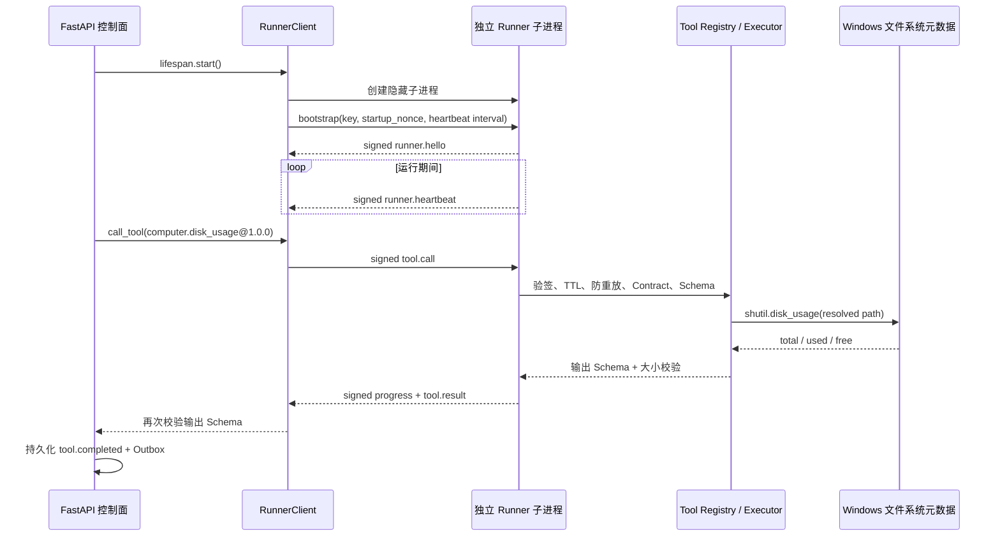

# 15. 独立 Runner 与首个 R0 工具实现

## 1. 本阶段结果

DeskPilot 已从“模拟工具事件”进入“真实只读工具闭环”：FastAPI 控制面启动独立 Python Runner 子进程，通过签名 NDJSON 调用 `computer.disk_usage@1.0.0`，并将真实磁盘容量结果写入持久化任务事件。

后续阶段已在此基础上加入 Runner 自动换代、退避/熔断和持久化调用账本；当前运行语义见 [Runner 故障恢复与 unknown 调用持久化](27-Runner故障恢复与unknown调用持久化.md)。

Policy/Approval 现已接在调用账本与 Runner dispatch 之间；R0 默认允许，也可在本地验收时强制进入一次性审批。详见 [Policy / Approval 执行前授权主干](28-Policy-Approval执行前授权主干.md)。

本阶段明确不包含模型接入、任意 Shell、软件安装/关闭、文件写入或其他有副作用操作。

## 2. 运行时结构



## 3. 组件职责

| 组件 | 位置 | 职责 |
| --- | --- | --- |
| `RunnerClient` | `application/runner_client.py` | 生成会话材料、启动/监控/关闭子进程、发送调用、关联进度与结果 |
| `RunnerSupervisor` | `application/runner_supervisor.py` | 以不可变代际 lease 管理自动重启、退避、open/half-open 熔断和稳定窗口 |
| `tool_calls` | migration `0006` | 保存参数摘要、调用状态、Runner ID、稳定错误码和终态事件关联 |
| `RunnerBootstrap` | `runner/ipc_protocol.py` | 定义唯一一个未签名首帧；使子进程获得后续验签所需会话密钥 |
| `RunnerServer` | `runner/server.py` | 读取帧、授权、并发调度、心跳、取消、超时和结果签名 |
| Runner 入口 | `runner/service.py` | 只组合生产内置工具并启动 stdio server |
| `ToolExecutor` | `runner/executor.py` | 保存静态 handler 白名单，执行并校验输出 Schema/大小 |
| 内置工具组合 | `tools/builtins.py` | 确保控制面 Registry 与 Runner Executor 使用同一 Contract |
| 磁盘工具 | `tools/computer.py` | 解析现有路径并读取其所在磁盘容量元数据 |

Runner 进程通过当前 Python 解释器执行：

```text
python -m deskpilot.runner.service
```

该命令不适合直接交互运行，因为 Runner 启动后要求 stdin 第一帧是由控制面生成的严格 bootstrap。Windows 上控制面使用 `CREATE_NO_WINDOW`，不会弹出额外控制台窗口。

## 4. 启动与密钥交付

1. 控制面每次启动 Runner 都生成 32 字节随机 HMAC 密钥、随机 `key_id` 和随机 `startup_nonce`。
2. 密钥仅通过重定向 stdin 的首帧交给刚创建的子进程，不放入命令行、环境变量、磁盘配置或日志。
3. Runner 用该密钥签名 `runner.hello`；控制面验签并确认协议版本后才把 Runner 标记为 ready。
4. 后续命令和响应全部使用 `deskpilot.runner.v1` 签名信封。
5. Runner 默认每 0.5 秒发送 heartbeat；控制面默认 3 秒未收到心跳即终止失联进程并拒绝待处理调用。

stdin bootstrap 比命令行/环境变量泄露面更小，但还不是抵抗同一用户高权限恶意进程的完整机密通道。桌面发布版需要 Windows 受限令牌、句柄继承白名单和 Job Object。

## 5. 调用、并发与退出

- `RunnerClient` 在发送前再次用控制面 Registry 校验输入，并绑定完全一致的 Contract 摘要。
- Runner 最多允许 8 个活动调用，线程池最多 4 个 worker，避免无限并发。
- 每个调用按 Contract 的 `timeout_seconds` 计时；超时返回 `TOOL_TIMEOUT`，结果不会在之后重复提交。
- `tool.cancel` 设置协作取消信号；尚未开始的 Future 会直接取消，已运行 handler 必须检查信号。
- Runner 关闭时控制面先关闭 stdin；子进程收到 EOF 后取消活动调用、回收线程池并退出。
- Windows asyncio stdout/stderr transport 会等待 EOF 后回收，避免事件循环关闭后的管道泄漏。
- Runner 意外退出时，读取循环以 first-wins 故障通知结束本代 pending；Supervisor 不重放旧调用，按退避/熔断策略创建全新签名代际。

当前 timeout 无法强行终止单个卡死的 Python 线程。幂等工具可返回确定 timeout；非重放安全工具若已开始执行则返回 `unknown`。未来仍应使用每调用 worker 子进程或在超时后重启整个 Runner。

## 6. `computer.disk_usage@1.0.0`

### 6.1 Contract

| 属性 | 值 |
| --- | --- |
| 风险 | `R0` |
| 副作用 | 无 |
| 网络访问 | 禁止 |
| capability | `filesystem.metadata.read` |
| 幂等性 | `idempotent` |
| 超时 | 5 秒 |
| 最大输出 | 16 KiB |

输入：

```json
{"path": "."}
```

输出：

```json
{
  "requested_path": ".",
  "resolved_path": "D:\\workspace",
  "total_bytes": 1000000000,
  "used_bytes": 400000000,
  "free_bytes": 600000000,
  "used_percent": 40.0
}
```

实现先用 `Path.expanduser().resolve(strict=True)` 要求目标存在，再用标准库 `shutil.disk_usage` 查询目标所在卷。工具不枚举目录内容、不读取文件正文、不修改文件，也不访问网络。

`resolved_path` 会进入任务事件，因此仍属于可能敏感的本地信息。当前 Fake Planner 只使用后端配置的 `DESKPILOT_DISK_USAGE_PATH`，不会直接把自然语言中的任意路径交给工具；Policy 精确目录 allowlist 与控制面/Runner 双侧 resource projector 已绑定该配置路径，OS 级目录权限仍待后续隔离阶段落实。

## 7. 任务事件闭环

现有 TaskProcessor 通过 Model Gateway 的 Fake Provider 获得确定性分类和计划，工具阶段执行真实调用：

```text
task.created
-> classifying
-> model.started / model.usage (intent)
-> task.classified
-> model.started / model.usage (planner)
-> plan.proposed
-> running
-> step.started
-> tool.requested  (call_id + version + contract/arguments digest + R0)
-> tool.started    (call_id + runner_id)
-> tool.completed  (call_id + real disk usage result)
-> step.completed
-> task.completed
```

暂停/恢复仍以持久化事件之间的安全点为检查点。若已完成工具调用后暂停，恢复不会重复相同 `call_id`。API 关闭时先停止 Processor，再关闭 Runner，避免任务仍在提交工具调用时销毁进程。

`tool.requested`、`tool.started` 和工具终态现在同时更新持久化调用账本与 Outbox。Runner 结果无法证明时，事件链为 `tool.unknown -> task.failed`，两者在同一事务提交，且相同 `call_id` 永不自动重放。

## 8. 失败语义

| 场景 | 当前行为 |
| --- | --- |
| 输入 Schema 错误 | 控制面发送前拒绝 |
| 签名、TTL、nonce 或会话错误 | Runner 拒绝并仅向 stderr 写稳定错误码 |
| 未注册工具/摘要不一致 | 签名结果返回结构化失败 |
| 路径不存在 | `TOOL_EXECUTION_FAILED`，安全消息包含异常类型，不返回堆栈 |
| 幂等工具 Contract 超时 | `failed/TOOL_TIMEOUT` |
| 非重放安全工具执行中超时 | `unknown/TOOL_TIMEOUT_OUTCOME_UNKNOWN` |
| 非重放安全工具执行中取消 | 无法证明未执行时为 `unknown/TOOL_CANCEL_OUTCOME_UNKNOWN` |
| Runner 启动失败 | API degraded 启动，Supervisor 后台退避恢复 |
| Runner 意外退出 | 旧在途调用持久化 `unknown`；Supervisor 为后续调用创建新代 |

对于未来有副作用工具，Runner 进程在操作后、回结果前崩溃时必须持久化为 `unknown`，不能自动重试。该统一映射和启动恢复现已实现；人工 reconciliation 与持久化幂等回执仍待后续阶段。

## 9. 配置

```dotenv
DESKPILOT_RUNNER_HEARTBEAT_INTERVAL_SECONDS=0.5
DESKPILOT_RUNNER_HEARTBEAT_TIMEOUT_SECONDS=3.0
DESKPILOT_RUNNER_STARTUP_TIMEOUT_SECONDS=5.0
DESKPILOT_RUNNER_SHUTDOWN_TIMEOUT_SECONDS=2.0
DESKPILOT_RUNNER_RESTART_BASE_DELAY_SECONDS=0.25
DESKPILOT_RUNNER_RESTART_MAX_DELAY_SECONDS=10.0
DESKPILOT_RUNNER_CIRCUIT_FAILURE_THRESHOLD=3
DESKPILOT_RUNNER_CIRCUIT_RECOVERY_TIMEOUT_SECONDS=30.0
DESKPILOT_RUNNER_STABLE_WINDOW_SECONDS=10.0
DESKPILOT_DISK_USAGE_PATH=.
```

心跳 timeout 必须大于 interval。生产配置不应把敏感用户目录作为演示默认路径。

## 10. 自动化验收

当前测试验证：

- 磁盘元数据结果、R0 Contract、无副作用和不存在路径失败。
- 控制面/Runner Contract 摘要一致。
- 独立 PID、bootstrap、签名 hello、heartbeat 和干净关闭。
- 真实 `computer.disk_usage` 调用及 progress 序列。
- Runner 结构化工具失败。
- 慢工具 fixture 的 Contract timeout 和协作取消。
- 子进程启动失败与启动后意外退出检测。
- 自动换代、退避封顶、open/half-open、稳定窗口、stop 不复活和真实 PID 换代。
- 持久化调用状态、原子事件/Outbox、启动恢复、迟到结果 no-op 和 `unknown` 不重放。
- 非重放安全工具执行中 timeout/cancel 返回 `unknown`。
- FastAPI 任务事件中 `call_id`、版本、摘要和真实磁盘结果关联。
- 原有任务暂停/恢复、取消、Outbox、WebSocket 和安全测试无回归。

## 11. 下一步

Model Gateway、Provider 管理、前端控制面、Runner 故障恢复和 Policy/Approval 均已完成。当前主线下一项是 Windows Job Object/受限令牌与每次调用进程隔离；后续再补持久化幂等回执和人工 reconciliation。

在 Policy/Approval、目录 capability 和有副作用幂等记录完成前，不增加 Shell、文件写入、应用关闭或安装工具。
