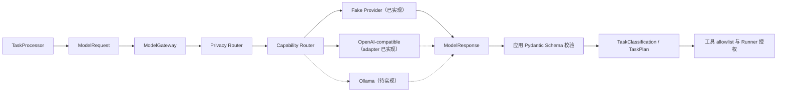

# 16. Model Gateway 与 Fake Provider 实现

## 1. 本阶段结果

DeskPilot 已建立与模型供应商 SDK 解耦的 Model Gateway。任务分类和计划不再由 Processor 内的硬编码字典直接产生，而是通过统一 `ModelRequest` 请求 Provider、经过统一 `ModelResponse` 和应用 Pydantic Schema 双重校验后进入任务状态机。

默认空 catalog 注册的实现仍是本地 `FakeModelProvider`：无需网络、API Key 或付费账户，适合开发、CI 和求职演示。后续已实现受 Mock Transport 验证的 `OpenAICompatibleChatProvider`，并可通过安全 catalog 同时注册本地 Ollama-compatible 与可选云端 Provider；详见 [OpenAI-compatible Chat Provider 实现](17-OpenAI-Compatible-Chat-Provider实现.md)和 [Provider 配置与凭据引用实现](18-Provider配置与凭据引用实现.md)。OpenAI Responses 和 Ollama 原生 adapter 尚未实现。

## 2. 模块结构

```text
backend/src/deskpilot/
├── domain/
│   ├── model_contracts.py        # Provider-neutral 协议
│   └── planning.py               # 分类与计划 Schema
├── application/
│   ├── model_gateway.py          # Provider port、注册、能力/隐私路由
│   └── processor.py              # 使用 Gateway，不导入供应商 SDK
└── model_providers/
    └── fake.py                   # 离线确定性 Provider
```



模型输出只提供候选分类和计划。即使计划包含工具名，也必须继续通过应用白名单、Contract 摘要、Runner 验签和参数 Schema；Provider 永远不能直接操作电脑。

## 3. Provider port

`ModelProvider` 使用 `typing.Protocol` 定义四个边界：

```python
class ModelProvider(Protocol):
    @property
    def descriptor(self) -> ModelProviderDescriptor: ...
    async def complete(self, request: ModelRequest) -> ModelResponse: ...
    def stream(self, request: ModelRequest) -> AsyncIterator[ModelStreamEvent]: ...
    async def health(self) -> ProviderHealth: ...
```

Provider adapter 可以依赖自己的 SDK/HTTP 类型，但这些类型不能越过此 port 进入 Processor、领域模型或 API 事件。

`create_app(..., model_provider=...)` 支持从应用组合根注入 Provider，测试和后续桌面配置不需要修改 Processor。

## 4. 能力描述

每个 Provider 注册时必须提供不可变 `ModelProviderDescriptor`：

| 字段 | 示例 | 作用 |
| --- | --- | --- |
| `provider_id` | `fake-local` | 稳定配置和路由标识 |
| `model` | `deskpilot-fake-v1` | 具体模型/fixture 名称 |
| `protocol` | `fake` | `fake/openai_compatible_chat/openai_responses/ollama` |
| `location` | `local` | `local/cloud`，参与隐私路由 |
| `streaming` | `true` | 是否支持统一流式事件 |
| `structured_output` | `true` | 是否能返回结构化候选输出 |
| `strict_json_schema` | `true` | 是否原生保证严格 JSON Schema |
| `tool_calling` | `none` | `none/prompted/native` |
| `parallel_tool_calls` | `false` | 是否原生支持并行工具调用 |
| `vision/embeddings` | `false` | 多模态和向量能力 |
| `max_context_tokens` | `32768` | 保守上下文能力上限 |

每个请求携带 `ModelCapabilityRequirements`。Gateway 在调用前拒绝能力不足的 Provider，不把“供应商接口兼容”误当成“功能完全一致”。

## 5. 统一请求与响应

### 5.1 `ModelRequest`

关键字段：

- `request_id/task_id/role`：关联任务、模型角色和事件。
- `messages`：供应商无关的 system/user/assistant/tool 消息。
- `privacy_mode`：`local_only/local_preferred/balanced/quality_first`。
- `requirements`：本次调用必需能力。
- `output_schema`：结构化输出名称、说明和 JSON Schema。
- `provider_hint`：显式指定 Provider，但不能绕过隐私或能力校验。
- `cloud_fallback_approved`：`local_preferred` 使用云端前的显式批准位。
- `temperature/max_output_tokens/timeout_seconds`：统一控制参数。
- `metadata`：不参与 prompt 的最小应用元数据。

### 5.2 `ModelResponse`

响应统一包含：

- `request_id/provider_id/model/native_response_id`。
- 文本或结构化输出。
- 统一 `finish_reason`。
- `input/output/total/cached` Token 用量。
- 应用侧测得或 Provider 归一化的延迟。

Gateway 会检查响应的 request、provider 和 model 是否与路由结果一致。结构化调用还会用目标 Pydantic 模型再次校验；Provider 声称“JSON 成功”不能代替应用 Schema。

## 6. 隐私与能力路由

路由先执行隐私约束，再执行能力约束：

| 隐私模式 | 当前规则 |
| --- | --- |
| `local_only` | 只允许 `location=local`；无本地路由时失败 |
| `local_preferred` | 默认只允许本地；只有 `cloud_fallback_approved=true` 才把云端纳入候选 |
| `balanced` | 可在已配置 Provider 中按默认项和能力路由 |
| `quality_first` | 优先配置的默认 Provider，但不改变工具授权规则 |

显式 `provider_hint` 同样执行这些规则，不能用 hint 绕过 `local_only` 或未批准的 `local_preferred` 云端限制。

候选 Provider 都不满足结构化、流式、工具调用、视觉或上下文要求时返回 `MODEL_CAPABILITY_UNAVAILABLE`，不进行静默能力降级。

## 7. 流式事件

统一流式事件类型：

```text
response.started
-> output_text.delta (0..N)
-> response.usage
-> response.completed
```

每个事件携带 `request_id/provider_id/sequence/timestamp`。Gateway 强制序号从 0 连续递增、Provider 身份稳定、存在且只接受最终完成语义，并对完成响应执行与非流式调用相同的校验。

当前 TaskProcessor 的分类和计划使用非流式结构化调用；统一 stream port 已由 Fake Provider 和自动化测试验证，后续可用于长文本摘要或用户可见生成过程。

## 8. 稳定错误模型

| 错误码 | 是否默认可重试 | 含义 |
| --- | --- | --- |
| `MODEL_PROVIDER_ALREADY_REGISTERED` | 否 | Provider ID 重复 |
| `MODEL_PROVIDER_NOT_FOUND` | 否 | Provider 或默认配置不存在 |
| `MODEL_PRIVACY_ROUTE_UNAVAILABLE` | 否 | 没有满足隐私规则的路由 |
| `MODEL_CAPABILITY_UNAVAILABLE` | 否 | Provider 能力不足 |
| `MODEL_AUTHENTICATION_FAILED` | 否 | 未来真实 Provider 认证失败 |
| `MODEL_RATE_LIMITED` | 是 | Provider 临时限流 |
| `MODEL_QUOTA_EXCEEDED` | 否 | 额度、消费或用量上限不可通过重试恢复 |
| `MODEL_REQUEST_REJECTED` | 否 | Provider 拒绝请求参数或兼容子集不匹配 |
| `MODEL_PROVIDER_UNAVAILABLE` | 是 | Provider 调用异常或不可达 |
| `MODEL_TIMEOUT` | 是 | 完成或流式请求超时 |
| `MODEL_CONTENT_FILTERED` | 否 | 未来 Provider 内容过滤 |
| `MODEL_RESPONSE_INVALID` | 否 | 最终响应或结构化输出无效 |
| `MODEL_STREAM_INVALID` | 否 | 流式身份、序号或完成语义无效 |

Provider 未知异常会转换为 `MODEL_PROVIDER_UNAVAILABLE`，消息只保留异常类型。原始错误正文、API Key、响应正文和堆栈不会进入任务事件。

## 9. Fake Provider

`FakeModelProvider` 是一个真实实现了 port 的本地 Provider，而不是 Processor 内的条件分支：

- `location=local`，支持结构化输出与流式事件。
- 不支持原生工具调用、视觉或 embeddings。
- `task_classification` 固定生成 `computer_info/simple/R0`。
- `task_plan` 固定生成三步计划，唯一工具候选为 `computer.disk_usage@1.0.0`。
- 根据输入/输出字符数产生确定性的估算 Token usage。
- 支持测试注入延迟和失败，验证 timeout 与脱敏错误。
- health 返回归一化 `ready/degraded`。

Fake Provider 的目的是稳定验证主干，不声称具备真实语言理解能力。

## 10. TaskProcessor 接线

任务开始后新增以下模型事件：

```text
task.created
-> task.status_changed(classifying)
-> model.started(role=intent)
-> model.usage(role=intent)
-> task.classified
-> model.started(role=planner)
-> model.usage(role=planner)
-> plan.proposed
-> task.status_changed(running)
-> ... Runner 工具事件 ...
```

`model.started` 只记录 request ID、角色、Provider、model、protocol、location 和 Schema 名，不保存完整 messages。`model.usage` 记录归一化 Token、finish reason 和延迟。

模型计划经过 `TaskPlan` 校验后，当前只读切片还会额外要求：

1. 恰好一个工具步骤。
2. 工具必须精确为 `computer.disk_usage@1.0.0`。
3. Runner 使用本地 Contract 中的参数和摘要重新授权。

因此 prompt injection 或错误模型输出不能扩展当前工具权限。

## 11. 配置

```dotenv
DESKPILOT_MODEL_DEFAULT_PROVIDER_ID=fake-local
DESKPILOT_FAKE_MODEL_PROVIDER_ID=fake-local
DESKPILOT_FAKE_MODEL_NAME=deskpilot-fake-v1
DESKPILOT_FAKE_MODEL_DELAY_SECONDS=0
DESKPILOT_MODEL_REQUEST_TIMEOUT_SECONDS=10
```

应用启动时验证默认 Provider 已注册，配置拼写错误会尽早失败。本阶段本身没有 API Key 配置；后续网络 Provider 通过 credential reference 注入，不在普通配置中保存明文密钥。

## 12. 自动化验收

已覆盖：

- Fake 分类、计划、Token usage 和 health。
- 统一流式事件的连续序号与完成响应。
- 本地/云端隐私路由和 `local_preferred` 云回退批准。
- capability 不足、Provider timeout 和异常映射。
- Provider/response 身份不一致拒绝。
- 重复 Provider 与缺失默认 Provider 拒绝。
- 模型失败的 `model.failed -> task.failed` 持久化和敏感错误脱敏。
- API 任务事件包含两次模型调用、结构化分类、Provider 计划和真实 Runner 结果。
- 暂停/恢复后模型事件和工具调用不重复。

## 13. 已知边界与下一步

- OpenAI-compatible Chat adapter 已实现；尚无 Responses 或 Ollama 原生 adapter。
- 尚未持久化 Provider 配置、能力探测结果或健康历史。
- 当前路由没有费用预算、延迟 EWMA、熔断和角色级 Provider 配置。
- Fake Token 是估算值，真实 Provider 必须优先使用其 usage 字段并标记缺失/估算。
- 当前不记录完整 prompt，有利于隐私；后续调试包只能在用户明确选择后导出脱敏内容。

后续已完成 Provider 配置、credential reference、管理 API、公开/密文持久化、Windows Credential Manager、审计和动态 adapter registry，见[Provider 配置与凭据引用实现](18-Provider配置与凭据引用实现.md)、[Provider 只读 API 与健康探测缓存实现](19-Provider只读API与健康探测缓存实现.md)、[Provider Catalog 持久化与启动导入实现](20-Provider-Catalog持久化与启动导入实现.md)、[Windows Credential Manager 实现](21-Windows-Credential-Manager实现.md)、[Provider 运行配置保护与审计模型实现](22-Provider运行配置保护与审计模型实现.md)和[Provider 管理服务与写 API 实现](23-Provider管理服务与写API实现.md)。下一步开发前端模型设置页。
