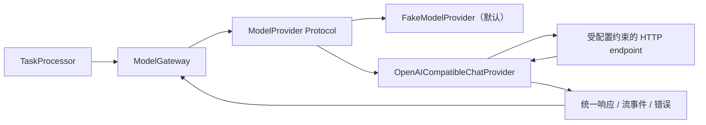

# 17. OpenAI-compatible Chat Provider 实现

## 1. 本阶段结果

DeskPilot 已实现 `OpenAICompatibleChatProvider`，把领域层的 `ModelRequest` 转换为 `/chat/completions` 请求，并把非流式 JSON 或流式 SSE 转换回统一 `ModelResponse/ModelStreamEvent`。

本阶段没有调用任何真实网络模型或付费服务。所有 HTTP 行为均由 `httpx.MockTransport` 在进程内模拟；应用默认 Provider 仍是无需 API Key 的 `FakeModelProvider`。只有组合根显式注入网络 Provider 且默认 Provider ID 与其一致时，任务才可能访问配置的 endpoint。

实现文件：

```text
backend/src/deskpilot/model_providers/openai_compatible_chat.py
backend/tests/test_openai_compatible_provider.py
```

## 2. 依赖方向



Processor、任务状态机和领域模型不导入 `httpx` 或供应商 SDK。HTTP 请求体、响应体、SSE 和状态码都被限制在 adapter 内部。

`httpx` 现已是后端运行时依赖，而不再只是测试依赖。

## 3. 请求映射

统一请求映射到 Chat Completions 共同子集：

| `ModelRequest` | HTTP 请求 |
| --- | --- |
| Provider descriptor 的 `model` | `model` |
| `messages` | `messages[].role/content/name` |
| `temperature` | `temperature` |
| `max_output_tokens` | 默认 `max_tokens`，可配置为 `max_completion_tokens` |
| `output_schema` | `response_format.type=json_schema` |
| `output_schema.strict` | `response_format.json_schema.strict` |
| `stream=True` | `stream=true` 与 `stream_options.include_usage=true` |

以下字段不会发送到模型 endpoint：

- DeskPilot `task_id/request_id`。
- 隐私路由状态和云回退批准位。
- 应用内部 `metadata`。
- Tool Contract、Runner 会话或本地 session token。

这既减少隐私暴露，也防止把内部控制字段误当成供应商功能。

## 4. 非流式响应校验

adapter 对成功响应依次验证：

1. 响应体不超过配置的字节上限，默认 4 MiB。
2. JSON 符合 Chat Completion 最小 Schema。
3. 只有一个 choice，且索引为 0。
4. 响应 `model` 与配置的模型完全一致。
5. 消息存在文本内容，且没有 refusal/content filter。
6. `prompt_tokens + completion_tokens == total_tokens`。
7. 结构化请求的消息内容能解析为 JSON object。
8. Gateway 再用业务 Pydantic 模型进行第二次校验。

Provider 声称支持 strict JSON 不能代替本地校验；模型响应也不能修改 Provider ID、工具 allowlist 或 Runner 权限。

## 5. SSE 流式处理

adapter 不假设一个网络 chunk 就是一条 SSE 消息。字节流先经过有界 UTF-8 行解析，再组装 `data:` 字段，可处理 JSON 帧和 UTF-8 字符被任意拆包的情况。

标准输出序列为：

```text
response.started
-> output_text.delta (0..N)
-> response.usage
-> response.completed
```

流式完成必须同时满足：

- 总接收量不超过配置上限。
- 所有 chunk 的 `id/model` 保持一致。
- choice 索引为 0。
- 存在 finish reason。
- 存在 `include_usage` 最终 usage。
- 存在 `[DONE]`。
- 聚合后的结构化文本通过 JSON 与应用 Schema 校验。

任何条件不满足都会转换为 `MODEL_STREAM_INVALID`，不会把半截 JSON 当成可执行计划。

## 6. HTTP 与供应商错误归一化

| 情况 | 统一错误 | 可重试 |
| --- | --- | --- |
| 401/403 | `MODEL_AUTHENTICATION_FAILED` | 否 |
| 普通 429 | `MODEL_RATE_LIMITED` | 是 |
| 额度、组织/项目消费或用量上限类 429 | `MODEL_QUOTA_EXCEEDED` | 否 |
| 408/504 或 `httpx.TimeoutException` | `MODEL_TIMEOUT` | 是 |
| 500+ 或连接失败 | `MODEL_PROVIDER_UNAVAILABLE` | 是 |
| 其他 4xx | `MODEL_REQUEST_REJECTED` | 否 |
| refusal/content filter | `MODEL_CONTENT_FILTERED` | 否 |
| 非法 JSON、身份、usage 或 Schema | `MODEL_RESPONSE_INVALID` / `MODEL_STREAM_INVALID` | 否 |

错误事件只保存稳定错误码、Provider ID 和 retryable，不保存上游响应正文。测试会在上游错误正文中注入伪密钥并确认它不会进入异常消息。

特别区分普通限流和额度耗尽：普通限流可以受预算约束地退避重试；额度或消费上限不会通过重试恢复，不应制造请求风暴。

## 7. 凭据与 endpoint 安全

- API Key 使用 Pydantic `SecretStr`，不会进入 descriptor。
- Authorization 只由 adapter 在发送时构造。
- `base_url` 只接受 HTTP(S)，拒绝 URL 内嵌用户名、密码、query 和 fragment。
- 默认 `follow_redirects=false`，避免 Bearer credential 被重定向到其他主机。
- 默认 `trust_env=false`，避免无意继承环境代理；若企业环境确实需要代理，必须由受信任配置显式开启。
- endpoint 由应用配置/组合根提供，模型响应不能修改目标地址。
- 完整请求/响应和 Authorization 不写入任务事件。

当前允许显式配置远程 HTTP，是为了兼容开发者自管 endpoint；正式配置层应默认拒绝非 loopback 的明文 HTTP，并在 UI 中显示主机和 TLS 状态。

## 8. 健康检查

`health()` 对配置 endpoint 发出有界 `GET /models` 探测：

- 2xx：`ready`。
- 429 或不支持探测的普通 4xx：`degraded`。
- 401/403、5xx、连接失败或 timeout：`unavailable`。

健康详情是固定脱敏文本，不包含上游正文或凭据。`/api/v1/health` 仍只显示默认 Provider ID，不会自动调用所有网络 Provider；后续已增加显式的单 Provider 按需 health API，并在公共类型中进一步移除内部 `detail`。

## 9. 组合根接入方式

当前保留显式依赖注入，避免仅因为存在环境变量就自动联网：

```python
from pydantic import SecretStr

from deskpilot.core.config import Settings
from deskpilot.main import create_app
from deskpilot.model_providers import OpenAICompatibleChatProvider

settings = Settings(model_default_provider_id="my-chat")
provider = OpenAICompatibleChatProvider(
    provider_id="my-chat",
    display_name="My compatible endpoint",
    model="configured-model-name",
    base_url="https://example.invalid/v1",
    api_key=SecretStr("loaded-from-a-credential-store"),
)
app = create_app(settings, model_provider=provider)
```

示例域名不可访问，代码片段只说明组合关系。后续已经实现受限 environment credential reference 和多 Provider catalog；正式项目仍不能把明文密钥提交到 `.env`、Markdown 或源码，详见 [Provider 配置与凭据引用实现](18-Provider配置与凭据引用实现.md)。

## 10. 自动化验收

新增测试覆盖：

- strict JSON Schema 请求体与结构化成功响应。
- Authorization 注入及内部 task/request/metadata 不外发。
- UTF-8 任意拆包的 SSE 文本增量、usage 和 `[DONE]`。
- 401、普通 429、额度类 429、400、500、503。
- transport timeout。
- 上游错误正文和伪密钥脱敏。
- 响应模型身份不一致、content filter。
- 缺少 `[DONE]`/usage 的不完整流。
- `/models` health 归一化。
- 危险 `base_url` 形状拒绝。
- 组合根注入真实 adapter 后，分类、计划、独立 Runner 工具调用和任务完成的端到端闭环。

全套测试完全使用 Mock Transport，没有真实 DNS、网络或费用副作用。

## 11. 官方协议依据

- [OpenAI Chat Completions API reference](https://developers.openai.com/api/reference/resources/chat)：`POST /chat/completions`、choice、finish reason、usage 和流式 chunk 的官方字段说明。
- [OpenAI API error codes](https://developers.openai.com/api/docs/guides/error-codes#api-errors)：认证、限流、额度、5xx、连接和超时错误的分类与重试建议。

DeskPilot 实现的是可配置的共同子集，不宣称所有 OpenAI-compatible 服务具备完全相同的模型能力。能力仍由 descriptor 显式声明并由 Gateway 校验。

## 12. 已知边界与下一步

- 适配器已实现，但尚无 Provider 持久化配置或前端模型设置页。
- 尚未实现 credential store/reference；当前只能由受信任 Python 组合根传入 `SecretStr`。
- 默认运行仍只注册 Fake Provider，不会自动发现或连接本地 endpoint。
- 尚无角色级路由、重试预算、`Retry-After`、费用预算、延迟 EWMA 或熔断。
- 尚未实现原生 tool calling；模型计划仍通过结构化输出进入应用白名单，工具执行权不交给 Provider。
- 尚未实现 OpenAI Responses 或 Ollama 原生 adapter。

Provider 配置模型、environment/Windows credential reference、多 Provider 注册、endpoint 安全策略、health API、公开/密文持久化、审计写 API 与动态 adapter registry 已经完成，详见 [Provider 配置与凭据引用实现](18-Provider配置与凭据引用实现.md)、[Provider 只读 API 与健康探测缓存实现](19-Provider只读API与健康探测缓存实现.md)、[Provider Catalog 持久化与启动导入实现](20-Provider-Catalog持久化与启动导入实现.md)、[Windows Credential Manager 实现](21-Windows-Credential-Manager实现.md)、[Provider 运行配置保护与审计模型实现](22-Provider运行配置保护与审计模型实现.md)和[Provider 管理服务与写 API 实现](23-Provider管理服务与写API实现.md)。下一步开发前端模型设置页。
