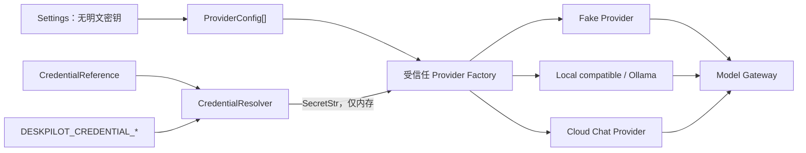

# 18. Provider 配置与凭据引用实现

## 1. 本阶段结果

DeskPilot 已从“组合根只能注册一个注入 Provider”演进为“通过受验证配置同时注册多个 Provider”。当前支持：

- 始终可用的离线 `FakeModelProvider`。
- 通过 `/chat/completions` 共同子集接入的本机 Ollama 或其他 OpenAI-compatible endpoint。
- 使用 HTTPS 和 credential reference 的可选云端 Chat Provider。
- 禁用但保留的 Provider 配置，用于暂时下线而不删除配置。

默认 `DESKPILOT_MODEL_PROVIDERS` 为空时，系统仍使用原有 `fake_model_provider_id/fake_model_name/fake_model_delay_seconds` 创建 Fake Provider，因此升级不会突然联网，也不会要求 API Key。

本阶段没有增加数据库表。Provider catalog 当时来自启动配置，凭据来自受限环境变量；后续已完成公开 catalog 投影持久化和只读管理 API，Windows Credential Manager 仍是下一阶段工作。

## 2. 模块结构

```text
backend/src/deskpilot/
├── domain/provider_config.py
│   ├── CredentialReference
│   ├── FakeProviderConfig
│   └── OpenAICompatibleChatProviderConfig
├── application/credential_resolver.py
│   ├── CredentialResolver Protocol
│   └── 稳定解析错误
├── infrastructure/environment_credentials.py
│   └── EnvironmentCredentialResolver
├── model_providers/factory.py
│   └── 受信任 adapter 工厂
└── main.py
    └── 多 Provider 注册与默认 Provider 校验
```



配置只能选择代码中静态允许的 adapter。不存在 import path、Python 表达式、动态类名或模型生成的插件入口。

## 3. 配置 Schema

`Settings.model_providers` 是最多 32 项的 discriminated union，以 `kind` 区分：

### 3.1 Fake Provider

```json
{
  "kind": "fake",
  "enabled": true,
  "provider_id": "fake-local",
  "display_name": "DeskPilot Fake Model",
  "model": "deskpilot-fake-v1",
  "delay_seconds": 0
}
```

### 3.2 OpenAI-compatible Chat Provider

```json
{
  "kind": "openai_compatible_chat",
  "enabled": true,
  "provider_id": "cloud-chat",
  "display_name": "Cloud Chat",
  "model": "configured-model-name",
  "base_url": "https://models.example.invalid/v1",
  "location": "cloud",
  "credential_ref": {
    "backend": "environment",
    "identifier": "DESKPILOT_CREDENTIAL_CLOUD_CHAT"
  },
  "supports_streaming": true,
  "supports_structured_output": true,
  "supports_strict_json_schema": false,
  "max_context_tokens": 32768,
  "max_tokens_field": "max_tokens"
}
```

还可配置 `max_response_bytes` 和 `health_timeout_seconds`。未在 Schema 中声明的字段一律拒绝，因此 `api_key`、任意 HTTP header、动态 import 或未知能力不能混入配置。

Provider ID 在 catalog 内必须唯一。应用创建 Gateway 后还会验证 `model_default_provider_id` 已注册且 enabled；拼写错误或指向禁用 Provider 会在数据库和 Runner 启动前失败。

## 4. 本地与云端 endpoint 策略

仅把 `location=local` 写进配置不代表 endpoint 真的是本地。配置模型同时验证 URL 主机：

| 配置 | 默认结果 | 原因 |
| --- | --- | --- |
| `http://127.0.0.1:11434/v1` + local | 允许 | loopback，不离开本机 |
| `http://localhost:11434/v1` + local | 允许 | 明确 localhost |
| `http://192.168.1.20:11434/v1` + local | 拒绝 | 局域网地址需要显式批准 |
| 上一项加 `allow_private_network=true` | 允许 | 用户明确接受可信 LAN 边界 |
| public IP + local | 拒绝 | 防止用 location 标签绕过隐私路由 |
| 任意 DNS hostname + local | 拒绝 | 启动时不做易受 DNS rebinding 影响的 locality 推断 |
| HTTP + cloud | 拒绝 | 云端凭据和数据必须走 TLS |
| HTTPS + cloud，但无 credential reference | 拒绝 | 避免误配置匿名付费/远程端点 |

URL 继续拒绝内嵌用户名/密码、query 和 fragment。adapter 层还会默认禁止重定向和环境代理继承，形成配置层与 HTTP 层双重校验。

`allow_private_network` 只允许私网或 link-local IP literal，不能用于公网 IP，也不能用于 cloud Provider。

## 5. Credential reference

Environment 引用格式：

```json
{
  "backend": "environment",
  "identifier": "DESKPILOT_CREDENTIAL_CLOUD_CHAT"
}
```

Windows Credential Manager 引用格式：

```json
{
  "backend": "windows_credential_manager",
  "identifier": "CLOUD_CHAT"
}
```

安全规则：

- environment identifier 只能位于 `DESKPILOT_CREDENTIAL_*` 命名空间，不能引用 `AWS_SECRET_ACCESS_KEY`、系统令牌或任意环境变量。
- Windows identifier 只能使用大写字母、数字和下划线；应用把它映射到固定 `DeskPilot/ModelProvider/` target namespace，不能引用其他应用或系统凭据。
- Provider 配置、`Settings.model_dump()`、descriptor、任务事件和文档都不包含密钥值。
- Resolver 返回 `SecretStr`，只在 HTTP adapter 构造 Authorization header 时读取原值。
- 缺失或空白 credential 以 `CREDENTIAL_NOT_FOUND` fail fast，错误文本不包含密钥。
- disabled Provider 不解析 credential，因此可安全保留暂时停用的配置。

官方 OpenAI 文档建议不要把 API Key 写入代码或公开仓库，而应通过环境变量或 secret management service 提供：[Production best practices - API keys](https://developers.openai.com/api/docs/guides/production-best-practices#api-keys)。当前 environment backend 适合 CI/临时开发，Windows Credential Manager 适合本地桌面持久化；两者通过同一 Protocol 接入。

## 6. 配置示例

PowerShell 启动前先把真正密钥放入当前进程环境：

```powershell
$env:DESKPILOT_CREDENTIAL_CLOUD_CHAT = "your-real-secret"
```

`DESKPILOT_MODEL_PROVIDERS` 只保存无密钥 catalog。为了可读性，下面先展示格式化 JSON；放入环境变量时需序列化为单行：

```json
[
  {
    "kind": "fake",
    "provider_id": "fake-local"
  },
  {
    "kind": "openai_compatible_chat",
    "provider_id": "ollama-local",
    "display_name": "Local Ollama",
    "model": "your-local-model",
    "base_url": "http://127.0.0.1:11434/v1",
    "location": "local"
  },
  {
    "kind": "openai_compatible_chat",
    "provider_id": "cloud-chat",
    "display_name": "Cloud Chat",
    "model": "configured-cloud-model",
    "base_url": "https://api.example.invalid/v1",
    "location": "cloud",
    "credential_ref": {
      "backend": "environment",
      "identifier": "DESKPILOT_CREDENTIAL_CLOUD_CHAT"
    }
  }
]
```

示例域名 `.invalid` 不可访问，防止复制示例时意外产生真实请求。实际 endpoint 和模型能力必须由用户明确配置。

Windows 桌面版可先通过隐藏输入 CLI 保存 `CLOUD_CHAT`，再把上面 reference 的 backend/identifier 换成 Windows 格式。完整命令、Win32 映射和安全边界见[Windows Credential Manager 实现](21-Windows-Credential-Manager实现.md)。

## 7. 组合与生命周期

`create_configured_model_providers()` 只认识静态 `FakeProviderConfig` 和 `OpenAICompatibleChatProviderConfig`：

1. 读取已验证 catalog；为空则生成 legacy Fake 配置。
2. 跳过 disabled Provider。
3. 仅在需要时解析 credential reference。
4. 构造具体 adapter。
5. 逐项注册到 Model Gateway。
6. 验证默认 Provider 确实存在。

所有步骤发生在数据库 migration、Outbox 和 Runner 启动之前。配置或密钥错误不会留下半启动的后台进程。

测试仍可通过 `create_app(..., model_provider=mock_provider)` 显式覆盖 catalog，保持 adapter 单元测试和故障注入简单。

## 8. 自动化验收

新增测试覆盖：

- 空 catalog 向后兼容 legacy Fake Provider。
- Fake、本地 Ollama-compatible、云端 Chat 同时构造和注册。
- 环境 JSON catalog 解析。
- credential 返回 `SecretStr`、缺失错误脱敏、密钥不进入序列化结果。
- 非法 credential 命名空间和配置内明文 `api_key` 拒绝。
- 云端 HTTP、无 credential 云端、公网伪 local、DNS 伪 local 拒绝。
- 私网 endpoint 必须显式 `allow_private_network=true`。
- 重复 Provider ID、缺失/禁用默认 Provider fail fast。
- disabled Provider 不触发 credential 读取。
- FastAPI 组合根实际注册三个 Provider，同时保持 Fake 为默认且不发起模型网络请求。

## 9. 已知边界与下一步

- 后续已把公开 catalog 投影和 DPAPI 密文运行配置分别持久化到 SQLite，并将数据库切换为 adapter 启动真值。
- environment resolver 不会主动读取 `.env` 文件中的密钥；密钥必须存在于启动进程环境。这样可以避免把 Provider secret 混入普通 Settings。
- 后续已实现 Windows Credential Manager；macOS Keychain、Linux Secret Service 或跨平台 keyring 尚未实现。
- 后续已增加只读 Provider 管理 API；前端仍无法启停或选择默认 Provider。
- adapter 的 `GET /models` health 已通过按需公共 API 聚合，但健康结果只做进程内短期缓存，尚未持久化历史。
- 私有 DNS、本地域名和自签 TLS 暂未支持；后续需要显式信任配置和证书策略，不能通过关闭验证解决。
- 自动化测试仍不连接真实 Ollama 或云端服务。

后续进展：Provider 管理 API、公开/密文持久化、Windows Credential Manager、审计、ETag/幂等写入和动态 adapter registry 已完成，见[Provider 只读 API 与健康探测缓存实现](19-Provider只读API与健康探测缓存实现.md)、[Provider Catalog 持久化与启动导入实现](20-Provider-Catalog持久化与启动导入实现.md)、[Windows Credential Manager 实现](21-Windows-Credential-Manager实现.md)、[Provider 运行配置保护与审计模型实现](22-Provider运行配置保护与审计模型实现.md)和[Provider 管理服务与写 API 实现](23-Provider管理服务与写API实现.md)。下一步开发前端模型设置页。
