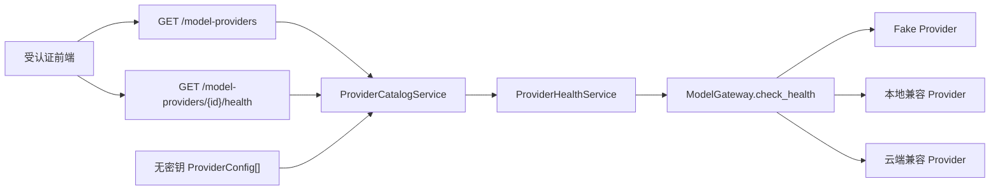

# 19. Provider 只读 API 与健康探测缓存实现

## 1. 本阶段结果

本阶段在不引入数据库变更、不允许在线修改配置、也不暴露凭据的前提下，完成了 Provider 管理面的第一个可用切片：

- `GET /api/v1/model-providers` 返回启动时生效的 Provider catalog。
- `GET /api/v1/model-providers/{provider_id}/health` 按需执行单个 Provider 健康探测。
- catalog 同时显示 enabled 与 disabled Provider，以及默认 Provider 标记。
- 公共响应只包含 descriptor 和脱敏健康快照，不包含 endpoint、credential reference、API Key 或上游错误正文。
- 列表查询严格零探测；只有显式 health 请求才可能访问 Provider endpoint。
- 健康探测具有 TTL 缓存、同 Provider single-flight、全局并发上限、超时和关闭取消。

默认空 catalog 仍只使用离线 Fake Provider。因此，升级到这一阶段不会自动连接 Ollama、云端模型或产生付费请求。

## 2. 组件关系



职责边界：

| 组件 | 职责 |
| --- | --- |
| `domain/provider_management.py` | 定义完全可公开的 catalog 与健康快照模型 |
| `application/provider_catalog.py` | 聚合 descriptor、enabled/default 和已有缓存；拒绝探测 disabled Provider |
| `application/provider_health_service.py` | 负责 TTL、single-flight、并发上限、timeout 和生命周期 |
| `application/model_gateway.py` | 精确解析 Provider，调用 adapter health，并把异常归一为 `unavailable` |
| `api/routes/model_providers.py` | 暴露受认证只读接口和稳定 Problem Details 错误码 |
| `model_providers/factory.py` | 从同一份有效配置生成运行 adapter 和无密钥公开 descriptor |

`describe_model_provider_config()` 构造公开 descriptor 时不会解析 credential。这样 disabled 云端配置即使当前没有密钥，也能安全显示在列表中。

## 3. API 契约

### 3.1 查询 catalog

```http
GET /api/v1/model-providers
Authorization: Bearer <local-session-token>
```

示例响应：

```json
{
  "catalog_version": 1,
  "imported_at": "2026-08-09T05:19:00Z",
  "default_provider_id": "fake-local",
  "providers": [
    {
      "descriptor": {
        "provider_id": "fake-local",
        "display_name": "DeskPilot Fake Model",
        "model": "deskpilot-fake-v1",
        "protocol": "fake",
        "location": "local",
        "capabilities": {
          "streaming": true,
          "structured_output": true,
          "strict_json_schema": true,
          "tool_calling": "none",
          "parallel_tool_calls": false,
          "vision": false,
          "embeddings": false,
          "max_context_tokens": 32768
        }
      },
      "enabled": true,
      "is_default": true,
      "cached_health": null
    }
  ]
}
```

该接口只读取内存 catalog 与尚未过期的缓存。它不会调用 `provider.health()`，因此页面加载、轮询列表或刷新浏览器都不会造成外部模型请求。

### 3.2 按需健康探测

```http
GET /api/v1/model-providers/fake-local/health
Authorization: Bearer <local-session-token>
```

示例响应：

```json
{
  "provider_id": "fake-local",
  "status": "ready",
  "checked_at": "2026-08-09T05:20:00Z",
  "latency_ms": 0,
  "cache_status": "fresh",
  "expires_at": "2026-08-09T05:20:15Z"
}
```

`cache_status` 语义：

| 值 | 含义 |
| --- | --- |
| `fresh` | 本请求创建了新的实际探测 |
| `cached` | 直接使用 TTL 内的已有结果，没有访问 Provider |
| `coalesced` | 本请求加入了同 Provider 正在执行的探测，没有创建第二次访问 |

catalog 内的 `cached_health` 只代表“当前存在有效缓存”，因此统一显示为 `cached`。

## 4. 探测风暴防护

健康接口是 GET，但它可能触发网络 I/O。实现同时使用三层约束：

1. **TTL 缓存**：默认 15 秒内复用成功、降级和失败结果，避免不可用服务被持续打满。
2. **同 Provider single-flight**：同一时刻对同一 Provider 的并发请求共享一个内部 Task。
3. **全局 Semaphore**：默认最多同时探测 4 个不同 Provider，防止 catalog 较大时耗尽连接和线程资源。

共享探测通过 `asyncio.shield()` 等待。某一个 HTTP 客户端断开或取消自己的等待，不会取消其他调用者仍在等待的实际探测。应用关闭时则会统一取消尚未结束的内部探测，避免遗留后台 Task。

没有提供 `force=true` 或批量“全部刷新”接口。前端无法通过绕过缓存制造请求风暴；后续若确实需要强制刷新，应增加单独授权、速率限制和审计，而不是复用当前公开查询契约。

## 5. 脱敏与安全边界

- 两个接口都位于本地 session Bearer 认证边界内，不属于公开 health/session 引导路径。
- descriptor 不包含 `base_url`，避免暴露内网地址、租户路径和供应商部署细节。
- 响应不包含 credential reference 或 credential identifier，更不包含密钥值。
- adapter 的内部 `ProviderHealth.detail` 允许帮助服务端诊断，但公共 `ProviderHealthSnapshot` 在类型层面根本没有 `detail` 字段。
- timeout、连接错误和上游异常统一对外表现为 `status=unavailable`；异常类型和响应正文不会进入 API。
- disabled Provider 可以被查询，但 health 返回 `409 MODEL_PROVIDER_DISABLED`，且不会解析凭据或执行网络请求。
- 未知 Provider 返回 `404 MODEL_PROVIDER_NOT_FOUND`。

本阶段没有新增 POST/PATCH/DELETE 接口，所以不存在通过管理 API 修改 endpoint、启停 Provider 或切换默认模型的权限提升路径。

## 6. 配置

```dotenv
DESKPILOT_MODEL_HEALTH_CACHE_TTL_SECONDS=15
DESKPILOT_MODEL_HEALTH_MAX_CONCURRENCY=4
DESKPILOT_MODEL_HEALTH_PROBE_TIMEOUT_SECONDS=5
```

约束：

- TTL：大于 0，最多 300 秒。
- 并发数：1～16。
- 探测 timeout：大于 0，最多 30 秒。

Provider adapter 自身仍可有更细的连接/读取限制；管理服务的 timeout 是所有 adapter 之上的统一上限。

## 7. 自动化验收

本阶段新增 11 项测试，覆盖：

- Provider 列表要求本地 session 认证。
- Fake descriptor、enabled/default 与空缓存响应。
- 序列化响应中不存在 `base_url`、credential、`api_key` 和 health `detail`。
- 列表查询不会调用 Provider health。
- 首次探测为 `fresh`，第二次为 `cached`，列表可读取已有缓存。
- 未知 Provider 的稳定 404 错误码。
- disabled 云端 Provider 可列出、无凭据也能启动、health 返回 409 且不探测。
- 8 个同 Provider 并发请求只进行一次实际调用。
- 取消一个等待者不会取消共享探测。
- TTL 到期后重新执行探测。
- 不同 Provider 受全局并发上限约束。
- timeout 归一为 `unavailable`，且不泄露上游 detail。

本阶段完成时的全量结果为：Ruff 通过，mypy 通过 57 个源文件，pytest 95 项通过；当时 Alembic 位于 `0002_transactional_outbox (head)`。后续 catalog 持久化已升级到 `0003_provider_catalog`。

## 8. 已知边界与下一步

- 后续已把 catalog 公开投影和 DPAPI 密文运行配置分别持久化到 SQLite，并切换为 adapter 启动真值。
- 健康快照只在当前进程内短期缓存，不是历史监控数据；重启后清空。
- 本阶段接口只读；后续已增加创建、修改、启停、默认切换和删除 API。
- 没有周期后台探测，避免用户未操作时自动联网；前端需要显式请求单 Provider health。
- 自动化测试使用 Fake Provider 和 mock 行为，不访问真实 Ollama 或云端服务。

后续已完成 Provider catalog/DPAPI 运行配置持久化、Windows Credential Manager、审计、ETag/幂等写 API、动态 Gateway 和前端模型设置页，见[Provider Catalog 持久化与启动导入实现](20-Provider-Catalog持久化与启动导入实现.md)、[Windows Credential Manager 实现](21-Windows-Credential-Manager实现.md)、[Provider 运行配置保护与审计模型实现](22-Provider运行配置保护与审计模型实现.md)、[Provider 管理服务与写 API 实现](23-Provider管理服务与写API实现.md)和[前端 Provider 模型设置页实现](24-前端Provider模型设置页实现.md)。下一阶段增加角色级 Provider 路由、预算与熔断。
