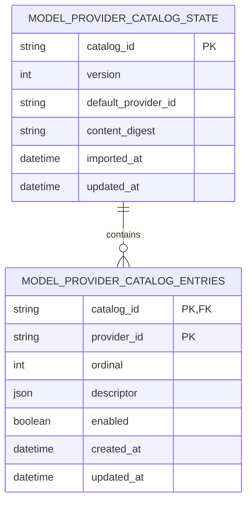
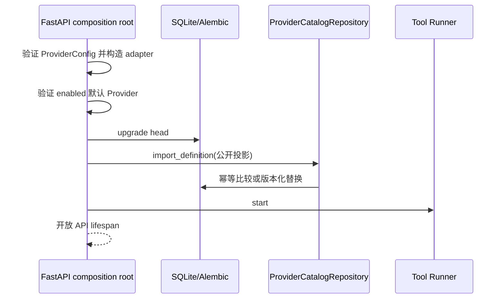

# 20. Provider Catalog 持久化与启动导入实现

## 1. 本阶段结果

本阶段把 Provider 管理 API 的 catalog 真值从“组合根中的临时字典”升级为“SQLite 中的版本化公开投影”，并保留启动配置作为运行 adapter 的受信任来源。

已实现：

- 新增 Alembic `0003_provider_catalog` migration。
- 新增 catalog 状态表和 Provider 条目表。
- 应用每次启动在 Runner 启动前执行幂等 catalog 导入。
- 相同公开配置重复启动不增加版本，也不改变 `imported_at`。
- descriptor、enabled 或默认 Provider 发生变化时，catalog 版本单调递增。
- Provider API 每次从 repository 读取持久化 catalog，不再依赖组合根临时字典。
- repository 支持 `expected_version` 比较交换，为未来 `If-Match` 写接口提供乐观并发基础。
- SQLite 不保存 `base_url`、credential identifier、API Key 或上游健康详情。

健康结果仍只做进程内短期缓存，不写数据库；本阶段也没有增加任何 Provider 写 API。

## 2. 为什么持久化“公开投影”

Provider 启动配置同时包含两类信息：

| 信息类型 | 示例 | 本阶段处理 |
| --- | --- | --- |
| 公开管理信息 | Provider ID、显示名称、模型、协议、位置、能力、enabled/default | 持久化到 SQLite |
| 运行连接信息 | endpoint、credential reference、密钥 | 不进入 catalog 表 |

如果直接把完整 `ProviderConfig` JSON 写入普通配置表，虽然 API Key 仍可通过引用隔离，但内网 endpoint、租户地址和 credential identifier 会扩大数据库泄露面。本阶段选择更窄的公开投影：它足以支持列表、版本、重启续读和未来并发修改协议，同时不会提前做出凭据存储决策。

这也意味着当前 SQLite catalog **不能单独重建运行 adapter**。adapter 仍由受验证的启动配置构造；Windows Credential Manager 和可审计运行配置写入将在后续阶段完成。

## 3. 数据模型



`catalog_id` 当前固定为 `active`。保留该字段而不是使用无主键单行表，是为了后续支持草稿、导入预览或历史快照时不破坏 repository 契约。

`descriptor` 只能通过严格 `ModelProviderDescriptor` 序列化和回读，字段为：

- `provider_id`
- `display_name`
- `model`
- `protocol`
- `location`
- `capabilities`

表结构中不存在 endpoint、credential 或 health detail 列。

## 4. 启动生命周期



关键顺序：

1. 配置、credential 和默认 Provider 错误继续在 Runner 启动前失败。
2. 数据库先升级到 `0003`。
3. catalog 导入在单个事务中完成。
4. 导入成功后才构造数据库驱动的 `ProviderCatalogService` 并启动 Runner。
5. migration 或导入失败时关闭数据库引擎，不留下半启动 Runner。

默认空 catalog 仍会生成原有 Fake Provider 公开投影，不会联网。

## 5. 版本与幂等语义

repository 先把 Provider 按 ID 排序，再对严格公开定义执行 canonical JSON SHA-256：

```text
public definition
    -> Provider ID 稳定排序
    -> canonical JSON
    -> SHA-256 content_digest
```

导入规则：

| 情况 | 结果 |
| --- | --- |
| 首次导入 | 创建 `version=1` |
| 内容摘要相同 | 原样返回，不更新时间和版本 |
| descriptor/enabled/default 改变 | 事务内替换 entries，版本 `+1` |
| 仅输入数组顺序改变 | 排序后摘要相同，不增加版本 |
| `expected_version` 与当前版本不同 | 抛出 `MODEL_PROVIDER_CATALOG_VERSION_CONFLICT`，事务不修改 |

更新已有 catalog 时使用条件更新：

```sql
UPDATE model_provider_catalog_state
SET version = :next_version, ...
WHERE catalog_id = 'active' AND version = :actual_version
RETURNING version;
```

这是未来 HTTP `If-Match`、设置页并发编辑和导入预览的基础。当前应用仍是单 API 进程，尚未声明多进程写安全。

版本描述的是**公开 catalog 投影**。只改变隐藏 endpoint 或 credential reference、但不改变公开 descriptor 时，不会增加该公开版本；运行 adapter 仍使用本次启动的新配置。

## 6. API 变化

`GET /api/v1/model-providers` 新增：

```json
{
  "catalog_version": 2,
  "imported_at": "2026-08-09T06:30:00Z",
  "default_provider_id": "fake-local",
  "providers": []
}
```

- `catalog_version` 可供前端判断 catalog 是否变化。
- `imported_at` 表示当前公开投影首次生效的时间。
- providers 内容和健康缓存语义保持不变。
- health API 在探测前也从 repository 检查 Provider 是否存在和 enabled。

API 仍不返回 `content_digest`。digest 是内部幂等实现细节，不应被误当作认证令牌或外部 ETag；未来写接口应使用明确的版本字段生成 ETag。

## 7. 安全边界

- 导入对象 `ProviderCatalogDefinition` 的类型中不存在 endpoint 和 credential 字段，形成编译期/校验期的窄入口。
- repository 只接受该定义，不接受原始 `Settings` 或 `ProviderConfig`。
- descriptor JSON 回读时再次经过 Pydantic 严格校验，数据库异常内容不会直接进入 API。
- content digest 只覆盖公开投影，避免把 endpoint 或 credential identifier 的可枚举哈希写入数据库。
- migration 不读取环境变量或 credential resolver。
- SQLite 文件扫描测试确认完整 endpoint、credential identifier 和密钥字节均不存在。
- catalog 导入不触发 Provider health、模型生成或付费调用。

## 8. 自动化验收

本阶段新增 5 项持久化测试，并更新迁移/API 断言：

- 未导入 catalog 时 repository 明确失败。
- 首次导入、稳定排序和重复导入幂等。
- 公开内容变化后版本递增并删除旧条目。
- 错误 `expected_version` 返回冲突且不覆盖当前数据。
- 同一数据库三次应用启动验证版本保持和公开内容变化递增。
- 云端 Provider 启动后直接扫描 SQLite 文件，确认 endpoint、credential identifier 和密钥均未落库。
- 空库迁移和旧版 pre-Alembic 数据库接管均升级到 `0003_provider_catalog`，原任务数据保留。

全量结果：Ruff 通过，mypy 通过 60 个源文件，pytest 100 项通过。开发数据库已升级到 `0003_provider_catalog (head)`，`alembic check` 无差异；前端 type-check 与生产构建通过。

## 9. 已知边界与下一步

- 后续 `0004` 已增加 DPAPI 密文运行配置表，`0005` 已将数据库切换为 adapter 启动真值；Settings 只负责首次 seed。
- 本阶段没有 Provider 写接口；后续已增加 POST/PUT/DELETE 与 ETag 管理服务。
- 仍没有完整 catalog 历史快照；后续 `0004` 已增加脱敏配置变更审计，公开 catalog 仍只保存 active 版本。
- health 历史不持久化，重启后缓存清空。
- 当前单 API 进程组合尚未解决多个进程同时首次创建 catalog 的竞争；整体项目的 Outbox 也仍是单进程边界。
- 自动化测试不访问真实 Ollama 或云端服务。

后续已实现 Windows Credential Manager、DPAPI 运行配置、审计、ETag/幂等写 API、数据库启动真值和前端设置页，见[Windows Credential Manager 实现](21-Windows-Credential-Manager实现.md)、[Provider 运行配置保护与审计模型实现](22-Provider运行配置保护与审计模型实现.md)、[Provider 管理服务与写 API 实现](23-Provider管理服务与写API实现.md)和[前端 Provider 模型设置页实现](24-前端Provider模型设置页实现.md)。下一阶段增加角色级 Provider 路由、预算与熔断。
