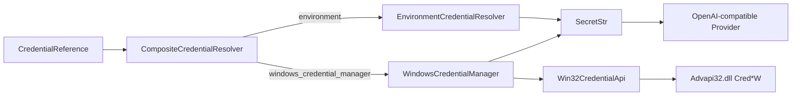

# 21. Windows Credential Manager 实现

## 1. 本阶段结果

DeskPilot 的 `CredentialResolver` 已从单一 environment backend 演进为显式多 backend 分发，并新增 Windows Credential Manager 的读取、写入和删除能力。

已实现：

- `CredentialReference.backend` 支持 `environment` 与 `windows_credential_manager`。
- Windows identifier 使用独立的大写命名空间，不允许路径分隔符、通配符或任意 target。
- 新增 `CompositeCredentialResolver`，只按显式 backend 路由，绝不跨存储静默 fallback。
- 使用 `ctypes` 直接调用 Unicode Win32 `CredReadW/CredWriteW/CredDeleteW/CredFree`，不增加第三方依赖。
- 使用 `CRED_TYPE_GENERIC` 与 `CRED_PERSIST_LOCAL_MACHINE`。
- 写入和读取的 Python 临时 `bytearray` 在使用后主动清零。
- 新增稳定、脱敏的 backend unavailable、not found、invalid 和 operation failed 错误。
- 新增隐藏输入的本地 credential CLI；密钥不能通过命令行参数传入。
- 默认应用组合在 Windows 上同时注册 environment 与 Windows Credential Manager backend。

本阶段自动化测试没有向真实 Windows 凭据库写入或删除任何条目；Win32 DLL 只做无副作用加载验证，CRUD 使用 fake API。

## 2. 官方 API 依据

实现以 Microsoft Win32 文档为准：

- [`CredReadW`](https://learn.microsoft.com/en-us/windows/win32/api/wincred/nf-wincred-credreadw) 从当前登录令牌关联的用户凭据集读取条目；返回的整块缓冲区必须使用 `CredFree` 释放。
- [`CREDENTIALW`](https://learn.microsoft.com/en-us/windows/win32/api/wincred/ns-wincred-credentialw) 规定 Generic credential、target 命名、Blob 上限和持久化级别。
- [`CredWriteW`](https://learn.microsoft.com/en-us/windows/win32/api/wincred/nf-wincred-credwritew) 创建或替换相同 target/type 的条目。
- [`CredDeleteW`](https://learn.microsoft.com/en-us/windows/win32/api/wincred/nf-wincred-creddeletew) 删除当前用户凭据集中的指定 target/type。
- [`CredFree`](https://learn.microsoft.com/en-us/windows/win32/api/wincred/nf-wincred-credfree) 释放 Credential Management API 返回的缓冲区。

Microsoft 文档规定 Generic `CredentialBlob` 最大为 `5 * 512 = 2560` 字节。DeskPilot 按 UTF-8 编码密钥，因此限制按**编码后的字节数**计算，不按 Python 字符数计算。

## 3. 组件关系



`model_providers/factory.py` 仍只依赖原有 `CredentialResolver` port，不依赖 Windows、ctypes 或具体存储类型。因而 CI 可以继续使用 environment，Windows 桌面版可以选择 Credential Manager，本地模型也可以完全不配置凭据。

## 4. Reference 与 target 规则

Environment：

```json
{
  "backend": "environment",
  "identifier": "DESKPILOT_CREDENTIAL_CLOUD_CHAT"
}
```

Windows Credential Manager：

```json
{
  "backend": "windows_credential_manager",
  "identifier": "CLOUD_CHAT"
}
```

Windows identifier 必须匹配：

```text
^[A-Z][A-Z0-9_]{0,95}$
```

内部 target 由应用构造：

```text
DeskPilot/ModelProvider/CLOUD_CHAT
```

配置不能直接提供完整 Windows target，因此无法引用浏览器、Git、系统登录或其他应用的凭据。target 大小写不敏感，但 DeskPilot 统一要求大写 identifier，避免同一逻辑凭据出现多个拼写。

## 5. Win32 映射

| 操作 | Win32 API | DeskPilot 语义 |
| --- | --- | --- |
| 读取 | `CredReadW` | 找不到返回 `CREDENTIAL_NOT_FOUND`；成功后复制 Blob 并始终 `CredFree` |
| 写入 | `CredWriteW` | 创建或替换同 target 的 Generic credential |
| 删除 | `CredDeleteW` | 已删除返回 `true`；不存在返回 `false`，保持幂等 |
| 内存释放 | `CredFree` | 释放 Win32 返回的单块 Credential buffer |

固定参数：

- `Type = CRED_TYPE_GENERIC`
- `Persist = CRED_PERSIST_LOCAL_MACHINE`
- `Flags = 0`
- `UserName = DeskPilot`，Generic 模式不参与认证
- `Comment = DeskPilot model Provider credential`

选择 `LOCAL_MACHINE` 而不是 `ENTERPRISE`，避免凭据随可漫游用户状态传播到其他电脑。它仍可跨当前用户在本机的后续登录会话使用，但不会授权其他 Windows 用户。

## 6. 内存与脱敏

处理顺序：

1. 写入时从 `SecretStr` 取得值并编码为 UTF-8 `bytearray`。
2. Win32 调用直接引用该可变缓冲区。
3. 调用完成后在 `finally` 中用零覆盖整个 `bytearray`。
4. 读取时从 Win32 buffer 复制到 `bytearray`，随后立即 `CredFree`。
5. UTF-8 解码和 `SecretStr` 构造完成后清零读取缓冲区。

Python 字符串是不可变对象，不能承诺对解释器内部的所有历史副本进行可靠清零。因此当前措施是“缩短额外字节缓冲区寿命”，不是硬件级安全内存。日志、异常、API、SQLite 和 CLI 输出仍禁止包含密钥值。

Win32 错误只保留稳定字段：

```text
code
credential_id
backend / operation
os_error_code
```

不会把 target、密钥、系统本地化错误正文或 Authorization header 拼入用户错误消息。

## 7. 安全 CLI

在 `backend/` 下执行：

```powershell
# 隐藏输入两次；命令行历史中不会出现密钥
.\.venv\Scripts\python.exe -m deskpilot.credential_cli store CLOUD_CHAT

# 只显示存在状态，不打印密钥
.\.venv\Scripts\python.exe -m deskpilot.credential_cli status CLOUD_CHAT

# 删除必须显式确认；重复删除安全
.\.venv\Scripts\python.exe -m deskpilot.credential_cli delete CLOUD_CHAT --yes
```

CLI 明确禁止 `--secret` 参数，也不会接受位置参数形式的密钥。store 的两次隐藏输入不一致时返回 `CREDENTIAL_CONFIRMATION_MISMATCH`；删除缺少 `--yes` 时返回 `CREDENTIAL_DELETE_CONFIRMATION_REQUIRED`。

在 Provider 配置中引用：

```json
{
  "kind": "openai_compatible_chat",
  "provider_id": "cloud-chat",
  "display_name": "Cloud Chat",
  "model": "configured-cloud-model",
  "base_url": "https://api.example.invalid/v1",
  "location": "cloud",
  "credential_ref": {
    "backend": "windows_credential_manager",
    "identifier": "CLOUD_CHAT"
  }
}
```

`.invalid` 示例域名不可访问，防止复制文档后意外发起真实请求。

## 8. Backend 分发与失败语义

| 场景 | 错误码/结果 |
| --- | --- |
| reference 指定未注册 backend | `CREDENTIAL_BACKEND_UNAVAILABLE` |
| Windows target 不存在 | `CREDENTIAL_NOT_FOUND` |
| 空白、非法 UTF-8、超过 2560 字节 | `CREDENTIAL_INVALID` |
| Win32 登录会话/API 错误 | `CREDENTIAL_BACKEND_OPERATION_FAILED` |
| 删除不存在条目 | `false`，不抛错 |

显式 backend 不会 fallback。例如配置要求 Windows Credential Manager 但当前平台不支持时，系统不会转而读取同名环境变量。这能避免部署环境变化后无意使用错误来源的凭据。

disabled Provider 仍不解析任何 credential reference；其 Windows target 不存在也不会阻止应用启动。

## 9. 自动化验收

新增 14 项测试，覆盖：

- environment 与 Windows backend 各自的 identifier 规则。
- target namespace 不允许由配置绕过。
- store、resolve 和幂等 delete。
- 读写临时缓冲区调用结束后被零覆盖。
- not found、空白、非法 UTF-8 和 UTF-8 字节超限。
- read/write/delete Win32 错误归一化与脱敏。
- Composite resolver 不跨 backend fallback。
- environment 默认路径向后兼容。
- Provider Factory 通过原有 port 使用 Windows reference。
- CLI 隐藏写入、status 不显示密钥、删除显式确认、确认不一致和非法 identifier。
- Windows 上只加载 Advapi32 函数，不操作真实 Credential Manager。

全量结果：Ruff 通过，mypy 通过 63 个源文件，pytest 114 项通过；Alembic 保持 `0003_provider_catalog (head)` 且无差异。前端 type-check 与生产构建通过。

## 10. 已知边界与下一步

- 自动化测试不会操作真实用户凭据库；发布前应由用户在测试 identifier 下执行一次 CLI store/status/delete 手工验收。
- Windows Credential Manager 的安全边界是当前 Windows 用户，不是抵御同用户恶意进程的硬隔离。
- 当前没有远程或前端凭据写 API，只有本地隐藏输入 CLI 和 Python store port。
- Provider 的运行 endpoint 仍来自启动配置，SQLite 继续只保存公开投影。
- Provider 运行配置审计、安全删除边界、ETag/`If-Match` 写接口和前端设置页均已在后续阶段完成。
- 非 Windows 平台目前继续使用 environment；macOS Keychain/Linux Secret Service 尚未实现。

后续已完成受保护运行配置、Credential Manager reference、删除保留策略、Provider 写 API 和前端设置页，见[Provider 运行配置保护与审计模型实现](22-Provider运行配置保护与审计模型实现.md)、[Provider 管理服务与写 API 实现](23-Provider管理服务与写API实现.md)和[前端 Provider 模型设置页实现](24-前端Provider模型设置页实现.md)。下一阶段增加角色级 Provider 路由、预算与熔断。
