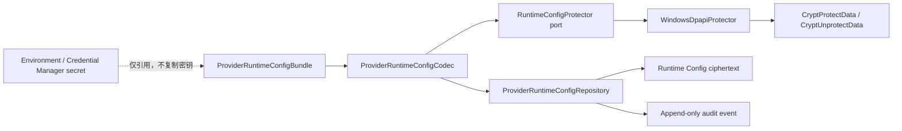
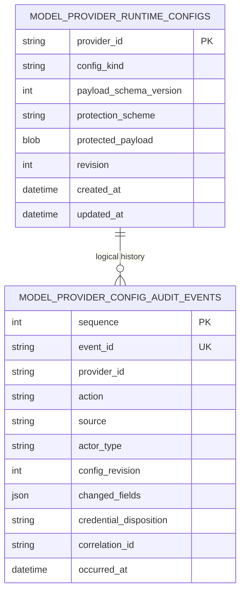

# 22. Provider 运行配置保护与审计模型实现

## 1. 本阶段结果

本阶段完成 Provider 写接口之前的安全持久化基础。公开 Catalog 继续保存可展示 descriptor；包含 endpoint 与 credential reference 的运行配置改为可版本化的受保护载荷；API Key 仍只存在 environment 或 Windows Credential Manager，不进入该载荷和 SQLite 明文。

已实现：

- 新增 `ProviderRuntimeConfigBundle`，对 Provider ID、配置类型和凭据删除策略进行严格校验。
- 新增 `RuntimeConfigProtector` port 与 `ProviderRuntimeConfigCodec`，业务仓储不依赖 Win32。
- 新增当前 Windows 用户范围的 `WindowsDpapiProtector`。
- 使用 Provider ID 和 payload schema 形成 optional entropy，使密文绑定到具体记录上下文。
- 新增 `0004_provider_runtime_config` migration。
- 新增受保护运行配置表和仅追加审计事件表。
- 仓储支持 create/update/get/delete、revision 乐观并发、相同内容幂等写入和审计分页。
- 审计事件只记录动作、来源、actor 类型、revision、变化字段名和凭据处置结果，不记录字段值。
- 删除 Provider 运行配置时只删除密文记录，credential reference 指向的凭据始终保留。
- 新增自动化测试，覆盖密文往返、工作缓冲区清零、DPAPI 错误脱敏、版本冲突、幂等更新、删除边界、审计分页和 SQLite 明文扫描。

本阶段没有开放 Provider 写 API，也没有把数据库运行配置切换为 adapter 启动真值；这是下一阶段在 ETag、幂等键和事务边界确定后完成的接线工作。

## 2. 为什么运行配置也要保护

运行配置不含 API Key，但仍可能包含：

- 企业或个人的私有模型 endpoint。
- 内网 IP、端口或租户路径。
- Credential Manager identifier。
- 模型部署名和能力开关。

这些信息不足以直接完成认证，但能暴露网络拓扑、服务供应商或可枚举的凭据引用。公开 Catalog 因此继续只保存 descriptor；完整 `ProviderConfig` 进入单独的 DPAPI 密文表。

数据库中的信息分层如下：

| 数据 | 存储位置 | 明文状态 |
| --- | --- | --- |
| Provider ID、显示名称、模型、协议、位置、能力、enabled/default | Catalog 表 | 可公开管理投影 |
| endpoint、credential reference、adapter 参数 | Runtime Config 表 | DPAPI 密文 |
| API Key | environment / Windows Credential Manager | 不进入 SQLite |
| 审计动作、revision、变化字段名 | Audit Event 表 | 明文但无字段值 |

## 3. DPAPI 依据与选择

实现依据 Microsoft Win32 文档：

- [`CryptProtectData`](https://learn.microsoft.com/en-us/windows/win32/api/dpapi/nf-dpapi-cryptprotectdata) 默认通常只允许同一登录凭据的用户解密，并提供带密钥的完整性校验。
- [`CryptUnprotectData`](https://learn.microsoft.com/en-us/windows/win32/api/dpapi/nf-dpapi-cryptunprotectdata) 负责解密和完整性检查，返回缓冲区需要 `LocalFree`。
- [Microsoft DPAPI 示例与边界](https://learn.microsoft.com/en-us/windows/win32/seccrypto/example-c-program-using-cryptprotectdata) 说明默认用户/机器范围、跨机器限制以及密码被管理员重置时的恢复风险。

DeskPilot 的固定选择：

- 使用默认 current-user scope，不设置 `CRYPTPROTECT_LOCAL_MACHINE`，避免同机其他用户解密。
- 设置 `CRYPTPROTECT_UI_FORBIDDEN`，后端操作不能弹出交互窗口。
- description 固定为 `DeskPilot Provider runtime configuration`。
- optional entropy 为 `DeskPilot/ProviderRuntime/{provider_id}/v1`，它不是额外密码，只用于上下文绑定。
- DPAPI 输出使用 `LocalFree`；解密后的 Win32 buffer 在释放前先清零。
- Python 工作 `bytearray` 在 codec/adapter 的 `finally` 中清零。

Python 不可变字符串和 Pydantic 内部对象无法提供硬件级安全内存保证。因此这里的目标是减少额外明文字节副本、阻止 SQLite 静态明文泄露，并保证异常和日志不输出配置值。

## 4. 组件关系



`ProviderRuntimeConfigCodec` 只认识保护 port；SQLAlchemy repository 只认识 codec。未来可以在不改变领域和仓储契约的情况下增加 macOS Keychain 派生密钥、Linux Secret Service 或显式主密钥保护实现。

## 5. Bundle 契约

解密后的内部结构：

```json
{
  "schema_version": 1,
  "provider_id": "cloud-chat",
  "config": {
    "kind": "openai_compatible_chat",
    "provider_id": "cloud-chat",
    "base_url": "https://api.example.invalid/v1",
    "credential_ref": {
      "backend": "windows_credential_manager",
      "identifier": "CLOUD_CHAT"
    }
  },
  "credential_deletion_policy": "retain"
}
```

示例省略了其余必填/默认字段，仅用于解释边界。校验规则：

- 外层和内层 `provider_id` 必须一致。
- `config` 继续使用 discriminated `ProviderConfig` allowlist，不接受动态 import path 或任意 adapter 类型。
- `schema_version` 当前固定为 1，未来升级必须显式迁移或提供兼容 decoder。
- `credential_deletion_policy` 当前唯一合法值是 `retain`。

## 6. 数据模型



审计表没有到当前配置表的外键。原因是删除运行配置后必须保留历史；若使用级联外键会一起删除审计证据。

运行表故意不保存 plaintext digest。endpoint 与 credential identifier 的候选空间可能较小，普通 SHA-256 会形成离线枚举线索。幂等比较通过解密现有载荷并比较严格 bundle 完成；当前 Catalog 最多 32 个 Provider，该成本可控。

## 7. Revision 与事务语义

仓储规则：

| 场景 | 结果 |
| --- | --- |
| 首次 `put`，`expected_revision=0` | 创建 revision 1，并追加 `created` 审计 |
| 内容完全相同 | 保持 revision 和时间，不追加重复审计 |
| 内容变化且 revision 匹配 | 条件更新为 revision + 1，并追加 `updated` 审计 |
| `expected_revision` 不匹配 | `MODEL_PROVIDER_RUNTIME_CONFIG_VERSION_CONFLICT`，不修改配置和审计 |
| 删除存在配置 | 条件删除，并追加 `deleted` 审计 |
| 重复删除且未要求旧 revision | 返回 false，不追加重复审计 |

密文更新和审计追加位于同一个数据库事务。更新 SQL 包含旧 revision 条件并使用 `RETURNING` 验证，防止无条件覆盖。

Runtime revision 是单 Provider 内部版本。下一阶段 HTTP API 仍应以公开 Catalog version 生成整体 ETag，因为启停、默认切换和删除会同时影响多个公开/受保护记录。

## 8. 审计脱敏设计

审计事件允许的信息：

- `provider_id`
- `created/updated/deleted`
- `startup_import/local_api`
- `system/local_user`
- 配置 revision
- 变化字段名，例如 `base_url`、`credential_ref`
- credential disposition 枚举
- 非敏感 correlation ID
- UTC 时间

明确禁止：

- endpoint 值。
- credential backend identifier 值。
- API Key、Authorization header、session token。
- 修改前/后的完整 JSON。
- 上游异常正文或操作系统本地化错误正文。

审计表在 repository 契约中只提供追加和查询，没有 update/delete 方法。“仅追加”是应用层保证；能直接修改 SQLite 文件的同用户进程仍处于当前桌面威胁边界之外。

## 9. 凭据删除联动决策

Provider 配置删除与凭据删除不在同一事务资源中：SQLite 事务无法原子提交 Windows Credential Manager 操作。自动联动可能出现“数据库回滚但凭据已删”或误删共享 credential reference。

本阶段采用安全默认值：

1. 删除 Provider 只删除受保护配置和公开 Catalog 条目。
2. 被引用的 environment/Windows credential 始终保留。
3. 审计事件记录 `provider_deleted_credential_retained`。
4. 后续若要删除凭据，必须使用独立操作、显式确认，并先检查其他运行配置是否仍引用它。
5. environment backend 永远不由 DeskPilot 删除；Windows Credential Manager 只允许删除 DeskPilot namespace 内的 target。

这一策略会产生可清理的孤立凭据，但不会因删除 Provider 造成不可恢复的共享密钥丢失。

## 10. 自动化验收

新增测试覆盖：

- bundle Provider ID 一致性。
- codec 保护/解保护往返和 Provider context 绑定。
- 编解码工作 `bytearray` 清零。
- DPAPI entropy 清零与错误码脱敏。
- Windows 上真实 DPAPI 内存往返，不写凭据库或文件。
- repository create、相同内容幂等、update 和 get。
- expected revision 冲突不修改当前数据和审计。
- 删除配置时凭据保留、重复删除幂等。
- 审计 sequence 分页、字段值脱敏。
- 直接扫描 SQLite，确认 endpoint 和 credential identifier 未以明文出现。
- 空库和 pre-Alembic 数据库升级到 `0004_provider_runtime_config`。

## 11. 已知边界与下一步

- 后续 `0005` 已将 Runtime Config repository 切换为 adapter 启动真值；`Settings.model_providers` 只用于首次 seed。
- 当前只读 Provider API 不读取或返回受保护载荷。
- Provider 创建、修改、启停、默认切换、删除、审计查询 API 和前端设置页已在后续阶段完成。
- DPAPI 密文通常绑定同一用户和同一机器；迁移电脑或管理员重置密码可能造成不可恢复，需要后续提供导出前重绑定/重新录入流程。
- 当前 repository 保持单 API 进程目标；并发首次创建在多进程部署前仍需统一写租约或数据库升级。
- 非 Windows 平台尚无生产保护器。

后续已实现 Provider 管理应用服务、写 API 和前端设置页：使用 Catalog ETag/`If-Match`、`Idempotency-Key`、配置/公开投影/审计原子提交，并在修改成功后安全重建 adapter registry，见[Provider 管理服务与写 API 实现](23-Provider管理服务与写API实现.md)和[前端 Provider 模型设置页实现](24-前端Provider模型设置页实现.md)。下一阶段增加角色级 Provider 路由、预算与熔断。
