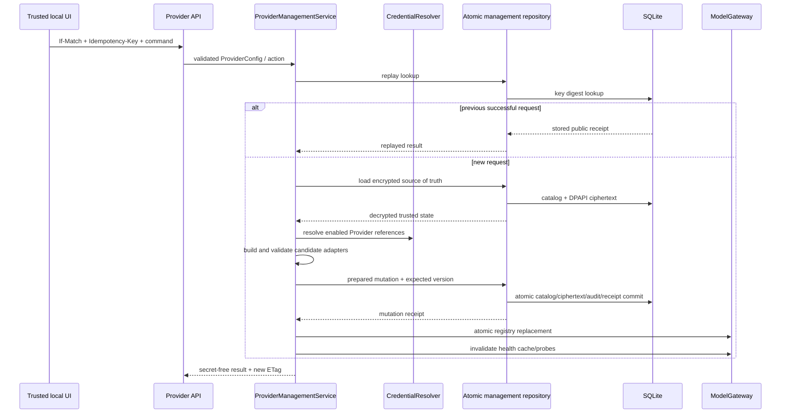

# 23. Provider 管理服务与写 API 实现

## 1. 本阶段结果

本阶段把上一阶段的 DPAPI 密文运行配置和审计模型接入应用主链路，完成可跨重启使用的 Provider 管理面。

已实现：

- 新增统一 `ProviderManagementService` 与 `ProviderManagementStore` port。
- Provider 首次启动配置从“每次覆盖”改为“一次性 seed”；完成 seed 后，SQLite 密文配置成为运行真值。
- 应用重启从 DPAPI 密文恢复完整 ProviderConfig，重新解析 credential reference 并构造 adapter。
- 新增 `0005_provider_management` migration 和持久化幂等回执表。
- 新增 Provider 创建、完整更新、启用、禁用、切换默认、删除和审计查询 API。
- GET Catalog 返回强格式配置 ETag；所有写请求强制 `If-Match` 和 `Idempotency-Key`。
- Catalog、运行配置密文、审计事件和幂等回执在同一 SQLite 事务提交。
- 提交前先构造并验证完整候选 adapter registry；凭据缺失或配置无效时不修改数据库。
- 提交后通过 `ModelGateway.reconfigure` 原子替换注册表，并取消旧 Provider health probe、清空旧缓存。
- 删除 Provider 继续保留其 credential，响应和审计都会显示脱敏处置枚举。
- 新增 8 项管理 API、并发、幂等、重启、回滚、动态 Gateway 和明文扫描测试。

本阶段仍没有提供通过 HTTP 上传 API Key 的能力。密钥必须先通过安全 CLI 写入 Windows Credential Manager，或由启动环境提供，再在 ProviderConfig 中使用 reference。

## 2. 写入架构



关键顺序是“先验证可运行性，再持久化，再切换内存注册表”。因此启用一个缺少 credential 的云端 Provider 会在数据库事务前失败，不会出现 catalog 显示 enabled、实际 adapter 不存在的状态。

## 3. 数据库真值与首次 seed

升级前，应用每次启动都把 `Settings.model_providers` 导入公开 Catalog，运行 adapter 也直接来自本次启动配置。这会覆盖设置页的修改。

现在采用以下规则：

1. `model_provider_runtime_configs` 为空时，以当前 Settings 作为首次 seed。
2. seed 在一个事务内写入公开 Catalog、DPAPI 密文配置和 `startup_import` 审计事件。
3. 一旦存在密文运行配置，后续启动忽略 Settings 中的 Provider 内容，直接读取数据库真值。
4. credential secret 不属于数据库真值；每次启动仍根据解密出的 reference 到 environment/Credential Manager 解析。
5. 数据库配置无法解密、默认 Provider 不存在或 enabled Provider 凭据缺失时，应用在 Runner 启动前失败。

这避免 `.env` 变化静默覆盖用户在设置页中的配置。未来如需重新导入启动配置，应提供显式“预览 + 确认导入”命令，而不是恢复每次启动覆盖。

## 4. API 契约

| Method | Path | 作用 |
| --- | --- | --- |
| GET | `/api/v1/model-providers` | 查询无密钥 Catalog，并返回配置 ETag |
| GET | `/api/v1/model-providers/audit` | 按 sequence 分页查询脱敏配置审计 |
| POST | `/api/v1/model-providers` | 创建 Provider |
| PUT | `/api/v1/model-providers/{provider_id}` | 完整替换 ProviderConfig |
| POST | `/api/v1/model-providers/{provider_id}:enable` | 启用并验证 credential/adapter |
| POST | `/api/v1/model-providers/{provider_id}:disable` | 禁用非默认 Provider |
| POST | `/api/v1/model-providers/{provider_id}:make-default` | 切换到 enabled Provider |
| DELETE | `/api/v1/model-providers/{provider_id}` | 删除非默认 Provider，保留凭据 |
| GET | `/api/v1/model-providers/{provider_id}/health` | 按需执行脱敏健康探测 |

所有接口继续要求本地 Bearer session。PUT/POST/DELETE 还必须通过可信 Origin/同源检查。

写请求示例：

```http
POST /api/v1/model-providers
Authorization: Bearer <local-session-token>
Origin: http://127.0.0.1:5173
X-DeskPilot-Client: deskpilot-web-v1
If-Match: "provider-catalog-v3"
Idempotency-Key: 01K2EXAMPLEPROVIDERCREATE
Content-Type: application/json
```

响应不返回 endpoint 或 credential reference：

```json
{
  "action": "created",
  "provider_id": "cloud-chat",
  "catalog_version": 4,
  "config_revision": 1,
  "default_provider_id": "fake-local",
  "credential_disposition": "reference_attached",
  "replayed": false
}
```

## 5. ETag 与乐观并发

ETag 固定格式：

```text
"provider-catalog-v{positive_integer}"
```

规则：

- GET Catalog 返回当前 ETag 和 `Cache-Control: no-store`。
- 写请求缺少 `If-Match` 返回 `428 IF_MATCH_REQUIRED`。
- weak ETag、通配符、多 ETag 或其他格式返回 `400 IF_MATCH_INVALID`。
- 版本过期返回 `412 MODEL_PROVIDER_CATALOG_VERSION_CONFLICT`。
- 冲突响应包含 `expected_version`、`actual_version` 和 `current_etag`，但不包含配置内容。
- endpoint 等隐藏运行字段发生变化时也会增加 Catalog version，避免公开 descriptor 未变化导致 ETag 漏掉真实写冲突。

Catalog version 现在表示“Provider 管理聚合版本”，不再只表示公开 descriptor 摘要。

## 6. 持久化幂等语义

`Idempotency-Key` 必须是 16～128 位受限 ASCII 标识符。客户端应使用高熵 UUID/ULID；原始 key 不写数据库。

数据库只保存：

- `SHA-256(idempotency_key)`：定位回执。
- `HMAC-SHA256(key=idempotency_key, canonical_request)`：比较请求身份。
- operation 名称。
- secret-free mutation receipt。
- 创建时间和 24 小时过期时间。

请求顺序先检查幂等回执，再检查 ETag 和当前业务状态。因此客户端在响应丢失后可以使用原 key 和原请求重试，即使携带的是提交前 ETag，也会获得原成功结果并显示 `replayed=true`。

相同 key 用于不同 operation 或不同请求体返回 `409 IDEMPOTENCY_KEY_REUSED`。失败请求不会保存成功回执，修复 credential 等外部状态后可安全重试。

## 7. Provider 状态规则

| 操作 | 约束 |
| --- | --- |
| 创建 | ID 不得重复；总数最多 32；enabled Provider 必须可构造 adapter |
| 完整更新 | path/body ID 必须一致；不能通过更新禁用默认 Provider |
| 启用 | credential、endpoint 和 adapter 构造必须全部成功 |
| 禁用 | 默认 Provider 禁止禁用；已禁用再次调用为无版本增长的幂等成功 |
| 切换默认 | 目标必须存在且 enabled |
| 删除 | 默认 Provider、最后一个 Provider 禁止删除 |

完整更新采用 PUT，而不是 JSON Merge Patch，避免 `null`、默认值和 discriminated union 合并产生含糊语义。前端设置页应维护显式表单状态；后续若增加 PATCH，需要单独定义字段级 patch contract。

## 8. Adapter 生命周期

`ModelGateway.reconfigure` 先在临时候选 Gateway 中检查：

- Provider ID 唯一。
- 默认 Provider 存在且 enabled。
- 所有 enabled Provider 都能从静态 allowlist 构造。
- 需要的 credential reference 可以解析。

验证成功后，正式 Gateway 通过一次字典引用替换更新 Provider 集合和默认 ID。已经取得旧 Provider 对象的进行中模型调用可继续完成；新的选择会使用新 registry。

配置变化后，`ProviderHealthService.invalidate` 会清除缓存并取消旧 adapter 的进行中 probe，防止 endpoint 更新后继续返回旧健康结果。OpenAI-compatible adapter 当前每次调用创建短生命周期 HTTP client，因此没有遗留连接池需要关闭。

## 9. 原子性与审计

单个写事务包含：

```text
catalog state/version
+ public catalog entries
+ protected runtime config row
+ append-only audit event
+ idempotency receipt
```

任何 SQL 错误或 version CAS 失败都会回滚全部内容。审计 action 现在包括：

- `created`
- `updated`
- `enabled`
- `disabled`
- `default_changed`
- `deleted`

审计仍只保存变化字段名和 credential disposition。删除带 credential reference 的 Provider 记录 `provider_deleted_credential_retained`，不会调用 credential backend delete。

## 10. 安全边界

- API 请求模型仍是严格 ProviderConfig allowlist，不支持动态 Python/import path。
- 创建或更新请求可以包含 endpoint 和 credential reference，但响应、公开 Catalog、审计、错误和幂等回执不返回这些值。
- API 不接受 `api_key` 字段；Pydantic `extra=forbid` 会拒绝。
- raw Idempotency-Key、session token 和 Authorization header 不落库。
- 直接扫描 SQLite 的自动化测试确认 endpoint、credential identifier、API Key 和 raw idempotency key 不存在。
- enabled 云端 Provider 的创建只构造 adapter，不自动执行 health 或付费模型调用。

## 11. 自动化验收

新增 8 项 API 测试，覆盖：

- Catalog ETag 和写请求必需 header。
- 创建、成功重放和 key/request 冲突。
- 仅修改隐藏 endpoint 仍增加聚合版本。
- stale ETag 返回 412 且无部分提交。
- 动态创建、探测、切换默认、禁用和删除后 Gateway 立即更新。
- 缺少 credential 时启用失败，Catalog、密文和审计不变化。
- 删除 Provider 保留 credential reference 的外部凭据。
- 数据库 source of truth 和幂等回执跨重启生效。
- enabled 云 Provider 创建不触发网络探测。
- SQLite 明文扫描和 API/审计脱敏。

全量结果：Ruff 通过，mypy 通过 74 个源码文件，pytest 130 项通过；Alembic 为 `0005_provider_management (head)` 且无模型差异。

## 12. 已知边界与下一步

- 当前仍以单 API 进程为目标；进程内 mutation lock 配合数据库 version CAS，多进程下的同 key 同时首次插入还需将唯一键竞争归一化为幂等 replay。
- PUT 是完整替换；尚无 Provider 配置详情读取或字段级 PATCH API。
- 没有通过 Web API 写入 credential；这是刻意保留的本地安全边界。
- 前端设置页已在后续阶段接入；PUT 完整替换仍要求用户重新填写隐藏连接字段。
- Provider 角色路由、费用预算、延迟 EWMA、熔断和重试预算尚未实现。
- 当前管理审计没有防数据库管理员篡改的外部签名/锚定。

后续已完成无密钥 Catalog、ETag 冲突恢复、Provider 创建/重新配置/启停/默认/删除和审计时间线，见[前端 Provider 模型设置页实现](24-前端Provider模型设置页实现.md)。下一阶段增加角色级 Provider 路由、预算与熔断能力。
