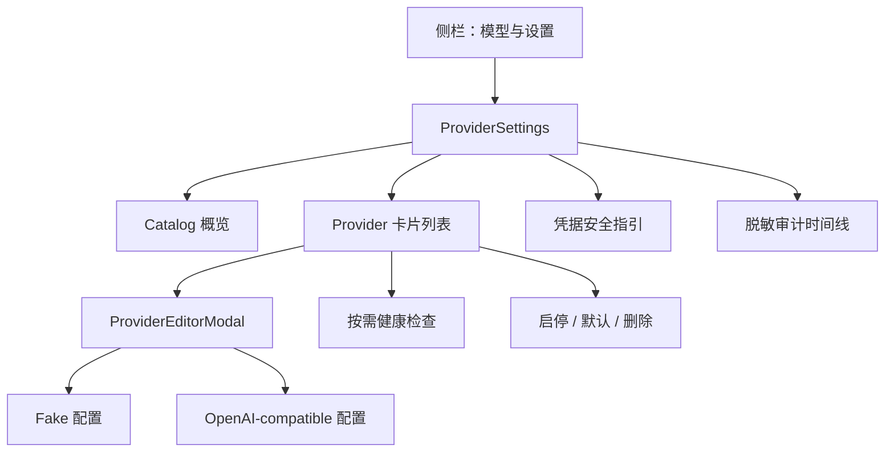
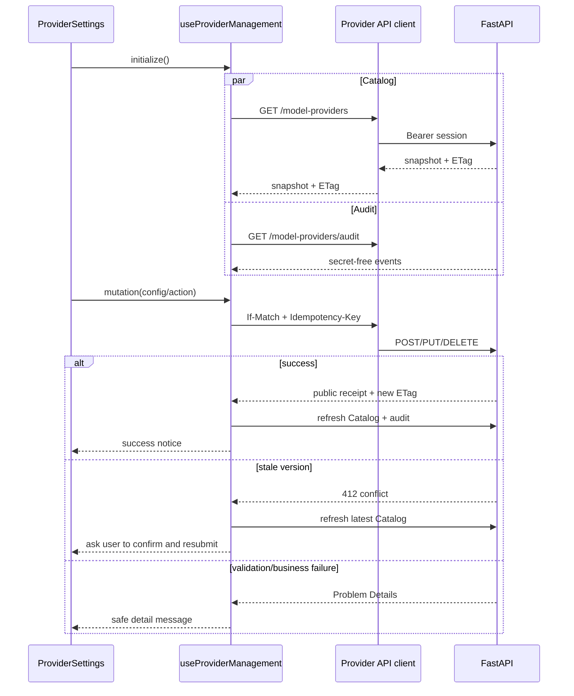

# 24. 前端 Provider 模型设置页实现

## 1. 本阶段结果

本阶段把 Provider 管理 API 接入 Vue 3 前端，形成一个可现场演示的本地模型控制面。用户可以在“模型与设置”页面查看当前 Catalog、添加连接、完整重新配置、启停、切换默认、删除、执行健康检查，并查看脱敏配置审计。

已实现：

- 在原任务工作台侧栏增加“模型与设置”入口，不引入路由依赖。
- 新增 Provider Catalog 类型、配置 discriminated union、健康结果、写回执和审计类型。
- 新增经过本地 session 认证的 Provider API client。
- GET Catalog 捕获强 ETag；所有写操作自动携带 `If-Match` 与高熵 UUID 幂等键。
- 浏览器网络传输失败时使用原 body、ETag 和幂等键自动重试一次。
- `412` 版本冲突后自动重新加载最新 Catalog，但不自动重放用户写操作。
- 支持 Fake 与 OpenAI-compatible Chat Provider 创建。
- 支持 Provider 完整重新配置、启停、设为默认、删除确认。
- 健康检查按需触发并在前端立即合并短期缓存结果。
- 展示最近 100 条 secret-free 配置审计，变化内容只显示字段名。
- API 暴露 `ETag` CORS 响应头，支持前后端不同 Origin 的独立部署。
- 新增响应式桌面/窄屏布局、加载/空/错误/冲突/成功状态和键盘可关闭原生对话框。

## 2. 页面结构



页面没有引入 Pinia、Vue Router 或 UI 组件库。当前只有两个主视图，使用 App 级视图状态可以减少依赖；Provider 远程状态集中在 `useProviderManagement` composable 中，后续增加更多设置子页时再迁移到 Router/Pinia。

## 3. 前端文件与职责

| 文件 | 职责 |
| --- | --- |
| `frontend/src/types.ts` | Provider 公共读模型、写配置、健康和审计 TypeScript 契约 |
| `frontend/src/api.ts` | 本地 session 认证、Catalog ETag、幂等写请求和健康/审计请求 |
| `frontend/src/composables/useProviderManagement.ts` | Catalog、审计、写入、冲突恢复、健康缓存和通知状态 |
| `frontend/src/components/ProviderSettings.vue` | 设置页布局、Provider 生命周期操作与审计展示 |
| `frontend/src/components/ProviderEditorModal.vue` | Fake/OpenAI-compatible 创建和完整替换表单 |
| `frontend/src/App.vue` | 任务工作台与模型设置主视图切换 |
| `frontend/src/style.css` | 设置页、对话框、状态反馈和响应式样式 |

## 4. 请求与状态流



写入成功后不根据 mutation receipt 猜测整个 Catalog，而是重新读取服务端真值。这样默认切换、排序、健康缓存清空以及后续新增服务端字段都不会在前端产生漂移。

## 5. ETag 与幂等处理

前端首次读取 Catalog 时保存响应头中的：

```text
"provider-catalog-v{version}"
```

每次写操作生成 `deskpilot-ui-{UUID}`，满足服务端 16～128 位安全 ASCII 约束。写请求使用当前 ETag 作为 `If-Match`。

`412 MODEL_PROVIDER_CATALOG_VERSION_CONFLICT` 的处理原则：

1. 立即读取最新 Catalog 和 ETag。
2. 保留错误语义并向用户提示配置已变化。
3. 不自动重放创建、删除、默认切换或完整替换。
4. 用户检查最新状态后再次提交，生成新的幂等键。

不自动重放版本冲突，是为了避免在用户未看到并发变化时执行具有管理副作用的命令。对于浏览器网络传输失败，状态层会立即使用原 body、ETag 和 key 自动重试一次：如果第一次请求已经提交但响应丢失，服务端返回原幂等回执；如果两次都无法连通，则向用户显示错误，不进行无限重试。

## 6. 创建与完整重新配置

### 6.1 Fake Provider

表单字段：

- Provider ID、显示名称、模型名称。
- 启用状态。
- 0～60 秒模拟延迟。

公开 Catalog 不包含 `delay_seconds`。编辑现有 Fake Provider 时表单明确提示默认回到 0 秒，用户可以重新指定。

### 6.2 OpenAI-compatible Provider

基础字段：

- Provider ID、显示名称、模型名称。
- 本地/云端位置与 Base URL。
- 私有网段显式例外。
- environment 或 Windows Credential Manager 引用。
- 启用状态。

高级字段：

- streaming、structured output、strict JSON Schema。
- 最大上下文窗口。
- `max_tokens` / `max_completion_tokens` 参数选择。
- 最大响应字节和 health timeout。

浏览器先做即时格式校验，服务端 Pydantic、endpoint locality/TLS policy、credential resolver 和 adapter factory 仍是最终安全边界。

## 7. 凭据安全边界

页面只允许填写 credential reference，不提供 API Key 输入框。推荐流程：

```powershell
cd backend
.\.venv\Scripts\python.exe -m deskpilot.credential_cli store CLOUD_CHAT
```

创建 Provider 时选择 Windows Credential Manager，并填写标识符 `CLOUD_CHAT`。密钥由 CLI 通过两次隐藏输入保存，前端、HTTP body、公开 Catalog、审计和 SQLite 公开列都看不到密钥。

为了不破坏上一阶段的安全投影，API 不提供 endpoint 或 credential reference 配置详情读取。因此编辑 OpenAI-compatible Provider 被命名为“重新配置”，保存前必须重新填写 Base URL 和引用标识符。这是可见的安全取舍，而不是用空值静默覆盖隐藏配置。

## 8. Provider 生命周期交互

| 操作 | 页面约束 | 服务端最终约束 |
| --- | --- | --- |
| 健康检查 | disabled 时按钮不可用 | disabled 返回 409，探测有超时/并发/缓存边界 |
| 设为默认 | 仅 enabled 非默认项可点 | 目标必须存在且 enabled |
| 禁用 | 默认项不显示禁用入口 | 默认 Provider 禁止禁用 |
| 删除 | 默认项不显示删除入口；使用内联二次确认 | 默认/最后一个 Provider 禁止删除 |
| 重新配置 | Provider ID 锁定；默认项保持 enabled | path/body ID 一致；默认项不能禁用 |

删除确认明确提示“关联凭据仍保留”。页面不会把删除 Provider 暗示为删除 Windows Credential Manager 条目。

## 9. 健康与审计展示

Catalog 列表本身不触发网络。用户点击健康检查后调用单 Provider health API，并显示：

- ready/degraded/unavailable 状态。
- 检查时间和延迟。
- 无缓存时的明确提示。

审计时间线倒序显示最近 100 条事件，包括 action、Provider ID、revision、时间和 changed field names。页面不显示 correlation ID、endpoint、credential identifier 或字段值。

## 10. 前后端分离与 CORS

默认开发模式通过 Vite 把 `/api` 和 WebSocket 代理到 `127.0.0.1:8000`，浏览器看到同源请求。`VITE_API_BASE` 也允许前端直接访问独立 API Origin。

由于浏览器跨域默认不能读取 `ETag`，FastAPI CORS 配置新增：

```python
expose_headers=["ETag"]
```

写入允许的方法和请求头仍保持显式 allowlist：`POST/PUT/DELETE`、`Authorization`、`If-Match`、`Idempotency-Key` 等。

## 11. 错误与可用性状态

界面覆盖：

- 首次加载、刷新和空 Catalog。
- session/API/验证错误。
- mutation 全局互斥，避免同一页面并发提交旧 ETag。
- 健康探测单次互斥。
- 成功通知自动消失。
- 冲突和错误通知由用户关闭。
- 原生 `dialog` 支持 Escape 关闭；提交中禁止关闭。
- 720px 以下切换为单列卡片和表单。

API Problem Details 只展示安全 `detail`。前端不会拼接响应对象、Authorization header 或请求体到错误信息中。

## 12. 自动化验收

本阶段验证：

```text
frontend vue-tsc --noEmit: passed
frontend vite build: passed
backend Ruff: passed
backend mypy: passed
backend pytest: 130 passed
```

生产构建输出约为：HTML 0.47 kB、CSS 19.81 kB、JavaScript 105.32 kB（gzip 39.45 kB）。未新增前端运行依赖。

Provider API 测试增加 `Access-Control-Expose-Headers: ETag` 断言。由于本阶段是本地桌面控制台代码建设，未发布或部署网站，也没有触发真实模型请求、DNS 访问或凭据读写。

## 13. 已知边界与下一步

- PUT 仍是完整替换；公开安全投影不能预填 endpoint、credential reference 或 Fake delay。
- 前端尚无组件测试框架，本阶段以严格 TypeScript 和生产构建验证为主。
- 健康结果只有短期进程内缓存，没有历史趋势图。
- 尚无角色级 Provider 分配、费用预算、重试预算、延迟 EWMA 和熔断状态。
- 任务页尚未接入 pause/resume/cancel 按钮。
- 当前只支持 Fake 和 OpenAI-compatible Chat 配置表单；Responses/Ollama 原生 Provider 尚未实现。

下一阶段优先完成角色级 Provider 路由、预算与韧性设计，让设置页从“连接管理”演进为“模型调度控制面”。随后补任务控制按钮、前端组件测试和新的人工浏览器验收。

> 后续进展：角色路由与韧性预算见 `doc/25-角色级Provider路由与韧性预算实现.md`；任务控制、Provider 组件测试与人工浏览器验收已在 `doc/26-前端任务控制连接恢复与组件测试.md` 完成。
