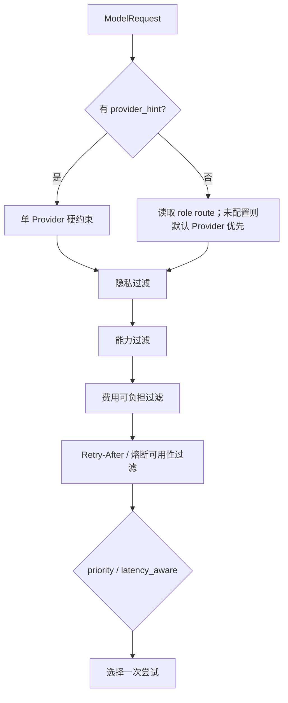
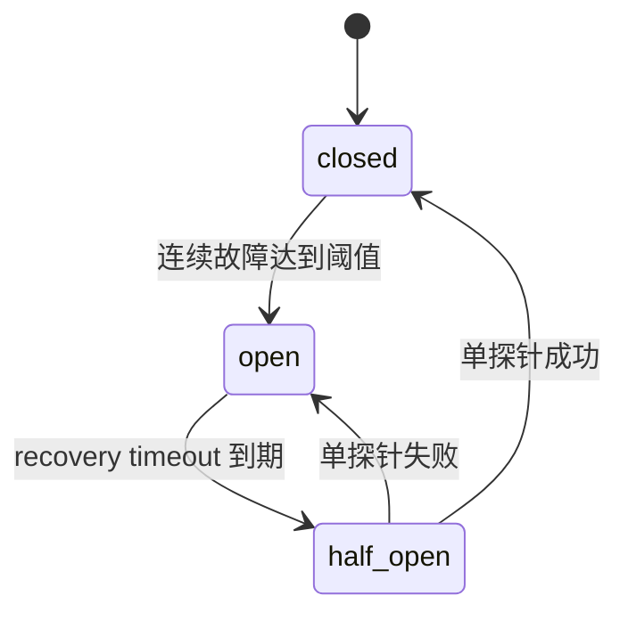

# 25. 角色级 Provider 路由与韧性预算实现

## 1. 本阶段结果

本阶段把 Model Gateway 从“默认 Provider + 能力/隐私筛选”推进为进程内模型调度器，新增角色级 Provider allowlist、费用/重试预算、`Retry-After`、延迟 EWMA 和 closed/open/half-open 熔断状态，并把安全运行投影接入 Provider 设置页。

已实现：

- `intent/planner/tool_agent/summarizer/verifier` 五类角色可分别配置有序 Provider allowlist。
- 每个角色支持 `priority` 与 `latency_aware` 两种选择策略。
- Provider hint 仍是单 Provider 硬约束，不会被静默替换。
- 隐私和能力过滤继续先于韧性、延迟和费用排序。
- 请求 timeout 覆盖整个尝试、等待和 fallback 链，而不是每次尝试重新计时。
- 重试同时受最大尝试次数和累计等待秒数约束。
- 解析 429/5xx 的 `Retry-After` delta-seconds 或 HTTP-date，最多接受 3600 秒。
- 有可用备用 Provider 时立即切换；无备用时只在重试等待预算和总 timeout 内等待。
- 使用整数微美元价格和任务费用台账，调用前按输入上界与最大输出 Token 做费用预留。
- 有限费用预算下，缺少价格的 Provider 不可被选择；昂贵主路由可在调用前让位给可负担的 fallback。
- 成功请求按实际 usage 结算费用，并更新 Provider 累计费用。
- 延迟使用可配置 alpha 的 EWMA；延迟感知路由先采样无观测 Provider，再选择最低 EWMA。
- Provider 连续超时、不可用或非法响应达到阈值后熔断；恢复窗口后进入单探针半开状态。
- 429 使用独立冷却窗口，不增加连续熔断失败次数。
- 新增无凭据、无 endpoint、无任务 ID 的只读调度状态 API。
- 前端设置页展示角色路由、默认重试/费用预算、Provider EWMA、重试数、费用和熔断状态。

## 2. 分层与文件职责

| 文件 | 职责 |
| --- | --- |
| `backend/src/deskpilot/domain/model_contracts.py` | 请求级 `ModelExecutionBudget` 契约 |
| `backend/src/deskpilot/domain/model_routing.py` | 角色路由、价格、Gateway 策略、熔断枚举与安全只读投影 |
| `backend/src/deskpilot/application/model_gateway.py` | 候选筛选、费用预留、重试/fallback、EWMA、熔断和运行台账 |
| `backend/src/deskpilot/model_providers/openai_compatible_chat.py` | 解析并归一化上游 `Retry-After` |
| `backend/src/deskpilot/core/config.py` | 从受信任 Settings 加载 `ModelGatewayPolicy` |
| `backend/src/deskpilot/api/routes/model_providers.py` | `GET /model-providers/routing` |
| `frontend/src/types.ts` / `api.ts` | 调度投影 TypeScript 契约与 API client |
| `frontend/src/composables/useProviderManagement.ts` | Catalog、审计与调度状态的并行加载 |
| `frontend/src/components/ProviderSettings.vue` | 调度/韧性控制面展示 |
| `backend/tests/test_model_routing.py` | 路由、预算、EWMA、Retry-After 和熔断确定性测试 |

策略是不可变启动配置，运行状态是 Gateway 私有可变状态。Provider CRUD 只原子替换 adapter registry；相同 Provider ID 的 EWMA、熔断和累计计数会保留，已删除 Provider 的运行状态会清理。

## 3. 路由顺序



关键约束：

1. `local_only` 和未批准云 fallback 的 `local_preferred` 仍禁止云 Provider。
2. 角色路由是 allowlist，不会自动加入列表外 Provider。
3. 显式 `provider_hint` 不进行跨 Provider fallback。
4. `latency_aware` 不绕过角色、隐私、能力、费用、冷却或熔断约束。
5. 没有显式角色路由时保持旧行为：默认 Provider 优先，其余按 ID 稳定排序。

## 4. 费用模型与硬预留

价格使用整数，单位为“每一百万 Token 的微美元数”：

```text
$0.50 / 1M input tokens  = 500000
$1.50 / 1M output tokens = 1500000
$0.025 task budget        = 25000 micro-USD
```

实际结算公式：

```text
ceil((uncached_input * input_rate
    + cached_input * cached_rate
    + output * output_rate) / 1_000_000)
```

调用前预留使用 UTF-8 请求/Schema 字节数作为保守输入 Token 上界，并使用 `max_output_tokens` 作为输出上界。任务台账在锁内检查：

```text
spent + concurrent_reserved + current_reservation <= task_budget
```

预留失败时不会调用 Provider。成功后释放预留并按真实 `ModelUsage` 结算；失败则释放预留。有限预算下没有明确价格的 Provider 会返回 `MODEL_PROVIDER_PRICING_REQUIRED`，不会假定云调用免费。任务终态或取消后清理任务级台账，Provider 聚合费用仍保留到进程结束。

## 5. 重试与 Retry-After

默认应用策略为最多 2 次尝试、累计最多等待 2 秒；请求可通过 `ModelExecutionBudget` 收紧或覆盖：

```json
{
  "max_attempts": 2,
  "max_retry_delay_seconds": 2,
  "max_task_cost_micros": 25000
}
```

Gateway 只重试 `retryable=true` 的稳定错误。延迟使用指数退避并受 `retry_max_delay_seconds` 限制；上游 `Retry-After` 比本地退避更长时取前者。若存在同一路由内可用 fallback，则不等待被限流 Provider，直接进入下一次尝试，同时保留其冷却截止时间。

整个链共享 `request.timeout_seconds`。只要下一次等待不满足以下任一条件，就返回最后一次真实 Provider 错误：

- 超过 `max_attempts`；
- 累计等待超过 `max_retry_delay_seconds`；
- 等待将耗尽请求总 timeout。

流式响应一旦开始向调用方发出事件就不自动重放，避免重复文本和 usage；当前 stream 路径仍记录费用、EWMA 和熔断结果。

## 6. 延迟 EWMA

成功调用后更新：

```text
ewma = alpha * current_latency + (1 - alpha) * previous_ewma
```

第一次成功直接使用当前延迟。`latency_aware` 路由会优先选择尚无样本的候选，避免第一个 Provider 获得样本后永久压制未采样候选；所有候选都有样本后才按最低 EWMA 选择。EWMA 是调度信号，不替代按需健康探测。

## 7. 熔断状态机



计入连续故障的错误：Provider 不可达、timeout、响应 Schema/identity 非法和非法 stream。认证、内容过滤、请求拒绝等非瞬态业务错误不自动重试；429 进入独立 `Retry-After` 冷却，不污染连续熔断失败计数。

半开状态只允许一个并发探针。探针取消时释放占位但不伪造成功或故障。成功会清零连续失败、关闭熔断并更新 EWMA；失败重新打开完整恢复窗口。

## 8. 安全只读 API

```text
GET /api/v1/model-providers/routing
```

响应使用本地 Bearer session，带 `Cache-Control: no-store`，包含：

- 五类角色的有效 Provider 顺序、策略和是否显式配置；
- 默认尝试/等待/费用预算和熔断参数；
- 每个已注册 Provider 的 EWMA、熔断、失败/重试/请求计数、累计费用；
- 公开价格和冷却/熔断截止时间。

响应不包含 endpoint、credential reference、API Key、上游错误正文、请求内容、task ID 或按任务费用明细。只暴露稳定错误码作为最后错误摘要。

## 9. 启动配置

`DESKPILOT_MODEL_GATEWAY_POLICY` 接受单行 JSON。示例：

```json
{
  "role_routes": [
    {
      "role": "intent",
      "provider_ids": ["ollama-local", "cloud-chat"],
      "strategy": "latency_aware"
    },
    {
      "role": "planner",
      "provider_ids": ["cloud-chat", "ollama-local"],
      "strategy": "priority"
    }
  ],
  "provider_pricing": [
    {
      "provider_id": "ollama-local",
      "input_micros_per_million_tokens": 0,
      "output_micros_per_million_tokens": 0
    },
    {
      "provider_id": "cloud-chat",
      "input_micros_per_million_tokens": 500000,
      "cached_input_micros_per_million_tokens": 100000,
      "output_micros_per_million_tokens": 1500000
    }
  ],
  "default_max_attempts": 3,
  "default_retry_delay_budget_seconds": 8,
  "default_task_cost_budget_micros": 25000,
  "retry_base_delay_seconds": 0.25,
  "retry_max_delay_seconds": 5,
  "latency_ewma_alpha": 0.2,
  "circuit_failure_threshold": 3,
  "circuit_recovery_timeout_seconds": 30
}
```

默认没有显式 role route、价格或费用上限，因此离线 Fake Provider 升级后仍可直接运行。策略暂不由管理 API 写入数据库：它属于受信任启动配置，避免在 Provider CRUD 事务之外出现第二套未审计配置真值。

## 10. 前端控制面

Provider 设置页新增：

- 角色路由卡片和 `priority/latency_aware` 标识；
- 默认最大尝试、重试等待预算、任务费用上限和熔断阈值；
- Provider 级熔断、EWMA、累计重试和累计费用；
- “刷新控制面”同时刷新 Catalog 与调度运行态。

页面当前只读展示调度策略。Provider CRUD 仍使用 Catalog ETag；运行态刷新不参与 ETag，也不会触发 Provider 网络探测。

## 11. 自动化验收

```text
backend Ruff: passed
backend mypy: passed (75 source files)
backend pytest: 142 passed
frontend vue-tsc --noEmit: passed
frontend vite build: passed
```

新增测试覆盖：

- 角色独立 allowlist；
- 延迟感知的首次采样与 EWMA 择优；
- 429 立即切备用和单 Provider 预算内等待；
- `Retry-After` adapter 归一化；
- 调用前费用预留、累计结算、缺价格拒绝和可负担 fallback；
- 连续失败熔断、恢复窗口、半开成功关闭和单并发探针；
- Settings JSON 解析与只读 API 脱敏投影。

测试全部使用 Fake Provider、虚拟时钟或 `httpx.MockTransport`，没有真实模型、DNS、API Key 或付费调用。

## 12. 已知边界与下一步

- 策略、EWMA、熔断和费用聚合当前为单 API 进程状态；多进程/重启共享需要持久化或外部协调。
- 任务级费用台账只在任务运行期存在，尚未写入全系统可观测性 trace。
- Token 输入预留使用协议无关的保守字节上界，不替代 Provider tokenizer。
- 角色策略仍由启动配置管理，尚无带版本/审计的策略写 API。
- stream 不做自动 retry/fallback；发出部分内容后的重放必须由更高层显式设计。
- 本阶段未执行人工浏览器验收，继续保留到前端任务控制与组件测试阶段统一完成。

下一阶段优先增加前端任务暂停/恢复/取消、连接恢复提示和组件测试，然后统一执行人工浏览器验收。

> 后续进展：上述前端任务控制、连接恢复、当前 67 项组件测试和真实浏览器验收已完成，详见 `doc/26-前端任务控制连接恢复与组件测试.md`。
