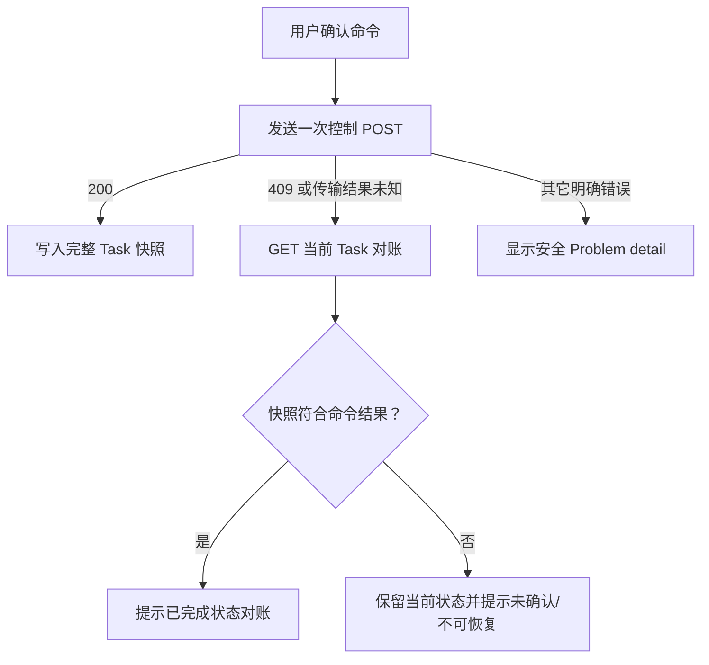
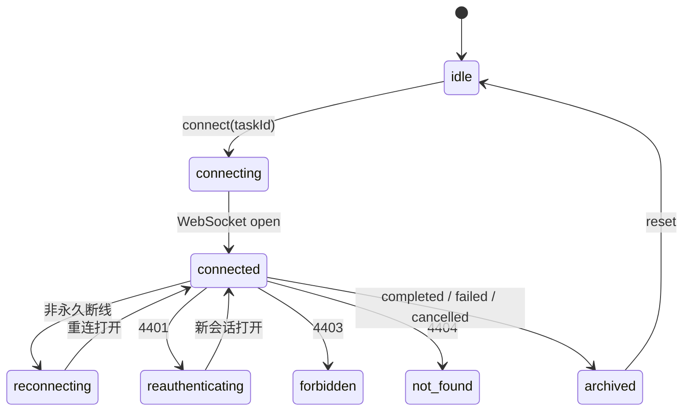

# 前端任务控制、连接恢复与组件测试

## 1. 本阶段目标

本阶段把后端已有的 Pause/Resume/Cancel 状态机接入 Vue 任务工作台，并补齐事件流恢复状态、前端组件测试和真实浏览器验收。

完成内容：

- 运行中任务可暂停，暂停任务可从当前 API 进程的检查点继续。
- 所有非终态任务可取消；取消前使用内联二次确认。
- 控制命令等待服务端安全点，不乐观修改任务状态。
- 控制响应与 WebSocket 事件通过 `last_event_seq` 仲裁，旧事件不会覆盖新快照。
- WebSocket 暴露连接、重连、重新认证、永久阻断和归档状态。
- 断线采用 1/2/4/8 秒封顶退避，并支持立即重连和 `after_seq` 续传提示。
- 接入 Vitest、Vue Test Utils 和 jsdom，覆盖任务与 Provider 关键交互。
- 对任务控制、连接恢复、Provider 设置页和窄屏布局执行真实本地浏览器验收。

## 2. 任务控制状态机

工作台按服务端契约启用控件：

| 当前状态 | Pause | Resume | Cancel |
| --- | --- | --- | --- |
| `created` / `classifying` | 禁用 | 禁用 | 启用 |
| `running` | 启用 | 禁用 | 启用 |
| `paused` | 禁用 | 启用 | 启用 |
| `succeeded` / `failed` / `cancelled` | 禁用 | 禁用 | 禁用 |
| 任一命令 pending | 全组禁用 | 全组禁用 | 全组禁用 |

Pause 和 Cancel 会等处理器停到已提交事件之间的安全点后再返回。界面在请求期间只显示“正在暂停/取消”，不会提前把状态改成 `paused/cancelled`。取消不可逆，因此第一次点击只展开确认区，用户再次确认后才发送命令。

任务未进入终态时，“开始任务”按钮保持禁用，避免后端仍有活动任务时前端切换到新任务并失去旧任务控制入口。创建新任务失败也不会清空当前任务和事件流；只有创建成功后才切换快照与 WebSocket。

## 3. 控制响应对账

任务 API client 新增：

```text
GET  /api/v1/tasks/{task_id}
POST /api/v1/tasks/{task_id}:pause
POST /api/v1/tasks/{task_id}:resume
POST /api/v1/tasks/{task_id}:cancel
```

任务 ID 始终经过 URL 编码。可选 `reason` 会先 `trim()`；空值直接省略 body。控制命令没有复用 Provider 管理写入的网络自动重试，因为 Resume 不是幂等命令。

`useTaskControl` 的处理顺序：



每次请求捕获任务 ID 和递增请求代次。用户切换任务或 reset 后，旧请求即使迟到也不能污染新任务。`409 TASK_RUNTIME_UNAVAILABLE` 会刷新任务快照、保持 `paused`，并明确提示“取消后重新创建任务”。

## 4. 快照与事件游标仲裁

控制 API 的 Task 响应可能先于对应 WebSocket 事件到达。原实现总是优先历史事件，会让刚返回的 `paused/running/cancelled` 被旧状态覆盖。

现在由纯函数 `deriveTaskStatus` 处理：

1. 从事件中找出 `seq` 最大且能表达任务状态的事件。
2. 安全识别七种 `task.status_changed.payload.to`，忽略未知值。
3. 显式映射 `task.completed`、`task.failed` 和 `task.cancelled`。
4. 若 Task 快照的 `last_event_seq` 大于等于最新状态事件序号，使用快照状态；否则使用更新的事件状态。

这样既能立即反映控制响应，也能在后续新事件到达时继续推进界面。

## 5. 事件流恢复模型

`useTaskEvents` 的稳定状态为：



关键边界：

- 重连 URL 使用当前最大事件序号作为 `after_seq`。
- 退避为 1、2、4、8 秒，之后保持 8 秒上限；用户可跳过计时立即重连。
- `4401` 清除内存 session 后重新认证；`4403` 和 `4404` 永久停止，避免无界请求。
- `onopen` 只提示“正在从 #N 后继续接收”，不错误宣称数据库 backlog 已全部补齐。
- 终态事件立即归档、拆除 handler、关闭 socket，之后不再重连。
- JSON 错误、跨任务事件和非法结构会被安全忽略。
- connection generation 同时保护异步 session、socket handler、重连 timer 和 opening 状态；旧任务连接不能写入新任务。
- 服务端同时等待 broker 事件与客户端 disconnect；非终态页面关闭后会立即释放订阅，优雅停机不再被空队列等待器卡住。

## 6. 组件测试体系

前端开发依赖新增：

- `vitest@^4.1.10`
- `@vue/test-utils@^2.4.11`
- `jsdom@^27.4.0`

测试环境使用独立 `vitest.config.ts` 和 `src/test/setup.ts`。setup 只清理 DOM，并为 jsdom 补充原生 `dialog.showModal/close`。

当前 9 个测试文件、64 个用例：

| 测试 | 主要覆盖 |
| --- | --- |
| `App.spec.ts` | 控件矩阵、pending、游标仲裁、建任务时序、连接提示 |
| `api.spec.ts` | 编码路径、POST body、认证头、控制请求不自动重放 |
| `taskState.spec.ts` | 七种状态、终态事件、乱序/非法事件、快照优先级 |
| `TaskControls.spec.ts` | 暂停/继续/取消确认、终态、可访问反馈 |
| `TaskEventItem.spec.ts` | `task.cancelled` 标签和未知事件 fallback |
| `useTaskControl.spec.ts` | 成功快照、对账、跨任务竞态、运行时不可恢复 |
| `useTaskEvents.spec.ts` | 排序去重、退避、4401/4403/4404、归档、generation 清理 |
| `ProviderEditorModal.spec.ts` | Fake/兼容配置 payload、引用凭据、无 API Key、提交互斥 |
| `ProviderSettings.spec.ts` | Catalog、健康、默认/启停、删除二次确认 |

## 7. 自动化与浏览器验收

自动化结果：

```text
frontend pnpm test:       9 files, 64 passed
frontend vue-tsc:         passed
frontend vite build:      passed
backend Ruff:             passed
backend mypy:             75 source files passed
backend pytest:           145 passed, 1 third-party deprecation warning
```

真实本地浏览器使用离线 Fake Provider 和只读磁盘工具完成以下场景：

- 任务进入 `running` 后暂停，界面立即显示 `paused`、Resume 和 Cancel。
- Resume 从检查点继续并最终 `succeeded`；`tool.requested/started/completed` 各出现一次，没有重复执行工具。
- 从 `classifying` 取消时先出现内联确认；确认前无取消事件，确认后以 `task.cancelled` 归档。
- API 暂停期间显示重连状态、退避次数和“立即重连”；重启后以 `after_seq=2` 打开并显示从 `#2` 后继续接收。
- 已暂停任务跨 API 重启后 Resume 返回运行时不可恢复；界面保持暂停并给出可执行的取消/重建提示。
- Provider 页显示角色路由、预算、EWMA/熔断投影；Fake health 返回正常。
- 云端 Provider 表单只出现 Windows Credential Manager/environment 引用，不存在 password/API Key 输入。
- 390×844 视口下只保留两个可用导航入口，文档宽度小于视口，无水平溢出。
- 浏览器控制台 warning/error 为 0。

人工验收使用临时测试数据库和放大的 Fake 阶段延迟，不修改产品默认延迟、不调用云模型、不写入真实凭据，也不执行磁盘写操作。

## 8. 已知边界

- TaskProcessor 检查点仍只存在当前 API 进程内；跨重启只能对账、取消或重新创建，不能真正 Resume。
- 连接恢复只保证从数据库事件序号续传，不恢复丢失的内存执行上下文。
- 前端只跟踪当前工作台任务；本阶段通过禁止活动任务期间创建第二任务避免入口丢失，后续任务列表仍需单独实现。
- jsdom 覆盖交互和状态，不代表像素级渲染；桌面与 390px 布局由本阶段人工浏览器验收补足。

## 9. 下一步

下一阶段优先为 Runner 增加异常重启、退避/熔断和持久化 `unknown` 结果设计，再接入 Policy/Approval 主干。任务图持久化后，再把当前“跨重启不可恢复”升级为真正的检查点恢复。

> 后续进展：Runner 自动换代、退避/熔断、持久化调用账本和 `unknown` 安全收敛已完成；前端测试增至 67 项并增加工具终态标签。详见 `doc/27-Runner故障恢复与unknown调用持久化.md`。
