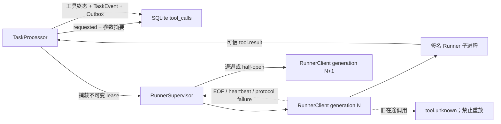

# 27. Runner 故障恢复与 unknown 调用持久化

## 1. 本阶段结果

DeskPilot 已把 Runner 从“单次启动、异常后永久不可用”升级为可观测的自动恢复子系统，并为跨进程边界的工具调用增加持久化账本。

本阶段完成：

- Runner 异常退出、心跳超时、协议错误或启动失败后的自动换代。
- `base × 2^(n-1)` 指数退避及最大延迟封顶。
- 连续失败阈值、open 冷却、单 half-open 代际探针和稳定窗口复位。
- 冻结的 `RunnerLease(runner_id, generation, client)`，阻止旧调用切换到新代执行。
- `0006_tool_call_persistence` 与 `tool_calls` 调用账本。
- `requested/running/succeeded/failed/cancelled/unknown` 状态机和终态 CAS 语义。
- 调用账本、TaskEvent、任务终态与 Outbox 的原子提交。
- API 启动时对遗留 `requested/running` 调用进行幂等恢复。
- `tool.failed`、`tool.cancelled`、`tool.unknown` 前端事件标签。
- 非重放安全工具在执行中超时或取消时返回 `unknown`，而不是伪装成确定失败。

最重要的不变量是：**Supervisor 只恢复 Runner 可用性，绝不透明重放旧调用。**

## 2. 运行结构



`RunnerClient` 只管理一个签名会话；`RunnerSupervisor` 是唯一有权创建、替换和停止会话的组件。每一代重新生成 HMAC 密钥、`key_id`、`startup_nonce` 和 Runner ID。

## 3. Supervisor 状态机

```text
stopped -> starting -> ready
                    -> backoff -> starting
                    -> open -> half_open -> ready
                                        -> open
任意状态 -> stopped
```

- 初次启动失败不会阻止 API 启动；健康接口返回 degraded，Supervisor 在后台恢复。
- 失败次数未到阈值时进入 `backoff`，延迟为 `min(max, base × 2^(n-1))`。
- 达到阈值后进入 `open`，完整等待恢复窗口。
- open 到期只创建一个 `half_open` Runner 代际。
- half-open 完成签名 hello 后可接收调用，但只有连续存活满稳定窗口才清零失败次数并进入 `ready`。
- half-open 失败会重新打开完整恢复窗口。
- `stop()` 会取消退避或恢复等待，且之后不会复活子进程。

`GET /api/v1/health` 新增安全运行投影：

- `runner_state`
- `runner_generation`
- `runner_consecutive_failures`
- `runner_restart_attempts`
- `runner_retry_in_seconds`
- `runner_last_failure_code`

接口不返回启动命令、会话密钥、nonce 或 stderr 正文。

## 4. 代际租约与不重放

TaskProcessor 在越过 IPC 边界前捕获冻结的 `RunnerLease`，先把相同 `runner_id` 写入调用账本，再使用 `expected_runner_id` 下发。

若两个动作之间 Runner 已经换代，Supervisor 返回 `RUNNER_GENERATION_CHANGED`；它不会把旧 `call_id` 发送给新 Runner。此调用已进入保守的不确定边界，因此持久化为 `unknown`。

以下情况都不会自动重放：

- stdin 写入或 drain 结果不明。
- Runner 在执行后、响应前退出。
- heartbeat timeout 后被终止。
- Runner 响应违反签名、会话或输出 Schema。
- 控制面等待结果超时。
- Runner 显式返回 `status=unknown`。

即使 Contract 为 `key_required`，当前 Runner 也没有跨进程持久化幂等回执，因此不能把“携带幂等键”等同于“可跨代安全重放”。

## 5. 持久化调用账本

Alembic `0006_tool_call_persistence` 新增 `tool_calls`：

| 字段组 | 内容 |
| --- | --- |
| 身份 | `call_id`、`task_id`、`step_id`、`attempt` |
| Contract | tool 名称/版本、Contract 摘要、幂等策略 |
| 隐私摘要 | arguments SHA-256、可选 idempotency-key SHA-256 |
| 运行态 | status、runner ID、resolution source、稳定错误码 |
| 终态关联 | terminal event ID、请求/开始/完成/更新时间 |

数据库不保存原始参数、原始幂等键、IPC secret、startup nonce、stderr、Python 堆栈或 Runner 启动命令。成功输出仍只保存在原有 TaskEvent 真值中，避免复制敏感结果。

状态转换：

```text
requested -> running
requested -> failed | cancelled
running   -> succeeded | failed | cancelled | unknown
terminal  -> 不再转换
```

相同调用的重复或迟到终态是 no-op，不追加第二个事件，也不能把 `unknown` 覆盖为迟到的 success。

## 6. 事务边界

TaskService 提供四个聚焦操作：

1. `record_tool_requested()`：写入 requested 账本、`tool.requested` 和 Outbox。
2. `start_tool_call()`：`requested -> running`、绑定 Runner ID、写入 `tool.started` 和 Outbox。
3. `finish_tool_call()`：一次性写工具终态；失败、取消或未知结果默认在同一事务追加 `task.failed`。
4. `recover_incomplete_tool_calls()`：应用启动时幂等收敛遗留调用。

`tool.unknown` 与 `task.failed` 使用连续事件序号并在同一事务提交。Outbox 构造或事务提交失败时，调用状态、任务状态和全部事件一起回滚。

## 7. 启动恢复

恢复在 migration 完成后、新 Runner 启动前执行：

| 遗留状态 | 恢复结果 | 原因 |
| --- | --- | --- |
| `requested` | `failed` + `tool.failed` + `task.failed` | 可证明尚未进入 Runner，但当前没有持久化任务图可继续 |
| `running` | `unknown` + `tool.unknown` + `task.failed` | 可能已执行，旧 Runner 会话不可查询 |

恢复查询只扫描非终态调用；重复启动不会重复事件。若任务本身已经是终态，只收敛账本，不违反任务终态不可追加事件的不变量。

## 8. 超时与取消的不确定性

Python ThreadPool 无法强杀已经运行的 handler。`Future.cancel()` 失败时，handler 可能继续产生副作用。

因此 Runner 当前按 Contract 幂等策略处理：

- `idempotent`：执行中 timeout 仍可返回确定的 `failed/TOOL_TIMEOUT`。
- `non_idempotent` 或 `key_required`：执行已开始后的 timeout 返回 `unknown/TOOL_TIMEOUT_OUTCOME_UNKNOWN`。
- 非重放安全调用在执行中收到 cancel，若无法证明尚未运行，则返回 `unknown/TOOL_CANCEL_OUTCOME_UNKNOWN`。

这仍不是 OS 级强制终止。未来有副作用或可能卡死的工具应使用每调用子进程、持久化幂等回执和资源级 reconciliation。

## 9. 配置

```dotenv
DESKPILOT_RUNNER_RESTART_BASE_DELAY_SECONDS=0.25
DESKPILOT_RUNNER_RESTART_MAX_DELAY_SECONDS=10.0
DESKPILOT_RUNNER_CIRCUIT_FAILURE_THRESHOLD=3
DESKPILOT_RUNNER_CIRCUIT_RECOVERY_TIMEOUT_SECONDS=30.0
DESKPILOT_RUNNER_STABLE_WINDOW_SECONDS=10.0
```

配置校验要求 heartbeat timeout 大于 interval，且 restart max 不小于 base。

## 10. 自动化验收

测试覆盖：

- 初次失败后的降级启动和后台恢复。
- single-flight 启动、退避序列/封顶、open、half-open、稳定窗口和停止竞态。
- 真实子进程被终止后产生新 PID、Runner ID 和 generation。
- generation lease 拒绝把旧调用发给新 Runner。
- 调用账本与事件/Outbox 原子提交和故障注入回滚。
- requested/running 启动恢复及第二次恢复零变更。
- `unknown` 后迟到成功不能覆盖终态。
- 真实任务中 Runner 丢失结果只调用一次，下一项新任务可由恢复后的 Runner 成功执行。
- 非重放安全 timeout/cancel 返回 `unknown`。
- 前端可读展示 `tool.failed/tool.cancelled/tool.unknown`。

本阶段完成时：后端 Ruff、mypy 和 171 项 pytest 均通过；前端 9 个测试文件、67 项测试、类型检查与生产构建均通过。

## 11. 已知边界与下一步

- Runner 子进程可恢复不等于 TaskProcessor 跨 API 重启恢复；分类、计划和阶段游标仍在内存中。
- `unknown` 当前将任务终结为 failed，尚无人工 reconciliation API。
- Runner 仍与 API 使用同一 Windows 用户权限，没有 Job Object、受限令牌或低完整性沙箱。
- capability、参数到资源投影和精确范围已由 Policy/Runner 双侧校验；资源锁、dispatch 前实际版本验证和 OS 级 capability 强制仍未完成。

后续 Policy/Approval 主干已经完成，详见 [Policy / Approval 执行前授权主干](28-Policy-Approval执行前授权主干.md)。当前下一阶段进入 Windows Job Object、受限令牌与每次调用进程隔离；之后再设计 `unknown` 的人工核对与显式新 attempt。
