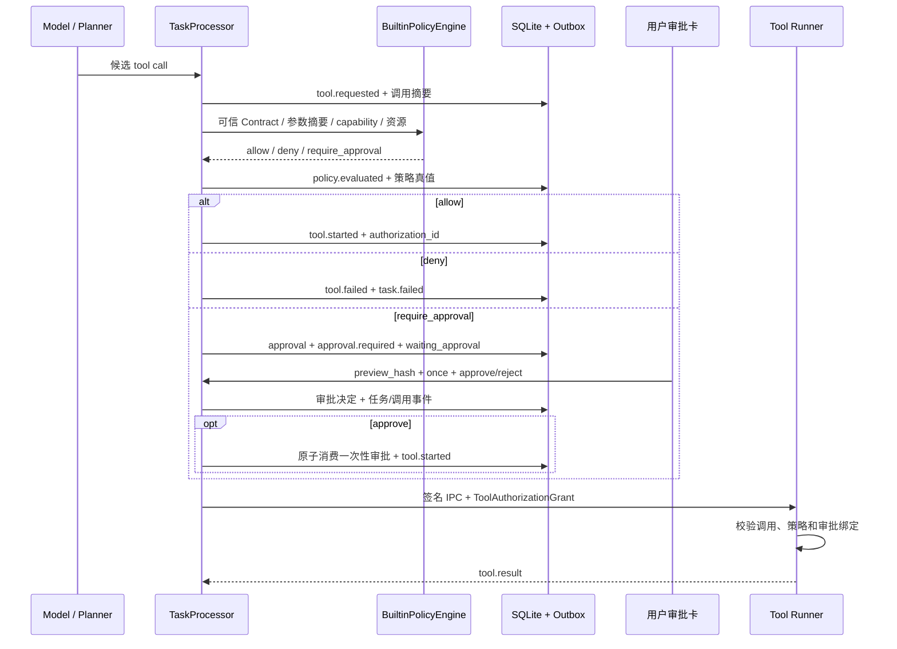

# 28. Policy / Approval 执行前授权主干

## 1. 本阶段结果

DeskPilot 已把 Tool Contract 中的风险、能力与资源声明接入真实 Runner 调用前的授权点，并补齐持久化的一次性审批闭环。模型或 Planner 只能提出候选调用；只有 Policy Engine 允许，或用户对完全一致的预览明确批准后，控制面才会生成 Runner 可验证的授权证明。

本阶段完成：

- 确定性的内置 `BuiltinPolicyEngine`，输出 `allow / deny / require_approval`。
- `R0～R4` 默认规则、有效风险提升、内置工具来源限制、capability allowlist 与精确资源范围校验。
- `waiting_approval` 任务状态，以及 `policy.evaluated`、`approval.required/resolved/expired/invalidated` 事件。
- Alembic `0007_policy_approvals`、持久化 `approvals` 表和工具调用的策略真值字段。
- 与 `preview_hash`、调用、参数、Contract、策略版本和资源范围精确绑定的一次性审批。
- 审批决定、任务状态、工具调用状态、TaskEvent 与事务 Outbox 的原子提交。
- Tool Registry 中从已验证参数生成规范资源的可信 projector，以及控制面/Runner 双侧独立重算与比对。
- Runner IPC 中的 `ToolAuthorizationGrant`，完整绑定动态策略事实，Runner 在 handler 执行前独立校验授权字段。
- 审批查询/批准/拒绝 API，以及任务工作台中的审批卡、错误对账和并发操作保护。
- 不可改写的用户 `decision` 与当前授权 `status` 分离；批准后未派发的授权失效时仍保留原决定审计。
- API 重启时对遗留 pending 和 approved-but-unconsumed 审批安全失效，禁止在缺少进程内检查点时猜测续跑。

当前仍只有一个真实 R0 只读工具 `computer.disk_usage@1.0.0`。R1/R2/R3 规则已有自动化覆盖，但项目尚未开放真实有副作用工具。

## 2. 执行前授权链



关键不变量：

1. 模型输出不是策略事实，也不是执行授权。
2. Policy 请求由控制面从已注册 Contract、已验证参数、可信 resource projector 和受信任配置构造；Runner 在执行边界使用同一投影规则独立重算。
3. `deny` 在 IPC 前终结调用；`require_approval` 在批准前不会创建 Runner 调用。
4. 用户只批准当前预览的一次调用，不能生成工具级、目录级或永久放行。
5. Runner 必须收到与签名 IPC 一同传入、且与本次调用完全匹配的授权证明。

## 3. Policy Engine

`ToolAuthorizationRequest` 包含：

- `task_id / step_id / call_id` 与 actor、工具来源。
- 精确 `tool_name@version`、Contract 摘要和规范化参数摘要。
- Contract 风险、副作用、可逆性、网络访问和 data egress。
- capability 集合，以及规范化资源的 kind、identifier、operations 和可选版本摘要。
- 资源范围摘要和期望资源版本摘要。
- 是否为交互调用与批量数量。

内置策略不调用模型、不解释自然语言，只对这些结构化事实做确定性判断。默认规则如下：

| 风险 | 默认效果 | 说明 |
| --- | --- | --- |
| R0 | `allow` | 仅限无副作用、不可逆标志为 false、无网络和无数据外发；可通过验收配置改为审批 |
| R1 | `require_approval` | 需要当前用户对精确预览明确批准 |
| R2 | `require_approval` | 与 R1 一样使用一次性审批 |
| R3 | `deny` | 默认关闭；受信任组合代码显式启用后仍必须审批 |
| R4 | `deny` | 项目级禁止，不能通过审批绕过 |

此外，以下情况会 fail closed：

- 非 builtin 来源。
- 请求 capability 不在受信任 allowlist。
- 资源 operations 与 capability 集合不完全一致。
- 任一资源 kind/identifier 不在精确允许范围。
- R0 Contract 却声明副作用、可逆操作、网络或数据外发。
- 非交互调用或 `batch_count != 1`；审批文案和预算语义完成前不会放行后台/批量调用。
- 数据外发；目的地尚未进入可信策略与授权绑定前，`data_egress=true` 直接拒绝。

有效风险只会上调、不下调：data egress 或非 builtin 来源至少视作 R3；网络、副作用或可逆动作至少视作 R1。

## 4. 审批预览与精确绑定

审批公开投影展示：

- 工具名称/版本、风险、标题和用途。
- capability、资源范围及资源 operation。
- 后果、是否可逆、是否数据外发及目的地。
- 策略 rule/revision/reason code。
- 请求时间、过期时间、不可改写的用户决定和当前授权生命周期状态。

`preview_hash` 对服务端最终预览材料计算规范 JSON SHA-256，绑定：

- approval/task/step/call 身份。
- 工具名称、版本、Contract 摘要和参数摘要。
- Policy 请求摘要、策略 decision/revision 和资源范围摘要。
- 期望资源版本摘要、有效风险和 capabilities。
- 标题、用途、资源预览、后果、可逆性和 data egress。
- 请求时间与过期时间。

批准或拒绝请求必须回传当前 `preview_hash` 和固定 `scope="once"`。摘要不一致返回 `409 APPROVAL_STALE`，客户端必须刷新完整预览后让用户重新核对。

相同决定的安全重试返回原结果并标记 `replayed=true`；已批准后改为拒绝、或已拒绝后改为批准，会返回 `409 APPROVAL_ALREADY_RESOLVED`。前端不做乐观成功切换；网络结果不明时会分别读取审批与任务快照对账。

`decision` 只记录用户最终选择（approved/rejected），不会被后续系统动作改写；`status` 记录授权当前是否 pending/approved/rejected/expired/cancelled。因此 `status=cancelled, decision=approved` 明确表示“用户曾批准，但该授权在派发前已经失效”。原 `resolved_at/resolution_reason` 同样保留。

## 5. 一次性消费与 Runner 授权证明

审批批准只把任务从 `waiting_approval` 恢复为 `running`，尚不代表工具已经进入 Runner。真正越过 IPC 前，`start_tool_call()` 会在同一数据库事务中：

1. 核对工具账本中的策略 decision/revision/effect/resource digest。
2. 核对关联的 `policy.evaluated` 审计事件。
3. 对需要审批的调用，核对 approval 的 task/call、decision、Contract、参数、预览、规则、原因和风险。
4. 再次检查审批与 grant 是否过期。
5. 原子写入 `consumed_at`，并将调用从 `requested` 改为 `running`。
6. 记录 `authorization_id` 与 `tool.started`。

一次性审批已消费后不能再次用于同一或其他调用。

随后控制面生成 `ToolAuthorizationGrant`，其中包含 authorization/decision ID、task/step/call、actor/origin、工具名称/版本、Contract、策略版本/规则/原因、有效风险、参数摘要、完整规范资源与范围摘要、资源版本摘要、capability、网络/外发、副作用、可逆性、交互/批量事实，以及可选的 approval ID、preview hash、批准时间和 grant 过期时间。该证明进入原有 HMAC 签名 IPC 信封。

Runner 在执行 handler 前先验证输入 Schema，再通过注册工具的可信 projector 从真实参数重算规范资源，随后验证上述字段与 `tool.call`、注册 Contract 和重算资源完全一致。它会拒绝缺少策略授权、资源伪装、字段错配、风险降级、有效风险提升后缺少审批或过期证明。HMAC 和授权证明可以防止协议层的意外绕过与篡改，但它们不等于独立的 OS 权限边界：控制面与 Runner 当前仍运行在同一 Windows 用户权限下。

## 6. 持久化与事务边界

`0007_policy_approvals` 为 `tool_calls` 增加：

- `policy_decision_id`
- `policy_revision`
- `policy_effect`
- `resource_scope_digest`
- `policy_event_id`
- `authorization_id`

新 `approvals` 表保存调用绑定、公开预览、策略依据、资源与 capability、`preview_hash`、不可改写的 approved/rejected 用户 `decision`，以及 pending/approved/rejected/expired/cancelled 授权生命周期。一个 `call_id` 最多关联一条审批。

以下变化都与相应 TaskEvent、任务/调用状态和 Outbox 消息在同一数据库事务提交：

- 策略 allow/deny/require approval。
- 创建审批并切换为 `waiting_approval`。
- 批准、拒绝、过期或随任务取消。
- 消费批准并进入 `tool.started`。

因此 Outbox 构造或事务提交失败时，审批、调用、任务状态和事件会一起回滚；WebSocket 仍按持久化事件序号投递。

## 7. API 与任务状态

新增 API：

| Method | Path | 作用 |
| --- | --- | --- |
| GET | `/api/v1/approvals?status=&task_id=` | 按状态/任务查询审批 |
| GET | `/api/v1/approvals/{approval_id}` | 读取完整、受认证审批预览 |
| POST | `/api/v1/approvals/{approval_id}:approve` | 携带 `preview_hash` 批准本次调用 |
| POST | `/api/v1/approvals/{approval_id}:reject` | 携带 `preview_hash` 拒绝本次调用 |

`waiting_approval` 是非终态。主要转换：

```text
running -> waiting_approval
waiting_approval -> running       # 批准
waiting_approval -> cancelled     # 拒绝、过期、任务取消或重启恢复
waiting_approval -> failed        # 执行主干中的确定失败
```

拒绝、过期和任务取消都会在 Runner dispatch 前取消仍处于 requested 的工具调用。任务控制中的 Cancel 还会在同一事务撤销 pending 审批。

批准后尚未消费的授权若遇到任务取消、dispatch 前过期或启动恢复，会写入 `approval.invalidated`（过期使用 `approval.expired`），将 requested 调用和任务安全终结，同时保留用户曾批准的审计事实。审批 GET/列表/决定成功响应统一带 `Cache-Control: no-store`，避免本地路径与操作预览被浏览器缓存。

稳定审批错误包括：`APPROVAL_NOT_FOUND`、`APPROVAL_STALE`、`APPROVAL_EXPIRED`、`APPROVAL_ALREADY_RESOLVED`、`APPROVAL_TASK_STATE_CONFLICT` 和 `APPROVAL_RUNTIME_UNAVAILABLE`。

## 8. 前端审批体验

任务工作台现在会：

- 识别 `waiting_approval` 与 `approval.required/resolved/expired/invalidated`。
- 收到 `approval.required` 后，通过受认证 API 获取完整审批预览，而不是只信任事件摘要。
- 显示风险、工具、用途、资源、capability、后果、可逆性、数据外发和有效期。
- 批准时明确提示“仅为本次”；拒绝可填写原因。
- 任一审批请求 pending 时禁用批准、拒绝及其他冲突控制。
- 不乐观更新审批或任务状态；传输失败后 GET 审批/任务快照对账。
- 遇到 stale 预览时载入新 `preview_hash`，要求用户重新核对。
- 区分“用户曾同意”与“授权后来失效”；批准已提交但运行时继续动作发生竞态时，只安全重试同一审批恢复一次，不重放工具调用。

前端仍只保留一个任务工作台快照，尚无审批中心、任务历史切换或多任务并行控制入口。

## 9. 重启与过期语义

当前 TaskProcessor 的阶段游标仍只在 API 进程内存中。API 重启后即使数据库保留 pending 审批，也没有足够信息证明该从哪个检查点继续。

启动恢复因此采用 fail closed：

- pending 审批改为 `cancelled`，原因码为 `APPROVAL_RUNTIME_LOST`。
- approved-but-unconsumed 审批也改为 `cancelled` 并发出 `approval.invalidated`，但 `decision=approved` 和原决议审计保持不变。
- 对应 requested 工具调用改为 `cancelled`。
- 非终态任务以 `task.cancelled` 收敛。
- 不自动批准、不创建新 attempt，也不把旧调用发送给新 Runner。

审批 TTL 默认 300 秒。审批过期时，或批准后尚未 dispatch 就越过过期边界时，审批授权、调用和任务都安全终结，工具不会执行；后者只把当前 `status` 改为 expired，不覆盖用户原批准时间、身份或原因。重复提交已过期决定稳定返回 `APPROVAL_EXPIRED`。真正跨重启续跑需先持久化任务图和阶段检查点。

## 10. 配置

```dotenv
# 生产默认：真实 R0 只读工具自动允许
DESKPILOT_POLICY_REQUIRE_APPROVAL_FOR_R0=false

# 本地验收：让当前唯一真实 R0 工具进入审批卡
DESKPILOT_POLICY_REQUIRE_APPROVAL_FOR_R0=true

# 审批有效期，范围 10～3600 秒，默认 300
DESKPILOT_POLICY_APPROVAL_TTL_SECONDS=300
```

`DESKPILOT_POLICY_REQUIRE_APPROVAL_FOR_R0=true` 是为了在尚无真实 R1/R2 工具时验证审批闭环，不代表生产默认策略把所有 R0 调用都改为 HITL。

## 11. 自动化与人工验收

本阶段完成时：

```text
后端 Ruff：All checks passed
后端 mypy：Success
后端 pytest：231 passed

前端 Vitest：11 files, 100 passed
前端 vue-tsc --noEmit：passed
前端 vite build：passed
```

自动化覆盖策略矩阵、非交互/批量/外发 fail closed、有效风险提升、参数到资源的可信双侧投影、精确资源/capability 校验、审批迁移与 Schema、预览篡改/稳定过期/冲突/幂等、不可改写决定、批准后失效、一次性消费、拒绝/取消/重启恢复、API no-store/Problem Details、事务/Outbox 回滚、敏感异常脱敏、Runner 完整授权事实错配与真实处理器闭环，以及前端审批卡、授权失效、运行时恢复、并发禁用和传输失败对账。

人工浏览器验收已完成（`DESKPILOT_POLICY_REQUIRE_APPROVAL_FOR_R0=true`）：批准链按 `approval.resolved -> task.status_changed -> tool.started -> tool.completed -> task.completed` 完成；拒绝链按 `approval.resolved -> tool.cancelled -> task.cancelled` 收敛且无 `tool.started`。审批卡展示规范绝对路径和完整风险事实，390×844 无水平溢出，控制台 error/warn 为 0。

## 12. 已知边界与下一步

- 当前仅开放真实 R0 `computer.disk_usage`；R1/R2/R3 只有策略与测试覆盖，没有真实副作用工具。
- Policy 层已校验声明的 capability 与精确资源，但 Windows 内核尚未据此限制文件、网络或进程权限。
- Runner 授权证明与 HMAC 使用控制面会话材料，不能抵御同一用户下已完全攻陷的控制面。
- `expected_resource_versions` 协议和摘要已经接线，当前磁盘元数据工具尚无可用资源版本。
- pending 与 approved-but-unconsumed 审批不会跨 API 重启续跑；当前选择保留用户审计并可证明地不执行。
- 当前非交互、批量和数据外发均 fail closed；在开放前需要把用户可见预览、目的地、预算和 dispatch 前实际资源版本验证完整绑定。
- 仍禁止任意 Shell、PowerShell 拼接、动态 Python、文件写入、应用关闭/安装和其他高风险工具。

下一阶段建议优先为 Runner 增加 Windows Job Object、受限令牌/低完整性和每次调用进程隔离，把应用层授权落实为 OS 可强制执行的资源与进程边界；之后再推进 `unknown` 人工 reconciliation、持久化幂等回执和跨重启任务图。

> 后续进展（2026-08-09）：上述 Runner 进程隔离入口已完成，详见 [29-Windows-Runner进程隔离与低完整性实现](29-Windows-Runner进程隔离与低完整性实现.md)。本节其余内容保留为 Policy/Approval 阶段完成时的验收快照。
