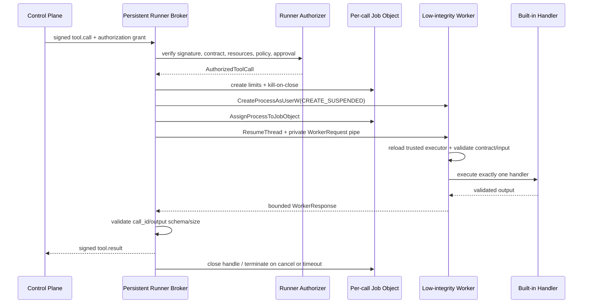

# 29. Windows Runner 进程隔离与低完整性实现

## 1. 本阶段结果

DeskPilot 已把工具 handler 从常驻 Runner 的线程池移入**每次调用新建的一次性 worker 进程**。常驻 Runner 现在只保留签名 IPC、授权复核、调度、超时/取消和结果封装职责；通过授权的调用才会创建 worker。

Windows worker 在执行任何 Python handler 前具备以下内核边界：

- 使用当前进程令牌派生 `CreateRestrictedToken(DISABLE_MAX_PRIVILEGE | LUA_TOKEN)` 主令牌；
- 将派生令牌的 Mandatory Integrity Level 设置为 Low（RID `4096`）；
- 以 `CreateProcessAsUserW + CREATE_SUSPENDED` 创建 worker；
- 在首线程恢复前把 worker 分配到独立 Job Object，消除先执行后入 Job 的竞态；
- Job 默认启用 `KILL_ON_JOB_CLOSE`、`DIE_ON_UNHANDLED_EXCEPTION`、进程内存上限和活动进程数上限；
- 默认 `ActiveProcessLimit=1`，当前内置工具不能再派生子进程；
- 只继承私有 stdin/stdout/stderr 三个句柄，使用 `PROC_THREAD_ATTRIBUTE_HANDLE_LIST` 禁止继承其他可继承句柄；
- worker 环境使用静态白名单重建，不携带控制面 session、Provider credential 或其他 `DESKPILOT_*` 运行秘密；
- handler 完成、失败、超时、取消或父 Runner 丢失时关闭/终止 Job，整棵调用进程树一起回收。

当前真实 R0 `computer.disk_usage@1.0.0` 已通过该边界运行，不再在常驻 Runner 进程内执行。

## 2. 新执行链



关键顺序不变量：

1. Policy deny 或未批准调用不会创建 worker。
2. worker 在恢复首线程前已经进入 Job Object。
3. worker 只收到调用所需的工具名、版本、Contract 摘要和已验证参数，不收到 Runner HMAC 密钥或完整授权证明。
4. worker 重新加载受信任 executor factory，并再次核对精确工具版本、Contract 摘要、输入/输出 Schema 和输出大小。
5. 一次 worker 只处理一个调用；完成后进程退出，不能跨调用保留内存状态、句柄或模块全局变量。

## 3. 进程角色拆分

### 3.1 常驻 Runner broker

`runner/server.py` 仍处理：

- HMAC 信封、启动 nonce、TTL 与重放防护；
- 完整 `ToolAuthorizationGrant` 和可信资源投影复核；
- Runner generation、heartbeat、并发上限和调用关联；
- timeout/cancel 的幂等与 `unknown` 语义；
- worker 输出的第二次 Schema/字节上限校验；
- 返回控制面的签名 `tool.result`。

它不再直接调用工具 handler。

### 3.2 一次性 worker

`runner/worker.py` 只读取一个最大 1 MiB 的 `deskpilot.worker.v1` NDJSON 请求，创建静态 executor，执行一个 handler，写回一个结果并退出。worker 协议不是第二套外部授权协议；它位于 Runner 已完成授权后的私有管道内，因此只携带执行所需最小字段。

worker factory 由受信任组合代码固定为 `deskpilot.tools:create_builtin_executor`，不来自模型、用户参数、Tool Contract 或 IPC 请求。测试 fixture 使用独立 factory，但生产不会开放动态 factory 配置。

## 4. Windows 启动细节

### 4.1 受限令牌与 Low Integrity

启动器通过 ctypes 直接调用 Win32，不新增 pywin32 等运行时依赖：

1. `OpenProcessToken` 打开当前 Runner 主令牌；
2. `CreateRestrictedToken` 删除最大权限并应用 LUA token 语义；
3. `ConvertStringSidToSidW("S-1-16-4096")` 创建 Low Integrity SID；
4. `SetTokenInformation(TokenIntegrityLevel)` 将派生主令牌降为 Low；
5. `CreateProcessAsUserW` 使用该令牌创建 worker。

Low Integrity 的主要当前效果是 Mandatory Integrity Control 的 no-write-up：worker 不能写入普通 Medium Integrity 用户对象。它不是文件读取 allowlist，也不自动禁止网络。

### 4.2 Job Object

每个调用创建一个匿名 Job Object，默认限制：

| 限制 | 默认 | 作用 |
| --- | ---: | --- |
| `JOB_OBJECT_LIMIT_KILL_ON_JOB_CLOSE` | 开 | Runner 失去最后 Job handle 时终止关联进程 |
| `JOB_OBJECT_LIMIT_DIE_ON_UNHANDLED_EXCEPTION` | 开 | 不允许进程关闭系统未处理异常对话框语义 |
| `JOB_OBJECT_LIMIT_PROCESS_MEMORY` | 256 MiB | 限制单 worker 提交内存 |
| `JOB_OBJECT_LIMIT_ACTIVE_PROCESS` | 1 | 禁止 worker 派生额外进程 |

worker 使用挂起状态创建；`AssignProcessToJobObject` 成功后才调用 `ResumeThread`。任何一步失败都会终止 Job、关闭令牌/进程/线程/管道句柄并返回稳定隔离错误。

### 4.3 精确句柄继承

worker 必须继承三条匿名管道，因而 `CreateProcessAsUserW` 需要开启句柄继承。为了避免多线程 Runner 中的句柄泄漏，启动器使用 `STARTUPINFOEXW` 和 `PROC_THREAD_ATTRIBUTE_HANDLE_LIST`，只列出 child stdin、stdout、stderr；父端管道在创建前清除继承位，创建后立即关闭 child 端副本。

### 4.4 venv 重定向器

当前 Windows Python venv 的 `Scripts/python.exe` 会再启动基础解释器。如果直接把该重定向器放入 `ActiveProcessLimit=1` 的 Job，内核会正确拒绝第二个解释器进程。实现因此直接启动 `sys._base_executable`，并从常驻 Runner 的 `sys.path` 重建去敏 `PYTHONPATH`；Job 内仍只有一个真正执行 handler 的 Python 进程。

## 5. 配置与握手

新增配置：

```dotenv
DESKPILOT_RUNNER_REQUIRE_WINDOWS_SANDBOX=true
DESKPILOT_RUNNER_WORKER_MEMORY_LIMIT_BYTES=268435456
DESKPILOT_RUNNER_WORKER_ACTIVE_PROCESS_LIMIT=1
```

- `REQUIRE_WINDOWS_SANDBOX=true` 时，受限令牌/Low Integrity/Job 初始化失败会让该 Runner 代际启动失败，由 Supervisor 按原有退避/熔断恢复；不会静默降级。
- 内存范围为 64 MiB～2 GiB。
- 活动进程范围为 1～16；生产默认 1。提高该值等于明确允许工具创建受 Job 管理的子进程，不应为兼容任意命令而放宽。

`RunnerBootstrap` 携带本代隔离策略；签名 `RunnerHello` 回报：

- `isolation_mode = windows_restricted | process_only`
- `per_call_process_isolation = true | false`

控制面要求强隔离时，只接受 `windows_restricted + per_call_process_isolation=true`。

## 6. 超时、取消与失败语义

- timeout/cancel 会设置原有 cancellation event；Windows launcher 最多约 25 ms 轮询到该状态并 `TerminateJobObject`。
- 幂等调用按原有规则返回 cancelled/failed；已经开始的非重放安全调用仍保守返回 `unknown`，不会因为“进程已被杀”就伪造未产生副作用。
- worker 非零退出映射为 `TOOL_WORKER_EXITED`。
- worker 帧过大、Schema 非法或 call ID 错配映射为 `TOOL_WORKER_PROTOCOL_INVALID`。
- Win32 令牌、Job、管道、进程创建或分配失败映射为 `RUNNER_ISOLATION_FAILED/UNAVAILABLE`，错误不携带命令参数、授权材料或环境内容。
- 持久化工具账本、TaskEvent、Outbox 和 `unknown` 收敛规则未改变。

## 7. 自动化验收

完成时：

```text
Ruff：All checks passed
mypy：Success（87 source files）
pytest：232 passed
```

真实 Windows 集成测试证明：

- 连续两次调用使用不同 worker PID，且都不同于常驻 Runner PID；
- worker integrity RID 为 `4096`；
- `DISABLE_MAX_PRIVILEGE` 后只剩系统保留的 `SeChangeNotifyPrivilege`；
- worker 处于 Job Object 中；
- worker 写入测试创建的 Medium Integrity 临时目录被拒绝；
- `ActiveProcessLimit=1` 时再次创建 Python 子进程失败；
- 父 Runner 中注入的测试秘密不会出现在 worker 环境；
- 原有磁盘工具、timeout、cancel、非幂等 `unknown`、Runner 换代及全量 API 测试继续通过。

## 8. 已知边界

- Low Integrity 主要提供写保护；同一用户可读对象仍可能被读取。Contract 的精确文件资源范围目前仍由应用/Runner projector 校验，不是 Windows ACL/handle broker 强制。
- Job Object 和受限令牌不自动阻止 socket；`network_access=false` 当前仍由受信任内置代码和策略保证，尚无 AppContainer/WFP/代理级网络隔离。
- worker factory、Python 解释器、`PYTHONPATH` 中的代码都属于可信计算基。此边界用于约束工具实现故障和减少权限，不用于安全运行任意第三方 Python。
- Low Integrity 会阻止未来写工具直接写普通用户文件。开放真实副作用工具前，需要设计 brokered I/O、预先打开的最小权限 handle 或独立受控提交阶段，不能简单提升 worker 完整性。
- HMAC 和授权证明仍不能抵御已完全攻陷的同用户控制面；桌面壳、代码签名、安装目录 ACL 和进程间身份绑定仍是发布阶段工作。
- 非 Windows 兼容启动器只提供每调用进程分离；生产默认配置要求 Windows 强隔离并会拒绝该降级模式。

## 9. 下一步

建议下一阶段进入 `unknown` 人工 reconciliation、持久化幂等回执和显式新 attempt；同时在引入第一个真实副作用工具前，为 Contract capability 设计可由 OS 强制的资源 handle/broker 与网络隔离，避免把 Low Integrity 误当成完整 capability sandbox。

## 资料依据

- [Microsoft Job Objects](https://learn.microsoft.com/en-us/windows/win32/procthread/job-objects)
- [Microsoft Restricted Tokens](https://learn.microsoft.com/en-us/windows/win32/secauthz/restricted-tokens)
- [Microsoft CreateRestrictedToken](https://learn.microsoft.com/en-us/windows/win32/api/securitybaseapi/nf-securitybaseapi-createrestrictedtoken)
- [Microsoft Mandatory Integrity Control](https://learn.microsoft.com/en-us/windows/win32/secauthz/mandatory-integrity-control)
- [Microsoft CreateProcessAsUser](https://learn.microsoft.com/en-us/windows/win32/api/processthreadsapi/nf-processthreadsapi-createprocessasuserw)
- [Microsoft process creation and handle inheritance guidance](https://learn.microsoft.com/en-us/windows/win32/procthread/creating-processes)
