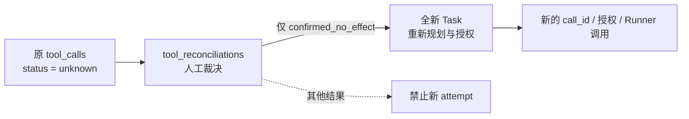

# 30. unknown 人工对账与显式新 attempt 实现

## 1. 阶段结果

DeskPilot 已把 `unknown` 从只能保守终止任务的内部状态，扩展为可查询、可人工裁决、可跨重启幂等操作的持久化工作流。

本阶段完成：

- `unknown` 调用与 `tool_reconciliations` 在同一事务创建；
- pending/resolved 两态人工对账和四种不可改写的裁决结果；
- Reconciliation 读 API、裁决 API 和显式新 attempt API；
- Reconciliation 写请求的持久化幂等回执；
- `key_required` Tool 调用的持久化幂等键占用回执；
- 只有 `confirmed_no_effect` 能创建新 attempt；
- 新 attempt 使用新任务、重新规划、重新策略评估和重新审批；
- 原调用始终保持 `unknown`，迟到成功或人工裁决都不能覆盖账本；
- 旧数据库中已有的 `unknown` 和 `key_required` 调用自动回填；
- 状态机、事务回滚、并发、API 安全和跨重启幂等测试。

核心不变量仍是：**系统永不因 Runner 恢复、人工操作或 HTTP 重试而自动重放结果不确定的旧调用。**

## 2. 三类独立事实



三类事实不能互相冒充：

1. `tool_calls` 是执行边界真值。原调用一旦进入 `unknown` 就永久保持该终态。
2. `tool_reconciliations` 是人工证据和裁决，不是 Runner 结果，也不会向已终止的原任务追加事件。
3. 新 attempt 是一条新的任务执行链，不是对原 `call_id` 的再次派发。

这种分离保留了历史真实性，也避免把“人工认为成功/失败”伪造成可验证的 Runner 回执。

## 3. 人工裁决状态机

```text
pending -> resolved
resolved -> 不可改写
```

裁决结果：

| Outcome | 含义 | 允许创建新 attempt |
| --- | --- | --- |
| `confirmed_succeeded` | 人工证据确认原操作已经成功产生效果 | 否 |
| `confirmed_failed` | 确认调用失败，但不能据此证明完全无副作用 | 否 |
| `confirmed_no_effect` | 证据确认目标资源没有发生任何效果 | 是，最多一个直接后继任务 |
| `accepted_unknown` | 接受无法进一步查明的结果 | 否 |

“失败”与“未产生效果”刻意分开。超时、部分提交、外部系统错误都可能同时满足“失败”和“已经产生部分效果”；因此只有更强的 `confirmed_no_effect` 证明能打开新 attempt。

裁决必须携带 1～2000 字符的 evidence summary，并保存 `resolved_by`、`resolved_at`。裁决记录不保存旧调用原始参数、IPC 密钥或原始幂等键。

## 4. 持久化模型

Alembic `0008_tool_reconciliation` 新增三张表。

### 4.1 `tool_reconciliations`

- 一条 `unknown` Tool 调用至多对应一条记录；
- 保存原 task/call 引用、pending/resolved、裁决、证据摘要和时间；
- 可选关联唯一的 `new_attempt_task_id`；
- 数据库约束同时验证状态、outcome 与 resolved 时间的一致性；
- 按 status/unknown_at 和 task/status 建索引。

`finish_tool_call(..., UNKNOWN)` 会在账本、`tool.unknown`、`task.failed`、Outbox 的同一事务创建 pending reconciliation。启动恢复把遗留 `running` 收敛为 `unknown` 时使用相同事务边界。任一步失败会整体回滚。

### 4.2 `tool_reconciliation_idempotency_records`

Reconciliation 写 API 要求 16～128 位 `Idempotency-Key`。数据库只保存其 SHA-256、operation、规范请求 fingerprint、reconciliation ID，以及新建任务 ID（如有）。

- 同一键、同一规范请求：跨进程重启重放原语义；
- 同一键、不同 operation/body/resource：`409 IDEMPOTENCY_KEY_REUSED`；
- 创建新任务已提交但 HTTP 响应丢失：重试返回同一任务，不再创建或执行第二个任务；
- 回执不设短期过期，避免旧人工操作在未来被误当成新操作。

### 4.3 `tool_idempotency_receipts`

对于 Contract 声明 `key_required` 的调用，控制面在 `tool.requested` 事务内写入持久化占用回执：

- 唯一范围为 tool name + version + idempotency-key digest；
- 绑定 call ID 与 arguments digest；
- 原始 key 和原始参数均不落库；
- 相同键再次用于另一个调用时，在进入 Runner 前拒绝。

该回执证明“这个键已被哪个调用占用”，但不把键本身当成成功回执，也不会启用跨代自动重放。

迁移会为现有 `unknown` 调用回填 pending reconciliation，并为旧 `key_required` 调用回填最早占用者。若旧数据已经重复使用同一 tool/version/key digest，只承认最早的持久化调用。

## 5. API

```text
GET  /api/v1/reconciliations?status=&task_id=
GET  /api/v1/reconciliations/{reconciliation_id}
POST /api/v1/reconciliations/{reconciliation_id}:resolve
POST /api/v1/reconciliations/{reconciliation_id}:create-attempt
```

所有接口要求本地 Bearer session；写接口还要求可信 Origin 和 `Idempotency-Key`。成功响应统一使用 `Cache-Control: no-store`。

裁决请求示例：

```json
{
  "outcome": "confirmed_no_effect",
  "evidence_summary": "已核对目标资源版本与外部审计日志，未发生修改。"
}
```

稳定冲突包括：

- `RECONCILIATION_ALREADY_RESOLVED`
- `RECONCILIATION_ATTEMPT_NOT_ALLOWED`
- `RECONCILIATION_ATTEMPT_ALREADY_CREATED`
- `IDEMPOTENCY_KEY_REUSED`

## 6. 显式新 attempt 的事务边界

`create-attempt` 不在原 failed task 内增加 `attempt=2`。原任务已经终止，而且账本不保存原始 Tool 参数；沿用原任务会破坏终态不可追加事件和精确授权两项不变量。

服务在一个事务内：

1. 校验 reconciliation 已 resolved 且 outcome 为 `confirmed_no_effect`；
2. 复制原任务的 goal、conversation、privacy mode 和 constraints；
3. 创建全新 task ID 与 `task.created`；
4. 在事件中写入 `retry_of` lineage：reconciliation、原 task、原 call 和 source attempt；
5. 写入 Outbox；
6. 绑定 reconciliation 的唯一后继任务；
7. 写入 API 幂等回执。

提交后，API 才把新任务交给 `TaskProcessor`。新任务重新分类、规划、生成 Tool 参数、执行 Policy/Approval，并生成新的 call ID 和 authorization。它不继承旧预览、一次性审批、Runner lease、原始幂等键或原始参数。

如果数据库已提交但进程在启动 TaskProcessor 前退出，客户端用同一 Idempotency-Key 重试时会取回状态仍为 `created` 的原任务并启动它。若任务已经 running/terminal，则只返回当前快照，不重复启动。

## 7. 验收

完成时：

```text
Ruff:  All checks passed
mypy:  Success, 90 source files
pytest: 239 passed
frontend vitest: 11 files, 100 passed
frontend type-check/build: passed
```

自动化覆盖：

- `unknown` 与 reconciliation、事件、任务和 Outbox 原子提交；
- 注入 Outbox 失败时全部回滚；
- 启动恢复幂等创建 reconciliation；
- 旧 schema 数据回填；
- 四种裁决结果的 retry 矩阵；
- 裁决不可改写；
- 同键请求 replay、异请求冲突；
- 四个并发同键 create-attempt 只生成一个任务；
- API 重启后重放裁决与任务创建回执；
- 原任务和后继任务各自只调用 Runner 一次；
- 新任务 lineage、重新执行链和原 `unknown` 不变；
- 认证、可信写来源、no-store 与幂等键格式。

## 8. 已知边界与下一步

- 人工裁决依赖操作者或未来资源 adapter 提供可信证据；当前没有自动查询第三方系统事务状态的 connector。
- 多 API 进程同时首次写入同一幂等键时，数据库唯一约束会阻止双写，但冲突尚未统一转换为 replay；当前部署目标仍是单 API 进程。
- 新 attempt 是全新计划，不保证模型生成与旧调用完全相同的参数。这正是避免持久化敏感原始参数和复用旧授权的安全选择。
- 前端任务时间线会继续把 `tool.unknown` 显示为不可安全重试；Reconciliation 当前提供受认证 API，完整任务历史/对账中心留给后续控制面阶段。
- Low Integrity 仍不是完整 capability sandbox。开放真实副作用或网络工具前，下一阶段应把 Contract capability 映射为 brokered resource handle、受控提交阶段与可证明的网络隔离。
