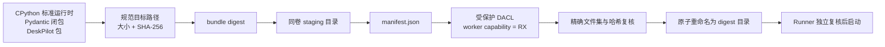

# 32. AppContainer 专用 Worker 运行时与 Profile 回收

## 1. 阶段结果

本阶段补齐了阶段 31 留下的发布运行时缺口：真实 Python worker 不再依赖开发解释器、venv 或源码目录的 ambient ACL，而是通过受信任父进程发布一个内容寻址、可完整校验、只向专用 capability 开放读取/执行的 CPython bundle。

已完成：

- 从当前 CPython 基础运行时提取标准库、DLL 和解释器，不复制庞大的全局 `site-packages`；
- 只复制 worker 所需的 Pydantic 依赖闭包与 DeskPilot 包，当前 bundle 约 57 MiB、约 1,500 个文件；
- 源文件路径、大小和 SHA-256 共同形成内容摘要，发布目录名就是该摘要；
- staging 目录完成复制、manifest、ACL 和二次哈希验证后才原子重命名，不暴露半成品；
- 已发布 bundle 每次使用前重新校验 manifest、精确文件集合、文件大小、哈希与 reparse point；
- 使用稳定的 `DeskPilot.workerRuntime.v1` capability SID，把 bundle DACL 保护为“当前用户 / SYSTEM / Administrators 完全控制，worker capability 只读与执行”；
- 每次 Tool 调用仍使用唯一 AppContainer Package SID；专用 runtime capability 只负责加载 bundle，不授予任何网络 capability；
- worker 环境在 bundle 模式下移除开发 `PYTHONPATH`、`VIRTUAL_ENV` 和任意用户 PATH，显式绑定 `PYTHONHOME` 与最小系统 PATH；
- 控制面在创建 Runner 进程前异步准备 bundle；Runner 收到精确 bundle 路径后独立复核，再执行真实 worker 预启动；
- 新增 durable profile journal，记录每个 `DeskPilot.Worker.<uuid>` moniker；正常退出删除并注销，异常退出由下一 Runner 代际在接受调用前回收；
- Windows 发布配置模板已切换为 `DESKPILOT_RUNNER_REQUIRE_NETWORK_ISOLATION=true`。

真实端到端结果：

```text
isolation_mode = windows_appcontainer
network_isolation_mode = appcontainer
computer.disk_usage@1.0.0 = succeeded
```

## 2. 内容寻址发布链



`worker_runtime.py` 不打包开发环境的全部依赖。它从 `sys.base_prefix` 复制 CPython 根 DLL、`DLLs/` 和排除 `site-packages` 的标准库，再通过安装元数据只收集：

- `pydantic`；
- `pydantic-core`；
- `annotated-types`；
- `typing-extensions`；
- `typing-inspection`；
- 当前 `deskpilot` 包。

源树或目标树中出现 symlink/reparse point 会直接失败。manifest 路径必须是安全的相对 POSIX 路径，已发布目录不能出现未声明文件。已存在的同摘要目录只允许验证成功后复用；若发生篡改，系统返回 `WorkerRuntimeIntegrityError`，不会覆盖证据或静默重建。

冷发布需要复制文件并让 NTFS 传播继承 ACE，因此明显慢于缓存启动。控制面在 Runner 启动超时计时之前通过线程准备 bundle；Runner 只需复核已发布内容。`runner_startup_timeout_seconds` 默认提高到 10 秒，用于覆盖 AppContainer profile 和真实 worker 预启动，不把长时间构建伪装成 Runner 握手超时。

## 3. 专用 capability 与 DACL

Windows 使用 `DeriveCapabilitySidsFromName` 从稳定名称生成不可变 capability SID：

```text
name = DeskPilot.workerRuntime.v1
SID  = S-1-15-3-1024-...
```

发布器没有修改开发源码、venv 或全局 Python ACL。它只保护新建 bundle 的 DACL：

| Principal | 权限 | 作用 |
| --- | --- | --- |
| 当前用户 | Full Control | 受信任安装/升级与校验 |
| LOCAL SYSTEM | Full Control | 系统维护 |
| Builtin Administrators | Full Control | 管理恢复 |
| `DeskPilot.workerRuntime.v1` capability SID | Read + Execute | AppContainer 加载解释器、DLL、标准库与 worker 模块 |

根目录 DACL 标记为 protected，避免继承工作区中较宽的 `Authenticated Users` 修改权限；可继承 ACE 由 `SetNamedSecurityInfoW` 自动传播到已有子项。AppContainer 的传统用户 SID 与 Package/Capability SID 都必须满足对象 DACL，因此实际权限收敛为 capability 的 RX。

每次调用的 `SECURITY_CAPABILITIES` 只加入上述自定义 runtime capability，不加入 `internetClient`、`internetClientServer` 或 `privateNetworkClientServer`。自动化测试证明该 token 可以加载 bundle，但不能在 bundle 内创建文件，也不能连接父进程 loopback 监听端口。

## 4. Profile 崩溃恢复

仅在 `finally` 调用 `DeleteAppContainerProfile` 无法覆盖 Runner 被强杀或宿主崩溃。现在每个 profile 使用以下顺序：

1. 生成符合白名单的唯一 moniker；
2. 在 durable JSON journal 中原子登记；
3. 调用 `CreateAppContainerProfile`；
4. 创建 worker、加入 Job、执行并关闭全部句柄；
5. 调用 `DeleteAppContainerProfile`；
6. 只有删除成功后才从 journal 注销。

journal 使用进程内锁、同目录临时文件、flush/fsync 与 `os.replace`。内容必须是排序、唯一且最多 1,024 个严格 `DeskPilot.Worker.<32 hex>` 名称，外部 profile 名和损坏结构一律拒绝。

新 Runner 的 launcher 在验证 AppContainer 能力之前先遍历 journal。Microsoft 明确规定删除不存在的 profile 也成功，因此上次删除已经发生但 journal 更新丢失的情况可以安全重试；删除失败的条目会保留并使该 Runner 代际 fail closed。

## 5. 配置

Windows 发布模板：

```dotenv
DESKPILOT_RUNNER_REQUIRE_WINDOWS_SANDBOX=true
DESKPILOT_RUNNER_REQUIRE_NETWORK_ISOLATION=true
DESKPILOT_RUNNER_WORKER_RUNTIME_ROOT=./data/worker-runtime
DESKPILOT_RUNNER_APPCONTAINER_PROFILE_JOURNAL_PATH=./data/runner/appcontainer-profiles.json
DESKPILOT_RUNNER_STARTUP_TIMEOUT_SECONDS=10.0
```

源码级配置默认仍保留 `require_network_isolation=false`，用于非 Windows 单元测试和显式兼容开发；面向本项目 Windows 发布的 `.env.example` 已强制开启。强制模式下任何 bundle、ACL、AppContainer、journal 或真实 worker 预启动失败都会拒绝该 Runner 代际，绝不退回 `windows_restricted`。

## 6. 验收

```text
Ruff:  All checks passed
mypy:  Success, 95 source files
pytest: 255 passed
Alembic: 0008_tool_reconciliation (head), no schema drift
frontend vitest: 11 files, 100 passed
frontend type-check/build: passed
```

新增覆盖：

- 多线程 journal 登记保持排序和唯一；
- 删除失败时 profile 条目保留；
- 外部名称、乱序/损坏 journal 被拒绝；
- 真实孤儿 profile 由下一 launcher 启动回收；
- 真实 `computer.disk_usage` 在强制 AppContainer 禁网下端到端成功；
- runtime capability 对 bundle 只有 RX，写探针失败；
- 带 runtime capability 的 Python socket 仍无法访问 loopback；
- bundle 文件被篡改后 `prepare_worker_runtime` fail closed；
- 所有测试结束后 journal 为空且无残留 `DeskPilot.Worker.*` profile。

## 7. 已知边界与下一步

- 内容哈希、protected DACL 和 capability ACL 防止错误复用并限制 AppContainer，但不把同一 Windows 用户下的恶意高权限进程纳入威胁模型；桌面安装版仍需要代码签名、安装根目录 ACL 和可信更新链。
- bundle 当前保留完整 CPython 标准库以降低兼容风险，尚未做模块级裁剪、签名 catalog 或旧摘要缓存回收。
- runtime capability 只用于读取可执行闭包，不代表开放任意文件读取；业务资源仍必须通过 Contract capability broker。
- 非 Windows 路径没有可证明的内核禁网等价物，强制 Windows/network isolation 会拒绝启动。
- controlled commit 仍只有 Contract 和 executor 门槛。下一安全阶段应为第一个可逆写 Tool 实现无副作用 prepare、父 Runner 校验、单次 commit、持久化 receipt，以及 timeout/cancel 后的确定/unknown 分界。

参考 Microsoft 官方资料：

- [Launch an AppContainer](https://learn.microsoft.com/en-us/windows/win32/secauthz/implementing-an-appcontainer)
- [DeriveCapabilitySidsFromName](https://learn.microsoft.com/en-us/windows/win32/api/securitybaseapi/nf-securitybaseapi-derivecapabilitysidsfromname)
- [SetEntriesInAclW](https://learn.microsoft.com/en-us/windows/win32/api/aclapi/nf-aclapi-setentriesinaclw)
- [SetNamedSecurityInfoW](https://learn.microsoft.com/en-us/windows/win32/api/aclapi/nf-aclapi-setnamedsecurityinfow)
- [Automatic propagation of inheritable ACEs](https://learn.microsoft.com/en-us/windows/win32/secauthz/automatic-propagation-of-inheritable-aces)
- [DeleteAppContainerProfile](https://learn.microsoft.com/en-us/windows/win32/api/userenv/nf-userenv-deleteappcontainerprofile)
