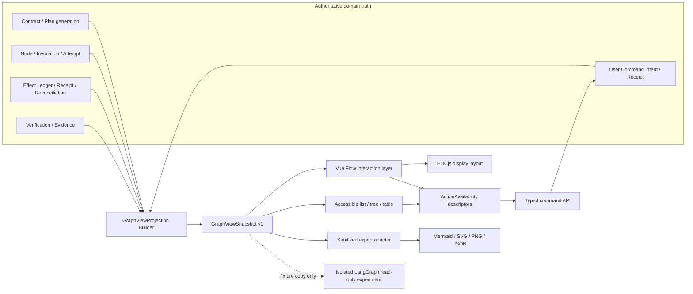

# ADR-014：图可视化与 LangGraph 采用边界

- **Status**：accepted
- **Decision date**：2026-08-16
- **Decision owners**：项目所有者、Runtime 维护者、前端维护者
- **Scope**：多 Agent 核心运行时、Execution Graph 产品界面、图导出与 LangGraph 试验边界
- **Supersedes**：`doc/13` 的早期 D-03，以及 `doc/09` 中未落成文件的“选择 LangGraph”旧 ADR-001 列表项；不影响决策矩阵当前的“身份与版本”ADR-001 候选
- **Related decisions**：DM-013、DM-017、DM-034、DM-036

## 1. 决策摘要

项目采用以下方案：

1. **核心 Runtime 不采用 LangGraph。** 继续由现有领域 Runtime、PostgreSQL 状态与事件、lease/fence、Effect Ledger、receipt、reconciliation、Verification 和用户命令协议承载运行真值。
2. **服务端新增只读 `GraphViewProjection`。** 它从领域真值生成版本化图快照，前端不得从通用事件或颜色自行推导业务状态。
3. **交互图使用 Vue Flow。** 它负责节点/边组件、缩放、平移、选择、折叠、MiniMap 和交互，不拥有调度、恢复或授权语义。
4. **自动布局使用 ELK.js（npm 包 `elkjs`）的 layered 算法。** 服务端提供稳定身份、分组、顺序约束和 `layout_revision`，ELK.js 只计算显示坐标。
5. **Mermaid 仅用于脱敏静态导出。** 导出拓扑、状态摘要和安全标签，可生成 Markdown/SVG/PNG；它不作为产品交互层，也不作为运行真值。
6. **LangGraph 只允许进入隔离、只读、可删除的研究目录。** 试验不得连接生产 Tool Runner、写领域数据库、发审批、持有 checkpoint 真值或成为发布依赖；任何扩大采用范围都必须另立 ADR。

本 ADR 只确认技术边界，不表示 `GraphViewProjection`、Vue Flow、ELK.js 或导出功能已经实现，也不在本次文档更新中加入依赖。

## 2. 背景与问题

用户需要的“可视化”至少包含三种不同需求：

- 产品内查看 Plan、并行分支、handoff、执行状态、Verification、Effect 和待人工处理项；
- 开发者诊断一次任务为何等待、重试、重规划或进入 unknown；
- 把脱敏拓扑导出到 Markdown、报告或评审材料。

LangGraph 是低层 Agent orchestration runtime，官方能力包括 durable execution、persistence、streaming 和 human-in-the-loop；LangSmith Studio 的图模式面向连接 Agent Server/LangSmith deployment 的 Agent 调试。它们解决的是“用 LangGraph 运行并调试 Agent 图”，不等于为任意既有领域 Runtime 提供产品控制面。

本项目已经拥有比普通 Agent graph 更严格的运行语义：

- 数据库 claim、lease、generation 与 fence；
- Tool 外部副作用的 prepare/commit/unknown、receipt 与 reconciliation；
- Plan/Node/Invocation/Attempt 的独立身份；
- Approval、Policy、Verification、Evidence 与恢复 owner；
- 图取消、补偿、跨 API owner、审计和外部 broker 投递证明。

若仅为了看到一张图而引入 LangGraph checkpoint，会同时存在“LangGraph graph/thread/checkpoint”与“领域 Task/Plan generation/Event/Effect”两套身份和恢复状态。出现崩溃、取消、Tool unknown 或重规划时，系统必须决定相信哪一套；这会扩大正确性风险，而不是减少代码。

## 3. 方案对比

| 方案 | 交互可视化 | 与现有 Runtime 一致性 | 恢复真值风险 | 产品控制能力 | 结论 |
| --- | --- | --- | --- | --- | --- |
| LangGraph 作为核心 Runtime + Studio | 有开发调试图 | 需要迁移现有调度/恢复语义 | 高，迁移期易形成双真值 | Studio 不是本项目用户控制面 | 不采用 |
| 保留 Runtime，只把状态镜像成 LangGraph | 能画图 | 需要持续双向/单向映射 | 很高，镜像 checkpoint 易被误用 | 增加一层无必要 Runtime | 禁止 |
| 仅 Mermaid | 有静态图 | 高 | 无 | 交互、筛选、钻取和命令不足 | 只用于导出 |
| 自写 SVG/Canvas 图引擎 | 可定制 | 高 | 无 | 布局、选择、可访问性成本过高 | 不采用 |
| `GraphViewProjection + Vue Flow + ELK.js` | 完整交互图 | 高，图是领域真值的只读投影 | 低 | 能与 typed command/receipt 对接 | 采用 |

选择 Vue Flow 的原因不是它能“运行工作流”，而是它是 Vue 3 的交互图组件，支持自定义节点/边、缩放平移、选择、嵌套图、MiniMap 和 Controls。ELK 只计算节点/边的位置，layered 算法适合具有方向、并行分支、join、端口和复合节点的图。两者职责可以与领域 Runtime 清楚分离。

## 4. 目标架构



关键方向只有两条：

- 领域真值向图投影单向流动；
- 用户操作通过服务端下发的 `ActionAvailability` 和强类型命令 API 回到领域 Runtime。

前端拖动节点、折叠分组、改变布局或切换图层，不能修改 Plan、Node lifecycle、Effect、Verification 或 Approval。

## 5. `GraphViewProjection` 合同

### 5.1 快照头

```text
GraphViewSnapshot
  schema_version              = "deskpilot.graph-view.v1"
  task_id
  task_revision
  contract_version
  plan_generation
  plan_manifest_digest_ref
  view_kind                   = definition | execution | effects | verification | attention
  as_of_event_sequence
  projection_revision
  layout_revision
  freshness                   = current | stale | rebuilding
  generated_at
  nodes[]
  edges[]
  groups[]
  attention_refs[]
  available_action_refs[]
```

`projection_revision` 用于缓存、增量刷新和命令预条件；`layout_revision` 只约束显示算法/config，不参与任务完成判断。digest 默认显示短摘要，完整值的复制与导出服从角色和隐私策略。

### 5.2 节点

```text
GraphViewNode
  graph_node_id               # 投影内稳定显示 ID
  subject_ref                 # type + id + version/generation/attempt
  kind                        # plan/node/invocation/tool/verification/repair/group
  safe_label
  lifecycle
  control
  outcome
  effect_risk
  verification
  certainty
  attention
  attempt_count
  waiting_reason_code
  budget_projection
  evidence_summary
  badges[]
  action_refs[]
  visibility
```

`graph_node_id` 不能替代领域身份；一次 replan 后同名节点必须通过 `subject_ref.plan_generation` 区分。`safe_label` 只能来自服务端 allowlist/脱敏器，禁止直接放入 prompt、model response、Memory 原文、绝对路径、凭据、命令行或第三方 HTML。

### 5.3 边

```text
GraphViewEdge
  edge_id
  source_graph_node_id
  target_graph_node_id
  kind                        # dependency/handoff/tool-child/verification/repair/replan/causal
  requirement                 # all/any/condition/manual
  status                      # pending/satisfied/blocked/rejected/superseded
  safe_label
  subject_ref
```

线性时间相邻不自动成为 causal edge。handoff、verification、repair 和 replan 必须引用真实 lineage；UI 不根据时间戳猜父子关系。

## 6. 五层图，而不是一张无限膨胀的图

| 图层 | 默认展示 | 主要内容 |
| --- | --- | --- |
| Definition | 是 | Contract acceptance、Plan generation、节点、依赖、join、受信条件 |
| Execution | 是 | ready/claimed/running/waiting/terminal、Invocation、attempt count、预算 |
| Effect | 风险或异常时 | Tool call、Approval、Effect Ledger、receipt、unknown、compensation |
| Verification | 是 | Claim、Evidence、Verifier outcome、repair/replan lineage |
| Attention/Recovery | 有未决项时 | clarification、approval、reconciliation、stale、manual disposition |

默认视图聚合重复 attempt 和已完成低风险 Tool；用户钻取后再加载明细。大型图先按 subgraph/agent/plan generation 折叠，再分页或按邻域展开，不能通过无限 DOM 节点假装支持任意规模。

## 7. 布局、刷新与一致性

### 7.1 布局

- 服务端拥有节点/边身份、分组、拓扑顺序提示和 `layout_revision`；
- 前端使用固定版本 ELK.js 和固定 config 计算坐标，首选 left-to-right layered + orthogonal routing；
- 用户拖动/固定位置属于个人展示偏好，单独存储，不能写回领域图；
- 重规划时保留未变 `subject_ref` 的位置，新增 generation 进入新分组；
- 可复现导出必须记录 projection/layout schema 和配置版本。

### 7.2 刷新

首屏读取完整快照。WebSocket 可以发送“新 `projection_revision` 可用”通知，或发送带 `base_revision`/`target_revision` 的有界 patch；revision 不连续时必须重新拉取完整快照。前端不得仅靠漏失或乱序的 WebSocket 事件长期维护业务真值。

`freshness != current` 时图仍可查看，但所有有副作用命令必须禁用或由服务端重新校验最新 revision。即使 UI 显示可用，命令 API 也必须再次检查 revision、generation、preview digest、policy、approval 和 idempotency key。

## 8. 产品可用性、安全与可访问性

- 图视图必须同步提供 list/tree/table 视图；屏幕阅读器和只用键盘的用户不能被迫操作画布。
- 状态不能只靠颜色表达；节点同时显示文本、图标和原因码。
- 普通视图显示人类可理解的安全摘要；ID、digest、fence、attempt lineage 放在高级诊断层。
- 图标签、tooltip 和导出统一经过文本转义、长度限制和数据分类策略；第三方内容不能作为 HTML 注入。
- JSON/Mermaid/SVG/PNG 导出走服务端授权与审计；默认只导出 `safe_label` 和安全摘要。
- “Agent 正在思考”、虚假百分比或无证据的完成动画禁止进入投影。

## 9. 测试与验收

实现进入阶段 69-U2 时至少需要：

1. projection schema/版本/反序列化契约测试；
2. Plan generation、attempt、handoff、join、repair/replan 的 identity/lineage 测试；
3. lifecycle/control/outcome/effect/verification 正交映射与 golden snapshot；
4. Tool unknown、cancel pending、stale projection 和 revision gap 的故障测试；
5. ActionAvailability 与命令 API 双重校验，证明拖图/伪造前端状态不能触发动作；
6. ELK 固定配置的布局稳定性与大图折叠测试；
7. 标签注入、敏感文本、绝对路径、凭据和 Prompt 不泄漏测试；
8. 键盘导航、焦点、非颜色状态、list/tree 等价信息的可访问性测试；
9. Mermaid/JSON 导出与快照 `projection_revision`/digest 的一致性测试；
10. 证明投影可从领域真值重建，删除投影缓存不影响任务恢复。

## 10. LangGraph 的隔离试验规则

只有在验证某个明确问题时才允许建立 `experiments/langgraph_readonly/`，并同时满足：

- 输入只能是脱敏 fixture 或 `GraphViewSnapshot` 副本；
- 无生产数据库写权限、无 Tool Runner/MCP credential、无审批签发能力；
- checkpoint 可随目录删除，不能用于恢复正式 Task；
- 不进入默认 `pyproject.toml`/锁文件、发布包或 CI 必需路径；
- 试验结论必须比较现有 Runtime，而不是以“能跑一个 demo graph”作为迁移依据。

只有出现以下全部证据，才可另立 ADR 重新评估核心采用：

1. 能无损表达 Task/Plan generation/Node/Invocation/Attempt 身份；
2. 能与 lease/fence、Effect Ledger、unknown/reconciliation、Approval、Verification 共用一个真值；
3. 崩溃注入、取消、重规划和外部副作用测试不弱于当前 Runtime；
4. 有明确迁移、双写禁止、回滚和旧任务恢复方案；
5. 可视化收益无法由只读 projection 以更低风险取得。

## 11. 实施顺序

| 子阶段 | 产物 | 完成门 |
| --- | --- | --- |
| 69-U2a | `GraphViewSnapshot v1`、Projection Builder、快照 API | 可从领域真值重建；无前端推理状态 |
| 69-U2b | Vue Flow + ELK.js、同步 list/tree | 交互与可访问视图信息等价 |
| 69-U2c | Effect/Verification/Attention overlays、typed actions | stale/伪造状态不能触发命令 |
| 69-U2d | 脱敏 Mermaid/JSON/SVG/PNG 导出 | 导出可审计且不含正文/凭据 |
| 独立试验 | 可选 LangGraph 只读比较 | 不阻塞主线、不进入发布依赖 |

阶段 67 的脱敏 OpenTelemetry/显式版本化黄金回归门禁和阶段 68 Agent Contract/Registry 已完成；当前工程断点为阶段 69 Task Contract/Plan Compiler。本 ADR 仍只确认图可视化边界，具体 `69-U2` 实现不得冒充通用任务 Runtime 已完成。

## 12. 后果

### 正面

- 用户得到真正可交互、可筛选、可钻取的产品图，而不是只看到开发框架调试器；
- Runtime、UI 和导出各自只有一个清楚职责；
- 不引入第二 checkpoint/线程/节点身份，现有安全与恢复证明继续有效；
- Vue 现有前端可以渐进接入，无需迁移整个后端执行器；
- Mermaid 仍能满足文档、评审和报告分享。

### 代价

- 需要自行定义并长期维护 `GraphViewProjection` 合同；
- 需要把多个领域状态正确映射为节点/边与分层视图；
- Vue Flow、ELK.js 和可访问 list/tree 都要做契约与视觉测试；
- 不能直接借用 LangSmith Studio 作为最终产品 UI。

这些代价属于本项目本来就必须承担的领域可解释性成本。把它们藏进 LangGraph 并不会消失，只会让边界更难验证。

## 13. 官方参考

- [LangGraph overview](https://docs.langchain.com/oss/python/langgraph/overview)：其定位是低层 orchestration runtime，提供 durable execution、streaming 和 human-in-the-loop。
- [LangGraph persistence](https://docs.langchain.com/oss/python/langgraph/persistence)：checkpoint、thread 与 graph state 的持久化语义。
- [LangSmith Studio](https://docs.langchain.com/langsmith/studio)：Studio 连接 Agent Server/LangSmith deployment 并提供 graph mode，适合 Agent 开发调试。
- [Vue Flow](https://vueflow.dev/)：Vue 3 交互图、可定制节点/边、缩放平移、嵌套图、MiniMap 与 Controls。
- [Eclipse ELK Layered](https://eclipse.dev/elk/reference/algorithms/org-eclipse-elk-layered.html)：分层布局、方向化边、正交路由、端口与 compound graph 支持。
- [Mermaid Flowcharts](https://mermaid.js.org/syntax/flowchart)：文本定义节点、边和 subgraph，适合静态图与文档导出。
