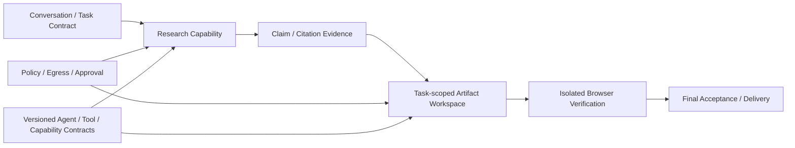

# ADR-015：通用任务 Agent 产品边界与首个纵向切片

- 状态：`accepted`
- 日期：2026-08-16
- 决策：DM-037 / D9-01
- 相关阶段：69～75
- 详细设计：[《通用对话、联网研究与 Artifact 工作区总体架构》](通用对话联网研究与Artifact工作区总体架构.md)

## Context

DeskPilot 已经积累了 Policy/Approval、持久 Tool ledger、受信 DAG、Windows 隔离、恢复、审计、评测、脱敏遥测和冻结 Agent Registry。这些资产使副作用执行的工程底座较强，但用户真正能完成的任务仍很窄：当前执行工具主要是磁盘查询和文件移动，通用自由文本最终仍会被约束到固定磁盘工具；联网查询、本地 Artifact 创建、HTML 预览验收和完整多轮 Agent Runtime 尚未落地。

如果继续严格按“先把所有多 Agent、记忆、压缩、安全底座完成，最后再增加业务能力”的路线推进，项目会长期停留在“架构很强，但用户任务能力很窄”的状态，也无法用真实任务检验底座设计是否合理。反过来，直接开放任意 Shell、代码执行、用户目录写入或已登录浏览器，又会破坏已经建立的权限、恢复和审计边界。

因此需要接受一项产品级决策，并据此重排阶段 69 之后的实施顺序。

## Decision

1. DeskPilot 的产品目标正式定义为“本地优先、能力可声明、过程可检查、结果可验证的通用任务 Agent”，而不是只操作本地文件的窄任务执行器。
2. “本地优先”不等于“本地限定”：允许受控 Web Search、Page Read 和云端模型，但网络、数据出境、来源和 Provider 都必须显式记录并受 Policy/Egress Gate 约束。
3. 首个真实可发布纵向切片固定为 `research_to_html`：对话澄清目标 → 联网研究 → Claim/Citation → Task Workspace 中生成 HTML → 隔离浏览器渲染 → 独立最终验收 → 交付来源、截图和可编辑 Artifact。
4. 该切片通过版本化 Capability Pack 提供能力；第一版不开放任意 Shell、动态 Python、任意包安装、用户目录任意写入或登录态浏览器操作。
5. Artifact 先生成在单 Task 工作区，所有修改有不可变 Revision 和 PatchReceipt；导出或覆盖用户文件是独立命令与审批，不因“用户要求制作网页”而获得无限文件权限。
6. 外部网页、搜索摘要、MCP 输出和 Artifact 正文始终是不可信数据，不能修改 Agent Contract、Task Contract、Policy、授权或 active 长期记忆。
7. Browser Verifier 使用无登录、默认断网的新 BrowserContext。生成文件、模型自报、页面看起来正常，任何一项都不能单独构成任务成功。
8. 阶段 69～75 重排为：合同与对话基础 → Invocation 与只读研究 → Verification + Artifact + Browser 纵向闭环 → 工作记忆 → 长期记忆 → 压缩 → 对抗发布门禁。
9. 阶段 71 成为首个通用用户价值门；阶段 70 的未验证研究结果只能标记为 `awaiting_verification`，不得提前宣传为已完成通用 Agent。
10. ADR-015 只接受产品方向和首个纵向切片。D9 的具体数据模型、HTML profile、来源数量、风险参数等仍需后续 ADR/参数确认。

## Architecture consequence

现有领域 Runtime、PostgreSQL 真值、Effect/Tool ledger、Policy/Approval 和独立验证方向继续保留。通用能力通过新合同挂载到这些边界上，不引入第二套编排真值。

## Alternatives considered

### 继续先做完整底座，最后做通用任务

拒绝。这样无法在近期证明用户价值，也无法用真实联网与产物任务暴露设计错误。记忆和压缩并不是联网研究或 HTML Artifact 的前置条件。

### 直接演进为任意代码/终端 Agent

拒绝作为第一步。它会同时引入任意文件写入、依赖供应链、命令注入、进程隔离和不可逆副作用，无法复用当前精确 Tool Contract 的优势。

### 只使用模型原生 Web Search，直接输出答案

拒绝作为领域架构。可以作为 Search Adapter，但必须归一化为可持久化、可验证的 SearchCall/PageSnapshot/Claim/Citation，否则 Provider 隐藏行为会成为事实真值。

### 先做普通聊天 UI，再逐步补执行

拒绝。只有消息流而没有 Task/Amendment、证据和 Artifact 真值，会形成另一个无法恢复、无法验收的“聊天即状态”系统。

### 直接修改用户项目并在真实浏览器中打开

拒绝作为首个切片。先使用 Task Workspace 和隔离 Browser Verifier，将生成、验收与导出风险拆开。

## Consequences

正面影响：

- 项目从阶段 69 开始同时积累架构证据和真实用户价值；
- 首个切片可完整检验 Agent Contract、Plan Compiler、Handoff、联网、证据、Artifact、Verifier、恢复和 UI 投影；
- Capability Pack 比任意 Shell 更慢扩展，但每次扩展都有明确权限和验收边界；
- 任务产物可查看、可编辑、可回滚，比只返回一段对话更适合作品演示和真实使用。

代价与风险：

- 阶段 69～71 范围增大，旧的阶段 67～74 总体进度估算必须下调；
- 引入 SSRF、间接 Prompt Injection、版权/来源、HTML 注入和浏览器隔离等新威胁；
- Search Provider、Page Reader、Artifact Store 与 Browser Verifier 增加新的故障和版本矩阵；
- 静态 HTML v1 有意限制交互能力，后续要通过新 profile 扩展，而不是偷偷放宽。

## Verification

只有同时满足以下条件，`research_to_html` 才能作为已完成纵向切片：

1. 自由对话能形成并修订版本化 Task Contract；
2. 至少一次真实 Web Search 和 Page Read 形成持久 SearchCall/PageSnapshot；
3. 主要事实具备 Claim 级 CitationEvidence，错误或缺失引用会阻止成功；
4. HTML 只在绑定 Task Workspace 中通过受控 Patch 产生，并可在重启后对账；
5. 路径逃逸、符号链接、配额超限和未授权文件类型均 fail closed；
6. 浏览器验收使用无登录新 Context，默认阻断外部网络，并产出截图/错误/网络证据；
7. 网页 Prompt Injection、SSRF、远程资源和恶意 HTML 对抗用例通过；
8. Builder/Research Agent 自报成功不能绕过独立 VerificationRun；
9. 用户能看到来源、限制、Artifact revision、预览与导出风险；
10. CI 使用显式版本化基线 compare，不能在失败时静默重录。

## Rollout and rollback

- 阶段 69 只落合同和只读投影，不开放未实现 Capability；
- 阶段 70 的联网研究默认 feature flag，输出保持 `awaiting_verification`；
- 阶段 71 仅为 `research_to_html` 打开受控工作区和隔离浏览器；
- 若联网或 Artifact 子系统出现安全/恢复回归，可关闭对应 Capability Pack，现有磁盘/文件任务继续工作；
- 回滚不得删除已产生的 SearchCall、PageSnapshot、ArtifactRevision、VerificationRun 或审计血缘。

## Open parameters

- HTML v1 是否允许受限内联 JavaScript；当前建议默认禁止；
- 默认最少来源数、来源多样性和 freshness 阈值；
- 首个 Search Adapter 与 Page extraction 实现选择；
- Task Workspace 默认配额、保留期和导出冲突策略；
- Browser engine/viewport/a11y 规则与截图基线参数。
