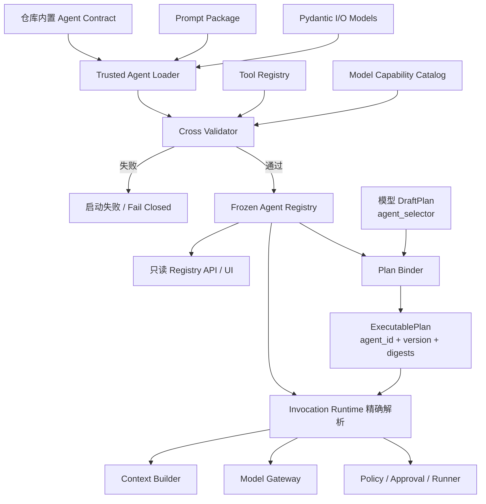
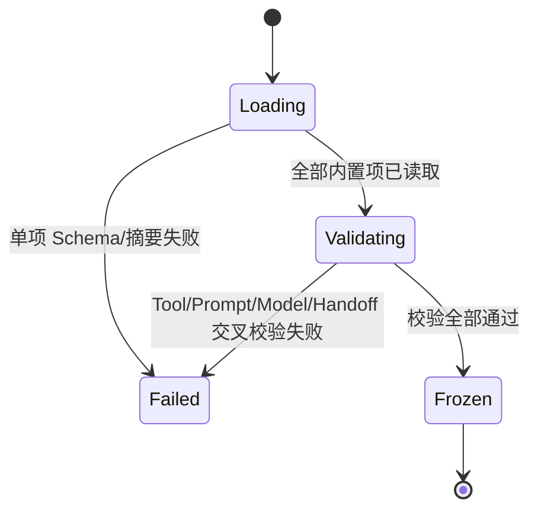
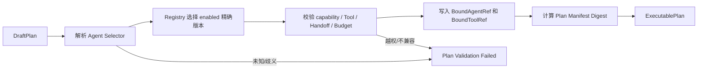

# Agent Contract 与 Agent Registry 技术设计

## 1. 文档定位

本文细化[《多 Agent 系统总体架构》](多Agent系统总体架构.md)中的 Agent 定义、发现、版本绑定和权限上限，作为[《多 Agent 运行时、记忆与验证实施路线》](多Agent运行时记忆与验证实施路线.md)阶段 68 的设计基线。

本文是设计文档。阶段 68 已完成固定 Agent Contract、严格 Prompt Loader、冻结 Registry、脱敏 Descriptor API 和精确 Binder；但持久 Executable Plan、Agent Invocation/Handoff 仍未实现。阶段 67/68 已完成，当前工程断点进入阶段 69 Task Contract/Plan Compiler。

## 2. 核心结论

1. `AgentContract` 是不可变、数据化、可摘要的能力与限制声明，不是具体操作授权。
2. `AgentRegistry` 只负责受信加载、交叉校验、冻结、精确解析和公开投影，不执行 Agent，也不调度任务。
3. 模型产生的 `DraftPlan` 只能携带不可信 `agent_selector`；受信 `PlanBinder` 才能绑定精确版本和 digest，生成 `ExecutablePlan`。
4. 运行时只允许精确解析 `agent_id@version+contract_digest`，不能使用 `latest`、模糊版本或静默升级。
5. Agent 权限只能逐层收紧。Agent Contract、Plan、Task Contract、Policy 和 Runner 中任一层拒绝，调用即拒绝。
6. `Supervisor` 是确定性的 Task Runtime 控制组件，不注册为普通 Agent；需要模型汇总时使用独立 `task_synthesizer` Agent。
7. Agent Contract 只能保证身份、边界、Schema、预算和来源可追踪，不能保证业务结论正确；正确性仍由 Evidence 和 Verifier 证明。
8. 阶段 68 只实现仓库内置、只读、启动时冻结的 Registry，不开放动态 Agent、用户上传 prompt、Python、命令或第三方包。

## 3. 组件边界

| 组件 | 负责 | 明确不负责 |
| --- | --- | --- |
| `AgentContract` | 身份、版本、能力标签、Prompt 引用、I/O Schema、工具/Handoff/数据/模型/预算上限 | 不授权一次具体 Tool 调用，不保存运行状态 |
| `AgentRegistration` | Contract、Pydantic I/O 模型和 Prompt Package 的受信运行绑定 | 不表示一次实际运行 |
| `AgentDescriptor` | Registry API/UI 的脱敏公开投影 | 不暴露完整 system prompt、few-shot、内部路径或凭据 |
| `AgentRegistry` | 注册、校验、冻结、精确解析、状态和快照 | 不执行模型、不构造上下文、不做调度 |
| `PlanBinder` | 把 DraftPlan 中的选择器绑定为精确可信引用 | 不扩大 Contract 权限，不执行计划 |
| `AgentInvocation` | 阶段 69 的一次持久化运行实例 | 不属于阶段 68 实现范围 |
| `Policy/Runner` | 对精确 Tool 请求做最终授权和隔离执行 | 不信任 Agent 自述能力 |
| `Verifier` | 验证 Claim、Artifact、Evidence 与任务目标 | 不因 Schema 合法就判定业务正确 |

## 4. 总体关系图



## 5. 正式对象模型

### 5.1 AgentContract

`AgentContract` 是纯数据对象，使用 `extra="forbid"`、`frozen=True` 和规范 JSON 摘要。它不得包含 callable、import path、命令、凭据、Provider API Key 或运行时可变状态。

建议由以下子模型组成：

| 子模型 | 关键字段 | 说明 |
| --- | --- | --- |
| `AgentIdentity` | `schema_version`、`agent_id`、`version`、`kind`、`display_name`、`description` | `agent_id` 使用稳定命名空间；版本使用 SemVer |
| `AgentCapabilityDescriptor` | `provides` | 只用于 Planner 路由和 UI，不是授权 |
| `PromptPackageRef` | `package_id`、`version`、`renderer_version`、`digest` | 完整绑定实际 Prompt 资源 |
| `AgentIOContract` | `input_schema`、`output_schema` | 必须与注册的 Pydantic 模型逐字典结构一致 |
| `AgentToolPolicy` | `max_risk_level`、精确 `ToolGrant`、每工具调用上限 | 只能声明上限，实际调用仍经 Policy/Runner |
| `AgentHandoffPolicy` | `may_delegate_to`、`may_receive_from`、数量/深度上限 | Handoff 始终由 Supervisor 持久化中介 |
| `AgentModelPolicy` | `role`、capability requirements、允许 location/privacy | 声明模型要求，通常不硬编码具体 Provider |
| `AgentContextPolicy` | 允许的 context source、数据分类、memory/RAG scope | 阶段 68 首批 Agent 的 memory write 必须为空 |
| `InvocationBudgetPolicy` | model/tool/token/time/cost/retry/handoff 上限 | Plan 和请求只能进一步降低 |
| `AgentResultPolicy` | required Evidence 类型、Citation 要求、是否允许无引用 Claim | 只是输出验收前置条件，不替代 Verifier |

### 5.2 AgentRegistration

`AgentRegistration` 是仅由受信应用组合代码创建的运行绑定：

```python
@dataclass(frozen=True, slots=True)
class AgentRegistration:
    contract: AgentContract
    input_model: type[BaseModel]
    output_model: type[BaseModel]
    prompt_package: PromptPackage
    source: AgentSource
```

Registry 注册时必须验证：

- Contract I/O Schema 与 Pydantic 模型一致；
- Prompt Package 的实际内容摘要与 Contract 引用一致；
- Prompt 变量均在输入/上下文允许集合内；
- 所有 Tool 引用存在且 Contract digest 一致；
- Model Gateway 至少存在满足要求的候选路由，否则 Agent 不得为 `enabled`；
- 同一 `agent_id@version` 不能注册第二次。

### 5.3 AgentDescriptor

`AgentDescriptor` 用于只读 API/UI，建议只公开：

- ID、版本、kind、显示名、描述、Contract digest；
- capability 标签；
- 精确 Tool 名称/版本、风险上限和调用上限；
- Handoff 边、模型能力/location/privacy 要求；
- I/O Schema 或其公开摘要；
- 预算上限；
- Registry 状态、来源和弃用信息；
- Prompt Package ID、版本和 digest，但不公开完整 Prompt 内容。

### 5.4 AgentInvocation

`AgentInvocation` 是阶段 69 对 Agent Contract 的一次实例化，包含 task/step、精确 Agent 引用、resolved model identity、attempt、预算消耗、context digest、状态和 trace ID。Contract 与 Invocation 必须分开，不能把运行状态写回 Registry。

## 6. Contract 示例

以下 YAML 仅展示序列化形态，最终实现建议继续使用 Pydantic 生成 JSON Schema，并使用项目现有 canonical JSON digest 规则。

```yaml
schema_version: deskpilot.agent_contract.v1

agent_id: builtin.computer_observer
version: 1.0.0
kind: worker
display_name: Computer Observer
description: 读取并解释本机只读状态

provides:
  - computer.metadata.read
  - computer.disk.inspect

prompt_package:
  package_id: builtin.computer_observer
  version: 1.0.0
  renderer_version: 1
  digest: "<sha256>"

input_schema: {}
output_schema: {}

tool_policy:
  max_risk_level: R0
  grants:
    - name: computer.disk_usage
      version: 1.0.0
      contract_digest: "<sha256>"
      max_calls: 2

handoff_policy:
  may_delegate_to: []
  may_receive_from:
    - agent_id: builtin.task_synthesizer
      version: 1.0.0
  max_outgoing_handoffs: 0

model_policy:
  role: tool_agent
  allowed_locations:
    - local
    - cloud
  allowed_privacy_modes:
    - local_only
    - local_preferred
    - balanced
  requirements:
    structured_output: true
    strict_json_schema: true
    min_context_tokens: 8192

context_policy:
  allowed_sources:
    - task_contract
    - upstream_artifact
    - tool_evidence
  memory_read_scopes: []
  memory_write_scopes: []
  rag_collections: []

budget_policy:
  max_model_calls: 2
  max_tool_calls: 2
  max_input_tokens: 20000
  max_output_tokens: 4000
  max_wall_seconds: 60
  max_retries: 1
  max_cost_micros: 100000

result_policy:
  required_evidence:
    - tool_receipt
  require_citations: false
  allow_unreferenced_claims: false
```

## 7. 权限收敛规则

Agent Contract 不是 Policy grant。一次 Tool 调用的有效权限必须是下列集合的交集：

```text
Agent Contract Tool 上限
∩ Bound Plan 节点限制
∩ Task Contract 数据/风险/预算限制
∩ 当前 Policy Engine 决策
∩ User Approval 的精确绑定范围
∩ Runner 已注册 Tool/Contract/Capability
```

必须满足：

- 任何一层都只能收紧，不能扩大上一层；
- Agent prompt 中“我可以使用某工具”的文本没有授权效力；
- 用户审批只批准当前 Policy 允许进入审批态的精确动作，不能给未列入 Agent Contract 的 Tool 补权；
- Tool 名称相同但版本或 digest 不同，视为不同工具并拒绝；
- Agent capability 标签不能转换为 Runner capability grant；
- Context、Memory 和 RAG 的访问也使用相同的逐层求交原则。

## 8. Prompt Package

本节定义 Package 的注册与内容寻址边界；manifest、variant、Renderer、RenderedPromptManifest 和 Model Loop 接线的候选详细设计见[《Agent Model Loop 与 Prompt Package 技术设计》](Agent-Model-Loop与Prompt-Package技术设计.md)。

Prompt Package 是独立、只读、内容寻址的资源包，建议包含：

- system instruction；
- 允许的模板及模板变量清单；
- 可选 few-shot 样例；
- output formatting instruction；
- package manifest；
- renderer version。

摘要必须覆盖 manifest、全部被引用文件的相对路径、文件内容和 renderer version。加载器必须拒绝：

- 越出受信资源根目录的路径；
- 符号链接逃逸；
- manifest 未声明的隐式文件；
- 未知模板变量；
- 凭据、API Key 或运行环境秘密；
- 同版本内容漂移。

阶段 68 不需要第三方签名体系。因为 Profile 只来自仓库受信组合，canonical digest 足以发现漂移；第三方 Agent 开放前再引入发布者身份、签名和撤销链。

## 9. Agent Registry

### 9.1 Registry 生命周期



Registry 在 `Frozen` 后不允许进程内注册、替换或删除。配置变更必须经过受信配置更新和进程重启，避免运行中目录与持久化 Plan 发生竞态。

### 9.2 最小接口

```python
class AgentRegistry:
    def register(...): ...
    def freeze(tool_registry, model_catalog): ...
    def resolve_exact(agent_id, version): ...
    def resolve_preferred(agent_id): ...
    def list_public(): ...
    def snapshot(): ...
```

约束：

- `resolve_preferred()` 只能被受信 Plan Binder 在编译阶段调用；
- Runtime/Resume 只能使用 `resolve_exact()` 并复核 Contract/Prompt digest；
- Agent 自己不能查询完整 Registry 后自由选择同伴；
- Registry snapshot 用于审计和复现，不作为所有旧计划的全局失效开关。

如果只因新增一个无关 Agent 就让所有旧 Plan 失效，会制造不必要的恢复故障。因此 `ExecutablePlan` 应绑定实际引用项的 digest；`registry_snapshot_id` 仅记录当时视图。

### 9.3 状态语义

Registry 状态是独立的版本化配置，不进入 Agent Contract digest：

| 状态 | 新 Plan | 新 Invocation | 旧 Plan 恢复 | 说明 |
| --- | --- | --- | --- | --- |
| `enabled` | 允许 | 允许 | 允许 | 正常状态 |
| `deprecated` | 不自动选择 | 精确旧 Plan 可允许 | 允许 | 为迁移保留旧版本 |
| `disabled` | 拒绝 | 拒绝 | 拒绝创建新 attempt | 管理停用 |
| `revoked` | 拒绝 | 拒绝 | 拒绝 | 安全撤销，优先级最高 |

已经下发到 Runner 的 Tool 是否发生副作用，仍由 Tool ledger、commit boundary 和 receipt 判定；Registry 状态不能伪造“尚未执行”。

## 10. DraftPlan 到 ExecutablePlan

当前模型计划中的 `PlanStep.agent` 只是普通字符串。阶段 68 不应把 digest 字段直接加入模型输出并宣称可信，而应分成两种模型。

完整的 Task Contract version、Draft/Bound/Executable Plan、Compiler 分层校验、acceptance coverage、原子激活与 Replan generation 见[《Task Contract、DraftPlan 与 ExecutablePlan Compiler 技术设计》](Task-Contract与ExecutablePlan-Compiler技术设计.md)。本节只定义 Agent Registry 参与精确绑定的边界。

### 10.1 不可信 DraftPlan

```json
{
  "step_id": "inspect_disk",
  "agent_selector": "builtin.computer_observer",
  "tool_selector": "computer.disk_usage"
}
```

### 10.2 受信 BoundAgentRef

```json
{
  "agent_id": "builtin.computer_observer",
  "version": "1.0.0",
  "contract_digest": "<sha256>",
  "prompt_package_digest": "<sha256>"
}
```

### 10.3 Plan Binder 流程



模型不得提供或覆盖可信 digest。即使模型输出了相同字段，Plan Binder 也必须忽略或拒绝，而不是接受模型值。

## 11. Handoff 边界

计划 DAG 的数据依赖与 Agent 自主委派不是同一件事：

- 计划内依赖：Supervisor 根据已验证 ExecutablePlan 把上游 Artifact/Evidence 引用交给下游；
- Agent 委派请求：Agent 只能提交结构化 proposal，Supervisor 根据 Contract、Plan 和预算决定是否创建 Handoff；
- Agent 之间不存在绕过 Supervisor 的自由聊天通道；
- `may_delegate_to` 是最大允许集合，不代表目标一定会执行；
- 目标 Agent 还必须通过 `may_receive_from`、输入 Schema、数据权限和预算校验；
- 阶段 68 只验证 Handoff 图，不执行真实 Handoff。

首版建议禁止 Contract Handoff 图中的环。需要修复或重规划时，统一进入有界 Retry/Replan Gate，不通过 Agent A→B→A 的隐式递归实现。

## 12. 首批内置 Agent

不把 `supervisor` 注册为 Agent。首批建议如下：

| Agent | 类型 | 允许能力 | 输出约束 |
| --- | --- | --- | --- |
| `builtin.computer_observer@1.0.0` | worker | 精确只读计算机信息 Tool | 每个事实引用 Tool receipt/Evidence |
| `builtin.knowledge_researcher@1.0.0` | worker | 受控知识检索，不执行 OS 副作用 | 每个外部知识 Claim 引用 Citation |
| `builtin.task_synthesizer@1.0.0` | synthesizer | 默认无 Tool，只读取已验证上游 Artifact/Evidence | 不新增无 Evidence 事实，保留 partial/limitation |

真正的 Supervisor 继续属于 `Task Runtime / Reducer`。阶段 70 再增加独立 Verifier Contract；Verifier 的选择由受信 Verification Policy 决定，不能由执行 Agent 自己指定。

`computer`、`knowledge` 这类过宽 ID 也不适合作为长期稳定身份。使用 `computer_observer`、`knowledge_researcher` 能避免未来在同一身份下不断扩大权限。

## 13. 只读 API/UI

阶段 68 建议提供：

```text
GET /api/v1/agents
GET /api/v1/agents/{agent_id}/versions/{version}
GET /api/v1/agents/registry-snapshot
```

不提供 POST、PUT、PATCH、DELETE。列表支持按状态、kind、capability 过滤，但所有选择结果最终仍须由 Plan Binder 精确绑定。

UI 重点展示：

- Agent ID、版本、状态和 digest；
- 能力标签与“标签不是授权”的提示；
- Tool 白名单、风险和调用上限；
- Handoff 边；
- 模型 location/privacy/capability 要求；
- Context/Memory/RAG 权限；
- Invocation 预算；
- Prompt Package ID/版本/digest；
- 弃用或撤销原因。

## 14. 建议代码落点

阶段 68 实现时建议新增：

```text
backend/src/deskpilot/domain/agent_contracts.py
backend/src/deskpilot/application/agent_registry.py
backend/src/deskpilot/application/plan_binder.py
backend/src/deskpilot/agents/contracts/
backend/src/deskpilot/agents/prompts/
backend/src/deskpilot/api/agent_registry_routes.py
```

不建议立刻引入新的编排框架或单独数据库真值。Agent Registry 首版使用受信启动组合和内存冻结视图；绑定后的 Agent/Prompt/Tool digest 随 ExecutablePlan 持久化。阶段 69 再增加 Invocation/Handoff 表和 reducer。

## 15. 稳定错误分类

建议至少预留：

| 错误码 | 含义 |
| --- | --- |
| `AGENT_NOT_REGISTERED` | 精确 Agent ID/版本不存在 |
| `AGENT_ALREADY_REGISTERED` | 重复注册相同 ID/版本 |
| `AGENT_CONTRACT_INVALID` | Contract Schema 或内部约束失败 |
| `AGENT_CONTRACT_DIGEST_MISMATCH` | 同版本内容或持久化引用漂移 |
| `AGENT_PROMPT_DIGEST_MISMATCH` | Prompt Package 内容漂移 |
| `AGENT_IO_SCHEMA_MISMATCH` | Pydantic 模型与序列化 Schema 不一致 |
| `AGENT_TOOL_NOT_ALLOWED` | Plan/调用引用 Contract 未允许 Tool |
| `AGENT_TOOL_CONTRACT_MISMATCH` | Tool 版本或 digest 不一致 |
| `AGENT_HANDOFF_NOT_ALLOWED` | Handoff 边或方向非法 |
| `AGENT_MODEL_REQUIREMENTS_UNSATISFIED` | 无候选模型满足 location/privacy/capability |
| `AGENT_BUDGET_EXCEEDED` | Plan 或请求超过 Agent 上限 |
| `AGENT_DISABLED` | Agent 被停用 |
| `AGENT_REVOKED` | Agent 被安全撤销 |
| `AGENT_REGISTRY_FROZEN` | 冻结后尝试变更 Registry |

所有公开错误正文继续脱敏；详细加载原因进入受保护审计，不记录完整 Prompt 或任务正文。

## 16. 阶段 68 验收矩阵

必须包含以下测试：

1. 未知 Agent、未知版本和模糊版本被拒绝；
2. 同 ID/版本不同 digest 导致启动失败；
3. Prompt 内容修改但不升级版本导致摘要失败；
4. I/O Pydantic 模型与 Contract Schema 不一致被拒绝；
5. 未知 Tool、错误 Tool 版本和 Tool digest 漂移被拒绝；
6. Contract 风险上限低于 Tool 风险时被拒绝；
7. 非法 Handoff、反向边和首版环路被拒绝；
8. 无模型满足 location/privacy/capability 时 Agent 不可启用；
9. DraftPlan 自带伪造 digest 不会进入 ExecutablePlan；
10. Plan 超过 token/tool/time/retry 预算被本地拒绝；
11. disabled/revoked Agent 不能创建新 Invocation 或恢复；
12. Agent 输出声称拥有额外 Tool 不会改变 allowlist；
13. 用户审批不能给 Contract 未声明 Tool 补权；
14. Registry API 不泄露完整 Prompt、few-shot、内部路径或凭据；
15. 新增无关 Agent 不会使未引用该 Agent 的旧 Plan 失效；
16. 旧 Plan 引用的 Agent/Prompt/Tool digest 漂移时 fail closed。

## 17. 非目标

阶段 68 明确不做：

- 真实 Agent Invocation 和 Handoff 执行；
- Agent 自主发现或选择任意同伴；
- Agent 自我复制、递归生成角色或动态拓扑；
- 用户上传 Agent Contract、Prompt、Python、命令或插件；
- Registry 运行时写 API；
- Agent 市场、第三方签名和远程 Contract 拉取；
- 自动写长期记忆；
- 把 Agent Contract 当作准确性证明；
- 为每个 Agent 强制创建独立进程；
- 用 Agent 多数投票替代 Evidence/Verifier。

## 18. 与后续阶段的接口

| 后续阶段 | 依赖本设计的内容 |
| --- | --- |
| 阶段 69 Handoff/Invocation | `BoundAgentRef`、I/O Schema、Handoff Policy、预算和 Prompt digest |
| 阶段 70 Verifier | `AgentResultPolicy`、Claim/Evidence 约束、独立 Verifier Contract |
| 阶段 71～72 Memory | `AgentContextPolicy` 的 read/write scope 与数据分类上限 |
| 阶段 73 Context Compression | Prompt renderer、ContextManifest、token budget 和输入摘要链 |
| 阶段 75 对抗门禁 | Contract/Prompt/Model/Registry snapshot 分组与漂移回归 |

## 19. 当前确定项与下一轮讨论

本设计建议先固定：

- Supervisor 不是 Agent；
- Contract、Registration、Descriptor、Invocation 分离；
- DraftPlan 与 ExecutablePlan 分离；
- 精确版本和逐项 digest 绑定；
- 权限只取交集；
- Registry 启动冻结、只读公开；
- 首批三个 Agent 为 observer、researcher、synthesizer；
- 阶段 68 不开放动态/第三方 Agent。

仍需在后续技术架构中细化：

1. [HandoffEnvelope、AgentInvocation、AgentResult 的持久化协议和状态机](Agent-Handoff与Invocation-Runtime技术设计.md)；
2. [Context Builder 如何按 Agent Contract 装配 Task、Artifact、Evidence、Memory 和 RAG](Context-Memory-RAG数据平面技术设计.md)；
3. Handoff 的数据最小化、并行 join、冲突和取消传播；
4. [Verifier 如何消费 AgentResult，并区分 retry、repair、replan、needs_user](Claim-Evidence与Verification-Repair技术设计.md)；
5. [Memory/RAG 权限如何在 Context Broker 中实现，而不是只停留在 Contract 字段](Context-Memory-RAG数据平面技术设计.md)。
