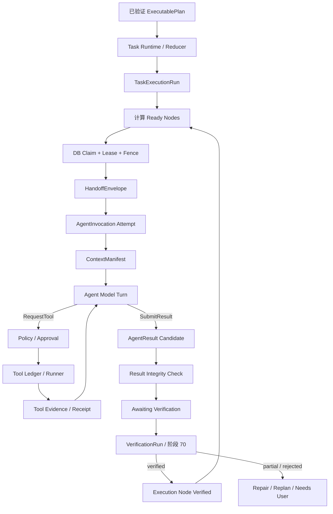
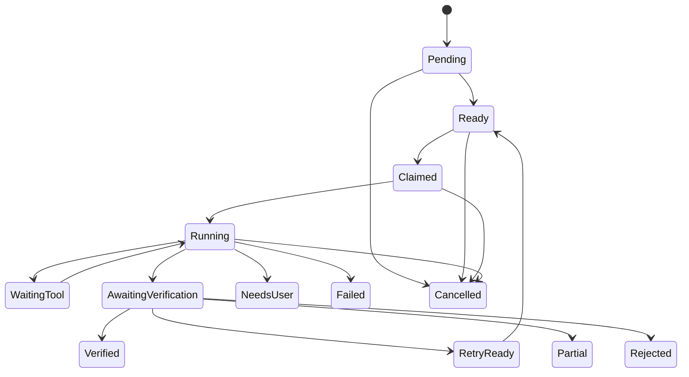

# Agent Handoff、Invocation 与 Result Runtime 技术设计

## 1. 文档定位

本文细化[《多 Agent 系统总体架构》](多Agent系统总体架构.md)中的 Handoff、Agent Invocation、并行 join、取消、恢复和结果提交协议，承接[《Agent Contract 与 Agent Registry 技术设计》](Agent-Contract与Agent-Registry技术设计.md)，作为[《多 Agent 运行时、记忆与验证实施路线》](多Agent运行时记忆与验证实施路线.md)阶段 69 的设计基线。

本文是设计文档，不代表这些模型、表、状态机或 API 已经实现。阶段 67/68 已完成，当前先进入阶段 69 Task Contract/Plan Compiler；本文 Handoff/Invocation Runtime 属于阶段 70，并将先接只读联网研究。

## 2. 核心结论

1. `ExecutablePlan` 是不可变计划定义，`TaskExecutionRun` 是唯一高层运行投影，`ToolEffectGraph` 继续作为副作用子执行账本。
2. Task Runtime/Reducer 是唯一高层协调者；数据库是运行真值，Outbox/Broker 只通知“真值已变化”。
3. Handoff 是 Supervisor 创建的不可变、内容寻址输入清单，不是 Agent 之间的自由聊天消息。
4. Execution Node、Agent Invocation Attempt、Agent Model Turn 必须分层；否则模型重试、Tool 循环、崩溃恢复和 Verifier repair 无法区分。
5. `AgentResult` 只能表示待验证候选结果，不能携带可信 `success=true` 或 `verified=true`。
6. 默认只有匹配的 `VerificationRun` 才能把节点推进到 `verified` 并解锁下游。
7. 阶段 69 的两个并行 Worker 必须停在 `awaiting_verification`；Task Synthesizer 在阶段 70 验证通过后才运行。
8. 外部 Model Provider 与数据库无法构成原子事务。崩溃窗口必须显式记录 `model_call.outcome_unknown`，不能伪造 exactly-once。
9. Agent 的 Tool 请求继续进入现有 Policy → Approval → Tool ledger → Runner → receipt 路径；Agent Runtime 不复制副作用事务语义。
10. 首版使用固定 DAG、固定 Agent、最大并行 3、禁止动态 Handoff 和自主递归。

## 3. 对现有阶段边界的修正

阶段 69 尚无独立 Completion Verification。如果 Computer Observer 和 Knowledge Researcher 提交结果后立即解锁 Task Synthesizer，就会违反“未验证结果不能解锁下游”的总体约束。

因此首个完整演示拆为：

- 阶段 69：两个只读 Worker 并行，分别产生独立 AgentResult，均停在 `awaiting_verification`；
- 阶段 70：Verifier 验证两个结果；只有满足 Edge requirement 的结果才解锁 Task Synthesizer；
- 最终 Task Verifier 通过后才进入 Deliverer。

如果产品希望一次展示完整多 Agent 流程，可以在同一 feature flag 下连续交付阶段 69 和 70，但不能在内部省略验证门。

## 4. 总体运行图



## 5. 单一真值与三类图

系统中会出现三类结构，但不能形成三个竞争的调度器：

| 结构 | 性质 | 真值内容 | 所有者 |
| --- | --- | --- | --- |
| `ExecutablePlan` | 不可变定义 | 节点、依赖、精确 Agent/Tool/digest、预算和验收要求 | Plan Validator/Binder |
| `TaskExecutionRun` | 可变运行投影 | 高层节点状态、attempt、ready、claim、join、取消和预算 | Task Runtime/Reducer |
| `ToolEffectGraph` | 副作用子账本 | Tool prepare/commit/receipt、Saga、补偿、unknown 和资源锁 | 现有 Tool Runtime |

Task Runtime 根据 ExecutablePlan 驱动 TaskExecutionRun。Agent 节点内部提出 Tool 请求时，把精确调用交给 Tool ledger；ToolEffectGraph 的结果以 Evidence/receipt 返回父 Invocation。ToolEffectGraph 不负责决定下一个 Agent，Agent Runtime 也不重写 Tool commit 状态。

现有单一 `TaskCheckpointPayload` 适合当前线性/单执行切片，不适合并行 Invocation；多 Agent 运行状态应使用规范化行、CAS、lease 和 fence，而不是把整个并行图塞入一个加密 JSON snapshot。

## 6. 身份与层级

```text
TaskExecutionRun
  └─ ExecutionNode
       ├─ AgentInvocation attempt 1
       │    ├─ AgentModelTurn 1
       │    ├─ ToolCall 1
       │    ├─ AgentModelTurn 2
       │    └─ AgentResult 1
       └─ AgentInvocation attempt 2
            └─ 新的修复或基础设施重试
```

建议唯一约束：

```text
UNIQUE(task_id, plan_generation)
UNIQUE(run_id, step_id)
UNIQUE(node_id, attempt_no)
UNIQUE(invocation_id, turn_no, model_attempt)
UNIQUE(invocation_id, result_sequence)
```

稳定身份绑定规则：

- `run_id` 绑定 task、plan generation 和 plan digest；
- `node_id` 绑定 run 和 step；
- `invocation_id` 绑定 node 和 attempt；
- `turn_id` 绑定 invocation、turn 和 model attempt；
- `call_id` 绑定 invocation、turn 和 tool index；
- `handoff_id` 绑定目标 invocation attempt；
- 同一稳定身份出现不同 payload digest 时 fail closed。

## 7. TaskExecutionRun

建议字段：

```text
run_id
task_id
plan_generation
plan_digest
status
revision
cancel_requested_at
pause_requested_at
budget_allocated
budget_reserved
budget_settled
budget_uncertain
last_event_seq
created_at
updated_at
```

一次 Replan 必须创建新的 `plan_generation` 和 Plan digest，保留旧 Run/Node/Invocation/Result/Verification 血缘。不能原地修改已运行计划。

`TaskStatus` 继续作为兼容的顶层聚合投影；TaskExecutionRun 和 Node 承担多 Agent 细粒度状态。

## 8. TaskExecutionNode 与 Edge

### 8.1 Node 字段

```text
node_id
run_id
step_id
node_kind
status
revision
attempt_count
max_attempts
claim_owner_id
claim_fencing_token
claim_acquired_at
claim_heartbeat_at
claim_expires_at
last_event_seq
```

### 8.2 Node 状态



禁止使用没有 proof identity 的 `completed` 表示 Agent 节点成功。`AgentResult` 提交后，节点只能进入 `awaiting_verification`。

### 8.3 Edge requirement

每条 Edge 明确声明：

```text
from_node_id
to_node_id
acceptance_requirement
artifact_selector
```

`acceptance_requirement` 建议支持：

- `verified`：默认，只有 verified predecessor 满足；
- `verified_or_partial`：显式允许带缺失项和 limitation 的 partial；
- `terminal_any`：只用于确定性清理/观测节点，不能用于业务成功路径。

Agent 不能修改 Edge requirement。

## 9. HandoffEnvelope

### 9.1 定位

HandoffEnvelope 是 Supervisor 从 ExecutablePlan、Agent Contract、已验证输入和预算中派生的不可变 manifest。它不是 bearer token，也不直接授予 Tool/Memory/RAG 权限。

建议逻辑结构：

```yaml
schema_version: deskpilot.handoff.v1
handoff_id: ...
task_id: ...
run_id: ...
target_node_id: ...

target_agent:
  agent_id: builtin.knowledge_researcher
  version: 1.0.0
  contract_digest: ...

objective_ref: ...
acceptance_criteria: []
constraints: []

input_refs:
  - ref_type: artifact
    ref_id: ...
    digest: ...
    provenance: verified_tool_output
    trust_class: trusted_evidence
    data_classification: local_sensitive

allowed_context_sources: []
effective_tool_scope_digest: ...
output_schema_digest: ...

budget_allocation:
  model_calls: 2
  tool_calls: 1
  input_tokens: 20000
  output_tokens: 4000

deadline_at: ...
parent_invocation_id: null
handoff_digest: ...
```

### 9.2 不允许放入 Handoff

- 完整任务聊天历史；
- 上游 Agent 私有推理或 chain-of-thought；
- 未标记来源和 trust class 的自由文本；
- Approval grant、Runner capability 或可复用权限令牌；
- 凭据、Provider Key 或系统内部秘密；
- 大文档正文；大内容只使用 Artifact/Chunk 引用。

目标、约束等敏感正文进入受保护 payload；普通事件只记录 ID、digest、状态、大小和分类。

### 9.3 Agent 发起委派

Agent 只能提交不可信 `HandoffProposal`。Supervisor 根据 ExecutablePlan、Contract allowlist、预算、深度和 Replan Policy 决定拒绝、请求用户、进入 Replan Gate 或创建真正 Handoff。

阶段 69 完全关闭动态 Handoff，只为已绑定计划节点创建 Envelope。

## 10. AgentInvocation

建议字段：

```text
invocation_id
node_id
attempt_no
agent_id
agent_version
agent_contract_digest
prompt_package_digest
handoff_id
context_manifest_id
execution_status
verification_status
resolved_provider_id
resolved_model
model_route_snapshot_digest
budget_allocated
budget_reserved
budget_settled
budget_uncertain
deadline_at
parent_invocation_id
repair_of_invocation_id
claim_owner_id
claim_fencing_token
created_at
started_at
finished_at
```

执行状态与验证状态必须分开：

| execution status | 含义 |
| --- | --- |
| `created` | Invocation 已持久化但未开始 |
| `running` | 正在执行 Model Turn/Context/本地 reducer |
| `waiting_tool` | 等待 Tool、Approval 或 receipt |
| `result_submitted` | AgentResult 已持久化，执行部分结束 |
| `failed_retryable` | 基础设施/协议失败，可在预算内新建 attempt |
| `failed_terminal` | 不可恢复失败 |
| `cancelled` | 取消已收敛 |
| `expired` | deadline 到期 |

| verification status | 含义 |
| --- | --- |
| `not_requested` | 尚无候选结果 |
| `pending` | Result 等待 VerificationRun |
| `verified` | 匹配的 VerificationRun 通过 |
| `partial` | 只有部分 Claim 通过 |
| `rejected` | 结果不满足节点验收 |

## 11. AgentModelTurn 与 AgentDecision

Prompt Package、Context freeze/delta、Provider route、持久化 Turn reducer、`ModelDispatchAttempt`、ToolObservation、预算和 no-progress 的候选完整设计见[《Agent Model Loop 与 Prompt Package 技术设计》](Agent-Model-Loop与Prompt-Package技术设计.md)。本节保留外层 Invocation/Decision 边界。

每个 Model Turn 必须输出一个严格联合类型：

```text
RequestTool
SubmitResult
NeedsUserInput
CannotComplete
ProposeHandoff    # 阶段 69 禁用
```

即使 Provider 支持原生 tool calling，也要先转换为内部 `AgentDecision`，再进入控制面验证。Provider 不能直接连接 Runner。

`RequestTool` 候选修正为选择 ExecutablePlan 已绑定的 `tool_binding_id`，而不是让模型重新决定 Tool 版本。至少包含：

```text
tool_binding_id
arguments
purpose
expected_evidence
```

Runtime 通过 binding 解析精确 `tool_name`、`tool_version` 和 contract digest；模型自带版本或 digest 没有授权效力。

控制面重新执行：

```text
输入 Schema
→ Agent Contract allowlist
→ Bound Plan 节点限制
→ Task Contract
→ 当前预算
→ Policy
→ Approval
→ Tool ledger / Runner
```

每轮只能产生一种决定；初版每轮最多一个 Tool request。以后若支持并行 Tool request，只允许确定无依赖、只读且资源兼容的集合。

## 12. AgentResult

### 12.1 结果结构

```yaml
schema_version: deskpilot.agent_result.v1
result_id: ...
invocation_id: ...
disposition: candidate

claims:
  - claim_id: c1
    claim_type: observation
    content_ref: ...
    evidence_refs: []
    limitations: []

artifacts: []
citations: []
limitations: []
needs_user: null
untrusted_proposals: []

input_digest: ...
context_digest: ...
model_response_digest: ...
output_schema_digest: ...
result_digest: ...
```

不允许执行 Agent 写入可信 `success`、`verified` 或最终 Task status。

### 12.2 ResultIntegrityCheck

阶段 69 可以做结构和血缘检查，但不能称为业务 Verification：

- 输出 Schema 合法；
- 引用对象存在且 digest 匹配；
- Evidence 属于当前 task/run 且 Agent 有权引用；
- Claim 不引用未来节点或越权数据；
- Artifact 数量、大小和分类在预算内；
- input/context/model/output digest 链完整；
- Result identity 与 Invocation/fence 匹配。

通过后只能进入 `awaiting_verification`。

## 13. 并行、claim 与 join

### 13.1 Node claim

每个 Node 独立 claim。所有 Worker 写入 ModelTurn、Tool 绑定或 AgentResult 时必须匹配：

```text
node_id
+ claim_owner_id
+ claim_fencing_token
+ lease 未过期
+ revision CAS
```

旧 Worker 的迟到结果必须拒绝并记录 `late_result_discarded`，不能覆盖新 owner。

### 13.2 Ready 计算

首版 ExecutablePlan 最多约 20 个节点、每任务最大并行 3，不应立即复制 Tool DAG 的大规模增量 ready projection。建议事务内重新读取前驱状态，并在 PostgreSQL 使用 `FOR UPDATE SKIP LOCKED` claim ready nodes；SQLite 使用现有进程锁和事务串行兼容路径。

规模数据证明需要后，再增加增量 membership/count 投影。

### 13.3 Join

默认只有所有 required predecessor 达到 `verified`，下游才 ready。`partial` 只有在 Edge 明确声明 `verified_or_partial` 时才满足，且 Handoff 必须保留缺失项和 limitation。

Agent model deliberation 可以并行，但实际 Tool 副作用冲突继续由 Tool 层精确资源锁和 Policy 处理。阶段 69 首批 Agent 只读，避免同时引入写冲突语义。

## 14. 外部模型调用的 unknown 边界

一个逻辑 `AgentModelTurn` 下可有多个真实网络级 `ModelDispatchAttempt`；transport retry、Provider fallback 和 Schema repair 必须使用不同 attempt 身份。完整候选状态机见[《Agent Model Loop 与 Prompt Package 技术设计》](Agent-Model-Loop与Prompt-Package技术设计.md)。

跨 Plan、Broker、Scheduler、Model、Tool、Context 和 Verification 的统一 uncertainty/action/owner 矩阵见[《多 Agent 跨层故障与恢复矩阵技术设计》](多Agent跨层故障与恢复矩阵技术设计.md)。

数据库无法与外部 Provider 原子提交。正确流程是：

```text
持久化 ModelTurn dispatch intent
→ 调用 Provider
→ 持久化完整响应/usage/digest
```

`AgentModelTurn` 建议字段：

```text
turn_id
invocation_id
turn_no
model_attempt
request_id
request_digest
status
provider_id
model
response_digest
usage
cost_micros
claim_fencing_token
```

状态：

```text
prepared
dispatching
succeeded
failed
outcome_unknown
```

恢复规则：

- `succeeded`：复用已持久化响应，不再调用 Provider；
- `failed`：根据稳定错误分类和预算决定是否创建新 model attempt；
- `dispatching` 且 lease 过期：转为 `outcome_unknown`；
- `outcome_unknown`：不能复用同一 attempt，也不能假装从未调用；
- 允许恢复时创建新 `model_attempt`，记录可能重复计费；
- 云端 unknown 默认按最大预留成本计入 `budget_uncertain`；
- 本地模型可按配置自动新 attempt；云模型是否自动新 attempt 由预算/隐私策略决定；
- 迟到响应只有 owner/fence/turn status 全匹配才能提交。

严格 exactly-once Model 调用只有在 Provider 提供可验证幂等键或按 request ID 查询结果时才可能提升；系统不能自行宣称。

## 15. 预算预留与结算

预算不是 Agent 可以转授的权限。Task Runtime 维护：

```text
allocated
reserved
settled
released
uncertain
```

外部调用前先预留最大成本/token；成功后按实际 usage 结算并释放余量；outcome unknown 进入 conservative `uncertain`。

必须同时限制：

- Task 最大 Invocation 总数；
- 最大 Handoff 深度；
- 每 Node 最大 attempt；
- 每 Invocation 最大 Model Turn；
- Tool 调用总数；
- input/output/total token；
- 费用；
- wall-clock deadline；
- 每 Task、全局和 Provider 级并发。

子 Invocation 的 allocation 只能由 Supervisor 从 Task 剩余预算中划拨，不能由父 Agent 扩大。

## 16. 取消、暂停、审批与聚合状态

### 16.1 取消

Task 取消事务至少完成：

1. 写 `cancel_requested_at`；
2. pending/ready Node 转为 cancelled；
3. 失效未消费 Approval；
4. 为已 claim Node 写 owner-targeted cancel command；
5. running Model 调用 best-effort cancel；
6. Tool 调用按现有 commit/receipt/unknown 语义收敛。

取消不能伪造已经提交的外部副作用“未发生”。

### 16.2 暂停

暂停后不 claim 新 Node、不启动新 Model Turn；正在执行的 Model/Tool 在安全边界停止。已经持久化的响应、Evidence 和 Result 保留，resume 只从证明一致的状态继续。

### 16.3 并行审批

审批等待首先属于 Node/Invocation。只要还有其他 runnable/running Node，Task 顶层状态保持 `running`，UI 单独显示 `attention_required_count`。只有全部剩余路径都被审批或用户输入阻塞时，Task 才投影为 `waiting_approval`/`needs_user`。

## 17. 建议数据库表

阶段 69 首版建议新增：

```text
task_execution_runs
task_execution_nodes
task_execution_edges
agent_handoffs
agent_invocations
agent_model_turns
agent_results
agent_result_refs
```

预算首版可以存在 Run/Invocation 行中并使用 revision CAS；证明需要更细审计后再拆独立 ledger。

每次状态变化必须在同一事务完成：

```text
更新运行投影
+ 写 TaskEvent
+ 写 Outbox
+ 更新 last_event_seq/revision
```

完整 Prompt、Context、AgentResult 正文和敏感 objective 使用受保护 payload/Artifact；普通 TaskEvent 只保存身份、状态、digest、usage、错误码和脱敏摘要。

## 18. 建议事件

```text
execution_run.created
execution_node.ready
execution_node.claimed
execution_node.reclaimed
agent.handoff.created
agent.invocation.started
agent.model.prepared
agent.model.started
agent.model.usage
agent.model.failed
agent.model.outcome_unknown
agent.tool.requested
agent.result.submitted
agent.invocation.awaiting_verification
agent.invocation.retry_scheduled
agent.invocation.failed
agent.invocation.cancelled
execution_node.verified       # 阶段 70
execution_node.partial        # 阶段 70
execution_node.rejected       # 阶段 70
```

事件不保存 chain-of-thought、完整 Prompt、完整检索正文或凭据。

## 19. 稳定错误分类

建议至少预留：

| 错误码 | 含义 |
| --- | --- |
| `EXECUTION_RUN_PLAN_MISMATCH` | Run 与 Plan generation/digest 不一致 |
| `EXECUTION_NODE_NOT_READY` | 前驱条件未满足 |
| `EXECUTION_NODE_FENCE_REJECTED` | owner/fence/lease 不匹配 |
| `HANDOFF_SCHEMA_INVALID` | Handoff Schema 失败 |
| `HANDOFF_DIGEST_MISMATCH` | 稳定 Handoff identity 出现内容漂移 |
| `HANDOFF_INPUT_NOT_VERIFIED` | 默认 Edge 引用了未验证输入 |
| `HANDOFF_NOT_ALLOWED` | Agent/Plan/Handoff 边越权 |
| `INVOCATION_BUDGET_EXCEEDED` | Invocation allocation 或 Task 总预算不足 |
| `INVOCATION_DEPTH_EXCEEDED` | Handoff 深度超过上限 |
| `INVOCATION_FENCE_REJECTED` | 旧 Worker 提交迟到状态 |
| `MODEL_CALL_OUTCOME_UNKNOWN` | Provider 调用结果无法证明 |
| `MODEL_RESPONSE_DIGEST_MISMATCH` | 持久化 Model 响应漂移 |
| `AGENT_DECISION_INVALID` | Model 输出不符合严格联合类型 |
| `AGENT_TOOL_REQUEST_DENIED` | Tool 请求在 Policy 前置边界被拒绝 |
| `AGENT_RESULT_INTEGRITY_FAILED` | Result Schema/引用/血缘失败 |
| `AGENT_RESULT_UNVERIFIED` | 试图用未验证 Result 解锁下游 |
| `LATE_AGENT_RESULT_DISCARDED` | 迟到结果不匹配当前 fence |

## 20. 实施拆分

### 阶段 69A：运行数据模型

- Run/Node/Edge/Handoff/Invocation/ModelTurn/Result；
- 状态机、唯一约束、稳定身份和只读 API；
- 不调用真实模型。

### 阶段 69B：调度与恢复

- ready 计算；
- node claim/lease/fence；
- cancel/pause；
- 进程中断、旧 fence、重复 claim 测试。

### 阶段 69C：单 Agent、无 Tool

- Handoff → ContextManifest → ModelTurn → AgentResult；
- Model outcome unknown；
- 预算预留与结算；
- 结果停在 `awaiting_verification`。

### 阶段 69D：单 Agent Tool 循环

- 严格 AgentDecision；
- 一个只读 Tool；
- Policy/Runner/Evidence；
- 恢复不重复已持久化 Tool 结果。

### 阶段 69E：两个只读 Agent 并行

- Computer Observer 与 Knowledge Researcher；
- 独立 Context、预算、Agent Contract；
- 两个结果都停在 `awaiting_verification`。

### 阶段 70A～70C

- 70A：VerificationRun 验证 Evidence/Claim 并原子解锁 successor；
- 70B：Task Synthesizer 只消费 verified/显式 partial 输入，随后最终任务验收；
- 70C：有限 repair/replan，保留原 Result 和 VerificationRun。

## 21. 阶段 69 验收矩阵

必须至少验证：

1. 未满足依赖的 Node 不能被 claim；
2. 两个无依赖只读 Node 可并行，最大并行硬上限生效；
3. claim 过期后新 owner 获得更高 fence，旧 owner 结果被拒绝；
4. 相同 Invocation identity 出现不同 Handoff digest 时 fail closed；
5. Agent 不能修改 Tool allowlist、预算或 Handoff 目标；
6. Tool 请求进入现有 Policy/Approval/Runner，不可直连 Tool handler；
7. 已持久化 Tool receipt 在恢复后不会重复调用；
8. Model dispatch 崩溃转为 outcome unknown，不伪造成功/失败；
9. 新 model attempt 有新 identity，并保守占用 uncertain budget；
10. Result Schema、引用、digest 或 fence 错误被拒绝；
11. Result 提交后 Node 只进入 awaiting_verification；
12. 阶段 69 不会解锁 Task Synthesizer；
13. Task cancel 传播到 Node/Approval/Model/Tool，同时保留 Tool commit 真值；
14. 一个 Node 等待审批时，其他安全 Node 仍可运行；
15. API 重启后不重复 terminal event、Result 或 Artifact identity；
16. TaskEvent/Outbox 不泄露 Prompt、正文、凭据或 chain-of-thought。

## 22. 明确禁止的捷径

- Agent 直接给另一个 Agent 发送自由文本并改变其状态；
- 用 Broker 消息是否消费作为 Invocation 真值；
- 把全部并行状态塞入单一 checkpoint JSON；
- 把 Agent Node 塞进 ToolEffectGraph 并继承错误的 Saga 语义；
- 模型输出 `success=true` 后直接完成 Node；
- 阶段 69 用 unverified Result 解锁 Synthesizer；
- 静默重放 outcome unknown 的同一 Model attempt；
- 因 Task cancelled 就抹除已提交 Tool 的 unknown/receipt；
- Agent 自行扩大预算、递归深度或 Tool scope；
- 保存或展示私有 chain-of-thought；
- 多 Agent 投票代替 VerificationRun。

## 23. 与下一项技术设计的接口

下一项以[《Claim、Evidence、Verification 与 Repair/Replan 技术设计》](Claim-Evidence与Verification-Repair技术设计.md)为准，因为它决定：

- 哪些 AgentResult 能把 Node 推进到 verified；
- Tool receipt、Artifact、Citation、后置状态如何转成可验证 Evidence；
- 每个 Claim 如何获得独立结论；
- partial/rejected/needs_user 如何聚合；
- repair 何时允许创建新 Invocation；
- Replan 如何创建新 Plan generation 且保留旧运行血缘；
- Synthesizer 和最终 Deliverer 在什么条件下可运行。
