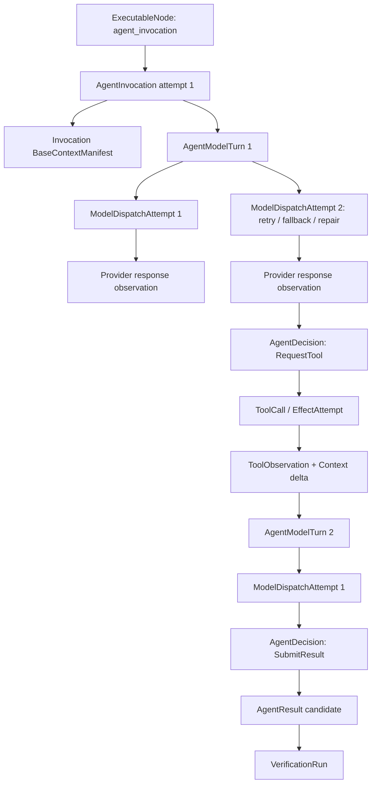
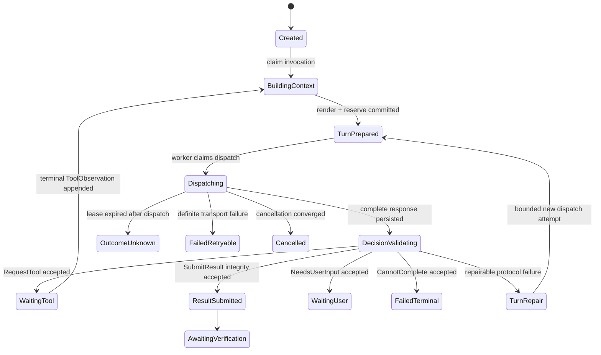
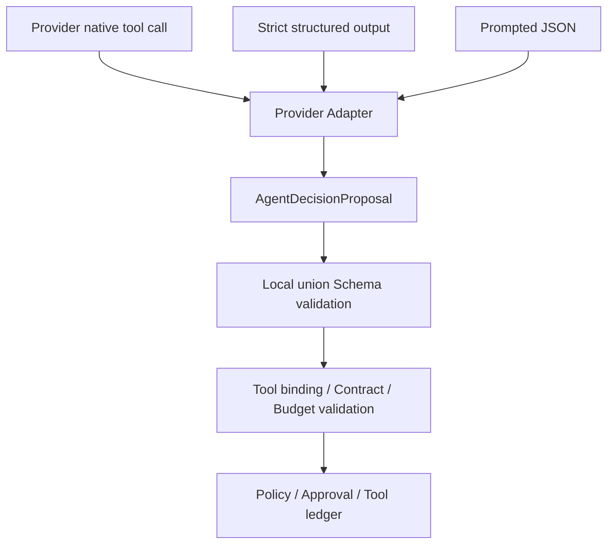

# Agent Model Loop 与 Prompt Package 技术设计

## 1. 文档定位

本文细化 D2：一个已经由 `ExecutablePlan` 精确绑定的 `agent_invocation` 节点，怎样加载 Prompt Package、装配最小上下文、有限调用模型、请求受控 Tool、产生候选 AgentResult，并在进程/Provider 故障后恢复。

本文当前状态是“候选详细设计，待用户确认关键取舍”。它不代表 Prompt Package loader、持久化 Agent Model Loop、`ModelDispatchAttempt` 或 Agent Tool loop 已经实现。阶段 67 通用遥测与回归门禁已经完成；D2 仍建议在阶段 68 Agent Contract/Registry 之后按 68C、69C、69D 分步实施。

本文不重新定义 Plan、Handoff、Tool ledger 或 Verification 的真值：

- Plan/Tool/Agent 精确绑定以[《Task Contract、DraftPlan 与 ExecutablePlan Compiler 技术设计》](Task-Contract与ExecutablePlan-Compiler技术设计.md)和[《Agent Contract 与 Agent Registry 技术设计》](Agent-Contract与Agent-Registry技术设计.md)为准；
- Invocation/Handoff/Result 外层状态以[《Agent Handoff、Invocation 与 Result Runtime 技术设计》](Agent-Handoff与Invocation-Runtime技术设计.md)为准；
- Context/Memory/RAG 装配以[《Context Builder、Memory Broker 与 RAG/Artifact 数据平面技术设计》](Context-Memory-RAG数据平面技术设计.md)为准；
- AgentResult 仍需进入[《Claim、Evidence、Verification 与 Repair/Replan 技术设计》](Claim-Evidence与Verification-Repair技术设计.md)定义的独立验证链。

## 2. 当前代码事实与缺口

当前 `domain/model_contracts.py` 已有 Provider-neutral：

- `ModelRequest`、`ModelResponse`、`ModelMessage`；
- structured output、strict schema、tool calling、parallel tool calling 等 capability 描述；
- Token/费用请求预算、Provider location/privacy route；
- 完整 response 和 stream event 校验。

当前 `application/model_gateway.py` 已有 Provider 选择、retry/fallback、熔断、Retry-After、费用预留/结算和流式完整性校验。但对持久化 Agent Runtime 仍有四个真实缺口：

1. `ModelGateway.complete()` 在一次进程内调用中隐藏多个 Provider attempt，数据库看不到每次真实网络派发；
2. Gateway 的 task cost runtime 主要在进程内，不能作为阶段 69 的持久化 Invocation 预算真值；
3. `ModelMessage` 只有通用文本内容，`ModelResponse` 只有文本/结构化输出，没有统一 `AgentDecision`、Tool binding 或原生 tool-call normalization；
4. 当前 `TaskProcessor._complete_structured()` 写 `model.started` 后直接调用 Provider，再写 usage；数据库和外部 Provider 不可能原子提交，崩溃窗口尚未建成持久化 `ModelDispatchAttempt`。

因此 D2 不能只是给 Prompt 增加“你可以调用工具”说明，也不能在 Worker 内写一个无法恢复的 `while` 循环。

## 3. 核心结论

1. Agent Model Loop 必须是数据库驱动的有限 reducer，不是进程内自由循环。
2. `AgentInvocation`、`AgentModelTurn`、`ModelDispatchAttempt` 和 `ToolCall/EffectAttempt` 是四种不同身份。
3. Prompt Package 是只读、内容寻址、版本化资源包；Prompt Renderer 的输入、输出和每个组件来源都必须可证明。
4. Invocation 建立不可变 Base Context；后续 Turn 只能追加 Supervisor 授权的 Context delta，不允许每轮静默重取全部 Memory/RAG。
5. 每个 Turn 只接受一个严格 `AgentDecision`；首版不提供无外部进展的 `ContinueReasoning`。
6. `RequestTool` 选择 Plan 已绑定的 `tool_binding_id`，模型不能再次决定 Tool version 或扩大 Tool 集合。
7. Provider native tool calling、strict JSON 或 prompted JSON 都只是传输形式，必须归一化为同一个本地 `AgentDecisionProposal`。
8. 首版每 Turn 最多一个 Tool request；Agent 内部不再建设第二套并行 Tool 调度语义。
9. Agent Runtime 需要 `resolve_route()` 与 `dispatch_once()` 边界，把每次 retry/fallback/repair 持久化；现有 `complete()` 可以继续服务旧简单路径。
10. AgentResult 只是候选结果；Model Loop 正常结束不能直接把节点或 Task 标记成功。
11. Prompt、Response、Tool 原文不进入普通事件或 OTel；需要留存时进入分类、加密、受 TTL 控制的 Payload Store。
12. Turn、Tool、Token、费用、deadline 和 no-progress 同时受限，任何一项耗尽都停止扩展。

## 4. 对象层级



### 4.1 身份语义

| 对象 | 稳定唯一键 | 是否可有多个 attempt |
| --- | --- | --- |
| AgentInvocation | `(node_id, invocation_attempt_no)` | 节点 repair/retry 时有多个 |
| AgentModelTurn | `(invocation_id, turn_no)` | 每个逻辑决策位置唯一 |
| ModelDispatchAttempt | `(turn_id, dispatch_attempt_no)` | transport retry/fallback/schema repair 时有多个 |
| ToolCall | 独立 call/operation identity | 由现有 Tool ledger 约束 |
| VerificationRun | `(result_id, verification_attempt)` | 与执行 Agent 分离 |

同一 Invocation 首版只允许一个 active Turn。多个 AgentInvocation 可以并行，但单 Invocation 内不并发推理。

## 5. Prompt Package

### 5.1 建议目录

```text
prompt-package/
├── manifest.yaml
├── system.md
├── decision-contract.json
├── output-schema.json
├── examples/
│   └── read-only-observation.json
└── variants/
    ├── strict-json.md
    └── prompted-json.md
```

Prompt Package 不能包含凭据、Provider endpoint、运行环境秘密或用户数据。它只描述角色、决定协议、渲染模板和受信样例。

### 5.2 Manifest

```yaml
schema_version: deskpilot.prompt-package.v1
package_id: builtin.computer_observer.prompt
version: 1.0.0
compatible_agent_contracts:
  - agent_id: builtin.computer_observer
    version_range: ">=1.0.0 <2.0.0"
renderer:
  id: deskpilot.structured-prompt-renderer
  version: 1.0.0
entrypoints:
  system: system.md
  decision_contract: decision-contract.json
variants:
  - variant_id: strict_json
    template: variants/strict-json.md
    requires:
      structured_output: true
      strict_json_schema: true
  - variant_id: prompted_json
    template: variants/prompted-json.md
    requires:
      structured_output: true
limits:
  max_rendered_bytes: 200000
  max_examples: 4
files: []
package_digest: sha256:...
```

### 5.3 加载与摘要

Package digest 覆盖：

- canonical manifest；
- 全部声明文件的规范化相对路径和内容 digest；
- renderer ID/version；
- decision/output Schema digest；
- variant capability requirements。

加载器必须拒绝：

- 路径逃逸、绝对路径和符号链接逃逸；
- manifest 未声明的隐式文件；
- 同 package/version 内容漂移；
- 未知模板变量或不支持的 renderer；
- 包内疑似 credential/secret；
- Schema、Agent Contract 或 variant capability 不兼容；
- 文件过大、样例过多或递归 include。

阶段 75 之前只加载仓库内受信内置包，不引入第三方签名或远程下载。

## 6. Prompt Renderer

### 6.1 PromptRenderInput

```text
PromptRenderInput
├── BoundAgentRef
├── ExecutableNodeRef + node_spec_digest
├── TaskContractProjection
├── HandoffEnvelope
├── BaseContextManifest
├── ordered ContextDelta refs
├── BoundToolCatalog
├── AgentDecisionSchema
├── RemainingBudgetProjection
├── resolved ModelRoute/variant
└── locale/time facts from trusted clock
```

Renderer 不能自行读取数据库、Memory、RAG、文件或网络。所有输入都由上层 Context Builder/Runtime 显式提供。

### 6.2 RenderedPromptManifest

```text
RenderedPromptManifest
├── prompt_manifest_id
├── invocation_id / turn_id / dispatch_attempt_id
├── prompt_package_id / version / digest
├── renderer_id / version
├── selected_variant
├── ordered message/component digests
├── task_contract_projection_digest
├── context_manifest_digest
├── context_delta_chain_digest
├── tool_catalog_digest
├── decision_schema_digest
├── estimated_input_tokens + estimator version
├── highest_classification
├── provider_egress_decision_ref
└── rendered_prompt_digest
```

同一 RenderInput、Package 和 renderer version 必须产生相同 provider-neutral digest。Provider Adapter 转换后的 request 另计算 `provider_request_digest`，避免把本地渲染和供应商协议序列化混成一个摘要。

## 7. Prompt 信任分区

建议按以下逻辑顺序渲染，具体 Provider role 映射由 Adapter 处理：

| 分区 | 权威等级 | 内容 |
| --- | --- | --- |
| Control | 最高 | Package system instruction、Agent Contract 禁止项、Decision 协议 |
| Task | 受信 | Task Contract 最小投影、ExecutableNode 目标/预算/验收条件 |
| Handoff | 受信控制 | Supervisor 创建的 Handoff 和输入选择器 |
| Tool catalog | 受信能力描述 | 已绑定 Tool ID、参数 Schema、风险/证据期望 |
| Verified evidence | 事实候选高权威 | 已通过 Verification 的 Evidence/Artifact refs |
| Conversation/working memory | 受控但非授权 | 用户会话和任务工作记忆 |
| Untrusted data | 数据 | RAG chunk、网页、MCP/Tool 输出、未验证 Artifact |
| Prior model decisions | 非权威 | 结构化决定和 limitation，不包含私有推理链 |

低权威分区不能覆盖高权威分区。分区标签只是帮助模型理解；真正权限仍由 Plan、Policy、Approval 和 Runner 执行。

## 8. Model route 与 Prompt variant

当前 `ModelRequest` 组装完成后才由 Gateway 选择 Provider，会让 Context 上限和 Prompt variant 选择出现先后依赖。D2 建议两阶段路由：

```text
ModelRouteRequest
  role + privacy + classification + required capabilities
  + min context + budget + allowed Prompt variants
        ↓
resolve_route()
        ↓
ResolvedModelRoute / candidate snapshot
        ↓
Context Builder 按有效窗口编译
        ↓
Prompt Renderer 选择明确 variant
        ↓
Provider Egress Gate
        ↓
dispatch_once()
```

fallback 到能力/上下文窗口不同的 Provider 时，使用同一不可变 TurnInputSnapshot 重新编译允许的 Context/variant，并产生新的 prompt/request digest。不能把第一次 Provider 的渲染请求伪装成第二次请求。

首版可以要求同一 route snapshot 内候选 Provider 支持相同 Decision variant，降低 fallback 差异；后续再开放显式跨 variant fallback。

## 9. Invocation Context freeze 与 delta

### 9.1 BaseContextManifest

Invocation 创建时编译一次 Base Context，绑定：

- Task/Plan/Handoff exact refs；
- Conversation/Working Memory snapshot；
- 已允许的 Long-term Memory/RAG/Artifact refs；
- privacy/classification/egress 决策；
- Context selection/compaction version。

同一 Invocation 不应每 Turn 静默重新执行全局 Memory/RAG 检索。

### 9.2 ContextDelta

后续 Turn 只追加受控 delta：

- ToolObservation；
- 用户回答经控制面验证后的 ref；
- 新验证通过的 Artifact/Evidence；
- 显式 RetrievalRequest 的新结果；
- source-bound CompactionSnapshot。

每个 delta 有序、不可变、内容寻址，并形成 chain digest。删除、过期、ACL 或 source version 变化使相关 Context rebuild fail closed，而不是继续使用陈旧摘要。

## 10. Model Loop reducer



Reducer 只根据持久化状态、当前 owner/fence、预算和事件推进。进程内对象只是缓存，不能成为恢复真值。

## 11. AgentDecision 联合类型

每个完整 Model Turn 只能产生一种决定：

```text
RequestTool
SubmitResult
NeedsUserInput
CannotComplete
ProposeHandoff    # 阶段 69 默认禁用
```

不提供：

- `ContinueReasoning`；
- `Success`；
- `ApproveTool`；
- `WriteMemory`；
- `ExecuteCode`；
- 多决定数组。

### 11.1 通用字段

```json
{
  "schema_version": "deskpilot.agent-decision.v1",
  "kind": "request_tool",
  "decision_summary": "取得当前磁盘容量证据"
}
```

`decision_summary` 是有界、面向审计的简短说明，不要求或保存私有思维链。

### 11.2 RequestTool

```json
{
  "schema_version": "deskpilot.agent-decision.v1",
  "kind": "request_tool",
  "tool_binding_id": "tb_disk_observe",
  "arguments": {
    "target": "contract.resource.target_disk"
  },
  "decision_summary": "取得当前磁盘容量证据",
  "expected_evidence": ["disk_usage_snapshot"]
}
```

模型只选择本 Turn `BoundToolCatalog` 中的 binding ID。Runtime 通过 binding 取得精确 Tool name/version/contract digest；模型输出的 name/version/digest 即使存在也无效并使 Schema 拒绝。

首版每 Turn 最多一个 RequestTool。

### 11.3 SubmitResult

```text
claims proposals
artifact/citation/evidence refs
limitations
unresolved items
decision_summary
```

不能包含可信 `verified=true`、Task status 或新的权限事实。Runtime 先做 ResultIntegrityCheck，再形成 `AgentResult candidate`。

### 11.4 NeedsUserInput

至少包含：

- 稳定问题 code；
- 面向用户的有界问题；
- blocking field IDs；
- 期望回答 Schema；
- 为什么现有 Contract/Context 不足；
- 当前已完成和未执行动作摘要。

Agent 不直接与前端建立私有会话。Supervisor 将 proposal 转换为受信控制面请求。用户回答若改变目标、scope、privacy、budget 或验收条件，必须创建 Contract amendment 和新 Plan generation；普通数据回答可以形成受控 Context delta 或新 Invocation attempt。

### 11.5 CannotComplete

模型只能提交候选 reason/limitation/evidence。Runtime 映射为稳定错误分类，并由 Node policy 决定 terminal、partial、needs_user 或 Replan proposal。

### 11.6 ProposeHandoff

阶段 69 关闭。后续开放时也只产生 proposal；Supervisor/Compiler 决定是否使用已预编译节点或创建新 generation。

## 12. Provider tool-call normalization

Provider 的原生 tool call、strict structured JSON 和 prompted JSON 都必须归一化：



Provider Adapter 不能直接创建 ToolCall。若 Provider 同时返回 Tool call 和 final result、返回多个 Tool call 或返回未知 binding，首版判定协议无效。

## 13. Tool request 控制链

接受 `RequestTool` 前重新校验：

```text
Decision Schema
→ binding ID 存在且属于当前 node/turn catalog
→ Tool arguments Schema
→ Agent Contract allowlist
→ ExecutablePlan node restriction
→ TaskContract resource/privacy/risk limits
→ remaining Invocation/Task budget
→ current Policy
→ exact Approval when required
→ Tool ledger / effect graph / Runner
```

`waiting_approval` 属于同一个 Tool request 的运行等待，不允许模型在审批未决时继续产生新 Turn 或换 Tool 试探。

## 14. ToolObservation

模型不直接接收任意 Runner/MCP 原始输出。下一 Turn 使用受控对象：

```text
ToolObservation
├── observation_id
├── invocation_id / turn_id / tool_call_id
├── tool_binding_id
├── terminal status
├── result_schema_ref/digest
├── bounded structured projection
├── artifact/evidence/citation refs
├── receipt ref
├── stable error code
├── freshness / source version
├── classification
├── untrusted-content marker
└── observation_digest
```

原始 Tool/MCP/网页内容留在 Artifact/Evidence Store。Observation 的摘要继承最高 classification，并且仍作为数据而非 instruction 渲染。

## 15. 持久化与原子边界

### 15.1 Turn prepare 事务

同一事务至少完成：

- 创建 `AgentModelTurn`；
- 固定 TurnInputSnapshot 和 Context delta chain head；
- 创建第一条 `ModelDispatchAttempt=prepared`；
- 保存 prompt/request manifest digest；
- 预留持久化 Token/费用/并发预算；
- append event/outbox。

### 15.2 外部 Provider 边界

数据库与 Provider 无法原子提交：

```text
prepared committed
→ claim/fence
→ dispatching committed
→ external Provider call
→ response observation / failure committed
```

### 15.3 Decision acceptance 事务

完整 Response 持久化后，单独事务完成：

- 验证 owner/fence/attempt/turn 状态；
- 保存 normalized AgentDecision；
- CAS 设为 Turn winner；
- 结算 usage/费用，释放剩余 reservation；
- 按 decision 创建 Tool request、waiting user、AgentResult 或 terminal 状态；
- append event/outbox。

不允许 ToolCall 在 Decision 尚未持久化前派发。

### 15.4 Result submission 事务

至少原子完成：

- 保存 AgentResult candidate 与 integrity digest；
- Invocation `result_submitted`；
- verification status `pending`；
- 创建/唤醒 VerificationRun；
- append event/outbox。

## 16. ModelDispatchAttempt

建议字段：

```text
dispatch_attempt_id
turn_id
attempt_no
attempt_kind             # initial/retry/fallback/schema_repair
resolved_provider_id/model/protocol
route_snapshot_digest
prompt_manifest_id/digest
provider_request_digest
request_id
status                   # prepared/dispatching/succeeded/failed/outcome_unknown/superseded
native_response_id
response_digest
usage/cost_micros
budget_reserved/settled/uncertain
claim_owner_id/fencing_token/lease_expires_at
started_at/finished_at
stable_error_code
```

一个 Turn 只能有一个 winner response/decision。其他成功但迟到的 observation 不得推进状态。

## 17. Retry、fallback、repair 与 Agent retry

| 类型 | 新身份 | Prompt 是否变化 | 典型原因 |
| --- | --- | --- | --- |
| transport retry | 新 DispatchAttempt，同一 Turn | 通常不变 | 确定网络失败、429 |
| Provider fallback | 新 DispatchAttempt，同一 Turn | variant/adapter 可能变化 | Provider unavailable/circuit open |
| schema repair | 新 DispatchAttempt，同一 Turn | 增加受限 repair overlay | JSON/union/Schema 不合法 |
| Agent repair/retry | 新 AgentInvocation attempt | 新 Handoff/Context/repair policy | AgentResult rejected、节点失败 |
| Replan | 新 Plan generation | 新 ExecutablePlan | 目标覆盖或策略需要改变 |

这些身份不能混用。尤其不能把 verification rejection 当作同一个 Model Turn 的 transport retry。

## 18. Provider outcome unknown

Model、Tool、Verification、Broker、Context 等不同 uncertainty 的统一分类、恢复所有者和父级聚合规则见[《多 Agent 跨层故障与恢复矩阵技术设计》](多Agent跨层故障与恢复矩阵技术设计.md)。本节只定义 Model Dispatch 的局部规则。

恢复规则：

- `succeeded`：复用已持久化 winner，不再调用；
- `failed`：按稳定错误、route、deadline 和预算决定新 attempt；
- `dispatching` lease 过期：转 `outcome_unknown`；
- `outcome_unknown`：原 attempt 不得重新派发；
- 允许继续时创建新 attempt，并把可能重复计费计入 `budget_uncertain`；
- Provider 若支持按 native request ID 查询结果，可由专用 resolver 升级结论；不能自行假设幂等；
- 迟到响应只有 owner/fence/turn/attempt/status 全匹配时才能成为 winner；否则只保存为受保护 late observation；
- 已取消、superseded 或已产生 winner 的 Turn，迟到结果不能触发 Tool。

模型 unknown 不等于 Tool effect unknown：它通常不产生 OS 副作用，但可能已经产生费用、数据出境和未收到的候选决定。因此可比写 Tool 更积极 retry，却不能假装没有成本与隐私影响。

## 19. 持久化预算

阶段 69 预算真值不能继续只在 Gateway 进程内。至少需要：

```text
allocated
reserved
settled
released
uncertain
```

维度：

- Invocation/Task 最大 Model Turn；
- Dispatch attempt/retry/fallback/repair 数量；
- Tool request 数量；
- input/output/total tokens；
- 费用；
- Context bytes/tokens；
- wall-clock deadline；
- Task/global/Provider 并发。

Provider 派发前按最坏可接受成本预留，成功按实际 usage 结算；unknown 保守进入 uncertain。Agent、Prompt 或父 Invocation 都不能扩大预算。

## 20. Loop termination 与 no-progress

候选初始上限：

- 每 Invocation 最多 6 个 Model Turn；
- 最多 4 个 Tool request；
- 每 Turn 最多 1 次 schema repair；
- 同一 Tool binding + canonical arguments + input Evidence fingerprint 无新事实时不能重复；
- 连续两次相同稳定错误且 Context/Evidence 没有变化，判定 no progress；
- deadline、Token、费用、Tool、Context 任一预算耗尽即停止扩展；
- `NeedsUserInput` 进入持久化暂停，不后台轮询或自问自答。

实际有效上限取系统、Task Contract、ExecutableNode、Agent Contract 和 Provider route 的最小值。

`ProgressFingerprint` 至少覆盖 decision kind、tool binding、canonical arguments、relevant Evidence refs/source versions、stable error 和 Context delta head。不能只比较自然语言文本。

## 21. Pause、cancel 与 lease 丢失

### 21.1 Pause

- 停止创建新 Turn、新 Dispatch 和新 Tool request；
- 已在途 Provider 可以完成并保存 Response/Decision proposal，但 pause barrier 未解除前不得派发新 Tool；
- 已提交 Tool 继续按现有 commit/receipt/unknown 语义收敛；
- resume 重读持久化状态，不重放已成功 Turn。

### 21.2 Cancel

- 写 cancel intent 后停止新工作；
- 对 Provider best-effort cancel；
- dispatch 后无法确认取消时费用状态进入 uncertain；
- 迟到 Response 不得推进 cancelled Invocation；
- Tool 子调用仍按 Tool commit boundary 处理，不能把 Agent 取消当作“副作用未发生”。

### 21.3 Worker lease/fence

旧 Worker 失去 lease 后可以完成网络 I/O，但不能提交 winner Decision。所有 Turn/Dispatch/Decision CAS 都校验 owner、fence 和当前状态。

## 22. Streaming

首版 Agent Decision 建议使用非流式完整结构化响应。

以后允许 streaming 时：

- delta 只是 provisional presentation；
- delta 不能触发 Tool、Result、Handoff 或 Memory 写入；
- 只有完整 `response.completed`、request/provider/sequence 校验和 Decision Schema 通过后才能推进；
- UI 必须标记临时文本，不把它作为已验证进度；
- 默认不持久化每个正文 delta，只记录计数、大小、首末时间和完整 response digest。

不要为“看起来实时”提前引入部分 JSON 恢复和流式 Tool 执行。

## 23. Payload、隐私与思维链

普通表、事件、日志和 OTel 只保存：

- task/plan/node/invocation/turn/attempt ID；
- package/renderer/context/tool catalog/request/response/decision digest；
- classification、大小、Token、usage、费用、延迟和稳定错误；
- 结构化 AgentDecision 的安全投影。

原始 Prompt/Response 如需调试或 Replay，进入 `ModelPayloadStore`：

- 本地加密；
- exact task/ACL/classification 绑定；
- 独立 TTL；
- 删除传播；
- 云端/本地来源和 egress 记录；
- 前端默认不可见；
- audit access。

系统不要求模型输出私有 chain-of-thought。`decision_summary`、Claim 和 limitation 是面向审计的结构化结果，不是推理过程。

## 24. AgentResult 与 Verification 边界

`SubmitResult` 先经过 `ResultIntegrityCheck`：

- Decision/output Schema 合法；
- Artifact/Evidence/Citation refs 存在且 digest 匹配；
- refs 属于当前 Task/Run，Agent 有权读取/引用；
- Claim 不引用未来节点或越权数据；
- classification、数量、大小和预算合法；
- input/context/model response/output Schema digest 完整；
- Agent 没有写可信 success/verified/Task status。

通过只说明“候选结果结构和血缘可信”，不说明事实正确。Invocation 进入 `result_submitted + verification.pending`；只有独立 VerificationRun 可以解锁下游。

## 25. 稳定错误分类

| code | 含义 | 默认动作 |
| --- | --- | --- |
| `PROMPT_PACKAGE_INVALID` | manifest/文件/Schema 不合法 | fail closed |
| `PROMPT_PACKAGE_DIGEST_MISMATCH` | 同版本内容漂移 | fail closed/告警 |
| `PROMPT_VARIANT_UNAVAILABLE` | route 无兼容 variant | route 失败或换兼容 Provider |
| `PROMPT_RENDER_INVALID` | 模板变量、大小或确定性失败 | terminal 配置错误 |
| `CONTEXT_MANIFEST_STALE` | source/ACL/delete/版本失效 | rebuild 或 needs_user |
| `MODEL_ROUTE_UNAVAILABLE` | 无满足能力/隐私/预算的 Provider | retry/needs_user |
| `MODEL_DISPATCH_FAILED` | 确定网络/Provider 失败 | bounded retry/fallback |
| `MODEL_DISPATCH_OUTCOME_UNKNOWN` | 已派发但无确定结果 | uncertain budget/new attempt policy |
| `AGENT_DECISION_INVALID` | response 无法归一化或 Schema 无效 | bounded schema repair |
| `AGENT_DECISION_AMBIGUOUS` | 同时 Tool/Result 或多个 Tool | repair/terminal |
| `AGENT_TOOL_BINDING_UNKNOWN` | binding 不属于当前 catalog | 拒绝并安全计数 |
| `AGENT_TOOL_ARGUMENT_INVALID` | arguments Schema 不合法 | bounded repair |
| `AGENT_LOOP_NO_PROGRESS` | 重复决定且无新 Evidence | terminal/repair/replan proposal |
| `AGENT_TURN_BUDGET_EXHAUSTED` | Turn/Token/费用/deadline 耗尽 | terminal/partial |
| `AGENT_RESULT_INTEGRITY_INVALID` | Result refs/血缘/分类无效 | rejected，不进入事实视图 |

## 26. 建议持久化对象

- `agent_invocations`；
- `agent_model_turns`；
- `model_dispatch_attempts`；
- `rendered_prompt_manifests`；
- `model_payload_envelopes` 或外部受保护 payload refs；
- `agent_decisions`；
- `tool_observations`；
- `agent_results`；
- `agent_budget_accounts/reservations`。

Prompt Package 本体首版来自只读受信资源根；数据库只保存精确 package/version/digest 和加载 snapshot，不在运行时修改文件。

## 27. 建议代码落点

```text
backend/src/deskpilot/
├── domain/
│   ├── prompt_packages.py
│   ├── agent_decisions.py
│   ├── agent_model_turns.py
│   └── tool_observations.py
├── application/
│   ├── prompt_package_loader.py
│   ├── prompt_renderer.py
│   ├── agent_loop_reducer.py
│   ├── model_dispatch_service.py
│   └── agent_result_service.py
└── infrastructure/
    ├── builtin_prompt_packages/
    └── model_payload_store.py
```

`ModelGateway.complete()` 可以保留兼容；Agent Runtime 使用新增的 durable route/dispatch 边界。不要让 Prompt Renderer、Gateway 和 Invocation reducer 合并成一个巨型 service。

## 28. 实施拆分

### 68C-1：Prompt Package loader

- manifest/schema/digest/root boundary；
- 三个内置 Agent package；
- frozen Registry 交叉校验；
- package golden fixtures。

### 68C-2：Renderer 与 manifest

- typed RenderInput；
- trust partition；
- variant/capability；
- deterministic RenderedPromptManifest；
- Payload Store/ordinary event 分离。

### 69C：无 Tool Model Loop

- Invocation/Turn/DispatchAttempt 持久化；
- `SubmitResult/NeedsUserInput/CannotComplete`；
- non-stream structured decision；
- outcome unknown、fence、budget。

### 69D-1：单 Tool loop

- BoundToolCatalog 和 dynamic decision Schema；
- `tool_binding_id`；
- Policy/Approval/ledger 接线；
- ToolObservation delta；
- no-progress。

### 69D-2：route/fallback 与恢复

- `resolve_route/dispatch_once`；
- persistent reservation/settlement/uncertain；
- retry/fallback/schema repair 身份；
- crash/late response 故障注入。

### 69E：两个只读 Agent 并行

- 单 Invocation 仍串行 Turn；
- 多 Invocation 由 Scheduler 并行；
- join 前都停在 verification gate。

## 29. 验收矩阵

1. Package 同版本内容漂移、未声明文件、路径逃逸、未知变量全部拒绝；
2. 同 RenderInput/Package/renderer 得到相同 provider-neutral digest；
3. Provider request digest 与 rendered prompt digest 分离且都可追溯；
4. Prompt/Response/Tool 原文不进入普通事件、日志或 OTel；
5. Agent 使用不存在或未绑定 `tool_binding_id` 时在 Tool ledger 前拒绝；
6. Agent 自报 Tool name/version、Approval 或 verified 不产生权限/成功状态；
7. native tool call、strict JSON 和 prompted JSON 归一化为相同 Decision union；
8. 同 Turn 同时 Tool + Result、多个 Tool 或无决定时拒绝；
9. Tool request 在 Decision 持久化后才可创建，Policy/Approval/Runner 路径不被绕过；
10. Worker 在 dispatch 后强杀，恢复把过期 attempt 转 unknown，新 attempt 不复用旧身份；
11. 迟到 response 在 fence/status 不匹配时不能触发 Tool/Result；
12. retry、fallback、schema repair 和 Agent retry 的身份/预算分别可查询；
13. unknown 费用进入 uncertain，不能被当作 released；
14. Base Context 冻结，每个 ToolObservation 形成有序 delta chain；
15. Memory/RAG source 删除或版本漂移使 Context rebuild fail closed；
16. 相同 Tool/参数/Evidence 无进展重复触发 no-progress；
17. pause 后可保存 response proposal但不派发新 Tool，resume 不重放 winner Turn；
18. cancel/lease 丢失后的 late response 不推进 Invocation；
19. SubmitResult 只产生 AgentResult candidate 和 verification.pending；
20. 两个并行 AgentInvocation 的 Turn/预算/Tool lineage 相互隔离。

## 30. 明确禁止的捷径

- Worker 内不可恢复的 `while model_wants_tool`；
- 把 Provider native tool call 直接发给 Runner；
- 让模型重新选择 Tool version/digest；
- 一个 Turn 同时执行多个 Tool 与提交最终结果；
- 审批等待时继续让模型换 Tool 试探；
- 每轮静默重取全部 Memory/RAG；
- 把 Tool/MCP/网页原文提升为 system message；
- 用 Prompt 的“不得越权”代替 Policy/Runner；
- 把当前 Gateway 内存 retry/cost 当作跨重启真值；
- 流式半个 JSON 就触发 Tool；
- 保存或要求 private chain-of-thought；
- Model Loop 正常返回就标记节点 verified 或 Task succeeded。

## 31. 待确认决策

| 决策 | 当前推荐 | 主要代价 |
| --- | --- | --- |
| Loop 形态 | 数据库持久化 reducer | 表、事务和 reducer 实现较多 |
| Tool 选择 | `tool_binding_id`，版本由 Plan 绑定 | dynamic Decision Schema 更复杂 |
| 单轮行为 | 一种 Decision、最多一个 Tool | Agent 内并行 Tool 延后 |
| Provider tool calling | 仅 Adapter 输入 | 需要 normalization 层 |
| Gateway | 新增 `resolve_route/dispatch_once`，durable retry 在外层 | 要重构当前隐藏 retry |
| Context | Base freeze + ordered delta | 显式 refresh/retrieval 成本增加 |
| Streaming | 初版 Decision 非流式 | 用户看到的实时文字减少 |
| Payload retention | 本地加密、短 TTL、可配置；普通记录只留 digest | 深度调试受 retention 限制 |
| Loop 默认预算 | 6 Turns、4 Tools、1 schema repair | 某些长任务更早进入 Replan/needs_user |

其中持久化 reducer、tool binding、本地 Decision normalization 和 durable dispatch attempt 是正确性边界，不建议放宽。确认后在[《多 Agent 后续技术架构讨论总纲》](多Agent后续技术架构讨论总纲.md)中把 D2 标为“已确认待实现”。

## 32. 与后续设计的接口

- D3 必须逐格定义 Turn prepare、Provider dispatch、Decision accept、Tool wait、Result submit 的崩溃恢复；
- D4 Scheduler 分别调度 AgentInvocation 与 ModelDispatch，不在一个 Worker lease 内长期占用 Provider/Approval；
- D5 用 span link 关联 invocation/turn/dispatch/tool/verification，正文严格脱敏；
- D6 评测 Package 漂移、Decision normalization、unknown、late response、no-progress 和 Tool 越权；
- D7 UI 展示真实 Turn/Tool/等待/预算状态，不显示私有推理；
- D8 第三方 Prompt Package 需要签名、发布者、SBOM、撤销和隔离，但仍服从相同 renderer/decision/runtime 协议。
