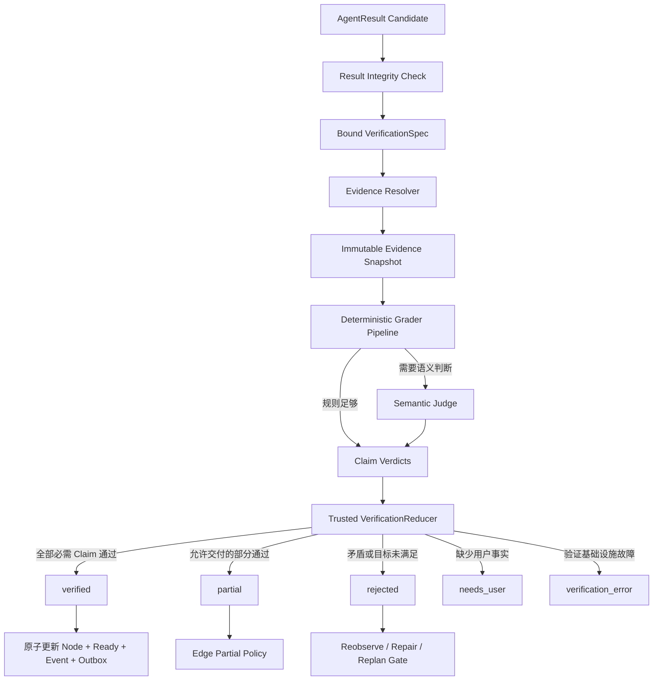

# Claim、Evidence、Verification 与 Repair/Replan 技术设计

## 1. 文档定位

本文细化[《多 Agent 系统总体架构》](多Agent系统总体架构.md)中的节点验证、最终任务验收、partial、repair、replan 和人工介入，承接[《Agent Contract 与 Agent Registry 技术设计》](Agent-Contract与Agent-Registry技术设计.md)及[《Agent Handoff、Invocation 与 Result Runtime 技术设计》](Agent-Handoff与Invocation-Runtime技术设计.md)，作为[《多 Agent 运行时、记忆与验证实施路线》](多Agent运行时记忆与验证实施路线.md)阶段 70 的设计基线。

本文是设计文档，不代表 Claim/Evidence、Grader Registry、VerificationRun、Repair/Replan 或 Final Task Acceptance 已经完成代码实现。阶段 67 通用遥测/回归门禁已经完成；当前断点为阶段 68 Agent Contract/Registry，本文能力仍按后续路线实施。

## 2. 核心结论

1. 执行 Agent 只能提交 Claim 和 Evidence 引用；Grader 只能产生 Observation；只有受信 `VerificationReducer` 能计算可信结论并解锁下游。
2. Result Integrity Check、运行时 Verification 和离线 Evaluation 必须分开；离线黄金评测不能直接冒充一次任务的完成证明。
3. 每个 Execution Node 在 ExecutablePlan 中绑定版本化 `VerificationSpec`；执行 Agent 不能选择更宽松的验证方法。
4. Evidence 必须明确“能证明什么、不能证明什么”、来源、版本、时间语义、权限和数据分类。
5. Tool receipt 证明精确副作用已提交，不自动证明用户最终目标正确；Citation 证明某版本文档包含文本，不自动证明现实世界真伪。
6. 确定性 Grader 优先；Semantic Judge 只是末级 Grader，不是最终授权者，也不能以多数投票替代 Evidence。
7. Judge/Resolver/Grader 基础设施失败必须产生 `verification_error`，不能把 AgentResult 错判为 `rejected`。
8. Claim 逐项裁决，关键 Claim 不能被非关键 Claim 的平均分抵消。
9. 只有 VerificationReducer 的原子事务能更新 Invocation/Node、解锁 successor、写 Event 和 Outbox。
10. Reobserve、Repair 和 Replan 是三种不同动作；Repair 不能扩大权限，Replan 不能遗忘旧副作用、Policy deny 或 unknown。
11. Node 全部 verified 也不等于任务完成；Final Task Acceptance 还必须检查 Task Contract coverage、当前性、Synthesizer 血缘和未决风险。
12. 这套架构提高可验证性和可解释性，但不能承诺绝对正确；底层 Tool、来源、Judge 和现实变化仍是剩余风险。

## 3. 三层检查边界

| 层次 | 证明内容 | 能否解锁 Node |
| --- | --- | --- |
| `ResultIntegrityCheck` | Schema、digest、引用、权限和血缘是否合法 | 不能 |
| Runtime `VerificationRun` | 当前 Claim 是否被符合 Policy 的 Evidence 支持 | 可以 |
| Offline `EvaluationRun` | 系统版本在黄金/对抗任务上的整体回归表现 | 不能直接影响运行中 Node |

Result Integrity Check 通过后，AgentResult 仍只能进入 `awaiting_verification`。Offline Evaluation 用于发布门禁、Grader 回归和版本趋势，不参与某次业务任务的原子状态转换。

## 4. 总体架构



## 5. VerificationSpec 与 Policy Registry

### 5.1 定位

`VerificationSpec` 是 ExecutablePlan Node 的不可变验收合同，由受信 Plan Binder 从 Agent Contract、Task Contract 和内置 Verification Policy 模板编译，不由 Agent 生成。

示例：

```yaml
verification_spec:
  policy_id: builtin.knowledge_result
  version: 1.0.0
  policy_digest: "<sha256>"

  required_claims:
    - claim_type: sourced_statement
      min_count: 1
      criticality: required

  allowed_evidence:
    - knowledge_citation

  grader_pipeline:
    - evidence.integrity@1.0.0
    - knowledge.citation_current@1.0.0
    - semantic.claim_entailment@1.0.0

  freshness_policy:
    mode: source_version_current

  partial_policy:
    allowed: true
    minimum_verified_claims: 1

  recovery_policy:
    max_reobserve_attempts: 1
    max_repair_attempts: 1
    replan_on_contradiction: true
```

### 5.2 有效策略

```text
Agent Contract ResultPolicy
∩ Task Contract Acceptance Criteria
∩ Bound Plan VerificationSpec
∩ 当前安全/隐私 Policy
```

Plan 可以加强 Agent Contract 的最低验证要求，不能降低。执行 Agent 可以建议 Evidence，但不能决定 Evidence 是否足够，也不能选择 Grader。

### 5.3 VerificationPolicyRegistry

Registry 只加载内置、版本化、数据化 Policy：

```text
register(policy, schema)
freeze(grader_registry)
resolve_exact(policy_id, version, digest)
list_public()
```

阶段 70 不提供运行时写 API，不接受用户上传规则、Prompt、Python 或 Judge。

## 6. CompletionClaim

### 6.1 模型

```yaml
claim_id: clm_...
agent_result_id: agr_...
claim_type: sourced_statement
criticality: required

content_ref:
  artifact_id: ...
  locator: claim-3
  digest: ...

temporal_scope:
  mode: source_version
  source_version: ...

evidence_refs:
  - evidence_id: ...

limitations: []
```

Agent 自报 confidence 可以保留为非可信元数据，但不能替代 Evidence 或进入确定性通过逻辑。

### 6.2 首批 Claim 类型

| Claim 类型 | 示例 | 常见 Evidence |
| --- | --- | --- |
| `observation` | 磁盘在观察时使用率为 72% | Tool output snapshot |
| `effect_committed` | 文件移动已跨过 commit boundary | Tool commit receipt |
| `resource_state` | 目标文件当前存在 | 新的只读 postcondition observation |
| `sourced_statement` | 文档说明恢复需要 receipt | Knowledge Citation |
| `derived_fact` | 当前使用率低于阈值 | 输入 Evidence + 确定性比较 Grader |
| `coverage` | 已回答用户要求的三个问题 | verified Claim refs |
| `quality` | 摘要没有遗漏关键限制 | 规则 + 可选 Semantic Judge |

### 6.3 Criticality

```text
informational
optional
required
safety_critical
```

不能对所有 Claim 简单平均打分。任一 `safety_critical` Claim contradicted，应直接拒绝对应结果。

## 7. EvidenceRef 与证据语义

### 7.1 模型

```yaml
evidence_id: evd_...
evidence_type: knowledge_citation
issuer: deskpilot.knowledge_base

source_id: ...
source_version: ...
object_id: ...
object_digest: ...

task_id: ...
run_id: ...
invocation_id: ...

observed_at: ...
valid_until: ...
temporal_semantics: source_version
trust_class: documentary
data_classification: local_sensitive
authorization_binding: ...
evidence_digest: ...
```

AgentResult 中的 EvidenceRef 只是候选索引。只有 Evidence Resolver 从受信存储重新加载并复核后，才形成可供 Grader 使用的 resolved evidence。

### 7.2 首批 Evidence 类型

```text
tool_commit_receipt
tool_output_snapshot
resource_postcondition
knowledge_citation
artifact
task_event
branch_decision_proof
user_assertion
derived_evidence
```

### 7.3 每种 Evidence 的证明边界

| Evidence | 能证明 | 不能证明 |
| --- | --- | --- |
| Tool commit receipt | 精确 Tool 调用跨过 commit boundary，并记录前后资源版本 | 操作符合用户最终目标；资源现在仍保持该状态 |
| Tool output snapshot | Tool 在某时刻观察到某结果 | 结果永久有效；Tool 绝对无缺陷 |
| Resource postcondition | 验证时资源满足某状态 | 过去一直满足；未来不会变化 |
| Knowledge Citation | 某 source version 的某 chunk 包含对应文本 | 文档内容是真实世界事实 |
| Artifact digest | 内容未被篡改且来源可追踪 | 内容语义正确 |
| TaskEvent | 系统记录过某状态转换 | 外部副作用必然发生，除非同时有 receipt |
| User assertion | 用户提供过该输入 | 输入描述一定符合外部现实 |
| Semantic Judge output | Judge 对 Claim/Evidence 的语义观察 | 客观事实或最终授权 |

Verification Policy 必须使用这些语义，不能把“存在 Citation”简化为“结论为真”。

## 8. 时间语义与 Evidence Snapshot

### 8.1 Claim temporal scope

```text
historical
snapshot
current
source_version
timeless
```

- `historical`：例如“文件移动在某时已提交”，receipt 足以证明历史事件；
- `snapshot`：例如“观察时磁盘使用率为 72%”，绑定 observed_at 和 result digest；
- `current`：例如“文件现在存在”，Verification 必须重新观察，并设置较短 `valid_until`；
- `source_version`：例如“版本 X 的文档写了 Y”，Citation 可证明；
- `timeless`：只用于真正不依赖外部状态的确定性推导。

如果用户问“当前文档如何规定”，只证明旧 source version 不够，还要确认该 source version 仍 current。

### 8.2 EvidenceSnapshot

```text
snapshot_id
verification_run_id
resolved_at
database_time
evidence_refs
source_versions
postcondition_observations
snapshot_digest
valid_until
```

Grader 只读取不可变 Snapshot。验证过程中外部来源变化时，不修改原 VerificationRun；需要新验证 attempt。Final Task Acceptance 还要检查 current Claim 在交付时是否过期。

## 9. Evidence Resolver

Resolver 必须复核：

1. Evidence 对象存在；
2. task/run/invocation 血缘匹配；
3. 当前 Verifier 有权读取；
4. digest 可重算；
5. Tool receipt 与 call/authorization/approval/prepare 绑定；
6. Citation 与 source/artifact/chunk/retrieval proof 绑定；
7. Source version、observed_at、valid_until 符合 Claim 时间语义；
8. 数据分类允许进入当前 deterministic/semantic Grader；
9. 没有引用未来 Node、其他用户或不允许的 Memory/RAG scope；
10. stale、revoked、unknown Evidence 不会静默降级。

Resolver 的两类失败必须分开：

- Evidence 自身不合法/过期：产生 unsupported/stale/contradicted 的输入；
- Resolver 数据库、Tool 或服务故障：VerificationRun 进入 `verification_error`，不能把 AgentResult 判为 rejected。

项目现有 [`ToolCommitReceipt`](../backend/src/deskpilot/domain/tool_commit.py) 和 [`KnowledgeCitationRead`](../backend/src/deskpilot/domain/knowledge.py) 可作为强 Evidence 基础，但仍要按上述证明边界使用。

## 10. Grader Contract 与 Registry

### 10.1 GraderContract

```yaml
schema_version: deskpilot.grader_contract.v1
grader_id: knowledge.citation_current
version: 1.0.0
grader_kind: deterministic

supported_claim_types:
  - sourced_statement
supported_evidence_types:
  - knowledge_citation

input_schema_digest: ...
output_schema_digest: ...
implementation_digest: ...
has_side_effects: false
requires_model: false
max_runtime_seconds: 5
```

Grader 类型：

```text
integrity
deterministic
semantic
manual
```

### 10.2 GraderRegistry

只加载内置、受信实现并在启动时冻结。Grader identity 绑定版本、实现/prompt digest、I/O Schema 和允许的 Claim/Evidence 类型。

### 10.3 GraderObservation

```yaml
grader_id: knowledge.citation_current
grader_version: 1.0.0
grader_digest: ...
claim_id: ...
status: passed
reason_code: CITATION_CURRENT
evidence_used: []
output_digest: ...
```

Grader 不能直接设置 Node/Task 状态。

## 11. Grader Pipeline

固定顺序：

1. Integrity：Claim Schema、Evidence identity、digest、task ownership、authorization、classification；
2. Evidence authenticity：Tool ledger/receipt、Artifact digest、Citation proof、TaskEvent sequence、postcondition；
3. Deterministic business：数值比较、版本相等、集合覆盖、stale 检测、约束规则；
4. Semantic：Citation entailment、摘要忠实度、目标覆盖等不可规则化问题；
5. Manual/User：高风险歧义、证据冲突或无法自动判断。

确定性结果足够时不得额外调用 Judge，以降低成本、隐私暴露和相关性错误。

## 12. Semantic Judge

Semantic Judge 只是 `semantic` Grader，必须：

- 无副作用 Tool；
- 默认无 Memory 写入；
- 只读取 Claim、EvidenceSnapshot 和必要验收标准；
- 不读取执行 Agent 完整聊天或私有推理；
- 使用独立 Prompt Package；
- Prompt、模型、输入、输出全部绑定 digest；
- 把检索和 Artifact 正文包装为不可信引用材料；
- 输出严格 Schema；
- 记录执行 Agent 与 Judge 是否为同 Provider/同模型族；
- 高风险语义允许要求不同模型族或人工确认；
- 不使用多数投票替代 Evidence。

### Judge 自身失败

Judge 与其他外部边界的统一 uncertainty、attempt 和恢复所有者规则见[《多 Agent 跨层故障与恢复矩阵技术设计》](多Agent跨层故障与恢复矩阵技术设计.md)。本节继续固定 `verification_error` 不等于业务 `rejected`。

Judge 调用使用独立 `GraderRun/ModelCall`：

```text
prepared
dispatching
succeeded
failed
outcome_unknown
```

超时、限流、输出非法、Provider 不可用或 outcome unknown，只能产生 `verification_error/failed_retryable`，不能产生业务 `rejected`。

## 13. ClaimVerdict 与 VerificationReducer

### 13.1 ClaimVerdict

```text
verified
unsupported
contradicted
indeterminate
stale
not_applicable
```

- `verified`：所有必需 Grader 通过；
- `unsupported`：缺少必要 Evidence；
- `contradicted`：Evidence 支持相反结论；
- `indeterminate`：Evidence 存在但无法可靠判断；
- `stale`：真实性仍可证明，但时间要求不满足；
- `not_applicable`：可信 Policy 判定当前不适用。

Grader/Resolver 基础设施错误不属于 ClaimVerdict。

### 13.2 Reducer 聚合

- 任一 safety-critical Claim contradicted → rejected；
- 任一 required Claim contradicted → 默认 rejected；
- required Claim unsupported/stale/indeterminate → reobserve、repair、needs_user、partial 或 replan，由 Policy 决定；
- 所有 required Claim verified → verified；
- 只有 optional Claim 失败，且 Partial Policy 允许 → partial 或 verified-with-limitations；
- Grader/Resolver 基础设施失败 → verification_error；
- 缺少只能由用户提供的事实 → needs_user。

`partial` 不能自动产生。只有 Task/Edge/Delivery Contract 明确允许有价值部分交付时才可使用，而且默认不满足 `verified` Edge。

## 14. VerificationRun

### 14.1 模型

```text
verification_run_id
agent_result_id
node_id
attempt_no
policy_id
policy_version
policy_digest
run_status
outcome
input_manifest_digest
evidence_snapshot_id
evidence_snapshot_digest
grader_set_digest
judge_model_identity
judge_prompt_digest
claim_count
verified_claim_count
failed_claim_count
claim_owner_id
claim_fencing_token
revision
started_at
completed_at
valid_until
```

### 14.2 状态与结论分开

运行状态：

```text
queued
resolving_evidence
running_deterministic
running_semantic
completed
failed_retryable
failed_terminal
cancelled
superseded
```

业务 outcome 只在 `completed` 时存在：

```text
verified
partial
rejected
needs_user
```

唯一约束建议：

```text
UNIQUE(agent_result_id, policy_digest, attempt_no)
```

同一 identity 出现不同 input/evidence/grader digest 时 fail closed。

## 15. 原子解锁

VerificationRun terminal commit 必须在同一事务完成：

```text
写 VerificationRun terminal 状态
+ 写 ClaimVerdict
+ 更新 AgentInvocation.verification_status
+ 更新 ExecutionNode.status
+ 检查当前 Plan generation
+ 检查 Task 未 cancelled/superseded
+ 计算 successor readiness
+ 写 TaskEvent
+ 写 Outbox
```

所有写入绑定 Verifier job lease/fence/revision。迟到 Verification、旧 Plan generation、已 superseded Result 或取消 Task 不能解锁 Node，只能保留审计或标记 superseded。

## 16. Reobserve、Repair 与 Replan

### 16.1 Reobserve

Evidence 曾合法但过期时，优先重新执行受信只读观察，生成新 EvidenceSnapshot，不必让模型“反思”。

### 16.2 Repair

Plan 和目标不变，只补充或修正当前 AgentResult。适用：

- 缺少 Citation；
- Claim 未引用已有 Evidence；
- 格式、覆盖或限制说明不完整；
- 可在原 Tool/数据/预算范围内补证据。

Repair 必须：

- 创建新 AgentInvocation attempt；
- 引用失败 VerificationRun；
- 只提供结构化 reason code 和 Evidence gap；
- 不暴露 Judge 私有推理；
- 不扩大 Tool、Memory、RAG、数据或风险权限；
- 默认最多一次；
- 保留旧 Result 和 VerificationRun。

### 16.3 Replan

适用：

- 前提变化；
- 必需 Tool 被 Policy 拒绝；
- 已发生副作用改变后续路径；
- 任务目标有歧义；
- 需要新节点/Agent；
- 原 Plan 验收标准不可满足。

Replan 创建新 `plan_generation`、ExecutablePlan digest 和 TaskExecutionRun，同时继承已提交 effect、verified Artifact/Evidence、Policy deny、Approval、unknown/reconciliation 和用户约束。

### 16.4 禁止自动 Repair

- Tool effect outcome unknown；
- 高风险副作用 Claim contradicted；
- Policy deny；
- 需要新增权限；
- repair budget 用尽；
- Evidence 显示任务前提已失效。

## 17. Node Verification 与 Final Task Acceptance

### Node Verification

判断当前 AgentResult 是否满足当前 Execution Node 的 VerificationSpec，并能否满足指定 Edge requirement。

### Final Task Acceptance

最终验收至少检查：

- 所有 required Node 满足 Edge requirement；
- 用户目标/constraints 被 Claim coverage 覆盖；
- 没有未处理 Tool unknown/reconciliation；
- 必需 Approval 正确消费；
- 已提交副作用与最终摘要一致；
- Synthesizer 每个事实引用 verified Claim；
- Synthesizer 没有新增未经验证事实；
- partial/failed/limitation 未被隐藏；
- current Claim 在交付时仍有效；
- Privacy/Policy 未越权；
- Task budget 和 repair/replan 上限未绕过。

即使所有 Node verified，也可能因为遗漏用户要求而无法通过 Final Task Acceptance。

## 18. Synthesizer 约束

Synthesizer 只能消费：

```text
verified Claims
verified Artifacts
verified Evidence
明确允许传播的 partial Claims
limitations
```

建议输出：

```yaml
statements:
  - text: ...
    source_claim_ids: []
    source_evidence_ids: []
```

Final Verifier 必须检查每个陈述有来源、没有扩大 Claim 范围、没有把 snapshot 改写为永久事实、没有把“文档写了什么”改成“世界一定如此”，也没有把 partial 包装成完整成功。新增事实必须成为新 Claim 并重新验证。

## 19. 建议数据库表

```text
completion_claims
claim_evidence_refs
verification_runs
verification_evidence_snapshots
verification_resolved_evidence
grader_runs
claim_verdicts
verification_recovery_directives
final_acceptance_runs
```

Claim 正文、Judge 输入输出和敏感 Evidence 使用受保护 payload；查询字段、状态、类型、digest、时间和血缘规范化。TaskEvent 只保存 ID、状态、reason code、数量、digest 和脱敏摘要，不保存 chain-of-thought、完整 Prompt 或完整 Evidence 正文。

## 20. 稳定错误分类

```text
VERIFICATION_POLICY_NOT_FOUND
VERIFICATION_POLICY_DIGEST_MISMATCH
VERIFICATION_INPUT_MANIFEST_INVALID
EVIDENCE_NOT_FOUND
EVIDENCE_DIGEST_MISMATCH
EVIDENCE_TASK_SCOPE_MISMATCH
EVIDENCE_AUTHORIZATION_MISMATCH
EVIDENCE_STALE
EVIDENCE_TYPE_NOT_ALLOWED
CLAIM_SCHEMA_INVALID
CLAIM_UNSUPPORTED
CLAIM_CONTRADICTED
GRADER_NOT_REGISTERED
GRADER_DIGEST_MISMATCH
GRADER_EXECUTION_FAILED
SEMANTIC_JUDGE_OUTCOME_UNKNOWN
VERIFICATION_FENCE_REJECTED
VERIFICATION_SUPERSEDED
REPAIR_NOT_ALLOWED
REPAIR_BUDGET_EXCEEDED
REPLAN_REQUIRED
FINAL_ACCEPTANCE_NOT_COVERED
SYNTHESIZER_UNSUPPORTED_STATEMENT
```

公开错误保持脱敏；详细 Evidence 仅在受保护审计中展示。

## 21. 阶段 70 实施拆分

### 70A：Claim、Evidence 与 Policy Contract

- CompletionClaim；
- EvidenceRef；
- VerificationSpec；
- GraderContract/Registry；
- 数据库 Schema；
- 不运行语义 Judge。

### 70B：Evidence Resolver

- Tool receipt；
- Tool output snapshot；
- Knowledge Citation；
- Artifact；
- TaskEvent；
- freshness/source version；
- cross-task 和权限隔离。

### 70C：确定性 Node Verification

- Computer Observer；
- Knowledge Citation 完整性；
- Disk-pressure derived comparison；
- Claim 逐项 verdict；
- 原子 Node verified/unlock。

### 70D：Semantic Judge

- Citation entailment；
- Synthesizer faithful composition；
- Provider unknown；
- 同模型相关性标记；
- Prompt injection 对抗。

### 70E：Partial、Repair 与 Replan Gate

- partial propagation；
- reobserve；
- 一次有限 repair；
- 新 Plan generation；
- Policy deny/Tool unknown 不可绕过。

### 70F：Final Task Acceptance 与 Deliverer

- Task Contract coverage；
- Synthesizer statement lineage；
- freshness；
- partial/limitation；
- DeliveryManifest。

## 22. 验收矩阵

必须至少验证：

1. Agent 伪造不存在的 Evidence ID，被 Resolver 拒绝；
2. 引用其他 Task 的合法 Evidence，因 scope 不匹配被拒绝；
3. Receipt 合法但对应错误 destination，Claim 不通过；
4. Receipt 证明提交但当前资源后来变化：historical Claim 通过，current Claim stale；
5. Citation digest 合法但 source 已更新：source-version Claim可证明，current-source Claim stale；
6. Citation 包含相反内容，Claim contradicted；
7. RAG 文本要求“忽略验证规则”，不能改变 Grader Pipeline；
8. 两个 Agent 一致输出无 Evidence 的错误结论，仍 rejected；
9. Semantic Judge Provider 失败，进入 verification_error，不错误拒绝 AgentResult；
10. Judge outcome unknown，新 attempt 有新 identity 和预算；
11. 旧 Verification fence 的迟到结果不能解锁 Node；
12. terminal Verification、Node 更新、successor ready、Event、Outbox 原子提交；
13. required Claim 失败不能按平均分通过；
14. partial 不满足默认 verified Edge；
15. Repair 不能增加 Tool、Memory、RAG 或数据范围；
16. Policy deny 不能通过 Repair 换 Tool 绕过；
17. Tool outcome unknown 不能自动 repair/retry；
18. Replan 保留旧 committed effect、verified Evidence 和 Policy deny；
19. Synthesizer 新增无 Claim 来源的事实，Final Acceptance 失败；
20. Node 全部 verified 但用户目标漏一项，Final Acceptance 失败；
21. current Evidence 在交付前过期，触发 reobserve 或 partial；
22. TaskEvent/日志不泄露 Prompt、Evidence 正文、凭据或 chain-of-thought；
23. Grader/Policy/Prompt/Model 版本变化后旧 VerificationRun 可复现，不能冒充新版本。

## 23. 明确禁止的捷径

- 一个 Verifier Agent 给整段回答打 0～100 分；
- Agent 自己判断自己是否完成；
- 多 Agent 多数投票；
- 只检查 Citation 存在，不检查是否支持 Claim；
- Tool 成功就等同任务成功；
- Judge 失败就把 AgentResult 判为 rejected；
- 把所有 Claim 平均分后决定通过；
- Repair 自动增加权限或改用被禁止 Tool；
- Replan 丢弃旧副作用和 Policy deny；
- Synthesizer “合理补充”未经验证事实；
- Offline Evaluation 直接替代运行时 Evidence Verification。

## 24. 与下一大方向的接口

下一大方向以[《Context Builder、Memory Broker 与 RAG/Artifact 数据平面技术设计》](Context-Memory-RAG数据平面技术设计.md)为准，因为 Verification 已经要求每个 Agent/Judge 只能读取精确、可追踪、最小化的输入。该设计决定：

- Task/Event/Policy 真值、Artifact、Evidence、RAG、会话记忆、长期记忆如何分层；
- 每个 Agent/Grader 能请求哪些 context source；
- ContextManifest 如何绑定 selector、权限、版本、chunk、token 和 digest；
- RAG/Memory 内容如何标记为不可信数据，不能覆盖系统指令或授权；
- 召回、冲突、过期、遗忘和用户确认如何处理；
- 上下文压缩如何保留 Claim/Evidence/Policy 血缘并可重建。
