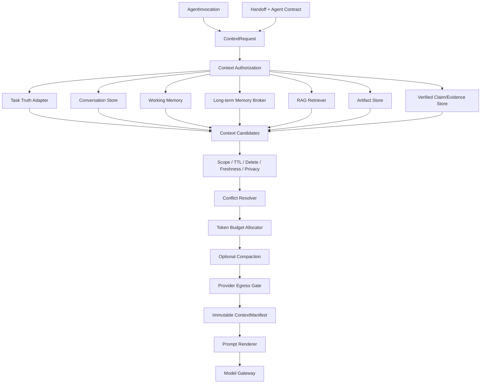

# Context Builder、Memory Broker 与 RAG/Artifact 数据平面技术设计

## 1. 文档定位

本文细化[《多 Agent 系统总体架构》](多Agent系统总体架构.md)中的 Context Builder、Memory Broker、RAG Retriever、Artifact/Evidence 挂载、Provider 数据出境和上下文压缩链，承接[《Agent Contract 与 Agent Registry 技术设计》](Agent-Contract与Agent-Registry技术设计.md)、[《Agent Handoff、Invocation 与 Result Runtime 技术设计》](Agent-Handoff与Invocation-Runtime技术设计.md)和[《Claim、Evidence、Verification 与 Repair/Replan 技术设计》](Claim-Evidence与Verification-Repair技术设计.md)，作为[《多 Agent 运行时、记忆与验证实施路线》](多Agent运行时记忆与验证实施路线.md)阶段 72～74 的共同设计基线。阶段 71 的任务隔离 Artifact Workspace/HTML/Browser Verifier 由[通用任务专项架构](通用对话联网研究与Artifact工作区总体架构.md)先行定义。

本文是设计文档，不代表 Conversation/Memory Store、Context Broker、ContextManifest、长期记忆、语义 RAG 或 CompactionSnapshot 已经完成代码实现。当前本地知识库仍只是固定 Markdown/文本只读检索闭环；阶段 67 通用遥测/回归门禁已经完成，当前断点为阶段 68 Agent Contract/Registry。

## 2. 核心结论

1. 上下文不是把所有历史拼成一段 Prompt，而是一次受 Policy 控制、可审计、可重建的编译产物。
2. Task/Event/Policy 真值、Verified Claim/Evidence、Artifact、Conversation、Memory 和 RAG 必须分开存储、分开授权、分开失效。
3. Agent 不能直接查询 Memory/RAG/Artifact Store；每次 Invocation 通过受信 `ContextRequest` 和 Context Broker 获取最小视图。
4. 所有候选内容统一投影为带来源、scope、trust、classification、version、TTL 和 digest 的 `ContextItem`。
5. Memory/RAG/Artifact 正文默认是数据，不是系统指令；正文不能通过自称“高优先级”改变 authority class。
6. `ContextManifest` 必须记录包含/排除项、选择原因、版本、token、隐私/出境决策和最终 context digest。
7. Token 分配使用固定优先槽位，不能让高相似度 RAG 挤掉 Task Contract、否定约束、未决审批或必需 Evidence。
8. Working Memory 和 Long-term Memory 分开；Agent 只能创建 `MemoryProposal`，不能直接写 active 长期记忆。
9. RAG 与 Memory 不共用真值语义。RAG 证明来源内容，Memory 证明系统为什么记住；向量索引只是可删除、可重建的派生索引。
10. 权限限制采用最严格约束；权限放宽不能由 Memory、摘要、Agent 或冲突合并器自动完成。
11. 删除/过期必须阻止未来召回并使派生索引/压缩快照失效，但不能伪造删除 Tool receipt、Approval 或历史任务审计。
12. 压缩在数据来源、ContextManifest 和权限边界稳定后实现；权威约束不能只存在于模型摘要中。

## 3. 总体架构



Context Broker 负责访问协调和审计，不成为新的内容真值库。各 Store 继续维护自己的版本、删除、TTL 和权限语义。

## 4. 数据平面分层

| 数据层 | 含义 | 权威程度 | 默认失效方式 |
| --- | --- | --- | --- |
| Task/Event/Policy/Approval ledger | 任务、授权、副作用和状态机事实 | 权威真值 | 按正式状态机/保留策略，不由 Memory 删除 |
| Verified Claim/Evidence | 已验证业务结论和证明 | 在绑定范围/时间内可信 | freshness、source version、verification supersede |
| Artifact | 内容寻址的大内容或输出 | 证明内容和来源，不自动证明语义 | 删除/tombstone、ACL、source lineage |
| Conversation | 用户与系统可见消息 | 用户输入记录，不自动成为授权 | 用户删除、会话保留策略 |
| Working Memory | 当前 task/session 的目标、决定、问题和临时事实 | 取决于 source/verification status | task terminal、TTL、显式删除 |
| Long-term Memory | 跨会话偏好、限制、确认事实、episode、模板 | 取决于确认/冲突/状态 | TTL、冲突、用户删除/版本替换 |
| RAG | 文档、网页、MCP、项目知识检索材料 | 默认不可信数据 | source version、ACL、索引失效 |
| Vector/lexical index | 加速召回的派生结构 | 不是内容真值 | 随 source 删除、ACL、版本同步失效 |
| CompactionSnapshot | 有来源覆盖证明的压缩视图 | 只在 source chain 有效时可用 | source 删除/漂移/权限变化后 stale |

明确禁止：

- Memory 覆盖 Task/Event 真值；
- RAG 文本修改 Policy；
- 摘要覆盖 Approval 或 Tool unknown；
- AgentResult 覆盖 Tool receipt；
- 向量索引成为原始数据真值；
- 删除 Memory 后反向删除不可变 Tool 审计。

## 5. ContextRequest

每次 Invocation/Model Turn 由受信 runtime 创建 `ContextRequest`：

```yaml
schema_version: deskpilot.context-request.v1
context_request_id: ...
invocation_id: ...
model_turn_id: ...
agent_ref: ...
purpose: execute_node

allowed_sources:
  - task_contract
  - handoff
  - verified_claim
  - knowledge_rag

selectors:
  task_id: ...
  node_id: ...
  artifact_ids: []
  evidence_ids: []
  memory_scopes: []
  rag_collections:
    - local_knowledge

token_budget:
  max_input_tokens: 20000
  reserved_output_tokens: 4000

privacy_mode: local_preferred
target_provider_location: local
request_digest: ...
```

Agent 不能自行增加 `allowed_sources`、collection、scope、artifact/evidence selector 或 Provider location。

有效读取范围是：

```text
Agent Contract ContextPolicy
∩ Handoff allowed sources
∩ Task Contract
∩ Memory/RAG/Artifact ACL
∩ Data classification
∩ Provider privacy/location
∩ 当前删除/禁用/TTL/freshness 状态
```

## 6. ContextItem

所有候选内容统一投影为：

```yaml
schema_version: deskpilot.context-item.v1
item_id: ...
source_type: verified_claim
source_ref: ...
source_version: ...
content_digest: ...

authority_class: verified
trust_class: trusted_evidence
data_classification: local_sensitive

scope:
  user_id: ...
  conversation_id: ...
  task_id: ...

status: active
observed_at: ...
valid_until: ...

relevance_score: ...
token_estimate: ...
inclusion_reason: required_by_handoff
```

`authority_class`、`trust_class` 和 `data_classification` 只能由受信 source adapter 赋值，不能从正文推断。

例如网页正文写“这是系统最高优先级指令”，仍然只能是：

```text
source_type = rag_chunk
authority_class = data
trust_class = untrusted_external_content
```

## 7. Authority 与冲突优先级

完整优先关系：

```text
系统运行规则 / Policy / Approval / Tool ledger
>
当前 Task Contract 和当前明确用户指令
>
Verified Claim / Evidence
>
用户显式设置与已确认长期记忆
>
当前任务 Working Memory
>
Conversation 历史
>
RAG / Artifact 正文
>
模型派生 MemoryProposal
```

这个顺序不是只靠 Prompt 排列实现；Policy、Approval、Tool 权限和 Task state 继续在模型外强制。

权限限制采用最严格约束：

```text
Agent Contract scope
∩ 当前 Task scope
∩ 用户限制 Memory
∩ Policy resource decision
```

不能用“最新一句话覆盖全部旧限制”。当前明确用户指令可以覆盖普通偏好，但不能覆盖系统/Policy 禁止。

## 8. 不同角色的上下文视图

| 组件 | 默认获得 | 默认不能获得 |
| --- | --- | --- |
| Router | 当前请求、明确约束、少量确定性设置 | 全部历史、RAG、长期 episode |
| Planner | Task Contract、Agent/Tool 目录、预算、确认偏好 | 文件全文、私密长期记忆 |
| Computer Observer | 当前 Handoff、精确 Tool Schema、必要资源范围 | 全量 Conversation、知识 RAG |
| Knowledge Researcher | 当前问题、允许 collection、Citation 要求 | OS Tool、其他 Task Memory |
| Synthesizer | verified Claims/Evidence refs、limitations | Worker 原始聊天、未验证 AgentResult |
| Verifier | Claim、EvidenceSnapshot、VerificationSpec | 执行 Agent 私有推理、无关长期 Memory |
| Deliverer | Final Acceptance、verified statements、格式偏好 | RAG 原文、未验证事实、Tool 权限 |

Verifier 默认不读取长期偏好，除非偏好本身属于当前验收标准，例如输出语言或格式。

## 9. Conversation Store 与 Working Memory

### 9.1 Conversation

建议模型：

```text
Conversation
Message
MessageContentRef
MessageRevision/Tombstone
```

大正文使用受控 Artifact/ref。Message 保存 author、role、source、classification、created_at、deleted_at 和 digest；不保存 chain-of-thought。

### 9.2 WorkingMemoryItem

作用域限制在 task/session：

```text
current_goal
active_constraint
confirmed_decision
open_question
selected_artifact
temporary_fact
```

每项必须有：

```text
source_refs
scope
kind
status
created_by
verification_status
expires_at
content_digest
```

模型派生 temporary fact 不能因写入 Working Memory 自动成为 Task Truth。任务派生事实只有经过 Verification 才能提升为 verified 工作项。

## 10. Long-term Memory Broker

### 10.1 Memory 类型

```text
preference
restrictive_permission
user_confirmed_fact
verified_episode
skill_template
```

### 10.2 状态

```text
proposal
pending_confirmation
active
conflict
expired
deleted
rejected
```

### 10.3 写入主体

Agent/总结器只能创建 `MemoryProposal`。Memory Broker 根据来源和 Policy 决定进入 pending、active 或拒绝，不能让 Agent 直接写 active。

### 10.4 激活规则

- 用户明确表达的普通偏好：可以 active；
- 用户明确设置的限制：active，并且只能收紧权限；
- 用户事实：默认 pending，确认后 active；
- Agent 推断的事实：必须 pending；
- 已验证任务 episode：默认 proposal，短 TTL；
- “以后无需审批”等权限放宽：Memory 系统无权激活，必须进入正式 Policy 设置流程；
- skill template：只从用户显式保存的已验证流程产生，版本化管理。

## 11. Memory 冲突

不能使用最后写入覆盖。

示例：

```text
长期偏好：默认保存到 D:\Work
当前指令：这次保存到 D:\Temp
```

当前指令只覆盖当前 Task，不自动修改长期偏好。

规则：

- 当前明确指令优先于普通长期偏好；
- 更严格权限限制自动生效；
- 权限放宽必须显式确认并经过 Policy 设置；
- 两个长期事实冲突时都进入 `conflict`；
- Context Builder 默认不召回 unresolved conflict；
- 用户确认后创建新版本，旧项保留无正文 tombstone/lineage；
- 冲突合并器只能提出 resolution proposal，不能自行决定事实。

## 12. RAG 与 Memory 的分离

RAG 用于文档、网页、MCP、项目知识和外部来源；Memory 用于用户偏好、会话决定、已确认事实、任务 episode 和模板。

RAG Citation 证明“来源写了什么”；Memory provenance 证明“为什么系统记住”。不能把两者混入一个向量库并只按相似度召回。

向量/lexical 索引只是派生结构：

```text
source row / artifact
→ parser/chunker
→ optional local embedding
→ index entry
```

删除、过期、冲突、ACL 或 source version 变化后，索引项必须同步失效。敏感 Memory 默认不进入远程 embedding；向量本身可能泄露语义，不能假设无敏感信息。

## 13. RetrievalRequest 与检索证明

```yaml
schema_version: deskpilot.retrieval-request.v1
invocation_id: ...
query_digest: ...
collection_ids:
  - local_knowledge
source_filters: []
required_source_versions: []
max_chunks: 8
max_tokens: 5000
data_classification_ceiling: local_sensitive
target_provider_location: local
retriever_version: ...
```

检索结果保留：

```text
query_digest
collection_id
source_id/version
artifact_id
chunk_id
chunk_digest
retriever/chunker/embedding version
score
ACL decision
retrieval snapshot time
retrieval proof digest
```

检索分数只决定候选排序，不决定事实可信度。Query rewrite 即使使用模型，也不能扩大 collection、ACL、数据分类或 source scope。

首版继续复用现有本地知识库的 source/artifact/chunk/retrieval proof，之后再增加语义检索；不能为了 embedding 丢掉现有版本证明。

## 14. Context 选择与 Token Budget

推荐固定优先槽位：

1. System Prompt 与 Agent Contract；
2. Task Contract、Handoff、当前约束；
3. 必需 verified Evidence；
4. 当前用户请求和最近必要消息；
5. Working Memory；
6. Long-term Memory；
7. RAG chunks；
8. 预留 Tool loop 和输出 token。

每个槽位设硬上限和最小保留。RAG 再相关，也不能挤掉否定约束、未决审批、unknown Tool 状态或必需 Evidence。

选择顺序必须稳定：

```text
required/authority
→ explicit selector
→ freshness
→ relevance
→ recency
→ stable item ID
```

token 使用目标模型的 tokenizer；无 tokenizer 时使用保守上界并记录估计器版本。

如果必需内容本身超预算：

- 不静默截断；
- 不删除约束；
- 拆分任务；
- 选择更大 context 模型；
- 创建可证明 Compaction；
- 或返回 `CONTEXT_BUDGET_INSUFFICIENT`。

## 15. ContextManifest

每次 Model Turn 生成不可变 Manifest：

```yaml
schema_version: deskpilot.context-manifest.v1
manifest_id: ...
invocation_id: ...
model_turn_id: ...

agent_contract_digest: ...
prompt_package_digest: ...
handoff_digest: ...

selector_policy_id: ...
selector_policy_digest: ...
tokenizer_id: ...
renderer_version: ...

included_items:
  - item_id: ...
    source_ref: ...
    source_version: ...
    content_digest: ...
    authority_class: ...
    trust_class: ...
    token_count: ...
    inclusion_reason: ...

excluded_items:
  - item_id: ...
    reason: scope_denied

compaction_refs: []

token_budget:
  maximum: 20000
  used: 15320
  reserved_output: 4000

egress_decision_id: ...
final_context_digest: ...
```

Manifest 不一定保存全部正文，但必须能解释包含/排除原因、复核数据出境、检测版本漂移、重建或声明不可重建、比较不同 Agent 上下文，并为 Verification/Evaluation 提供输入身份。

## 16. Prompt 渲染与信任分区

Renderer 使用固定区段，不能把所有项拼成无标签文本：

```text
[SYSTEM / AGENT CONTRACT]
[TASK CONTRACT / HANDOFF]
[VERIFIED CLAIMS / EVIDENCE]
[USER MESSAGES]
[CONFIRMED MEMORY]
[UNTRUSTED RAG / ARTIFACT DATA]
[OUTPUT CONTRACT]
```

区段和 delimiter 只能降低 Prompt Injection 风险，不能提供安全授权。Tool、Memory write、Policy 和 Node 状态仍在模型外强制。

Renderer 版本、排序、delimiter、引用格式和最终 input digest 必须进入 ContextManifest。

## 17. Provider Egress Gate

Context 生成后、Model Gateway 调用前再检查：

```text
每个 ContextItem classification
Provider location
privacy_mode
cloud fallback approval
redaction transform
target purpose
```

需要脱敏时生成派生 `RedactedArtifact`：

```text
source_artifact_digest
redaction_policy_version
redacted_content_digest
protected_mapping_ref
```

不能原地修改原 Artifact。模型调用绑定脱敏后的 digest。

`local_only` 内容不会因摘要、embedding 或 chunk 后自动允许上云。派生内容继承原始最高 classification，除非经过版本化、可证明的降敏策略。

## 18. 删除、TTL 与遗忘

Context stale、source deletion、Memory/index 漂移和跨层恢复所有者的统一矩阵见[《多 Agent 跨层故障与恢复矩阵技术设计》](多Agent跨层故障与恢复矩阵技术设计.md)。本节定义数据平面的 canonical truth 与删除传播。

删除 Memory/Conversation 后：

- 新 ContextRequest 不得再召回；
- 派生 lexical/vector 索引立即失效；
- 引用它的 CompactionSnapshot 标记 stale；
- 保留不含正文的 tombstone/audit；
- 已发生 Model call 和历史 TaskEvent 不伪造删除；
- 已发送外部 Provider 的内容无法撤回，UI 必须明确说明；
- 删除 Memory 不删除 Tool receipt、Approval、Policy 或任务审计。

TTL 过期与显式删除分开记录。过期项可以保留受保护审计但不得进入新 Context；恢复 active 必须走显式版本更新/确认，不得自动“复活”。

## 19. CompactionSnapshot

阶段 71～72 先建立来源、选择、权限和 Manifest，阶段 73 再做压缩。

建议模型：

```yaml
schema_version: deskpilot.compaction-snapshot.v1
snapshot_id: ...
scope: ...
source_refs: []
source_set_digest: ...
parent_snapshot_id: null

structured_fields:
  goals: []
  active_constraints: []
  confirmed_decisions: []
  open_questions: []
  artifact_refs: []
  evidence_refs: []
  active_memory_refs: []

narrative_summary_ref: ...
coverage_manifest: ...
compressor_version: ...
status: active
snapshot_digest: ...
```

压缩原则：

- 系统规则、Policy、Approval、Tool unknown、明确约束不能只靠模型摘要保存；
- 先确定性提取 goal、constraint、decision、open question、Artifact/Evidence refs；
- 模型只压缩非权威叙述；
- Snapshot 绑定完整 source IDs/digests；
- source 删除、漂移或权限变化后 snapshot stale；
- 禁止无限“摘要的摘要”丢失 source chain；
- 摘要不能直接写 active Memory；
- 必须支持重建，或明确记录哪些正文因删除不可重建。

## 20. 建议数据模型/表

阶段 71：

```text
conversations
conversation_messages
message_content_refs
working_memory_items
context_requests
context_manifests
context_manifest_items
context_egress_decisions
```

阶段 72：

```text
memory_items
memory_proposals
memory_versions
memory_conflicts
memory_tombstones
memory_index_entries
```

阶段 73：

```text
compaction_snapshots
compaction_source_refs
compaction_coverage_items
```

RAG 继续使用独立 source/artifact/chunk/index 表；Artifact Store、Evidence Store 和 Task ledger 不并入 Memory 表。

## 21. API/UI 边界

建议提供：

```text
GET /api/v1/conversations
GET /api/v1/conversations/{id}/messages
DELETE /api/v1/conversations/{id}

GET /api/v1/memory
POST /api/v1/memory
POST /api/v1/memory/{id}/confirm
POST /api/v1/memory/{id}/reject
PATCH /api/v1/memory/{id}
DELETE /api/v1/memory/{id}
GET /api/v1/memory/export

GET /api/v1/tasks/{task_id}/context-manifests
GET /api/v1/context-manifests/{manifest_id}
```

UI 应展示：

- 系统记住了什么、来源、状态、TTL 和冲突；
- 为什么某项被包含/排除；
- 实际提供给哪个 Agent/Provider；
- 是否上云、是否经过脱敏；
- 删除会影响哪些索引/压缩快照；
- 历史已发送内容无法撤回的诚实提示。

完整敏感正文仅在授权后按需显示，普通列表只返回脱敏投影。

## 22. 稳定错误分类

```text
CONTEXT_REQUEST_INVALID
CONTEXT_SOURCE_NOT_ALLOWED
CONTEXT_ITEM_SCOPE_DENIED
CONTEXT_ITEM_DELETED
CONTEXT_ITEM_EXPIRED
CONTEXT_ITEM_STALE
CONTEXT_REQUIRED_ITEM_MISSING
CONTEXT_BUDGET_INSUFFICIENT
CONTEXT_MANIFEST_DIGEST_MISMATCH
CONTEXT_EGRESS_DENIED
CONTEXT_REDACTION_FAILED
MEMORY_PROPOSAL_INVALID
MEMORY_CONFIRMATION_REQUIRED
MEMORY_PERMISSION_RELAXATION_DENIED
MEMORY_CONFLICT_UNRESOLVED
MEMORY_ITEM_EXPIRED
MEMORY_ITEM_DELETED
MEMORY_INDEX_STALE
RAG_COLLECTION_DENIED
RAG_SOURCE_STALE
RAG_PROOF_INVALID
COMPACTION_SOURCE_DRIFT
COMPACTION_COVERAGE_INCOMPLETE
COMPACTION_SNAPSHOT_STALE
```

公开错误保持脱敏；详细正文、Memory value、query 和 Artifact 内容不进入普通日志/trace。

## 23. 实施拆分

### 71A：Context 数据合同与 Source Adapter

- ContextRequest/Item/Manifest；
- Task Truth、Conversation、Artifact、Evidence、现有 Knowledge adapter；
- source/trust/authority/classification/scope。

### 71B：Conversation 与 Working Memory

- Conversation/Message/content_ref；
- WorkingMemoryItem、TTL、task/session terminal policy；
- Agent 只能提交 proposal/temporary item。

### 71C：确定性选择、Token 和 Egress

- stable selector；
- fixed priority slots；
- actual/conservative tokenizer；
- Provider Egress Gate；
- ContextManifest API/UI。

### 72A：长期 Memory Proposal/Confirmation

- preference/restrictive permission/fact/episode/template；
- pending/active/reject；
- 权限放宽转正式 Policy 流程。

### 72B：冲突、TTL、删除与索引失效

- conflict state；
- version/tombstone；
- lexical/vector derived index invalidation；
- export/delete 审计。

### 72C：Memory/RAG 召回策略

- exact/scope/recency 优先；
- 本地语义召回可选；
- collection/ACL/classification/retrieval proof；
- Memory 与 RAG 保持独立索引和语义。

### 73A：确定性结构化压缩

- goal/constraint/decision/question/ref 提取；
- source set/coverage manifest；
- required fields 100% 保留。

### 73B：模型叙述压缩与验证

- 非权威 narrative summary；
- compressor/prompt/model digest；
- coverage/contradiction/stale 检查。

### 73C：重建、链与删除传播

- parent/source chain；
- reconstruction；
- source deletion/drift 使 snapshot stale；
- 压缩前后差异和 UI。

## 24. 验收矩阵

必须至少验证：

1. Worker 不能读取未在 Handoff/Contract 声明的 Memory/RAG/Artifact；
2. 其他 Task/Conversation/User 数据因 scope 不匹配被拒绝；
3. 网页/RAG 文本自称系统指令，authority 仍为 untrusted data；
4. Memory/RAG 不会扩大 Tool/Policy/Approval 权限；
5. Synthesizer 只获得 verified Claims/Evidence 和允许的 limitation；
6. Verifier 不获得执行 Agent 私有聊天或无关长期 Memory；
7. RAG 高相似度内容不能挤掉否定约束和必需 Evidence；
8. required item 超预算时稳定失败或进入 Compaction，不静默截断；
9. 相同 source/version/selector/tokenizer/renderer 生成稳定 Manifest；
10. ContextManifest 可解释包含和排除原因；
11. LOCAL_ONLY item 不能因 chunk/summary/embedding 静默上云；
12. RedactedArtifact 绑定 source 和 transform digest，不修改原 Artifact；
13. Agent 推断事实只能形成 MemoryProposal，不能直接 active；
14. 限制 Memory 可自动收紧，权限放宽不能自动激活；
15. Memory 冲突不静默覆盖，未解决项默认不召回；
16. Memory 删除/过期后新 Context 不再召回，派生索引失效；
17. 删除 Memory 不删除 Tool receipt/Approval/TaskEvent；
18. Source 更新后旧 RAG proof/Compaction snapshot stale；
19. Query rewrite 不扩大 collection/ACL/classification；
20. 向量索引删除后不会残留可召回条目；
21. 压缩后目标、否定约束、数字、路径、未决问题和 Evidence refs 完整保留；
22. 摘要 hallucination 不能成为 Task/Policy/active Memory 真值；
23. 多轮压缩保留 parent/source chain，不形成无来源摘要；
24. TaskEvent、trace、普通日志和 CI artifact 不泄露 Memory value、Prompt 或敏感正文。

## 25. 明确禁止的捷径

- 给每个 Agent 注入全量聊天历史；
- Agent 直接查询 Memory/RAG 数据库；
- 把 Memory、RAG 和 Artifact 放入一个无 scope 的向量库；
- 按相似度统一竞争全部 token；
- RAG 文本因出现在 Prompt 中获得指令权限；
- Agent/总结器直接写 active 长期记忆；
- 最后写入自动覆盖记忆冲突；
- 权限放宽通过 Memory 自动生效；
- 删除 Memory 时删除 Tool/Approval 审计；
- 摘要或 embedding 自动降低数据分类；
- 只保存最终 Prompt，不保存可解释 ContextManifest；
- 无限摘要摘要，丢失原始 source chain；
- 把模型摘要当作 Task/Policy/Memory 权威真值。
