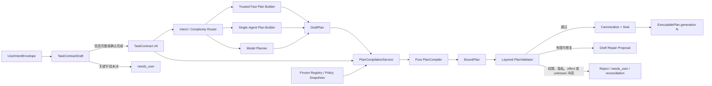
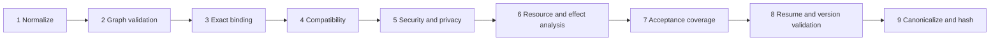

# Task Contract、DraftPlan 与 ExecutablePlan Compiler 技术设计

## 1. 文档定位

本文细化 D1：怎样把用户目标、受信应用输入和不可信模型计划编译成版本化、可恢复、可验证的 `ExecutablePlan`。它衔接 Task Contract、Agent/Tool Registry、Verification、Context、Policy 和 Task Runtime，但不负责 Agent Model Loop 的内部协议。

本文当前状态是“候选详细设计，待用户确认关键取舍”。它不是功能完成说明。阶段 67 的脱敏 OpenTelemetry 与显式回归门禁已经完成；D1 仍在阶段 68A Agent Contract/Registry 之后作为阶段 68B 实施。

## 2. 当前代码事实与真实缺口

当前 `backend/src/deskpilot/domain/planning.py` 中：

- `TaskClassification.recommended_agent` 和 `PlanStep.agent` 都只是字符串；
- `TaskPlan` 只保存 summary、最多 20 个步骤和顺序依赖；
- 图校验能拒绝重复 step、自依赖和引用后置节点，但没有 Agent/Prompt 精确绑定；
- 没有 Task Contract version/digest、acceptance coverage、Context/Verification 绑定或 Plan generation。

当前 `TaskCheckpointPayload` 是面向既有单流程 Tool 主干的受保护 v1 checkpoint。它可以绑定分类、简单计划、Tool、Policy、Approval 和 effect graph，但不适合作为多 Agent 计划清单或多节点运行真值。

因此不能通过给现有 `PlanStep` 增加几个 digest 字段就宣称完成 D1。至少需要独立的 Contract/Plan 领域模型、不可变 Plan manifest、编译服务和运行图实例化边界。

## 3. 核心结论

1. `TaskContract` 不是模型摘要，而是用户显式输入、受信应用输入、受信默认值和 Policy 收紧规则共同形成的任务授权上限与验收合同。
2. 已封存 Contract 不原地修改；用户补充或修改目标时创建新 version，并触发新 Plan generation。
3. 三种执行路径都产生非执行态 `DraftPlan`，再经过同一个 Compiler/Validator；计划来源不同，但任何 Draft 都不能授予权限。
4. 模型只能输出 selector、目标分解、依赖和建议参数表达式，不能输出可信 digest、Approval、Policy grant 或成功结论。
5. `BoundPlan` 是绑定精确 Agent/Tool/Prompt/Verification/Context 引用的编译期中间对象；首版不要求单独持久化。
6. `ExecutablePlan` 只有在图、兼容性、安全、预算、资源冲突和 acceptance coverage 全部通过后才能封存。
7. Plan Compiler 使用纯确定性核心；数据库 snapshot 加载、原子持久化和事件提交由外层 `PlanCompilationService` 负责。
8. 节点验证策略绑定在可执行节点上，Final Task Acceptance 是显式终点；Approval 不是 Planner 可放置的授权节点。
9. 首版禁止任意条件表达式、动态 fan-out、循环 Handoff 和执行中原地改图；新增工作必须进入受控 Replan 或使用预编译可选节点。
10. Replan 创建完整新 generation，继承历史事实但不继承自由权限；旧 committed/unknown effect、deny 和已消耗预算不能被遗忘。

## 4. 信任升级链



信任不会因为对象改名而自动提升。真正的提升点只有：受信来源确认、Registry 精确解析、本地确定性校验、事务封存和运行时再次执行 Policy。

## 5. UserIntentEnvelope 与 TaskContractDraft

### 5.1 UserIntentEnvelope

`UserIntentEnvelope` 保存进入系统的原始意图和受信输入来源，不是直接给所有 Agent 的 Prompt：

```json
{
  "schema_version": "deskpilot.user-intent-envelope.v1",
  "task_id": "tsk_...",
  "goal_ref": "artifact://task-input/...",
  "trusted_form_inputs": [
    {
      "field": "source_path",
      "value_ref": "protected-input://...",
      "origin": "user_form"
    }
  ],
  "conversation_ref": "conversation://...",
  "requested_output": "structured_report",
  "submitted_at": "..."
}
```

原始大文本、文件内容和敏感表单值使用受控引用，不复制进普通事件、计划摘要或遥测。

### 5.2 TaskContractDraft

Contract Draft 用于承载尚未封存的规范化目标：

- 已确认字段；
- 来自受信模板或系统默认的字段；
- 模型/Router 提出的推断建议；
- 待用户回答的澄清问题；
- 字段 provenance、confidence 和 confirmation state。

只要存在阻塞执行的 `unresolved_required_field`，Contract Draft 就不能进入 Planner。模型建议必须保持 `proposed`，不能因 confidence 高自动变成用户事实。

## 6. TaskContract

### 6.1 建议模型

```json
{
  "schema_version": "deskpilot.task-contract.v1",
  "contract_id": "tc_...",
  "task_id": "tsk_...",
  "version": 2,
  "previous_contract_digest": "sha256:...",
  "goal": {
    "goal_ref": "artifact://task-input/...",
    "normalized_objective": "生成带证据的磁盘与知识报告"
  },
  "acceptance_criteria": [
    {
      "criterion_id": "ac_disk_current",
      "kind": "state_assertion",
      "required": true,
      "verification_requirement": "deterministic_evidence",
      "freshness_seconds": 30,
      "origin": "trusted_template"
    }
  ],
  "constraints": [],
  "resource_scopes": [],
  "privacy_policy": {},
  "risk_posture": {},
  "budgets": {},
  "output_contract": {},
  "confirmation_policy": {},
  "created_by": "local_user",
  "contract_digest": "sha256:..."
}
```

### 6.2 字段分组

| 分组 | 必要内容 | 不能表达的内容 |
| --- | --- | --- |
| Goal | 原始目标引用、规范化目标、语言和输出意图 | Planner 选择的 Tool 或执行步骤 |
| Acceptance | criterion ID、required、criticality、freshness、最低 verification requirement | Agent 自报成功 |
| Constraints | 时间、格式、禁止事项、用户偏好、数据范围 | 绕过 Policy 的例外 |
| Resource scopes | 用户明确选择或受信应用解析的资源上限 | 模型猜测的写路径 |
| Privacy | classification、允许的 Provider location/egress、retention | Prompt 中的口头保密承诺 |
| Risk posture | 最大风险、是否预览计划、是否允许自动 retry/replan | 对精确 Tool 的实际批准 |
| Budgets | wall time、Token、费用、turn、Agent、Tool、replan、并发上限 | Worker 自行扩容或超支 |
| Output | Schema、语言、引用、partial 表达要求 | Deliverer 新增事实 |

### 6.3 AcceptanceCriterion

验收条件必须有稳定 ID，至少区分：

- `state_assertion`：可由 Tool receipt、后置状态或确定性 grader 证明；
- `artifact_requirement`：必须产生特定 Schema/分类的 Artifact；
- `citation_requirement`：结论必须绑定可解析 Citation/Evidence；
- `semantic_quality`：需要独立语义 grader 或用户确认；
- `safety_invariant`：不得发生某类权限、数据出境或副作用；
- `output_requirement`：格式、语言、完整性和 partial 披露。

Planner 可以建议新的非安全 criterion，但不能删除或降低已有 required/safety criterion。模型新增 criterion 若改变任务范围、费用或数据访问，需要用户确认后进入新 Contract version。

## 7. Contract 的来源与权限

### 7.1 来源等级

| 来源 | 可以直接进入 sealed Contract | 说明 |
| --- | --- | --- |
| 用户显式输入 | 可以 | 仍受系统 Policy 上限约束 |
| 受信固定 UI/Task template | 可以 | 必须版本化并记录 template digest |
| 受信系统默认 | 可以 | 只能填充不扩大用户授权的默认值 |
| Policy | 只可收紧 | 可降低预算、缩小 scope、提高审批或验证要求 |
| Router/Planner/Agent 推断 | 不可以 | 只能形成 proposal 或 clarification |
| RAG/Memory/MCP/网页内容 | 不可以 | 属于数据，不是任务授权来源 |

### 7.2 权限上限

有效运行权限仍是交集：

```text
Agent Contract allowlist
∩ ExecutablePlan node scope
∩ TaskContract resource/privacy/risk limits
∩ current Policy decision
∩ exact Approval grant
∩ Runner capability and OS boundary
```

Contract 不能通过 omission 恢复默认宽权限。缺失关键范围时应 `needs_user` 或采用明确的最小安全默认值。

## 8. Contract version 与 amendment

### 8.1 不可变版本链

- sealed Contract 不允许原地 PATCH；
- amendment 创建 `version + 1` 和新的 canonical digest；
- previous digest 形成版本链；
- 旧 Plan 永久绑定旧 Contract；
- 当前 active Contract 只是一个受控指针，不改写历史。

### 8.2 Amendment 类型

| 类型 | 发起者 | 是否需要用户确认 | 对 active Plan 的影响 |
| --- | --- | --- | --- |
| 用户修改目标/范围 | 用户 | 已显式确认 | 停止扩展旧图，进入 Replan |
| 用户修改输出格式 | 用户 | 已显式确认 | 默认生成新 generation，可复用已验证事实 |
| Policy 收紧 | 系统 | 不需要 | 立即应用；未派发节点重校验 |
| Router/Agent 建议补充 | 模型 | 需要 | 保持 proposal，不能执行 |
| 自动扩大预算/范围 | 任意自动组件 | 禁止 | 必须由用户显式 amendment |

已发生副作用继续由原 Contract/Plan/Approval/ledger 证明，不能因新 Contract 存在而改写历史合法性。

## 9. DraftPlan

### 9.1 统一外形，不同来源

三条路径都产生 `DraftPlan`，但必须记录 producer：

- `trusted_template`：固定快速计划；
- `single_agent_template`：固定单 Agent 拓扑；
- `model_planner`：模型候选计划。

统一 Draft 外形可以复用 Compiler，但 `trusted_template` 失败属于代码/配置缺陷，不能自动交给模型修复。

### 9.2 DraftNode 建议字段

```json
{
  "local_key": "observe_disk",
  "kind_hint": "agent",
  "objective": "取得当前磁盘容量证据",
  "agent_selector": "builtin.computer_observer",
  "capability_requirements": ["computer.disk.observe"],
  "tool_selectors": ["computer.disk_usage"],
  "input_selectors": ["task.resource_scope:target_disk"],
  "output_schema_selector": "deskpilot.disk-observation.v1",
  "depends_on": [],
  "acceptance_refs": ["ac_disk_current"],
  "condition_hint": null
}
```

### 9.3 DraftPlan 禁止承载

- `contract_digest`、`agent_contract_digest`、`prompt_package_digest`；
- `policy_effect=allow`、`approved=true` 或 Approval token；
- 可执行凭据、密钥、Cookie 或原始敏感内容；
- 未经 Contract 来源约束的绝对写路径；
- `verification=skip` 或降低 required criterion；
- `already_completed=true`、伪造 receipt/Evidence；
- 任意代码、SQL、Python、Shell 或条件表达式。

出现这些字段时首版建议直接 `DRAFT_FORBIDDEN_FIELD`，而不是静默接受。对模型生成的可信身份字段可以选择“拒绝整份 Draft”而非只忽略，以便评测发现 Prompt/Schema 漂移。

## 10. BoundPlan

`BoundPlan` 是 Compiler 内部的 typed intermediate representation：

- selector 已解析为精确 `BoundAgentRef`、`BoundToolRef`；
- Prompt Package、Agent Contract、Tool Contract、Verification Policy 和 Context Policy 均有精确 version/digest；
- input/output selector 已解析为受控类型；
- budget 已从 Contract、Agent、Tool、系统上限求交；
- resource intent 和 data classification 已计算；
- acceptance refs 已映射，但尚未完成全局 coverage/conflict 校验。

首版不建议单独建 `bound_plans` 表。编译失败时保存脱敏 validation report 和原始 Draft 审计引用即可；成功时只持久化最终 canonical `ExecutablePlan`。

## 11. ExecutablePlan

### 11.1 Plan manifest

```json
{
  "schema_version": "deskpilot.executable-plan.v1",
  "plan_id": "eplan_...",
  "task_id": "tsk_...",
  "plan_generation": 1,
  "task_contract_ref": {
    "contract_id": "tc_...",
    "version": 1,
    "digest": "sha256:..."
  },
  "producer": {
    "kind": "model_planner",
    "request_id": "mdl-...",
    "provider_id": "...",
    "model": "..."
  },
  "registry_snapshot_refs": {},
  "global_budget": {},
  "nodes": [],
  "edges": [],
  "acceptance_coverage": [],
  "plan_manifest_digest": "sha256:..."
}
```

### 11.2 首版节点类型

| kind | 作用 | 关键限制 |
| --- | --- | --- |
| `deterministic_action` | 本地确定性转换、读取或控制计算 | 不能隐式产生 OS 副作用 |
| `agent_invocation` | 实例化精确 Agent Contract | Tool 循环仍走 Policy/Runner 子账本 |
| `tool_invocation` | 无需模型的直接受控 Tool 工作 | 精确 Tool/参数来源/Policy 边界 |
| `join` | 对已验证上游状态做确定性汇合 | 不调用模型，不创造新事实 |
| `final_acceptance` | 检查全部 Task Contract coverage 和未决风险 | 与节点 verifier 分离 |
| `delivery` | 只基于已验证视图生成输出 | 不能读取未验证 AgentResult |

Approval 不是节点 kind。Clarification 默认发生在 Contract sealed 之前，也不作为普通执行节点。

### 11.3 ExecutableNode

每个节点至少绑定：

- `node_id`、`local_key`、generation 和 `node_spec_digest`；
- 精确 execution kind 与 implementation reference；
- `BoundAgentRef` 或 `BoundToolRef`，二者按 kind 互斥；
- typed input selectors、output contract 和 Artifact classification；
- `ContextPolicyRef`、`VerificationSpecRef`；
- node budget、retry/repair policy、timeout；
- resource intents、effect class、idempotency requirement；
- dependency edges 和条件 proof requirement；
- acceptance criterion refs。

## 12. Edge 与条件分支

### 12.1 Edge requirement

首版建议只支持：

- `verified`：上游节点必须验证通过；
- `verified_or_partial`：仅当 Contract/VerificationSpec 明确允许 partial；
- `terminal_for_join`：join 需要观察全部指定分支终态；
- `condition_true`：条件证明为 true 且来源是已验证 Evidence；
- `condition_false`：同一不可变 decision proof 的 false 分支。

原始 AgentResult、模型自由文本、Memory 摘要或网页内容不能直接决定 ready。

### 12.2 首版限制

- 条件只能引用注册的 deterministic predicate；
- predicate 输入必须是 typed、verified Evidence；
- 不接受模型生成表达式；
- 不支持运行时动态 fan-out；
- 不支持环；
- 节点总数继续不超过 20；
- Handoff/递归深度由 Contract 与系统上限共同限制。

需要动态扩展时进入 Replan；若某分支可预见，应预编译为 guarded optional node。

## 13. PlanCompilationService 与纯 Compiler

### 13.1 职责分离

| 组件 | 负责 | 不负责 |
| --- | --- | --- |
| `PlanCompilationService` | 加载一致 snapshot、分配 generation、调用 Compiler、事务保存、写事件/Outbox | 隐式修正模型意图 |
| `PlanCompiler` | normalize、bind、validate、canonicalize、计算 digest | 访问数据库、Provider 或 Runner |
| Registries | 精确解析 Agent/Tool/Prompt/Verification/Context policy | 选择用户权限 |
| `PlanActivationService` | 从 sealed Plan 实例化 TaskExecutionRun/Node/Edge | 重新解释 Draft |

### 13.2 CompilationInputs

纯 Compiler 的完整输入应显式包含：

- exact TaskContract；
- DraftPlan 与 producer identity；
- frozen Agent/Prompt/Tool registry view；
- VerificationPolicyRegistry view；
- ContextPolicy catalog；
- system limits 与 static Policy constraints；
- Replan 时的 `ExecutionSnapshot`；
- compiler/schema/canonicalization version。

不允许 Compiler 在执行中读取“最新配置”，否则相同输入无法 Replay，编译期间配置变化也会产生混合版本计划。

## 14. 编译流水线



### 14.1 Normalize

- 只接受已知 schema version；
- 规范化集合顺序、枚举和 typed selector；
- 不通过文本清洗偷偷改变路径、权限或目标；
- canonicalization version 是 manifest 的一部分。

### 14.2 Graph validation

- local key 唯一；
- DAG 无环；
- 边引用存在；
- 节点、深度、分支和 join 有界；
- final acceptance 和 delivery 拓扑合法。

### 14.3 Exact binding

- Agent、Tool、Prompt、Verification、Context policy 精确解析；
- unknown/ambiguous/disabled/revoked fail closed；
- Draft 不能选择 Contract 不允许的数据或 capability。

### 14.4 Compatibility

- Agent I/O 与节点 I/O 匹配；
- Tool allowlist、handoff allow/receive、模型能力和 privacy location 相容；
- 上游 Artifact/Evidence 类型与下游 selector 匹配；
- VerificationSpec 能验证声明的 output/criterion。

### 14.5 Security、privacy 与预算

- 权限逐层求交；
- Provider egress 不超过输入最高 classification；
- node/global budget 不超过 Contract 和系统上限；
- Planner 不能通过拆节点绕过总调用/Token/费用上限。

### 14.6 Resource/effect analysis

- 读取可并行；写入只有证明资源不冲突且 effect 可交换时才允许并行；
- 非幂等 Tool 必须声明稳定 operation identity 和 reconciliation strategy；
- 与旧 committed/unknown effect 冲突的新节点拒绝激活；
- 编译期静态通过不代替运行时资源版本复核和 Policy。

### 14.7 Acceptance coverage

每个 required criterion 必须映射到：

- 一个或多个节点的 `VerificationSpecRef`；或
- Final Task Acceptance 中的确定性/语义/人工验收项。

Compiler 生成 coverage matrix。以下都应拒绝：

- required criterion 无覆盖；
- 只有 Agent 自报成功；
- safety criterion 被语义 Judge 替代；
- freshness 要求高于 Evidence 能力；
- delivery 节点被当作事实验证器。

## 15. 身份、generation 与 digest

### 15.1 推荐身份

- Contract identity：`(task_id, contract_version)`；
- Plan identity：`(task_id, plan_generation)`；
- Node identity：`(task_id, plan_generation, local_key)` 的稳定派生 ID；
- Node spec：单独 `node_spec_digest`；
- Runtime attempt：由阶段 69 `AgentInvocation`/Tool/Verification attempt 单独分配。

Node ID 必须包含 generation，不能因为新旧计划有同名步骤就复用运行身份。`local_key` 可以用于 plan diff 和 lineage，但不是跨代幂等授权。

### 15.2 Canonical digest

- 使用固定 canonical JSON 规则；
- digest 覆盖 schema/canonicalization version；
- `plan_manifest_digest` 覆盖实际引用的 Contract、Agent、Prompt、Tool、Verification 和 Context policy digest；
- Registry snapshot ID 用于审计，但新增无关 Agent 不应使旧 Plan 失效；
- secret、原文和时间性运行字段不进入可公开 manifest。

## 16. Policy 与 Approval 边界

Plan 编译只做静态安全检查和能力收敛，不能生成最终运行授权。

运行时仍需：

1. 从已绑定节点和受信输入解析精确 Tool request；
2. 计算当前资源版本和 classification；
3. 调用 Policy Engine；
4. 必要时创建绑定 exact request 的 Approval；
5. 通过 Runner capability、fence 和 receipt 提交。

Plan 中可以记录 `may_require_approval` 或最低风险提示，但 `approved=true` 永远无效。

## 17. Draft repair

### 17.1 候选规则

模型 Draft 首版最多自动修复一次，并沿用同一 Contract、同一最大预算和受限错误投影。

可提供给模型的错误：

- `DRAFT_SCHEMA_INVALID`；
- `PLAN_GRAPH_INVALID`；
- `CAPABILITY_MISMATCH`；
- `OUTPUT_SCHEMA_INCOMPATIBLE`；
- `ACCEPTANCE_UNCOVERED`。

禁止自动修复：

- 用户或 Policy deny；
- privacy/egress 冲突；
- 资源范围、风险或预算需要扩大；
- revoked Agent/Tool/Prompt；
- committed/unknown effect 冲突；
- 用户必须澄清的目标歧义；
- 非幂等写缺少 reconciliation strategy。

固定模板或单 Agent 模板编译失败是软件/配置错误，进入告警和失败分类，不能让 Planner 自由改写。

## 18. Replan generation

### 18.1 ExecutionSnapshot

Replan 只能读取受信快照：

- active Contract ref/digest；
- 旧 Plan generation/digest；
- verified Artifact/Evidence 及 freshness；
- committed Tool effect、operation identity 和 receipt；
- outcome unknown、reconciliation 状态和冲突资源；
- Policy deny、用户 deny 和不可重试原因；
- Approval 历史引用及是否已消费；
- 已用/剩余预算；
- failed/rejected/partial node 及稳定错误码。

Approval 记录随快照保留用于审计，但不能自动变成新 Plan 的通用 grant。首版不把已消费 Approval 重新绑定到新 node；即使操作看似相同，也继续以 Tool ledger/operation identity 防重，并按当前 Policy 决定是否需要新审批。

### 18.2 新代约束

- 旧 Plan immutable；
- 新 Contract 时绑定新 Contract version；
- 新 Plan generation 和所有 node identity 全部更新；
- 仍可复用的 verified Evidence 通过 source ref 导入，不复制为新事实；
- committed effect 作为已发生前置事实，不能重新计划为待执行；
- unknown effect 在对账前阻止冲突资源上的新写；
- deny 作为约束继承，不能通过更换 Agent/Tool 绕过；
- 激活新 generation 前必须停止旧 generation 扩展，处理仍在途 attempt。

## 19. 持久化与原子激活

### 19.1 建议持久化对象

- `task_contract_versions`：不可变 Contract、digest、previous digest、provenance；
- `task_plan_generations`：Draft audit ref、producer、status、validation report、manifest digest；
- immutable ExecutablePlan JSON manifest；
- `task_execution_runs/nodes/edges`：阶段 69 运行实例；
- Plan/Contract 事件和 Outbox。

不建议把完整多 Agent Plan 塞入 `TaskCheckpointPayload.v1`。现有 checkpoint 继续服务旧主干，阶段 68/69 通过新 schema 和迁移建立并行兼容路径。

### 19.2 原子边界

同一数据库事务中至少完成：

- 分配 plan generation；
- 保存 canonical manifest 与 digest；
- 保存 validation success；
- 若立即激活，创建 execution run/node/edge；
- 更新 task active generation；
- append event/outbox。

不能出现 Task 指向一个尚未完整写入的 Plan，或节点已 ready 但 Plan manifest 尚未封存。

## 20. 稳定错误分类

| code | 含义 | 默认动作 |
| --- | --- | --- |
| `TASK_CONTRACT_INCOMPLETE` | 必需字段未确认 | `needs_user` |
| `TASK_CONTRACT_STALE` | Contract/version/digest 已变化 | 重新编译 |
| `DRAFT_SCHEMA_INVALID` | Draft 不符合受限 Schema | 有限 repair 或失败 |
| `DRAFT_FORBIDDEN_FIELD` | Draft 试图携带可信身份/授权 | 拒绝并计入安全评测 |
| `PLAN_GRAPH_INVALID` | 环、缺边、非法 join/终点 | 有限 repair |
| `PLAN_BINDING_UNKNOWN` | selector 无法精确解析 | fail closed |
| `PLAN_BINDING_REVOKED` | 引用已撤销组件 | fail closed/人工处理 |
| `PLAN_CAPABILITY_MISMATCH` | Agent/Tool/I/O/Handoff 不兼容 | 有限 repair |
| `PLAN_PRIVACY_CONFLICT` | 数据出境或分类不兼容 | 拒绝或用户选择本地路径 |
| `PLAN_BUDGET_EXCEEDED` | Draft 超出 Contract/系统预算 | 缩减建议或用户 amendment |
| `PLAN_EFFECT_CONFLICT` | 写资源或幂等/unknown 冲突 | 对账/人工处理 |
| `PLAN_ACCEPTANCE_UNCOVERED` | 必需 criterion 无验证覆盖 | 有限 repair/needs_user |
| `PLAN_MANIFEST_DRIFT` | 执行前精确 digest 漂移 | fail closed/重编译 |
| `PLAN_ACTIVATION_CONFLICT` | generation 已被并发激活或替换 | 重读当前状态 |

错误返回模型时只提供稳定、脱敏、最小字段，不泄露禁用组件、绝对路径、凭据或 Policy 内部规则。

## 21. API 与用户控制面接口

候选 API：

| 方法 | 路径 | 作用 |
| --- | --- | --- |
| GET | `/api/v1/tasks/{task_id}/contract` | 当前 sealed Contract 脱敏投影 |
| GET | `/api/v1/tasks/{task_id}/contracts` | version 链与 amendment 摘要 |
| POST | `/api/v1/tasks/{task_id}/contract:amend` | 用户显式修订并生成新 version |
| GET | `/api/v1/tasks/{task_id}/plans` | Plan generation 列表 |
| GET | `/api/v1/tasks/{task_id}/plans/{generation}` | ExecutablePlan、coverage 和验证后的 manifest 投影 |
| GET | `/api/v1/tasks/{task_id}/plans/{generation}:diff` | 与上一 generation 的目标、权限、节点和 effect diff |

前端可以提交 amendment intent，但不计算 digest、coverage、Agent binding、ready 或审批状态。Validation issue 只显示用户可行动的信息。

## 22. 建议代码落点

```text
backend/src/deskpilot/
├── domain/
│   ├── task_contracts.py
│   ├── draft_plans.py
│   └── executable_plans.py
├── application/
│   ├── plan_compiler.py
│   ├── plan_compilation_service.py
│   └── plan_activation_service.py
├── infrastructure/
│   └── plan_registry_snapshots.py
└── api/routes/
    └── task_contracts.py
```

首版可以让 `BoundPlan` 只存在于 `plan_compiler.py` 内部。不要立刻引入第二编排框架；编译后的运行实例仍进入既定 Task Runtime/Scheduler。

## 23. 实施拆分

### 68B-1：Task Contract

- UserIntentEnvelope/Contract Draft/Contract version；
- provenance、canonical digest、amendment；
- 只读投影和 needs_user。

### 68B-2：DraftPlan 与 Compiler core

- 受限 Draft schema；
- 三种 producer；
- pure compile、binding、machine issues；
- deterministic canonicalization。

### 68B-3：Validation 与 coverage

- capability/I/O/privacy/budget/effect checks；
- acceptance coverage matrix；
- 条件边和 join 静态校验。

### 68B-4：Persistence 与 activation

- Plan generation、manifest、atomic event/outbox；
- 从 Plan 实例化空运行图；
- drift/revocation/recovery checks。

### 68B-5：Replan 输入与 generation

- ExecutionSnapshot；
- committed/unknown/deny/budget 继承；
- plan diff 和冲突门禁。

## 24. 验收矩阵

1. 模型 Draft 自带伪造 Agent/Prompt/Tool digest 时整份拒绝；
2. 同一 CompilationInputs 重复编译得到相同 manifest digest；
3. 新增无关 Agent 不使旧 Plan 失效；实际绑定 Agent digest 漂移使执行 fail closed；
4. unknown/disabled/revoked/ambiguous selector 不能产生 ExecutablePlan；
5. Agent allowlist、Tool capability、I/O Schema 或 Handoff 任一不兼容均拒绝；
6. required/safety criterion 无覆盖时拒绝；语义 Judge 不能覆盖确定性 safety criterion；
7. 模型拆分多个节点也不能绕过总 Token/费用/Tool 预算；
8. 条件边引用未验证 AgentResult 或自由文本时拒绝；
9. 冲突写节点不能并行；无法证明幂等/对账的非幂等 Tool 拒绝；
10. Contract amendment 创建新 version 和新 Plan generation，旧 Plan/事件不可改写；
11. Replan 不重放 committed/unknown effect，不绕过 deny，不重用旧 node identity；
12. Plan 保存与 execution activation 故障注入证明不存在半封存/半激活状态；
13. Draft repair 超过一次、扩大 scope/risk/budget 或触碰 deny 时拒绝；
14. API/UI 只展示服务端 coverage、digest 和状态，不在浏览器重算。

## 25. 明确禁止的捷径

- 把模型总结直接当 Task Contract；
- 让 Planner 输出可信 digest 或 Approval；
- 把 Agent Registry 解析成功当作整份 Plan 安全证明；
- 只验证 DAG 无环，不验证 acceptance coverage；
- 用 Prompt 指令代替 resource/privacy/Policy 交集；
- 执行中原地修改 Plan JSON；
- Replan 忘记 committed、unknown、deny 或已消耗预算；
- 为了表达 Approval 把“审批节点”当成授权事实；
- 为每个中间名词建表却没有明确真值和原子边界；
- 把多 Agent Plan 塞入旧单流程 checkpoint 并继续依赖进程内 `_TaskRuntime` 作为真值。

## 26. 待确认决策

以下仍是推荐值，不记录为用户最终决定：

| 决策 | 当前推荐 | 主要代价 |
| --- | --- | --- |
| Contract 更新 | sealed 后不可变，使用 versioned amendment | 简单格式修改也会产生新 version |
| Compiler 结构 | pure core + transactional application service | 需要显式构造 snapshot 输入 |
| 动态计划 | 首版无动态 fan-out/任意表达式 | 自主扩图能力延后 |
| Draft repair | 模型最多一次，只修结构/兼容/coverage | 一些可修计划会更早失败 |
| Verification | node 绑定 spec，Final Acceptance 显式存在 | Plan manifest 更丰富 |
| Approval | 运行时精确 Policy/Approval 状态，不是计划授权节点 | UI 需要把计划预览与实际审批分开 |
| BoundPlan 持久化 | 首版不单独持久化 | 编译调试依赖 validation report 和 Draft 审计引用 |

确认后，应把本节状态改为正式 ADR 结论，并在[《多 Agent 后续技术架构讨论总纲》](多Agent后续技术架构讨论总纲.md)中把 D1 标记为“已确认待实现”。

## 27. 与后续设计的接口

- D2 Agent Model Loop 只执行 `agent_invocation` 节点绑定的 Agent/Prompt/Context/Tool 上限；
- D3 故障矩阵必须覆盖 compilation、seal、activation、replan 的每个事务与外部边界；
- D4 Scheduler 只 claim 已激活 generation 的运行节点；
- D5 Telemetry 记录 Contract/Plan/generation/digest 的低敏关联，不记录原始目标正文；
- D6 Eval 必须覆盖伪造 digest、coverage 缺失、动态扩权和 Replan 遗忘；
- D7 控制面展示 version/generation/diff/coverage 和 needs_user；
- D8 第三方 Agent 仍须由相同 Compiler 精确绑定、验证和封存，不能拥有旁路执行入口。
