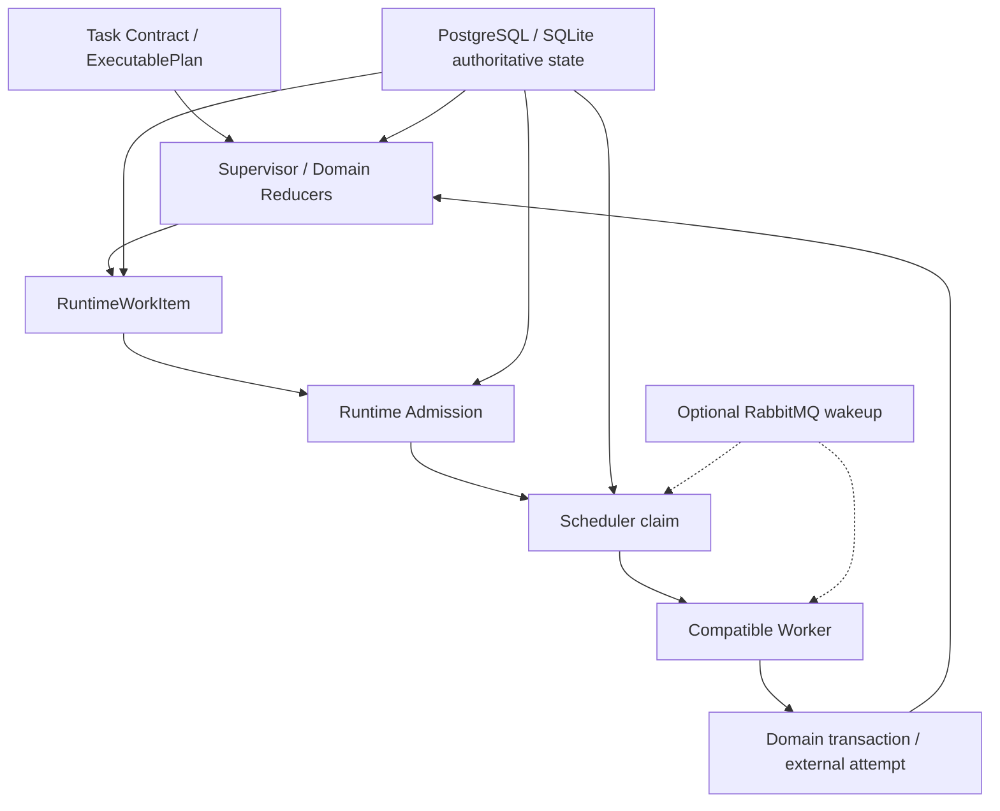
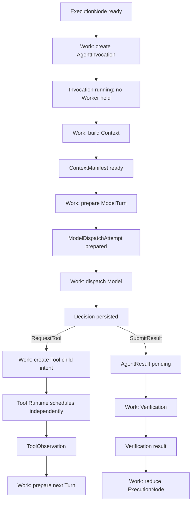
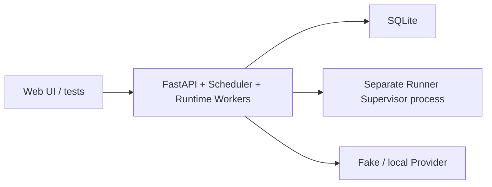
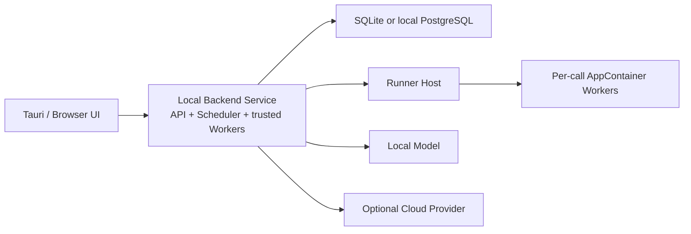
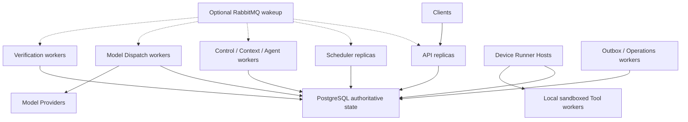

# 多 Agent Scheduler 与部署拓扑技术设计

## 1. 文档定位

本文细化 D4：多 Agent Task、ExecutionNode、AgentInvocation、ModelDispatch、Tool child graph、Verification 和恢复工作怎样共享一个确定性调度协议，同时使用不同容量池、Worker role、设备亲和性和部署 profile。

本文当前状态是“候选详细设计，待用户确认关键取舍”。它不是 `RuntimeWorkItem`、通用 Runtime admission、Worker capability registry 或独立 Runtime 进程已经实现的说明。

现有 Effect DAG Dispatcher、cluster admission、ready membership、PostgreSQL claim/fence、graph-control mailbox 和 Runner 隔离继续有效。D4 不替换 Tool effect graph，也不引入第二个业务真值。

## 2. 当前代码事实与真实缺口

当前工程已有可复用的调度基础：

- Tool Effect DAG ready-set、增量 membership/count、keyset page proof；
- node/graph claim、数据库时间 lease、heartbeat 和单调 fence；
- admission-before-claim、全局/每 graph/每 Tool 容量；
- PostgreSQL 16-shard admission、`SERIALIZABLE` 容量证明和 `SKIP LOCKED/RETURNING`；
- graph round-robin、公平 backpressure、cancel waiter；
- Outbox/Inbox/DLQ 和数据库轮询兜底；
- Graph-control owner mailbox；
- Runner Supervisor 与每调用 AppContainer worker。

当前实际组合根仍由 FastAPI lifespan 在一个 API 进程内创建 `TaskProcessor`、Outbox Publisher、operations、cluster admission、graph-control、Model Gateway 和 Runner Supervisor。`TaskProcessor` 使用进程内 `_TaskRuntime` 与 `asyncio.Task` 驱动上层线性阶段；这不适合作为并行多 Agent 的跨进程真值。

多 Agent 还缺少：

1. ExecutionNode/Invocation/Turn/Verification 的统一短工作调度协议；
2. Provider、Context、Verifier、Runner 等不同资源池的共同公平与 backpressure；
3. Worker role/capability/版本/host affinity 注册；
4. Embedded、桌面发布和 PostgreSQL 多实例的明确 profile；
5. rolling upgrade、drain 和 schema/digest 兼容分派；
6. “等待外部事件时释放 Worker/permit”的统一边界。

## 3. 核心结论

1. Supervisor/Reducer 决定“什么工作应存在”，Scheduler 只决定“何时、由谁、在什么容量与 fence 下执行”。
2. Scheduler 调度的是有界状态转换，不是从 Agent Node 开始一直持有到 Tool、审批和 Verification 结束的长工作。
3. 使用统一 `RuntimeWorkItem` 调度协议，但 Agent/Model/Tool/Verification 业务结果继续由各自领域表保存。
4. WorkItem claim 时必须同时验证 subject revision、Plan generation、cancel/supersede/revoke、admission proof、Worker capability 和 fence。
5. 外部资源 admission 发生在 domain claim/dispatch 前；等待容量不创建虚假 running/attempt。
6. 不嵌套持有 Node、Provider、Tool、Verifier 多层 permit；每个外部边界拥有独立 work/attempt/lease。
7. Tool effect graph 保持独立副作用子账本；通用 Runtime 只创建 Tool child intent，不直接执行 Tool。
8. Agent 是 Contract/Prompt/Policy 配置，不为每个 Agent 部署独立服务。
9. control、verification 和 safety recovery 拥有保留容量，不能被普通 Agent 推理饿死。
10. 本地 Tool 强制 device/runner affinity；API/Agent/Verifier 可以与 Tool Host 分进程，但不能把桌面副作用发到任意 Worker。
11. SQLite 只支持单 Runtime embedded profile；真正多 Worker/多实例使用 PostgreSQL。
12. RabbitMQ 只发送 wakeup/routing hint；数据库 WorkItem/domain state/admission/fence 仍是正确性真值。

## 4. 控制责任分层



| 组件 | 负责 | 明确不负责 |
| --- | --- | --- |
| Supervisor/Reducer | 业务转换、ready 条件、创建下一 WorkItem | claim、公平性、容量、执行 Tool |
| RuntimeWorkItem | 某 subject revision 的待执行 action | Agent/Tool/Verification 成败真值 |
| Admission | 资源向量容量、公平、permit fence | 节点所有权、Policy 授权 |
| Scheduler | ready_at、priority、fairness、claim、lease/fence | Replan、权限、业务 verdict |
| Worker | 一个有界 action 或外部 attempt | 自主扩展 Plan、长期持有父级 permit |
| Reconciler | 对应领域 expired/stalled/unknown | 越层修改其他领域表 |
| Broker | 降低发现延迟 | 工作存在、成功或失败的真值 |

## 5. 有界工作粒度

错误粒度：

```text
claim Agent Node
→ Context
→ Model
→ Tool
→ Approval wait
→ Model
→ Verification
→ release claim
```

推荐粒度：



一个 WorkItem 最多推进到下一个持久化外部边界。等待 Approval、用户、Retry-After、Provider availability、Tool receipt 或 future `ready_at` 时不占 Worker 或父级 permit。

## 6. RuntimeWorkItem

### 6.1 建议模型

```text
work_item_id
schema_version
work_type
subject_type
subject_id
subject_revision
action
dedupe_key
task_id
plan_generation
node_id
priority_class
fairness_key
scheduling_shard
ready_at
resource_class
resource_key
execution_affinity
required_worker_capability_digest
status
attempt_count
next_attempt_at
claim_owner_id
claim_fencing_token
claim_acquired_at
claim_heartbeat_at
claim_expires_at
created_at
applied_at
obsolete_at
last_error_code
```

### 6.2 状态

| status | 含义 |
| --- | --- |
| `pending` | 尚未到期或等待 admission/claim |
| `claimed` | 由一个 live Worker/fence 持有 |
| `applied` | 对应 action 的领域转换已提交 |
| `obsolete` | subject revision/generation 已变化，无需再执行 |
| `cancelled` | cancel/revoke/supersede 使该 action 不再允许 |
| `dead_letter` | 多次基础设施失败，需领域/运维决策；不等于 Task failed |

### 6.3 唯一与重建

建议唯一约束：

```text
(work_type, subject_type, subject_id, subject_revision, action)
```

WorkItem 是持久化调度命令/索引，不是业务结果。领域 reducer 可以依据 subject state 幂等重建缺失 WorkItem；重复 WorkItem 由唯一键归一化。

Worker claim 同一事务必须验证 WorkItem ready、subject revision/state、active Plan generation、cancel/supersede/revoke barrier、Worker capability、admission proof 和领域预算。只 claim WorkItem 而不验证 subject，不能授权外部调用。

## 7. 逻辑 Work Class

| work class | 典型 action | 主要资源 |
| --- | --- | --- |
| `control` | cancel/revoke/reduce/Plan activation | 短 DB 事务 |
| `context` | Context build、RAG/Memory selection、compaction | CPU/磁盘/索引 |
| `agent_reduce` | Invocation/Decision/Result integrity reducer | CPU/DB |
| `model_dispatch` | Model Provider 网络 attempt | Provider、Token、费用、egress |
| `tool_control` | 创建/观察 Tool child，非真实 Tool commit | DB/Policy |
| `tool_dispatch` | 由现有 Tool Runtime 执行 | Runner/Tool/device |
| `verification_rule` | deterministic resolver/grader | CPU/DB/只读 Tool |
| `verification_judge` | Semantic Judge attempt | Provider、费用、egress |
| `delivery` | 本地报告/Artifact 渲染 | CPU/存储 |
| `recovery` | expired lease、unknown resolver、projection rebuild | DB/外部 query |
| `maintenance` | retention、索引、评测、趋势报告 | 后台容量 |

逻辑 class 不等于物理进程。Embedded profile 可以由一个 Runtime 进程执行多个 class。

## 8. 为什么不用“每个 Agent 一个服务”

不部署 `FileAgentService`、`ComputerAgentService`、`ResearchAgentService`、`SynthesizerService`。通用 Agent Worker 根据 ExecutablePlan 加载精确 Agent Contract、Prompt Package、Context Policy 和模型路由。

每 Agent 一个服务会把配置扩展变成部署扩展，并制造多套健康、队列、端口、扩容、版本和恢复逻辑。只有不可信第三方代码、特殊硬件/网络、设备 Runner 或法定数据隔离才需要物理隔离。

## 9. Runtime Admission

### 9.1 Admission-before-claim

```text
pending RuntimeWorkItem
→ register/request admission
→ grant capacity proof
→ claim WorkItem + subject with proof in one transaction
→ commit dispatch intent
→ external call
```

许可不足时 WorkItem 保持 pending，无 claim owner、无虚假 attempt、无外部 dispatch。极短 `control` action 可以使用固定保留 control pool，但仍受并发上限。

### 9.2 Resource vector

```text
runtime.global
work_class:<class>
task:<task_id>
agent:<agent_id>
provider:<provider_id>
runner:<device_id>:<runner_id>
tool:<tool_name>
verification_policy:<policy_id>
context_store:<store_id>
```

一次 admission 原子检查完整资源向量，不能顺序拿多个 semaphore，否则会产生部分占用、死锁和泄漏。

### 9.3 与 Effect DAG admission 的关系

复用 admission-before-claim、ticket/permit lease/fence、round-robin、DB time、PostgreSQL shard/SSI/`SKIP LOCKED`、cancel waiter 和 stale proof 拒绝。

不直接复用表：现有表的 graph/node/tool 语义属于 Tool effect graph。Runtime admission 需要 Provider、Agent、Context、Judge、Delivery 和 Worker capability，强行扩表会污染副作用账本。

## 10. 禁止嵌套持有 permit

- Agent reducer 创建 ModelDispatchAttempt 后释放 Agent permit；
- Model work 自己取得 Provider permit；
- Decision 创建 Tool child intent 后释放 Model permit；
- Tool Runtime 自己取得 Runner/Tool permit；
- ToolObservation 创建下一 Turn work；
- Verification 使用独立 permit；
- ExecutionNode 保持业务 running，但不持有执行容量。

如果一个 action 同时需要多个资源，必须在一个 admission resource vector 中原子取得，不能执行中再等第二层 permit。

## 11. Fairness 与优先级

候选优先级：

```text
control_critical
foreground_completion
foreground_execution
recovery_safety
background_indexing
evaluation_maintenance
```

严格全局 FIFO 会让宽 Task 阻塞短任务；绝对优先级会让后台永久饥饿。建议 priority class 之间 weighted scheduling，class 内按 task_id round-robin，并使用 per-task active cap、resource cap、aging 和每 shard 有界 grant。

当前单用户桌面首版无需 tenant fairness；可保留 user scope 字段，但不要提前实现多租户计费。

## 12. 保留容量

至少保留：

- control slot：cancel/revoke/resume/fence；
- verification slot/weight：避免 Agent 占满 Provider导致无法验收；
- recovery slot：处理 Tool unknown、expired lease、projection drift；
- UI/API DB connection headroom。

Semantic Judge 与普通 Agent 可以共享 Provider 总硬上限，但拥有不同逻辑 class 和最小保留配额。后台 Eval 不得消耗在线 Task 的保留容量。

## 13. Backpressure 分层

分别限制 Task ingress、Plan nodes/depth、per-task active Node/Invocation、per-Invocation Turn、Context、Provider、Tool/Runner、Verification、DB connection 和 Outbox backlog。

过载时：可接受工作进入 queued；超过受信硬上限才返回稳定 overload；暂时无容量不把已接受 Task 标 failed；等待容量不创建 external attempt；Retry-After 写 `ready_at/next_attempt_at`，不在 Worker 内 sleep。

## 14. Claim、lease 与 fence

- DB time 判定 acquire/renew/expiry；
- reclaim 才提升 fence，heartbeat 不提升；
- 提交时同时校验 WorkItem fence 和 subject/attempt fence；
- terminal/applied 清空 live owner/lease，保留历史 fence；
- 失去 permit/claim 不自动推断外部动作失败；按 D3 uncertainty 收敛；
- TTL 按 work class 配置，不能用一个长 lease 包住审批等待。

## 15. Scheduler 循环

```text
1. wakeup 或 keyset scan 到 pending due work
2. 过滤本 Worker 支持的 work type/capability/affinity
3. 请求 resource-vector admission
4. grant 后同事务 claim WorkItem + validate subject + bind proof
5. 执行一个 bounded action
6. domain commit 同时 WorkItem applied/obsolete + enqueue next work/outbox
7. release permit
```

proof 过期或 subject revision 变化时 claim/commit fail closed。最新 reducer 为新 revision 创建 WorkItem。

## 16. Worker Capability Registry

```text
worker_id
runtime_instance_id
process_role
supported_work_types
supported_schema_versions
supported_agent_contract/package digests
supported_model protocols/capabilities
supported_tool/runner protocols
device_id / host_id / os
sandbox capabilities
runtime_build_id
status
heartbeat_at / expires_at
registration_digest
```

Worker capability 是调度声明，不是 Policy grant。claim/commit 时还要验证 registration live、schema/package/build、affinity、Plan/Registry revoke 和所有 fence。暂无兼容 Worker 时 WorkItem 保持 pending 并告警，不能改成业务 failed。

## 17. Model route 与容量

```text
ModelRouteRequest
→ compatible provider candidates
→ candidate Provider admission
→ grant
→ bind ResolvedModelRoute + prepare/claim DispatchAttempt
→ dispatch_once
```

Provider 无容量时可选择另一满足相同 privacy/capability/budget 的 candidate。fallback 使用新 DispatchAttempt/route/prompt digest；不能持有一个 Provider permit 等另一个；Retry-After 写 next_attempt_at 并释放 Worker。

## 18. Tool child 与设备亲和性

高层 `tool_control` WorkItem 只创建现有 ToolCall/effect graph child intent。真实 Tool dispatch 继续由 Tool Runtime/admission/Runner 执行。

```text
affinity_kind: device_runner
device_id
runner_id / runner_generation
os
required_sandbox
required_capabilities
resource_scope
```

本机文件、应用、UI Automation 必须回到授权设备 Runner Host。Runner generation 变化后仍要走 current ledger/fence/Policy，不能仅凭 device_id 重派旧 call。

## 19. Verification 调度

- deterministic rule grader 使用 `verification_rule` pool；
- Semantic Judge 使用 `verification_judge` Provider quota；
- Final Acceptance 优先级高于新普通 Agent work；
- Judge unknown 释放 Worker，由 VerificationReconciler 创建新 attempt/work；
- Agent execution 和 Judge 即使使用同 Provider，也必须分别统计/预留；
- 阶段 70 前 Synthesizer/下游仍不能越过 verification gate。

## 20. 部署 Profile A：Embedded Development



用途：开发、单元/集成测试、默认离线演示。

约束：

- 一个 Runtime writer/process；
- 同进程仍必须经过 WorkItem/domain persistence；
- 不宣称 SQLite 多进程/多主调度；
- Runner 继续独立隔离；
- 进程崩溃后由启动 recovery/sweep 接管。

## 21. 部署 Profile B：Desktop Local Service



推荐首个桌面发布版仍使用一个受信 Backend Runtime service，UI/Tauri 与它分进程，Runner 再独立。这样无需为了 API/Worker 进程隔离立刻在用户电脑安装 PostgreSQL。

若未来把 API 与 Runtime 拆成两个独立数据库 writer，则使用 PostgreSQL，或者让 API 不直接写 DB、所有写经单一 Runtime IPC。不能把两个任意 SQLite writer 当成已证明的集群部署。

## 22. 部署 Profile C：PostgreSQL Multi-instance



用途：真实多实例 claim/fence/kill/rolling upgrade 证明和后续多设备扩展。当前阶段不需要 Kubernetes；多个本地/CI 进程与 PostgreSQL 即可验收语义。

## 23. 进程角色组合

候选 role：

```text
api
scheduler
control_worker
context_worker
agent_worker
model_worker
verification_worker
runner_host
outbox
operations
```

阶段 69 可以先组合：

```text
backend process:
  api + scheduler + control/context/agent/model/verification + outbox

runner process:
  Runner Supervisor + sandbox workers
```

之后用同一二进制/配置拆成多个 role。逻辑协议从首版起不依赖共进程内存。

## 24. SQLite、PostgreSQL 与 RabbitMQ 边界

| 组件 | Embedded | Multi-instance |
| --- | --- | --- |
| SQLite | 支持单 Runtime | 不支持/启动拒绝 |
| PostgreSQL | 可选 | 必需 |
| In-process broker | 默认 | 仅本进程 UI 通知 |
| RabbitMQ | 可选 wakeup | 可选 wakeup/routing |
| WorkItem/domain DB scan | 正确性兜底 | 正确性兜底 |
| Tool Runner | 本地独立进程 | device-affine Runner Host |

RabbitMQ queue depth、ack、redelivery 和 DLQ 不决定 WorkItem/domain state。消息只携带 identity/revision/routing hint；Consumer 回读数据库并 claim。

## 25. Graceful shutdown 与 drain

1. WorkerRegistration 标记 `draining`；
2. 停止申请新 admission/claim；
3. 停止创建新 external dispatch；
4. 允许有界已知安全 action 完成；
5. Model/Judge best-effort cancel；
6. Tool 按 commit/receipt/unknown 收敛；
7. 停止续约并释放可安全释放的 permit/lease；
8. 未完成工作由新 owner 在 DB TTL 后接管；
9. 关闭 Outbox/Broker/DB。

不能在 shutdown 时批量把 running 标 failed，不能通过删除 WorkItem 释放未知外部效果。

## 26. Rolling upgrade

### 26.1 兼容策略

- 新 Worker 先支持当前旧 schema/package，再启用新生产路径；
- WorkItem 绑定 required schema/capability digest；
- 旧 Worker 不领取新 schema；
- 无兼容 Worker 时 pending + alert；
- Plan 精确 Prompt/Agent/Tool digest 必须在 Worker 存在且未 revoked；
- unrelated Package 新增不使旧 Plan 失效。

### 26.2 升级顺序

```text
DB backward-compatible migration
→ deploy readers/workers supporting old+new
→ enable new Contract/Plan producer
→ drain old workers
→ verify no old-schema pending work
→ later remove compatibility
```

不得先让 Planner 生成新 schema，再期待旧 Worker“尽量理解”。

## 27. Security boundary

- Scheduler/Worker capability 不等于 Policy grant；
- WorkItem 不保存原始 Prompt、Tool arguments、凭据或大正文；
- sensitive payload 使用受保护 ref；
- Agent Worker 不执行任意代码/Shell；
- Tool 只能进入 Runner sandbox；
- device affinity 和 Runner generation 受 DB/Runner proof；
- Broker 消息不能携带 Approval secret 或可执行 capability；
- 第三方 Worker/Agent 在 D8 前不加入 trusted worker pool。

## 28. 配置与版本

建议版本化 `RuntimeSchedulingPolicy`：

```text
schema_version / policy_id / version / digest
work_class weights
priority mappings
global/class/resource limits
per-task limits
lease/heartbeat bounds
scheduling shard count/hash version
aging policy
reserved capacities
retry/backoff bounds
database profile restrictions
```

Plan 记录 scheduling policy snapshot ref 用于审计，但当前更严格的 runtime limit 可以收紧旧 Plan。配置放宽不能自动扩大已编译预算/权限。

PostgreSQL shard 数和 hash 算法一旦进入持久化约束，变更需要迁移/rebalance，不是改环境变量。

## 29. API 与运维投影

受保护只读投影：

- WorkItem backlog/age 按 class/priority/resource；
- active claims/permits/lease age；
- per-task fairness/active count；
- Worker registration/build/capability/draining；
- incompatible/no-worker work；
- Provider/Runner/Verifier saturation；
- obsolete/dead-letter work；
- DB scan 与 Broker wakeup 延迟。

普通用户只看到 Task/Node 的 queued/running/waiting 原因和预算，不看到内部 Worker topology、绝对路径、Prompt 或 Policy 细节。

运维 requeue 必须先读取 domain state，并使用幂等、fenced action；不能直接把 claimed WorkItem UPDATE 回 pending 绕过 uncertainty。

## 30. 与 D3 恢复矩阵的映射

- FR-SCH-01：pending WorkItem 由 wakeup/keyset scan 再发现；
- FR-SCH-02：claim lease 过期后更高 fence reclaim；
- FR-SCH-04：lease/DB proof 丢失且未 dispatch 时停止；
- FR-SCH-05：旧 Worker late commit 被 subject+WorkItem fence 拒绝；
- FR-SCH-07：Approval/Retry-After 写 ready_at 并释放 Worker；
- FR-SCH-08：admission proof 与 claim 同事务验证；
- FR-MSG：Broker 只 wakeup，Inbox/DB 归一化；
- FR-MODEL/TOOL/VERIFY：external attempt 独立调度，不持有父级 Node permit。

## 31. 建议代码落点

```text
backend/src/deskpilot/
├── domain/
│   ├── runtime_work.py
│   ├── runtime_admission.py
│   ├── worker_capabilities.py
│   └── scheduling_policy.py
├── application/
│   ├── runtime_scheduler.py
│   ├── runtime_worker.py
│   ├── runtime_work_service.py
│   ├── runtime_admission_service.py
│   └── worker_registry.py
├── infrastructure/
│   ├── runtime_claims.py
│   └── runtime_role_composition.py
└── cli/
    └── runtime.py
```

不要把全部 work handler 写进 `TaskProcessor`。现有 Processor 保持兼容旧路径，阶段 69 新 runtime 通过 feature flag 接入。

## 32. 实施拆分

### D4-A：WorkItem 与短 reducer

- RuntimeWorkItem schema/unique/revision；
- control/agent_reduce/verification_reduce；
- subject CAS/obsolete；
- embedded scan/claim。

### D4-B：Runtime admission

- work/resource vector；
- per class/task/resource quotas；
- admission-before-claim proof；
- reserved control/verification capacity。

### D4-C：Worker registry 与 roles

- WorkerRegistration TTL/capability/build；
- capability/affinity claim；
- drain/rolling upgrade；
- role composition extraction from `main.py`。

### D4-D：External pools

- Model/Judge Provider capacity；
- Tool child bridge；
- Context pool；
- no nested permits/Retry-After release。

### D4-E：Multi-instance gate

- PostgreSQL dual scheduler/worker；
- fairness/saturation/kill/reclaim/fence；
- incompatible worker/rolling upgrade；
- Rabbit outage + DB sweep；
- device affinity。

## 33. 验收矩阵

1. Supervisor 创建 WorkItem，但 Scheduler 不解释或修改 Plan；
2. WorkItem 重复唤醒由 unique/revision 归一化；
3. 只 claim WorkItem、不匹配 subject revision/generation 时拒绝；
4. admission 不足时 work 保持 pending，无 claim/attempt；
5. permit 过期/fence 漂移时 claim/commit 拒绝；
6. Agent Node 等待 Model/Tool/Approval/Verification 时不持有 Worker/permit；
7. Model、Tool、Verification 独立 pool，无嵌套 permit；
8. 宽 Task 不长期阻塞短 Task，per-task cap 与 weighted fairness 生效；
9. cancel/revoke 在普通 Agent 饱和时仍使用 control 保留容量；
10. Agent 饱和时 required Verification 最终获得保留容量；
11. Retry-After/Approval 等待不占 Worker；
12. 双 Scheduler/Worker 只一个 claim 胜者，旧 fence commit 拒绝；
13. Worker 硬杀后 TTL 接管且不重复已持久化 external observation；
14. SQLite profile 启动第二 Runtime writer 时明确拒绝；
15. PostgreSQL multi-instance 在 Broker outage 时 DB sweep 继续；
16. RabbitMQ 重投/乱序只触发 no-op/claim 尝试，不重复业务动作；
17. Tool work 不能被非目标 device/runner Worker claim；
18. Runner generation 漂移后旧 dispatch fail closed；
19. 旧 Worker 不领取新 schema/package WorkItem；
20. draining Worker 停止新 claim，在途 Model/Tool 按 D3 收敛；
21. 本地 UI/API 断开不清除 Runtime WorkItem；
22. 每 Agent 新增只需 Contract/Prompt 注册，不新增服务；
23. WorkItem/metric/event 不泄露 Prompt、Tool arguments、凭据或正文；
24. multi-instance 查询保持有界 keyset/索引计划，无全表 FIFO scan。

## 34. 明确禁止的捷径

- 一个 Agent Node 长期持有 claim 到整个任务结束；
- claim 后等待 Provider/Runner/Approval 容量；
- 嵌套持有 Agent→Provider→Tool→Verifier permit；
- 为每个 Agent 部署独立服务；
- RuntimeWorkItem 直接保存 Agent/Tool 成功状态并替代领域表；
- Broker 消息到达就执行，不回读 DB/claim；
- RabbitMQ queue/ack/DLQ 作为 ready/success/failure 真值；
- 通用 Runtime admission 直接污染 Tool effect graph 表；
- SQLite 多进程写被称为多实例调度证明；
- 非目标设备执行本地 Tool；
- 新 Worker “尽量解析”未知 schema/Prompt digest；
- shutdown 批量把 running 改 failed；
- 后台 Eval/Memory indexing 饿死 cancel/Verifier；
- Worker 内长期 sleep 等 Retry-After/用户。

## 35. 待确认决策

| 决策 | 当前推荐 | 主要代价 |
| --- | --- | --- |
| 调度协议 | 统一 RuntimeWorkItem，领域表保留业务真值 | 新表、subject CAS、projection repair |
| 工作粒度 | 一次有界 reducer/external attempt | WorkItem 数量增多 |
| 逻辑/物理 | 逻辑 pool 分离，物理进程按 profile 合并 | composition 配置更复杂 |
| admission | 外部 work 先 admission 后 claim，资源向量原子取得 | ticket/permit 实现成本 |
| Tool scheduler | 保留 effect graph 子账本，只桥接 child intent | 两层图需要清晰血缘 |
| 保留容量 | control/verification/recovery 独立 slot/weight | 峰值利用率略降 |
| affinity | Tool 强制 device/runner | 跨设备调度更受限 |
| 数据库 profile | SQLite 单 Runtime；多进程必须 PostgreSQL | 桌面拆进程受约束 |
| Broker | 可选 wakeup，DB sweep 兜底 | 需维护有界扫描 |

短 claim、无嵌套 permit、Tool 子账本、device affinity、SQLite profile 限制和 Broker 非真值属于正确性边界，不建议放宽。

## 36. 与后续设计的接口

- D5 为 work wait/claim/admission/execute/retry/recovery 定义 trace link、metric 和低基数字段；
- D6 评测 fairness、starvation、capacity fence、kill/reclaim、rolling upgrade 和 Broker outage；
- D7 展示 queued/waiting 原因、预算、Worker compatibility、cancel/recovery，不暴露内部敏感拓扑；
- D8 第三方 Agent 默认仍由 trusted generic Worker 解释 Contract；第三方可执行代码必须进入独立 sandbox/Worker pool 和供应链门禁。
