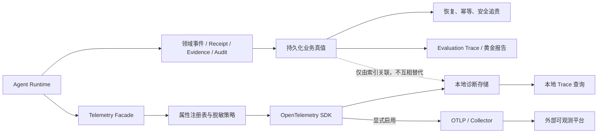
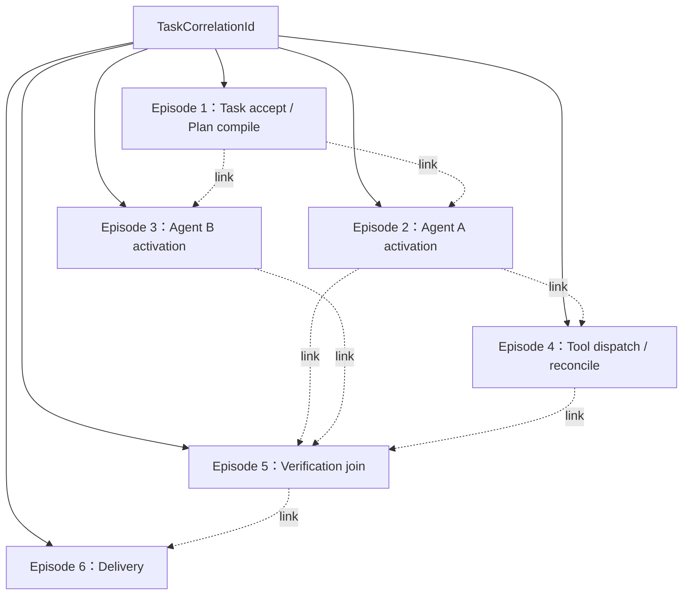
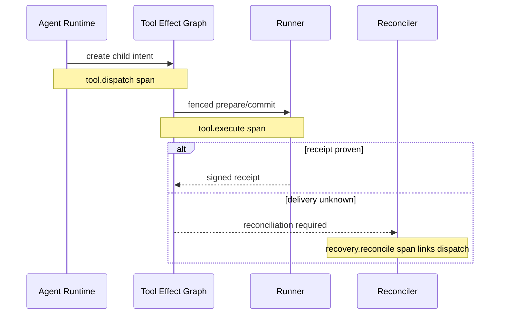
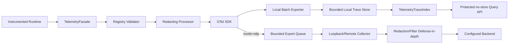

# 多 Agent 可观测性技术设计

## 1. 文档定位

本文细化 D5：怎样在不把正文、Prompt、Tool 参数、Memory/RAG 内容或凭据写入普通遥测的前提下，关联 Task、Plan、RuntimeWorkItem、AgentInvocation、ModelDispatchAttempt、ToolCall、Verification、Recovery、Delivery 和 Evaluation。

阶段 67 已实现 OpenTelemetry SDK、默认拒绝属性注册表、进程级有界本地 trace store、五类最小 span/metric、trace 查询和显式黄金回归基线。本文其余内容仍是“候选详细设计”：远程 OTLP、持久 store、tail sampling、多 Agent/Research/Artifact/Browser span/link 和告警尚未实现，继续随阶段 70～74 增量接入。

本文依赖：

- [《多 Agent 系统总体架构》](多Agent系统总体架构.md)；
- [《Agent Handoff、Invocation 与 Result Runtime 技术设计》](Agent-Handoff与Invocation-Runtime技术设计.md)；
- [《Claim、Evidence、Verification 与 Repair/Replan 技术设计》](Claim-Evidence与Verification-Repair技术设计.md)；
- [《Context Builder、Memory Broker 与 RAG/Artifact 数据平面技术设计》](Context-Memory-RAG数据平面技术设计.md)；
- [《多 Agent 跨层故障与恢复矩阵技术设计》](多Agent跨层故障与恢复矩阵技术设计.md)；
- [《多 Agent Scheduler 与部署拓扑技术设计》](多Agent-Scheduler与部署拓扑技术设计.md)。

## 2. 当前代码事实与真实缺口

当前工程已有三类容易被统称为“Trace”、但语义不同的数据：

1. `task_events.trace_id` 使用 `trc_<uuid32hex>`，贯穿同一 Task 的持久化事件；它当前是业务关联号，不是完整 W3C/OTel 传播契约。
2. `evaluation_runs` 和 `evaluation_trace_events` 保存内容寻址 manifest、前序摘要和 hash chain，用于黄金任务 Record/Replay 与报告复核；这是评测证据，不是 OTel span。
3. effect-runtime operations 从数据库计算 graph-control、admission、ready projection 和 outbox 脱敏快照，并形成不可变 Audit；它是运维投影，不是 OTel Meter 数据流。

当前代码与依赖中尚无 OpenTelemetry SDK/OTLP instrumentation。现有 `logging.exception(...)` 也可能携带异常栈、模块路径或第三方异常正文，因此不能在未增加过滤和分类前自动把全部 Python logging 接到远程 OTel Logs。

多 Agent 仍缺少：

- 业务关联号、OTel trace/span context、Evaluation trace 的正式命名和边界；
- 跨 Broker、跨进程、跨重启、retry/replan/reconcile 的 span link 规则；
- 稳定 span/event/metric 目录和版本化属性注册表；
- trace、metric、log 各自不同的基数白名单；
- 本地查询存储、保留期、容量和 remote egress policy；
- Prompt/正文 canary 泄漏门禁；
- OTel 与黄金报告、CI baseline 之间的非真值关系。

## 3. 核心结论

1. 领域事件、Receipt、Evidence 和 Audit 是正确性真值；OTel 只是可丢、可采样的诊断投影。
2. Evaluation Trace 是版本化评测证据，不能由 OTel span 替代，也不能依赖 exporter 可用性。
3. 一个长期 Task 使用稳定 `TaskCorrelationId` 关联多个短生命周期 OTel trace episode；不保持跨小时/跨天 root span 打开。
4. 同步单调用使用 parent/child；异步投递、handoff、retry、replay、replan、恢复和 DAG join 优先使用 span links。
5. 等待审批、用户、admission、Retry-After 或设备上线时不保持 span/Worker/permit；恢复后根据持久化时间计算等待时长。
6. 每个 external attempt 单独成 span；不能把 Provider fallback、Tool reconcile 或 Verification retry 藏在同一个 span 内。
7. 业务拒绝、取消、`partial`、`needs_user` 不自动等于 OTel `ERROR`；状态与基础设施错误分开。
8. 遥测属性默认拒绝，只能通过类型化 `TelemetryAttributeRegistry` 输出；Collector redaction 是第二道防线，不是第一道。
9. 普通遥测永不记录 Prompt、消息/文件/MCP/RAG/Memory 正文、Tool arguments/results、凭据或原始异常正文。
10. 裸内容 hash 不自动等于脱敏；可猜测内容只允许受控 Evidence/Audit 保存，遥测关联使用安装级 keyed token 或本地索引。
11. Trace 可含受限高基数关联字段；Metric label 只允许有限枚举，禁止任何实例 ID、路径、URL、错误正文和动态模型名。
12. 默认本地导出、短期保留、100% 采集；远程 OTLP 显式启用并经过独立 egress policy。
13. 遥测失败不得改变任务业务结果；关键安全事实必须已在领域账本中落盘。
14. 使用内部 `deskpilot.telemetry-schema.v1` 隔离业务代码，通过单一 adapter 对接锁定版本的 OTel/GenAI/MCP semantic conventions。

## 4. 三套数据平面



| 数据平面 | 主要用途 | 正确性真值 | 可采样/丢弃 | 典型保留 |
| --- | --- | --- | --- | --- |
| Domain/Audit | 幂等、恢复、授权、效果、追责 | 是 | 否 | 按领域 retention |
| Evaluation Trace | Record/Replay、基线、发布证明 | 对评测是 | 否 | 随版本化报告 |
| OTel Trace/Metric/Safe Log | 故障定位、性能、容量、SLO | 否 | 是 | 短期、有界 |

OTel 缺失不能推断“Tool 未执行”“Verifier 未通过”或“任务不存在”。这些结论只能来自领域状态、签名 Receipt、Evidence/VerificationRecord 和已复核 Evaluation Trace。

## 5. 标识模型与兼容边界

建议正式区分：

| 标识 | 生命周期 | 是否传播 | 用途 |
| --- | --- | --- | --- |
| `task_correlation_id` | 一个 Task 全生命周期 | 作为受控属性/本地索引，不作为授权 | 聚合多个 trace episode |
| `trace_id` | 一个有界执行 episode | W3C/OTel context | 诊断调用链 |
| `span_id` | 一个操作 | W3C/OTel context | parent/link |
| `event_id` | 一个领域事件 | 领域记录 | 可证明顺序/恢复 |
| `evaluation_run_id` | 一次评测 | 评测表 | 报告与 Replay |
| `correlation_token` | 一个导出策略/key version 下 | 可远程导出 | 隐去内部对象 ID 的关联 |

现有数据库列 `task_events.trace_id` 首版不做破坏性重命名，但在新代码和文档中把其语义限定为 `TaskCorrelationId`。真正 OTel context 使用独立模型，禁止因为历史字段名相同就把 `trc_...` 字符串直接塞入 `traceparent`。

### 5.1 本地 Trace 索引

```text
TelemetryTraceIndex
- index_id
- subject_type
- subject_id
- task_correlation_id
- trace_id
- root_span_id
- episode_kind
- instrumentation_schema_version
- export_policy_digest
- started_at
- completed_at
- expires_at
```

该索引只做查询关联，不参与 claim、commit、Verification 或恢复判断。支持按 `trc_...`、真实 OTel trace ID、invocation/tool/evaluation subject 反查；远程 exporter 不需要获得原始 `subject_id`。

## 6. Trace Episode 模型



Episode 边界是“一个进程/Worker 可以在有限时间内完整结束并导出的操作集合”，不是业务节点生命周期。一个 AgentInvocation 可以跨多个 reducer/model/tool/verification episode。

采用多个 episode 的原因：

- 审批、离线设备和用户等待可能跨小时/跨天；
- tail sampling 不应无限保留未结束大 trace；
- Worker 可随时重启或迁移；
- retry/replan/reconcile 需要保留独立 attempt；
- DAG join 有多个原因来源，但 span 只能有一个 parent；
- 查询和 retention 可按 episode 有界处理。

## 7. TraceContextEnvelope

Outbox、Broker wakeup、RuntimeWorkItem 和 Handoff 只携带最小诊断 envelope：

```text
TraceContextEnvelope
- schema_version = deskpilot.trace-context.v1
- task_correlation_id
- producer_trace_id
- producer_span_id
- trace_flags
- bounded_tracestate
- correlation_token_version
```

规则：

1. envelope 不含 Baggage；DeskPilot v1 不使用 W3C Baggage 传播业务、用户或权限数据。
2. envelope 只允许受信内部组件产生；外部 HTTP `traceparent` 默认不成为内部任务的 parent，可经网关校验后作为 link。
3. 缺失、损坏或不受支持的 envelope 不应让业务 WorkItem 失败；Worker 创建新 root episode，并依靠 `task_correlation_id` 本地关联。
4. trace context 不能授予 Agent、Tool、Memory、Provider 或 Approval 权限。
5. `tracestate` 使用严格 key/长度白名单；未知 vendor state 不跨隐私边界传播。
6. envelope 与业务 WorkItem 一起事务落盘，但 OTel exporter 的成功/失败不参与事务结果。

## 8. Parent、Link 与异步因果规则

| 场景 | 关系 |
| --- | --- |
| 同一同步调用栈内子操作 | parent/child |
| Outbox producer → Broker consumer | consumer episode link producer context |
| Handoff → target Agent 激活 | Agent episode link Handoff creation span |
| 同一 attempt 内 Model HTTP 请求 | model dispatch parent/client child |
| retry/fallback/new attempt | 新 span/episode link 上一 attempt |
| Tool `unknown` → reconcile | reconcile link 原 dispatch 和最新 Evidence |
| Replan generation | 新 compile episode link 失败/覆盖缺口 span |
| DAG join/Final Acceptance | 一个执行 parent，加全部前序完成 span links |
| Evaluation Replay | replay episode link 原 Evaluation Run 诊断 trace；评测血缘仍由 DB 证明 |
| Broker 重投/重复消费 | 每次 process span link 同一 creation context；业务层 dedupe |

已知 link 应在 span 创建时一次加入，避免 head sampler 看不到因果条件。Link 是诊断关系，不替代 `event_id`、plan generation、subject revision、receipt 或 evidence lineage。

参考：

- [OpenTelemetry Trace API](https://opentelemetry.io/docs/specs/otel/trace/api/)；
- [OpenTelemetry Messaging Span Conventions](https://opentelemetry.io/docs/specs/semconv/messaging/messaging-spans/)。

## 9. Span 目录

Span 名称必须是稳定操作类别，不能拼接 task ID、Agent ID、Tool name、模型名、路径或状态。

| Span name | 粒度 | 建议 kind |
| --- | --- | --- |
| `deskpilot.task.accept` | 请求到 Task/Contract 建立 | `INTERNAL`，HTTP 另有 `SERVER` |
| `deskpilot.plan.compile` | DraftPlan 到 ExecutablePlan | `INTERNAL` |
| `deskpilot.plan.activate` | 原子激活/代际切换 | `INTERNAL` |
| `deskpilot.work.enqueue` | WorkItem/Outbox creation | `PRODUCER` 或 `INTERNAL` |
| `deskpilot.work.execute` | 一次有界 WorkItem | `CONSUMER` 或 `INTERNAL` |
| `deskpilot.agent.reduce` | Invocation reducer 激活 | `INTERNAL` |
| `deskpilot.agent.turn` | 一次模型决策 turn | `INTERNAL` |
| `deskpilot.model.dispatch` | 一次 Provider attempt | `CLIENT` |
| `deskpilot.tool.dispatch` | Tool child intent/dispatch | `CLIENT` |
| `deskpilot.tool.execute` | Runner/Tool 执行边界 | `SERVER` 或 `INTERNAL` |
| `deskpilot.mcp.request` | MCP initialize/list/call | `CLIENT` |
| `deskpilot.context.build` | Context Package 构建 | `INTERNAL` |
| `deskpilot.retrieval.query` | RAG 查询 | `INTERNAL`/存储 client child |
| `deskpilot.compaction.build` | 压缩、重建与 coverage | `INTERNAL` |
| `deskpilot.verification.run` | 一次 VerificationAttempt | `INTERNAL` |
| `deskpilot.verification.judge` | Judge Provider attempt | `CLIENT` |
| `deskpilot.recovery.reconcile` | 一个恢复 case/action | `INTERNAL` |
| `deskpilot.delivery.build` | 最终交付构建 | `INTERNAL` |
| `deskpilot.evaluation.run` | 一次 suite execution | `INTERNAL` |
| `deskpilot.evaluation.case` | 一个固定 case | `INTERNAL` |

不为每个流式 token、模型 delta、RAG chunk、Claim 或 Tool progress 创建 span。高频细节使用有界 event、计数或领域记录；否则会形成 span explosion。

## 10. Agent、Model 与 Prompt Package 遥测

Agent span 允许记录：

- agent kind/category；
- Contract/Prompt Package/schema 的公开版本号或本地受控 digest reference；
- turn/attempt count；
- Context token/条目计数；
- Decision kind；
- outcome/reason code；
- no-progress/repetition 计数；
-预算使用与剩余的数值投影。

禁止记录：

- Prompt template/rendered Prompt；
- Base Context/Delta 内容；
- 模型输入/输出消息；
- native tool-call arguments；
- CoT、scratchpad 或隐藏推理；
- raw Provider response ID、endpoint、header；
-用户可识别的动态 Agent display name。

`ModelDispatchAttempt` 每次网络发送单独成 span，并记录 route class、protocol、location class、attempt ordinal、timeout class、token count、duration、retry/fallback kind、stable error code 和 `business_outcome`。模型 `unknown` 可表现为 transport span `ERROR`，同时必须保留 `business_outcome=unknown`，避免把“请求超时”和“Provider 肯定未处理”混为一谈。

## 11. Tool、Runner 与 MCP 遥测

Tool 主调用、Runner RPC、Tool 内部执行和 reconcile 是不同边界：



普通属性只能包含 Tool registry key/class、risk class、effect class、Runner generation category、attempt ordinal、status/reason code、duration 和 receipt 是否存在。文件路径、MCP server command/cwd/env、Tool arguments、Tool result、MCP content 和 receipt 原文都不进入普通遥测。

MCP 语义可通过 adapter 映射到官方 GenAI/MCP convention，但内容捕获必须强制关闭；Server ID、Tool name 只有在 Registry 有界、验证且 export policy 允许时才能作为 trace attribute，不能直接作为 metric label。

## 12. Context、RAG、Memory 与 Compaction 遥测

允许观察：

- 请求/返回条目数；
- token/字节区间；
- source trust class；
- stale/denied/conflict 数；
- Context Package/schema/version；
- compaction coverage、constraint retention、unsupported-claim count；
- privacy/egress policy outcome；
-构建、检索、重建耗时。

禁止观察：

- query 文本；
- document/chunk/file path/title/URL；
- Memory value、摘要和冲突正文；
- Citation excerpt；
-用户身份或会话原文；
-可离线枚举的 chunk/content SHA-256。

派生摘要继承输入中最高敏感等级，不能因为“已经压缩”就降级成普通 operational 属性。

## 13. Verification、Recovery 与 Delivery 遥测

Verification span 记录 verifier kind/version、required/optional、claim/evidence counts、coverage bucket、verdict、stable rejection/error code、attempt ordinal 和 duration。不能记录 Claim/Evidence 正文、Judge Prompt/输出或 Artifact 内容。

必须区分：

- `verdict=rejected`：验证成功运行并判定不通过；
- `verdict=accepted`：验证成功运行并通过；
- `verdict=error`：Verifier/Judge 自身失败；
- `verdict=indeterminate`：证据不足或无法可靠判断。

Recovery span 绑定 D3 的 `case_id`、uncertainty class、recovery owner、decision、attempt ordinal 和 latency；不能只记录自由文本异常。Delivery span 记录 coverage/outcome/artifact count/format class，不记录最终正文。

## 14. Span Status 与业务 Outcome

OTel status 与 DeskPilot 业务状态分离：

| 场景 | Span status | 业务属性 |
| --- | --- | --- |
| 正常执行并 accepted | `UNSET` | `outcome=accepted` |
| Policy deny | `UNSET` | `outcome=denied`、reason code |
| 用户取消 | `UNSET` | `outcome=cancelled` |
| Verifier reject | `UNSET` | `outcome=rejected` |
| `partial`/`needs_user` | `UNSET` | 对应 outcome |
| 网络/协议/存储调用失败 | `ERROR` | stable error code |
| transport timeout 且外部效果不明 | `ERROR` | `outcome=unknown`、uncertainty class |

不把稳定成功 span 强制设为 `OK`；默认 `UNSET`，只按固定语义设置 `ERROR`，避免不同 instrumentation 对状态作不一致解释。

## 15. 有界 Span Event 目录

建议只开放稳定事件：

```text
deskpilot.route.selected
deskpilot.retry.scheduled
deskpilot.fallback.selected
deskpilot.dispatch.unknown
deskpilot.policy.denied
deskpilot.approval.requested
deskpilot.fence.rejected
deskpilot.work.obsolete
deskpilot.verification.rejected
deskpilot.recovery.decided
deskpilot.replan.requested
deskpilot.telemetry.redacted
```

Event 只带稳定 code、ordinal、count、duration bucket 和有限枚举，不附 error/message/prompt/result payload。生命周期完整细节继续由领域事件保存。

## 16. TelemetryAttributeRegistry

所有手工 instrumentation 通过一个 Facade 和注册表输出，禁止业务模块随意调用 `span.set_attribute(dynamic_key, value)`。

```text
TelemetryAttributeDefinition
- key
- value_type
- classification
- allowed_signals
- allowed_span_names
- local_export
- remote_export
- metric_dimension
- enum_values
- max_length
- schema_since
- deprecated_since
```

数据分类：

| 分类 | 示例 | 默认处理 |
| --- | --- | --- |
| `operational` | outcome、version、count、risk class | 允许按注册表输出 |
| `bounded_identity` | work class、node kind、verifier kind | 有界后允许 |
| `correlation` | task/invocation/tool/eval ID | 本地 trace/index；远程 token 化 |
| `content` | Prompt、正文、query、路径、URL | 禁止普通遥测 |
| `secret` | credential、approval token、headers | 永久禁止 |
| `derived_sensitive` | 内容 hash、摘要、embedding ID | 按最高来源分类，默认禁止 |

注册表和 exporter config 形成 `export_policy_digest`，使诊断数据能够说明“按哪一版脱敏策略产生”，但该 digest 不参与任务授权。

## 17. 永久禁止字段

普通 span、metric、safe log 和 CI telemetry artifact 永久排除：

- 用户 goal、constraints 原文、聊天消息；
- Prompt template、rendered Prompt、模型输出、CoT；
- Tool arguments/results、MCP structured/unstructured content；
- 文件名、路径、正文、URL、query string、网页内容；
- RAG query/chunk、Memory value、compaction summary；
-凭据、token、cookie、authorization header、approval capability；
- SQL parameters、动态 statement、环境变量值；
-原始异常 message、未处理 stack trace；
- Provider endpoint、用户目录、主机用户名；
-任何调用方未注册的动态 attribute key。

受控 debug artifact 如确有必要，必须走独立加密 Artifact Store、访问审计、短 TTL 和显式权限；不能用 `capture_content=true` 偷渡进 OTel。

## 18. ID、Digest 与 Correlation Token

随机内部 ID 在本地 trace 中仍可能形成用户行为关联，远程导出时使用策略区分：

- `local`：允许 `task_correlation_id`、subject ID 进入受保护索引；
- `remote`：默认只导出 `HMAC(install_key_version, internal_id)` 的有界 token；
- `metric`：两者都禁止；
- `audit/evaluation`：按各自真值模型保存 digest，不由遥测策略修改。

不能把裸 SHA-256 当作天然匿名化。可预测 ID、短文本、文件名和有限状态可以被字典枚举；HMAC key 不写配置、log、span 或报告。Key rotation 必须版本化，并允许本地索引完成历史关联，而不是让 exporter 自行保留明文映射。

参考：[OpenTelemetry Handling Sensitive Data](https://opentelemetry.io/docs/security/handling-sensitive-data/)。

## 19. Trace、Metric 与 Log 的基数边界

| 字段类型 | Trace | Metric label | Safe log | Audit/Evidence |
| --- | --- | --- | --- | --- |
| 稳定枚举 | 允许 | 允许 | 允许 | 允许 |
| 版本号 | 允许 | 仅少量主版本 | 允许 | 允许 |
| 内部实例 ID | 本地允许/远程 token | 禁止 | token/trace ID | 允许 |
| 动态 Agent/Tool/model name | 本地受控 | 禁止，改用 class | 默认禁止 | Registry 可保存 |
| content digest | 默认禁止 | 禁止 | 禁止 | 按证据模型允许 |
| path/URL/error message | 禁止 | 禁止 | 禁止普通日志 | 受控 Artifact/Audit 才可 |

Metric label 白名单首版只包括：

```text
work_class
node_kind
agent_kind
outcome
stable_error_code
uncertainty_class
privacy_mode
deployment_profile
provider_protocol
provider_location_class
verification_kind
recovery_case_group
```

所有枚举必须有 unknown/other 上限，不允许把未知输入原样回填成新 label value。

## 20. Metric 目录

单位写入 instrument metadata，不拼进 metric name。建议首批：

| Metric | Instrument | 单位 | 关键低基数维度 |
| --- | --- | --- | --- |
| `deskpilot.task.started` | Counter | `{task}` | mode、privacy |
| `deskpilot.task.terminal` | Counter | `{task}` | outcome、reason group |
| `deskpilot.task.duration` | Histogram | `s` | outcome、mode |
| `deskpilot.runtime.work.executions` | Counter | `{work}` | work class、outcome |
| `deskpilot.runtime.work.queue.duration` | Histogram | `s` | work class |
| `deskpilot.runtime.work.execution.duration` | Histogram | `s` | work class、outcome |
| `deskpilot.runtime.work.backlog` | ObservableGauge | `{work}` | work class |
| `deskpilot.runtime.admission.wait.duration` | Histogram | `s` | resource class |
| `deskpilot.runtime.fence.rejections` | Counter | `{rejection}` | subject kind |
| `deskpilot.agent.invocations` | Counter | `{invocation}` | agent kind、outcome |
| `deskpilot.agent.turns` | Counter | `{turn}` | decision kind、outcome |
| `deskpilot.agent.no_progress` | Counter | `{event}` | agent kind、reason |
| `deskpilot.model.dispatch.duration` | Histogram | `s` | protocol、location、outcome |
| `deskpilot.model.token.usage` | Counter/Histogram | `{token}` | input/output、route class |
| `deskpilot.model.dispatches` | Counter | `{attempt}` | outcome、retry/fallback |
| `deskpilot.tool.call.duration` | Histogram | `s` | tool class、outcome |
| `deskpilot.tool.unknown` | Counter | `{call}` | uncertainty class |
| `deskpilot.mcp.request.duration` | Histogram | `s` | operation、outcome |
| `deskpilot.verification.duration` | Histogram | `s` | verifier kind、verdict |
| `deskpilot.verification.evidence.coverage` | Histogram | `1` | verifier kind |
| `deskpilot.context.build.duration` | Histogram | `s` | context kind、outcome |
| `deskpilot.context.token.count` | Histogram | `{token}` | context kind |
| `deskpilot.recovery.actions` | Counter | `{action}` | case group、decision |
| `deskpilot.recovery.duration` | Histogram | `s` | case group、outcome |
| `deskpilot.outbox.oldest.age` | ObservableGauge | `s` | topic class |
| `deskpilot.telemetry.dropped` | Counter | `{item}` | signal、reason |
| `deskpilot.telemetry.redacted` | Counter | `{attribute}` | signal、classification |

官方 GenAI metrics 可由 adapter 同时映射，但内部 Dashboard 和 CI 只依赖已锁定的 DeskPilot schema，不直接追随 `main/latest` 名称变化。

## 21. Gauge、时间、Token 与费用真值

Backlog、in-flight、expired lease、DLQ、等待审批和 active invocation gauge 必须从数据库快照/投影读取，不能依靠单进程内 `+1/-1`；进程崩溃会让后者永久漂移。

持久化状态间等待时间使用数据库时间戳计算；同进程网络调用 duration 使用单调时钟。多主机 wall clock 不作为严格顺序证明。Token/费用/预算的领域账本仍是真值，OTel 数值只是诊断副本；采样指标不能反推精确账单。

## 22. 结构化安全日志

阶段 67 不自动导出全部 Python stdlib logs。先提供受限 `SafeTelemetryLogger`：

```text
timestamp
event_code
severity
trace_id
span_id
correlation_token
component
stable_error_code
bounded_fields
```

规则：

- event code 来自注册表；
- message 使用固定模板，不拼接用户输入、异常正文、路径或 Provider payload；
- stack trace 默认只留本地开发 handler，并经过路径/secret redaction；
-远程 log export 默认关闭；
- trace/span correlation 只注入 safe logger，不给任意第三方 logging handler 自动加远程出口；
-过滤器是防御补充，业务代码仍不得先把 secret 写入 LogRecord。

## 23. Exporter 与本地拓扑



本地 store 可以由 OTel `SpanExporter` 写入规范化表/文件，但它仍是可重建、可过期的诊断数据，不加入任务事务。UI 的 runtime truth 继续来自领域 API；不能从 span 猜 Task 状态。

首版不启用 blanket zero-code auto-instrumentation。HTTP 只记录模板 route，SQL 禁止 statement/parameter，Provider/MCP/Runner 手工插桩；否则 URL、查询和异常内容容易绕过属性注册表。

## 24. Telemetry Egress Policy 与背压

建议配置：

```text
TelemetryConfig
- mode: off | local | otlp
- enabled_signals
- local_retention_days
- local_max_spans
- otlp_endpoint_reference
- tls_policy
- credential_reference
- sampling_profile
- semantic_convention_version
- attribute_registry_version
- export_policy_digest
```

约束：

1. 桌面默认 `local`，远程 OTLP 默认关闭。
2. endpoint 必须经过 allowlist/egress policy；凭据只用 secret reference。
3. 一次受信配置批准后不逐 span 审批，但配置变更需要审计和版本化。
4. exporter 使用 bounded queue、批量和短 shutdown flush deadline。
5. queue 满、Collector 离线或 exporter 异常时丢弃诊断数据并增加 self-metric，不阻塞 Agent/Tool/Verifier。
6. 遥测 exporter 不得递归记录自身每次失败形成风暴；按错误类聚合和限频。
7. 远程 sampling 或 Collector filter 不得改变本地领域 Audit 和 Evaluation Trace。

## 25. Sampling Profile

| Profile | 推荐策略 | 理由 |
| --- | --- | --- |
| local desktop | 100%，有界 retention/capacity | 低流量，便于诊断 |
| development | 100%，短 retention | 暴露拓扑与泄漏问题 |
| CI/evaluation | 100%，in-memory exporter | 确定验证 instrumentation contract |
| distributed success | 可按 trace ID 概率采样 | 控制外部成本 |
| unknown/security/reject/recovery failure | tail policy 100% 保留 | 后期 outcome 才可判断 |

如果 head sampler 已丢弃 trace，后续错误无法恢复，因此要求“错误/unknown 全保留”的高流量部署应使用 Collector tail sampling，或在 episode 创建时已知风险类别并提高采样率。低流量本地系统不应为采样复杂度提前引入 stateful Collector。

参考：[OpenTelemetry Sampling](https://opentelemetry.io/docs/concepts/sampling/)。

## 26. 本地保留与查询

候选默认值，不作为未实测的最终产品参数：

- 7 天或 50,000 spans，先到者淘汰；
- error/unknown/security episode 在相同容量内优先保留；
- 查询最多 500 spans/page，keyset cursor；
- 按 trace ID、task correlation、subject type/id、时间和 outcome 建索引；
-详情 API `Cache-Control: no-store`；
-普通用户只看任务时间线、等待/重试/验证摘要；运维角色才看 Worker/Provider/recovery 细节；
-本地删除 Task/Memory 时按 retention/删除策略同步删除诊断索引，不承诺遥测作为法定留存。

不能提供跨全部 span 的任意正文搜索，因为正文根本不应进入 store。导出 trace 时再次通过 export allowlist，不能把本地高基数 ID 原样转成远程包。

## 27. Semantic Convention 版本隔离

当前官方 GenAI、Agent 和 MCP conventions 已迁移到独立仓库：[OpenTelemetry GenAI Semantic Conventions](https://github.com/open-telemetry/semantic-conventions-genai)。这些约定由单独 adapter 使用固定提交/tag 或发布版本，不允许运行时自动追随 `latest/main`。

```text
业务代码
  -> DeskPilot TelemetryFacade
  -> deskpilot.telemetry-schema.v1
  -> OTelSemanticConventionAdapter(pinned_version)
  -> gen_ai / MCP / messaging / HTTP attributes
```

内部 schema manifest 记录 span、event、metric、属性、类型、允许值、classification 和映射版本。升级 upstream convention 时必须显式生成 diff、双写/迁移窗口或 major schema，并重新跑 telemetry contract/golden tests。

## 28. Evaluation Trace 与 OTel 的连接

阶段 65/66 的 `EvaluationTraceRead` 和 hash chain 保持不变。建议通过独立索引关联：

```text
EvaluationRun/Case --subject index--> OTel trace episode
```

规则：

- OTel trace/span ID、采样决策、exporter 状态、时间戳不进入 `report_digest`；
- exporter 失败不能让 Evaluation Run 变 failed；
- Evaluation 的语义结果、case ordering、output digest、错误码和 safety 计数仍由数据库复核；
- OTel duration 可用于诊断，但 CI 性能门禁使用未采样 Evaluation Trace/报告中的持久化时间；
- `Replay` 必须真实重执行，不能因为找到旧 OTel span 就称为 replay；
- Evaluation profile 100% 采集，但仍不捕获 fixture 外的正文内容。

## 29. Telemetry CI Contract

Telemetry 测试与黄金语义 baseline 是两类门禁：

1. **语义 baseline**：比较版本化 Evaluation Report、success/safety/recovery/cost/latency threshold，由显式 record/approve 更新。
2. **遥测 contract**：使用 in-memory exporter 验证脱敏、span/event/metric schema 和因果拓扑。

遥测 contract 至少验证：

- 必需 span 名称、kind 和 instrumentation schema 存在；
- retry/fallback/reconcile 形成独立 attempt；
- async consume、handoff、join、replan links 正确；
-等待用户/审批/Retry-After 时没有长期开启 span；
- verifier rejected 与 verifier error 区分；
- Tool unknown 的 transport/business outcome 区分；
- canary 不出现在 attribute、event、metric label、safe log、OTLP JSON 和 CI artifact；
-未注册字段默认拒绝并产生有界 redaction self-metric；
- metric 不含实例 ID、高基数动态值；
- exporter 异常/队列满不改变领域任务结果；
- trace context 损坏时业务继续且创建新诊断 root；
- OTel 数据缺失不能通过/拒绝业务恢复。

若需要 snapshot，只比较规范化 topology：span name/kind、relation type、必需属性集合和 outcome；删除 trace/span ID、时间戳、duration、随机顺序和 exporter metadata。不能 snapshot 完整 OTLP JSON 并要求字节相同。

## 30. 阶段 67 与后续落点

### 67-A：Schema 与脱敏内核

- `TelemetryAttributeRegistry`；
- Facade/Redacting Processor；
- resource/attribute 白名单；
- safe logging filter；
- in-memory exporter/canary tests。

### 67-B：最小业务 spans

- task、model、tool、MCP、evaluation；
-现有 `trc_...` 到 TaskCorrelationId 兼容层；
-本地 trace index/query；
- exporter failure isolation。

### 67-C：Metrics 与本地导出

- task/model/tool/MCP/evaluation 低基数 metrics；
- effect-runtime DB snapshot bridge；
-本地 retention；
-可选 loopback/remote OTLP config。

### 70～74：多 Agent/通用任务扩展

- WorkItem/AgentInvocation/Turn/Handoff；
- Verification/Repair/Replan；
- Context/RAG/Memory/Compaction；
- episode/link/join/recovery；
- D3 case telemetry coverage。

## 31. 建议代码落点

```text
backend/src/deskpilot/
├── observability/
│   ├── attributes.py
│   ├── schema.py
│   ├── facade.py
│   ├── redaction.py
│   ├── tracing.py
│   ├── metrics.py
│   ├── safe_logging.py
│   └── semantic_conventions.py
├── application/
│   ├── telemetry_query_service.py
│   └── telemetry_retention_service.py
├── infrastructure/
│   ├── telemetry_store.py
│   ├── telemetry_exporters.py
│   └── telemetry_repository.py
└── api/
    └── telemetry.py
```

Instrumentation helper 可以在 application/runtime 边界调用，但 attribute key、redaction 和 exporter 不散落到 `TaskService`、`TaskProcessor`、Provider adapter、Tool 或 MCP 代码中。

## 32. 与 D3/D4 的映射

- D3 每个 `FR-*` case 必须映射稳定 recovery event/metric，但恢复正确性仍由机器可读矩阵和领域记录证明；
- D4 `RuntimeWorkItem` enqueue/claim/execute/reclaim 使用短 spans，等待不占 span；
- Broker 是 wakeup，consumer links producer，重复投递由 domain dedupe，不以 span dedupe；
- admission/backlog/lease gauge 来自 DB snapshot；
- control/verification/recovery 保留容量应有 saturation/starvation metrics；
-旧 fence/revision/generation commit reject 形成 event/counter；
- Worker capability/affinity 只记录 class/result，不暴露主机路径和敏感拓扑；
- SQLite/PostgreSQL profile 作为有界 deployment dimension。

## 33. 验收矩阵

1. Domain/Audit、Evaluation Trace、OTel 三者的数据模型和代码路径独立；
2. 删除/采样 OTel 数据不影响恢复、幂等、Verification 和黄金报告；
3. 同一 TaskCorrelationId 可查询多个 trace episode；
4. 输入真实 OTel trace ID 可查询单 episode；
5. 现有 `trc_...` 不被错误当作授权或裸 `traceparent`；
6. async work、handoff、retry、replan、reconcile 和 join 使用预期 links；
7. 审批/用户/admission/Retry-After 等待期间无长期开启 span；
8. 每个 Model/Tool/Judge external attempt 独立；
9. Tool dispatch、Runner execute、Receipt observation、reconcile 边界可区分；
10. Policy deny、cancel、partial、Verifier reject 不误标基础设施 ERROR；
11. transport error 与 business unknown 同时表达；
12. Prompt、正文、路径、URL、Tool/MCP/RAG/Memory 内容和凭据不出现在任何普通 signal；
13. 原始异常正文/stack 不进入远程 logs；
14. 可预测内容 hash 不进入普通 telemetry；
15. Metric label 不含任何 task/node/invocation/request ID；
16. 未知动态枚举归一为 other，不产生无界 time series；
17. backlog/lease/in-flight gauge 从 DB snapshot 读取，进程崩溃后不漂移；
18. exporter/Collector 离线、queue 满、flush timeout 不改变业务结果；
19. remote OTLP 默认关闭，启用需要版本化 egress config/secret reference；
20. 本地 retention/capacity 有界，查询 keyset 分页且 `no-store`；
21. telemetry schema/upstream semconv version 显式锁定；
22. canary 泄漏测试覆盖 trace、metric、safe log、export 和 CI artifact；
23. Evaluation report digest 不包含随机 OTel ID、采样或 exporter state；
24. Telemetry topology snapshot 归一化随机 ID/时间/并发顺序；
25. D3 故障 case 可由 event/metric 定位，但不以其替代恢复证明。

## 34. 明确禁止的捷径

- 用 OTel span 是否存在判断 Tool 是否执行；
- 用 OTel trace 代替 Evaluation hash chain；
- 一个 Task 从创建到几天后结束始终保持 root span 打开；
- 把多个 retry/fallback/reconcile 藏在一个 span；
- 在审批、用户输入或 Retry-After 时保持 span/Worker/permit；
- 把 `trc_...`、OTel trace ID、业务 event ID 混成一种标识；
-接受外部 `traceparent` 后直接继承内部授权上下文；
-把 Task/Node/Request ID 放入 metric label；
-允许未知枚举原样创建新 time series；
-认为 SHA-256 自动匿名；
-开启 GenAI/MCP content capture；
-把 Prompt、Tool arguments、RAG chunk 或 Memory 摘要塞入 span event；
- blanket 自动导出全部 Python logs、HTTP URL、SQL statement；
-依赖 Collector redaction 弥补源码先泄漏；
-远程 exporter 失败阻断 Agent Runtime；
-在实测前把候选 p95/SLO 写成已达成；
-跟随 upstream `latest/main` 静默改变 span/metric schema；
-用完整 OTLP JSON 字节快照做稳定 CI 基线。

## 35. 待确认决策

| 决策 | 当前推荐 | 主要代价 |
| --- | --- | --- |
| 数据平面 | Domain/Audit、Evaluation、OTel 三分 | 查询需要关联索引 |
| Trace 拓扑 | TaskCorrelationId + 多个短 episode | UI 不是只展示一棵树 |
| 历史 `trace_id` | 保留列，逻辑定义为 correlation ID | 名称暂有兼容债务 |
| 异步关系 | links 优先，业务因果仍由 event/evidence 证明 | 后端/UI 需支持 link 图 |
| 内容策略 | 普通 OTel 永不捕获正文，即使 debug | 深度调试需独立受控 Artifact |
| ID 导出 | 本地原始索引、远程 keyed token、metric 禁止 | key/version/index 管理 |
| Logging | 首版只导出 SafeTelemetryLogger | 不能自动获得全部第三方日志 |
| Export | local 默认，remote OTLP 显式开启 | 需本地 store/retention |
| Sampling | 本地/CI 100%；高流量 remote tail policy | 分布式部署需 Collector 成本 |
| SemConv | 内部 v1 + pinned adapter | 维护映射和升级 diff |
| Evaluation | 只关联诊断，不进入 report digest | 两套 Trace 查询概念需解释 |

三套真值边界、普通遥测不含正文、Metric 禁止实例 ID、遥测失败不影响任务结果和 Evaluation 不依赖 OTel 属于正确性/隐私边界，不建议放宽。

## 36. 与后续设计的接口

- D6 使用 in-memory exporter 和 canary 验证 telemetry contract，并把运行证据与显式 baseline/CI 发布报告关联；
- D7 展示 TaskCorrelationId 下的 episode timeline、排队/等待/重试/验证/恢复摘要，并按角色隐藏运维细节；
- D8 要求第三方 Agent/Plugin 声明可产生的 telemetry schema，禁止自行注册无界属性、绕过 Facade 或开启内容捕获；
- 阶段 75 通用/多 Agent 对抗 suite 评测 handoff storm、no-progress、相关性错误、网页注入、Artifact/Browser 验收、memory contamination、compaction drift 和恢复抖动的可观测覆盖。
