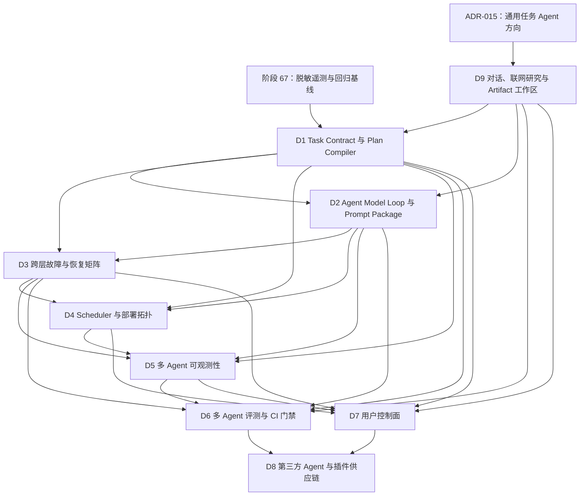
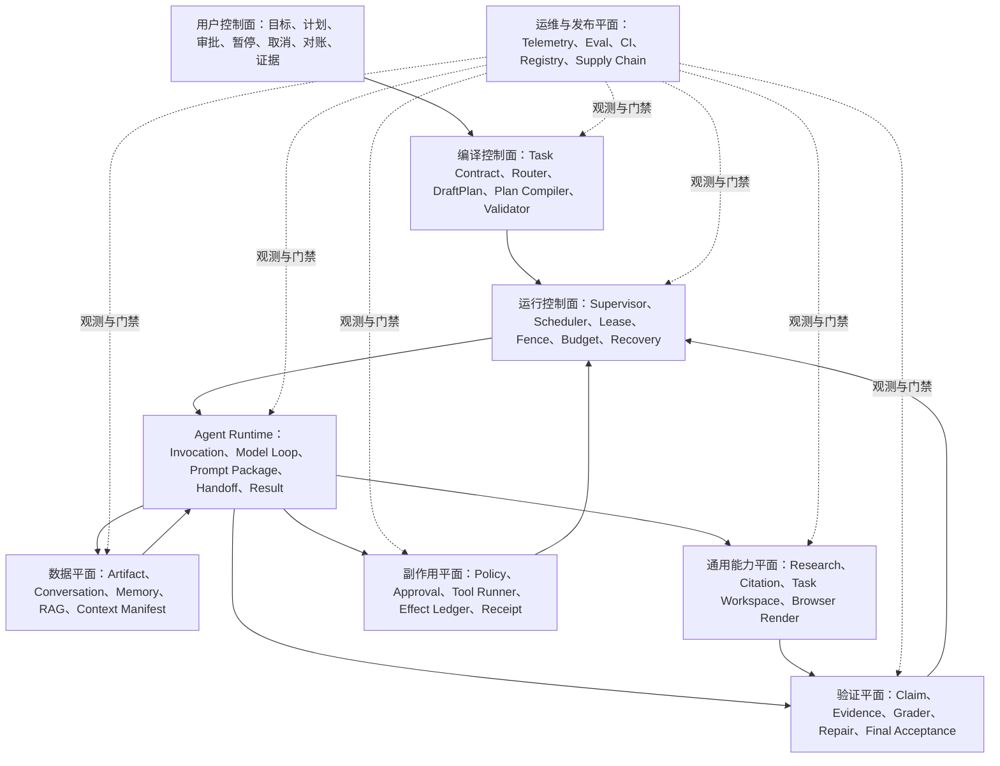

# 多 Agent 后续技术架构讨论总纲

## 1. 文档定位

本文是后续九个技术方向的讨论索引，不是功能完成说明，也不是九份详细设计的替代品。它负责固定讨论顺序、依赖关系、每项应产出的合同与验收问题；具体字段、状态机、数据库表和失败语义必须在逐项讨论后写入对应专项文档。

阶段 67 的脱敏 OpenTelemetry/显式回归门禁和阶段 68 的 Agent Contract/冻结 Registry 已经完成。当前工程断点进入阶段 69 Task Contract/Executable Plan Compiler；不能把本总纲、Registry Descriptor 或已有角色标签当作多 Agent Runtime/通用任务能力已经完成。

讨论编号 `D1～D9` 与开发阶段 `67～75` 是两套编号：

- `D1～D9` 表示架构议题；
- `67～75` 表示实施与验收阶段；
- 一个议题可以跨多个实施阶段，但不得绕过当前阶段 69 Task Contract/Plan Compiler 断点。

## 2. 已确定的上层约束

以下结论已经由现有专项设计固定，后续讨论只能细化，不能无记录地推翻：

1. 简单确定性、简单单 Agent、复杂多 Agent 三条路径最终都编译为版本化 `ExecutablePlan`。
2. Task Runtime、Supervisor 与 Scheduler 是确定性控制组件，不是拥有隐式权限的普通 Agent。
3. `AgentContract`、注册状态、公开描述和运行实例彼此分离；运行计划绑定精确版本与摘要。
4. Agent 之间不自由聊天，只通过持久化 Handoff、Artifact、Evidence 和受信 Supervisor 传递数据。
5. Agent 输出是待验证 Claim，不是事实；节点验证通过后才可解锁依赖。
6. Policy、Approval、Tool ledger、commit boundary、receipt 和 reconciliation 继续拥有副作用真值。
7. Context、Memory、RAG、Artifact 和会话记录是不同数据面；摘要不能承载权限或任务真值。
8. 数据库保存运行真值；Broker 只负责唤醒与投递优化，不能成为唯一状态源。
9. 多数 Agent 一致不等于正确；准确性依靠独立证据、可重算 grader 和最终任务验收。
10. 阶段 75 前不开放动态第三方 Agent、自我复制、无限递归或 Agent 直接写 active 长期记忆。
11. 产品目标是本地优先通用任务 Agent；首个纵向闭环固定为 `research_to_html`，不能继续只增加底座或固定磁盘工具。
12. 联网研究、Artifact 工作区和隔离 Browser Verification 必须成为领域 Runtime 的一等合同，不能靠“模型可以上网/写代码”的隐式能力代替。

## 3. 九个方向的依赖图

这里表达的是“设计证据依赖”，不是要求开发完全串行。D9 是已经接受的产品方向和能力纵切面，会反向约束 D1/D2/D6/D7；它不建立第二套 Runtime。只有 D1～D4 的身份、状态和拓扑稳定后，才能定义完整的多 Agent span 与恢复指标。

## 4. 横向分层

任何专项设计都必须回答它属于哪一层、读取哪一层的真值、可以写哪些状态、失败后由谁恢复。不能用一个“大 Agent 状态”同时替代计划、模型调用、Tool 副作用和验证状态。

## 5. 讨论与固化方式

每个方向按同一流程推进：

1. 先核对当前代码事实和已有合同，区分已实现、已设计、待决定。
2. 给出推荐方案，同时列出至少一个可行替代方案和不采用的理由。
3. 明确对象模型、状态机、身份键、版本与摘要、原子边界、权限边界和错误分类。
4. 单独列出崩溃窗口、`unknown`、重试、取消、重放、回滚和人工介入语义。
5. 定义 API/UI 投影，但不允许前端自行推断运行真值。
6. 定义单元、集成、故障注入、黄金任务和 CI 验收证据。
7. 经讨论确认后写入专项 Markdown，并回链本总纲与实施路线。

没有经过逐项讨论的“候选建议”不视为最终决策。

## 6. 讨论队列总览

| 编号 | 技术方向 | 核心问题 | 主要设计产物 | 建议实施窗口 | 状态 |
| --- | --- | --- | --- | --- | --- |
| D1 | Task Contract、DraftPlan、ExecutablePlan Compiler | 如何把用户目标和不可信模型计划变成受信、版本化、可恢复执行图 | Contract、Draft/Bound/Executable Plan、Compiler、Validator、Replan generation | 阶段 69 | 候选方案已成文，待确认 |
| D2 | Agent Model Loop 与 Prompt Package | 单次 Agent Invocation 内模型如何有限循环、请求 Tool、产生 Result，并可重放审计 | Prompt Package、Turn/Decision 状态机、Tool loop、终止与预算协议 | Prompt Package 已在 68 落地；Model Loop 在 70 | 候选方案已成文，待确认 |
| D3 | 跨层故障/恢复矩阵 | API、DB、Broker、Scheduler、Provider、Runner、Verifier 各崩溃点怎样定责与恢复 | 故障矩阵、恢复所有者、unknown/retry/reconcile 规则 | 阶段 69～71 横切 | 候选方案已成文，待确认 |
| D4 | Scheduler 与部署拓扑 | 单机和多实例如何 claim、限流、公平调度、隔离 Agent 与 Tool 工作负载 | 逻辑队列、lease/fence、部署 profile、容量与升级策略 | 阶段 70 | 候选方案已成文，待确认 |
| D5 | 多 Agent 可观测性 | 如何关联 Task、Plan、Node、Agent、Model、Tool、Verification 且不泄露正文 | OTel 语义约定、指标、日志、trace 查询、脱敏规则 | 阶段 67 骨架已完成；70～74 扩展 | 候选方案已成文，待确认 |
| D6 | 多 Agent 评测与 CI 门禁 | 如何证明正确、安全、可恢复、成本可控，而非只看最终文本 | 黄金/对抗套件、分组基线、漂移规则、record/compare 流程 | 阶段 75 | 候选方案已成文，待确认 |
| D7 | 用户控制面 | 用户能看见、控制和纠正什么；哪些操作需要审批或对账 | API 投影、时间线、计划 diff、证据、Memory 与恢复操作 | 阶段 69～74 递增 | 候选方案已成文；图可视化边界已接受，其他待确认 |
| D8 | 第三方 Agent/插件供应链 | 如何安装、验证、隔离、撤销和升级外部 Agent/Prompt/Tool 包 | 签名清单、信任根、沙箱、权限 diff、撤销与兼容门禁 | 阶段 75 之后 | 候选方案已成文，待确认；实施明确延后 |
| D9 | 通用对话、联网研究与 Artifact 工作区 | 如何让用户真正完成查询信息并制作 HTML 等任务，同时保留权限、证据和恢复边界 | Conversation/Amendment、Capability Pack、Search/PageSnapshot、Task Workspace、Browser Verifier | 阶段 69～71；72～75 增强 | 产品方向已由 ADR-015 接受；十一项细节仍待确认 |

## 7. D1：Task Contract、DraftPlan 与 ExecutablePlan Compiler

候选详细方案见[《Task Contract、DraftPlan 与 ExecutablePlan Compiler 技术设计》](Task-Contract与ExecutablePlan-Compiler技术设计.md)。其中不可变 Contract version、纯 Compiler、动态 fan-out 限制、一次 Draft repair、Verification/Approval 边界仍保留为待确认决策。

### 7.1 必须解决的问题

- 哪些用户输入可以成为受信 `TaskContract`，哪些只能是待确认推断；
- 三种执行路径怎样进入同一个 Compiler，而不是维护三套运行语义；
- 模型 `DraftPlan` 可以建议什么，绝不能决定什么；
- Agent、Tool、Verification、Context、预算和依赖如何解析成精确绑定；
- 如何证明计划覆盖所有必需验收条件；
- Replan 怎样保留旧副作用、拒绝、审批和 `unknown`，又不复用旧节点身份。

### 7.2 预期产物

- `TaskContract`、`AcceptanceCriterion`、`TaskConstraint`；
- `DraftPlan`、`BoundPlan`、`ExecutablePlan` 三层模型；
- `PlanCompiler`、`PlanValidator` 和稳定 validation issue；
- Plan/node identity、generation、manifest 和 digest 规则；
- acceptance coverage、静态 Policy/预算/资源冲突检查；
- Replan 输入快照、不可继承项和代际血缘。

### 7.3 本轮需要讨论的关键取舍

1. `TaskContract` 是一次生成后不可变，还是允许 versioned amendment；
2. 验收条件由用户、固定模板、Router 和 Planner 各能贡献到什么程度；
3. `DraftPlan` 是否允许条件分支与动态 fan-out，首版上限是多少；
4. Plan Compiler 是纯函数加 Registry snapshot，还是持有数据库事务的应用服务；
5. 编译错误是否允许模型修复，最多几次，哪些错误禁止自动修复；
6. Replan 是否必须生成完整新图，如何导入已验证结果和不可重放副作用。

## 8. D2：Agent Model Loop 与 Prompt Package

候选详细方案见[《Agent Model Loop 与 Prompt Package 技术设计》](Agent-Model-Loop与Prompt-Package技术设计.md)。其中持久化 reducer、`tool_binding_id`、Provider normalization、durable dispatch attempt、Context freeze、单 Tool、streaming 和 payload retention 仍保留为待确认决策。

### 8.1 必须解决的问题

- `AgentInvocation`、`AgentModelTurn`、`AgentDecision` 和 Tool invocation 如何分层；
- system/developer/contract/context/tool-result 各段由谁生成，如何做信任分区；
- Tool 请求如何经过 Schema、Contract、Policy、Approval 和 Runner，而不是由模型直接执行；
- 流式响应、结构化输出、Provider 无原子幂等时的 `outcome_unknown` 如何处理；
- 何时继续一轮、何时返回结果、何时 repair、何时终止；
- Prompt Package 如何版本化、测试、回滚和与模型能力兼容。

### 8.2 预期产物

- Prompt Package manifest 与 renderer contract；
- 有界 Model Loop 状态机；
- Turn/Decision/Tool Request/Result 数据合同；
- token、费用、turn、tool-call 与 wall-clock 多维预算；
- Provider capability negotiation 与稳定错误映射；
- prompt injection、tool-output injection 和结构化输出故障用例。

## 9. D3：跨层故障与恢复矩阵

候选详细方案见[《多 Agent 跨层故障与恢复矩阵技术设计》](多Agent跨层故障与恢复矩阵技术设计.md)。其中领域 Reconciler、DB 失联门禁、Model unknown 自动策略、Task 双投影和机器可读矩阵仍保留为待确认决策。

### 9.1 必须覆盖的层

API/Task Service、Plan Compiler、数据库事务、Outbox/Broker、Scheduler、Agent Worker、Model Provider、Policy/Approval、Tool Runner、Artifact/Memory/RAG、Verifier、Deliverer 和前端连接。

### 9.2 每个故障格必须回答

- 失败发生在 dispatch 前、外部执行中还是持久化后；
- authoritative state 在哪里；
- 是否可安全重试，幂等键和 fence 是什么；
- 是否进入 `unknown`，需要何种证据才能对账；
- 恢复所有者是 API、Scheduler、Worker、Reconciler 还是用户；
- 取消、预算耗尽、超时和进程重启怎样传播；
- 应产生哪些事件、span、告警和 UI 操作。

### 9.3 预期产物

- 跨层 failure taxonomy；
- crash-window/recovery 矩阵；
- retry、resume、reobserve、repair、replan、reconcile 的互斥边界；
- 单机重启、双实例接管、Provider 超时、Broker 重投、DB 连接中断等故障注入清单。

## 10. D4：Scheduler 与部署拓扑

候选详细方案见[《多 Agent Scheduler 与部署拓扑技术设计》](多Agent-Scheduler与部署拓扑技术设计.md)。其中统一 WorkItem、短 reducer、通用 admission、Worker capability、保留容量和三种部署 profile 仍保留为待确认决策。

### 10.1 必须解决的问题

- Task node、Agent invocation、Model turn、Tool graph、Verification run 是否共享队列或分舱；
- ready、claim、lease、heartbeat、fence、attempt、backpressure 和 fairness 的作用层级；
- Provider、Runner、Verifier 的容量如何预留，防止拿到 node lease 后长期等待下游资源；
- 单机开发、单机生产、多 API/多 Worker 三种 profile 如何保持同一状态语义；
- 滚动升级时旧 Plan/Contract/Prompt 是否可继续，新 claim 如何阻止版本漂移；
- Broker 故障时怎样退化为数据库扫描，而不产生第二真值。

### 10.2 预期产物

- 逻辑调度队列与资源池模型；
- Scheduler/Worker/Reconciler 部署图；
- 容量令牌、并发限额、公平性和优先级规则；
- lease/fence 与现有 effect DAG 的复用/隔离决策；
- 单机与多实例故障、升级和缩容验收。

## 11. D5：多 Agent 可观测性

候选详细方案见[《多 Agent 可观测性技术设计》](多Agent可观测性技术设计.md)。其中 Domain/Audit、Evaluation 与 OTel 三分，TaskCorrelationId 下多个短 trace episode、异步 links、属性默认拒绝、本地优先导出和 pinned semantic-convention adapter 仍保留为待确认决策。

### 11.1 必须解决的问题

- trace 如何关联 `task_id`、plan generation、node、invocation、turn、tool call、verification 和 delivery；
- 哪些 ID 可进入普通遥测，哪些正文、路径、Prompt、Memory、RAG 内容必须排除或只记摘要；
- 一个逻辑尝试跨进程、跨 Broker 重投和跨重启时怎样继续 trace/link；
- 如何区分模型执行耗时、排队耗时、审批等待、Tool commit、验证和用户等待；
- 如何发现 Agent 循环、handoff 风暴、预算泄漏、验证拒绝率和恢复抖动。

### 11.2 预期产物

- 多 Agent OTel span/link/event 语义约定；
- 低基数 metric 和稳定维度白名单；
- 本地 trace 查询、任务时间线和故障证据关联；
- privacy/classification 继承与 Provider/telemetry egress gate；
- 告警与 SLO 候选，但不在实测前宣称达标。

## 12. D6：多 Agent 评测与 CI 门禁

候选详细方案见[《多 Agent 评测与 CI 门禁技术设计》](多Agent评测与CI门禁技术设计.md)。其中外部 Oracle、Verifier mutant、false-success 硬门禁、概率非劣效比较、完整 cohort、不可变 baseline 和 release attestation 仍保留为待确认决策。

### 12.1 必须解决的问题

- 正确性如何由 Claim/Evidence/最终验收证明，而非文本相似度；
- 如何测量错误传播、相关性错误、越权 handoff、记忆污染、压缩漂移和恢复正确性；
- 模型、Agent Contract、Prompt Package、Tool、Verification policy、Memory/Compaction 版本变化如何分组；
- 概率任务怎样设置重复次数、置信区间、flaky 隔离和费用上限；
- record 与 compare 谁可触发，基线怎样评审、签名、回滚和防止静默重写。

### 12.2 预期产物

- 离线合同测试、组件评测、真实多 Agent 黄金任务、对抗任务四层套件；
- success/safety/recovery/cost/latency/coverage 指标；
- 硬门禁、软告警、人工复核和 quarantine 规则；
- 显式 baseline record/approve/compare 流程；
- 发布报告和证据链。

## 13. D7：用户控制面

候选详细方案见[《多 Agent 用户控制面技术设计》](多Agent用户控制面技术设计.md)。其中服务端 ActionAvailability、持久命令回执、正交 Task 状态、Plan/Approval/Reconciliation 分离、多活动任务、Attention Queue 和 Memory usage/deletion propagation 仍保留为待确认决策。Execution Graph 的技术边界已由 [ADR-014](ADR-014-图可视化与LangGraph采用边界.md) 接受：核心 Runtime 不采用 LangGraph，服务端只读 `GraphViewProjection + Vue Flow + ELK.js` 承担交互图，Mermaid 仅作脱敏导出。

### 13.1 必须解决的问题

- 用户提交目标时怎样表达范围、输出、隐私、预算、期限和验收条件；
- 何时显示计划并要求确认，何时可走快速路径；
- 如何展示 Agent/Tool/Verifier 的真实状态，而不是角色动画；
- pause、cancel、approve、deny、retry、replan、reconcile 各自允许在哪些状态；
- partial、failed、unknown 和 verification error 怎样避免误导；
- 用户如何查看、确认、纠正、删除 Memory，并追踪它被提供给哪些 Agent/Provider。

### 13.2 预期产物

- Task Contract 输入与 amendment API；
- Plan generation/diff、节点血缘、证据与预算投影；
- 审批、澄清、对账、恢复和最终验收 UI 状态机；
- Memory/RAG/Context 使用解释与删除传播界面；
- 前端只能发 intent、读取服务端投影的边界。

## 14. D8：第三方 Agent 与插件供应链

候选详细方案见[《第三方 Agent 与插件供应链技术设计》](第三方Agent与插件供应链技术设计.md)。其中声明式 Agent 先行、四层信任、完整 TUF 或不自动更新、签名 profile、撤销新鲜度、可执行包隔离、Developer Mode 和自动 promote 边界仍保留为待确认决策。

### 14.1 启动前置门

只有固定内置 Agent 已通过阶段 75，且 D1～D7/D9 的版本、恢复、遥测、评测和用户控制边界稳定后，才允许实现并运行第三方包。提前开放会把“Agent 是否正确”和“包是否可信”两个尚未闭环的问题叠加。

### 14.2 必须解决的问题

- Agent Contract、Prompt Package、Tool/MCP bundle、依赖和发布者身份如何打包与签名；
- 信任根、安装来源、透明日志、恶意撤包和离线撤销如何处理；
- 安装/升级时如何展示权限、网络、数据等级、handoff 和 Provider egress diff；
- 第三方代码是否允许进程内运行；不同包怎样隔离文件、网络、凭据和资源；
- 版本兼容、迁移、回滚、Plan 恢复和安全撤销如何协同；
- 谁能发布、安装、启用、禁用和审批高风险能力。

### 14.3 预期产物

- 签名插件 manifest、SBOM/lock、bundle digest 与 publisher identity；
- 安装、隔离、启用、升级、撤销、卸载状态机；
- 权限 diff 与管理员/用户确认协议；
- 第三方 Agent 对抗套件和供应链 CI；
- 明确禁止进程内不可信 Python、任意安装脚本和 Agent 自行下载安装更新。

## 15. D9：通用对话、联网研究与 Artifact 工作区

产品方向与首个纵向切片已由 [ADR-015](ADR-015-通用任务Agent产品边界与首个纵向切片.md)接受；详细候选架构见[《通用对话、联网研究与 Artifact 工作区总体架构》](通用对话联网研究与Artifact工作区总体架构.md)。D9 不是在现有路线末尾追加几个 Tool，而是让 D1/D2/D6/D7 共同服务于第一个真实用户价值闭环。

### 15.1 已接受的方向

- 产品目标是本地优先、能力可声明、过程可检查、结果可验证的通用任务 Agent；
- 首个纵向切片是 `research_to_html`：对话 → 联网研究 → Claim/Citation → Task Workspace HTML → 隔离浏览器验收 → 交付；
- 现有领域 Runtime、Policy/Approval、Tool/effect ledger、Verifier 和图投影仍是真值骨架；
- 首版不开放任意 Shell、动态 Python、包安装、用户目录任意写入或登录态浏览器操作。

### 15.2 必须解决的问题

- `Conversation/Message/Turn/Task/Amendment` 如何分离，避免聊天文本成为授权或运行状态；
- Capability Pack 如何把“通用”拆成 Research、Artifact、Browser Verify 等可版本化能力；
- SearchProvider 与 ModelGateway 如何解耦，SearchHit、PageSnapshot、Claim、Citation 怎样持久化和复核；
- 如何防止 SSRF、间接 Prompt Injection、恶意重定向和外部内容写 active Memory；
- Task Workspace 如何限制路径、文件类型、配额、revision、patch、恢复和导出；
- HTML v1 是否允许 JavaScript/远程资源，Browser Verifier 如何证明断网、渲染和错误边界；
- 怎样用来源、Artifact 和浏览器证据证明完成，而不是只看最终文本或截图。

### 15.3 预期产物

- Conversation/Turn/Amendment、Research、Workspace、ArtifactRevision 和 BrowserRenderRun 合同；
- `research.read.v1`、`artifact.html.v1`、`browser.verify.v1` Capability Pack；
- Egress/SSRF/外部不可信内容策略，以及 Claim 级 Citation Evidence；
- 任务工作区、受控 Patch、隔离预览、截图与 Final Acceptance；
- `research_to_html` UI、故障注入、注入/SSRF/路径/浏览器对抗套件和版本化基线。

### 15.4 待确认取舍

十二项来源取舍登记为 D9-01～D9-12。其中 D9-01/DM-037 已接受；Conversation 真值、Capability Pack、Provider-neutral Search、外部内容信任、Workspace/导出、Browser Verifier 等为候选建议；HTML v1 和 Search Adapter/来源数为参数待定。

## 16. 横切验收问题

每一项详细设计完成前必须能回答以下问题：

| 维度 | 必答问题 |
| --- | --- |
| 身份 | 对象的稳定 ID、attempt、generation、version 和 digest 分别是什么？ |
| 真值 | 哪个数据库记录或外部 receipt 是 authoritative？ |
| 权限 | 权限由哪些集合求交，哪个组件拥有最终拒绝权？ |
| 原子性 | 哪些写入在同一事务，哪个外部边界不可能原子？ |
| 恢复 | 崩溃后谁 claim，怎样防止旧 worker 提交？ |
| 未知 | 哪些窗口必须标记 unknown，如何取得对账证据？ |
| 版本 | 恢复旧任务时允许哪些版本漂移，哪些必须 fail closed？ |
| 隐私 | 原文、摘要、digest、ID 和遥测各自允许流向哪里？ |
| 正确性 | 什么证据证明完成，哪些只能证明“模型返回过”？ |
| 用户权利 | 用户何时能查看、暂停、拒绝、纠正、删除或对账？ |
| 测试 | 哪个自动化证据能证明上述边界，而非只覆盖 happy path？ |

## 17. 实施阶段映射建议

这是 ADR-015 接受后的阶段映射；专项讨论可以细分字母子阶段，但不得把未完成内容挪出验收范围。

| 实施阶段 | 建议吸收的讨论产物 |
| --- | --- |
| 67（已完成） | D5 通用 OTel 骨架；D6 显式版本化 baseline/CI 基础 |
| 68（已完成） | Agent Contract/Prompt Package/冻结 Registry/精确 Binder |
| 69 | D1 Task Contract/Plan Compiler；D7 Conversation/Turn 投影；D9 Capability/Research/Workspace 合同 |
| 70 | D2 Invocation/Model Loop；D3/D4 运行恢复与调度；D9 只读 Web Research；D5 运行遥测 |
| 71 | D3 Verification/Repair；D9 Artifact Workspace/HTML/Browser Verifier/`research_to_html`；D7 证据 UI |
| 72 | 会话与任务工作记忆、ContextManifest、D5/D7 上下文可见性 |
| 73 | 长期记忆、确认、冲突、TTL、遗忘和 Memory 控制面 |
| 74 | 可证明压缩、重建、出境复核与压缩可见性 |
| 75 | D6 完整通用/多 Agent 对抗门禁与 release attestation |
| 75 之后 | D8 第三方供应链；必须另立阶段与威胁模型 |

## 18. 与现有文档的关系

- 顶层组件与三条路径见[《多 Agent 系统总体架构》](多Agent系统总体架构.md)；
- 实施阶段和完成定义见[《多 Agent 运行时、记忆与验证实施路线》](多Agent运行时记忆与验证实施路线.md)；
- Agent 身份、Registry 与初版 Plan Binder 见[《Agent Contract 与 Agent Registry 技术设计》](Agent-Contract与Agent-Registry技术设计.md)；
- Handoff、Invocation、Result 和模型外部调用 unknown 见[《Agent Handoff、Invocation 与 Result Runtime 技术设计》](Agent-Handoff与Invocation-Runtime技术设计.md)；
- Claim、Evidence、Verification、Repair/Replan 见[《Claim、Evidence、Verification 与 Repair/Replan 技术设计》](Claim-Evidence与Verification-Repair技术设计.md)；
- Context、Memory、RAG、Artifact 和压缩链见[《Context Builder、Memory Broker 与 RAG/Artifact 数据平面技术设计》](Context-Memory-RAG数据平面技术设计.md)。
- 第三方 bundle、Publisher trust、供应链准入、隔离、升级与撤销见[《第三方 Agent 与插件供应链技术设计》](第三方Agent与插件供应链技术设计.md)。
- 图可视化、交互布局、静态导出和 LangGraph 研究边界见[《ADR-014：图可视化与 LangGraph 采用边界》](ADR-014-图可视化与LangGraph采用边界.md)。
- 通用产品方向与首个纵向切片见[《ADR-015：通用任务 Agent 产品边界与首个纵向切片》](ADR-015-通用任务Agent产品边界与首个纵向切片.md)；详细 Research/Artifact/Browser 架构见[《通用对话、联网研究与 Artifact 工作区总体架构》](通用对话联网研究与Artifact工作区总体架构.md)。

后续每完成一个议题，应新增或更新对应专项文档，并把本总纲中的状态从“待讨论”改为“讨论中”“已确认待实现”或“已实现并验收”。

## 19. 当前讨论入口

当前 D1～D9 候选方案均已成文；90 项来源取舍、跨文档冲突、统一身份/状态/digest/错误/真值归属和 ADR 队列已整理到[《多 Agent 跨文档决策收敛矩阵》](多Agent跨文档决策收敛矩阵.md)。DM-036/ADR-014 的图可视化边界和 DM-037/ADR-015 的通用任务方向已接受，均不代表对应 Runtime 已实现；其余 `DM-*` 仍为候选、冲突待定、参数待定或延后。工程断点是阶段 69 Task Contract/Plan Compiler，阶段 71 必须交付首个已验证 `research_to_html` 纵向闭环；D8 实施保持在阶段 75 之后。
