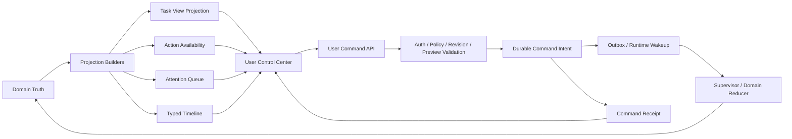
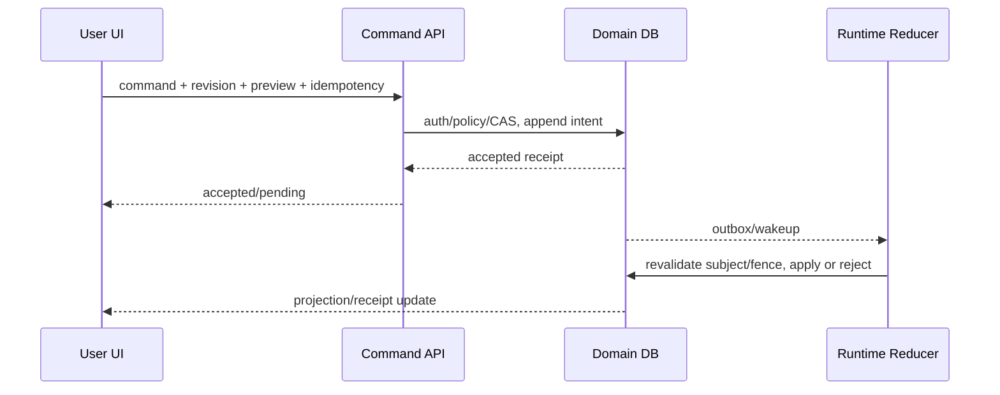
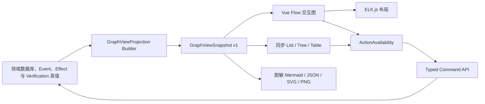

# 多 Agent 用户控制面技术设计

## 1. 文档定位

本文细化 D7：用户怎样创建和修订 Task Contract、查看 Plan/Agent/Tool/Verification/Memory 的真实状态，并通过可审计、幂等、版本绑定的命令执行 pause、cancel、approve、deny、retry、replan、reconcile、accept partial 和数据删除。

本文整体状态仍是“候选详细设计，待用户确认关键取舍”。其中 Execution Graph 的技术边界已由 [ADR-014](ADR-014-图可视化与LangGraph采用边界.md) 接受：核心 Runtime 不采用 LangGraph，交互图采用服务端 `GraphViewProjection + Vue Flow + ELK.js`，Mermaid 只用于脱敏静态导出。该决定不表示多 Agent TaskViewProjection、ActionAvailability、CommandReceipt、Attention Queue、Plan Diff、Research/Artifact/Evidence/Memory 控制中心或多活动任务前端已经实现。现有任务、审批、对账和历史 UI 继续有效；D7 随阶段 69～74 增量实现。

本文依赖：

- [《多 Agent 系统总体架构》](多Agent系统总体架构.md)；
- [《Task Contract、DraftPlan 与 ExecutablePlan Compiler 技术设计》](Task-Contract与ExecutablePlan-Compiler技术设计.md)；
- [《Agent Handoff、Invocation 与 Result Runtime 技术设计》](Agent-Handoff与Invocation-Runtime技术设计.md)；
- [《Claim、Evidence、Verification 与 Repair/Replan 技术设计》](Claim-Evidence与Verification-Repair技术设计.md)；
- [《Context Builder、Memory Broker 与 RAG/Artifact 数据平面技术设计》](Context-Memory-RAG数据平面技术设计.md)；
- [《多 Agent 跨层故障与恢复矩阵技术设计》](多Agent跨层故障与恢复矩阵技术设计.md)；
- [《多 Agent Scheduler 与部署拓扑技术设计》](多Agent-Scheduler与部署拓扑技术设计.md)；
- [《多 Agent 可观测性技术设计》](多Agent可观测性技术设计.md)。
- [《ADR-014：图可视化与 LangGraph 采用边界》](ADR-014-图可视化与LangGraph采用边界.md)。

## 2. 当前代码事实与真实缺口

当前已有：

- `TaskCreate` 的 goal、privacy、constraints 和少量固定 Tool request；
-单枚举 `TaskStatus`：created/classifying/running/waiting_approval/waiting_reconciliation/succeeded/failed/cancelled/paused；
- task pause/resume/cancel API、事件流和 bounded history；
- exact one-shot Approval：Tool/version、resource scope、risk、consequence、egress、preview hash、expiry 和 consumed state；
- Tool `unknown` Reconciliation：证据刷新、不可改写人工 outcome、新 attempt、compensation、graph continue/terminate；
-前端 TaskControls、ApprovalCard、ReconciliationEvidenceCard 和历史/集中对账；
-命令失败后的 snapshot reread 和部分幂等键复用。

当前缺口：

1. `TaskStatus` 单枚举不能表达“任务已取消但 Tool effect unknown”“AgentResult 已提交但 Verification error”等正交事实。
2. 前端仍按 `status === running/paused` 计算按钮，服务端没有统一 Action Availability 投影。
3. Pause/Resume 依赖当前进程内 `TaskProcessor` Runtime；多 Agent 跨进程不能复用该假设。
4. Cancel API 可持久化 graph-control intent，但用户投影仍容易把“命令已接受”误解为“全部工作已停止”。
5. 用户不能查看/修订完整 Task Contract、Plan generation/diff、acceptance coverage、预算和 egress。
6. 没有 ExecutionNode/AgentInvocation/Handoff/Verification/Evidence 的类型化公共投影。
7. Task events 是通用 payload，不适合作为长期稳定、按角色脱敏的公共时间线 API。
8. 前端活动任务期间禁止创建或切换第二任务，仍是 singleton control state。
9. Conversation/Memory/Context/Compaction 尚未实现，也没有 proposal、纠正、删除传播或 usage ledger UI。
10. Archive、cancel、delete、forget、compensate 的含义未统一展示。

## 3. 核心结论

1. 用户控制面是服务端事实投影和命令入口，不是第二个 Runtime 状态机。
2. 前端只提交 intent；服务端 `ActionAvailability`、Policy、revision、generation、preview 和 fence 决定操作能否执行。
3. 所有异步操作先形成持久化 `UserCommandIntent/Receipt`，不能在 Runtime 尚未应用时立即宣称成功。
4. Task 状态拆成 lifecycle、control、outcome、attention、effect risk、verification 等正交维度。
5. Pause 是在安全边界停止后续工作；Cancel 是阻止新工作并尝试取消，不等于 rollback、compensation 或 unknown 收敛。
6. Plan confirmation、exact Tool approval、Reconciliation 和用户满意度/accept partial 是四种不同决策。
7. 用户不直接控制 Agent 进程或改写 Node 状态，只能请求受支持的 Task/Node/Branch action。
8. Agent 不与前端建立私有旁路；Clarification 回答由 Runtime 归一为 ContextDelta 或 Contract Amendment。
9. `partial`、`failed`、`unknown`、`verification_error`、`cancelled` 必须有不同事实投影和用户文案。
10. 前端从单活动任务升级为按 task ID 归一化 store、独立 cursor 和持久化 Attention Queue。
11. Memory UI 展示 proposal、source/evidence、scope、version、usage 和删除传播，不能虚假声称远程副本已清除。
12. 普通视图解释目标、进展、证据、风险和下一步；高级视图才显示 invocation、attempt、fence、digest、trace 等诊断细节。
13. 所有控制命令绑定 actor、revision/generation/preview/idempotency 并写 Audit；WebSocket/前端缓存不是授权依据。

## 4. 总体架构



Projection 可以由领域表/事件重建；Command Intent 与业务应用使用 transaction/outbox/fence。UI 只能从 Projection 显示状态，不能通过本地 event 顺序自行提交 terminal outcome。

## 5. TaskViewProjection

```text
TaskViewProjection
- schema_version
- task_id
- revision
- contract_version
- plan_generation
- lifecycle
- control_state
- outcome
- attention_state
- effect_risk_state
- verification_state
- budget_state
- privacy_state
- progress_summary
- available_actions
- last_timeline_sequence
- updated_at
```

### 5.1 Lifecycle

```text
draft
planning
queued
running
waiting
terminal
```

### 5.2 Control state

```text
active
pause_requested
paused
cancel_requested
cancelled
```

### 5.3 Outcome

```text
none
succeeded
partial
failed
cancelled
```

### 5.4 Attention state

```text
none
needs_input
needs_plan_review
needs_approval
needs_reconciliation
verification_error
budget_exhausted
provider_unavailable
device_offline
policy_blocked
memory_conflict
deletion_incomplete
```

### 5.5 Effect risk

```text
none
intent_only
in_flight
committed
unknown
compensating
compensated
```

### 5.6 Verification

```text
not_started
pending
running
accepted
rejected
error
indeterminate
```

一个 Task 可以同时：

```text
lifecycle = terminal
control_state = cancelled
outcome = cancelled
effect_risk_state = unknown
attention_state = needs_reconciliation
```

因此不能再由单一 `TaskStatus` 决定所有 UI、恢复和通知。

## 6. Projection 的一致性与新鲜度

每个公共投影带：

- `revision`/ETag；
- `as_of_event_sequence`；
- `updated_at`；
- `freshness`：fresh/stale/rebuilding；
- `source_digest` 或受控 proof ref；
- `next_refresh_hint`。

Projection stale 时可以只读展示，但高风险 action 必须回读 authoritative tables 并校验 expected revision。前端不能因为 WebSocket 已到达某事件就假定数据库投影已可操作；写命令始终由服务端事务重新判断。

## 7. Action Availability

```text
UserActionDescriptor
- action_id
- action_type
- target_ref
- enabled
- reason_code
- safe_explanation
- expected_task_revision
- expected_contract_version
- expected_plan_generation
- confirmation_kind
- idempotency_required
- preview_ref/digest
- effect_class
- required_actor_scope
- expires_at
```

示例：

```json
{
  "action_type": "retry_node",
  "enabled": false,
  "reason_code": "TOOL_OUTCOME_UNKNOWN",
  "safe_explanation": "原 Tool 调用结果未知，必须先完成对账；不能直接重试。",
  "effect_class": "external_write"
}
```

前端可以根据 descriptor 隐藏/禁用按钮，但安全性不能依赖前端。命令到达时再次验证 action ID、revision、preview、Policy、subject generation、Approval、effect uncertainty 和 fence。

## 8. UserCommandEnvelope

```text
UserCommandEnvelope
- schema_version = deskpilot.user-command.v1
- command_id
- action_type
- task_id
- target_ref
- expected_task_revision
- expected_contract_version
- expected_plan_generation
- action_descriptor_id
- preview_digest
- parameters
- reason
- requested_by
- requested_at
```

HTTP 使用：

- `Idempotency-Key`：同一逻辑请求因网络不确定而重试时复用；
- `If-Match`/expected revision：拒绝陈旧页面；
- CSRF/origin/local-session protection；
- action-specific Schema，不开放任意 `parameters` 给领域 handler。

不能提供一个接受动态 action handler 或自由 SQL/state patch 的万能命令端点。统一 envelope 只统一幂等/审计/并发协议，实际 action 仍由固定 Registry 和类型化 command model 解释。

## 9. Command Receipt

```text
UserCommandReceipt
- command_id
- action_type
- task_id/target_ref
- status
- accepted_event_id
- applied_event_id
- task_revision
- reason_code
- replayed
- projection_url
- created_at
- updated_at
```

状态：

```text
accepted
pending
applied
rejected
superseded
expired
```

`accepted` 只证明命令 intent 已持久化；`applied` 才证明对应 reducer 已处理。命令网络响应丢失时，客户端用同一 Idempotency-Key 或 command ID 查询 Receipt，而不是换 key 重发。

## 10. 命令执行流程



Command API 不等待整个 Agent/Tool/Verification 生命周期。只有能在同事务内完成的纯投影命令才可直接返回 applied。

## 11. 控制动作语义

| 动作 | 真实语义 | 明确不承诺 |
| --- | --- | --- |
| Pause | 在安全边界停止创建后续工作 | 立即中断已发 external attempt |
| Resume | 从持久 checkpoint 创建新 WorkItem | 恢复旧协程/旧 Worker |
| Cancel | 阻止新工作并尝试取消可取消 attempt | 回滚已提交效果 |
| Retry | 创建新的受限 attempt | 重放原 Tool unknown |
| Replan | 创建新 Plan generation | 擦除旧 commit/unknown |
| Approve | 授权 exact preview 一次 | Tool 已执行 |
| Reject | 拒绝该 exact request | 自动取消全部 Task |
| Reconcile | 追加人工观察/裁决 | 改写原 unknown 账本 |
| Compensate | 创建反向任务和新审批 | 保证世界恢复原状 |
| Provide input | ContextDelta 或 Contract Amendment | Agent 私聊后自行扩权 |
| Accept partial | 用户接受部分交付/关闭注意项 | 把未满足条件改成 verified success |

## 12. Pause

Pause lifecycle：

```text
pause_requested
-> stop scheduling new non-control work
-> wait/cancel only cancellable attempts
-> persist outstanding model/tool/verification states
-> paused at safe boundary
```

外部 attempt 已进入 dispatch/commit 时不假装暂停成功。UI 显示：

> 已请求在下一个安全边界暂停。已经发送给 Provider 或 Runner 的调用可能继续完成，系统会保存其结果。

Resume 必须重新校验 Contract/Plan generation、Policy、credential/Provider、resource version、Worker capability 和 cancel/revoke；不能仅调用旧进程内 `asyncio.Event.set()`。

## 13. Cancel

Cancel lifecycle：

```text
cancel_requested
-> revoke new work/admissions/unused approvals
-> send cancellable child intents
-> preserve committed/unknown observations
-> terminal control state
```

UI 显示：

> 已停止创建新的工作，并尝试取消仍可取消的调用。已提交的效果不会自动回滚；结果未知的调用仍需对账。

Cancel 后仍可出现 AttentionItem：unknown reconcile、committed effect compensation、data deletion 等。`outcome=cancelled` 不自动使 `effect_risk_state=none`。

## 14. Emergency Stop

可选系统级高权限控制：

-阻止所有新 external dispatch；
-暂停普通 Scheduler pool；
-撤销未消费 Approval；
-向可取消 Worker/Runner 发 cancel；
-保留 control/recovery/verification capacity；
-不改写 committed/unknown；
-要求明确原因、双确认和 Audit。

Emergency Stop 不是 kill DB、删除 queue 或批量把 Task 改 failed。恢复前需要运维审查和逐 profile re-enable。

## 15. Node/Branch/Agent 控制边界

首版用户可以控制：

- Task；
-服务端声明可独立终止/重试的 Node/Branch；
- Approval/InputRequest/Reconciliation；
- Memory proposal/item。

不提供：

-杀死某个 Agent Worker 进程；
-强制 Node completed/verified；
-让 Agent 绕过 Verifier；
-把任意 AgentResult 设成最终答案；
-直接编辑正在运行 ExecutablePlan graph。

用户动作表达为 `cancel_branch`、`retry_node`、`request_replan`、`disable_agent_for_next_generation` 等 intent，由 Supervisor 判断 committed/unknown/join/coverage 是否允许。

## 16. Task Contract Draft 与确认

创建任务输入建议：

```text
goal
expected_outputs
resource_scope
explicit_constraints
forbidden_actions
privacy_mode
data_egress
model/tool/cost/token/turn budgets
deadline
acceptance_criteria
partial_policy
plan_review_preference
retention preference
```

用户提交的是 Draft，服务端返回规范化 Contract preview：

-受信默认值和 Policy 收紧；
- scope/egress/budget/acceptance；
-不支持/冲突/需要澄清；
- version/digest；
-是否可 Fast path；
-需要确认的变化。

模型可以协助解释目标，但不能生成用户未确认的授权范围、路径、egress、Approval 或 acceptance 降级。

## 17. Clarification/InputRequest

```text
InputRequest
- input_request_id/version
- task_id/node_ref
- question
- reason_code
- answer_schema
- choices
- affects_fields
- privacy_destination
- can_skip
- expires_at
- status
```

回答流程：

-普通事实/参数 → ContextDelta；
- goal/scope/privacy/budget/acceptance 改变 → Contract Amendment；
-新增 Tool/Agent/egress → Recompile/Replan；
-旧 generation superseded；
-回答仍经过 Policy，不能成为 Prompt 注入式授权。

Agent 只提交 `RequestInput` proposal；Supervisor 产生受信 InputRequest。前端不把用户回答直接追加到任意子 Agent 私有消息历史。

## 18. Plan Review 与 exact Approval 分离

| 决策 | 用户确认内容 | 是否授权副作用 |
| --- | --- | --- |
| Contract confirmation | 目标、范围、预算、隐私、验收 | 否 |
| Plan review | 结构、Agent、预计 Tool、成本和风险 | 否 |
| Tool Approval | 一次 exact Tool/resource/version/preview | 是，一次 |
| Reconciliation | 已经发生但结果未知的事实判断 | 否，不改原 call |
| User acceptance | 对 verified/partial 交付的满意度 | 否，不改验证事实 |

Plan review 不能产生“允许本任务未来所有写操作”的宽泛 capability。真实参数/资源版本确定后仍执行 exact Approval。

## 19. Plan Generation 与 Diff

Plan 页面显示：

- Contract version、Plan generation/digest；
- Node/edge/Agent/Tool/Verification bindings；
- acceptance coverage；
-预算与预计 egress；
-已 committed/unknown facts；
-每 Node 状态和 lineage。

Diff 分级：

```text
structure_change
budget_increase
new_provider_or_egress
new_tool_or_effect
resource_scope_expansion
acceptance_or_privacy_relaxation
```

后四种需要显式高亮/确认或直接被 Policy 禁止。Replan 不允许隐藏已发生效果，也不把旧失败从历史时间线删除。

## 20. Approval UX

保留现有 exact preview、expiry、risk、resource、capability、consequence、egress 和 one-shot scope，增加：

-来源 Contract/Plan/Node/Agent；
-为什么现在需要；
-资源 before/after version；
- Preview diff；
-可逆/可补偿及限制；
-审批后 lifecycle；
-是否已 consumed、dispatch、observed。

用户状态：

```text
pending
approved_not_consumed
consumed
dispatching
effect_observed
expired
cancelled
```

“已批准”不能显示成“已完成”。默认只提供 Approve once。Standing/bulk authorization 属于独立 Policy 管理和更高权限，不藏在任务卡片复选框。

## 21. Reconciliation UX

现有原则保留：

-原 Tool call 永久保持 unknown；
- evidence refresh 追加不可变 observation；
-人工 outcome 不改写原调用；
- `confirmed_failed` 不自动证明 no effect；
- `accepted_unknown` 不等于 failed/no effect；
-新 attempt 只在受信条件允许时创建新 task/call/key；
- compensation 从 committed receipt/后置状态派生并重新审批；
- graph continue/terminate 有独立 fenced command。

增加：外部后置状态、证据 freshness、裁决影响、后继 Task/Plan generation、不可撤销提示和 expected revision。

## 22. Partial、Failed、Unknown 与 Verification

控制面始终回答：

```text
已完成什么
未完成什么
可能已经发生什么
证据/验证如何
用户下一步能做什么
```

| 内部事实 | 用户标题 |
| --- | --- |
| Final Acceptance accepted | 已验证完成 |
| verified subset + unmet acceptance | 部分完成 |
| AgentResult submitted、Verification pending | 结果待验证 |
| Verifier infrastructure error | 暂时无法验证结果 |
| Claim rejected | 结果未通过验证 |
| cancelled + Tool unknown | 已取消，仍有一项操作待确认 |
| accepted_unknown | 已接受无法查明，不代表未产生效果 |
| terminal failed | 任务未完成 |

用户接受 partial 形成 `UserDisposition`/关闭 Attention，不把 Task outcome 改成 succeeded；用户不满意 verified result 时可创建 amendment/feedback/replan proposal，而不是改写 VerificationRecord。

## 23. Evidence 与 Verification 页面

按 Node/Claim 展示：

- Claim 摘要/类型；
- Agent Contract/Invocation/Prompt Package 版本；
- Evidence source/type/currentness；
- Receipt/Citation/Artifact refs；
- deterministic grader/Judge 使用；
- verdict/reason code；
- repair/replan lineage；
- limitations/uncertainty。

默认显示用户可理解摘要；高级视图显示 ID、digest、revision、generation、trace correlation。禁止显示隐藏 Prompt、CoT、凭据、内部 Policy 全文或其他用户/Task scope 内容。

## 24. Typed Timeline

不直接把所有内部 event payload 当长期公共 API。构建：

```text
TimelineItemRead
- timeline_id/sequence
- task_id
- category
- event_code
- title
- safe_summary
- status/outcome
- actor_kind
- subject_ref
- evidence/action refs
- occurred_at
- visibility
```

类别：contract、plan、agent、model、tool、approval、verification、recovery、memory、user、delivery。时间线是服务端投影；Domain event 仍是真值。DAG/Join 同时提供 causal links，不能只用线性时间暗示一个错误 parent 顺序。

## 25. Execution Graph 页面

Execution Graph 不是 Runtime，也不从 WebSocket 临时事件在浏览器内拼接真值。服务端从 Contract、Plan、Node、Invocation、Effect、Verification、Evidence 和 Command Receipt 生成版本化只读 `GraphViewSnapshot`；Vue Flow 负责交互渲染，ELK.js（npm 包 `elkjs`）只负责显示坐标，Mermaid 只负责脱敏静态导出。完整边界见 [ADR-014](ADR-014-图可视化与LangGraph采用边界.md)。



### 25.1 快照身份与新鲜度

```text
GraphViewSnapshot
  schema_version = deskpilot.graph-view.v1
  task_id
  task_revision
  contract_version
  plan_generation
  plan_manifest_digest_ref
  view_kind
  as_of_event_sequence
  projection_revision
  layout_revision
  freshness = current | stale | rebuilding
  nodes[]
  edges[]
  groups[]
  attention_refs[]
  available_action_refs[]
```

`projection_revision` 是刷新、缓存和命令预条件；`layout_revision` 只是显示配置版本，不能用于完成判断。WebSocket 只通知新 revision 或发送带 `base_revision/target_revision` 的有界 patch；revision 有缺口时重新拉取完整快照，不能继续猜状态。

### 25.2 Node 与 Edge

Node 显示持久事实：

```text
blocked
queued
running
waiting_model
waiting_tool
waiting_input
waiting_approval
waiting_verification
verified
rejected
partial
failed
cancelled
superseded
```

每个 Node 必须包含投影内 `graph_node_id` 和领域 `subject_ref(type/id/version/generation/attempt)`。重规划后同名节点不能复用旧 generation 身份。节点还可投影 lifecycle、control、outcome、effect risk、verification、certainty、attention、attempt count、预算、waiting reason、证据摘要和 action refs。

Edge 只表达有领域证据的 dependency、handoff、tool-child、verification、repair、replan 或 causal lineage；线性时间相邻不能自动推导父子边。Edge 显示 `all/any/condition/manual` requirement 和 pending/satisfied/blocked/rejected/superseded 状态。

### 25.3 五层显示

| 图层 | 默认策略 | 内容 |
| --- | --- | --- |
| Definition | 默认 | Contract acceptance、Plan generation、节点、依赖、join、受信条件 |
| Execution | 默认 | ready/claimed/running/waiting/terminal、Invocation、attempt、预算 |
| Effect | 风险/异常时展开 | Approval、Tool、Effect Ledger、receipt、unknown、compensation |
| Verification | 默认 | Claim、Evidence、Verifier outcome、repair/replan lineage |
| Attention/Recovery | 有未决项时突出 | clarification、approval、reconciliation、stale、人工 disposition |

默认聚合重复 attempt 和已完成低风险 Tool；用户可按 subgraph、Agent、Plan generation 或节点邻域钻取。图再大也不能无限创建 DOM 节点，应先折叠、分组和按需加载。

### 25.4 布局不是业务状态

- 服务端提供稳定 identity、分组、拓扑顺序提示和 `layout_revision`；
- 前端固定 Vue Flow/ELK.js 版本与 layered 配置，默认 left-to-right + orthogonal routing；
- 用户拖动、固定、缩放和折叠属于个人展示偏好，单独存储，不能写回 Plan/Runtime；
- 重规划时保留未变 `subject_ref` 的显示位置，新 generation 进入独立分组；
- 静态导出记录 projection/layout schema 与配置版本，但 Mermaid/SVG/PNG 永不成为真值。

### 25.5 命令与陈旧保护

图中按钮只能引用服务端下发的 `ActionAvailability` descriptor。前端提交 typed command 时带 task revision、plan generation、projection revision、preview digest 和 idempotency key；服务端必须重新检查最新状态、Policy、Approval 和 Effect 风险。

`freshness != current`、projection revision 落后或 descriptor 过期时，图可以只读查看，但不得仅凭旧按钮执行动作。拖动节点、修改本地颜色或伪造 Node 状态永远不能创建调度命令。

### 25.6 可用性、隐私与真实性

- 图视图必须同步提供 list/tree/table；支持键盘、焦点顺序和屏幕阅读器；
- 状态同时用文本、图标和颜色表达，不能只依赖颜色；
- 普通视图只显示安全解释，高级层再显示 ID、digest、fence 和 attempt lineage；
- `safe_label` 经服务端 allowlist、转义和长度限制，不接受 prompt、Memory/Result 原文、绝对路径、凭据、第三方 HTML 或命令行；
- 不显示无法证明的“Agent 正在思考”；Progress 不用虚假百分比，只显示已验证 acceptance/总 acceptance、已完成/ready/blocked Node 和未决风险；
- 导出必须授权、审计并复用相同脱敏 profile。

### 25.7 LangGraph 边界

不把 LangGraph/Studio 用作核心 Runtime 或用户控制面，也不把现有状态镜像成可恢复 LangGraph checkpoint。允许的 LangGraph 研究仅能读取脱敏 fixture/`GraphViewSnapshot`，不能连接生产 Tool Runner、凭据、审批签发或领域数据库写路径，且不进入默认依赖和发布包。扩大范围必须另立 ADR 并证明不会形成第二套 Task/Node/checkpoint 真值。

## 26. Budget 与 Privacy 控制

预算投影：

```text
limit
consumed
reserved
uncertain
remaining
```

`uncertain` 包含已发送但 usage/费用未确认的模型请求。用户可收紧预算、pause/cancel，或通过 Amendment 增加预算。增加预算、放宽 privacy、允许新 Provider/egress 是高影响变更；收紧限制可阻止新 work，但不能撤回已发送数据。

Privacy 页面显示：

- Contract privacy mode；
-实际 Provider/Tool/MCP egress destinations/categories；
-每次 ContextManifest 的分类/数量；
- blocked/denied egress；
- retention/export policy；
-不能撤回的历史发送事实。

不显示 credential、header、endpoint secret 或 Prompt/正文到普通 diagnostics。

## 27. 多活动任务前端

从 singleton 转为：

- `tasksById`/`viewsById`/`eventsById`/`attentionById`；
- `selectedTaskId` 与执行状态分离；
-每 Task 独立 cursor、revision 和 pending command；
-统一 event stream 或多 task subscription；
-切换选中 Task 不 pause/cancel；
-命令闭包绑定 task ID/revision，避免切换后误操作；
-并发上限由 Scheduler/Policy/用户设置，不由 Vue `taskInProgress` 决定；
-活动/注意/历史/归档筛选。

页面离线后重新加载服务器 Projection/Attention/CommandReceipt，不依赖内存中最后一个 Task。

## 28. Attention Queue

```text
AttentionItem
- attention_id/version
- kind
- task_id/target_ref
- severity
- title
- safe_summary
- available_actions
- created_at
- expires_at
- resolved_at
- dedupe_key
```

类型：clarification、plan_review、approval、reconciliation、verification_error、budget_exhausted、provider/device unavailable、policy block、memory conflict、deletion failure。

Attention 是持久投影，不是瞬时 toast；刷新/重启后仍存在，action 过期/被 supersede 后自动不可用。桌面通知只带安全元数据，不显示路径、Memory value、用户正文或 Approval resource 细节。

## 29. Memory Control Center

展示：

- kind/scope/status/version；
- value（只对有权用户）；
-用户/Agent/Tool/文档 source；
- Evidence/Verification；
- confidence/TTL；
-冲突、替代、tombstone 血缘；
-实际 usage ledger；
-删除传播状态。

动作：

```text
confirm
reject
correct
tighten_scope
change_ttl
delete
export
```

约束：

- Agent 派生内容默认 pending proposal；
- correction 新建版本，不改写历史；
-扩大 scope 重新验证/确认；
- delete 先 tombstone，再清理 index/cache/future Context；
-历史 Audit 可保留最小 digest/usage fact；
-远程 Provider 已接收内容不能被 UI 声称已删除；
- propagation pending/failed 形成 AttentionItem；
-已删除/过期/conflicted Memory 不进入新 ContextManifest。

## 30. Memory Usage Ledger

```text
MemoryUsageRead
- memory_id/version
- task_id
- agent_invocation_id
- context_manifest_id
- prompt_package_id/version
- provider_destination_class
- purpose
- supplied_at
- policy_decision_ref
- deletion_visibility
```

Usage ledger 来自实际 ContextManifest/dispatch，不用“可能被使用”推断。用户可以知道哪条 Memory 被提供给哪个 Agent/Provider，但普通 UI 不显示完整 rendered Prompt。

## 31. Context、RAG 与 Compaction 解释

用户可查看：

- Context 分类、source/version/currentness；
-条目/token/字节计数；
-发送 destination；
-因 privacy/stale/conflict 被拒绝的类别；
- Compaction coverage/关键约束保留；
- source 删除导致的 invalidation/rebuild。

用户可以移除用户拥有 source、收紧 scope 或请求重建。不能展示系统 Prompt、隐藏安全规则、其他 scope Memory 或不属于用户的原始证据。

## 32. Archive、Cancel、Delete、Forget 与 Compensate

| 操作 | 含义 |
| --- | --- |
| Archive | 从默认列表隐藏，不影响执行/证据 |
| Cancel | 停止后续执行，不删除数据 |
| Delete Task Data | 按 retention 删除用户内容/索引 |
| Delete Memory | tombstone 并阻止未来召回 |
| Delete Audit | 普通用户不能改写不可变安全审计 |
| Compensate Effect | 创建新的反向副作用任务 |

删除 preview 说明：立即删除、异步传播、保留的最小 audit digest、外部系统/副作用不可撤回。删除命令也使用 Receipt/Attention，不能点击后立即显示“全部删除”。

## 33. 权限与 Actor

即使桌面首版是单用户，也区分 actor capability：

```text
task.read/control
approval.resolve
reconciliation.read/resolve/recover
memory.read/manage
evaluation.run/baseline.approve
operations.read/recover
configuration.manage
emergency_stop
```

Session token、桌面 IPC、API actor 和 Audit 绑定。用户可见 action 由 actor scope + resource ownership + domain state 计算。前端路由/按钮隐藏不是 RBAC；所有写 API 验证 actor、origin、revision、idempotency 和 Policy。

## 34. UI 信息架构

任务详情：

```text
Overview
Contract
Plan / Diff
Execution Graph
Evidence & Verification
Approvals & Attention
Recovery / Reconciliation
Memory & Context
Budget & Privacy
Timeline
Diagnostics
```

默认 Overview：目标、headline、已完成/未完成、未决风险、预算和下一行动。高级 Diagnostics：IDs、digests、generation、attempt、fence、trace/telemetry。用户无需理解所有分布式细节才能知道任务是否安全完成。

## 35. API 草案

```text
GET  /tasks/{id}/view
GET  /tasks/{id}/actions
GET  /tasks/{id}/timeline
GET  /tasks/{id}/plans
GET  /tasks/{id}/plans/{generation}
GET  /tasks/{id}/plans/{generation}:diff
GET  /tasks/{id}/execution
GET  /tasks/{id}/evidence
GET  /tasks/{id}/verification
GET  /tasks/{id}/budget
GET  /attention

POST /tasks/{id}/commands
GET  /tasks/{id}/commands/{command_id}
POST /tasks/{id}/contract:amend
POST /tasks/{id}/input-requests/{request_id}:answer
POST /tasks/{id}/plans/{generation}:confirm
POST /tasks/{id}/nodes/{node_id}:retry
POST /tasks/{id}:request-replan

GET  /memory
GET  /memory/{memory_id}
GET  /memory/{memory_id}/usage
POST /memory/{memory_id}:confirm
POST /memory/{memory_id}:correct
DELETE /memory/{memory_id}
```

现有 Approval/Reconciliation 专用 API 保留，因为 exact preview、一次性 capability 和不可改写裁决有更强契约；不强行塞进一个动态万能 endpoint。

## 36. Frontend Store 与请求纪律

-响应必须验证 task/command/action/preview ID 与当前选中资源一致；
-每异步请求带 generation/cancellation，旧响应不覆盖新选择；
-同一逻辑写在网络不确定时复用 Idempotency-Key；
-成功 toast 只在 Receipt/projection 证明后显示；
- 409/412 读取最新 projection 和 diff，不自动重复危险命令；
- WebSocket event 只触发 refresh/projection update，不由浏览器重算业务终态；
- pending command 跨页面/重启恢复；
-敏感内容不放 URL/query/localStorage/telemetry；
-并发 Task 控制按 task ID 隔离，不使用全局 `activeAction` 锁全部页面。

## 37. 实施拆分

### 69-U1：Projection/Command 基础

- TaskViewProjection 正交状态；
- ActionAvailability；
- UserCommandIntent/Receipt；
- typed timeline；
- pause/cancel 新语义兼容层。

### 69-U2：多任务/Execution

- normalized multi-task store；
- Attention Queue；
- `GraphViewSnapshot v1`、Projection Builder 与快照 API；
- Plan/Node/Invocation/Handoff/Effect/Verification/Attention 五层投影；
- Vue Flow + ELK.js 交互图及信息等价的 list/tree/table；
- 脱敏 Mermaid/JSON/SVG/PNG 导出；
- 多 task event subscription；
- 等待原因/预算。

### 70-U：Verification/Recovery

- Claim/Evidence/Verification；
- partial/unknown/error；
- Repair/Replan；
- Approval/Reconciliation 血缘；
- user disposition。

### 71～72-U：Memory/RAG

- proposal/confirm/correct/conflict/TTL/delete；
- usage ledger；
- RAG source/currentness/privacy；
- deletion propagation Attention。

### 73-U：Compaction/Context

- ContextManifest/Compaction coverage；
- source invalidation/rebuild；
- advanced diagnostics/export。

## 38. 建议代码落点

```text
backend/src/deskpilot/
├── domain/
│   ├── control_plane.py
│   ├── task_views.py
│   ├── attention.py
│   └── user_commands.py
├── application/
│   ├── task_projection_service.py
│   ├── user_command_service.py
│   ├── attention_service.py
│   └── public_timeline_service.py
└── api/routes/
    ├── task_views.py
    ├── user_commands.py
    └── attention.py

frontend/src/
├── stores/
│   ├── tasks.ts
│   ├── commands.ts
│   └── attention.ts
├── views/
│   ├── TaskOverview.vue
│   ├── TaskContract.vue
│   ├── PlanGraph.vue
│   ├── EvidenceVerification.vue
│   ├── MemoryCenter.vue
│   └── AttentionCenter.vue
└── composables/
    └── useUserCommand.ts
```

## 39. 验收矩阵

1. UI 只从服务端 Projection/ActionAvailability 显示状态和动作；
2. 隐藏按钮不能绕过服务端权限；
3. Task state 能同时表达 cancelled + Tool unknown；
4. AgentResult submitted + Verification error 不误显示 success/fact rejected；
5. Command 绑定 actor/revision/generation/preview/idempotency；
6. 陈旧 revision/preview 返回稳定冲突并提供刷新入口；
7. 网络响应丢失后同 key/command receipt 恢复，不重复写；
8. accepted command 不误显示 applied；
9. Pause 等待安全边界，不丢 external observation；
10. Resume 只从验证 checkpoint 并重校验 Policy/resource；
11. Cancel 阻止新 work，但保留 committed/unknown；
12. Cancel 后 unknown 仍生成 Attention/Reconciliation；
13. Tool unknown 禁止直接 retry；
14. Replan 新 generation 继承 committed/unknown/budget/privacy；
15. Plan confirmation 不授权 exact Tool；
16. Approval pending/approved/consumed/effect observed 分开；
17. Reconciliation 不改原 Tool unknown；
18. accepted_unknown 文案不暗示 no effect；
19. user accepted partial 不改成 verified success；
20. Clarification 回答按影响成为 ContextDelta/Amendment；
21. Agent 不能直接建立前端旁路或扩权；
22. Execution 图只显示持久状态，不使用不可证明动画；
23. Timeline 公共 payload 类型化/脱敏；
24.多活动 Task 可切换且互不覆盖 cursor/command；
25.切换 Task 后旧响应不能误操作新 Task；
26. Attention 跨刷新/重启存在并可去重/过期；
27. Budget 显示 consumed/reserved/uncertain；
28.放宽 privacy/egress/budget 走 Amendment；
29. Memory proposal 默认不 active；
30. Memory correction 新版本，删除 tombstone/传播可见；
31. Usage ledger 来自实际 ContextManifest；
32.远程已发送内容不虚假显示完全删除；
33. Archive/cancel/delete/forget/compensate 文案和 API 分离；
34.普通视图不泄露 Prompt/CoT/secret/internal policy；
35.高级 diagnostics 仍按 actor scope；
36.所有控制写形成 Audit/CommandReceipt。

## 40. 明确禁止的捷径

-前端直接修改 Task/Node/Verification 状态；
-仅按单一 TaskStatus 计算所有操作；
- API 收到 cancel 就立即宣称所有外部工作停止；
-把 pause 当进程冻结；
-把 cancel 当 rollback；
- Tool unknown 直接 retry 原调用；
- Plan review 一次授权未来所有副作用；
- Approval approved 显示成 Tool completed；
-用户强制把 AgentResult 标 verified/succeeded；
-允许用户编辑运行中 ExecutablePlan graph；
-提供任意 kill Agent process 按钮；
-让 Agent 与前端建立绕过 Supervisor 的私有聊天；
-把 accepted_unknown 显示为 no effect；
-把 verification error 显示为 Claim 错误；
-用户接受 partial 后改写系统验收；
-用 WebSocket/前端 event 顺序作为业务真值；
-单全局 activeTask/activeAction 绑死多任务；
-删除按钮点击后立即声称全部数据/远程副本已删除；
-把 Prompt、Memory、路径或凭据写入通知/URL/telemetry；
-普通用户通过 UI 直接改不可变 Audit。

## 41. 待确认决策

| 决策 | 当前推荐 | 主要代价 |
| --- | --- | --- |
| 控制模型 | server projection + ActionAvailability + command intent | 新投影/Receipt/前端 store |
| 状态 | 正交 lifecycle/control/outcome/risk/verification | UI/Schema 复杂度增加 |
| 写协议 | revision/generation/preview/idempotency | 每个 action 契约更严格 |
| Pause/Cancel | 异步安全边界；Cancel 非 rollback | 用户需要理解 pending/unknown |
| Agent 控制 | Task/Node/Branch intent，不杀进程/强制完成 | 看起来不够“直接” |
| 确认分层 | Contract/Plan/Approval/Reconcile/User disposition 分离 | 交互步骤增加 |
| 多任务 | normalized store + Attention Queue | 前端重构 |
| Memory | proposal/version/usage/deletion propagation | 数据模型和 UI 较大 |
| 信息层级 | 普通解释 + 高级 diagnostics | 两套展示层 |
| Execution Graph | **已接受（ADR-014）**：server `GraphViewProjection + Vue Flow + ELK.js`；Mermaid 仅导出；LangGraph 不进核心 Runtime | 新投影合同、图与可访问列表两套渲染、前端依赖 |
| 删除 | 精确传播/保留事实，不承诺远程撤回 | 需要 retention/tombstone 机制 |
| 专用 API | Approval/Reconciliation 保留强类型 endpoint | API 数量多于万能 command |

服务端 ActionAvailability、持久命令回执、正交状态、Cancel 非 rollback、Tool unknown 不 retry、Plan 不等于 Approval 和 Memory 删除不虚假完成属于正确性/用户信任边界，不建议放宽。

## 42. 与后续设计的接口

- D8 第三方 Agent/Plugin 的安装、权限 diff、签名、撤销、升级和 quarantine 需要独立管理控制面；普通任务 UI 只展示已绑定快照与来源，不允许临时安装代码；
- D6 Evaluation/CI 管理视图使用相同 CommandReceipt/Audit 思路，但 baseline approve 是更高权限，不混入普通 Task action；
-多 Agent实施完成后，用户控制面必须能够从 Contract 到 Delivery 展示可验证 lineage，而不是用角色动画代替状态。
