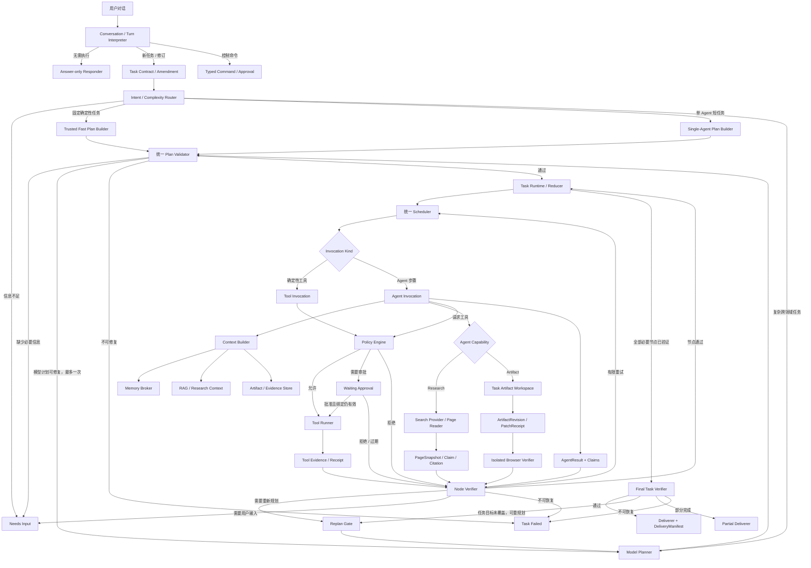

# 多 Agent 系统总体架构

## 1. 文档定位

本文记录 DeskPilot 后续多 Agent 系统的总体架构，不代表这些组件已经实现。当前代码仍以 `TaskProcessor`、受信 DAG、Policy/Approval、独立 Tool Runner 和持久化恢复为主；阶段 68 已完成固定 Agent Contract、严格 Prompt Loader、冻结 Registry 和精确 Binder，但 Invocation Runtime、Handoff、独立 Verifier、联网研究和 Artifact 工作区仍未实现。

阶段 67 与 68 已完成，当前进入阶段 69 Task Contract/Executable Plan Compiler。产品方向按 [ADR-015](ADR-015-通用任务Agent产品边界与首个纵向切片.md)调整为“本地优先、可联网研究、可生成并验证 Artifact 的通用任务 Agent”；专项能力架构见[《通用对话、联网研究与 Artifact 工作区总体架构》](通用对话联网研究与Artifact工作区总体架构.md)。

## 2. 总体设计结论

1. 顶层按任务形态分流，但底层共用同一个执行内核。
2. 路由分为 `fast_deterministic`、`fast_agent`、`planned_multi_agent` 三种模式，不只做简单/复杂二分。
3. 简单路径可以跳过模型 Planner，但不能跳过 Task Contract、本地 Plan Validation、Policy、持久化状态和 Verification。
4. 所有路径统一转换为版本化 `ExecutablePlan`，再进入同一 `Task Runtime / Scheduler`。
5. Supervisor 管计划生命周期、handoff 和聚合；Scheduler 管 ready-set、并发、预算、取消、lease/fence 和恢复，两者不能重复实现调度。
6. 每个节点先验证，验证通过的 Artifact/Evidence 才能解锁下游节点；全部节点完成后还要做最终任务验收。
7. Approval 是精确动作经过 Policy 后的执行状态，不是 Intent Router 的顶层分支。
8. Agent 之间不直接自由聊天；通过持久化 Invocation、结构化 Handoff 和 Artifact/Evidence 引用通信。
9. Memory、RAG、Task/Event 真值和 Artifact 必须分开存储、分开授权、分开失效。
10. Deliverer 只呈现已验证结果，不能新增未经验证的事实或把 `partial` 包装成成功。
11. 对话是用户入口，不是运行真值；新任务、任务修订、澄清和控制命令必须结构化分离。
12. “本地优先”允许显式联网和云端模型，但 Search/Page Read 必须通过 Provider-neutral Capability、Egress Gate 和 Claim/Citation 证据链。
13. 通用内容创建先落在单 Task 隔离 Artifact Workspace；导出或覆盖用户文件是独立风险动作。
14. 首个价值闭环是 `research_to_html`，必须经过独立引用验证和隔离 Browser Verifier，不以生成文件或模型自报作为完成证据。

## 3. 总体架构图



## 4. 三种执行模式

| 模式 | 典型任务 | 计划来源 | 模型 Agent | Tool | 示例 |
| --- | --- | --- | --- | --- | --- |
| `fast_deterministic` | 固定、单领域、参数明确 | 服务端固定 Plan Builder | 不需要 | 通常一个 | 查询磁盘空间、读取固定状态 |
| `fast_agent` | 单 Agent、短任务、无需分解 | 服务端单 Agent 计划 | 一个 | 可选 | 解释已验证指标、总结指定文本 |
| `planned_multi_agent` | 跨领域、长任务、有依赖/并行 | Model Planner 候选计划 | 一个或多个 | 可选/多个 | 知识检索与系统证据并行后汇总 |

三种模式只在“计划如何产生”和“有多少 Invocation”上不同。进入 `Plan Validator` 后必须复用同一套 Task Runtime、Scheduler、Policy、Verification、事件和恢复语义。

## 5. Task Contract

本节给出顶层边界；Contract version、provenance、acceptance coverage 和 Plan Compiler 的候选详细模型见[《Task Contract、DraftPlan 与 ExecutablePlan Compiler 技术设计》](Task-Contract与ExecutablePlan-Compiler技术设计.md)。

所有路径先形成版本化 Task Contract。建议至少包含：

```text
task_id / contract_revision / digest
original_goal / current_goal
explicit_constraints
success_criteria
privacy_mode / allowed_data_scopes
requested_output
deadline / model-tool-token-cost budgets
human_interaction_policy
current_user_instruction_identity
```

Task Contract 是 Router、Planner、Verifier 和 Deliverer 的共同输入。用户补充或修改目标时创建新 revision，不静默覆盖旧 contract；已执行副作用继续由原 contract、plan 和授权证明绑定。

Task Contract 可以记录风险姿态或早期风险提示，但不能代替针对精确 Tool、参数和资源版本的 Policy/Approval。

## 6. Router 与计划产生

### 6.1 Intent / Complexity Router

Router 只判断任务形态和是否有足够信息，不做最终授权。建议输出：

```text
route_mode
intent
complexity
missing_fields
recommended_agent/profile
requires_model_planning
early_risk_hints
confidence
```

低置信度、关键字段缺失或用户目标相互冲突时进入 `Needs Input`。信息不足不只是 Router 的一次性分支；Planner、Validator、Worker 和 Verifier 都可以提交结构化 `NeedsInputRequest`。

### 6.2 Trusted Fast Plan Builder

确定性简单任务不调用 Planner 模型。服务端从固定模板生成一个或少量节点的 `ExecutablePlan`，但仍需经过统一 Plan Validator。

### 6.3 Single-Agent Plan Builder

短语义任务使用固定 Agent Profile 和固定拓扑，只让 Agent 完成受限目标，不允许模型自由增加节点、工具或 handoff。

### 6.4 Model Planner

复杂任务中，模型只输出候选计划。它不能直接执行 Tool，也不能创建有效审批。候选计划必须绑定 Agent/Profile、Tool、依赖、预算、success criteria 和 output Schema，再交给 Plan Validator。

## 7. 统一 Plan Validator

简单计划也不能完全跳过验证。Validator 至少检查：

- Task Contract/Plan schema 和版本；
- step ID、依赖、无环和节点上限；
- Agent Profile、允许 handoff 和 capability；
- Tool manifest/version/schema 和 Agent allowlist；
- 数据作用域、privacy/provider location；
- 预算、deadline、重试和递归深度；
- success criteria 是否有可用 grader；
- 风险上限与潜在副作用；
- 未知命令、Shell、动态 Python、自由 URL 等禁止输入；
- plan manifest digest 和运行时 profile/tool 漂移。

模型计划校验失败最多允许一次有界修复；固定模板校验失败属于代码/配置问题，直接 fail closed，不调用模型“修好”受信模板。

## 8. Task Runtime、Supervisor 与 Scheduler

### 8.1 Task Runtime / Reducer

所有请求都创建 `TaskRun`。Task Runtime 持有持久化状态机，消费已提交事件并决定下一状态，负责 pause/resume/cancel、terminal state、checkpoint、unknown 和 reconciliation。

### 8.2 Supervisor

Supervisor 负责：

- 持有已验证 Plan revision；
- 创建结构化 Handoff 提案；
- 接收节点验证结论；
- 聚合已验证 Artifact/Evidence；
- 判断目标是否仍未覆盖；
- 提交受限 Replan Proposal。

Supervisor 不负责：

- 自己维护并发队列；
- 绕过 Scheduler/Policy 调用 Tool；
- 把 Agent 自报成功当作任务成功；
- 直接扩大数据范围、工具或审批作用域。

### 8.3 Scheduler

统一 WorkItem、admission、短 claim、Worker capability、device affinity 和部署 profile 的候选详细设计见[《多 Agent Scheduler 与部署拓扑技术设计》](多Agent-Scheduler与部署拓扑技术设计.md)。

Scheduler 负责：

- DAG ready-set 和依赖；
- Invocation admission、并发与公平；
- 资源冲突和写锁；
- attempt、deadline、预算和 backpressure；
- cancel propagation；
- lease、fence、跨进程接管和恢复；
- 只在上游节点验证通过后解锁下游。

简单和复杂路径必须共用一个 Scheduler，不能分别实现 `OR` 和 `OR2`。

## 9. Invocation 与 Worker

持久化记录需要区分：

| 记录 | 创建条件 | 说明 |
| --- | --- | --- |
| `TaskRun` | 所有请求 | 顶层任务状态和 Contract/Plan identity |
| `AgentInvocation` | 真实调用 Agent 模型 | Profile、Context、Model、Handoff、Claims 和 attempt |
| `ToolInvocation` | 真实调用 Tool | Tool/参数/资源/Policy/Approval/Runner/receipt |
| `VerificationRun` | 节点或最终验收 | grader、claims、evidence、结论和修复预算 |
| `DeliveryRun` | 需要生成用户呈现 | verified input、格式偏好和输出摘要 |

确定性简单任务只需要 `TaskRun + ToolInvocation + VerificationRun`，不应为了展示 Agent 而创建虚假的 AgentRun。

Worker 是执行单元，不一定是模型 Agent：

- Deterministic Worker：固定代码/Tool 调用；
- Agent Worker：通过 Model Gateway 执行版本化 Agent Profile；
- Tool Worker：仍由现有独立 Runner 处理副作用。

## 10. Policy、Approval 与 Tool Runner

高风险不能从 Router 直接进入有效审批。审批必须发生在精确动作已知之后：

```text
Plan / Agent Tool Request
→ 参数规范化和资源投影
→ Policy
→ 精确 Preview 与 digest
→ Approval
→ 再次复核参数/资源/profile/plan/fence
→ Tool Runner
```

审批至少绑定 task、plan revision、step/invocation、Tool/version、规范化参数、资源版本、preview digest、risk、actor、TTL 和一次性消费状态。

Policy 拒绝和用户拒绝不能通过 Replan 换一个 Tool 绕过。Agent 自称获得授权没有效力。

## 11. 节点验证与最终验收

### 11.1 Node Verifier

每个节点完成后立即验证：

- Tool receipt、资源后置状态；
- Agent claims 和 EvidenceRef；
- Artifact/Citation 完整性与 freshness；
- output Schema 和业务规则；
- 是否满足该节点 success criteria；
- 是否允许 retry、repair、replan 或需要用户。

只有节点验证通过，结果才能进入 verified Artifact/Evidence 视图并解锁依赖节点。原始 AgentResult 可以保留审计，但下游不能把它当事实。

### 11.2 Final Task Verifier

所有必要节点完成后仍要检查：

- 用户原始目标是否覆盖；
- 全局约束和 success criteria；
- 分别正确的节点是否组合成正确结果；
- 是否存在未决审批、unknown Tool 或 stale Evidence；
- 应输出 `verified`、`partial`、`needs_user`、`rejected` 还是 `failed`。

节点全绿不自动等于任务成功。

## 12. Replan Gate

Verifier 不能直接无限回到 Planner。Replan Gate 必须检查：

- replan 次数、Token、费用和时间预算；
- 失败属于结构性问题、暂时错误还是权限拒绝；
- 已完成副作用和 verified Artifact 如何保留；
- 新计划是否扩大工具、数据或风险范围；
- 是否试图绕过 Policy/Approval 拒绝；
- 新 Plan revision 如何使旧未执行节点、Invocation 和 Handoff 失效；
- 是否需要用户重新确认目标或范围。

用户拒绝、权限拒绝和不可补偿副作用不能通过“换一种计划”规避。

## 13. Context、Memory、RAG 与 Artifact 的挂载边界

总体架构只规定挂载位置，具体存储和检索算法另行设计。

| 组件 | 可以读取的内容 | 不应默认读取的内容 |
| --- | --- | --- |
| Router | 当前请求、当前会话明确约束、少量确定性设置 | 大规模 RAG、全部长期记忆 |
| Planner | Task Contract、Agent/Tool 能力目录、预算、高层确认偏好 | 用户文件全文、无关历史会话 |
| Supervisor | Plan、Invocation 状态、已验证结果和 Evidence refs | 全部原始文档、Agent 私有推理 |
| Agent Worker | 当前 Handoff、允许工具、必要 Memory/RAG/Artifact | 其他任务数据、全量共享聊天历史 |
| Deterministic Tool | 规范化参数、资源和授权证明 | 自然语言记忆、RAG 文本 |
| Verifier | success criteria、claims、evidence、Policy/Profile 版本 | 执行 Agent 私有思维链、副作用 Tool |
| Deliverer | 已验证结果、引用、语言/格式偏好 | 未验证 AgentResult、新事实来源 |

Context Builder 为每个 AgentInvocation 生成独立 `ContextManifest`。Agent 之间不共享可变聊天记忆，只通过 Supervisor 认可的 Handoff 和内容寻址 Artifact/Evidence 引用交换信息。

Memory/RAG 不能改变 Policy、审批或 Task/Event 真值。检索到的网页、文档和 MCP 内容必须标记为不可信数据，不能因出现在上下文中而获得指令优先级。

### 13.1 Conversation、Research 与 Artifact 的专用边界

- `Conversation/Message/Turn` 负责多轮入口；`TaskContract/Amendment` 才负责版本化目标和成功条件。聊天正文不能直接成为审批、导出或覆盖命令；
- Research Agent 只能通过 `research.read.v1` 调用 Search/Page Reader，并产出 `PageSnapshot -> ResearchClaim -> CitationEvidence`；网页正文不能改变 Agent/Task Contract、Policy 或 active Memory；
- Artifact Builder 只能通过 `artifact.html.v1` 修改绑定的 Task Workspace；不能联网、运行 Shell、安装依赖或直接写用户项目；
- Browser Verifier 是确定性验收组件，使用无登录、默认断网的新浏览器 Context，采集 DOM、错误、网络和截图证据；
- 工作区生成与导出分离。Task 范围授权可以覆盖受控工作区内的 R1 patch，但导出/覆盖用户路径必须重新绑定精确对象与审批；
- 详细对象、威胁模型和阶段门见[《通用对话、联网研究与 Artifact 工作区总体架构》](通用对话联网研究与Artifact工作区总体架构.md)。

## 14. Deliverer

Deliverer 是受限展示层：

- 将 verified/partial 结果转换为用户输出；
- 保留 Citation、Evidence 和失败分类；
- 应用已确认的语言、格式和详细程度偏好；
- 明确显示缺失项、需要用户处理和不可恢复错误。

Deliverer 不能新增未经验证的事实、改写 Verifier 结论、调用副作用 Tool，或把 `partial` 包装成成功。确定性简单任务优先使用模板 Deliverer，不必额外调用模型。

## 15. 两类主路径的职责差异

| 组件 | `fast_deterministic / fast_agent` | `planned_multi_agent` |
| --- | --- | --- |
| Task Contract | 必须 | 必须 |
| Intent Router | 必须 | 必须 |
| Plan Builder | 固定模板/固定单 Agent 拓扑 | Model Planner |
| Plan Validator | 必须，轻量确定性校验 | 必须，完整计划校验 |
| Supervisor | Task Runtime 可承担轻量控制 | 必须，管理 handoff/聚合/replan proposal |
| Scheduler | 必须，共享执行内核 | 必须，共享执行内核 |
| Worker | 零或一个 Agent；通常一个 Tool | 一个或多个 Agent/Tool，可并行 |
| Node Verifier | 必须 | 每个节点必须 |
| Final Verifier | 必须，可使用固定规则 | 必须，检查全局目标覆盖 |
| Deliverer | 模板优先，可选单 Agent | 基于已验证聚合结果 |

## 16. 为什么简单任务仍需要统一执行内核

即使没有 Planner 和 Supervisor，简单任务仍然需要确定性组件完成：

- 创建 `TaskRun`；
- 生成并验证固定 ExecutablePlan；
- 选择 Tool/Agent/Profile 版本；
- 设置 deadline、预算、attempt 和 cancel signal；
- 调用 Policy/Approval/Runner；
- 记录事件、Invocation、checkpoint 和 trace；
- 调用 Node/Final Verifier；
- 根据分类进行有限 retry；
- 处理 pause/cancel/restart/unknown；
- 把已验证结果交给 Deliverer。

因此简单路径跳过的是模型规划和多 Agent 协调，不是工程上的运行、授权、验证和恢复边界。

## 17. 明确禁止的捷径

- 为确定性 Tool 任务虚构 AgentRun；
- 简单路径绕过 Plan Validator、Policy 或 Verifier；
- Intent Router 直接创建未绑定精确动作的审批；
- Supervisor 和 Scheduler 各自维护一套并发/重试状态；
- 未验证 AgentResult 解锁下游节点；
- 多数 Agent 投票替代 Evidence 验证；
- Planner 通过换 Tool 绕过用户/Policy 拒绝；
- Agent 直接互相发送无 Schema 自由文本并形成隐式状态；
- Memory/RAG/摘要覆盖 Task、Policy、Approval 或 Tool ledger 真值；
- Deliverer 新增事实或隐藏 partial/failed。
- 把联网能力等同于把整个互联网文本塞进 Agent 上下文；
- 让网页内容触发 Tool、审批、导出或 active Memory 写入；
- 让 Artifact Builder 直接写用户项目或通过 Shell 执行生成代码；
- 在复用用户登录态的浏览器中验收生成页面；
- 只因 HTML 文件存在或截图看起来正常就宣称任务完成。

## 18. 当前已确定与后续待设计

已经确定：

- 三模式路由；
- 所有模式统一为 ExecutablePlan；
- 单一 Task Runtime/Scheduler；
- Agent/Tool Invocation 分开；
- 节点验证通过后才解锁依赖；
- 最终任务验收和 Deliverer 分离；
- Approval 位于精确 Policy 边界；
- Agent 通信通过持久化 Handoff 与 Artifact/Evidence。
- 产品目标是本地优先通用任务 Agent，而不是本地文件专用执行器；
- 首个纵向切片为 `research_to_html`；研究、Artifact 和 Browser Verification 都必须进入统一 Runtime；
- 核心 Runtime 不采用 LangGraph；可视化读取服务端只读 GraphViewProjection，边界见 [ADR-014](ADR-014-图可视化与LangGraph采用边界.md)。

已经形成专项设计：

1. [Agent Contract/Registry Schema、版本与初版计划绑定策略](Agent-Contract与Agent-Registry技术设计.md)；
2. [Agent Handoff/Invocation/Result、并行 join 与恢复状态机](Agent-Handoff与Invocation-Runtime技术设计.md)；
3. [Verifier、Evidence/Claim、repair/replan 和人工介入](Claim-Evidence与Verification-Repair技术设计.md)；
4. [Memory、RAG、Artifact、Context Builder 与上下文压缩链](Context-Memory-RAG数据平面技术设计.md)。
5. [通用对话、联网研究、Task Workspace、HTML Builder 与 Browser Verifier](通用对话联网研究与Artifact工作区总体架构.md)。

仍需逐项讨论并固化的 Plan Compiler、Agent Model Loop、Research/Artifact 参数、跨层恢复矩阵、部署拓扑、多 Agent 可观测性、评测门禁、用户控制面和第三方供应链，统一以[《多 Agent 后续技术架构讨论总纲》](多Agent后续技术架构讨论总纲.md)为索引。专项文档存在不代表相应 Runtime 已实现。当前实施顺序以阶段 69～75 为准：阶段 71 必须先形成首个真实通用纵向闭环，记忆、压缩与发布门在其后增量完成。
