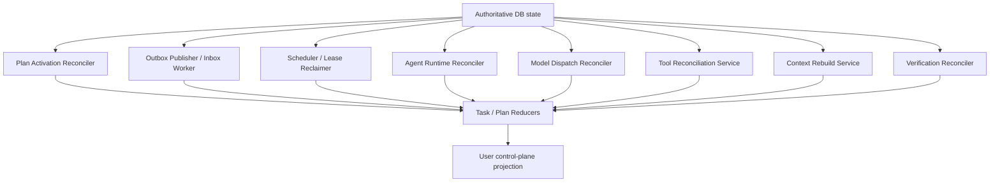

# 多 Agent 跨层故障与恢复矩阵技术设计

## 1. 文档定位

本文细化 D3：DeskPilot 从 API、Task Contract、Plan Compiler、数据库、Outbox/Broker、Scheduler、Agent/Model、Policy/Approval、Tool Runner、Context/Memory/RAG、Verification 到 Deliverer 的每个崩溃窗口，应由谁依据什么真值恢复，以及何时可以自动重试、何时必须产生新 attempt、何时必须对账或请求用户。

本文当前状态是“候选详细设计，待用户确认关键取舍”。它不是恢复组件已经实现的说明。现有 Tool effect graph、receipt、reconciliation、Outbox/Inbox、数据库 claim/fence 和 checkpoint 是可复用基础；多 Agent Plan/Invocation/Model/Verification/Context 的统一恢复矩阵尚未实现。

阶段 67 的脱敏 OpenTelemetry/显式回归门禁和阶段 68 Agent Contract/Registry 已完成。当前从阶段 69 Task Contract/Plan Compiler 续接；D3 仍是阶段 69～74 的横切约束，不另建第二套运行真值。

## 2. 当前代码事实与边界

当前系统已经具备较深的 Tool 与基础设施恢复能力：

- Tool call 持久化 ledger、幂等 receipt、prepare/commit/unknown/reconciliation；
- Tool effect graph/node claim、数据库时间 lease、fencing token、迟到 owner 拒绝；
- TaskEvent 与 Outbox 同事务、Inbox 去重、DLQ/requeue；
- 受保护 Task checkpoint 与事件/Tool/Policy/Approval/graph 精确绑定；
- 取消、暂停、审批和 unknown 人工对账主干；
- Ready/admission/count 投影与漂移重建；
- PostgreSQL/RabbitMQ/Runner 故障注入门禁。

仍存在以下多 Agent 缺口：

1. 当前 `TaskStatus` 仍是 `created/classifying/running/waiting_approval/waiting_reconciliation/succeeded/failed/cancelled/paused` 单枚举，无法同时表达“执行已取消但仍有 Tool unknown”“Agent 已完成但 Verification 基础设施错误”等正交状态；
2. 当前 Model Gateway 的 retry/fallback 与费用运行态主要是进程内，尚无 durable `ModelDispatchAttempt` reconciler；
3. AgentInvocation、VerificationRun、ContextManifest/Memory proposal 等对象尚未落地，恢复所有者和扫描条件只存在于设计；
4. 各专项文档已有局部 unknown/retry 规则，但尚无统一、机器可检查的跨层矩阵。

因此 D3 的目标不是把所有异常统一成 `retryable`，而是保留不同外部边界的真实确定性和恢复责任。

## 3. 不可破坏的恢复不变量

1. **Intent before dispatch**：没有持久化、可唯一识别的执行 intent，不得派发外部动作。
2. **Observation before advance**：外部结果、失败或 uncertainty 没有持久化，不得推进父状态或下游节点。
3. **Fence before commit**：所有迟到 Worker/response/result 在提交前必须校验当前 owner、lease、fence、attempt 和状态。
4. **One recovery owner**：同一个领域记录在某一状态只能有一个恢复所有者；父级 reducer 不越层重试子级。
5. **Broker is wakeup only**：Broker/DLQ/ack 不是 Task、Node、Invocation 或 Tool 的业务真值。
6. **Unknown is typed**：不同外部边界使用不同 uncertainty class，不能只存一个通用 `unknown`。
7. **New attempt means new identity**：已 dispatch 的 uncertain/failed attempt 不得用同一 attempt ID 重放。
8. **Cancellation does not rewrite history**：cancel/pause/replan/revoke 不得抹除 committed effect、receipt、unknown、deny、usage 或已消费 Approval。
9. **No DB, no new dispatch**：数据库 intent、live claim/fence、预算和 cancel/revoke 状态无法证明时，禁止新的 Provider/Runner/Judge 派发。
10. **Verification failure is not rejection**：Resolver/Grader/Judge 基础设施失败不能产生业务 `rejected`。
11. **Projection is rebuildable**：ready/count/UI/aggregate 状态由规范化真值重建，投影不能反向覆盖真值。
12. **Recovery consumes budget**：自动 retry/reobserve/repair/replan 都必须计入持久化预算和 deadline。

## 4. 通用动作生命周期

```mermaid
flowchart LR
    CREATED["Record created"] --> PREPARED["Intent prepared and committed"]
    PREPARED --> CLAIMED["Claimed with lease/fence"]
    CLAIMED --> DISPATCHING["Dispatching committed"]
    DISPATCHING --> EXTERNAL["External boundary"]
    EXTERNAL --> OBSERVED["Result/failure/uncertainty observed"]
    OBSERVED --> REDUCED["Domain reducer committed"]
    REDUCED --> PARENT["Parent projection/reducer"]

    PREPARED -->|"worker crash"| RECLAIM["safe reclaim"]
    CLAIMED -->|"lease expires before dispatch"| RECLAIM
    DISPATCHING -->|"crash/partition"| UNKNOWN["typed uncertainty"]
    OBSERVED -->|"crash before reduce"| RESUME["resume from observation"]

    RECLAIM --> CLAIMED
    UNKNOWN --> RECONCILER["domain reconciler"]
    RECONCILER --> OBSERVED
    RESUME --> REDUCED
```



不是所有对象都需要全部状态，但每个外部边界必须明确“dispatch 是否可能发生”的提交点。

## 5. 确定性与外部效果分类

### 5.1 CertaintyState

| 状态 | 语义 | 是否可直接重做同一逻辑工作 |
| --- | --- | --- |
| `not_committed` | intent 事务未提交 | 可以重新创建 |
| `prepared_not_dispatched` | intent 已提交，能证明尚未派发 | 可由新 claim 继续同一记录 |
| `dispatching` | 已进入外部边界 | 不能仅凭超时判断 |
| `known_succeeded` | 成功 observation/receipt 已持久化 | 复用结果，不重做 |
| `known_failed` | 能证明外部动作未成功 | 按策略创建新 attempt |
| `outcome_uncertain` | 无法证明成功或失败 | 进入对应 uncertainty policy |
| `reconciled` | 通过查询/receipt/人工裁决确定 | 按裁决继续 |
| `superseded` | 新 generation/attempt 已替代 | 旧结果只保留审计 |

### 5.2 ExternalEffectClass

| 类型 | 示例 | 恢复特性 |
| --- | --- | --- |
| `none` | pure Compiler、本地 JSON 校验 | 事务/纯计算可重试 |
| `replay_safe_read` | 有版本绑定的只读查询 | 可 reobserve，但结果有 freshness |
| `cost_or_egress` | Model/Judge 调用 | 可能重复计费/数据出境，无 OS 写副作用 |
| `idempotent_queryable_effect` | 有 operation ID、receipt query 的外部动作 | 先查询，再决定继续 |
| `non_idempotent_or_unqueryable_effect` | 邮件发送、发布、未知第三方写 | unknown 时必须对账/用户处理 |

“只读”不等于没有外部影响：云模型和外部检索仍可能计费、出境和被限流。

## 6. UncertaintyClass

| class | 不确定内容 | 默认阻断范围 | 默认恢复 |
| --- | --- | --- | --- |
| `delivery_unknown` | Broker 消息是否送达/ack | 不阻断业务真值 | 重投 + Inbox 去重 |
| `model_outcome_unknown` | Provider 是否生成结果、是否计费 | 当前 Turn | query if supported；预算允许则新 DispatchAttempt |
| `tool_effect_unknown` | 外部副作用是否发生 | 冲突资源及依赖节点 | receipt/state query → reconcile → 用户 |
| `verification_outcome_unknown` | Semantic Judge 是否返回/计费 | 当前 VerificationRun | 新 Judge attempt 或 verification_error |
| `external_delivery_unknown` | 邮件/发布/上传是否发生 | 对应业务交付与冲突操作 | 必须走 Tool effect reconciliation |
| `projection_unknown` | 真值已提交、投影是否应用 | 查询/UI/ready 投影 | 从规范化真值重建 |
| `context_freshness_unknown` | source/ACL/version 是否仍有效 | 依赖该 Context 的 Turn/Verification | 重新解析 source/version；不可猜测 |

不要用 `TaskStatus.WAITING_RECONCILIATION` 覆盖所有 uncertainty；它只能是用户聚合投影的一部分。

## 7. RecoveryAction

| action | 适用前提 | 身份规则 |
| --- | --- | --- |
| `resume_existing` | 成功/失败 observation 已提交但 reducer 未完成 | 不创建外部 attempt |
| `retry_transaction` | 能证明外部动作未派发 | 同一业务记录，新 DB transaction |
| `reclaim_existing` | prepared/claimed 未 dispatch，lease 过期 | 提升 fence，不增加外部 attempt |
| `retry_new_attempt` | known failure 或策略允许的 uncertain external call | 必须新 attempt identity |
| `reobserve` | 需要刷新外部只读状态/Evidence | 新 Observation/Evidence snapshot |
| `rebuild_projection` | 规范化真值存在，派生投影损坏/缺失 | 不重做外部动作 |
| `repair` | 目标不变、权限不扩大、有限修复 | 新 Invocation/Verification attempt |
| `replan` | 需要改变执行图 | 新 Plan generation |
| `reconcile` | 外部副作用 outcome uncertain | 使用 receipt/query/人工 verdict |
| `needs_user` | 需澄清、审批、预算或裁决 | 持久化等待，不占 Worker |
| `fail_terminal` | 不可恢复或预算耗尽 | 保留历史和 unresolved risk |
| `wait` | 正在合法等待外部输入/时间 | next_action_at/事件唤醒 |

任何代码路径如果只返回 `retry=True/False` 而不说明 action、identity 和依据，不能进入多 Agent Runtime。

## 8. 恢复所有权架构



| 领域状态 | 唯一恢复所有者 | 父级职责 |
| --- | --- | --- |
| sealed Plan 未激活 | PlanActivationReconciler | TaskReducer 等待/聚合 |
| Outbox pending/DLQ | OutboxPublisher/Operations | 不改变业务结论 |
| ready/claimed Node | Scheduler | Supervisor 不直接 claim |
| Invocation/Turn reducer 停滞 | AgentRuntimeReconciler | Plan reducer 读取状态 |
| Model dispatching/unknown | ModelDispatchReconciler | Invocation reducer 不自行调 Provider |
| Tool pending/unknown | Tool Runtime/Reconciliation | Agent reducer 不重放 Tool |
| Context stale | ContextRebuildService | Invocation 等待新 manifest |
| Verification pending/error | VerificationReconciler | Node reducer 不自判通过/拒绝 |
| Task aggregate | TaskReducer | 不越层执行恢复动作 |

不建议一个全局 Recovery Agent 直接操作所有表。可以有统一运维扫描与指标，但实际状态转换由领域 service 完成。

## 9. 父子状态传播

```text
TaskRun
└─ TaskExecutionRun / Plan generation
   └─ ExecutionNode
      ├─ AgentInvocation
      │  └─ AgentModelTurn
      │     └─ ModelDispatchAttempt
      ├─ ToolCall / ToolEffectGraph
      └─ VerificationRun / GraderAttempt
```

规则：

- 子级只报告持久化状态、reason code、proof refs 和 uncertainty；
- 父级 reducer 只能按注册转换表聚合，不基于 elapsed time 猜测；
- 父级 cancel/replan/revoke 写入 monotonic intent，子级领域负责收敛；
- 子级已发生 effect/usage 不因父级 superseded 而消失；
- hard unknown、未消费高风险 Approval、required verification error 或 stale required evidence 阻止 clean success；
- parent terminal 与 unresolved risk 可以同时存在于不同投影。

## 10. API、Contract 与 Plan 矩阵

| case | 故障窗口 | 可能外部效果 | 权威记录 | 恢复动作 | owner |
| --- | --- | --- | --- | --- | --- |
| FR-API-01 | API DB commit 前失败 | 无 | 无提交/idempotency pending | 客户端相同幂等键重试 | API |
| FR-API-02 | DB commit 后响应丢失 | 无 | idempotency receipt + response projection | replay 已提交响应 | API |
| FR-CONTRACT-01 | Contract Draft 构建进程崩溃 | 无 | UserIntent/已保存 Draft | resume/rebuild | Contract service |
| FR-CONTRACT-02 | sealed Contract 事务冲突 | 无 | 当前 version/digest | 重读；新 amendment 不能覆盖 | Contract service |
| FR-PLAN-01 | pure Compiler 中崩溃 | 无 | Contract/Draft/snapshots | 相同输入重新编译 | Compilation service |
| FR-PLAN-02 | Plan manifest 保存事务回滚 | 无 | 无 generation commit | retry transaction | Compilation service |
| FR-PLAN-03 | Plan sealed 后、execution graph 激活前崩溃 | 无 | sealed generation | 激活缺失 run/nodes/edges | PlanActivationReconciler |
| FR-PLAN-04 | 激活事务中途失败 | 无 | DB transaction | 整体 rollback/retry | Activation service |
| FR-PLAN-05 | exact digest 执行前漂移/revoked | 旧 effect 可能存在 | Plan refs + Registry state | 阻止新 attempt；Replan/needs_user | TaskReducer/Registry |
| FR-PLAN-06 | Replan 激活时旧节点仍在途 | 可能 | old run/child attempts | 写 supersede/cancel intent，等待领域收敛 | Plan/Task reducer |

## 11. Outbox、Broker 与 Inbox 矩阵

| case | 故障窗口 | 权威记录 | 恢复动作 | 业务状态影响 |
| --- | --- | --- | --- | --- |
| FR-MSG-01 | domain commit 后、publish 前崩溃 | Outbox pending | 重新 publish | 无 |
| FR-MSG-02 | Broker 收到、publisher 未标 delivered | Outbox pending/attempt | 重投 | Inbox 去重 |
| FR-MSG-03 | Consumer 处理前崩溃 | Broker redelivery + Inbox absent | 重投 | 无 |
| FR-MSG-04 | DB commit 成功、ack 前断线 | Inbox receipt + domain state | redelivery 后 replay/skip | 无重复业务动作 |
| FR-MSG-05 | Broker unavailable | DB pending/ready records | backoff + DB polling/sweep | 延迟，不改结论 |
| FR-MSG-06 | message 进入 DLQ | Outbox/DLQ state | 告警/显式 requeue/DB sweep | 不自动把 Task failed |
| FR-MSG-07 | 乱序/过期消息 | 当前 revision/status/fence | 读取 DB 后 no-op | 无 |

Broker payload 只携带最小 identity/revision hint。消费者永远回读数据库，不把消息正文当状态快照。

## 12. Scheduler 与 Worker 矩阵

RuntimeWorkItem、admission、Worker capability、部署 profile 和 rolling upgrade 的候选完整方案见[《多 Agent Scheduler 与部署拓扑技术设计》](多Agent-Scheduler与部署拓扑技术设计.md)。本节只固定故障窗口与恢复动作。

| case | 故障窗口 | 外部派发 | 恢复动作 | owner |
| --- | --- | --- | --- | --- |
| FR-SCH-01 | ready 计算后未 claim | 否 | 后续扫描/消息再次发现 | Scheduler |
| FR-SCH-02 | claim commit 后 Worker 未开始 | 否 | lease 过期，更高 fence reclaim | Scheduler |
| FR-SCH-03 | Worker 处理 pure local reducer 时崩溃 | 否 | reclaim/resume durable state | Domain reconciler |
| FR-SCH-04 | lease 续约失败且尚未 dispatch | 否 | 立即停止，不派发 | Worker |
| FR-SCH-05 | lease 失效后旧 Worker提交 | 可能 | fence CAS 拒绝，late observation 仅审计 | Domain service |
| FR-SCH-06 | Scheduler 双实例同时 claim | 否 | DB CAS/SKIP LOCKED 唯一胜者 | DB/Scheduler |
| FR-SCH-07 | Worker 长时间等待 Approval/Retry-After | 否 | 释放执行容量，持久化 next_action_at | Scheduler |
| FR-SCH-08 | admission 令牌取得后 node claim 失败 | 否 | 原子取得或有界释放/过期 | Scheduler/admission |

D4 需要进一步定义不同工作类型的 lease 和容量池，但 D3 已固定：等待用户/外部时间不应占用长寿 Worker。

## 13. Agent 与 Model 矩阵

| case | 故障窗口 | certainty | 恢复动作 | 预算 |
| --- | --- | --- | --- | --- |
| FR-AGENT-01 | Invocation 创建后 Context 构建前崩溃 | prepared | reclaim/resume | 无新费用 |
| FR-MODEL-01 | DispatchAttempt prepared 后、派发前崩溃 | prepared_not_dispatched | reclaim same attempt record/fence | reservation 保留/转移 |
| FR-MODEL-02 | dispatching commit 后、Provider 调用前明确崩溃 | 若能证明未调用 | known_failed | 新 attempt 或重置为未派发需严格证明 |
| FR-MODEL-03 | Provider 调用后、response commit 前崩溃/分区 | uncertain | `model_outcome_unknown` | uncertain 最大费用 |
| FR-MODEL-04 | Provider 明确 429/5xx/timeout-before-send | known_failed | 新 DispatchAttempt retry/fallback | 计 retry budget |
| FR-MODEL-05 | Response observation 已提交、Decision 未归一化 | known_succeeded | resume Decision validation | 不再调 Provider |
| FR-MODEL-06 | Decision 已保存、Tool/Result reducer 未完成 | known_succeeded | resume from Decision | 不再调 Provider |
| FR-MODEL-07 | schema repair response invalid | known_failed protocol | 新 schema-repair attempt | repair budget |
| FR-MODEL-08 | late response 到达旧 fence/已 superseded Turn | late | 受保护 observation；不得成为 winner | usage 计审计/uncertain 调整规则 |
| FR-MODEL-09 | Model unknown 后策略允许继续 | uncertain old | 新 attempt identity | 覆盖旧+新最坏费用 |
| FR-MODEL-10 | loop no-progress/budget exhausted | known | fail/partial/repair/replan proposal | 不再 dispatch |

Model unknown 策略：本地 Provider 可在 deadline/turn budget 内自动新 attempt；云 Provider 只有在剩余预算覆盖旧 attempt 可能已全额计费加新 attempt 最大费用、且 privacy 允许再次出境时才继续。支持 native request ID query 时先查询。uncertain reservation 不直接释放。

## 14. Agent Decision、Policy、Approval 与 Tool 矩阵

| case | 故障窗口 | effect certainty | 恢复动作 |
| --- | --- | --- | --- |
| FR-DECISION-01 | RequestTool Decision 保存后、ToolCall 未创建 | 不应存在跨事务洞 | Decision accept 与 child intent 应同事务；否则投影修复 |
| FR-POLICY-01 | Policy 计算前崩溃 | 未派发 | 重新计算当前 Policy；不缓存旧 allow 猜测 |
| FR-POLICY-02 | Policy decision 已保存、状态推进前崩溃 | 未派发 | resume exact decision |
| FR-APPROVAL-01 | Approval 创建后 API/Worker 崩溃 | 未派发 | 重读 waiting approval，不重复创建 |
| FR-APPROVAL-02 | 用户批准 commit 后 response 丢失 | 未派发或后续 | idempotency replay；Tool consumer exact binding |
| FR-APPROVAL-03 | Approval 已消费后 Worker 崩溃 | 取决于 Tool | 读取 Tool ledger；不能再次消费 |
| FR-TOOL-01 | Tool intent/ledger 保存后、Runner prepare 前 | 未派发 | resume existing call identity |
| FR-TOOL-02 | Runner prepare 确定失败 | 未 commit | known failed；按 policy 新 attempt |
| FR-TOOL-03 | commit 派发后 response/receipt 不明 | 可能发生 | `tool_effect_unknown`，禁止原 call 重放 |
| FR-TOOL-04 | signed receipt 已持久化、Agent Observation 未写 | known success | rebuild ToolObservation，不重做 Tool |
| FR-TOOL-05 | Runner 返回确定未提交 | known failed | 可显式新 attempt |
| FR-TOOL-06 | receipt query 证明成功 | reconciled success | 提交 verdict/继续 reducer |
| FR-TOOL-07 | query 证明未执行 | reconciled not_executed | 用户/Policy 允许后新 attempt |
| FR-TOOL-08 | 证据仍不确定 | unknown | needs_user/保持 reconciliation |
| FR-TOOL-09 | Replan/cancel 时 Tool 在途 | 可能 | intent 传播；按 commit boundary 收敛 |

Tool unknown 硬规则：不重放原 call；阻止冲突资源写；优先查询 receipt/后置状态/资源版本；只有证明未执行才允许新 attempt；无法确定时用户裁决；cancel/replan/failed 不得清除 unknown。

## 15. Context、Artifact、Memory 与 RAG 矩阵

| case | 故障窗口 | 权威真值 | 恢复动作 |
| --- | --- | --- | --- |
| FR-CONTEXT-01 | Context build 中进程崩溃 | ContextRequest + source stores | 重新编译；未封存 manifest 不可使用 |
| FR-CONTEXT-02 | manifest 保存后 Turn 未创建 | manifest/digest | resume Turn prepare |
| FR-CONTEXT-03 | source version 在构建中变化 | source version | reject mixed snapshot/rebuild |
| FR-CONTEXT-04 | source 更新后旧 RAG proof 被引用 | source/version proof | stale → reobserve/retrieve |
| FR-CONTEXT-05 | source 删除或 ACL 撤销 | deletion/ACL truth | fail closed，不自动复活缓存 |
| FR-CONTEXT-06 | Context delta chain 缺项/错序 | delta records/head digest | rebuild or reject |
| FR-COMPACT-01 | Compaction 生成中崩溃 | source refs | 重建新 snapshot |
| FR-COMPACT-02 | source 删除/漂移后旧 snapshot | source chain | stale；禁止新 Context 使用 |
| FR-MEMORY-01 | Agent proposal 保存前崩溃 | 无 active memory | 丢弃/重新 proposal |
| FR-MEMORY-02 | proposal 已保存、审核前崩溃 | proposal row | resume review，不自动 active |
| FR-MEMORY-03 | active/index 更新部分失败 | canonical memory + index generation | rebuild index；canonical state 优先 |
| FR-MEMORY-04 | delete committed、索引未删 | delete tombstone | invalidate/rebuild index，禁止召回 |

索引和摘要都是派生物。canonical source、ACL、version、delete tombstone 和 Memory activation state 拥有最终权威。

## 16. Verification 矩阵

| case | 故障窗口 | 业务 verdict | 恢复动作 |
| --- | --- | --- | --- |
| FR-VERIFY-01 | VerificationRun 创建后、grader 前崩溃 | 无 | reclaim/resume |
| FR-VERIFY-02 | deterministic grader 纯计算中崩溃 | 无 | 安全重算或新 grader attempt |
| FR-VERIFY-03 | grader observation 已保存、reducer 未运行 | 已知 observation | resume reducer |
| FR-VERIFY-04 | Evidence Resolver 基础设施失败 | 无负 verdict | `verification_error`/retry |
| FR-JUDGE-01 | Judge prepared、派发前崩溃 | 无 | reclaim existing prepared attempt |
| FR-JUDGE-02 | Judge dispatch 后 response 不明 | 无业务 verdict | `verification_outcome_unknown`；新 attempt policy |
| FR-JUDGE-03 | Judge response Schema 无效 | 无业务 verdict | failed_retryable/schema repair |
| FR-JUDGE-04 | Judge 明确判 Claim 不满足 | rejected observation | VerificationReducer 聚合 |
| FR-VERIFY-05 | ClaimVerdict 保存、Node unlock 前崩溃 | verdict 已知 | 原子 unlock 或 rebuild ready |
| FR-VERIFY-06 | required verification budget exhausted | 无通过证明 | verification_error/partial/needs_user/fail |

`verification_error`、`rejected`、`stale`、`unsupported` 和 `indeterminate` 必须保持不同含义。

## 17. Deliverer 与外部交付

| case | 故障窗口 | 恢复动作 |
| --- | --- | --- |
| FR-DELIVER-01 | 本地报告渲染中崩溃 | 从 verified result view 重新渲染 |
| FR-DELIVER-02 | Artifact 保存后 Task projection 未更新 | resume/rebuild projection |
| FR-DELIVER-03 | UI/WebSocket 断线 | after-seq 重连，读取持久化事件 |
| FR-DELIVER-04 | 邮件/发布/上传 dispatch 后不明 | 必须建模为 Tool effect，进入 external delivery reconciliation |

Deliverer 不应隐藏外部副作用。任何不可安全重复的“发送/发布/提交”都必须进入 Tool ledger。

## 18. DB 故障与网络分区

### 18.1 DB 不可用但尚未 dispatch

Worker 必须停止。不能因为已经把 Prompt/Tool request 保存在内存，就继续调用 Provider/Runner。

### 18.2 dispatch 后 DB 失联

- Model/Judge：记录无法提交时进入对应 outcome unknown；
- Tool：Runner 可能继续 commit，必须保留 effect unknown/receipt query；
- late response 在 DB 恢复后仍需通过当前 fence/status；
- 不得在本地文件或 Broker 消息中旁路宣布成功。

### 18.3 Worker 与 DB 分区但可访问外部服务

没有 live DB claim/fence 就不得新派发。lease 续约失败后 Worker 只能停止新工作并 best-effort 取消尚未提交外部调用。

### 18.4 DB commit 结果对客户端不明

通过 idempotency key、record identity 和重读判断，不能盲目重放包含外部调用的上层函数。外部调用必须位于独立的 commit 后阶段。

## 19. Pause、Cancel、Replan 与 Revoke

这些都是 monotonic intent，不是瞬时清理动作：

- **Pause**：阻止新 claim/Turn/Tool dispatch；已完成 Response 可保存，但 barrier 前不派发新 Tool；在途 Tool 按 commit boundary 收敛。
- **Cancel**：阻止新工作并 best-effort cancel Model/Judge；Tool effect/receipt/unknown 继续存在；可呈现“cancelled + unresolved reconciliation”。
- **Replan**：新 Plan generation；旧 run 写 supersede/cancel intent；committed/unknown/deny/usage/Evidence/Approval 历史进入 ExecutionSnapshot。
- **Revoke**：阻止 revoked Agent/Prompt/Tool/Policy 的新 claim/attempt；已 dispatch 调用按原边界收敛；历史 manifest/digest 保留。

## 20. 双投影 Task 状态

当前单一 `TaskStatus` 在多 Agent 后建议拆成至少两个正交投影：

```text
execution_lifecycle
  created / active / paused / cancel_requested
  / completed / failed / cancelled

blocking_or_risk_state
  none / needs_user / waiting_approval
  / model_uncertain / tool_reconciliation
  / verification_error / stale_context
```

用户展示可派生 `cancelled_with_unresolved_effects`、`execution_complete_awaiting_verification`、`failed_needs_reconciliation`、`paused_waiting_user`。展示状态不能反向驱动运行。

## 21. Retry 与 attempt 身份规则

| 情况 | 是否新 attempt | 原因 |
| --- | --- | --- |
| DB transaction rollback，外部未派发 | 否 | 只是事务重试 |
| prepared record 被新 owner reclaim | 否；提升 fence | 同一外部动作尚未派发 |
| Provider known failure | 是，ModelDispatchAttempt +1 | 真实网络尝试不同 |
| Provider outcome unknown | 是 | 旧调用可能仍成功/计费 |
| Tool known not executed | 是 Tool attempt | 旧 attempt 已有终态 |
| Tool effect unknown | 禁止，直到 reconcile | 避免重复副作用 |
| Schema repair | 是 DispatchAttempt，kind=repair | request digest 改变 |
| Agent Result repair | 是 AgentInvocation attempt | 执行语义改变 |
| Verification retry | 是 Grader/Judge attempt | 与执行 attempt 分离 |
| Replan | 新 Plan generation | 运行图和 identity 全部变化 |

## 22. 持久化恢复字段

所有可自动恢复记录至少需要适用字段：

```text
status / revision
attempt_no / attempt_kind
next_action / next_attempt_at
attempt_count / max_attempts
last_error_code / uncertainty_class
recovery_owner_type
claim_owner_id / claim_fencing_token
claim_acquired_at / heartbeat_at / expires_at
budget_reserved / settled / uncertain
cancel_requested_at / superseded_at / revoked_at
input/output/proof digests
created_at / started_at / finished_at
```

使用数据库时间判断 lease/next_action。等待 Retry-After、审批、用户回答或远期重试时释放 Worker 和容量令牌，不在 Worker 内长期 sleep。

## 23. Machine-readable recovery specification

建议正式实施时同时维护：

```yaml
schema_version: deskpilot.failure-recovery-matrix.v1
cases:
  - case_id: FR-MODEL-03
    layer: model_dispatch
    failure_window: after_dispatch_before_response_commit
    external_effect_class: cost_or_egress
    uncertainty_class: model_outcome_unknown
    authoritative_records:
      - model_dispatch_attempt
      - budget_reservation
    recovery_action: retry_new_attempt
    recovery_owner: model_dispatch_reconciler
    blocks:
      - current_turn
    required_event: agent.model.outcome_unknown
    required_metric: agent_model_dispatch_unknown_total
    fault_injection_test: test_model_worker_crash_after_dispatch
```

要求 case ID 稳定；Markdown 表由 YAML 生成或 CI 双向校验；每行绑定领域状态、事件、metric、用户投影和至少一个测试；不能从自由异常文本推断自动恢复动作。

## 24. 稳定错误分类

| code | 默认 recovery action |
| --- | --- |
| `RECOVERY_STATE_INVALID` | fail closed/运维介入 |
| `RECOVERY_OWNER_CONFLICT` | 重读/等待 lease |
| `RECOVERY_FENCE_REJECTED` | 丢弃迟到提交 |
| `RECOVERY_BUDGET_EXHAUSTED` | fail/needs_user |
| `RECOVERY_DEADLINE_EXPIRED` | cancel/fail/partial policy |
| `MODEL_DISPATCH_OUTCOME_UNKNOWN` | Model reconciler/new attempt policy |
| `TOOL_EFFECT_OUTCOME_UNKNOWN` | Tool reconciliation |
| `VERIFICATION_OUTCOME_UNKNOWN` | Verification retry/error |
| `CONTEXT_FRESHNESS_UNKNOWN` | Context rebuild/reobserve |
| `PROJECTION_DRIFT_DETECTED` | rebuild projection |
| `PLAN_ACTIVATION_INCOMPLETE` | activation reconciler |
| `BROKER_WAKEUP_EXHAUSTED` | DB sweep/alert，不改业务结论 |
| `CANCELLED_WITH_UNRESOLVED_EFFECT` | 用户/运维继续对账 |

## 25. 实施拆分

### D3-A：恢复 taxonomy 与规范

- certainty/effect/uncertainty/action/owner enums；
- `deskpilot.failure-recovery-matrix.v1` Schema；
- 从现有 Tool/Outbox case 回填矩阵。

### D3-B：Plan/Agent/Model recovery

- Plan activation reconciler；
- Invocation/Turn/Dispatch scan/claim/fence；
- persistent budget/unknown/late response；
- DB partition 故障注入。

### D3-C：Verification/Context recovery

- Verification/Judge attempt recovery；
- stale Context/source/delete propagation；
- projection rebuild。

### D3-D：Task aggregate 与控制面

- execution lifecycle + blocking/risk projection；
- pause/cancel/replan/revoke propagation；
- user-action/reconciliation projection。

### D3-E：门禁

- 每个 matrix case 绑定 fault injection；
- OTel/metric/event coverage；
- CI 检查未绑定 case/状态/测试。

## 26. 验收矩阵

1. 无 durable intent/live fence 时 Model/Tool/Judge 不会派发；
2. DB commit 成功但 API 响应丢失时同幂等键 replay，不重复业务写；
3. sealed Plan 未激活可被 reconciler 完整激活，不产生半图；
4. Broker 重投/乱序/DLQ 不改变 Task 业务结论，Inbox 去重；
5. Broker 完全不可用时 DB sweep 最终发现 ready/expired work；
6. claim 过期后更高 fence owner 接管，旧 owner 提交被拒绝；
7. Model dispatch 后 Worker 强杀产生 model unknown，新 attempt 使用新 identity 和 uncertain budget；
8. Model response 已持久化后崩溃不会再次调用 Provider；
9. RequestTool Decision 与 Tool child intent 不存在不可恢复洞；
10. Approval 等待跨重启保持 exact binding，不重复创建/消费；
11. Tool commit unknown 不自动重放，冲突资源被阻断；
12. receipt 已保存但 Observation 缺失时只重建 Observation；
13. Context source 更新/删除/ACL 撤销使旧 manifest/snapshot stale；
14. deleted Memory 不因索引延迟而被召回；
15. deterministic grader 可安全恢复，Judge unknown 不产生 rejected；
16. ClaimVerdict 已保存但 unlock 缺失时从真值恢复，不重跑 Agent；
17. Deliverer 外部发送必须经过 Tool ledger；
18. cancel 后在途 Tool 的 receipt/unknown 保留，UI 可显示 cancelled + reconciliation；
19. Replan 不遗忘旧 committed/unknown/deny/usage；
20. 每个 machine-readable matrix case 都有 owner、action、event/metric 和 fault test。

## 27. 明确禁止的捷径

- 所有异常统一 `retryable=true`；
- 同一个 failure 被 Worker、Scheduler 和 Supervisor 分别重试；
- Broker ack/DLQ 作为 Task 成败真值；
- DB 失联时继续派发新外部动作；
- 复用 outcome unknown attempt ID；
- Model unknown 和 Tool unknown 使用同一自动重试策略；
- Judge 失败就拒绝 AgentResult；
- projection 漂移时重新执行外部动作；
- cancel/failed/replan 删除旧 receipt、unknown、deny 或 usage；
- 长时间 sleep 占住 Worker 等待审批/Retry-After；
- 用自由错误消息决定恢复动作；
- 单一 TaskStatus 隐藏 unresolved external risk；
- 全局 Recovery Agent 直接改写所有领域表。

## 28. 待确认决策

| 决策 | 当前推荐 | 主要代价 |
| --- | --- | --- |
| 恢复所有权 | 领域 Reconciler + 父级 reducer 聚合 | 组件数和扫描器增加 |
| DB 失联 | 无 live intent/fence 时禁止新 dispatch | 可用性优先级低于一致性 |
| Model unknown | 隐私允许且预算覆盖双重最坏费用时自动新 attempt | 预算计算更保守 |
| Tool unknown | 永不自动重放原 attempt | 部分任务需要用户对账 |
| Verification error | 与 rejected 严格分离 | Task 状态/UI 更丰富 |
| Task 状态 | lifecycle 与 blocking/risk 双投影 | API/前端迁移成本 |
| 恢复规范 | Markdown + versioned YAML + fault-test binding | 维护矩阵工具链 |
| Broker | 仅 wakeup，DB sweep 兜底 | 需要维护扫描性能 |

其中 intent-before-dispatch、live fence、Tool unknown 不重放、Verification error 不等于 rejected、Broker 不作真值是正确性边界，不建议放宽。

## 29. 与后续设计的接口

- D4 Scheduler 必须使用本文 owner/lease/next_action 语义，并按工作类型分舱；
- D5 Telemetry 为每个 matrix case 定义 span/event/metric，严格脱敏；
- D6 CI 要求每个高风险 case 有故障注入与版本化基线；
- D7 控制面展示 lifecycle、blocking/risk、uncertainty、owner 和用户可执行动作；
- D8 第三方 Provider/Agent/Tool 必须声明 effect/idempotency/query/recovery 能力，不能只给一个 retryable flag。
