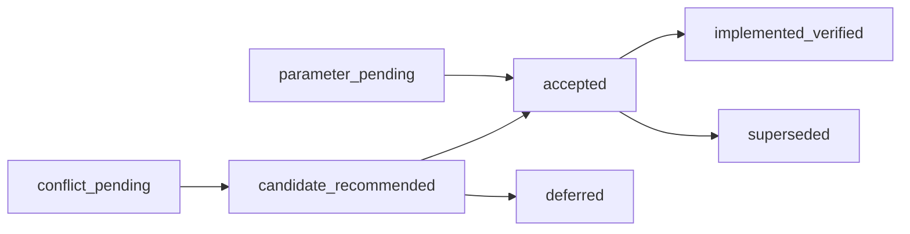

# 多 Agent 跨文档决策收敛矩阵

## 1. 文档定位

本文把 D1～D9 的 90 项来源取舍，以及基础专项设计中的身份、状态、摘要、错误码和真值边界，收敛为一份可逐项讨论的候选决策登记册。

本文不是架构方向本身，也不是最终 ADR。它只完成：

1. 给重复决策建立单一编号；
2. 显式列出文档之间的冲突、包含关系和兼容债务；
3. 给出推荐结论、代价、依赖和实施阶段；
4. 保留每一项来源映射；
5. 规定确认后如何生成 ADR 和回写专项文档。

`DM-036` 已在 [ADR-014](ADR-014-图可视化与LangGraph采用边界.md) 接受图可视化边界，`DM-037` 已在 [ADR-015](ADR-015-通用任务Agent产品边界与首个纵向切片.md) 接受通用任务产品方向。其余 `DM-*` 仍只是 `candidate_recommended`、`conflict_pending`、`parameter_pending` 或 `deferred`。文档成文不能替代用户确认，也不能表示相应 Runtime 已实现；两份 accepted ADR 同样只确认边界，不表示对应代码已经落地。

阶段 67 的脱敏 OpenTelemetry/显式回归门禁和阶段 68 的 Agent Contract/冻结 Registry 已完成。当前工程断点为阶段 69 Task Contract/Plan Compiler；阶段 69～75 的多 Agent/通用任务实施，以及阶段 75 之后的第三方供应链，不能因本矩阵出现而提前宣称完成。

## 2. 输入文档与覆盖范围

### 2.1 D1～D9

| 来源 | 文档 | 待确认项 |
| --- | --- | ---: |
| D1 | [Task Contract、DraftPlan 与 ExecutablePlan Compiler](Task-Contract与ExecutablePlan-Compiler技术设计.md) | 7 |
| D2 | [Agent Model Loop 与 Prompt Package](Agent-Model-Loop与Prompt-Package技术设计.md) | 9 |
| D3 | [多 Agent 跨层故障与恢复矩阵](多Agent跨层故障与恢复矩阵技术设计.md) | 8 |
| D4 | [多 Agent Scheduler 与部署拓扑](多Agent-Scheduler与部署拓扑技术设计.md) | 9 |
| D5 | [多 Agent 可观测性](多Agent可观测性技术设计.md) | 11 |
| D6 | [多 Agent 评测与 CI 门禁](多Agent评测与CI门禁技术设计.md) | 11 |
| D7 | [多 Agent 用户控制面](多Agent用户控制面技术设计.md) | 11 |
| D8 | [第三方 Agent 与插件供应链](第三方Agent与插件供应链技术设计.md) | 12 |
| D9 | [通用对话、联网研究与 Artifact 工作区](通用对话联网研究与Artifact工作区总体架构.md) | 12 |
| 合计 |  | 90 |

### 2.2 基础专项设计

- [Agent Contract 与 Agent Registry](Agent-Contract与Agent-Registry技术设计.md)；
- [Agent Handoff、Invocation 与 Result Runtime](Agent-Handoff与Invocation-Runtime技术设计.md)；
- [Claim、Evidence、Verification 与 Repair/Replan](Claim-Evidence与Verification-Repair技术设计.md)；
- [Context Builder、Memory Broker 与 RAG/Artifact 数据平面](Context-Memory-RAG数据平面技术设计.md)。
- [通用对话、联网研究与 Artifact 工作区总体架构](通用对话联网研究与Artifact工作区总体架构.md)。

### 2.3 已接受的横切 ADR

- [ADR-014：图可视化与 LangGraph 采用边界](ADR-014-图可视化与LangGraph采用边界.md)：核心 Runtime 不采用 LangGraph；服务端 `GraphViewProjection + Vue Flow + ELK.js` 承担交互图，Mermaid 仅承担脱敏导出。
- [ADR-015：通用任务 Agent 产品边界与首个纵向切片](ADR-015-通用任务Agent产品边界与首个纵向切片.md)：产品目标为本地优先通用任务 Agent；首个已验证纵向切片为 `research_to_html`。

基础专项文档没有统一的“待确认项”表，但它们已经定义运行对象和正确性边界。本矩阵不会把这些边界当作用户已接受 ADR；发现与 D1～D9 冲突时，以显式冲突项进入讨论。

## 3. 决策状态模型

| 状态 | 含义 | 是否可用于实现冻结 |
| --- | --- | --- |
| `candidate_recommended` | 已有推荐方案，尚未由用户确认 | 否 |
| `conflict_pending` | 两份或多份文档存在语义冲突 | 否 |
| `parameter_pending` | 上层模式推荐，但阈值/保留期/默认值未定 | 否 |
| `accepted` | 已讨论确认并产生 ADR | 是 |
| `superseded` | 被后续 ADR 明确替代 | 否，按替代项 |
| `deferred` | 明确后置，不进入当前实施阶段 | 否 |
| `implemented_verified` | ADR 已实现并有验收证据 | 是 |

状态推进：



只有 `accepted` 才创建正式 ADR 编号；`implemented_verified` 还需要代码、迁移、故障注入和门禁证据，不能只靠 Markdown。

## 4. 已发现的跨文档冲突与兼容债务

| 冲突 ID | 现状 | 推荐收敛 | 状态 |
| --- | --- | --- | --- |
| C-01 Turn/Dispatch identity | 早期 Handoff 文档把 `model_attempt` 混入 `turn_id`；D2 把 Turn 与 DispatchAttempt 分离 | D2 规则优先：`turn_id=(invocation_id, turn_no)`，`dispatch_attempt_id=(turn_id, attempt_no)` | `conflict_pending` |
| C-02 Task 状态维度 | D3 建议 lifecycle + blocking/risk；D7 定义 lifecycle/control/outcome/attention/effect-risk/verification 六维投影 | D3 作为恢复核心 taxonomy；D7 是面向用户的严格超集，不建立第二套真值 | `candidate_recommended` |
| C-03 Plan identity | 部分示例同时出现 `plan_id` 与 `(task_id, plan_generation)` | 语义身份固定为 `(task_id, plan_generation)`；`plan_id` 仅为数据库 surrogate/ref | `candidate_recommended` |
| C-04 Plan digest 命名 | `plan_digest` 与 `plan_manifest_digest` 混用 | 新 schema 统一 `plan_manifest_digest`；旧字段仅做兼容 alias | `candidate_recommended` |
| C-05 Context digest 命名 | `context_digest`、`final_context_digest`、`context_manifest_digest` 混用 | 运行绑定使用 `context_manifest_digest`；Manifest 内的渲染输入字节使用 `final_context_digest` | `candidate_recommended` |
| C-06 Verification aggregate | 文档混用 `verified` 与 `accepted` 表示 VerificationRun 整体通过 | ClaimVerdict 保留 `verified`；VerificationRun outcome 用 `accepted`；Node 通过后可进入 `verified` | `conflict_pending` |
| C-07 Unknown/uncertain | 错误码使用 `*_OUTCOME_UNKNOWN`，D3 certainty 使用 `outcome_uncertain`，UI 使用 `unknown` | 三者按层保留并建立固定映射；禁止当同一自由字符串使用 | `candidate_recommended` |
| C-08 Capability mismatch code | D1 repair 列表出现 `CAPABILITY_MISMATCH`，稳定错误表使用 `PLAN_CAPABILITY_MISMATCH` | 统一为 `PLAN_CAPABILITY_MISMATCH`，旧短码不进入持久化记录 | `candidate_recommended` |
| C-09 Historical trace_id | 现有领域列名 `trace_id` 实际是 Task correlation，不是 W3C trace ID | 新代码使用 `task_correlation_id`；真实 OTel `trace_id` 独立保存；旧列保留兼容说明 | `candidate_recommended` |
| C-10 Registry enabled | Agent Registry 的 enabled 与 Bundle lifecycle enabled 名称相同 | 分别命名 `agent_availability_state` 与 `bundle_lifecycle_state`；最终使用 `effective_availability` 投影 | `candidate_recommended` |
| C-11 completed 语义 | 外部 attempt completed、Verification completed、Task succeeded 容易混用 | `completed` 只表示某处理流程结束；业务成功使用对应 `outcome`/`accepted`/`succeeded` | `candidate_recommended` |
| C-12 Revision/fence | WorkItem、subject、Invocation 各有 revision/fence，部分示例只校验一层 | 提交必须同时校验 WorkItem fence、subject revision/fence、active generation 与 revoke/cancel barrier | `candidate_recommended` |
| C-13 产品目标与实施路线 | 顶层愿景声称浏览器/搜索/通用 Agent，但代码和旧路线长期围绕磁盘/文件与底座，真实联网和 Artifact 价值没有阶段门 | 按 ADR-015 把 `research_to_html` 固定为阶段 71 价值门；阶段 69/70 分别提供合同和只读研究前置 | `accepted` |

正式 ADR 接受后，应回写冲突来源；在此之前保留原文，避免把候选收敛伪装成既有共识。

## 5. 统一身份模型

### 5.1 身份基本规则

1. ID 是不可变对象实例的引用，不是权限、状态或内容证明。
2. Version/generation 表示同一逻辑对象的有序修订；attempt 表示一次新的外部或执行尝试。
3. Digest 证明某个规范 payload/manifest 的内容身份，不替代 ID。
4. `attempt_no`、`turn_no`、`generation` 只在父作用域内有意义，不能单独作为全局键。
5. 新 attempt 不覆盖旧 attempt；旧 observation、usage、receipt 和 unknown 继续保留。
6. 所有 ID 使用不含业务含义的 opaque value；名称、路径、Prompt 和 digest 不作为数据库主键。
7. 派生 ID 必须绑定 schema/derivation version，无法保证长期稳定时使用数据库分配的 opaque ID。

### 5.2 Canonical identity catalog

| 对象 | 语义身份 | 何时创建新身份 | 不得混用 |
| --- | --- | --- | --- |
| Task | `task_id` | 新用户任务/显式复制任务 | Conversation ID、trace ID |
| Task Contract | `(task_id, contract_version)` | amendment 或重新确认 | Task revision |
| Plan | `(task_id, plan_generation)` | replan 或新 Contract 重新编译激活 | Draft repair attempt |
| Plan Node | `(task_id, plan_generation, local_key)` → `node_id` | 任一新 generation | 跨代同名 step |
| Execution Run | `run_id`，唯一绑定 Task + generation + manifest digest | 新 generation | Worker process run |
| Agent Invocation | `(node_id, invocation_attempt_no)` → `invocation_id` | Agent repair/retry、新 Handoff target attempt | Model transport retry |
| Model Turn | `(invocation_id, turn_no)` → `turn_id` | 新逻辑决策位置 | Provider retry/fallback |
| Model Dispatch | `(turn_id, dispatch_attempt_no)` → `dispatch_attempt_id` | transport retry、fallback、schema repair | Agent repair |
| Agent Decision | `decision_id`，绑定一个完整 response observation | 新 winner candidate | streaming delta |
| Tool Call/Operation | `call_id/operation_id` + Tool attempt | 每个精确副作用尝试 | Agent Turn |
| Handoff Proposal | `handoff_proposal_id` | Agent 新建议 | 已接受 Handoff |
| Handoff Envelope | `handoff_id` | Supervisor 接受并持久化一次委派 | 自由 Agent 消息 |
| Agent Result | `result_id`，绑定 Invocation 与 result sequence | 新 Invocation 通常产生新 Result | Verified conclusion |
| Verification Run | `(result_id, policy_digest, attempt_no)` | grader/Judge retry、新 Evidence snapshot | Agent Invocation retry |
| Claim | `claim_id`，绑定 Result | Result 新建 | Verdict |
| Evidence | `evidence_id` + evidence digest | 新 observation/source version/receipt | Citation 文本 |
| Research Session/Call | `research_session_id` / `(session_id, query_no, attempt_no)` | 新任务研究批次或真实外部 retry | Model Turn、URL |
| Page Snapshot | `page_snapshot_id` + content digest | 每次真实抓取/页面版本/抽取器版本变化 | 裸 URL、SearchHit 摘要 |
| Research Claim/Citation | `research_claim_id` / `citation_evidence_id` | 新 Result/Claim 或证据定位变化 | 页面正文、最终事实 |
| Task Workspace | `workspace_id`，唯一绑定 task/generation/profile | 新 Task/隔离范围 | 用户目录路径 |
| Artifact Revision/Patch | `(artifact_id, revision_no)` / `patch_receipt_id` | 每次内容变化/patch attempt | 可变文件路径 |
| Browser Render Run | `(artifact_revision_id, browser_profile_digest, attempt_no)` | 每次真实渲染 | 用户浏览器 tab |
| Context Request | `context_request_id`，绑定 Invocation/Turn | 新 Turn 或显式 refresh | Context Manifest |
| Context Manifest | `manifest_id` + manifest digest | 选择、source version、ACL、delta 或 renderer 变化 | 原始 Store 内容 |
| Memory Item | `memory_id` + `memory_version` | 确认、纠正、冲突解决、删除/tombstone | Conversation message |
| Compaction Snapshot | `snapshot_id` + snapshot digest | source set/权限/压缩算法变化 | active Memory |
| Runtime WorkItem | `(work_type, subject_type, subject_id, subject_revision, action)` | subject revision/action 变化 | 业务 attempt |
| User Command | `command_id` + Idempotency-Key | 新用户意图 | HTTP retry |
| Evaluation Run/Trial | `evaluation_run_id/trial_id` | 每次真实运行 | OTel trace |
| Baseline | `(baseline_id, version)` + manifest digest | record/approve 新版本 | 原地覆盖 |
| Publisher | `publisher_identity` | 主体变化，不随 key rotation 变化 | key fingerprint |
| Bundle | `(package_id, package_version, subject_digest)` | 新版本；同 ID/version 新 digest 是冲突 | archive 文件名 |
| Trace Episode | W3C `trace_id` | 每个有界 episode | Task correlation |
| Task Correlation | `task_correlation_id` | Task 建立时 | 授权、幂等键 |

### 5.3 Attempt 与 retry 规则

| 情况 | 新业务/外部 attempt |
| --- | --- |
| DB transaction rollback，证明未 dispatch | 否 |
| prepared record 由新 owner reclaim | 否，只提升 fence |
| Provider known failure 后 retry/fallback | 是，DispatchAttempt |
| Provider outcome unknown 后允许继续 | 是，旧 attempt 保留 uncertain usage |
| Tool known not executed 后重试 | 是，Tool attempt |
| Tool effect unknown | 禁止创建冲突 attempt，先 reconcile |
| Schema repair | 是，DispatchAttempt，kind=repair |
| Agent Result repair | 是，AgentInvocation |
| Verification retry | 是，Verification/Grader/Judge attempt |
| Replan | 新 Plan generation，所有 Node identity 更新 |
| Broker 重投 | 不是业务 attempt，由 Inbox/dedupe 归一 |
| UI 网络重试 | 复用 Idempotency-Key/command ID |

## 6. 统一状态模型

### 6.1 不建立“全系统万能状态枚举”

推荐使用正交状态轴。每个对象只实现适用轴，TaskViewProjection 聚合而不拥有底层真值。

| 状态轴 | 回答的问题 | 典型值 |
| --- | --- | --- |
| `lifecycle_state` | 对象处在处理生命周期哪里 | created/pending/ready/claimed/running/waiting/completed/failed/cancelled/superseded |
| `control_state` | 是否存在 pause/cancel/revoke 控制意图 | active/pause_requested/paused/cancel_requested/cancelled |
| `business_outcome` | 业务结果是什么 | none/succeeded/partial/failed/cancelled |
| `verification_state` | 验证执行/结论如何 | not_started/pending/running/accepted/rejected/error/indeterminate |
| `certainty_state` | 外部动作是否确定发生 | not_committed/prepared_not_dispatched/dispatching/known_succeeded/known_failed/outcome_uncertain/reconciled/superseded |
| `effect_risk_state` | Task 聚合的副作用风险 | none/intent_only/in_flight/committed/unknown/compensating/compensated |
| `attention_state` | 现在需要谁处理什么 | needs_input/needs_approval/needs_reconciliation/verification_error/... |
| `availability_state` | Registry/Bundle 是否可被新工作使用 | enabled/deprecated/disabled/revoked 或 effective unavailable |
| `admission_state` | 是否取得运行容量/准入 | pending/granted/expired/revoked |

### 6.2 Verification 层级

| 层级 | Canonical 值 |
| --- | --- |
| ClaimVerdict | verified/unsupported/contradicted/indeterminate/stale/not_applicable |
| VerificationRun lifecycle | queued/resolving/running/completed/failed_retryable/failed_terminal/cancelled/superseded |
| VerificationRun outcome | accepted/partial/rejected/needs_user |
| Node verification | awaiting_verification/verified/partial/rejected |
| Task projection | pending/running/accepted/rejected/error/indeterminate |

Verifier/Judge 基础设施错误只进入 `error` 或 failed lifecycle，不能生成 `rejected`。`rejected` 表示验证过程可靠完成并判定 Claim 不满足 Policy。

### 6.3 Unknown 映射

| 层 | 值 | 用途 |
| --- | --- | --- |
| Domain certainty | `outcome_uncertain` | 可机读恢复规则 |
| Uncertainty class | `model_outcome_unknown`、`tool_effect_unknown` 等 | 阻断范围与 owner |
| Stable error code | `MODEL_DISPATCH_OUTCOME_UNKNOWN` 等 | API/Audit/指标 |
| User projection | `unknown` / needs_reconciliation | 用户可理解状态 |

“unknown”不是 failed、cancelled、retryable 或 no-effect 的同义词。

### 6.4 Control intent

Pause、Cancel、Replan、Revoke 都是单调持久化 intent：

- 先阻止新工作；
- 在安全边界收敛在途动作；
- 不删除 committed/unknown/receipt/deny/usage；
- 不承诺 rollback；
- 强停外部写可能产生新的 unknown；
- reducer 应用前 UI 只显示 requested/pending。

## 7. 统一 Digest 与摘要协议

### 7.1 Digest envelope

所有新 digest 字段必须有可解释 profile：

```text
DigestDescriptor
- algorithm = sha256
- canonicalization_id
- schema_id
- schema_version
- payload_kind
- included_fields_profile
- digest_hex
```

`digest_hex` 可以作为数据库列保存，但 schema/canonicalization/profile 必须由对应对象合同固定，不能靠字段名猜测。

### 7.2 Digest 类型

| 类型 | 证明范围 | 示例 | 不证明 |
| --- | --- | --- | --- |
| Content digest | 精确 bytes/canonical object | artifact/content/result | 来源可信、语义正确 |
| Contract/spec digest | 不可变规则对象 | Agent/Tool/Verification/Policy | 当前已启用 |
| Manifest digest | 一个闭包及精确引用集合 | Plan/Context/Prompt/Bundle | 运行已经成功 |
| Request digest | 一次请求的 canonical 输入 | Tool/Model/User command | 外部已收到 |
| Observation digest | 一次响应/观察内容 | Provider/Tool/RAG observation | 永久有效 |
| Evidence digest | EvidenceRef + provenance/时间/授权绑定 | receipt/citation snapshot | Claim 必然为真 |
| Snapshot digest | 某时点不可变选择/状态闭包 | Evidence/Context/Registry/Eval cohort | 未来仍新鲜 |
| Chain/event digest | 当前记录 + previous digest | Audit、Baseline lineage | 外部现实 |
| Grant/approval digest | 精确能力/预览/actor/expiry | CapabilityGrant/Approval | 已执行 |
| Export policy digest | 遥测字段与脱敏策略版本 | Telemetry | 任务授权 |

### 7.3 统一命名

| 推荐字段 | 替代/兼容字段 |
| --- | --- |
| `task_contract_digest` | 模糊 `contract_digest` 只在类型上下文清楚时保留 |
| `plan_manifest_digest` | `plan_digest` |
| `node_spec_digest` | 无 |
| `agent_contract_digest` | 无 |
| `prompt_package_digest` | 无 |
| `context_manifest_digest` | Runtime 中的 `context_digest` |
| `final_context_digest` | 仅 ContextManifest 内的最终渲染输入 |
| `tool_contract_digest` | 无 |
| `verification_policy_digest` | `policy_digest` 在跨域时过于模糊 |
| `evidence_snapshot_digest` | 无 |
| `bundle_subject_digest` | 不使用 archive digest 作为运行绑定 |
| `runtime_binding_digest` | 无 |

### 7.4 Digest 不得承担的职责

- 不作为授权 token；
- 不作为 secret；
- 不作为远程匿名化手段；
- 不替代版本、状态、publisher identity、receipt 或 Evidence；
- 不把原文 hash 自动降为低敏；
- 不因新增无关 Registry 项让旧 Plan 全局失效；
- 不接受模型、第三方 Agent 或 UI 提供的可信 digest；
- 同 stable ID + version 出现不同 digest 时 fail closed。

远程遥测关联使用 keyed HMAC token；裸 SHA-256 不视为匿名。

## 8. 真值归属矩阵

“Authoritative”只表示对某类问题拥有最终解释权，不表示该记录证明所有现实事实。

| 问题 | Authoritative record/component | 派生/非真值 | 备注 |
| --- | --- | --- | --- |
| 用户当前目标与限制 | sealed `task_contract_versions` + amendment chain | Prompt、Conversation 摘要 | 用户新指令需形成 amendment |
| 当前执行图 | active `task_plan_generation` + immutable Plan manifest | DraftPlan、UI graph | Draft 是不可信建议 |
| 节点运行状态 | TaskExecutionRun/Node/Invocation 规范化表 + reducer | Task headline status | 运行状态不写回 Registry |
| Agent 可用版本 | frozen Agent Registry snapshot + per-agent state | Planner selector | Runtime 只 resolve exact |
| Model route/attempt | ModelDispatchAttempt + route snapshot + budget ledger | Gateway 内存计数、OTel | Provider 外部结果可能 uncertain |
| Tool 副作用 | Effect Ledger + commit receipt + reconciliation verdict | AgentResult、TaskEvent、MCP annotation | receipt 证明范围受 Contract 限制 |
| Approval | exact Approval/Grant record + consumed state | Plan approval hint、UI badge | Approval 不证明执行 |
| Agent 输出 | AgentResult 只是 candidate | 模型自报 success | 结构完整不等于正确 |
| Claim 是否成立 | VerificationRun + ClaimVerdict + resolved EvidenceSnapshot | Agent confidence、多数票 | current Claim 受 freshness |
| Artifact 内容 | content-addressed Artifact Store | 向量索引、摘要 | digest 只证明内容 |
| Conversation | Conversation Store | Working Memory | 用户记录不自动授权 |
| Working/Long-term Memory | versioned Memory Store/Broker state | 模型摘要、向量召回 | Agent 只能 proposal |
| RAG 来源 | source/artifact/version/ACL + retrieval proof | lexical/vector index | Citation 证明“来源写了什么” |
| Context 选择 | ContextRequest/Manifest | rendered Prompt 本身 | 原内容真值仍在各 Store |
| Compaction | CompactionSnapshot + source chain | narrative summary | 不能承载审批/unknown 真值 |
| 调度命令 | RuntimeWorkItem + subject state | Broker message | WorkItem 不是业务结果 |
| 容量 | versioned admission/permit records | 进程内 semaphore 指标 | claim 时与 subject 同事务校验 |
| Broker 投递 | Outbox/Inbox 记录 | RabbitMQ ack/queue depth | Broker 只 wakeup |
| 用户命令 | UserCommandIntent/Receipt | HTTP 200、前端本地状态 | accepted 与 applied 分开 |
| 用户页面 | 服务端 Projection + ActionAvailability | WebSocket arrival order | 高风险写回读领域表 |
| 业务审计 | Domain/Audit records | OTel log/span | 不采样 |
| 评测结论 | Evaluation Run/Trial/Trace/Report/Baseline/Gate records | OTel、headline score | baseline immutable |
| 诊断 | OTel trace/metric/safe log | 不能反推业务事实 | 可采样、可丢弃 |
| 已安装第三方包 | Installed Bundle Registry + immutable content root + verification records | marketplace listing | install 不等于 enable |
| 外部现实当前状态 | 新 receipt/query/observation Evidence | 数据库旧快照 | 无法查询时保留 unknown |

### 8.1 数据库边界

推荐“数据库保存运行真值”不等于所有大内容都塞进关系表。Artifact/Payload 可在受保护内容存储，但数据库保存内容地址、digest、ACL、状态、retention 和 lineage。Broker、OTel、前端缓存、Worker 内存和向量索引不能成为唯一恢复来源。

## 9. 统一错误、结果与恢复协议

### 9.1 ErrorEnvelope

```text
ErrorEnvelope
- schema_version = deskpilot.error.v1
- error_id
- stable_error_code
- category
- source_component
- subject_type / subject_id / subject_revision
- task_id / plan_generation / node_id
- attempt_type / attempt_id / attempt_no
- certainty_state
- uncertainty_class
- external_effect_class
- retry_disposition
- recovery_action
- recovery_owner
- safe_message_key
- protected_details_ref
- occurred_at
```

普通 API、Event、OTel 和 UI 不保存自由异常正文。原始 stack/error/payload 如确需保留，进入受保护 Artifact/Payload Store 并有 TTL、ACL 和访问 Audit。

### 9.2 Error code 结构

继续采用项目已有的大写下划线格式：

```text
<DOMAIN>_<BOUNDARY_OR_OBJECT>_<CONDITION>
```

| Namespace | 示例 |
| --- | --- |
| `TASK_CONTRACT_*` | TASK_CONTRACT_INCOMPLETE |
| `PLAN_*` | PLAN_MANIFEST_DRIFT |
| `AGENT_REGISTRY_*` / `AGENT_*` | AGENT_CONTRACT_MISMATCH |
| `PROMPT_*` | PROMPT_PACKAGE_DIGEST_MISMATCH |
| `CONTEXT_*` / `MEMORY_*` / `RAG_*` / `COMPACTION_*` | CONTEXT_MANIFEST_STALE |
| `MODEL_*` | MODEL_DISPATCH_OUTCOME_UNKNOWN |
| `POLICY_*` / `APPROVAL_*` | APPROVAL_STALE |
| `TOOL_*` / `RUNNER_*` / `MCP_*` | TOOL_EFFECT_OUTCOME_UNKNOWN |
| `VERIFICATION_*` / `EVIDENCE_*` / `GRADER_*` | VERIFICATION_EVIDENCE_STALE |
| `RUNTIME_*` / `SCHEDULER_*` / `RECOVERY_*` / `BROKER_*` | RECOVERY_FENCE_REJECTED |
| `EVALUATION_*` / `BASELINE_*` / `GATE_*` | BASELINE_COHORT_MISMATCH |
| `TELEMETRY_*` | TELEMETRY_ATTRIBUTE_REJECTED |
| `USER_COMMAND_*` / `PROJECTION_*` | USER_COMMAND_REVISION_CONFLICT |
| `BUNDLE_*` / `PUBLISHER_*` | BUNDLE_SIGNATURE_INVALID |

禁止用 HTTP status、异常类名或错误 message 直接驱动恢复。HTTP/GraphQL/WebSocket 只是稳定错误投影。

### 9.3 分离五个概念

| 概念 | 示例 | 用途 |
| --- | --- | --- |
| Stable error code | MODEL_DISPATCH_OUTCOME_UNKNOWN | 发生了什么 |
| Business outcome | partial/rejected/succeeded | 业务结论 |
| Certainty/uncertainty | outcome_uncertain/tool_effect_unknown | 能否证明外部结果 |
| Retry disposition | same_record/new_attempt/after_reconcile/never | 是否允许继续 |
| Recovery action/owner | reconcile/tool_reconciler | 谁做什么 |

一个 error code 不能单独决定 retry；决策至少取决于 lifecycle、effect class、certainty、attempt、budget、deadline、Policy 和 cancel/revoke barrier。

### 9.4 RetryDisposition

```text
none
retry_transaction
reclaim_same_record
new_attempt
after_reobserve
after_reconcile
after_user
after_policy_change
never
```

### 9.5 用户安全原因

`safe_message_key` 来自固定 catalog，映射为本地化说明。它可以解释“为什么按钮不可用”，但不能泄露绝对路径、Prompt、Policy 内部规则、publisher key、secret 或第三方 stderr。

## 10. 主决策矩阵

### 10.1 身份、版本与摘要

| ID | 推荐结论 | 主要来源 | 代价 | 状态 | ADR |
| --- | --- | --- | --- | --- | --- |
| DM-001 | Contract/Plan/Policy/Registry/Bundle 版本不可变，新变化创建 version/generation | D1/D4/D6/D8 | 版本与保留记录增加 | `candidate_recommended` | ADR-001 |
| DM-002 | Plan 语义身份为 Task + generation；Node identity 必含 generation | D1/Handoff | 旧 UI/API 需迁移 | `candidate_recommended` | ADR-001 |
| DM-003 | Invocation、Turn、Dispatch、Tool、Verification attempt 严格分层 | D2/D3/Handoff | 表和 lineage 增加 | `conflict_pending` | ADR-001 |
| DM-004 | WorkItem 是 subject revision 的派生调度命令，不是业务 attempt/结果 | D4 | 需要 projection repair | `candidate_recommended` | ADR-001 |
| DM-005 | task correlation、OTel trace、event、evaluation ID 各自独立 | D5 | 查询 UI 需关联索引 | `candidate_recommended` | ADR-001 |
| DM-006 | 所有 canonical digest 绑定 schema/canonicalization/profile | D1/D2/D5/D6/D8 | 需要统一库与迁移 | `candidate_recommended` | ADR-002 |
| DM-007 | Digest 不承担授权、匿名、状态或 publisher identity | D5/D8 | 需 HMAC token/独立记录 | `candidate_recommended` | ADR-002 |
| DM-008 | Runtime/Resume 精确绑定实际引用项 digest；漂移 fail closed | Registry/D1/D8 | 更新与恢复更严格 | `candidate_recommended` | ADR-002 |

### 10.2 状态与真值

| ID | 推荐结论 | 主要来源 | 代价 | 状态 | ADR |
| --- | --- | --- | --- | --- | --- |
| DM-009 | Task 使用正交 lifecycle/control/outcome/attention/effect-risk/verification 投影 | D3/D7 | API/UI Schema 更复杂 | `candidate_recommended` | ADR-003 |
| DM-010 | execution、verification lifecycle、verification outcome 分离 | Handoff/Verification/D7 | reducer 与 UI 增加状态 | `conflict_pending` | ADR-003 |
| DM-011 | unknown 使用 certainty + uncertainty class，不当作 generic failed | D2/D3/D7 | 对账路径增加 | `candidate_recommended` | ADR-003 |
| DM-012 | pause/cancel/replan/revoke 是持久单调 intent，非清理/rollback | D3/D7/D8 | 用户需理解 pending | `candidate_recommended` | ADR-003 |
| DM-013 | 领域 DB/受控内容存储保存运行真值，Projection 可重建 | D3/D4/D5/D7 | 需要 reducer/reconciler | `candidate_recommended` | ADR-004 |
| DM-014 | 外部副作用只由 Effect Ledger/receipt/reconciliation 解释 | Tool 主干/D1/D3 | unknown 需人工或查询 | `candidate_recommended` | ADR-004 |
| DM-015 | AgentResult 是 candidate；Verification/Evidence 才能解锁 | Handoff/Verification/D6 | 延迟和成本增加 | `candidate_recommended` | ADR-004 |
| DM-016 | Context/Memory/RAG/Compaction 各有真值，Index/Summary 仅派生 | 数据平面/D7 | 多 Store 协调成本 | `candidate_recommended` | ADR-004/ADR-009 |
| DM-017 | WorkItem/Broker/OTel/UI 都不是业务真值 | D3/D4/D5/D7 | 必须保留 DB sweep/投影 | `candidate_recommended` | ADR-004 |
| DM-018 | Evaluation Trace 是评测证据；OTel 只是诊断，不进入 report digest | D5/D6 | 两套 Trace 查询概念 | `candidate_recommended` | ADR-004/ADR-011 |

### 10.3 错误、重试与恢复

| ID | 推荐结论 | 主要来源 | 代价 | 状态 | ADR |
| --- | --- | --- | --- | --- | --- |
| DM-019 | 统一 ErrorEnvelope 与 namespace；自由异常不驱动状态机 | D1～D9 | 需要错误 catalog | `candidate_recommended` | ADR-005 |
| DM-020 | Recovery 由 code + effect + certainty + budget + policy 决定并显式记录 action/owner | D3 | 规则矩阵维护成本 | `candidate_recommended` | ADR-005 |
| DM-021 | 领域 Reconciler 拥有本领域恢复；父 reducer 只聚合 | D3/D4 | 扫描器和 owner 增加 | `candidate_recommended` | ADR-005 |
| DM-022 | Tool unknown 永不盲重放；Model unknown 可在双重最坏预算内新 attempt | D2/D3 | Model 预算保守、Tool 需对账 | `candidate_recommended` | ADR-005 |
| DM-023 | Broker 只 wakeup，DB sweep 兜底；DB proof 缺失时不新 dispatch | D3/D4 | 可用性让位于一致性 | `candidate_recommended` | ADR-005 |

### 10.4 子系统架构决策

| ID | 推荐结论 | 主要来源 | 代价 | 状态 | ADR |
| --- | --- | --- | --- | --- | --- |
| DM-024 | Agent Contract/Registry 纯数据、冻结、精确绑定，运行状态不写 Registry | Agent Registry | 动态热插拔延后 | `candidate_recommended` | ADR-006 |
| DM-025 | sealed Contract 不可变；Compiler pure core + transactional activation；首版无任意动态 fan-out | D1 | 自主扩图延后 | `candidate_recommended` | ADR-006 |
| DM-026 | Model Loop 使用 DB reducer；每 Turn 一种 Decision/最多一个 Tool；Provider tool calling 仅作 adapter input | D2 | 表和 normalization 较多 | `candidate_recommended` | ADR-007 |
| DM-027 | Context 使用 base freeze + ordered delta；Prompt/Response 进入受控 Payload Store而非普通遥测 | D2/数据平面 | Debug 与刷新更显式 | `candidate_recommended` | ADR-007/ADR-009 |
| DM-028 | Scheduler 使用有界 WorkItem、admission-before-claim、原子资源向量、短 lease/fence | D4 | 调度表和 permits 增加 | `candidate_recommended` | ADR-008 |
| DM-029 | SQLite 只支持单 Runtime；多进程/多实例必须 PostgreSQL；Broker 可选 | D4 | 桌面拆进程受约束 | `candidate_recommended` | ADR-008 |
| DM-030 | Memory 只能 proposal/confirm/version；Compaction 保留 source chain，不能承载授权/unknown | 数据平面/D7 | 数据模型与 UI 大 | `candidate_recommended` | ADR-009 |
| DM-031 | Domain/Audit、Evaluation、OTel 三分；普通 OTel 永不捕获正文 | D5 | 独立本地诊断存储 | `candidate_recommended` | ADR-010 |
| DM-032 | 内部 telemetry schema v1 + pinned adapter；异步因果 links；remote 显式开启 | D5 | adapter/export policy 管理 | `candidate_recommended` | ADR-010 |
| DM-033 | 独立 External Oracle、mutant/false-success hard gate、immutable baseline、CI 不可 record | D6 | 评测维护成本高 | `candidate_recommended` | ADR-011 |
| DM-034 | 用户控制面只发 typed intent，服务端 ActionAvailability/Receipt/Projection 决定可执行性 | D7 | API 与前端重构 | `candidate_recommended` | ADR-012 |
| DM-035 | 第三方首批仅声明式 Agent；安装/准入/授权/结果验证四层分离；不可信代码不进主进程 | D8 | 插件能力开放较慢 | `candidate_recommended` | ADR-013 |
| DM-036 | 核心 Runtime 不采用 LangGraph；Execution Graph 使用服务端只读 GraphViewProjection、Vue Flow 与 ELK.js；Mermaid 仅脱敏导出 | D7/现有 Runtime/可视化讨论 | 需维护图投影合同和两种可访问视图 | `accepted` | [ADR-014](ADR-014-图可视化与LangGraph采用边界.md) |
| DM-037 | 产品目标为本地优先通用任务 Agent；首个已验证纵向切片固定为 `research_to_html` | D9/产品方向 | 阶段 69～71 范围扩大并引入联网/Artifact 威胁面 | `accepted` | [ADR-015](ADR-015-通用任务Agent产品边界与首个纵向切片.md) |
| DM-038 | Conversation/Message/Turn/Task/Amendment 分离；聊天正文不直接成为运行真值或授权 | D9/D1/D7 | 对话与任务 Store/API 增加 | `candidate_recommended` | ADR-006/ADR-012 |
| DM-039 | 通用能力通过版本化 Capability Pack 暴露；首版禁止任意 Shell、动态 Python 和包安装 | D9/Registry/D2 | 新能力扩展速度较慢 | `candidate_recommended` | ADR-006/ADR-007 |
| DM-040 | SearchProvider 与 ModelGateway 解耦；SearchCall/PageSnapshot/Claim/Citation 形成可替换证据链 | D9/Verification | 需要独立 Research Store/Adapter | `candidate_recommended` | ADR-004/ADR-007 |
| DM-041 | 网页、搜索、MCP、上传内容始终是 external_untrusted，不能授权、触发 Tool 或写 active Memory | D9/数据平面 | Context/Prompt 组装更严格 | `candidate_recommended` | ADR-004/ADR-009 |
| DM-042 | 每 Task 隔离 Workspace；Artifact immutable revision + PatchReceipt；工作区写与导出/覆盖风险分离 | D9/Tool 主干/D7 | Artifact Store、配额和导出对账增加 | `candidate_recommended` | ADR-004/ADR-012 |
| DM-043 | Browser Verifier 使用无登录新 Context、默认断网并保存 DOM/error/network/screenshot 证据 | D9/Verification/D6 | 浏览器版本矩阵与渲染成本增加 | `candidate_recommended` | ADR-004/ADR-011 |

### 10.5 参数决策

| ID | 参数 | 当前推荐 | 状态 | 归属 ADR |
| --- | --- | --- | --- | --- |
| DM-P01 | Draft repair | 最多一次，只修 schema/compatibility/coverage | `parameter_pending` | ADR-006 |
| DM-P02 | BoundPlan 持久化 | 首版不单独持久化，保留 Draft/validation/Executable manifest | `parameter_pending` | ADR-006 |
| DM-P03 | Loop 默认预算 | 6 Turns、4 Tools、每 Turn 1 schema repair | `parameter_pending` | ADR-007 |
| DM-P04 | Streaming | 首版 Decision 非流式，delta 不触发动作 | `parameter_pending` | ADR-007 |
| DM-P05 | Scheduler pool/容量 | control/verification/recovery 保留容量；具体数值按 profile | `parameter_pending` | ADR-008 |
| DM-P06 | Telemetry export/sampling | local 默认；本地/CI 100%；remote 显式 + tail policy | `parameter_pending` | ADR-010 |
| DM-P07 | Payload/Artifact retention | 本地加密、短 TTL、分类可配置；具体期限待定 | `parameter_pending` | ADR-007/ADR-009/ADR-013 |
| DM-P08 | Evaluation live model | nightly/release；未知 revision 降级 cohort comparability | `parameter_pending` | ADR-011 |
| DM-P09 | D8 更新与签名 | 完整 TUF 或不自动更新；Sigstore/组织 root 双 profile | `deferred` | ADR-013 |
| DM-P10 | D8 漏洞/license/provenance/metadata freshness | policy 阈值待实现前单独确认 | `deferred` | ADR-013 |
| DM-P11 | HTML v1 Profile | 单页静态、无外部资源、默认禁用 JavaScript；交互 profile 另议 | `parameter_pending` | ADR-015/ADR-004 |
| DM-P12 | Search Adapter/来源策略 | Provider-neutral 领域合同；首个 Adapter、最少来源数和 freshness 按 profile 确认 | `parameter_pending` | ADR-015/ADR-011 |

## 11. 90 项来源追踪

下列编号按各专项文档“待确认决策”原顺序排列。

### 11.1 D1

```text
D1-01 Contract 更新              -> DM-001, DM-025
D1-02 Compiler 结构              -> DM-025
D1-03 动态计划                   -> DM-025
D1-04 Draft repair               -> DM-P01
D1-05 Verification               -> DM-010, DM-015
D1-06 Approval                   -> DM-014, DM-034
D1-07 BoundPlan 持久化           -> DM-P02
```

### 11.2 D2

```text
D2-01 Loop 形态                  -> DM-026
D2-02 Tool 选择                  -> DM-008, DM-026
D2-03 单轮行为                   -> DM-026
D2-04 Provider tool calling      -> DM-026
D2-05 Gateway dispatch_once      -> DM-003, DM-020, DM-026
D2-06 Context freeze/delta       -> DM-027
D2-07 Streaming                  -> DM-P04
D2-08 Payload retention          -> DM-P07
D2-09 Loop 默认预算              -> DM-P03
```

### 11.3 D3

```text
D3-01 恢复所有权                 -> DM-021
D3-02 DB 失联                    -> DM-013, DM-023
D3-03 Model unknown              -> DM-011, DM-022
D3-04 Tool unknown               -> DM-011, DM-014, DM-022
D3-05 Verification error         -> DM-010, DM-019
D3-06 Task 状态                  -> DM-009
D3-07 恢复规范                   -> DM-019, DM-020
D3-08 Broker                     -> DM-017, DM-023
```

### 11.4 D4

```text
D4-01 调度协议                   -> DM-004, DM-028
D4-02 工作粒度                   -> DM-028
D4-03 逻辑/物理 pool             -> DM-028, DM-P05
D4-04 Admission                  -> DM-028
D4-05 Tool scheduler             -> DM-014, DM-017
D4-06 保留容量                   -> DM-P05
D4-07 Device affinity            -> DM-028, DM-029
D4-08 数据库 profile             -> DM-029
D4-09 Broker                     -> DM-017, DM-023
```

### 11.5 D5

```text
D5-01 数据平面                   -> DM-018, DM-031
D5-02 Trace 拓扑                 -> DM-005, DM-032
D5-03 历史 trace_id              -> DM-005
D5-04 异步 links                 -> DM-032
D5-05 内容策略                   -> DM-007, DM-031
D5-06 ID 导出                    -> DM-005, DM-007
D5-07 Logging                    -> DM-031
D5-08 Export                     -> DM-032, DM-P06
D5-09 Sampling                   -> DM-P06
D5-10 SemConv                    -> DM-032
D5-11 Evaluation                 -> DM-018
```

### 11.6 D6

```text
D6-01 Suite                      -> DM-033
D6-02 Oracle                     -> DM-015, DM-033
D6-03 Verifier mutant            -> DM-033
D6-04 多 Agent 多数票            -> DM-015, DM-033
D6-05 Grader 顺序                -> DM-033
D6-06 Gate                       -> DM-033
D6-07 Baseline                   -> DM-001, DM-033
D6-08 Rerun/quarantine           -> DM-033
D6-09 Cohort                     -> DM-006, DM-033
D6-10 Live model                 -> DM-P08
D6-11 Release attestation        -> DM-033
```

### 11.7 D7

```text
D7-01 控制模型                   -> DM-034
D7-02 状态                       -> DM-009
D7-03 写协议                     -> DM-034
D7-04 Pause/Cancel               -> DM-012, DM-034
D7-05 Agent 控制                 -> DM-034
D7-06 确认分层                   -> DM-014, DM-034
D7-07 多任务                     -> DM-034
D7-08 Memory                     -> DM-016, DM-030
D7-09 信息层级                   -> DM-034
D7-10 删除                       -> DM-016, DM-P07
D7-11 专用 API                   -> DM-034
```

### 11.8 D8

```text
D8-01 声明式 Agent 先行          -> DM-035
D8-02 完整 TUF 或不自动更新      -> DM-P09
D8-03 Sigstore/离线 root profile -> DM-P09
D8-04 Metadata 过期策略          -> DM-P10
D8-05 可执行包平台限制           -> DM-029, DM-035
D8-06 声明式 patch auto-promote  -> DM-P10
D8-07 SPDX 单一 profile          -> DM-P10
D8-08 漏洞/license/provenance    -> DM-P10
D8-09 Developer Mode             -> DM-035, DM-P10
D8-10 Namespace/root threshold   -> DM-P09
D8-11 Critical revocation        -> DM-012, DM-014, DM-035
D8-12 Bundle retention           -> DM-P07, DM-P10
```

### 11.9 D9

```text
D9-01 产品目标与首个切片         -> DM-037
D9-02 对话真值                   -> DM-038
D9-03 Capability Pack            -> DM-039
D9-04 SearchProvider             -> DM-040
D9-05 Claim/Citation 证据         -> DM-015, DM-040
D9-06 外部内容信任               -> DM-041
D9-07 Task Workspace             -> DM-042
D9-08 写入与导出风险             -> DM-014, DM-034, DM-042
D9-09 HTML v1 Profile            -> DM-P11
D9-10 Browser Verifier           -> DM-043
D9-11 Search Adapter/来源参数     -> DM-P12
D9-12 首个发布门                 -> DM-033, DM-037, DM-040, DM-041, DM-042, DM-043
```

### 11.10 用户授权的横切决策

```text
核心 Runtime 与图 UI 解耦         -> DM-013, DM-017, DM-034, DM-036
Vue Flow + ELK.js 交互显示         -> DM-036
Mermaid 仅脱敏静态导出            -> DM-036
LangGraph 仅隔离只读研究          -> DM-036
通用任务 Agent / research_to_html -> DM-037
```

九个方向的来源映射总数为 90；一项来源可以映射到多个主决策，但不能没有去向。用户授权的横切决策是附加追踪，不重复计入 90。

## 12. 推荐 ADR 队列

| 顺序 | ADR | 先确认原因 | 主要 DM | 状态 |
| ---: | --- | --- | --- | --- |
| 1 | ADR-001：对象身份、版本、generation 与 attempt | 所有表、恢复和关联的基础 | DM-001～005 | `candidate_recommended` |
| 2 | ADR-002：Canonical digest、Manifest 与精确绑定 | Registry、Plan、Context、Evidence、Bundle 共同依赖 | DM-006～008 | `candidate_recommended` |
| 3 | ADR-003：正交状态、Verification 与 Unknown 语义 | 避免单 TaskStatus 继续扩散 | DM-009～012 | `candidate_recommended` |
| 4 | ADR-004：Authoritative Truth 与派生投影边界 | 决定数据库、Broker、OTel、UI、Research、Artifact 各自权限 | DM-013～018/040～043 | `candidate_recommended` |
| 5 | ADR-005：稳定错误、Attempt、Retry 与 Recovery Owner | 决定崩溃后是否会重复副作用 | DM-019～023 | `candidate_recommended` |
| 6 | ADR-006：Agent/Task Contract、Registry 与 Plan Compiler | 阶段 68/69 合同入口 | DM-024～025/038～039、P01～P02 | `candidate_recommended` |
| 7 | ADR-007：Invocation、Model Loop、Prompt 与 Handoff | 阶段 70 Agent Runtime | DM-026～027/039～040、P03～P04/P07 | `candidate_recommended` |
| 8 | ADR-008：RuntimeWorkItem、Admission、Scheduler 与部署 | 多实例与容量控制 | DM-028～029、P05 | `candidate_recommended` |
| 9 | ADR-009：Context、Memory、RAG 与 Compaction Authority | 防止摘要、网页或向量库成为权限真值 | DM-016/027/030/041、P07 | `candidate_recommended` |
| 10 | ADR-010：OTel 数据平面、隐私与 Semantic Convention | 阶段 67 骨架及后续扩展 | DM-031～032、P06 | `candidate_recommended` |
| 11 | ADR-011：Evaluation、Oracle、Baseline 与 CI Gate | 阶段 67/75 发布证明 | DM-018/033/043、P08/P12 | `candidate_recommended` |
| 12 | ADR-012：用户 Projection、Command Receipt 与 ActionAvailability | 用户控制、对话修订、导出与纠错边界 | DM-034/038/042 | `candidate_recommended` |
| 13 | ADR-013：第三方 Bundle、Publisher Trust、隔离与撤销 | 阶段 75 之后 | DM-035、P09～P10 | `candidate_recommended` |
| 14 | [ADR-014：图可视化与 LangGraph 采用边界](ADR-014-图可视化与LangGraph采用边界.md) | 避免为可视化引入第二运行真值 | DM-013/017/034/036 | `accepted` |
| 15 | [ADR-015：通用任务 Agent 产品边界与首个纵向切片](ADR-015-通用任务Agent产品边界与首个纵向切片.md) | 让阶段 69～71 对准真实用户价值而非继续只扩底座 | DM-037、P11～P12（参数仍待定） | `accepted` |

顺序不是说 ADR-010 必须等前九项全部完成才讨论。阶段 67 可以先确认 OTel 最小子集，但它必须服从 ADR-004 的“OTel 非真值”以及 ADR-002 的 digest 隐私边界。

## 13. ADR 模板

每份正式 ADR 使用：

```text
# ADR-NNN：标题

Status: proposed / accepted / superseded
Decision owners:
Decision date:
Supersedes:
Related DM:
Related implementation phases:

## Context
为什么必须决定；当前事实、约束和冲突。

## Decision
精确、可测试、无歧义的决定。

## Alternatives considered
至少一个可行替代方案及未采用原因。

## Consequences
收益、代价、迁移、隐私、安全、运维影响。

## Data and protocol changes
对象、字段、状态、digest、事务、API、错误码。

## Failure and recovery
崩溃窗口、unknown、retry、cancel、revoke。

## Verification
单元、集成、故障注入、评测、CI gate。

## Rollout and rollback
兼容读取、双写/回填、切换、回滚。

## Open parameters
仍未确定的数值，不得伪装成 Decision。
```

ADR 应尽量“一项核心决定一份”，但不能把强耦合概念机械拆成大量无上下文小文件。例如 identity/version/attempt 必须放在同一 ADR 中，否则每份都可能局部正确、组合后冲突。

## 14. 确认与回写规则

每确认一份 ADR：

1. 将对应 `DM-*` 改为 `accepted` 并链接 ADR；
2. 回写所有来源专项文档的冲突字段和“待确认决策”状态；
3. 增加 schema/API/migration 影响表；
4. 将可执行验收项写入对应阶段；
5. 对既有代码不一致处建立兼容/迁移任务，不能假装代码已经符合；
6. 总纲状态改为“部分 ADR 已确认”或“已确认待实现”；
7. 实现和测试完成后才改为 `implemented_verified`。

如果用户否决推荐方案：

- 保留旧候选和否决原因；
- 新增替代 DM/ADR，不改写历史；
- 重新检查所有依赖项；
- 不让被否决方案继续以默认值潜入实现。

## 15. 实施阶段映射

| 阶段 | 目标 ADR / 已接受方向 | 说明 |
| --- | --- | --- |
| 67（已完成） | ADR-004 最小真值边界、ADR-010、ADR-011 最小基线部分 | OTel 与黄金 CI 已实现；完整 ADR 仍需收敛 |
| 68（已完成） | ADR-001/002/006 的 Registry 子集 | Agent Contract、Prompt Package、冻结 Registry 和 Binder 已实现 |
| 69 | ADR-015 + ADR-001/002/006/012 基础部分 | Task Contract/Plan Compiler、Conversation/Turn、Capability/Research/Workspace 合同 |
| 70 | ADR-003/005/007/008 + ADR-004 Research 子集 | Invocation、Model Loop、Scheduler、只读 Web Research |
| 71 | ADR-004/011/012 + DM-040～043、P11～P12 | Claim/Citation、Artifact Workspace、HTML、Browser Verifier、`research_to_html` |
| 72 | ADR-009 + ADR-012 Context UI 部分 | 会话与任务工作记忆、ContextManifest |
| 73 | ADR-009 Memory 部分 | 长期记忆、确认、冲突、TTL 与遗忘 |
| 74 | ADR-009 Compaction 部分 | 可证明压缩与重建 |
| 75 | ADR-011 完整门禁 | 通用任务与多 Agent 对抗发布门禁 |
| 75 之后 | ADR-013 | 第三方供应链 |

这张表是依赖门。当前工程从阶段 69 继续；已完成阶段的实现证据不自动等同整份候选 ADR 已接受。

## 16. 第一轮建议讨论

ADR-014 与 ADR-015 已分别作为窄范围横切决策接受；不建议因此一次确认其余 13 份 ADR。下一轮仍从 ADR-001 与 ADR-002 的公共身份/digest 基础开始，回答：

1. 是否接受 ID/version/generation/attempt 分层；
2. 是否接受 Turn 与 DispatchAttempt 完全分开；
3. `plan_id` 是否只作 surrogate，语义身份固定为 Task + generation；
4. 是否统一 `plan_manifest_digest`、`context_manifest_digest` 等字段；
5. 是否接受“同 ID/version 不同 digest 一律 fail closed”；
6. 是否接受 digest 不能充当授权、匿名化或状态证明。

这六项确认后，再讨论 ADR-003～005 的状态、真值与恢复；否则后续所有表、API 和故障矩阵都会反复改名。
