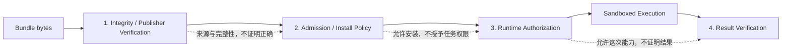
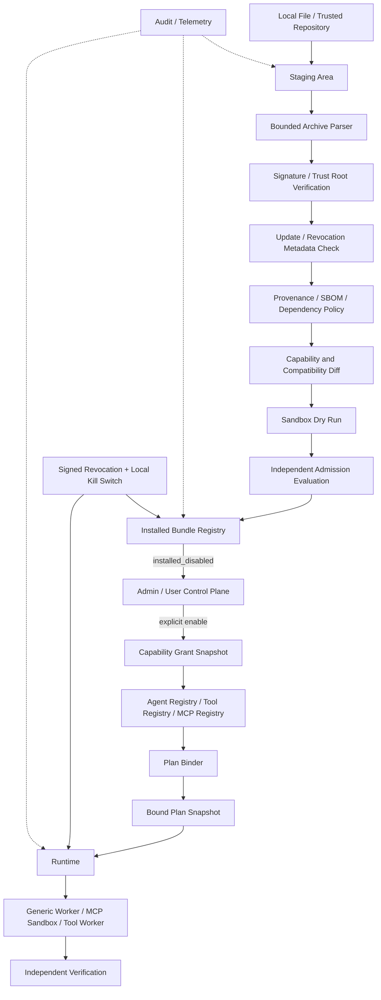
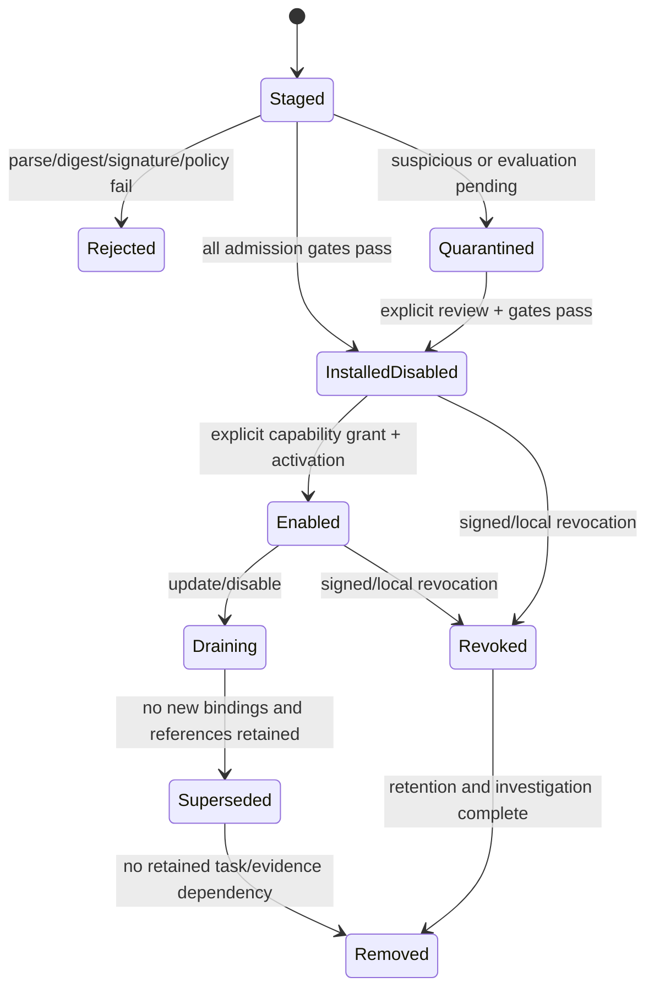

# 第三方 Agent 与插件供应链技术设计

## 1. 文档定位

本文细化 D8：DeskPilot 在固定内置 Agent 已通过阶段 75 后，怎样接收、验证、安装、隔离、启用、升级、撤销和卸载第三方 Agent、Prompt、MCP 与可执行 Tool 包。

本文当前状态是“候选详细设计，待用户确认关键取舍”。它不是在线插件市场、第三方 Agent Registry、签名验证器、安装器、更新器、SBOM 扫描、撤销服务或第三方代码沙箱已经实现的说明。D8 的实现窗口仍明确位于阶段 75 之后；阶段 67/68 已完成，当前工程断点为阶段 69 Task Contract/Plan Compiler。

本文依赖：

- [《多 Agent 系统总体架构》](多Agent系统总体架构.md)；
- [《Agent Contract 与 Agent Registry 技术设计》](Agent-Contract与Agent-Registry技术设计.md)；
- [《Agent Model Loop 与 Prompt Package 技术设计》](Agent-Model-Loop与Prompt-Package技术设计.md)；
- [《多 Agent Scheduler 与部署拓扑技术设计》](多Agent-Scheduler与部署拓扑技术设计.md)；
- [《多 Agent 跨层故障与恢复矩阵技术设计》](多Agent跨层故障与恢复矩阵技术设计.md)；
- [《多 Agent 评测与 CI 门禁技术设计》](多Agent评测与CI门禁技术设计.md)；
- [《多 Agent 用户控制面技术设计》](多Agent用户控制面技术设计.md)；
- [《工具、插件与 MCP 设计》](04-工具插件与MCP设计.md)。

最后一份早期文档中的插件目录是产品愿景，不是当前实现。本文对其做进一步约束：首版不得在安装阶段执行任意依赖安装脚本，也不得把第三方 Python 动态导入 API/Supervisor 进程。

## 2. 当前代码事实与真实缺口

### 2.1 已有可复用基础

当前工程已经具备：

- 固定内置 MCP stdio Server 的显式 enable/disable、manifest-bound 状态与 hash-chain Audit；
- MCP 启动前重新计算脚本 SHA-256，注册后文件变化即以 `MCP_SERVER_BUNDLE_REJECTED` 拒绝；
- MCP 短生命周期进程、临时 cwd、`python -I`、最小环境、帧大小与超时限制；
- Tool Contract、版本/digest 精确匹配、Policy Authorization、Capability Broker 和 Effect Ledger；
- Windows Runner/AppContainer、强制禁网、内容寻址 Worker Runtime、专用 capability ACL 与发布后复核；
- Provider adapter 的静态代码允许列表；配置不能通过 import path 或动态类名装入任意实现；
- Agent Contract/Registry、Prompt Package、精确 Plan binding 和 revoked 状态的候选设计；
- 版本化 Golden Suite、Evaluation Trace、趋势报告以及后续 D6 独立 Oracle/false-success 门禁设计。

这些能力可作为 D8 的局部构件，但不能被称为完整供应链。

### 2.2 尚未具备

当前没有：

1. 通用第三方 bundle 格式、安装器或本地 Installed Bundle Registry。
2. Publisher identity、信任根、签名阈值、密钥轮换或密钥失陷恢复。
3. 防 rollback、freeze、mix-and-match 的可信更新元数据。
4. 构建 provenance、SBOM、依赖锁、许可与漏洞策略。
5. 第三方 bundle 的 capability grant、升级权限 diff 与分级启用。
6. 第三方可执行代码专用 Worker pool、安装根 ACL 和发行代码签名闭环。
7. 包级 quarantine、revocation、drain、rollback 与任务恢复协议。
8. 第三方 Agent/Verifier 的独立评测 cohort 和供应链攻击 fixtures。
9. Python entry point、在线 marketplace 或运行时依赖下载机制。

当前 Runner bundle 的内容寻址、ACL 和 digest 能发现本地漂移并限制 AppContainer 读取范围，但 bundle 仍由当前 Windows 用户维护；它不能单独抵御同用户恶意进程，也不能证明发布者和构建来源。MCP 单脚本 SHA-256 同样只证明“和注册时相同”，不证明“来自谁、是否被撤销、是否为允许版本”。

## 3. 核心结论

1. 不建立一个无差别的“插件”类型；声明式 Agent、MCP Server、可执行 Tool、Provider adapter 和 UI extension 的风险边界不同。
2. 第一批只开放声明式 `Agent Bundle`：Contract、Prompt、Schema、Rubric 和评测资料，不携带可执行代码。
3. 安装真实性、安装准入、任务运行授权和结果正确性是四个独立判断；任何一个绿色状态都不能替代其余三个。
4. 签名证明特定身份对特定 digest 作过声明，不证明代码没有恶意行为，也不证明 Agent 输出正确。
5. `installed` 不等于 `enabled`；`enabled` 不等于获得 Tool 权限；Tool 调用仍逐次经过 Task Contract、Policy、Approval 和 Runner。
6. 所有版本不可变、内容寻址并可并存；Plan 激活时冻结精确 bundle/version/digest/grant/evaluation snapshot，运行时禁止 `latest`。
7. 第三方 Python/本机代码不得导入 API、Supervisor、Scheduler、Verifier 或前端主进程。
8. 第三方可执行包不得有 pre-install、post-install、migration shell 或运行时下载安装逻辑。
9. 依赖必须随包闭包化或由受信平台镜像解析为精确 digest；任务运行期间禁止联网解析或安装依赖。
10. Publisher 自带测试、SBOM、provenance 和 Verifier 都是输入证据，不是平台验收结论。
11. 同一包提供的 Agent 与 Verifier 不能共同构成该包安全 Claim 的唯一证据。
12. 远程更新不能只依赖单个 bundle 签名；必须使用成熟的防回滚/冻结更新框架，不能自行拼一个“近似 TUF”协议。
13. capability 只能逐层收敛，不能通过 Handoff、内置 Agent 代理或 Memory/RAG 间接洗白权限。
14. 撤销必须覆盖 publisher、key、bundle version、dependency、capability grant 和 runtime compatibility，并能在 marketplace 不可用时由本地控制面执行。
15. UI 必须分开展示“完整性通过、发布者受信、策略允许、评测通过、隔离可用、撤销元数据新鲜”，禁止合并成含糊的“已验证插件”徽章。
16. 在线市场不是首版前置条件。首版优先完成离线导入、受信根、禁用安装、显式启用、版本冻结和撤销。

## 4. 扩展类型与风险分层

| Bundle 类型 | 允许内容 | 执行位置 | 初始风险 | 首批开放 |
| --- | --- | --- | --- | --- |
| `agent.declarative` | Agent Contract、Prompt Package、I/O Schema、Rubric、示例与自测 | 平台可信 generic Agent Worker 解释 | 中 | 是 |
| `mcp.stdio` | 固定 Server artifact、Tool schemas、命令模板、资源声明 | 专用 MCP sandbox 进程 | 高 | 声明式稳定后 |
| `tool.executable` | Tool Contract、闭包化可执行 artifact、broker 协议 | 独立 Tool Worker pool/AppContainer | 很高 | 后置 |
| `provider.adapter` | 模型 Provider 协议 adapter | 独立 Adapter Host | 很高 | 后置且管理员级 |
| `ui.declarative` | 受限 schema/card 描述 | 平台可信 renderer | 中 | 可后续开放 |
| `ui.executable` | JavaScript/WebView/native UI | 不允许进入主 UI | 极高 | 非目标 |

“一个 bundle 同时包含 Agent、Provider adapter、任意 Python Tool 和 UI 脚本”会让权限展示、隔离、撤销和升级无法独立判断。首版要求一个 bundle 只有一个主类型；跨类型组合使用显式依赖图和分别授权的版本。

## 5. 四个彼此独立的信任问题



### 5.1 安装真实性与完整性

回答：字节是否匹配 manifest，签名身份是谁，签名/证书/透明日志材料是否有效，版本是否被撤销。

### 5.2 安装准入

回答：本机或组织策略是否接受该 publisher、bundle 类型、版本、provenance、依赖、许可、漏洞状态、平台兼容性和评测结果。

### 5.3 运行授权

回答：在这个 Task/Plan/Node/attempt 中，精确 Agent 是否可以读取这些 Context、调用这些 Tool、访问这些资源并向这些 Provider/域名出境。

### 5.4 结果验证

回答：Agent 的 Claim 是否被独立 Evidence/Oracle/Verifier 支持，最终验收条件是否覆盖。签名或沙箱成功不能把输出提升为事实。

## 6. 总体架构



远程仓库只提供候选 artifact 和签名元数据，不是本机运行真值。本机 Installed Bundle Registry、Capability Grant、Runtime Binding 与任务记录才是 authoritative。

## 7. 威胁模型

D8 至少覆盖：

- archive 路径穿越、绝对路径、重复路径、大小写碰撞、reparse/symlink、压缩炸弹和解析器资源耗尽；
- bundle 下载、缓存、安装目录或 manifest 被篡改；
- 恶意 publisher 正常签名恶意内容；
- publisher signing key、构建系统、registry、mirror 或透明日志密钥失陷；
- rollback、freeze、fast-forward、mix-and-match 和旧 metadata replay；
- dependency confusion、typosquatting、floating Git ref、native extension 与安装脚本；
- 签名主体与展示名称不一致，利用 UI 冒充官方包；
- 第三方代码越狱、读取凭据、继承环境、横向访问其他任务或 bundle；
- Agent prompt injection、Context 污染、Handoff capability laundering 和 Memory 污染；
- Publisher 自带 Verifier/Oracle 与 Agent 串谋制造 false success；
- 恶意日志、trace attribute、artifact preview 或 UI schema 进行数据外泄/界面欺骗；
- 升级 migration 偷取数据，或新版扩大网络、Tool、Memory、Provider egress 能力；
- 撤销服务离线、旧客户端时钟异常、同用户恶意进程回写安装目录；
- 取消/强制终止可执行插件后外部副作用处于 `unknown`。

不承诺单靠 sandbox 抵御 Windows 内核漏洞、管理员或已经完全攻陷的同用户控制面。发行版仍需应用代码签名、受保护安装根、可信更新链和更强的进程身份绑定。

## 8. Bundle 格式

建议格式名：

```text
deskpilot.bundle.v1
```

逻辑内容：

```text
bundle/
├── manifest.json
├── content/
│   └── ...
├── attestations/
│   ├── signature.bundle
│   ├── provenance.dsse
│   └── evaluation-summary.json
├── sbom/
│   └── sbom.spdx.json
└── docs/
    └── README.md
```

archive 只是运输容器。身份不能直接绑定 ZIP 的时间戳、文件顺序或压缩参数；受信主体是 canonical manifest 与 manifest 中完整文件表导出的 `bundle_subject_digest`。

### 8.1 Manifest 最小字段

```yaml
schema: deskpilot.bundle-manifest.v1
package_id: io.example.research-agent
package_version: 1.4.2
bundle_type: agent.declarative
publisher:
  identity: https://publisher.example/deskpilot
  namespace: io.example
runtime_compatibility:
  deskpilot_api: ">=1.0,<2.0"
  contract_schema: deskpilot.agent-contract.v1
  prompt_renderer: deskpilot.prompt-renderer.v1
platforms:
  - windows-x86_64
entry:
  agent_contract: content/agents/researcher.json
  prompt_package: content/prompts/researcher.json
files:
  - path: content/agents/researcher.json
    size: 1234
    sha256: "<sha256>"
requested_capabilities:
  tools: []
  handoff_targets: []
  memory_read_scopes: []
  rag_sources: []
  provider_egress_classes: ["public"]
  network_destinations: []
dependencies: []
resource_limits:
  max_context_tokens: 12000
  max_output_tokens: 3000
  max_wall_seconds: 60
attestations:
  provenance: attestations/provenance.dsse
  sbom: sbom/sbom.spdx.json
```

### 8.2 Manifest 还必须表达

- 包 ID、不可变版本、类型、展示名与 publisher namespace；
- DeskPilot API、Contract、Prompt Renderer、MCP/Tool protocol 的精确兼容范围；
- 每个文件的规范化相对路径、大小、媒体类型、SHA-256 和是否可执行；
- Agent/Tool/MCP/Provider 入口对象的精确路径与 digest；
- 请求的 Tool、Handoff、Memory、RAG、filesystem、network、secret、Provider 和 telemetry 能力；
- 数据分类上限、允许 egress 目标和目的；
- CPU、内存、进程、wall time、输入/输出/frame 等资源上限；
- 精确依赖版本和 digest，不接受 `latest`、分支名或未固定 URL；
- Sandbox profile、OS/architecture 和是否需要 native code；
- SBOM、provenance、license、evaluation attestation 的引用与 digest；
- release channel、supersedes 和兼容说明。

首版 manifest 不支持安装脚本、升级脚本、任意环境变量注入、任意 shell command、未声明文件发现或运行时依赖解析。

## 9. Canonical digest 与签名主体

### 9.1 Digest

`bundle_subject_digest` 由以下 canonical 对象计算：

```text
schema
package_id
package_version
bundle_type
publisher identity
normalized manifest payload
sorted file table(path, size, media_type, executable, sha256)
```

规则：

- JSON 使用项目统一 canonical JSON，而不是解析器默认序列化；
- 路径统一为 UTF-8、正斜线、相对路径，并拒绝 Unicode/大小写归一后碰撞；
- 文件表按 canonical path 排序；
- manifest 不得声明自身签名文件的循环 digest；
- 签名、证书链和透明日志 proof 是验证材料，不进入被签名 payload 的循环结构；
- Registry 同时保存 archive digest、subject digest 和逐文件 digest，但运行绑定使用 subject digest。

### 9.2 签名与 Attestation

不自行发明签名 envelope。候选方案使用 DSSE/in-toto Statement 表达 subject 与 predicate，并允许两种 verification profile：

1. 组织/离线 profile：由本机显式导入的 publisher root/key 验证。
2. 公共 publisher profile：验证携带证书、签名时间和透明日志材料的 Sigstore bundle。

Sigstore bundle 可以把签名、证书、时间戳和透明日志材料封装在一起并支持离线验证；但是否信任某个证书身份、OIDC issuer、log root 和签名时间仍由 DeskPilot policy 决定。透明日志包含 proof 也不等于内容安全。

## 10. 有界 Archive Parser

签名验证前也必须安全解析。Staging Parser 要求：

- 单包压缩大小、解压总大小、文件数、单文件大小和目录深度有硬上限；
- 拒绝绝对路径、`..`、空路径、设备名、ADS、控制字符和保留 Windows 名；
- 拒绝 symlink、hardlink、junction、reparse point 和特殊设备文件；
- 拒绝相同 canonical path、Unicode NFC 或 Windows case-fold 后碰撞；
- 实际文件必须与 manifest 完全相等，既不能缺少也不能多出未声明可执行内容；
- 先解压到随机 staging，逐文件流式 hash，不把整个包读入内存；
- staging 不可执行，验证完成前不得被 Registry 或 Runtime 解析；
- 成功后原子发布到内容寻址目录，失败或崩溃由 orphan reaper 回收。

## 11. Publisher identity 与信任根

### 11.1 身份与密钥分离

`PublisherIdentity` 是稳定主体；signing key 只是该主体在特定时间段的授权凭据。Registry 不能把 key fingerprint 当永久 publisher ID。

```text
PublisherTrustRecord
- publisher_identity
- namespace_prefixes
- trust_source
- allowed_bundle_types
- key_set / certificate_identity_policy
- signature_threshold
- valid_from / valid_until
- status
- revision
- trust_record_digest
```

### 11.2 信任根来源

允许：

- 随 DeskPilot 签名发行版内置的官方 root；
- 组织管理员导入并审计的组织 root；
- 用户显式导入的本地 publisher root，仅用于相应用户 profile；
- Developer Mode 独立的 unsigned/local root。

不允许：

- 可执行包默认 TOFU；
- 模型、Agent、Prompt 或 bundle 自己把 key 加入 trust store；
- 因 marketplace 页面有“热门/认证”徽章自动信任；
- publisher 签名自动获得任意 namespace 或包类型。

Root 更新本身必须由旧 root 与新 root 按阈值交叉验证并记录 Audit。密钥轮换、撤销、恢复和 namespace delegation 是信任控制面操作，不是普通 bundle 更新。

## 12. 远程仓库与可信更新元数据

单个签名 bundle 无法防止仓库持续提供一个仍有有效签名的旧版本。引入远程仓库时，应采用完整的 TUF 客户端语义或成熟实现，使用 Root、Targets、Snapshot、Timestamp 角色与持久化可信版本，防止：

- rollback：回退 metadata 或 bundle 版本；
- freeze：长期阻止客户端看到新撤销/更新；
- mix-and-match：组合不同时点的 targets metadata；
- fast-forward：攻击者把版本号推进到难以恢复的值；
- repository/mirror compromise。

关键规则：

1. 首版没有在线 marketplace 时，不实现“简化 TUF”；只做手动离线导入和明确的新鲜度提示。
2. 上线远程更新前，要么采用符合 TUF 客户端工作流的成熟库，要么继续关闭自动更新。
3. Metadata refresh、artifact download、install、evaluate 和 enable 是五个独立动作。
4. 缓存可信 metadata 及最高已见版本；时钟、expiry 和 metadata freshness 异常不得静默继续。
5. executable bundle 的撤销 metadata 超过本地 policy 允许的新鲜度时，默认禁止新激活；是否允许已绑定任务继续由风险级别和离线策略决定。
6. 本地管理员 emergency denylist 不依赖 marketplace 或远程 registry 可用。

TUF 的角色、阈值、版本和 expiry 是设计参考；本文不声称当前工程已经实现或符合 TUF。

## 13. Provenance、SBOM 与依赖证明

### 13.1 Provenance

候选使用 in-toto/SLSA provenance 表达：

- subject artifact digest；
- source repository 与精确 revision；
- build type、builder identity 与 build invocation；
- external/internal parameters；
- resolved dependencies；
- 构建时间与可复现/验证信息。

平台验证的是“provenance 满足本地期望”，不是“文件存在即通过”。必须把 publisher 身份、source namespace、builder identity、build type、subject digest 和允许参数与 policy 对照。

### 13.2 SBOM

首版接受固定版本的 SPDX JSON profile。SBOM 至少覆盖：

- 所有打包组件、版本、supplier、license 与 cryptographic digest；
- 直接和传递依赖关系；
- native binary/extension 与运行时依赖；
- SBOM 自身 schema/version/digest。

SBOM 与实际 files/dependency lock 交叉校验；仅上传一份 publisher 自报 SBOM 不能通过。漏洞扫描结果是带时间戳的观察，不是永恒安全证明。

### 13.3 依赖规则

- exact version + artifact digest；
- 不允许运行时访问公网包索引；
- 不允许 unpinned Git branch/tag 或 curl-pipe-shell；
- 不允许安装阶段执行 wheel/setup/npm lifecycle scripts；
- native dependency 自动提高风险并要求对应 OS sandbox；
- dependency namespace、来源和 digest 同时检查，降低 dependency confusion；
- 一个依赖被撤销时，可反向查询全部受影响 bundle/task。

## 14. Capability 模型

### 14.1 三层对象

```text
RequestedCapabilitySet  # bundle manifest 声明的最大请求
CapabilityGrant         # 管理员/用户对某版本实际授予的上限
EffectiveRuntimeGrant   # 某 Task/Node/attempt 的精确权限
```

有效权限至少为以下集合交集：

```text
manifest requested
∩ installed capability grant
∩ Agent/Tool Contract
∩ Task Contract
∩ local Policy
∩ exact Approval
∩ runtime/sandbox capability
∩ current revocation constraints
```

任意一层只能收窄。bundle 不能调用未声明能力，用户也不能通过普通启用页授予 manifest 外能力。

### 14.2 能力域

- Agent/Handoff：允许被选角色、handoff target、delegation depth、fan-out；
- Tool：Tool ID/version/digest、operation、risk ceiling；
- Filesystem：broker resource role、root token、read/write/move 等操作；
- Network：目的域/IP class、protocol、port、TLS/认证要求；
- Secret：凭据引用类型与具体 provider/account scope，不暴露原值；
- Model/egress：Provider class、数据等级、region 和用途；
- Context/Memory/RAG：collection、scope、classification、read/propose/delete；
- Process/device/UI：subprocess、clipboard、screen、browser、device affinity；
- Telemetry：只允许平台定义的 telemetry facade 事件，不允许任意 exporter。

首版第三方包不接受 `*` 通配符。大量离散目标要通过平台定义的 bounded capability class 表达。

### 14.3 Handoff 权限洗白防护

第三方 Agent 请求内置 Agent 执行 Tool 时：

- caller 只能提出 Handoff candidate；
- Supervisor 重新检查 Task goal、delegation envelope 和 callee Contract；
- callee 不继承 caller 未拥有的能力；
- caller 不能通过自然语言请求绕开受限 Tool；
- callee 输出仍返回 Claim/Evidence，不自动成为 caller 权限；
- Handoff 图中的有效权限不超过 Task/Plan 已冻结能力并集。

## 15. 权限与兼容性 Diff

安装和升级 UI 必须结构化显示：

- 新增/删除 Agent、Tool、MCP、Provider 和 Handoff edge；
- Prompt Package、system instruction、I/O Schema、Rubric 的 digest 变化；
- 文件读写范围、网络目的地、secret、Provider egress 与数据等级变化；
- sandbox profile、native code、资源预算变化；
- 新增依赖、license、漏洞和 provenance/build identity 变化；
- API/Schema compatibility 与是否影响旧 Plan resume；
- 平台 eval 相对基线的变化。

Capability 扩张、publisher identity 变化、签名 profile 降级、native code 新增或 sandbox 要求降低，都必须重新明确批准。仅版本号从 patch 变为 patch 不能跳过 diff。

## 16. Installed Bundle Registry

### 16.1 主要记录

```text
BundleVersionRecord
PublisherTrustRecord
SignatureVerificationRecord
RepositoryMetadataSnapshot
ProvenanceVerificationRecord
SbomSnapshot
DependencyGraphSnapshot
CapabilityGrant
AdmissionEvaluationAttestation
BundleLifecycleRecord
RevocationRecord
RuntimeBindingSnapshot
BundleUsageReference
```

### 16.2 BundleVersionRecord

```text
- package_id
- package_version
- bundle_type
- bundle_subject_digest
- archive_digest
- manifest_schema / manifest_digest
- publisher_identity
- verification_profile
- installed_content_root
- lifecycle_state
- admission_state
- compatibility_state
- revocation_state
- capability_grant_id / digest
- evaluation_attestation_id / digest
- source_repository_snapshot
- installed_at / installed_by
```

同一 `package_id@version` 出现不同 subject digest 是硬冲突，不允许覆盖。新 digest 必须使用新版本或被明确判定为 publisher 事故/攻击。

### 16.3 与 Agent Registry 的边界

Installed Bundle Registry 管理供应链事实。Agent Registry 只接收：

- lifecycle 为 enabled；
- admission、compatibility、revocation 均通过；
- capability grant 有效；
- 精确 Contract/Prompt digest 已解析；
- 当前平台支持相应 runtime isolation；
- eval attestation 仍满足 policy。

Agent Registry 不读取 staging 目录、不下载更新、不验证 publisher，也不执行 bundle。

## 17. 正交状态与生命周期

不要用一个 `verified` 布尔值表示全部状态。

### 17.1 Lifecycle

```text
staged
installed_disabled
enabled
draining
superseded
removed
```

### 17.2 Admission

```text
pending
passed
rejected
quarantined
```

### 17.3 Trust

```text
unverified
publisher_verified
trust_expired
key_revoked
publisher_revoked
```

### 17.4 Compatibility

```text
compatible
incompatible
runtime_isolation_unavailable
evaluation_stale
```

### 17.5 Revocation

```text
clear
advisory
block_new
terminate_at_safe_boundary
emergency_stop
```

Revocation 是最高优先级约束，可覆盖 lifecycle 的 enabled。UI 和 Runtime 读取服务端投影后的 `effective_availability`，不能只看 enabled。

## 18. 安装与启用流程



推荐 pipeline：

1. 将输入保存到不可执行随机 staging，并记录 source/actor/request digest。
2. 有界解析 archive，验证文件闭包、路径、大小和 digest。
3. 验证签名、publisher/namespace、签名时间、trust root 和 repository metadata。
4. 验证 provenance、SBOM、依赖、license、vulnerability 和兼容性。
5. 计算 requested capability 与当前版本的结构化 diff。
6. 在对应 sandbox 做不带用户凭据的 dry-run/health/contract probe。
7. 运行平台独立 admission suite；publisher self-test 仅作为附加项。
8. 将内容原子发布到 digest 目录，并事务写入 `installed_disabled` 记录。
9. 用户/管理员审阅 capability、egress、来源与 eval 后创建版本化 Grant。
10. 激活 Registry snapshot；仅新 Plan 可绑定。

安装成功 API 只能报告“已安装但禁用”。启用成功也只能报告“可被 Planner/Router 选择”，不能报告某任务已授权执行。

## 19. 原子边界与崩溃窗口

| 窗口 | 可观察状态 | 恢复规则 |
| --- | --- | --- |
| staging 写到一半崩溃 | 无 DB install record | orphan reaper 按 age 清除 |
| 文件验证后、原子 rename 前崩溃 | staging 完整但不可见 | 重验或回收，不能运行 |
| rename 后、DB transaction 前崩溃 | content root orphan | reaper 对照 Registry，保留后重建或删除 |
| DB installed 后、enable 前崩溃 | installed_disabled | 安全，无自动启用 |
| Grant 写入后、Registry publish 前崩溃 | enable intent pending | outbox 重放，幂等 publish |
| Registry publish 后、UI receipt 前崩溃 | 已启用 | 查询 command receipt/snapshot，不重复创建 Grant |
| revoke 写入后、worker 尚未看到 | 短暂竞态 | epoch/fence 检查在 dispatch 与执行前复核 |
| 强停可执行插件时外部 commit 不明 | effect unknown | 进入 D3 Reconciliation，不以撤销覆盖事实 |

运行时绝不从 staging 或 mutable package path 执行。Registry publish、Grant 与 Audit 使用事务/outbox；文件系统原子 rename 与数据库不可能单事务，因此必须有 orphan reconciliation。

## 20. Runtime binding 与版本冻结

`RuntimeBindingSnapshot` 至少包含：

```text
- task_id / plan_id / plan_generation / node_id
- package_id / package_version / bundle_subject_digest
- entry_id / contract_digest / prompt_package_digest
- capability_grant_id / grant_digest
- admission_evaluation_id / evaluation_digest
- trust_root_version / repository_metadata_version
- sandbox_profile / runtime_image_digest
- bound_at
```

规则：

- DraftPlan 只能提出 package/agent selector；受信 Plan Binder 精确解析；
- 新 Plan 不绑定 disabled/draining/revoked/expired bundle；
- Resume 必须重取旧 binding 并复核 digest，不解析 `latest`；
- 非安全更新不改写已经激活的 Plan；
- 旧版本在有可恢复 Task、Audit、Evidence retention 引用时不能物理删除；
- critical revocation 可阻止旧 Plan resume，但必须把原因投影为 revoked，而非伪装成普通 version mismatch。

## 21. 各类型 Runtime 隔离

### 21.1 声明式 Agent

- 由平台可信 generic Agent Worker 读取已验证 Contract/Prompt；
- bundle 不包含 importable Python、native library、shell 或 template code；
- Prompt Renderer 使用平台固定版本和结构化 segment；
- 第三方 instruction 的优先级低于平台 system/policy/runtime instruction；
- Agent Decision 只能使用平台定义的 discriminated union；
- Context、Tool、Handoff 和 Result 全走现有受信接口。

声明式并不等于安全：恶意 Prompt 仍可能诱导数据外泄或错误调用，因此照常受 Context Builder、Policy、Verifier 和 eval 约束。

### 21.2 MCP stdio

- 独立 AppContainer/等价 sandbox 进程；
- immutable bundle read-only mount、ephemeral cwd、环境 allowlist；
- 默认无网络、无 roots、无 sampling/elicitation/tasks；
- 精确 command template，用户输入只能进入 schema 参数；
- stdout 仅协议，stderr/structured output 限长并作为不可信 artifact；
- 每调用或 bounded session 有 timeout、CPU、内存、process 和 frame quota；
- Tool list/schema/digest 漂移触发 disable/review；
- 凭据通过 broker handle 注入，不通过通用环境变量。

当前阶段 64 的短进程 MCP 是可复用原型，但第三方 MCP 还需要真实 OS sandbox、signed bundle 和 Registry/revocation。

### 21.3 可执行 Tool

- 专用 Tool Worker pool，不与 Agent Model Worker 共进程；
- 不导入 API/Supervisor；
- per-call/短生命周期 sandbox，最小 token、无继承 handle、禁网默认；
- filesystem/network/secret 只通过 brokered capability；
- prepared/commit/receipt/unknown 继续使用现有 Effect Runtime；
- 安装 bundle、runtime image 和 Tool Contract digest 三者精确绑定；
- executable/native code 只在受支持 OS 隔离 profile 上启用。

### 21.4 Provider adapter

Provider adapter 可看到高价值凭据和 Context egress，风险高于普通声明式 Agent。候选要求：

- 独立 Adapter Host；
- 凭据只以 scoped handle 提供；
- 目的域、TLS、模型 identity、region 和数据分类受 Policy；
- 不得加载进 API 或复用普通 Tool sandbox；
- 仅管理员可信 publisher 可安装；
- 首批第三方生态不开放。

### 21.5 UI extension

首版仅允许平台 renderer 支持的 declarative card/schema，字段、action 和 URI 都有 allowlist。禁止任意 JavaScript、WebView bridge、native DLL 或自定义 CSS 覆盖安全文案。

## 22. Agent 通讯与第三方边界

第三方 Agent 不获得新的通讯通道：

- Agent 之间仍只经持久化 Handoff、Artifact、Evidence 和 Supervisor；
- 不允许包内私有 socket、共享内存、文件 dropbox 或直连另一 Agent；
- Handoff 输入按 schema、classification、size、source 和 digest 验证；
- 对方输出是 untrusted Claim，不直接写 active Memory 或 Task truth；
- 第三方包不能注册自己的 Supervisor、Scheduler、Policy Engine 或主 reducer；
- Agent 自带 “Verifier” 只能作为 specialist candidate，平台独立 Verifier/Oracle 仍有最终拒绝权；
- 同 publisher 的多个 Agent 一致不算独立证据。

## 23. Context、Memory 与 RAG

第三方 bundle 的数据能力必须单独声明：

```text
context.read: task/current
artifact.read: collection + classification
memory.read: scope + purpose
memory.propose: scope
rag.query: source_ids + max_chunks + classification
provider.egress: provider_class + max_classification
```

默认不允许：

- 读取完整 Conversation 或所有长期 Memory；
- 写 active Memory；
- 使用摘要把 Tool 权限、Approval 或完成状态带到新任务；
- 把检索原文写入普通日志/telemetry；
- 跨用户、跨 workspace 或跨任务发现资源 ID；
- 利用 Memory proposal 保存 secret、审批或未经验证的 Claim。

Context Manifest 记录 bundle/agent identity、每个 Context item 的 source/trust/classification/digest 和提供目的。用户删除 Memory/RAG 后继续遵守 D7 的 deletion propagation 与诚实远程删除语义。

## 24. Secret 与数据出境

- Manifest 只能声明 secret reference 类型，不能包含 secret 值；
- Grant 绑定具体 provider/account/workspace scope；
- Worker 获得短期 handle，不获得凭据库或数据库访问权；
- network destination 与 secret grant 联合校验，防止凭据被发送到未授权域；
- Provider/MCP/Tool egress 都记录目的类别、数据分类、request digest 和 approval，不记录原文；
- bundle 不得自带 telemetry exporter 或自定义外传端点；
- 失效、禁用、撤销时立即撤销新 handle，轮换策略由 Credential Manager 管理。

## 25. 更新、升级与 Canary

### 25.1 更新不是覆盖

新版本安装到新的 digest root，旧版本保持不可变。更新流程：

```text
metadata discovered
→ candidate downloaded
→ installed_disabled
→ capability/compatibility diff
→ independent eval
→ optional shadow/canary
→ explicit promote
→ old version draining
```

### 25.2 自动化边界

初始建议：

- 可自动刷新签名 metadata；
- 可按设置自动下载到 staging；
- 不自动 enable executable bundle；
- capability expansion、publisher/trust profile 变化必须人工确认；
- 声明式 Agent 的无能力扩张 patch 版本，也要先通过 eval，可由组织 policy 决定是否自动 promote；
- 任何 update failure 保留当前已验证版本，不进行 mutable rollback。

### 25.3 Migration

首版禁止 bundle 自带任意 migration code。可持久化数据只能使用平台拥有的版本化 schema 与声明式迁移操作；无法表达的迁移需新建平台功能或人工导出/导入，不能把数据库凭据交给插件。

## 26. 撤销

`RevocationRecord` 可针对：

- publisher identity；
- signing key/certificate identity；
- package ID 全部版本；
- 精确 bundle version/digest；
- dependency artifact digest；
- capability grant；
- runtime/sandbox/platform compatibility；
- admission evaluation attestation。

字段至少包括：

```text
- revocation_id
- target_type / target_identity / target_digest
- severity
- reason_code
- effective_at
- issued_at / expires_at
- issuer / signature_material
- superseded_by
- metadata_snapshot_id
- local_override
```

### 26.1 Severity 语义

| 级别 | 新 Plan | 排队/运行任务 | 处理 |
| --- | --- | --- | --- |
| advisory | 可按 policy | 继续 | 提示并建议升级 |
| block_new | 禁止 | 已运行可到安全边界 | drain |
| terminate_at_safe_boundary | 禁止 | 请求暂停/取消 | 保留可恢复证据 |
| emergency_stop | 禁止 | 立即撤销 capability 并强停 | 外部 effect 可能 unknown，进入对账 |

撤销不得删除 bundle、Audit 或 Evidence，以免破坏调查与旧任务解释。删除是独立 retention 操作。

## 27. Rollback、卸载与保留

Rollback 是重新 promote 一个以前已经验证、未撤销、仍兼容的不可变版本，不是覆盖当前文件。Rollback 仍需：

- 检查当前 Task/Schema 数据是否兼容；
- 比较 capability；
- 复用原 evaluation attestation 前检查其 policy/freshness；
- 生成新的 activation revision 和 Audit。

Uninstall 前查询：

- active/paused/unknown/reconciliation Task；
- retained Plan/RuntimeBinding；
- Evidence/Audit/Golden baseline；
- 其他 bundle dependency；
- investigation/legal retention。

有引用时进入 disabled/draining/superseded，不能物理删除。最终删除后保留不含内容原文的 tombstone、identity、digest、revocation 与 Audit。

## 28. 独立评测与 CI 门禁

### 28.1 评测层次

1. 结构/Contract 测试：schema、manifest、I/O、capability、兼容性。
2. Publisher self-test：仅作不可信附加输入。
3. 平台 admission suite：由 DeskPilot 运行并签发 attestation。
4. 安全/对抗 suite：prompt injection、egress、resource abuse、sandbox 与权限洗白。
5. 任务 cohort：每个 package/version 独立 baseline，不继承内置 Agent 的黄金结果。
6. Upgrade/revocation/recovery suite：旧 Plan resume、drain、rollback、kill 和 unknown。

### 28.2 必备供应链 fixtures

- 文件改一字节、manifest/file table 不一致；
- 错误签名、未知 root、过期证书、撤销 key、错误 namespace；
- rollback/freeze/mix-and-match/过期 metadata；
- 路径穿越、绝对路径、symlink/reparse、case collision、zip bomb；
- SBOM 缺依赖、provenance subject 不匹配、builder 不受信；
- floating dependency、dependency confusion、安装脚本和动态下载；
- capability expansion 被伪装为 patch update；
- 第三方代码尝试 import 进 API、访问 DB/凭据、出网或跨任务读文件；
- Agent 让高权限内置 Agent 代做未授权操作；
- Agent 与自带 Verifier 串谋 false success；
- telemetry/log 输出 secret 或高基数内容；
- 旧 Task 精确绑定旧版本、旧版本撤销、drain 与安全终止；
- 安装/enable/revoke 各崩溃窗口与幂等重放。

### 28.3 Gate 原则

- authenticity、policy、isolation、evaluation 分别 gate；
- 关键 false-success、sandbox escape、secret leakage、capability laundering 失败不可 quarantine；
- package 自带 expected result 不能充当 External Oracle；
- 新版本完整跑自己的 cohort；不能只测修改案例；
- admission attestation 与 DeskPilot release attestation 分开；
- baseline 的 record/review/approve/compare 继续遵守 D6 显式流程。

## 29. Audit、Telemetry 与隐私

必须 Audit：

- trust root/publisher/key 导入、轮换、撤销；
- bundle stage/verify/reject/quarantine/install/enable/disable/update/rollback/revoke/remove；
- capability diff、Grant 创建/修改/撤销；
- provenance/SBOM/eval verdict 与 policy revision；
- Plan 绑定、Runtime dispatch 拒绝和 critical revocation 处理。

普通 OTel 只允许通过平台 Telemetry Facade：

- trace 可记录 tokenized package ID、bundle type、trust/admission class 和稳定 error code；
- metrics 使用低基数 bundle type/trust class，不以任意 package/version/publisher 作 label；
- package stdout/stderr、Prompt、Tool result 和 artifact preview 都是受控不可信 artifact，不直接进入日志；
- 第三方包不能注册 exporter、processor、sampler 或自定义任意 attribute；
- Audit/Registry 中的 digest 也不自动出境。

## 30. API 与用户控制面

候选 API：

```text
POST /api/v1/bundles/stage
GET  /api/v1/bundles
GET  /api/v1/bundles/{package_id}/versions/{version}
GET  /api/v1/bundles/{package_id}/versions/{version}/diff
POST /api/v1/bundles/{package_id}/versions/{version}/install
POST /api/v1/bundles/{package_id}/versions/{version}/enable
POST /api/v1/bundles/{package_id}/versions/{version}/disable
POST /api/v1/bundles/{package_id}/versions/{version}/rollback
POST /api/v1/bundles/{package_id}/versions/{version}/remove
GET  /api/v1/bundles/revocations
POST /api/v1/bundles/revocations/refresh
GET  /api/v1/publishers
POST /api/v1/publishers/trust-roots/import
```

所有 mutation 使用 actor、idempotency key、expected revision、preview digest 与 command receipt。高风险 trust root、executable enable、capability expansion 和 emergency override 要求管理员权限及再次确认。

### 30.1 详情页必须展示

- 来源 repository/local file、publisher identity、namespace；
- package/version/subject digest、签名 profile、签名时间；
- trust root、metadata freshness、revocation 状态；
- provenance builder/source revision、SBOM、依赖、license、漏洞扫描时间；
- requested/granted/effective capability；
- network/secret/Provider egress 与数据分类；
- sandbox profile 和本机是否真实支持；
- independent eval suite/version/result/baseline；
- 当前使用该版本的 Task、Plan 和依赖包；
- update diff、drain、rollback、remove 的影响。

徽章必须分开：

```text
完整性通过
发布者受信
本地策略允许
独立评测通过
所需隔离可用
撤销信息新鲜
```

## 31. 稳定错误分类

| Code | 含义 |
| --- | --- |
| `BUNDLE_ARCHIVE_REJECTED` | archive 结构、路径或大小非法 |
| `BUNDLE_CONTENT_MISMATCH` | 文件闭包/digest 与 manifest 不一致 |
| `BUNDLE_SIGNATURE_INVALID` | 签名或验证材料无效 |
| `BUNDLE_PUBLISHER_UNTRUSTED` | publisher/trust root/namespace 不被接受 |
| `BUNDLE_TRUST_METADATA_EXPIRED` | 更新/撤销 metadata 不满足新鲜度 |
| `BUNDLE_ROLLBACK_DETECTED` | 检测到版本/metadata 回退 |
| `BUNDLE_PROVENANCE_REJECTED` | provenance 不存在、不匹配或 builder 不受信 |
| `BUNDLE_SBOM_REJECTED` | SBOM 与文件/依赖闭包不一致 |
| `BUNDLE_DEPENDENCY_REJECTED` | 依赖未固定、冲突、撤销或不满足策略 |
| `BUNDLE_CAPABILITY_EXPANSION_REQUIRES_REVIEW` | 更新扩大权限 |
| `BUNDLE_SANDBOX_UNAVAILABLE` | 本机缺少要求的隔离 |
| `BUNDLE_ADMISSION_EVALUATION_FAILED` | 平台独立评测未通过 |
| `BUNDLE_VERSION_DIGEST_CONFLICT` | 同 ID/版本出现不同 digest |
| `BUNDLE_NOT_ENABLED` | 已安装但不可被绑定 |
| `BUNDLE_REVOKED` | bundle/key/publisher/dependency 已撤销 |
| `BUNDLE_RUNTIME_BINDING_MISMATCH` | 恢复/执行时精确 binding 不一致 |
| `BUNDLE_IN_USE` | 保留/活动引用阻止删除 |
| `BUNDLE_INSTALL_RECOVERY_REQUIRED` | 文件与 DB 发布窗口需要对账 |

错误详情不回显绝对路径、签名原文、证书 token、secret、Prompt 或插件 stderr。

## 32. 推荐实施阶段

D8 位于阶段 75 之后，建议再拆：

### D8-A：声明式离线 Bundle

- manifest/canonical digest；
- bounded parser；
- Agent/Prompt only；
- Installed Bundle Registry；
- installed_disabled/explicit enable；
- capability grant/diff；
- 精确 Plan binding；
- 不含签名时只允许隔离 Developer Mode。

### D8-B：Publisher trust 与签名

- trust roots、namespace、DSSE/Sigstore verification；
- key rotation/revocation；
- protected content-addressed install root；
- package/admission Audit。

### D8-C：Provenance、SBOM 与独立 admission eval

- SLSA/in-toto policy；
- SPDX profile、dependency lock；
- vulnerability/license snapshot；
- package cohort 与 CI。

### D8-D：第三方 MCP

- signed MCP bundle；
- dedicated sandbox；
- brokered secret/network/root；
- schema drift、health、resource quota 和 revocation。

### D8-E：可执行 Tool

- closure bundle；
- 独立 Tool Worker pool；
- OS isolation、Effect Runtime、unknown/reconciliation；
- sandbox escape/egress 对抗门禁。

### D8-F：可信远程仓库与更新

- 完整 TUF client workflow；
- metadata refresh/freshness；
- canary/drain/rollback；
- offline cached revocation 与本地 kill switch。

### D8-G：Provider adapter 与声明式 UI

- Adapter Host；
- 高价值 secret/egress policy；
- declarative UI extension；
- 仍不开放任意前端脚本。

## 33. 不采用的替代方案

### 33.1 直接使用 Python entry points

优点是开发简单，缺点是导入即执行、依赖与主进程混合、卸载/升级困难、无法可靠隔离和撤销。对本项目的安全目标不成立。

### 33.2 一个签名 ZIP 就视为可信

只能发现内容是否匹配签名，不能防恶意 publisher、旧签名版本 replay、仓库冻结、依赖/构建失陷和错误输出。

### 33.3 安装时创建 venv 并 pip install

会执行不受控构建/安装逻辑、访问包索引、引入 dependency confusion 和不可重现状态。首版禁止。

### 33.4 所有扩展都按 MCP

MCP 是调用协议，不是 publisher trust、Agent Contract、Prompt Package、SBOM、更新和结果验收协议；把所有问题塞进 MCP 会隐藏真实边界。

### 33.5 所有扩展都按容器

容器有利于隔离和分发，但不自动提供 publisher trust、最小 capability、Prompt/Agent schema、桌面 AppContainer 兼容、结果验证或用户权限 diff。

### 33.6 Marketplace 审核替代本地 Policy

远程审核可能过期、失陷或与用户数据边界不同。Marketplace verdict 只能作为 admission 输入，本机有最终拒绝权。

### 33.7 多数 Agent/Verifier 投票

同 publisher、同模型、同 Prompt 或同依赖会产生相关性错误；多数票不构成独立 Evidence。

## 34. 验收矩阵

1. 声明式 Agent bundle 不包含可执行代码，generic Worker 才执行 Model Loop。
2. 同 ID/版本不同 digest 启动/安装均 fail closed。
3. archive 穿越、symlink、case collision 和 zip bomb 在签名前有界拒绝。
4. 未受信 publisher、错误 namespace、错误/过期/撤销签名被拒绝。
5. manifest、SBOM、provenance 和实际文件闭包相互不一致时被拒绝。
6. 安装完成保持 disabled；无 Grant 不能进入 Agent/Tool/MCP Registry。
7. capability expansion 必须生成结构化 diff 和新确认。
8. 第三方 Agent 无法通过 Handoff 借用未授权能力。
9. Agent/Verifier 同源串谋 fixture 被 External Oracle/false-success gate 拒绝。
10. Plan 绑定精确 bundle/grant/eval/runtime digest，更新不改写旧 Plan。
11. 正常更新并存、canary、drain、rollback 不覆盖旧 bytes。
12. key/bundle/dependency revocation 阻止新 dispatch，并按 severity 处理在途任务。
13. emergency stop 后不明外部 effect 进入 Reconciliation，而非宣称已回滚。
14. 安装各崩溃窗口可幂等恢复且永不从 staging 执行。
15. 可执行包不能导入 API/Supervisor，sandbox 缺失时 fail closed。
16. secret 只以 scoped handle 进入 sandbox，network destination 联合复核。
17. bundle 不能注册 exporter 或把原文写入普通 telemetry。
18. 远程更新上线前通过 rollback/freeze/mix-and-match fixtures。
19. 仍有 Task/Plan/Evidence 引用的版本不能物理删除。
20. UI 分开显示 authenticity、policy、evaluation、isolation 和 freshness。

## 35. 非目标

当前候选设计不包括：

- 阶段 75 前开放第三方 Agent；
- 在线插件商店、评分、支付或商业分成；
- Agent 自行搜索、下载、安装、升级或复制插件；
- 进程内第三方 Python、native DLL 或 JavaScript；
- 任意安装/迁移脚本；
- 允许 package 自定义 Policy Engine、Supervisor、Scheduler、主 Verifier 或 Telemetry exporter；
- 把 Publisher self-test、SBOM、签名、sandbox 或多数投票当正确性证明；
- 承诺在完全离线且撤销 metadata 过期时仍拥有最新全局撤销信息；
- 声称当前 Runner/MCP digest 已构成发行供应链。

## 36. 待确认的关键取舍

1. 首批是否严格只开放 `agent.declarative`，MCP 放到 D8-D。
2. 远程仓库上线前是否坚持“完整 TUF 实现或不自动更新”。
3. 公共 publisher 是否以 Sigstore bundle 为主，组织内以离线 root/key profile 为主。
4. trust metadata 过期时，声明式与可执行包分别采取 block-new 还是完全 fail closed。
5. executable bundle 是否只在 Windows AppContainer 能力完整时开放，其他平台暂不支持。
6. 声明式 patch 更新在无 capability expansion 且全套 eval 通过时，组织 policy 是否可自动 promote。
7. SBOM 首版是否固定 SPDX JSON 单一 profile，避免同时支持多套宽松解释。
8. 漏洞严重度、license 和 provenance level 的默认 admission policy。
9. 本地 Developer Mode 是否使用独立 Registry root/profile，并默认禁止真实副作用和 secret。
10. Publisher namespace delegation 和 root threshold 的具体管理 UX。
11. critical revocation 对已运行外部 Tool 的 safe-boundary/emergency-stop 默认策略。
12. 物理 bundle retention 与可恢复 Task/Audit/Evidence 的最长期限。

## 37. 与官方规范的关系

本文参考但尚未声称符合：

- [The Update Framework Specification](https://theupdateframework.github.io/specification/latest/)：Root/Targets/Snapshot/Timestamp、阈值签名、版本/过期、防 rollback/freeze/mix-and-match；
- [Sigstore Bundle Format](https://docs.sigstore.dev/about/bundle/)：签名、证书、时间戳、透明日志材料与离线验证封装；
- [SLSA v1.2 Specification](https://slsa.dev/spec/v1.2/)：source/build provenance、artifact verification 与 verified properties；
- [in-toto Specifications](https://in-toto.io/docs/specs/)：attestation Statement/Predicate/Envelope；
- [SPDX Specifications](https://spdx.dev/use/specifications/)：SBOM 标准模型。

采用某个格式不等于获得其最高安全等级。真正的承诺必须由具体 verification policy、密钥管理、builder、更新客户端、沙箱、评测 fixtures 和发行审计共同证明。

## 38. 与后续工作的接口

D8 设计完成后，D1～D9 已形成候选技术框架，但仍不是最终 ADR。跨文档决策已经整理到[《多 Agent 跨文档决策收敛矩阵》](多Agent跨文档决策收敛矩阵.md)；D9 已用于通用对话、联网研究与 Artifact 工作区，不再无编号横向添加“大组件”：

1. 汇总所有待确认取舍，识别冲突与依赖；
2. 固定身份、digest、state、error code 和 authoritative store 的统一术语；
3. 把确认项转成 ADR 与阶段 69～75 验收条目；
4. 保持阶段 67 先行，不因设计文档齐全而跳过遥测/回归基线门禁；
5. D8 实施继续保持在阶段 75 之后。
